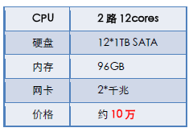
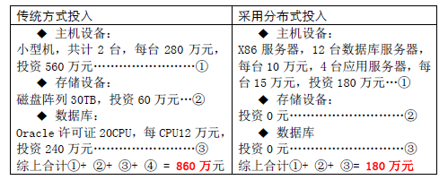

## [转载] Oracle的购买价格研究  
        
### 作者                                                                        
digoal                                                                                                                 
                          
### 日期                                                                                                                 
2020-03-25                                                                                                             
                                                                                                                 
### 标签                                                                                                                 
PostgreSQL , Oracle    
                     
----               
                          
## 背景    
# 原文  
https://www.cnblogs.com/ouyida3/p/4295381.html  
  
# 第一章  
如果你是一个架构师，在数据库选型上除了技术选型，更重要的可能是性价比的选择，而oracle是现今排名第一的数据库，因此对oracle的价格有所了解是必须的。  
  
   
几个要点：  
  
1、oracle授权（也就是购买方式）有两种，一是按用户数，二是按cpu；  
  
2、按用户数是指连接到oracle的连接数量（包括自然人的连接或机器的连接），但是，现在一般都是B/S的web或者手机端应用，很难算得清多少用户，所以用户数就按最大的并发数来算我觉得就OK了。需要注意的是：这里不是说我只通过一个中间件服务器来连oracle，把连接池调成100，这样就算一个用户，oracle没这么傻！  
  
3、按cpu的话就是无限用户了，如果一个cpu多核的话，那就算多个cpu，但是并不是1核=1cpu，核比cpu便宜点，具体要看是什么牌子的cpu，计算方法看官方；  
  
4、如果你用户很多，比如12306网站，全国10亿人去访问，那你按用户数购买就肯定赔死你了，当然按cpu购买好；具体哪个好要计算过，一个1cpu的价格=50users的价格；  
  
5、最便宜的5users的是1万元左右；最便宜的1cpu大概是20万元；  
  
6、购买了，安装好了后，我想换服务器，要重新付钱吗？按用户数的肯定不要，按cpu的就要看情况了；  
  
7、一般oracle的东西都是很贵的，所以基本都是有折扣的，特别如果你是大客户的话。像我公司，一买就买了15000users，注意，是1万5啊！按20万50用户，那15000不得6000万？？？没有折扣那是不可能的。  
  
8、每个公司都必须有个开发环境，该环境肯定也得安装一个oracle，那么这种情况下需要买吗？我觉得这个就好比你在本机安装个来学习一样，又不是在生产环境商用，你懂的。  
  
9、如果你购买了oracle，一般肯定也要购买服务，oracle收费很贵，也不太屑于赚这种钱（7*24小时，很累的），技术支持在中国有很多的公司，比如：http://www.gzbosheng.com/这家是一家小的不能再小的公司了（北京这种公司更多），一共就20个人（基本上一个人就服务一个公司，就完成一笔订单了），但是如果你公司无法（或懒得）聘请一个oracle dba，那还是得购买这种公司的服务。  
  
10、这种授权还有期限，可以购买1年、2年、N年等。  
  
   
  
推荐几篇文章：  
  
[彻底看懂Oracle License 许可机制 - Oracle购买前必读](http://www.chinastor.com/a/db/oracle/0G01962010.html)  
  
[oracle11g价格和相关产品问题](http://wenku.baidu.com/link?url=U3XZdifrNkZ05oi08m_9tHUmSeEufYTsTTE3aRHfZ_OYZjCLVfuVARfO4WRTQFRKWyEzrSwtEwXx3mGpIEey84BVRpE9A7R7QTTGEO5jB3m)  
  
[oracle 12c报价单 oracle价格](http://blog.sina.com.cn/s/blog_7011178f0102vavn.html)  
  
[oracle报价表](http://wenku.baidu.com/link?url=rlMydlEjUFO3D8GD0YpL-Pk7D-lxBVF2-v0xaZEdQxmum2H6s7sVj8cmX8Xurv8MU1r6eQbOYBpwNTq_V0Ha8VSWIlmHvIKHJTD6cfdSLIy)  
  
[oracle价格报价单](http://www.docin.com/p-526222870.html)  
  
[Oracle 购买价格和服务费计算方式](http://blog.csdn.net/haiross/article/details/38557277)  
  
[Oracle数据库如何授权收费（Database Licensing）](http://www.ha97.com/5419.html)  
  
   
  
LAST：虽然我很讨厌oracle，但是没办法，他暂时是最厉害的数据库，公司也在用他，所以还是得必须研究他为他写文章。  
  
# 第二章  
## 本章重点  
上一篇写的都是网上的资料、理论研究。本文主要根据实际的企业描述说明。  
  
## 我所在的项目  
我所在的项目一直用oracle，用了大概有15年以上了，听说最近有可能转mysql，所以赶紧记录一下。  
我不是负责Database，所以咨询了一些同事。下面是对话的摘要。  
  
**我问开发组长**  
组长：只知道买了第三方的维护，其他要问问DBA。  
  
**我问DBA**  
关于License  
DBA：oracle是需要买license的，但不一定是每年都要交钱，比如每2年交个150万那样子。交了钱之后，连接数是不限制的，2万、3万个连接都可以。  
关于服务：  
以前是分公司每年买oracle的服务，现在是集团总部统一买。但是无论谁买，我们都必须再买一个第三方公司的oracle服务，我们买的是博盛，大概每年不到200万就把省和全省各个城市的分公司包了。买国内的第三方肯定比oracle便宜。oracle的服务主要是当你发现了bug，提交给他，他会帮你修复，比如刚发现了dblink的一个bug，oracle10g已停止更新，但因为你买了他的服务，发现了bug他还会为你更新修复。  
  
**我问架构师**  
架构师：公司用的oracle的license是按CPU来买的，买了一次可以永久使用，但是限制连接数，大概是15000个连接。其他的不太清楚，要问DBA。  
  
**我问系统平台管理员**  
平台管理员：oracle的License是免费的，只是服务要钱而已。  
我：商用怎么会免费呢？  
平台管理员（很生气的回答）：现在就是免费的。官网上不会写出来，但实际就是免费的！  
  
#我的理解  
我更倾向同意DBA的回答，一来感觉他很有学识，而且逻辑性更强。  
也就是一个公司要使用oracle，需要付出五个部分的钱：  
1. 要买oracle的License  
2. 要买oracle的服务  
3. 要买第三方的oracle维护  
4. 自己公司要出一个数据库管理员  
5. 项目外包给乙方，乙方也得有一个DBA的角色  
从现在看来，我们公司每年用oracle的成本是400万左右。（只是很粗略的估计）  
当然，用mysql也只是省了第一部分的钱，后面那4部分不见得一定能省多少。  
  
   
  
# 第三章  
##请先阅读  
  
前两章。  
  
##再阅读  
今天，从某公司的技术杂志《XXXX互联网最佳实践》里的文章《从ORACLE到MYSQL--后棱镜门时代的分布式数据库应用新方向》文章里看到了关于oracle的价格，这个绝对是真实的数据，所以贴出来参考。  
  
每台x86价格：  
  
  
用小型机与用x86的价格对比：  
  
  
可以看出，oracle是需要购买许可License的，比较流行的一种购买是根据cpu购买，这个和我上一篇文章里我公司架构师说的一致。而价格每cpu是12万。  
  
x86单论机器的话，其实不比小型机便宜多少。但是省去了EMC的存储，才知道这么贵，2万元一个T！（平常买个硬盘1T不才1000元么？）Oracle的许可就更贵了，几百万买个许可。难怪要用mysql，难怪要去ioe。  
  
   
  
本文出处:   
  
http://www.cnblogs.com/ouyida3/p/4295381.html  
  
Dennis3于2015.2月~3月  
  
  
  
  
  
  
  
  
  
  
  
  
  
  
  
  
  
  
  
  
  
  
  
  
  
  
  
  
  
  
  
  
  
  
  
  
  
  
  
  
  
  
  
  
  
  
  
  
  
  
  
  
  
  
#### [PostgreSQL 许愿链接](https://github.com/digoal/blog/issues/76 "269ac3d1c492e938c0191101c7238216")
您的愿望将传达给PG kernel hacker、数据库厂商等, 帮助提高数据库产品质量和功能, 说不定下一个PG版本就有您提出的功能点. 针对非常好的提议，奖励限量版PG文化衫、纪念品、贴纸、PG热门书籍等，奖品丰富，快来许愿。[开不开森](https://github.com/digoal/blog/issues/76 "269ac3d1c492e938c0191101c7238216").  
  
  
#### [9.9元购买3个月阿里云RDS PostgreSQL实例](https://www.aliyun.com/database/postgresqlactivity "57258f76c37864c6e6d23383d05714ea")
  
  
#### [PostgreSQL 解决方案集合](https://yq.aliyun.com/topic/118 "40cff096e9ed7122c512b35d8561d9c8")
  
  
#### [德哥 / digoal's github - 公益是一辈子的事.](https://github.com/digoal/blog/blob/master/README.md "22709685feb7cab07d30f30387f0a9ae")
  
  

  
  
#### [PolarDB 学习图谱: 训练营、培训认证、在线互动实验、解决方案、生态合作、写心得拿奖品](https://www.aliyun.com/database/openpolardb/activity "8642f60e04ed0c814bf9cb9677976bd4")
  
  
#### [购买PolarDB云服务折扣活动进行中, 55元起](https://www.aliyun.com/activity/new/polardb-yunparter?userCode=bsb3t4al "e0495c413bedacabb75ff1e880be465a")
  
  
#### [About 德哥](https://github.com/digoal/blog/blob/master/me/readme.md "a37735981e7704886ffd590565582dd0")
  
