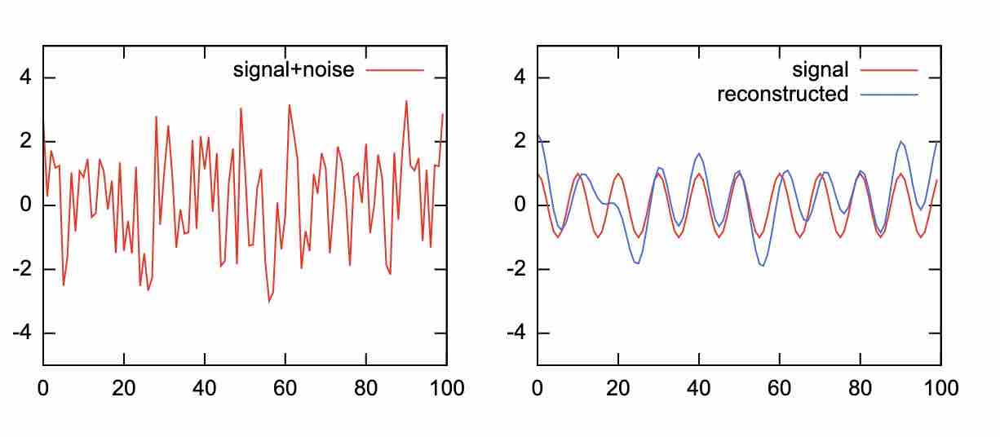

## PostgreSQL 把GSL库植入数据库 - GNU Scientific Library (GSL)    
            
### 作者                                                                                                                                                                    
digoal                                                                                                                                                                                                                                                                                      
### 日期                                                                                                                                                                                                             
2020-03-26                                                                                                         
### 标签                                                                                                                                                                                                             
PostgreSQL , GNU Scientific Library (GSL)                     
                                                                                                                 
----                                                                                                           
                                                                                                                      
## 背景        
This Postgresql extension primarily provides wrapper functions for functions from the GNU Scientific Library (GSL) http://www.gnu.org/software/gsl/. Additional useful functions are provided to work with the wrapper functions.    
    
This first release provides wrappers for 2 of the GSL functions, the same methods could be applied to many of the remaining 1900+ GSL functions.    
    
The GSL library uses the system malloc(), free(), realloc() and calloc() functions and can be used with the pg_gsl extension. It is also possible to modify the GSL library to use the Postgresql memory management function palloc(), pfree() and repalloc(), details on how to make these changes is given in the later section 'Using Postgresql memory management'.    
    
This first release wraps 2 of the 1900+ GSL functions:    
    
```    
pg_gsl_fft_real_transform(double precision[]) returning double precision[]    
```    
    
To return the transform of the input time series as the amplitudes of a series of sine and cosine waves.    
    
```    
pg_gsl_fft_halfcomplex_inverse(double precision[]) returning double precision[]    
```    
    
To return the re-constructed input time series from a set of sine and cosine waves    
    
2 functions have been added to work with the retuned set of cosine and sine ways from pg_gsl_fft_real_transform():    
    
```    
pg_gsl_x_fftToSpectrum(double precision[]) returning double precision[]    
```    
    
To return the normalised spectrum    
    
```    
pg_gsl_x_fftTruncate(double precision[], n integer) returning double precision[]    
```    
    
To replace the last n sine and cosine waves with zeros (filtering out the higher frequencies).    
    
and finally a function to return the extension version:    
    
```    
pg_gsl_x_version() returns text      
```    
      
例如信号和噪音叠加后的信号还原处理    
    
    
  
https://github.com/ferndalehall/pg_gsl  
  
https://www.gnu.org/software/gsl/doc/html/fft.html  
  
http://linux.math.tifr.res.in/manuals/html/gsl-ref-html/gsl-ref_15.html  
    
  
  
  
  
  
  
  
  
  
  
  
  
  
  
  
  
  
  
  
  
  
  
  
  
  
  
  
  
  
  
  
  
  
  
  
  
  
  
  
  
  
  
  
  
  
  
  
  
  
  
  
  
  
#### [PostgreSQL 许愿链接](https://github.com/digoal/blog/issues/76 "269ac3d1c492e938c0191101c7238216")
您的愿望将传达给PG kernel hacker、数据库厂商等, 帮助提高数据库产品质量和功能, 说不定下一个PG版本就有您提出的功能点. 针对非常好的提议，奖励限量版PG文化衫、纪念品、贴纸、PG热门书籍等，奖品丰富，快来许愿。[开不开森](https://github.com/digoal/blog/issues/76 "269ac3d1c492e938c0191101c7238216").  
  
  
#### [9.9元购买3个月阿里云RDS PostgreSQL实例](https://www.aliyun.com/database/postgresqlactivity "57258f76c37864c6e6d23383d05714ea")
  
  
#### [PostgreSQL 解决方案集合](https://yq.aliyun.com/topic/118 "40cff096e9ed7122c512b35d8561d9c8")
  
  
#### [德哥 / digoal's github - 公益是一辈子的事.](https://github.com/digoal/blog/blob/master/README.md "22709685feb7cab07d30f30387f0a9ae")
  
  

  
  
#### [PolarDB 学习图谱: 训练营、培训认证、在线互动实验、解决方案、生态合作、写心得拿奖品](https://www.aliyun.com/database/openpolardb/activity "8642f60e04ed0c814bf9cb9677976bd4")
  
  
#### [购买PolarDB云服务折扣活动进行中, 55元起](https://www.aliyun.com/activity/new/polardb-yunparter?userCode=bsb3t4al "e0495c413bedacabb75ff1e880be465a")
  
  
#### [About 德哥](https://github.com/digoal/blog/blob/master/me/readme.md "a37735981e7704886ffd590565582dd0")
  
