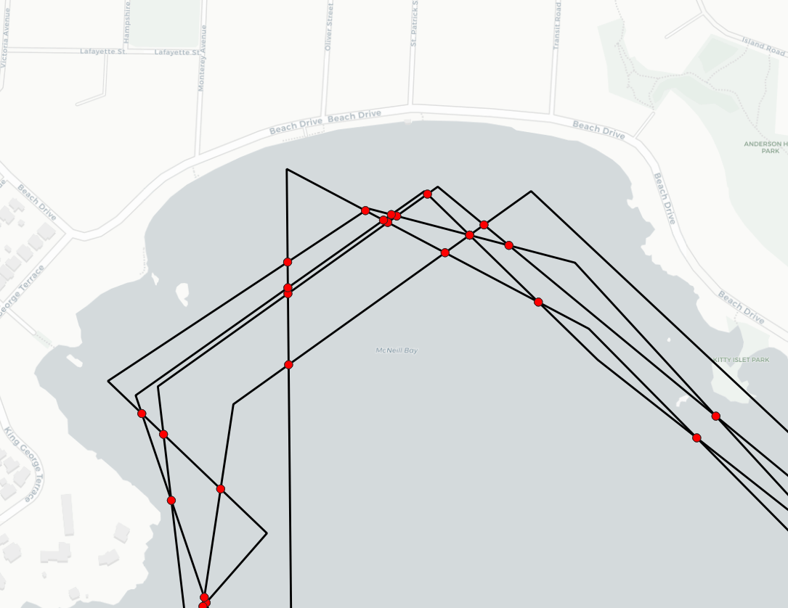
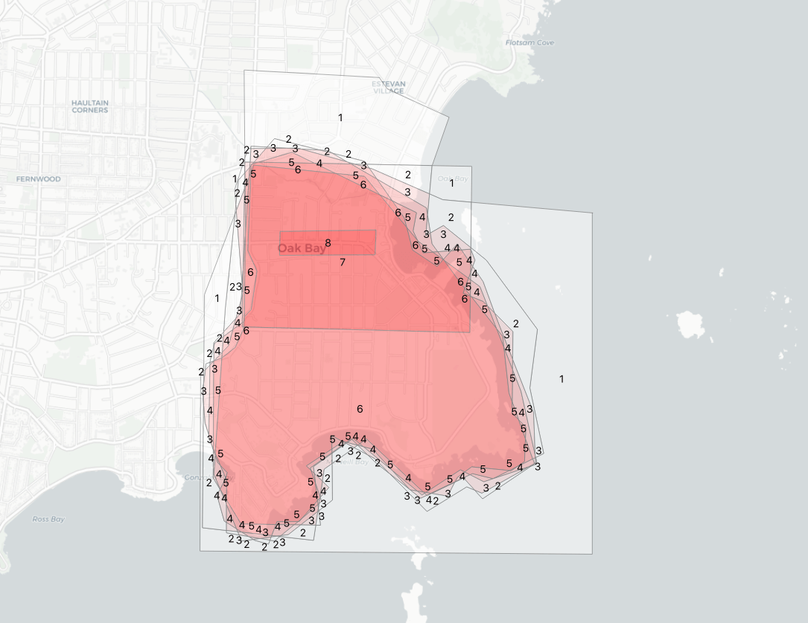
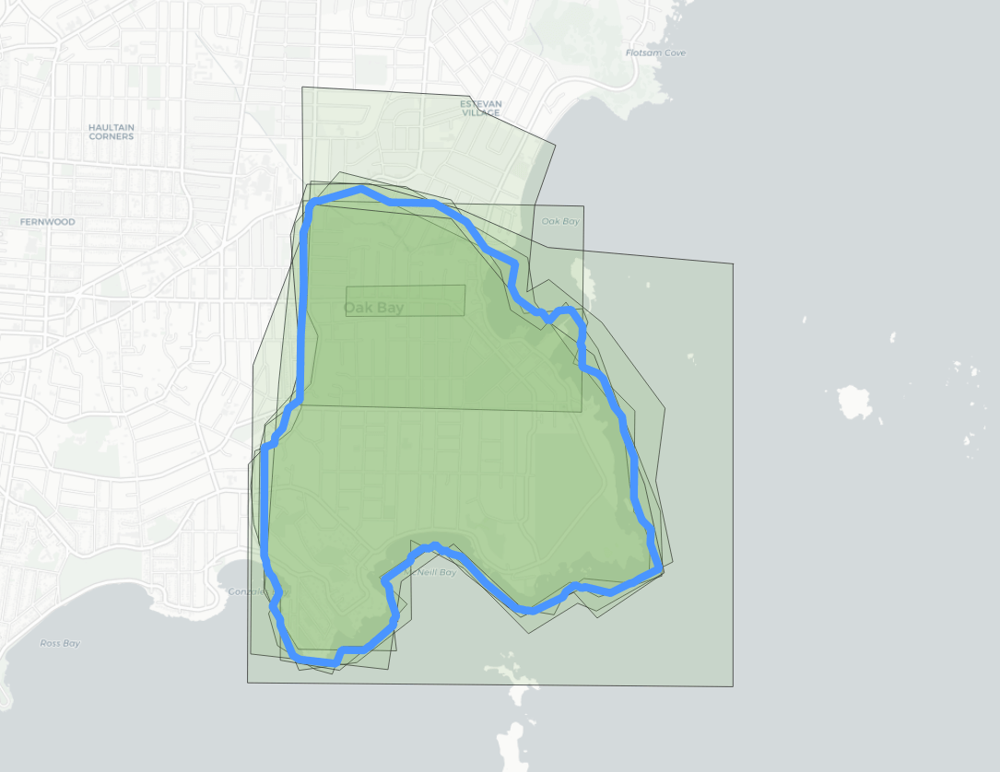
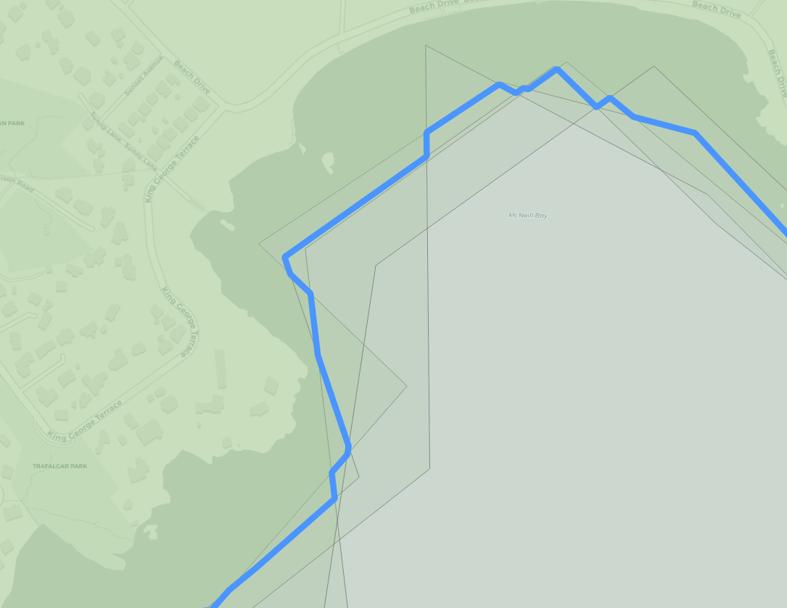

## PostgreSQL Polygon Averaging in PostGIS - 多边形叠加统计  
      
### 作者      
digoal      
      
### 日期      
2020-04-12      
      
### 标签      
PostgreSQL , postgis , 多边形 , 叠加 , 统计    
      
----      
      
## 背景      
https://info.crunchydata.com/blog/polygon-averaging-in-postgis  
    
Let's say we received polygons from 10 users. If we used ST_Intersection on those polygons, the remaining polygon would only represent the points included in all 10 polygons. If we used ST_Union, the output would represent the points included in at least 1 polygon.  
  
Can anyone recommend a way to output a polygon that represents the points that are in n polygons, where n is greater than 1 and less than the total number of polygons (10 in this case)?  
  
这个问题是要知道在多个多边形叠加后, 在多边形内取一个点, 这个点到底被多少个多边形覆盖到了, 切出一个个的面, 每个面有多少个多边形叠加.   
  
  
  
```  
WITH   
edges AS   
  ( SELECT  
    (ST_Dump(  
     ST_UnaryUnion(  
     ST_Collect(  
     ST_ExteriorRing(p.geom))))).geom  
  FROM polygons p )  
```  
  
This requires a few functions:  
  
- [ST_ExteriorRing](https://postgis.net/docs/ST_ExteriorRing.html) to get the polygon boundary,  
- [ST_UnaryUnion](https://postgis.net/docs/ST_UnaryUnion.html) to mash all the rings together and break them at crossing points, and S  
- [ST_Dump](https://postgis.net/docs/ST_Dump.html) to convert the output of the union (a multi-linestring) back into one row per geometry.  
  
  
  
```  
parts AS (  
  SELECT (ST_Dump(ST_Polygonize(geom))).geom FROM edges  
)  
  
  
parts_count AS (  
  SELECT parts.geom, count(*)  
  FROM parts  
  JOIN polygons p  
  ON ST_Intersects(p.geom, ST_PointOnSurface(parts.geom))  
  GROUP BY parts.geom  
)  
```  
  
  
  
```  
SELECT ST_Union(geom) AS geom, 4 as count  
FROM parts_count  
WHERE count > 4  
```  
  
  
  
```  
CREATE TABLE average AS  
WITH  
edges AS (  
    SELECT (ST_Dump(ST_UnaryUnion(ST_Collect(ST_ExteriorRing(p.geom))))).geom  
    FROM polygons2 p  
),  
parts AS (  
    SELECT (ST_Dump(ST_Polygonize(geom))).geom FROM edges  
),  
parts_count AS (  
    SELECT parts.geom, count(*)  
    FROM parts  
    JOIN polygons2 p  
    ON ST_Intersects(p.geom, ST_PointOnSurface(parts.geom))  
    GROUP BY parts.geom  
)  
SELECT ST_Union(geom) AS geom, 4 as count  
FROM parts_count  
WHERE count > 4  
```  
  
  
  
  
  
  
  
  
  
  
  
  
  
  
  
  
  
  
  
  
  
  
  
  
  
  
  
  
  
  
  
  
  
  
  
  
  
  
  
  
  
  
  
  
  
  
  
  
  
  
  
  
  
  
  
  
#### [PostgreSQL 许愿链接](https://github.com/digoal/blog/issues/76 "269ac3d1c492e938c0191101c7238216")
您的愿望将传达给PG kernel hacker、数据库厂商等, 帮助提高数据库产品质量和功能, 说不定下一个PG版本就有您提出的功能点. 针对非常好的提议，奖励限量版PG文化衫、纪念品、贴纸、PG热门书籍等，奖品丰富，快来许愿。[开不开森](https://github.com/digoal/blog/issues/76 "269ac3d1c492e938c0191101c7238216").  
  
  
#### [9.9元购买3个月阿里云RDS PostgreSQL实例](https://www.aliyun.com/database/postgresqlactivity "57258f76c37864c6e6d23383d05714ea")
  
  
#### [PostgreSQL 解决方案集合](https://yq.aliyun.com/topic/118 "40cff096e9ed7122c512b35d8561d9c8")
  
  
#### [德哥 / digoal's github - 公益是一辈子的事.](https://github.com/digoal/blog/blob/master/README.md "22709685feb7cab07d30f30387f0a9ae")
  
  

  
  
#### [PolarDB 学习图谱: 训练营、培训认证、在线互动实验、解决方案、生态合作、写心得拿奖品](https://www.aliyun.com/database/openpolardb/activity "8642f60e04ed0c814bf9cb9677976bd4")
  
  
#### [购买PolarDB云服务折扣活动进行中, 55元起](https://www.aliyun.com/activity/new/polardb-yunparter?userCode=bsb3t4al "e0495c413bedacabb75ff1e880be465a")
  
  
#### [About 德哥](https://github.com/digoal/blog/blob/master/me/readme.md "a37735981e7704886ffd590565582dd0")
  
