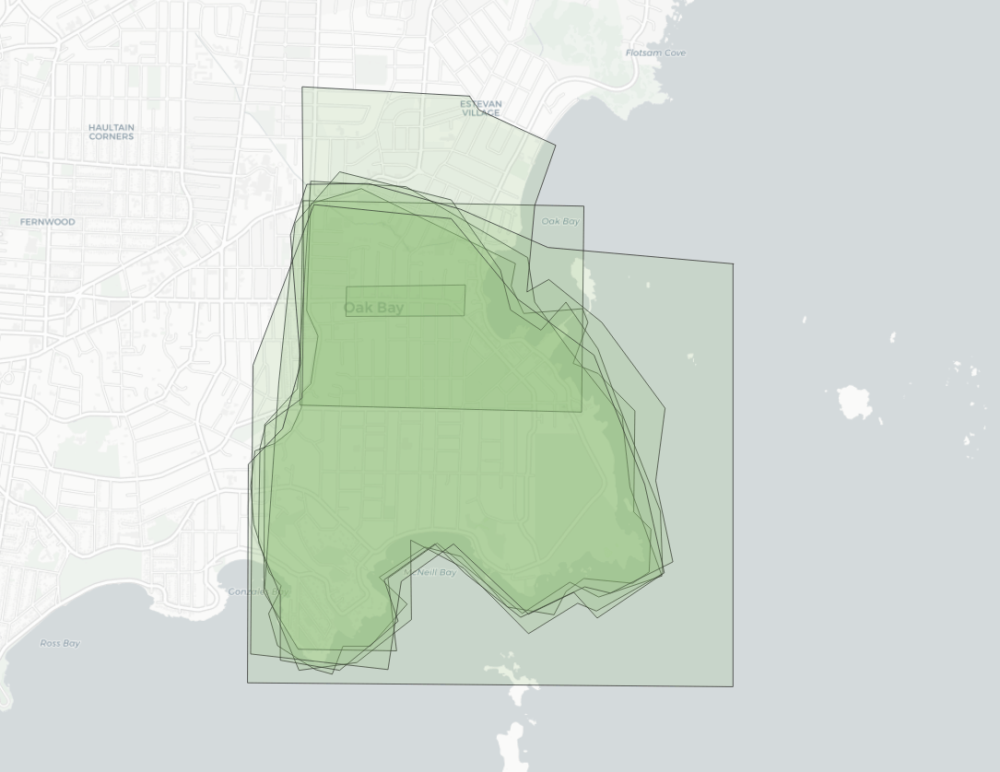

## PostgreSQL Polygon Averaging in PostGIS - 多边形叠加统计  
      
### 作者      
digoal      
      
### 日期      
2020-04-12      
      
### 标签      
PostgreSQL , postgis , 多边形 , 叠加 , 统计    
      
----      
      
## 背景      
https://info.crunchydata.com/blog/polygon-averaging-in-postgis  
    
Let's say we received polygons from 10 users. If we used ST_Intersection on those polygons, the remaining polygon would only represent the points included in all 10 polygons. If we used ST_Union, the output would represent the points included in at least 1 polygon.  
  
Can anyone recommend a way to output a polygon that represents the points that are in n polygons, where n is greater than 1 and less than the total number of polygons (10 in this case)?  
  
这个问题是要知道在多个多边形叠加后, 在多边形内取一个点, 这个点到底被多少个多边形覆盖到了, 切出一个个的面, 每个面有多少个多边形叠加.   
  
  
  
```  
WITH   
edges AS   
  ( SELECT  
    (ST_Dump(  
     ST_UnaryUnion(  
     ST_Collect(  
     ST_ExteriorRing(p.geom))))).geom  
  FROM polygons p )  
```  
  
This requires a few functions:  
  
- [ST_ExteriorRing](https://postgis.net/docs/ST_ExteriorRing.html) to get the polygon boundary,  
- [ST_UnaryUnion](https://postgis.net/docs/ST_UnaryUnion.html) to mash all the rings together and break them at crossing points, and S  
- [ST_Dump](https://postgis.net/docs/ST_Dump.html) to convert the output of the union (a multi-linestring) back into one row per geometry.  
  
  
  
```  
parts AS (  
  SELECT (ST_Dump(ST_Polygonize(geom))).geom FROM edges  
)  
  
  
parts_count AS (  
  SELECT parts.geom, count(*)  
  FROM parts  
  JOIN polygons p  
  ON ST_Intersects(p.geom, ST_PointOnSurface(parts.geom))  
  GROUP BY parts.geom  
)  
```  
  
  
  
```  
SELECT ST_Union(geom) AS geom, 4 as count  
FROM parts_count  
WHERE count > 4  
```  
  
  
  
```  
CREATE TABLE average AS  
WITH  
edges AS (  
    SELECT (ST_Dump(ST_UnaryUnion(ST_Collect(ST_ExteriorRing(p.geom))))).geom  
    FROM polygons2 p  
),  
parts AS (  
    SELECT (ST_Dump(ST_Polygonize(geom))).geom FROM edges  
),  
parts_count AS (  
    SELECT parts.geom, count(*)  
    FROM parts  
    JOIN polygons2 p  
    ON ST_Intersects(p.geom, ST_PointOnSurface(parts.geom))  
    GROUP BY parts.geom  
)  
SELECT ST_Union(geom) AS geom, 4 as count  
FROM parts_count  
WHERE count > 4  
```  
  
  
  
  
#### [免费领取阿里云RDS PostgreSQL实例、ECS虚拟机](https://www.aliyun.com/database/postgresqlactivity "57258f76c37864c6e6d23383d05714ea")
  
  
#### [digoal's PostgreSQL文章入口](https://github.com/digoal/blog/blob/master/README.md "22709685feb7cab07d30f30387f0a9ae")
  
  

  
