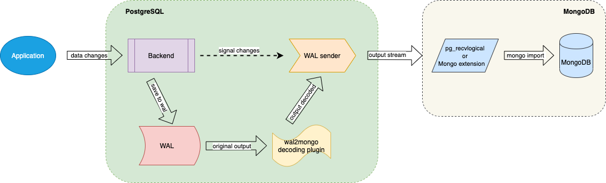
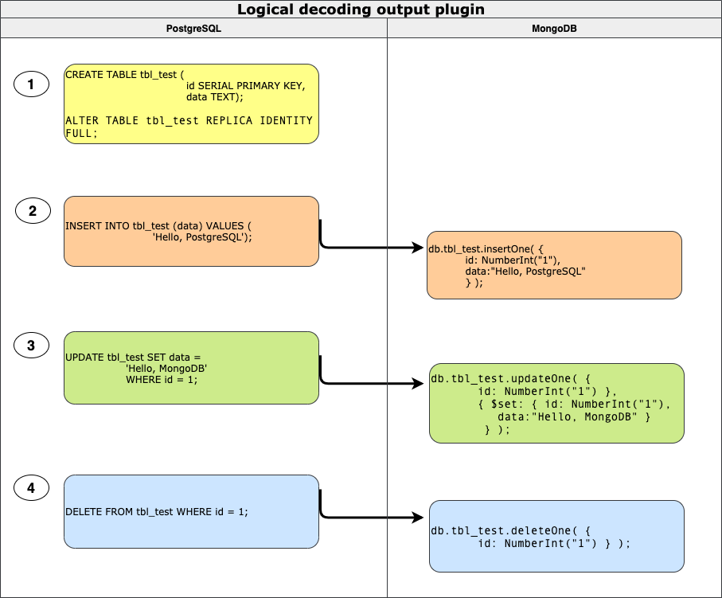

## PostgreSQL to mongo 逻辑订阅 wal2mongo   
  
### 作者  
digoal  
  
### 日期  
2020-04-23  
  
### 标签  
PostgreSQL , mongo , wal2mongo , 逻辑订阅    
  
----  
  
## 背景  
翰高发布PG to mongo的准实时同步逻辑decoder, 支持将PG的增量数据同步到mongodb. PG目前的逻辑订阅生态在逐步成熟, 跨产品的数据流动会越来越便利.     
  
  
  
  
  
https://github.com/HighgoSoftware/wal2mongo    
  
https://www.highgo.ca/2020/04/17/replicate-multiple-postgresql-servers-to-a-single-mongodb-server-using-logical-decoding-output-plugin/    
  
  
#### [免费领取阿里云RDS PostgreSQL实例、ECS虚拟机](https://www.aliyun.com/database/postgresqlactivity "57258f76c37864c6e6d23383d05714ea")
  
  
#### [digoal's PostgreSQL文章入口](https://github.com/digoal/blog/blob/master/README.md "22709685feb7cab07d30f30387f0a9ae")
  
  

  
