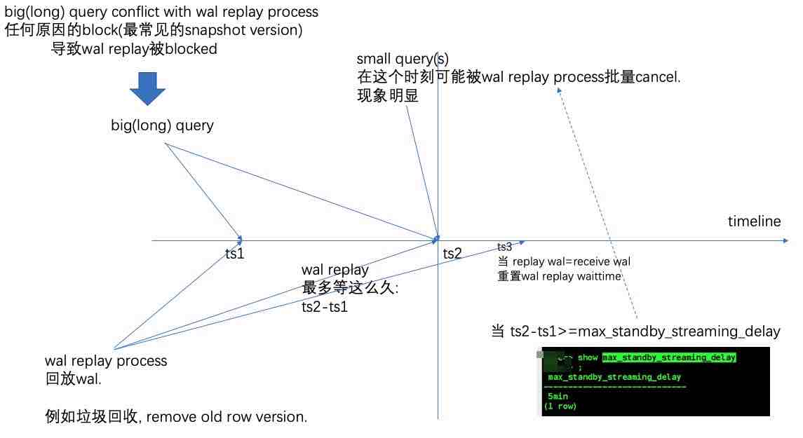

## PostgreSQL standby conflict replay分析和解决方案  
  
### 作者  
digoal  
  
### 日期  
2020-05-18  
  
### 标签  
PostgreSQL , replay , standby , wal , 冲突 , conflict   
  
----  
  
## 背景  
```  
terminating connection due to conflict with recovery  
```  
  
使用只读库时, 查询时偶尔可能会遇到这种报错. 具体是什么原因造成的?  
  
1、查询冲突次数  
  
```  
xxxx=> select * from pg_stat_database_conflicts ;  
 datid |  datname  | confl_tablespace | confl_lock | confl_snapshot | confl_bufferpin | confl_deadlock   
-------+-----------+------------------+------------+----------------+-----------------+----------------  
 13287 | postgres  |                0 |          0 |              0 |               0 |              0  
 16397 | xxxx      |                0 |          1 |          97765 |              50 |              0  
     1 | template1 |                0 |          0 |              0 |               0 |              0  
 13286 | template0 |                0 |          0 |              0 |               0 |              0  
(4 rows)  
```  
  
每种冲突的含义:  
  
src/backend/tcop/postgres.c  
  
```  
/*  
 * errdetail_recovery_conflict  
 *  
 * Add an errdetail() line showing conflict source.  
 */  
static int  
errdetail_recovery_conflict(void)  
{  
        switch (RecoveryConflictReason)  
        {  
                case PROCSIG_RECOVERY_CONFLICT_BUFFERPIN:  
                        errdetail("User was holding shared buffer pin for too long.");  
                        break;  
                case PROCSIG_RECOVERY_CONFLICT_LOCK:  
                        errdetail("User was holding a relation lock for too long.");  
                        break;  
                case PROCSIG_RECOVERY_CONFLICT_TABLESPACE:  
                        errdetail("User was or might have been using tablespace that must be dropped.");  
                        break;  
                case PROCSIG_RECOVERY_CONFLICT_SNAPSHOT:  
                        errdetail("User query might have needed to see row versions that must be removed.");  
                        break;  
                case PROCSIG_RECOVERY_CONFLICT_STARTUP_DEADLOCK:  
                        errdetail("User transaction caused buffer deadlock with recovery.");  
                        break;  
                case PROCSIG_RECOVERY_CONFLICT_DATABASE:  
                        errdetail("User was connected to a database that must be dropped.");  
                        break;  
                default:  
                        break;  
                        /* no errdetail */  
        }  
  
        return 0;  
}  
```  
  
```  
  /*  
   * Walreceiver is active, so see if new data has arrived.  
   *  
   * We only advance XLogReceiptTime when we obtain fresh  
   * WAL from walreceiver and observe that we had already  
   * processed everything before the most recent "chunk"  
   * that it flushed to disk.  In steady state where we are  
   * keeping up with the incoming data, XLogReceiptTime will  
   * be updated on each cycle. When we are behind,  
   * XLogReceiptTime will not advance, so the grace time  
   * allotted to conflicting queries will decrease.  
   */  
  if (RecPtr < receivedUpto)  
          havedata = true;  
  else  
  {  
          XLogRecPtr      latestChunkStart;  
  
          receivedUpto = GetWalRcvWriteRecPtr(&latestChunkStart, &receiveTLI);  
          if (RecPtr < receivedUpto && receiveTLI == curFileTLI)  
          {  
                  havedata = true;  
                  if (latestChunkStart <= RecPtr)  
                  {  
                          XLogReceiptTime = GetCurrentTimestamp();  
                          SetCurrentChunkStartTime(XLogReceiptTime);  
                  }  
          }  
          else  
                  havedata = false;  
  }  
```  
  
  
## confl_snapshot 分析  
standby有个wal replay进程在进行wal回放, 如果回放过程中有query和回放的内容发生了冲突, 那么wal回放会进行等待, 等多久呢? 最久决定于max_standby_streaming_delay参数.  
  
当等待超过这个时间时, wal replay会cancel与之有冲突的所有query, 然后开始恢复, 并且必须要恢复到wal receive的位置和wal replay位置一致状态后才会重置max_standby_streaming_delay等待时间, 没有到达这个状态前, 所有与wal replay有冲突的query都会被直接cancel(不再有query执行窗口), 所以cancel query可能会很频繁的出现.     
  
  
  
找到 standby节点的big query(甚至也可能是有snapshot的idle transaction), 分析big query是否可以优化变成small query  
  
  
解决方案. 建议采用1、5, 副作用最小:    
  
1、ro节点设置statement_timeout, 小于max_standby_streaming_delay, 不要让一个query堵塞一堆query.   
副作用:   
- 某些query可能会超时报错.   
  
使用例子:  
  
```
statement_timeout=5s
lock_timeout=10s

psql postgresql://localhost:1921/postgres?options="-c statement_timeout%3D5s -c lock_timeout%3D10s"
```
  
[《PostgreSQL 连接串URI配置(libpq兼容配置)》](../201709/20170912_01.md)    
  
2、区分大查询和小查询, 分开使用不同standby节点  
如果有大查询, 和小查询分开, 不要放在同一台ro节点查询.  
如果有大查询, 特别是人工发起的大查询, 不要和小查询混到一个ro节点查询.   
  
3、设置更大的max_standby_streaming_delay参数, 让big query有更长的执行时间.  
副作用:   
- replay delay会变长, 从库的查询延迟变大.  
  
4、修改ro节点参数hot_standby_feedback=on, 只要ro库有查询, 就会返回snapshot xid给主库, 主库的垃圾回收进程不会回收这个垃圾.  
副作用:  
- 当从库有big(long) query时, 主库IO暴增, 垃圾回收进程空转, 显示为表有垃圾, autovacuum发起扫描表垃圾, 但是回收不掉(因为从库依赖这些垃圾版本), 导致大量无用IO.  
- 当从库有big(long) query时, 主库表膨胀, 因为某些时刻更多的垃圾无法被及时回收, 导致膨胀.    
  
5、如果是standby本身资源问题导致delay, 那么建议查看standby节点的网络带宽、cpu、io能力是否存在瓶颈. 该加资源就加资源.    
  
  
## 参考  
[《PostgreSQL DBA最常用SQL》](../202005/20200509_02.md)    
  
https://www.postgresql.org/docs/12/hot-standby.html#HOT-STANDBY-CONFLICT  
    
  
  
  
  
  
  
  
  
  
  
  
  
  
  
  
  
  
  
  
  
  
  
  
  
  
  
  
  
  
  
  
  
  
  
  
  
  
  
  
  
  
  
  
  
  
  
  
  
  
  
  
  
  
#### [PostgreSQL 许愿链接](https://github.com/digoal/blog/issues/76 "269ac3d1c492e938c0191101c7238216")
您的愿望将传达给PG kernel hacker、数据库厂商等, 帮助提高数据库产品质量和功能, 说不定下一个PG版本就有您提出的功能点. 针对非常好的提议，奖励限量版PG文化衫、纪念品、贴纸、PG热门书籍等，奖品丰富，快来许愿。[开不开森](https://github.com/digoal/blog/issues/76 "269ac3d1c492e938c0191101c7238216").  
  
  
#### [9.9元购买3个月阿里云RDS PostgreSQL实例](https://www.aliyun.com/database/postgresqlactivity "57258f76c37864c6e6d23383d05714ea")
  
  
#### [PostgreSQL 解决方案集合](https://yq.aliyun.com/topic/118 "40cff096e9ed7122c512b35d8561d9c8")
  
  
#### [德哥 / digoal's github - 公益是一辈子的事.](https://github.com/digoal/blog/blob/master/README.md "22709685feb7cab07d30f30387f0a9ae")
  
  

  
  
#### [PolarDB 学习图谱: 训练营、培训认证、在线互动实验、解决方案、生态合作、写心得拿奖品](https://www.aliyun.com/database/openpolardb/activity "8642f60e04ed0c814bf9cb9677976bd4")
  
  
#### [购买PolarDB云服务折扣活动进行中, 55元起](https://www.aliyun.com/activity/new/polardb-yunparter?userCode=bsb3t4al "e0495c413bedacabb75ff1e880be465a")
  
  
#### [About 德哥](https://github.com/digoal/blog/blob/master/me/readme.md "a37735981e7704886ffd590565582dd0")
  
