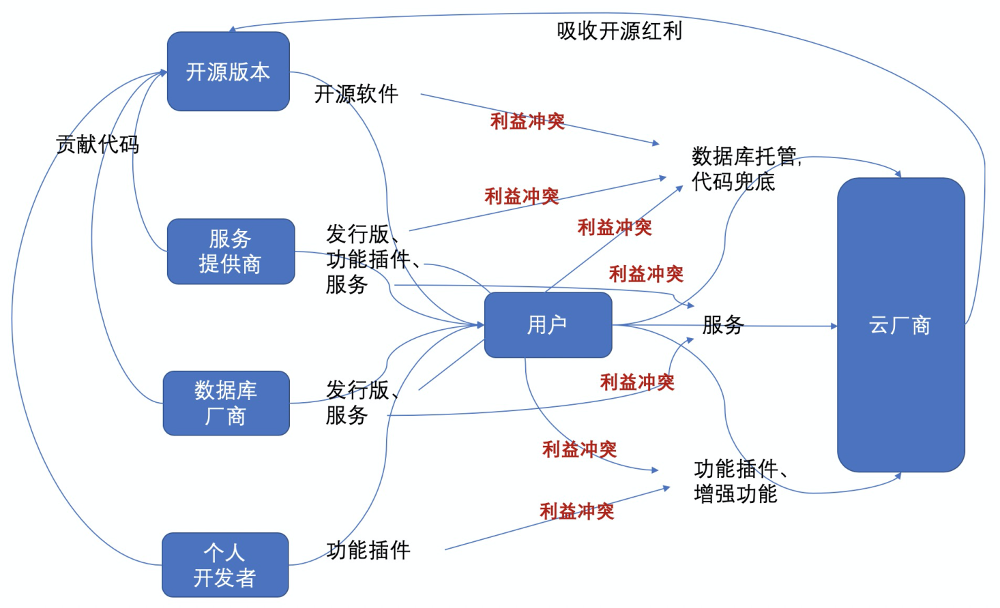
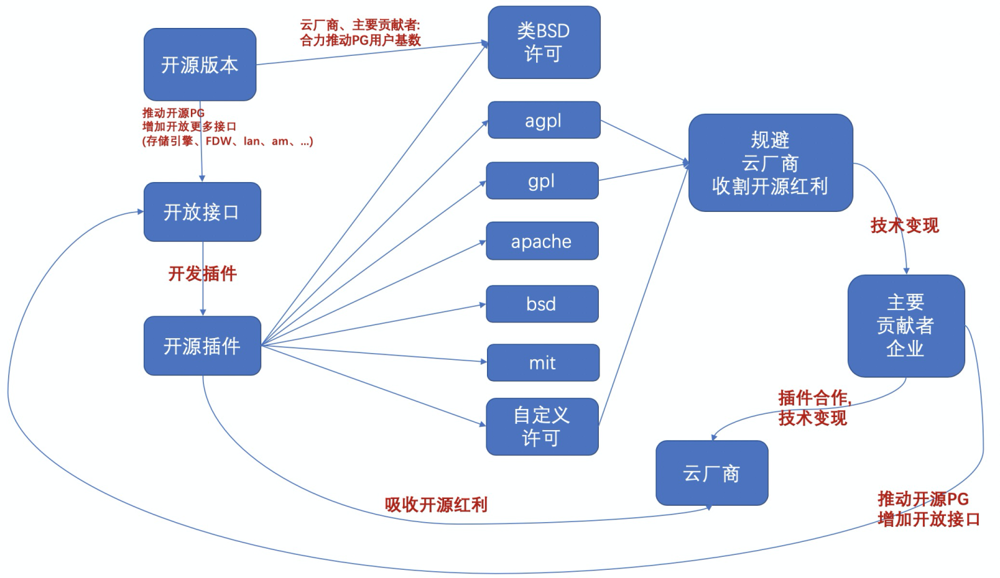

## PostgreSQL 商业角度解读 - openapi 、 扩展能力 以及 插件开源协议 - 云数据库、商业数据库、开源数据库终局之战 
  
### 作者  
digoal  
  
### 日期  
2020-07-27  
  
### 标签  
PostgreSQL , 核心贡献者 , openapi , 扩展 , 插件 , 开源协议 , sponsor  
  
----  
  
## 背景  
PG openapi越来越多, 扩展能力越来越强, 以及插件的开源协议越来越丰富(并不是完全继承PG 的类bsd许可). 原因是什么?  
  
[《未来数据库方向 - PostgreSQL 有价值的插件、可改进功能、开放接口 (202005)》](../202005/20200527_06.md)    
  
PG核心贡献者: 最终用户: 注重PG主分枝发展. 享受开源红利.   
  
PG核心贡献者: 数据库支持厂商: 1、注重主分枝发展. 主分支用户多, support市场空间大. 2、但是云发展迅猛, PG支持厂商的support业务市场空间缩水. 3、注重扩展能力, 通过插件收费, 拓展市场边界.   
  
PG核心贡献者: 数据库厂商: 1、注重PG社区版本的稳定性, 基本功能等. 但是又不希望PG开源版本做得太好,否则没有自身价值. 通过满足垂直市场需求, 拓展市场, 例如oracle兼容性.   
  
PG核心贡献者: 云厂商: 1、注重主分枝发展. 主分支用户多, 市场空间越大, 吸收社区版本市场红利. 2、同样不希望PG开源版本做得太完美, 否则没有自身价值. 例如管控能力.   
  
目前PG的主要贡献者大量还是来自数据库厂商以及数据库支持厂商. 为了解决云厂商与这些厂商的利益冲突: 云厂商, support空间萎缩. 导致了PG openapi越来越多, 扩展能力越来越强, 以及插件的开源协议越来越丰富.  
  
原因分析:   
  
  
  
  
  
1、云发展迅猛, PG支持厂商的support业务市场空间缩水.  PG数据库支持厂商, 通过插件收费, 拓展市场边界.   
  
2、很多数据库支持厂商也提供插件, 这些插件大量开始选择商业化产品通常选择的开源协议, 例如gpl, agpl . 这些插件包括 postgis, citus, pg_shardman 等.  
  
开源协议趋于商业化的原因, (商业开源软件通常选择gpl, agpl), 例如mongo, mysql:  避免衍生分支轻易继承原始分支的劳动成果, 商业上超过原始分枝.   
  
3、怎么才能提供丰富的插件? PG的openapi, 扩展能力决定了PG插件能做的事情, 例如  
  
sharding, 行列混合存储, GPU加速, 向量计算, GIS, 搜索等等, 都是通用能力, 而且是非常有市场的.  
  
个人判断:   
1、未来PG核心版本的功能不会增加太多. 除用户以外的主要贡献者为了生存留一手.  
2、PG的扩展能力、openapi 会越来越多, 填充核心贡献者利益空间.  让留一手可以通过插件变现.    
3、sql标准兼容性,稳定性,安全,性能等是PG基本生命线, 这些功能不会成为留一手.  
4、一些关键、市场呼声大的插件会选择偏商业的开源许可gpl 、agpl等。   
如列存储引擎、undo存储引擎、GPU加速、GIS、时序、图等.  
5、数据库支持厂商会寻求与云厂商的合作, 收费插件作为切入点， 因为这些企业的收费软件获客成本较高， 与云厂商合作是降低获客成本的一种方法。   
云厂商并不会吝啬与外部支持厂商的合作， 毕竟开源红利要吸收，希望开源发展好，用户多， 所以还需要这些支持厂商长期对社区版本的贡献。    
并且这些PG核心贡献厂商的利于与云厂商捆绑, 有助于推动PG生态， PG市场的发展。 双赢。   
同时，数据库支持厂商会积极寻求与垂直行业ISV的合作, 拓展垂直市场.   
在垂直领域, 插件开发商具有良好的ISV行业属性和关系, 云厂商借力插件开发商拿下垂直行业ISV市场.    
6、数据库支持厂商、云厂商、PG用户等PG既得利益者会合力推动PG的普及。   
7、数据库支持厂商依旧会大力贡献PG开源分支，因为关键插件要收费，必须证明他们的能力，需要社区用户背书。 否则客户不会买单。  
8、社区应该继续推动另一件事情，插件安全运行机制，降低云上实例增加插件的门槛，否则可能很难进驻云实例。  
## 从此PG 可以重新定义一种数据库形态， 例如 ： 热插拔数据库。数据工厂。平台型数据库等。 利益捆绑， 使得云厂商、数据库厂商、数据库支持厂商可以合力推动PG发展，未来PG可期。         
  
  
  
\xc30d04090302fd40d8d1368599c7fdd2ee01140f0fdacd4e0da47e57a91e4dfca0f86710a9a534cc681842bb38904b8c47257b68697a724e6bf8226c5f8c00f32acf67f9fd0621e6cd0f160fe4094784bdc7c720ee778d7c797ad604475c5071d99d2110ce975aba5a7d62e5a748df637d4237c05edb717c449fb6b8293a66b99a96b9028876055553e88dd0431d7707aa25e5708844e7792690747d1382544fad84d496fd50e66587567a55f62636d1e1c50c62ebba518bbebbed95a0214586a28f3696dc95c9590d4f2660d07a387500f8fa40817fa78365ddcf194b5e5a0f2c324b6bc964a4651a6e21ea36f774432f48a6bc3e6922bf3680d7dbc318d8e886a245d3575dd23cd9039cbb7c6ad6defc5817fcd5b0dee8c1487a0f2d6209847de797a300abff64871ae1ba9d8e6be6179c132ba17e62a441cee1096552c2fa7653acc344423b9340e1d22ee4a66442179f6d6808274627bbab9ee1dd076d96a1e56cbc122863ab1dc6030875525134aedd3239a4b5f717ccbf39f71941ea88c8117eff1377cc3b69f1bb85db7b67511aa656362a8235421a0d0db8cfb36c4561373bfc444ce3f73cf34b61806c04194948254dd206d749668e86444a63108757d835be2ea4d4cd91e58b3221696b76f36586c5ee5b5f2bd5dcede58216936cf13f0c0cb4f347ef752c96140468b2d7ed3750428f382a69ad3c08cd92968adb631ab1e900e90e1c04a031a49ffd6f5aa081629a752fcb83286c9f75ae973dccb8d82d81fd5cb8e5a58ed5fbe9d68a7f43c3c9537403b558af8175b13a58d3888fb533568539a47794cd1888de86c354e8dc67370db7c6f41c91065b5316485a533b05f6e0b8512450832d87051865c7244318119ed45435e0a275a774ffbaf55d2842f7c76c4fe1d62e36f9dd5f56ed483f83fa28371f45cff58beccbd361c642e2c5b6d5ed21b52a5131f4bc86d456a235b14e393b0168c9c07d4598d7d6571891fc99b8c6b959f4d21b35eec09b90fc5096db038c1e4f430ac2b3afe8511e4348dccc3ea7fd95139d4ce7aa9db3dbf10cf0d81b40caccaf8d545ea8463116c26f7e2b1bf9e553f8955406f025bc9e463fb7651f30fc1eb9bc5f9e3b984b643b3b9b3aa48b72ef607606c2850b9ada5592eac2ec2456841cfeedc8249a2bbdf1551680019b1ffe4a90db676ffa82c075c47530579337d598a8ddd59c4850e29b449f8b5328f26944e9c3250f453e9f7144606d45ec1386c65268e0b63e5405210dc25331f30ecaad2a81d21325e1416d9bcbd5553eb7621b5bb723e0671811e15c643eebe53461fde0cbd0ccd5d8a287b8d80afc00a55021ad2e9b70ab451f476db1ccd4663c2b7b58ccdc0f4292bb2f8a4fb05bd1275052250f1ac1892fbfeafe7c9e0d460b80d1837d232724b8458e9fd4a708e64fa087c338ba19a8bd90a64983ec5e084f7e28ef0d770dcc737870776cf6800d82db5f91a4bf788de9235f13c74dfd9bc8d43923345a2d07508be16c5a1650309f454e8e9f8b7e906c30473c1138984e515fc4c7c84e70303cb349115858d4b435d3b6f6f6cbaa2494bfd60a9be6c141e581e54035ca3e7d0b4e4f0b22a703f3be6b669089af2f9bf226e6ec94265ef9421eb5ff118faeea03c5f061b1c7335c51e1bbd75997ec26521a74c7d3a6469c9fd4ea9d39ff668aad4a2d8dac5fd51eb9ea019026f2547f52da9c472157b357ec9f65de40f7676e9c73341436e15e67292c58c5b9780941b30c20e63931ffa39464d77380299f336b1043823e8c069082d33cdc7fa5f05358c2ae0178ce91d1ea8da4ff6ed727f522b13bb91ab8c424ba8b3a31b3147cc5df663aa42b584da7ad0fc0fa8154198f7246f363b2a135ab04ffa0c8467eda13de74be13b89d03016afd5d0b306ed8eee8ebd2a24961c4ebc1715ac28308acaac6fc1f32c4dc3fb6c36034d66a3ca314eea02c5e71085ed73f7599b75743312b1995de323e08164529da1466dd72fce08920b224eb3c837959856c52c975b168d6c07f43eda12280a5430ac4269db3bab1ba7e2351e121a1bd4f1daee34b5e3accd1fa4e9c40726a6b98f8ee85c69b6a729cc613063e8ac37e44e5cf0ff91a3862c32289dac1aed5d8ba50877a1a65846fed2119e7312a06534d33876bdcadf43d48e15ea07de98bc1a09031335fb1db659656af598d8c5a85cc22dd80895152ca55bfa383765a2c19f881292b35c249766532ffad405dc75bcda79661f0ad94defbd151c95d62aa3026f01bf5cd926975380900a94b2c21f1d9c0f6e9ce0a0b256bcd9b65552226e14198bfcd15a27320be1f02e28aedec768ea5df8529c885a07cb3d09ff6956ea174b8e9887b66901d03075eacedc89f1a6277034d0747888fd36e4cc4b3b4651e55df6a8cc53e6d7f15886ad8539e5e76ab49482dfcc691ef39c813a1cdfdd74024908e9c0b626b777008bf4e8a36f6bd1decd5961c66fca5863eeda1d040bac836bb27ae9bd20f848e17630cda6569216c1c285530a0bfd6adfc4179572b0af6be2a9e7e1bf0d6f1d235daa27b1f1a09958c25b445a66cc70a985902a6d9b18fee79b092ff3fa0351219ccbbebfc7fba8fda4f19ec8808b839b6dae77f50526d17adf6b70ac787e783a22e760693f12d6cdfbd046e072f3902e91e15ee49557bf1945902f2bfbf46eff21bc64ece463c77a7379c88b24f24953bf6f27004e1b8854f875ed1e4838623c5dacc601324360292fe8868c2f8aca1b2c523ab0f58fb7b469b0916b5b3e06efab0fd367a148a08b4188561b5cbfaf5e194e2990cb609d6a976a67d7e15cfd6bd747fdabb23e9d40e23f2600b70d682c9c5d262a35bb013f033431d263358cfd1fa51bbb571254d8498ac80523dbb5df9227d6e0f12a8d5d257175691c3ec19be8b2e70ce7f6a7a707532983997c43d351e0c9ce6b8faca4d0817b44a9f2d2f7fd72a5591d21b407a1f2bca7a32743cade3d65d4d6918c23a0052358b3127b3f626af5d4b52515ba4f464949f1b25c5fead8c91978856a8036e0c690df4c1a988ccca8879749819d0dbad8ad6bb9b02c9f844e0926899c642a25708c9f83a331f7bc7ecbe7dfe4393165dfeec039796779fa05ec2858caf4986943ce2de99e4bd6df1be3335eba8e689a7d304f4ff94c291882809fa9d34cfb66f23a831857909ef115ab419cd61688848a2e1966e50c3fe83ec10df8e0dbfeb2bab3e429af1b36a3b61151fe3e226c44a5c0349265adc0a685ab1156bd07b9a7bdc115ad56cac95476c4e0e654cd787d1fd9404cdd1374e9932ce6d187f0eaad853863dc931f56de9201ffdf388bc9d24624edbf360cb14aa03eff17682ba258ac0732495c96d3f4498402c86594585cae6bc372683da3ad075795e76c234c15635d205ff2a454b8f3a8f01aec70be24670beeb0e34b12a2c84e346e19120e973119651d3746a866b1e0db2c13abb1ce843154a20a5706911d6163e1b41e196136243cdedfb359772a453b8c52441e4bb419b6497c8a8b911b99df7333c5d647933751f6edc422f894050df8480ee9e75ac7732f0114df19106e497f3962f04d9b8b2b5bc1f93cd883394b0ad3a66098c520cb7b6b9a4ce4397ca41c52009025ac244141f8989a9b5655c5a71ff226e7189bf5e28c5c63d901eaacbb39e2c9b214cf475ebddc629f0d2b41f52eed2f73d03c6d575c89db3fd1cee48175f2f9625aa223bc5227c0aa8f3ab92126fdf866d1bd6cbe9b2ff99c8d41432f3d60d7b9860fcd5f1183a0f51fda04f83fe0646553404395e92e420f11a2bd97533eac82a5ed9968ac56991a92372a8cf8bef6724558f79c6fcc2c40a607cf688908e1fa8c029a66a8f6f72d883da485c0a7c43c1f976ac316600c54a1f8f84715330a7841287e5978651f86489742c713e49be45f001f0530dd150f7848aef544db81db74c965923b22a463e89398027697c4de47e6a91130f977145933a72302310a6837c7ef039dc67006a7949a9f503caa8d99d6f6f3a0bf8e2288c6e09aa42e39739758ad1da5ada2141bbd08185adbba779efe5c6b823deb1eb90fe5cf2640cc6af8ea4afef247fe2e9aaa8b5c7880067075cbdaa97fe5bf7e14288b2aa2fe4b42facb8232cfdca39f007c1fe43c9f3d64257734001d5ff387265034cd9b511d66856feb3ca3725d0c0a4941cfd4d8a4e9150dce3f51cdca5989613e7098b0bc8f4e954c3db58c052c8f347e48c51a9357eb2db43fa7b5131f7314fd98e72012c2c07cc244911c0c40b30e9bbcb01c75d86cdfe72bd287e0fb7d006db73d036be6c7d9d568ad1fcaabbb73bba9796009fa6e20cfc6fdc04a53660ca088626b9529a66610bad05d2a9ce28e26102ce28df19ff9866e54cadd175f0d3190aa86969c64338fc6bc3e54954180bd2a03ba0d42777a841a544c9f6407ea44a86096801df63a0d72f2cde2b3c70afc076c745570589ab05e3539c5a11872e72474e2ffc35aea69954256dfe2942341f76ad2c35db3b30f78a720f5bfcc2ec22e8ae64e1440512e14987e046a9356c976fb1fd24a3af6189ca7ce8a406d76d2916a6fb4ff9400d257e33accad46c4b3396cb9950b0d7102d5e4fb85110d2dc5d95cb0a28a9e9d2c784d009364e91633f25b03c14ccbbed5b3e5b8be186710e621b0a9f477d041c86c9b93f9af4d170d278db5241b280e6651046544a5977ea963213d5eda0db3472f5262ed073a033692cbaacc219899f3b36104654f771b91a7c789c4bbe059fa9ca65442184b989c04da5fa19d45c1c28ec1ca1b76b59e15628ebac4558da347c8204e19eb103f99613257268b54cc47447c5b2c657d586ddc916ec18900ffe6baf6e9435be2c3b8870c05c5fd53955005268fa3145233583fed461fb05a83bfbd11b982f42e028fa89b7d06b01918df2fc57cba51bbc11caa42ce3c4fceda44a828c7b1fd20fbc87fe501b2745f3158be9356296e301c6f651e642c7b89212b0fa30333522e8cb9078e3b593c881fdb356102819dbf74c80e966ab60c6a1c6413d4f78c7fe94dee85e01451464e78d3c442a7e5358e576672c688ef946172b860e5a87834e4ec0ae66c3e24171bd891a66b31cfe933b2c2d4816f8ae2798655c41826ea4e485c7de3459952b62473bc70a5dc51276044e500f18de7e236ba5be0adc7a162f60a0bb8e37d98ddac51db29e34455fc30e229419cc1a7a76adba87a1097db1bc8a2397ac624a6daa1803343832375aa5eec98e8836938dd907e48ac188977f81fe64a238edec78067cab018f36ff279d82b11e2ad400b37ed7c400a1ae246c72a5f2e5747e23c384195decb864d103f9f17dbc59f2a78b3ee6ad10a47742820504b47cf5ac570a83fe1430d4697f639e45be435bafc17ac37193ed9123927d87f7d2faabb21cc303b684dbb7740475d409bd4286828454e6d7860741ea5392c6e0c84e54ee524a74041b10e4e10dfb084317d3974da5aa7f0d81c143bae0982ddf5698ab5fd8b4bd47baa235b68e6188c8d2f3208c3eb619a5ce9ce89183797981ceef5d518175175d124d971b731c9029fd32aaa6b2eb92f07259457563a295e632d342228ba68251c8f9d3df6d1913c80b65466f5d6621e59ebb45828d1863f6a4fda5a1bfbe0b7fe0ba206edfe2575a84e7f675244d74e2659372d24f01f63e580f39428754f947b3ae05a5dd4f13d566a2141a854bfad0ac232c946abd4fc046471a4ba531a6dcddfbdacd2974af59d4bef12e107a61cd41110b729ca508f03a367c2c4d9282c8f5d5d8c0808c387193c8af0e4ce986cde7c62af06c6c0d08c19c3da648f96170752790e03755eb6cea0d3e4124fc5e50812a970cdc4d0c77d0576a53c5008505dc1a2fa0ebdd8e9ef888de7812f43ca8cf68b80fe143fb8836e85a95e1b1673341c9fbe3da7750c5bfdccee6dd7f4d3f6f91cbfbaee5aedefcf57acae16ad5398afea1cb444a00983c2397d9bd11a7cb1db9955d26369a7de1f6a87ad2d41968012161cf3fc7631be012e7a3b9ec5d30189e441bdd2ad6acae039d2a72b2ce2ca4c5ea4e2f900c544306bcbc5a8bc070aa6453d3c814a0c0c8aba1a06bf1ae50dc94781b4d934bbe9ddc61da8c381a6b95d0304caa539cd0dd9875bb7bbb94314b86bc79bfc2f25ee3957bb81c595cb5c3a77d23f1a6708e21bda085d39d823984b1f33b0a8e32d185d70d96c56f8cc98f6b6d86769df618868e492a513568e42d7f912a339eb4ab5f54658799a904f8cd18463021ea78a3d87d8ac7f7e1bdc7597a520571c4ae5537ec77f7cb48356faa4253fb87300553f8baacc98e924757c9ba791d45d1c1935537877d78f3e440fff76ceda5258f52111228381f8182ec3dc0782736fe3a20ffe26eace5514f38faf2a7ceaf794d379eefbf74eb9728f81a5b2d1cfd4213ec0c572a41d4a29945563776124e3eb6e0b3df8ed82a5dcc354c5354ce91dc8aabf86ab8facf47a7be26d52d31cec692f8dec4a985834fd335eb93eb2148f8749b4a25179ef65d0fb99c14925ead30542a548d045c73fc6a241757c4acc49fa19ee854e6a5d5f39c5886359585aa0a2f3e4bb3a8323b2e5ac7d4b90a46476b1cf7082813d6e91ba7e14d5191205183e5a5301a9d13d5282b725a6f777178ffb988a22206e6ecbf59e2b4a100a2f41cfa5008bbcfdad4eea602f93e7f236b2f44bedeaeb13e1b3365ab976615344883dd193f912c54b400516570552a8bc9e9e6888280aece9795206fc8aeac41a01255b39493a5495db98e594acb08b45bf0a4d001215dfa3cbcdf5e23030db40013b8b3ffd3a85070d951f6fd88a209d3d81da7ea09b06eb67eb2e34624dac0f2190989d73ea2070b75401e098ee7215d60a2e7dba633968ef34e880e15307b573f8ed7029e62933b4d90955e66f08b28ddbd1b16eaf1473bd6301e1e889900999bb84583327ee5f99db3a4d842fb740121ce1e570377237623831f64bf724887b4dd70f5ec63c8554a26a746fd2c7ede860857d81ca9f29d65ad6056856c17f72af491db50b6388f1c73142a546006a49b3f7611a7aedde107c90e50289c7dcb5fa47a001f0b5f829ff3dd52b269825111b6b37505b55352a6b25ecef4c93d8cde7fce7972877ded0fe71089a43f7865bf3e54ee214a5b34aa0acc2c7e21ce884fa3427cd8855d78d916cf3aaa59527f5b63c3bf5df1807bc4962689dd1f37b40d7d640d3f1bc6bf7dd78b29f228ae7fcff28c477f145fb4a741b2aad1466c8a9a271e14a001ab3b21b92d6554f958de19cd70e16ce5ac091d52aa2c57a652c6d0744a72789810ecf5085095ab287a62e2531b9be5b475733e75751737e9dd03a22b5720b17a85e64cf12ece23d96508d08241c221d291bc0e9c8b77d018ae2011adcc681df782e6a764dee1215519bcb869a173fc341fb55397c125ce9508cea3c8c69d5e13b34bad12970f43c6feb4f55d06b6210fecd76ff2bca1976f63fcd01d511352964be54e0d5ab554a8fa403f5cbdff7dab4f9423ff69fecf850549af71cccae8e6f1c7afdce8b0db4cc9e9e8cf92d38d2171db53a09e71152cad3ca9a44b13c96011770e6e8e830de7dc277a9d3897fc51f71a18f132d178c00db4e9a095649f8b9d7a874676ab61478c25bfaddd90380129e7b074aeaa1af1991ba0ce9467e73bf196b4a15682c3805268f481da364c9af5d0bc28841f68389803561c5c55e78b9b567a42d2fc49fc5d71993f6ae70450a18e0e28fa92ea7119b077854fff3ebb3dda4a9d4f4eb55796a4ee6aaff516054ed2251c8f3742b3d8c104e55dce9034c72658bf96fa1b9a119118ccb58f9486e2b91b11ffa61fce34a5f2e78b8b93a109a1b32520729d239503c4b96cabab6e8bc1f730838e8ba8d13658dd7408a9f6922856eb7cf27823711f8db8dc275cd40d77ddcf804bbcd012b391ece1eceac0022455e8e0bcdf7a4a9c09f0d48f918abcce29c8fa75b42e8bd54e1bf75aa6ec72c58db085c6fb853a3fcb152bda638cb3972385b11e2782835c0aba9af2128fc4e2acbe96b1e66bfd85c4cfb717d357a3cc0a22f9d47d3d09f48d86ab99cc0ce6293733f162044bd8e27e5d743cde0f161f74472e72cc1b41fc8d181a78a9e753548a04c8a5e7db6225d2561ae45a00a5e87c4d8ffd6c2b3cbe8d2fe3f8f8feef45a75939395b552c7a006140be6cd11c967b0f6ce0bbbd50bda780b25a3373df4e10693698e8f8b2ec765a6a677c65a0b5acd8ffae0723b2397d0c58eb8ec7ece2eb81f8c7382692d05820eaeec97330d3e26e7b695415108f25d55e19edd8cb0e92b1218a1542f0f27d6cafe82db51e1485537f0d600203f95b01d45bd571aed2335c1a118854c1216afe85e61c9fefe96327d0ac525555dd5af5e797d48b387ce3b84ed29fc3fb62fc4869b1bdaddb13a3ad3e02376eeb762bc22bc59dcd3ff59d4a4b2d56d9f67c680b09fb5bf16dd112a282a44a217c7d9dd3dd2edbf5ea9b0a27d60db044f0f0f9e2aaff401547a044b26c4a3288c14da6693df0203898433be517586341d5039dbab7984999712abaaa0ea605bf78c38f27b004f94369db30326ce9bf4cfc3434cd86db3d338cfe266fac325bdd63207870f50e2f42b34d4a27ee6a90d50cad9f5c063ba9262b21bd54d11c83d4cb06fc8197f1e89352b10855683dceac33d1dff68f2db1991c2716bffbe89064884fb6ad5e2d1b038a171b9d7b3f35615141db5ed3422f6f30397c7adc5d0ab1f67537d0e24c97a1f2c8ea9c24888d4f9407cbf42aa03bcc5c0f6e7ae6b715f34086e06ca0940ba857527ed93a3eba9f60522d03a3e61f9e3d0f8b662e0d57c54d4f568adb026fae43398e490f59bac9a8f1e0d7f03ee72e58ed878278805cec0f1dc351d3eb392a1cb318eabc37073d6cefa31f306be9a69963ed65cf472e8ed7b0f5813e2a3a9674c50906e39ea8928d7602a92bb6e1cf14462a1ee83581a9e5ede46ff0411488974a5ca83b646def48557cc0360604119486d95a5b56ec673211ee329d165a145782f97b31325554427a5a301c4c996647eebe80aa48e2c47ccaa36c8ac671495dae513bacd41966101d5997b7433a08e2b9190b198c710c56925ffd6c8303ae1da2027391596879cbaf8736d219796d71d23aa7900d35b89a84e06fa0956f21d0b617db1b562628a98a7da62b03901ba18490a2dc6ceef44651a909ade59ef2c28d4ebf1a6166f1a0e56f7f8ba2623fa844e572203c2cf11a7906c4c3631996d01843a7fdf04bb0fddd589a44fe5ebf69ec62419af45d9784d36c5aea3c750034e33a11024489082c10a3874e5fc3582da710df93df97433e0b3770618f53314e9c69ed3bf8a89f86dc242765291b0b7dcbbbe2c57ede2637f46daee5734c903847aedd7c47921ff317fc5e3c2a751a8fdfe7ed13114b8f2260bbef620735e761786fb5f91983fe19c441bbe6c12e00da9849cb59c65e03373e598db4a8b7844bb2bedf49bf1c839a79e197e4d61db019a4903ed446d47d1ef806f5d9cf644f5b33550d1e9f0c190b8048a117a4d461070da838be70b54ba18accc3e4e8ec6d7a96ad7b0e0fe23a4f49067b4a2eb583571a54630d66f35084ddae22a350ac32d2088b34c31e18d2a1ccb196a2c837b8109e39e88eb7db3d1c3b8ce6553a72242d0cc76a429d1c5b8c1046fd834b845e676a3b0d218c921d6b213fdd556ef5f7cbb9cecd2ba4e5a0996fa16a048d92b19daa8144ffaef4e33dfefb69e4078d5b45a0e3c9cacd81b07e5c5b41afe537018c6c333e05c832930539ed70b947496f953eb115ec9bddd2747c3443b7c01b6e68313f840b8865ce46fe9682e31f6645826fbc9b8e6d29bee859e1b60f76517677e2a1321a17b42bd33a6fdab4cdcd7ed134ac0faf233a3511b2a2467de46b66e4c48d8f179faee2afe83b29d62d7d6d8c7213035813562c2b9f8854cda56d63020262a2143813b57a8330aa713af4e5a581f23cba49299f3a153f08c1425d9343a68be444094fdd70c9b108b1acfbbef1de19396953edcf14c0f56ba45b2858b4eb8adc864f08c90a3499dcd445ab5f8236d9281a7b6f5fe2ac11f51551df9c328e44a1cc11e35eca662697f26ab0c98131bf0eab9174d4e43f80d6927be7179adcef57d65407c4a4d139ebcfba24db3bf785eb1b6ae6a390f03d4178390a08eadc258ac08f24fa306760d2de049c1f3f1c774e60f423195f6b0ecdc0e18ab46c7f9f8d70eda5e7f727c7d3585c66741664271ba0c3ec1ff181a428707b8a0c5ab1c960164bd03373586e799a5fe1d946f363fd5dc9791a115bd4d52cbcc44929855e99c40533286c51083ccfd468fdc34afc2f22fe99b293606716d5a2517d6deb3e807fae7c0eecc2ddd6f5bc5000bdd8459de7ee6fc943b922577d97a10e16514659847e71ca6f356b82192f71499ae78bb5f157f649cbac5c6a908b5d953d2caf3aee8d617d709b228f0f4505fef81d0184713cbbb62992405613f11542e6aead200f401b8b089d0fbd869f4f9cfd0d0c95fcadb205e860473d3b40d1ac5d07481410f2a1fa958eba2c9bdaadf791ee4940e7f62d4e42ec878138332aa07ef5f0b3725e5eb2bd0bace2122b96930f16e3368ebba5bd0fdaebd9490453ef230c38fce2bada9842d9a1c37542560df195277fa71fc09147cc110bd2c1de22927b37635399bf7405687d34082118c89dafa39cd5b52bfcc805ab461cd307923bcc10e8d0da48481efd7bb3950809edcfad2a65365c7da23cf84157f1f7c833e6f180a555d654acbd680b24fd204a0e42a7a070932d7eec4774d966ae9606fa31589327ae1243455750183939da28626ea84e752fc6751f21b6f5a8c14c100af211715e2241da589669eb50fddc35aeecc30299281c9cfe76b36cd8d4fcb37d532fa4f61495d3ba05c0007e296953f06cf013c81f716f37fadf329983b41f49f2298099cec8cac6e5a2306b84f32ff7134628f63e269f766b6efac858cf26c33f257f4abb20a5424f3fe139e49fd1f25a279d3591f1dc591c83f14018e040298ed45af2e6a85a8d7d9dcd6f264b32415b1d014f97562ca1b4548bd7b410557b9d5c8ca73fb54902470e67cc118b68cac3c1d3da5e6379844525134af48d360740ac40cd01475879a5ad6ad1b0b46bf3bcdf8df137e98895d23146b827c4536f9adff4e10f15266defa0f465d56301b11d23af5e7706e949f9e8aa0896d7e4d173686dcdcf1f28f6648c0cafc5e4bf90c56d06549af5b4da3d9aebd0cae678f161266abd2d49d009d9040662d75508a9336ab7d8853555cdff15cb33daa751ba74ca2a36d41ca99c4bf603dcb269d585ff5ebb2f49ba95fa42c6404ff9a6163d6cdaddde4b881270a5ab91ee4bda07aefe91190919020f334d256945318b568948d56ca921e6e250fa5d517ac9f126af7b18a253de1b733ebc0c9383cb0156cf8134042b3028397e33bd3fcb32526ac19a643ca24197d8c9d8aeb77bce7ce9003d8cec3902e19d77dd2f0dcf398dcf05fb735c254f892875659140396e0ba1d263e6b54e3b61aa3c550ffe61ef859d165cb2920b7da1cad2e396fc1c95c8c19ac9e7956a9e368ad5b2a45b17d8d3a03b19a196e357ea39aaa0460b94de5426b2015dece1ef3ed80445bb747a3e8a2a703330f530eeb42b6ec504131ef7a78dee422030e7c302b33a76e3c1862ef3c6c959cead8119c577c4ce1b9521a38f6de643ec83276d3771dedefba3190e99fa7e10d486cf32c03822f665ee887bcec3dbde700a1edc49ba613d5b10cc0cdb57011588602007d2e3e323dd920a80703d6148976cf8e708a7ffabeb6b56ea44a4bef1b680a3afb268d3e3b5b072fe15ae97fb1dc8d85aac37041d5b774c809006f6e7425efe7165e4a3269e362558da4e9ab253624f5293cc3533c1921417c9fce8dc3b9bf690b5433248430e60a5287ec35d068c1f8a5b2a007acd0fd0bd7c48b1d6502c02c6c0f11dbfb4f43eab75d87a33dfcd309489d8ce9b71823ab8e58ace0eb83a5142e432d743303349c3b1db8ff2dd71c98c872c3d700acdf9d9ac843922f87d16599e0c32d6c6d508dc232b57257059032f77b813b81b13737cc8788dc13911a2fe50156e1aca8fc69b8a9f3e7da196d68264152ad6ac32522032c30ba1f586e6a06503fada3d1a3c798501dc149121db4cbfa7c9e11be8e73238aa22258343bfc5310d61f735012c520f937603a82ec41ca765870586ab36749955702102095bd82d479ce18852f94b7231f34863149ea2a50448ffd37e42816c5c983c1a0c1ad2ac609b1c992f9f544dcc05c964a8bd48952dd9ca5294248f38e17c3c1e049cbbba1c3793dd929874f47ae87d9db340bb832897a13953bf81d7802aee4d9ec31d9b15fa0d3aac1471e2e2d020baef4755a7ef03af00504fd0b337f499cb157598819628c76b8a85da2af59690d640093ce24b093329e2cce27945d428e9e893b1564d11581d462ffef6df2d0e0f7623676a9fb01ef92445b2b4fdff50f14f91b7efc555b6c1dca2ccca4e24fa6f110229534a3773d30a4bfdd68a769c724372a6719acd600ced1162b169130bb937ff9fd77a33a24af716380dd60df72ac6864e10966a628f21f2cb43da2185c2cd18dddba1a3c62df29c66b9493b42723f6caa8dcb0e61ca42d56039dd7ea3e9ca42fb92e978f6f0ea47e7a84fe5330bfcdd015f2626ae0df289940b81761f60dad003c6dcf7a2197f6f6c6a4304552df9a9493b1f6902b7c9133d5460047679f518226a053514aaa18cb4c2a3ce683931f864652e007a44781ece7d630e2367be0dc48aef1c237bc5592f9674e32c143eeaaab58fd9663d993cb9cad3c0b4fb67967a1e589e5d03f497645617a05cac422abc5050f79b41380bdbd84805bd8d5b2a23bd396e015a3749156c25d6c5c8da5e9a9c2c01877d198ac5d60f284ac12081a2848feea9494343c5dece10fd28d41536389ed7c67342043abb38cd93dec8446d7daaea80b1d2dcd9b6c5ef5cc5634f93f6346e49d8763e62b2ac2ef8d879e19e54789b887ca37e472b189aa593aa07ea8d673c73de016e5c2fd79ce6e207b612898197c0d524f0a528c0ee44d1c810a1ce8c1d462b07af8d29d3b9abf999aded0c997890c4d40ab78a2753b3b5352e49f6c3b27d2d2ab93490c9cee89cfb2b7229864228143afd4db33dc3925b50009749fda0d81dd23fdb469d8eb9649da2d2703dfc270df570cc2b7fba4715d424ef875e153577f8d27efc31074640fb83830f074966c0f74292073714fc23c084fc92ba0dde816949a8b2f5a221d31773586cf032dc9365b82b4db8fc9fe16dcdcec8952bd38f3f669b9b0df4561c9edef31c6b38dc222929989e84d9834ef0dfa872c75f6860122a9062a46c011a2ad51bc39c15347b2e9232087a501d0cf39af95b1e827c43bbb6c6614de8be96d988af7c7159af8e51aefcff79f0803bda9054686437704cb288b85c88abdfa464db0993661d4c441858546f599131b3f0b23a97bf9a58ef622b1caed06d422703e20af0e286cd0e0b3aa96bf2f2fc1453c716a25618ae52863ab31bd17bf36fe72bbc96a9fc3a4d23f4d991a14ae9055c3d9be6e97a6c416e6bf6886a307af53df8b597dc200de2cc05d32a6852345e955144938c21cc4c28be3168c9ca5db97f8b12a66a31ac06b38016516896351b09c968d4e9262c155a8a291c7f095449d954410efe686920ec198531a1faa921e5a831010f8d90a8f89ddbd7b4a5f324324a4f0e95d6d94873faafc837edd0f374bdf95b45d8baf384b18489216a2539669d38f14e9d14406fa25cc6af8d14caaee2838263685b0e3a84d5d37d34f7e2076704cfcf916bc670b300b6c974a8f62d3b62845dce954d50b22fbed37e24d7ae1ec1c15612c3944bc99f6713ad4f013b154c9d25bcb3590f689a9a101fd6d448416e4b723c55f3331dabb8aea69cc0fab9f6f995b5de5dd7b9c21331ebbb97a225e0d9ed843acac594a31102a14f04458de0c757ee050d3eacf093e724bbf4baa4d7d582caa7641223717563e9d9cb1435ada14b3d80374aadedf33402e9e4b3e7f0ddb97e67a41b88023308e031bab46f7ed6782e94dcf6bdf649350c04681a76e510ac33afae9e998e38cd0daab2472fe84b90d12f64419181b804b81b79723dca6dae7b6aa673999ddbaeb18d2ace67df3ac92ce37e6a0bfb4066b51fa70df441712a5c1e21810035565517476c4189a819af8d84529e73ac23cf4d778e1db7d4e6e18560e2479c9164312864946e411d37cac3a510a8b806107768ee93a53e4bd1a1cd03bca6c8cbe62322278ac272594741698838d925a90864f8799cc68248646f5418015ea5bdea3dcbc42e8cc8180eabbe704045738a510962edf1e39e89e16a51fcee055f6cb4c0ad9be11a9455fcf689c144673af5f889a432a2f98da6b1cc79197d6572caec2103d4bbd12f49a7366d0761d5b34f5f0fb6cd9d0619c7a98e5990a8bb6e92d4e208e62fe31cf580e55bd8c0ef8a791c4217f4fae5c2fd54668db967660b51dfbce4878d99fee504cbfde705ca556bcfe63b6d9586ffba6e4041cd9d70c0fbb6ec8de84f6a4b2193b593cc5c6c22fbc00cb0ac08615854ecef8137ce28a04c26ce67684e74ca404c5ecd9e562f603836acafa9cedbb6a552fc5de76f392c2384793ce188009d4d2a1ab9d1b6e0e66a8aec55c916210a6bf98eb62262df827712270c88bc1537c652c709755c069ac73971bde2ed5a0fc7004d6aa34e4181044e4214627ec4aedf4802387251f6679bb1538e9966d916512c0e916c87cb7fb801d2db58741ab5c0e8073e302b473d7c9fa6b7fdee54086a2ed230d47bb1d9cca38289ce456adb8d64f381a93f4a29d46bff091dfd338a74ebf1b926932d7caf87f29b68a534296da5e86dbb679e2c9adb6917960ac7017f13ac8a63d8d9280b6ed3d91f862a268cd4021c3a0d51b4876620ad32bc77bf6f971587ff2c8da052b1485b90eb4f7608687aa53d4da4358e8f6740f151939e193c9510c0375a7568d955df53719196bacbb6c0e559d40bb7ea43a3ca1325b0cc72227be7672b8fae3b78cd9f10f7385567011643dd2b163a3cd1961ee508885695086131c184ecfcc033568ad3d8a24017f5588a0a29bce7e102ba1eaee0405dae08c408b6f6180e18c64433fe122d7c43fdf2d6caa582078021cf1440a940dfee8842af9ee593702a56b7e6ee59497ec1c867350b153e3a8a604243bd590254d3b2966f63826b55050b3f6d0671f948a779b2677efc2355e52b562560d59bba0c1113a2c8e7e201b1cf3b3cc54a197b4e1ed8c30ad13c9c0f079a749225341c66de52130a3171b76456d6f3ea27cc9b8a9dfdd29576602df6c0a1a6da471ba16263b327d155d4b3aab36edd00ddd8750c0844a1ac03d89bb6fa14f87df95cbf550a1ae3ea51c8a94b27144db2ab30737d334cd3c4d2e094d1348721f07d736505b0310ce7f299c3619a3bd5320dfcd12aa6feaa10f289b4647e2c60943fe314c66b5ed19a586e716309ef1f3207a4b68ba0e4c6ef65a2a5ac2bbdec650cba60fe0c576aadb7c094de40a36e428707318564d2ecf490b2300d9229b27b1053c669b158e21fb10799516a41c7aa5c32207421f4cccf7ca05b6e3f8c92c848180ea607f8d7ea5c29fc13334f6b1ae912eabe7c4814a0f6e97448a8899a2dd3ee2918184335553a0f9f48a8a496518493c2d958c02b4a7864ea395b3863f9fe6de33b4af9de52164d1ca20f7944d1e752d02f21da26686035d517ef161f8f4be005908c1c3c10792ea551bf6d1e57b16528bba3ba68b9abdac6c468de7d25883aecaa1906de752808a824fc270f0b0e03cc54bf376a77118d99cfb89eabba1646e2d37d0fc2104d4db3e901eeac9c9eadbdb396f0fdc2a950c95686274e88ace051599954b887066ca4a7b673538875e7aa656f6d71eccb4f27fcbf2dc6caa788f345b99a1773aec02c3c20dbf63c4a55098d6a54b744b2e1ab82d9e4bb263b422d68d894accfeef6be3dd3cc0ecb8cdd5ef2ddec82e302a6c89d71457855de202798fbfb483f206ed3f7113b65afd826c9a7ccd2d89476de4284a75ec0974f2583a4f95da26db41ed589c80993530051aa06071610061edf63f484352ba5b44272dcb0a0a965e9247ae92db8b8edb61d8ec864f9aae9118ebabe7aab7b6b13dc031124f6eec726459c58a99e4eeb8bfdc949f3e1817ec80c10dacc5679fadb11cf60f0318d4917d1355f090a46db5921eda134c4381987155b11512f787fa134e011255ffa7a7fe381626806162947775a06152f3c5ffc21a89f10509b08c0e88cb3b75cbe5bd235f9e94bfd7369b4a8cd49238f3e23679f734402b121beffea2b21f090b027e38bd0eebcc21924661d41cda4e186a5bb776324394f5cefd3f1cfc36bce703f6c0ec199917180a8c58078a2b67ce9d931679ad94e8988e4d3b11b24fdc6cd1b814db983090df266f4b821a496628b8c10789604c5b023abc22a41ba75439ccc6f9990f75f11a831f9a3b51e8135f507d3495a6a445d7e6d5c80b85d9dc32247b0ffe0f05d89f4058e562971dc1e9d7d12a061af90f13cf4b118c294dda8ab00f720f34bcce0088ecd1910495a3f00e104afd1494948bb9a7773d62f314cf33f8e7f260b5a567af6bc839efd481704d2de3f3ad4b15dd826f81aa8c5e991506aa14996dac962a8ad6c846ae57ee404ccfc21ac04dcc6bc88a9546c29f48782d9ce3e51d2bbac6d6a28e16291d7a1fe6f9796f5dda85bc05d3b1e7c0164b126c8aae839457b3a3afdb040173c04c441f90be64c1ba04cf8f6da5368727264bb1cdc5a591182d1c8a673218586d0532d6ebfb3b11e670dc8e26beaa047691b5fe93999e01eb04fbf92add957e3df46cfbaa9def0bb2f1c4ac6e602200f6e4dfc902477819eca065db8993f99cea69a5cd020f33ed9d936a28454a9cad73f3987287025f271c507a17da26921009d6224297c00812a8db243ac404e7a6a2808a37bb8b73e0eca6513881a0d1ed7c19a3fd7252b861558a18d9eb974105ef2e8e6b2677831ea2fde32bf311b745367d3bf659c61ddc8bdab24d64946354999369cfbab82241b7cd462810c38476e8436f7e135e093711f6a2adf24cf3b575bee55bb0c2b5cf0d41bffbf72de0ccdb863428095b26da0102d021a0aea436bcecbff4a4b469bc314229653a703021488c31d32019076890a581ccb2fee5e56645993c8418d5480e6e0f6a141ab28a76977f2b9f4c8d2eed853e006824d8ac4d454a9c16efd7acf0951181b7170dec524571465b35db484c8fb2f78be34145c91ef5fc4405606121273bc2116be0dc964047bb2814c7ca13ac62d15d90a198b5f10becce37c5080a5835ed75c0d6954a0d1315f37fbcfa77bcc410787a5324046caeb6ddb47c6dfea247cfa76a2d3d77699dd6430d0c5db4bd9d817efbaf1bccb1efbd3fb7cd27ffe42accf8478f339534b7e5aaf4128d7c9114b90a2a8f991900f0a23ec5dc6f590d674c2a10515d71b03572856ecc375df991e1f791c26f4932e3759cfcd0f6642b30efacee5ab00ae742734889915cd1443add170c416ac30cebdeed0de45993cd365036eb9ba023ab5c1108c2c1e430d1ca2463a27ec60819a046ea0b38498c53df057b123f68ba4abc4c7751ee7d7d26dccc2afd6747c3672861ad7c06195213945f06ef077f22a497acfb2ae7f3636ebd3a76eb15c8b3da36d0283a3ff5b5ec235c8009ef9f81ebc2d3c930f3d8b6afb88e83f8d426e86a60db1ce63dd4c1e2f077f02e024a177d9329d4e65e7b3ce855e7c69284d834dcce10c7f9cacb109d1e1ade9034dc37a31efb5b888a087da9719168fa3b4a44e9db667011be750c2b470e0d3237104f812ba336c4c72e06b2fb7720c7d16ab7693e0938a93b84c43351b43843bd2bfa773de6763cfc0c897d2aee4c6931ebf7367c192dfdb830541fd8f4bb5e4b96576cf4c5730ed1b6a42200b64d0cfad158955f94c650c5034263abd8c558c20dc076944f9baf7bc294f6d9dcef9fd9d4a1e2b25fd90cc37e818ed44a7603b1cdc01e32f8edb6308ec68bef1277c1d32937eccade79e40b1ae0878aca48fcdd167c67d8892b581329418146bfc1f50d70d17aa7a3189026e647e9a2996443f6929b88b460e4fa1f5fab0afceab6abd5d571664ce419225f1d4609aa16dedb37b3a2225d3e9373a36b41cf3497d24cd08b93fdf231bc9be8fd213d0777fc8789664b0fbd425179c4578d4950fd52d7956adb61a9f1504ce5b7dc3b74d059d333269b45d0147a24dbacb4197cc8378accddc3a01509342f8b77a644ebdba1b206eeafde63b184b49629e288b7dbd23fac156384dc579e6a9d9b2ddc82681165eb7f948502109e10b3fc55c52e897e8ec5477d41e320429a1288240ffdac6e5347dcd462a8a19cc66d3f3432d19dfda53ba52b8fe8bb72dc584df3a0b5633ab63e84615d4d90e9c0f6adddc38c15e9e56b029341b139adc74e961e3132dbb1d495c74e7cb0c4b68cbc1a592e2d161dac74cdd40e3698711a07c5cf6193a2aab43f4674bdd6a0f628410780758ec9710138c846820469695ea6de6ae9c3a2a58007cebe69bd989c054348dad5e3a761334cf1338e041140ca2ef88435cee2bc02c118560ad8da06f759e5dbca9ed6624513a18cece7abdb158ed3e3ee64361669ece67589ae1e0f4fea9c58ee8eaa8e43db5c17194306033f89cb08afb6779d8d05bf30cfa1c9ee6f7174e01f86ef7b7a51c73ab42ede1e3c6b50042f68d48cb9fbc15ebafe489dc3f519586c63ec1414a697e5822849612676cd0404780cf575b1df83da59e0cf2d7d6683b19bb5b3dd31e3b6bdffbaca478bc974b89efaeee463cf435fab754a9429538407f8bf3ce820dee0fe80fc771b37e93a3fbbba49d4b0358d184bbaa49bc33c1feb2bdb4cd0b82f99387ae8fbc86fb8e922afb45a31c43b45dbe95030fc1a19145c99932a51aef723941b005a0dec33c5a3f6941b0fec8e534c9293c0640877edddea4c82185e5e4576046adfdd30dfe050b6362bcac0d02410cbd04bb41e582ead33faed6a44689185cd1ab04ec4f6f4846c33540331c079e2b8c7d041bac4b7aa5ab84a7cdc1815d2e653ff693dedb4c8f69d351e5386d40d4e5317de5f922411c5ba6ea08ba33cecbb6e054aa1810233eb79e5f017a1253fcb75ce63203c7b8de5243b94f6dcf1a280415f2d9b4c66409dc087c5d5c746a0c5da9bd3569f7652a2d07bca432103f8420b2442d5f14e7e7088e33d261f8e4398669b6738dd0f788da3aea0875a10a46be783b7bbe8a3c896e8f638baf49d2a19ce353766fcdce0e70ad682dcc02bf64d1f7082832464c935e47e56065140d01c44a71b0355b2bd19a5522aa30fbee8aab95595c1954ba425bb2fe56b32676ff9fa2fea42499f8f464597d82a47a2644574fcf7924a33b8e9ad5f9d9a4a332af8b9049721d2f8413613015db6a96608a797bcf452367ba62aeccf27b48c0029be17355a436b3520cd288eccb2183454c013f2d0ec8545d2d5ad0f1c976b75faf196e37336036778457bffe9beb90a26e5d897b725d7b7485ad113b8c6a5d9fdc2959b9d1fdf4fbe45f056ecea8c9dbb97f0a600117a29ca3bf125bed71dfed1662042ea34fe3a4f5295ff2efece3c1669dd06a56d0660dee58f791e4e425a091bc52c7897602f6cd57d983753d3fcdeb44172c21e56412ca7a0cf0505c56ec8b9d6ded25bd750c61c9fe9a75d74805454333e696eceedd6b7031b8b9b4fcf3bb1b02b31d03569f79e3fbe9618802de3232799d8a1726dfa6570be87e92c1475dd97683de0fc57a58221924dea99ef9d1047b90e333a42611a08c3a3d97829992674bfaff081f64d262a218b5a11d7da281581aefecbbe1c7117e1fa67200a405b9b24d59a5d3ea269dcb7aef316ce508262efb61731b5c4a48a91bacb6623c75dc30bbe001d124a64abf471be7e51e13db6ed70967aa5e2c8fcf3241ee371093a5c0bdd44cdf037956536141625462737518f1d5a93e2b5aa9ff4f3dc284227596f93aa1ddc62e91b05a96e187ca1244dbf4662b2afad291f1fe6741d21ed7953a495a7c7d050f729d101acceafe25d3ad52873f25ffde3e485b37bbd7557ab3cbed4cfdf524f3a0ceea7706b57aa947bbde0628ed07229b31ad77a4efe00eb0528a2523b2df78a6b0276692f9fa125f6833bda2d9b2a387b9b02a61d2bc2b3e5e899551ea59fc55bf1f59bb70f5151fe958bf2925f5684007dbe6d498571447832239c01a2742f4b9a28060ca684b01401fe89a53a40645c094adb3f76f32a48a7e00226c73080da609221dace9d3fabfea04e3c84cc36807e38561d688879ce2f5f442996ef494b37f4dcbd0c6b67663b190bcf95ae56e08371cf4376f33eb26a28285453960ed1f2e6edc38f7129765565520ab9d8f126b1c179616f87a0eeae424875bdff7c71a1b0c0b1bef6b669df936d9303558e19c973d5b2bd07fe12718d05e60bcb0f26bfa127e2e0d6b4526814f0b60909b45050910f97aea61cee1033662eacfef74b1db472a3448c5dad17c2b8318d4b64345b8e213622b03efc0809296b6a5f64501c712d89a7e81c21aa55b5cabce1956eca6b2199491fd37c472e90a9637b9ebeb70ecf455b894e79fc41cb5618e2bdd5a438e2dde72c357f4da63195e02a359dea10c77a84cee6c90fc7d81fb082841be31ea008cd54dd139b7f9708400da721f3736539e86b676e69227e704d483ac2f5ad44564b40bdcaaf15af9abc944aa452a48a060d1bb3979b26af0c1e5024dae037c1c533743d44b52be4a3919eb8bf4732577d69d085f1a1aa8de6766ced6c0346d9de06df9225e145da58dcaccb607402c0fc39d6dc2b4bfab4f6e724b8a8713c84149eacc2973c42244a479abe6a05417530a4390b2e25230d94d36dc5dd835e0d2d613a29925c6ac84e1d682217b25823640989b1774cec3d9366e926e464e43536087a1e290b3f0dd52b79cc316267d53e762c2464b033a9292a0c674e9dd1d6087d516404ba6ccb03f3147d1af16822b262beba74087fdebc4a079ee02ac7f542021857bcb6d4fe805e2cf70fa00f104750b051d7c242d3e048f8e0ca84f538099920f2e0f390ee8a4a021b35a7903d5fb4b7f784a03a1495021d21b44ae312fcd4383eac2da18fb83a6bec3df1540173d516657f7ed7276543a6ac46af88f3ed6d778b0152c65a2bd449ebfc0489a588d3d1da4fa01a03448bc10861df317637d90ae01df86d6a9d4b3153ee2721ad73b639245d774a66a458c7236f55d8346d81c74bdec56b57960c67ac11839e7368b0b26832e2861f30fdbfe80cf4b3e66e0b788d9812725e70034ddcd0a1ea273bd30599771f79294085bd994d38cffd776ac48559b6b2aca668b89b47a24513d4a478c59bb091e3cf1d9ab9eeec5dd1b6258ff2867a8fe15c9cfa7ad3cd11f9868454e912b702d0308bf044d1cd1e6160c6c92acc78d7f218787ef5c2b4e985cc94d966c03f2e0fd9970f490ce825ba57e750c566863214aaec81d5cfdf519e4d11695f351586946019218bc7e155926c057ce278d1f812e2f0bc64737eb732bc52cf863a46140ea552055cf20366dcf798702b8ecfad697b194445271fa897f2238ab3b13ceb77d3f204b9a6ed751f781e2259da1a2f5f0f18f14d576a762152bf8aae46cb5c3d1c492caef31365aefb79b0338aacefd8c76632851325b66b55008752c7abbb76ce026ac6594d0ecac52ed6303466271807f84cd9ea88bf7c31d21a65fef7df6b11a81202fee83560859f916dc347fa09161ce0ec8d91e355fd606411ee4cfdbe61bce71f069b063df45ac2571c5f853d84e3bd919dd1282cf6cf223113db981d4c6f0d12bd2dc08bd4941cffc6367123583d74de477734c6fbe9ef5e2ba38f3f2ac67224e1f8eb1a32f18002391caa2c85c934480b6d1434cdb4a80951f1dc282f209489c93c169f0e652f07adadbbcb2180b376651d1426737cf812ff7bdf0e0fef47f2da7a4c42fb93dcf53efdba82d12c2aba02a14d76c7b2d13e611595cf5a60e372ce579a6d8d517000a1706b72b74a4094b6ea76ec829bd6a13e57ab0ddd6a451ae336c940caf2ebcf9c0a279a05a3b422c32969ff5d261932c781f15c93d56f9a7127b2cd60c66a363e2b481b624144e439ab8e2b78b98f89a885719522ab22e60f59693f8bada404a76928f50a22ae6f1286095aeda0f503d998e933c6490acdb392d91f29192546152259f77db6fedc0a8b0b068e816fa1a5d09a9cf16479ebc591a200263be65eb5c0a2cacb24379c0bb82efe7eb67732fb11313a83add7dc16ea10e74abc4b5d2d74d6d10ac15ee18271c668034576c2a0ee701fff960bc0a23064bfea8fa3f7f95a3d0616a5833a0e7e9e7dd385cfd1209a6cb759c7faa1f935888630b3bc9e2de8bc3cbe1f4e0a2f68a2961547880f999905d02edfaa26ceade48731472ede834cb28554d9fe73be127103af5410d5c1a1160a9514063456b240f6d338287a83a00f797486d7071f30d61010079901e3716e0af08058bb5a48fc6d83bb6ac2f8e1d402ebbe95a11fab5be1de1558c0c98f7daa87a64c9642f0887b3ce02cb9b32087e0ab2a550a014baec4fdc9e9564ba9d03dc296da1bca777dc96d97a12efdae6095d6a83e5cfe659cdc722a10b5edd764886b25b40795e9803f5461f1846009ebbf4ba81df032041fc51920b893da9bd510041b1e6b8e008fff09396c65f94b1d7779b5849f76b919c7e49ce99438f30f02ea74a010c3eb8512c10f2784a005d5ae472765bea611fcf6fdac9933de1078ae02dc4de91172daf72a08bcfc055ac042b53c0c67d600737477239818495c1c6be629bfe272c7c64841ddfb43d7264169618529ba8586f92f66195ea4724ed6cc2ca4f2a37d74ee8fde61f41e01e0ccd3378c45027c9786a9a1ab2417aedec1785f34836742324c99fbd9405f5bdc824c4ae4d22f1b93f5732736d61005a7ea9f60fc6af806835457bc05a020d691bbf6f2c8772989dd1a5dbeab71c7aab7a06b866ad9c770b6da8a743dff571bd753222d4d42097de26e7009def30b3899ff74376a6eb015f7d0307dc8de372bc20a9124ad75674f75f85dcef19d48ee991c7c9bf2bed02e39dac1521fbfa388484f80ac4ac99996f1dd1eb771cf3cd5a34fb2ba2706cfa0b6a1ee1ca29b44e6dab85ee5e7971336b9e61d649df4316fdeed4e5dc5a1e93746d64fc55117852649d0a582b5bff9dcfe797c12675671238161aeef1c2b5e945a4f3c894934ceffa7cdb439bc14e7f9600b8c3607b9747e8cbe6c8e16ef142c000c99741cf6956cc71c711f2fc63e6c261378254cb3b3fc4377c4e7ae3b427c2669493ce5a03dd63534143bb2ffc62558787cfe01b7ff62db42977b4be06716a69529e2dc32ba23f87533c23b12958014b2cf13c57f61ccbc965612b007344613c92f29f922b8e2cc8440c475ddd1de55936f28e89ab6afb900a6ac67728746c3797cc7c4a6d18836979a4386bc6b25d5b871481fb6c638a3b158bf0fb07fff3f4ba283f8e042eeb2fb05320390c7219a05db0008f4825645cafd1a1b2d7aa8ca11cbe4b2f0ad5f2fed67b731e40494c15dd2a6cf449d7deea8daf6db559f52ec26e305a0a77d9756ee85ee69a463954d7845a5deece916f82807ce975dd07cfc53e86e460834cc041078f07634b9529d9521830a5ab23d9a4dba8b8c949b0f75cd380b8036c219b3088f17e6e66504c7a5a935a88aeb7bab64935d54d56192959d7564a37dcb7be188088b82a085e913203ec5a0e02bba1d070c0b8d49465d6d738878359b8ab6064fa5a0b219a7d15fdbe0281292fe8f585235c63e1f1b4cf33fbb8006319b2cf2e4a52cf6940ba3450fc284bf1a9c87badc59270869acbd0e6b48473430494ff986532e69354dc235f70a63571e51278f44fe98feef0c51902da148b07afac5d5a355a168a8cb102e71de91b17095474db8efc3cab2f6e82ab3cced3a7ccdc9da0af4e66ac0e3929b83b06219d219da04f573b5268c4ac282463a9fb5d9303ac0e1464763de26413a8bbf070b1d2e9e2e674aadf82504426890182254f694fdf80b637b6c271692d27354b01675a1d69f557429369cfea376c0e7c65e596f4ad98524a6937d2ce661ef0248fb69d1535e8fc02ff94037037853e63a008805beee4fe5dbb898e6c1c078de0c2ba10f7a30f3f250e5512fba347260a37be3826a4ab54b725a974405255d7dea5801c71b45d67023fac766e7ae7c3aaa1c07813b09ba3421a5d69881b6ea1b8cbe2ef760da26c982478fd345c1cb9cf40b48ef38eae2b7e84be790850597b80baad8c64ed6d2201996eac13effd63931a45143a883b3c50ff43c5f1cee5df17b856018850cf74e0b5fac18cbcb9dae76881627354f4294cd8203803e9876d136ccf55228eae48455545c800c76b45829108715964ca4bd21bb073e2f4d95473e0c52f8cf6263a49d874638cd0a339f72566b15ee5a64f5936ce8ceae237390674ca9c48a91474d1e44156db9e72f4b0d765e6a5683608d4a1c486bb6a0f27cefabcc9aa89215d0129101b763e62e79eab0fa222b457f9d0732f5ca4d7f2f8da3bf371c6348fb984df68ff806053895f1ed791dcd1fd0f5919e569386fe8c7f90049b890ace4500a44be8aeb0c1a52db3b89e608ba262bc9653ebc5913453b174ac0d1d365c770849b390bab2227849823b07fc30e8ed61a8924276832e8c51699016417f3909a789f1e3ba779a51e70b14ad30de13760f90cb3bc32203913b6ceea79ff04932a872a92e103400e5198ae92bf4332817989cb4f11aaff90f790abcef007dcc8e4c62944e76539202e543559930572ae3abbcb3064ea645686956882022a8bafe59105fdbf654fec34c7b8015cfb684e141acc8ee189250875ed9591fbb8ba827798fef74a85dcccefc81ca190242f674c1d2bdaea0cd2cc65d43c691bf2a3593c5ade0fa436383d7bd3aac5a3267d693c38d56947ff6f7d3cef32e074a10acefda22324c01ac10bd2a6ca04e23006279e97d68bf74e056460f87ccf4c8cc545390acf484a82cdb2eedfcde6b190df379ef071547d332b61fb822cb9be0effccaae14240fcb825de2913e106acf968b9d4c50ebd1fd824de353aaf2e0b9d4f8ee251535b0666656a6959b3d015c880c00524eb74b8d44b7638c9f9101e95a08fe05b2b22d846270df0f5d81af779e2e9f8d33626ecc14ae784532d22ba56c44c385da28ecfe3fc4a728f8723fd75d20b99640edbc489958f932a33da7de9d8bebf412dc35dcceb1b18d775fc3ffc70406055808a761ce502268c21b15f6baf2b3234b3f985bdfa8864b9901b61ea2c541e5cff1a158bb5d17b77f784dd48843602f14096fef9b593a3a61a80d07246d1112f9613fbc0087c6e6f093bb0511db33b8e8484c7c608869c4ec97a865473367152d7cf60b64e8afa40ab7533641599557276a3c7e0c595c8fa5db7601e4007d85ec00cc20293fb3646aa94146372fe6b18457d19b3d4da821d45a7ab2ec078589216a45ba748466a95d0d06028a1f138953e025ecf17b89ada5bceb6185ac6eab3e21f2af00b6ec38d2086f7e798ff0af5b58a5ebf88eb0fc1ba3ce18c8e6227cd4c50ef68a361c472c5bbffa8998163d0baa88c93274b2a4091925301db35dd494164e76b4c7eb08f80e29d92846937bfaf3e9b8d8d560695e018d4a4c27cb8e2bec8d131cd22aeaa56bea0b496da61389e7de1a17327959c406751b0dce1ff3c64e6d31b27e3037c054a0c0f13c45dce8315418ec1581da983709a0d20d264baa38603b59719cfef98f4f3f765b4b87327e95eeb01c5771f2e645c2c52aa8cb0a0d476b03270bfb7ed034f6070a664bd16f60926a628516e832c14b0f89e2450ccf25b27024e7e6943d210b3863c4b318a5af2b854c73fa28b6e23b82b3e48f7e64488fdec6301d1a8835e29a104517749b4dbc1cd5d6ea997fad8fa03ba2c8d2be72949bd5764fff9249f472755b675e2c3c0cb7a7e2a99e8ec07a08dec48c1b17e3a79fe52cd6e79bc94cab962d81919d415a8818daf5cdf1bc93ede052063aa9b1436cb006147014342f774539bf88606af3809e94981c2f0b13d601b4fbccd049a66e8992f487caf8fdb4d091eb8a03b5ffb608572b91b61477a182caba08b63380f606fab443ab11464fa831bb52a7eeb19d25dc00308  
    
  
  
  
  
  
  
  
  
  
  
  
  
  
  
  
  
  
  
  
  
  
  
  
  
  
  
  
  
  
  
  
  
  
  
  
  
  
  
  
  
  
  
  
  
  
  
  
  
  
  
  
  
  
#### [PostgreSQL 许愿链接](https://github.com/digoal/blog/issues/76 "269ac3d1c492e938c0191101c7238216")
您的愿望将传达给PG kernel hacker、数据库厂商等, 帮助提高数据库产品质量和功能, 说不定下一个PG版本就有您提出的功能点. 针对非常好的提议，奖励限量版PG文化衫、纪念品、贴纸、PG热门书籍等，奖品丰富，快来许愿。[开不开森](https://github.com/digoal/blog/issues/76 "269ac3d1c492e938c0191101c7238216").  
  
  
#### [9.9元购买3个月阿里云RDS PostgreSQL实例](https://www.aliyun.com/database/postgresqlactivity "57258f76c37864c6e6d23383d05714ea")
  
  
#### [PostgreSQL 解决方案集合](https://yq.aliyun.com/topic/118 "40cff096e9ed7122c512b35d8561d9c8")
  
  
#### [德哥 / digoal's github - 公益是一辈子的事.](https://github.com/digoal/blog/blob/master/README.md "22709685feb7cab07d30f30387f0a9ae")
  
  

  
  
#### [PolarDB 学习图谱: 训练营、培训认证、在线互动实验、解决方案、生态合作、写心得拿奖品](https://www.aliyun.com/database/openpolardb/activity "8642f60e04ed0c814bf9cb9677976bd4")
  
  
#### [购买PolarDB云服务折扣活动进行中, 55元起](https://www.aliyun.com/activity/new/polardb-yunparter?userCode=bsb3t4al "e0495c413bedacabb75ff1e880be465a")
  
  
#### [About 德哥](https://github.com/digoal/blog/blob/master/me/readme.md "a37735981e7704886ffd590565582dd0")
  
