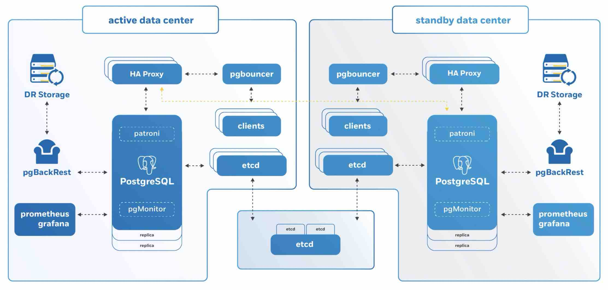

## 交互式学习 PostgreSQL - 纯PG小白的进阶指南    
    
### 作者    
digoal    
    
### 日期    
2020-08-14    
    
### 标签    
PostgreSQL , 交互式学习    
    
----    
    
## 背景    
如果你是PG小白, 想软着陆入门PostgreSQL, 同时希望未来有较大提升. 可以看一下这篇文档.     
    
Crunchy是一家专注于让PG在企业中持续运行的产品开发商.     
    
    
    
同时也是PostgreSQL的major sponsor, 他们提供了一个比较好的交互式学习PG的文档和平台. 建议可以先从这里学起, 多练习.     
    
https://learn.crunchydata.com/    
    
PostgreSQL Interactive Learning Portal    
    
PostgreSQL Administration    
- 1 - Setting Up PostgreSQL    
- 2 - Setting Up PostgreSQL Replication    
- 3 - PG Dump & Restore    
- 4 - PGBasebackup    
- 5 - pgBackRest    
- 6 - Failover    
- Native Partitioning    
- Logical Replication    
    
PostgreSQL for Application Developers    
- Introduction to Using the Command Line with PostgreSQL    
- Introduction to Create Table in PostgreSQL    
- Introduction to Data Types    
- Advanced Data Types    
- Introduction to PostgreSQL Data Constraints    
- Add Data with INSERT    
- Introduction To PostgreSQL in Containers    
- Using PgAdmin4 as a GUI to your PostgreSQL Server    
- Using EXPLAIN (ANALYZE) on Your Queries    
- Introduction to Indexes    
- Index Types in PostgreSQL    
    
Full Text Search in PostgreSQL    
- JSON in PostgreSQL 11    
- Basics of Writing PostgreSQL Functions    
- Using R in PostgreSQL    
- Using Python in PostgreSQL    
- Learning Lateral Joins    
    
PostGIS    
- 0 - Quick Introduction To PostGIS    
- 1 - Geometries    
- 2 - Geography    
- 3 - Projection    
- 4 - Spatial Relationships    
- 5 - Geometry Constructing Functions    
- 6 - Spatial Joins    
- 7 - Advanced Spatial Joins    
- 8 - Spatial Indexing    
- 9 - Creating Spatial Features with pg_featureserv    
- 10 - Creating Dynamic Vector Tiles with pg_tileserv    
    
PostgreSQL for Kubernetes/OpenShift    
- Basic Usage of the Crunchy Postgres Operator    
- Advanced Usage of the Crunchy Postgres Operator    
    
配套的文档:     
    
https://www.crunchydata.com/developers/postgresql-documentation    
    
学完以上的内容, 可以再辅助参考一下    
    
https://www.postgresqltutorial.com/    
    
https://lab.demog.berkeley.edu/Docs/Refs/aw_pgsql_book.pdf    
    
https://momjian.us/main/writings/pgsql/aw_pgsql_book/    
    
以及PostgreSQL的官方文档.    
    
进阶学习:    
    
http://www.interdb.jp/pg/    
    
案例、解决方案学习:    
    
[《PostgreSQL、Greenplum 《如来神掌》》](../201706/20170601_02.md)        
    
[《PG digoal blog》](../README.md)        
    
  
  
  
  
  
  
  
  
  
  
  
  
  
  
  
  
  
  
  
  
  
  
  
  
  
  
  
  
  
  
  
  
  
  
  
  
  
  
  
  
  
  
  
  
  
  
  
  
  
  
  
  
  
#### [PostgreSQL 许愿链接](https://github.com/digoal/blog/issues/76 "269ac3d1c492e938c0191101c7238216")
您的愿望将传达给PG kernel hacker、数据库厂商等, 帮助提高数据库产品质量和功能, 说不定下一个PG版本就有您提出的功能点. 针对非常好的提议，奖励限量版PG文化衫、纪念品、贴纸、PG热门书籍等，奖品丰富，快来许愿。[开不开森](https://github.com/digoal/blog/issues/76 "269ac3d1c492e938c0191101c7238216").  
  
  
#### [9.9元购买3个月阿里云RDS PostgreSQL实例](https://www.aliyun.com/database/postgresqlactivity "57258f76c37864c6e6d23383d05714ea")
  
  
#### [PostgreSQL 解决方案集合](https://yq.aliyun.com/topic/118 "40cff096e9ed7122c512b35d8561d9c8")
  
  
#### [德哥 / digoal's github - 公益是一辈子的事.](https://github.com/digoal/blog/blob/master/README.md "22709685feb7cab07d30f30387f0a9ae")
  
  

  
  
#### [PolarDB 学习图谱: 训练营、培训认证、在线互动实验、解决方案、生态合作、写心得拿奖品](https://www.aliyun.com/database/openpolardb/activity "8642f60e04ed0c814bf9cb9677976bd4")
  
  
#### [购买PolarDB云服务折扣活动进行中, 55元起](https://www.aliyun.com/activity/new/polardb-yunparter?userCode=bsb3t4al "e0495c413bedacabb75ff1e880be465a")
  
  
#### [About 德哥](https://github.com/digoal/blog/blob/master/me/readme.md "a37735981e7704886ffd590565582dd0")
  
