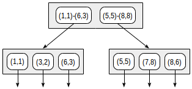
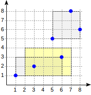
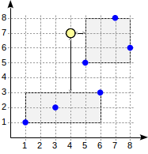
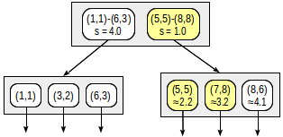
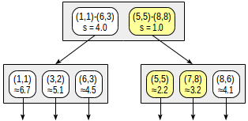

## PostgreSQL GiST 索引原理 - 1       
        
### 作者        
digoal        
        
### 日期        
2020-10-04        
        
### 标签        
PostgreSQL , GiST , 索引原理         
        
----        
        
## 背景       
[《PostgreSQL 9种索引的原理和应用场景》](../201706/20170627_01.md)      
    
从GiST的实现原理梳理这个索引的起源, 结构, 应用场景.     
    
传统数据库自定义索引的门槛非常高. 需要非常专业的知识, 1、需要理解索引逻辑, 2、由于数据库是page组织, 还需要映射数据结构和page的关系(有些索引可能还有逻辑node的概念, 需要将node再组织映射到数据库的page). 3、还需要实现数据库的锁, 4、实现wal 预写日志等.     
    
然而PG是可扩展数据库, 提供了索引扩展模块, 用户只需要专业的业务知识, 不需要数据库知识即可扩展索引. 例如GiST索引模块, 提供了一些固定的函数接口, 实现这些接口, 即可使用GiST索引加速搜索数据,     
    
GiST simplifies the task by taking over low-level problems and offering its own interface: several functions pertaining not to techniques, but to the application domain. In this sense, we can regard GiST as a framework for building new access methods.    
    
https://postgrespro.com/blog/pgsql/4175817    
    
https://www.postgresql.org/docs/13/gist-extensibility.html    
    
https://www.postgresql.org/docs/13/xindex.html    
    
## 1、GiST结构    
数据组织:    
- 高度平衡树: 包括root, internal, leaf page. 从索引的root节点开始搜索到每个叶子结点的高度是一致的. (GiST is a height-balanced tree that consists of node pages. The nodes consist of index rows.)    
- leaf node的每一行包括: 关联的predicate 函数(返回boolean的表达式)、heap ctid 地址(行号).  这条heap tuple的value必须匹配这个predicate 函数(即返回true). 例如exp(CONST val)    
- internal node的每一行包括: 关联的predicate 函数(返回boolean的表达式)、child node的地址.  child node对应的所有heap tuple(s)的value必须匹配这个predicate 函数(即返回true). 例如exp(CONST val). (In other words, the predicate of an internal row comprises the predicates of all child rows.)    
    
数据搜索:     
- 每一个支持索引的PG的操作符都必须对应一个consistency function, 用于搜索数据.  ```indexed-field operator expression```, 例如 ```where box @> point``` 这里的 ```@>```    
- 对于internal row, consistency_func(CONST val)返回true时, 表示对应child node可能有满足条件的记录.    
- 对于leaf row, consistency_func(CONST val)返回true时, 表示对应heap tuple符合查询要求.    
    
搜索顺序:    
- 从root node开始搜索.    
- 深度优先. 当同一level有很多node符合consistency function条件时, 从一个node深挖, 直到leaf node, 找到符合条件的记录为止. 所以返回limit n少量行, 效果非常好.     
    - The search starts with a root node, as a normal tree search. The consistency function permits to find out which child nodes it makes sense to enter (there may be several of them) and which it does not. The algorithm is then repeated for each child node found. And if the node is leaf, the row selected by the consistency function is returned as one of the results.    
    - The search is depth-first: the algorithm first tries to reach a leaf node. This permits to return first results soon whenever possible (which might be important if the user is interested in only several results rather than all of them).    
    
索引的逻辑膨胀(插入、删除、更新):    
- 当数据写入时, 最理想的情况是被选择的node的predict func(CONST val)可以包含被插入的value. 不需要打乱数据结构. 但是有些情况可能需要split CONST val, 或者新增node. 导致膨胀.    
- 当数据删除时, 被删除记录所在的node的CONST val不会缩小范围. 虽然数据占用的空间没有膨胀, 但是逻辑范围实际上是稀疏(膨胀)的, 可能影响搜索效率.     
- 收缩逻辑膨胀与物理碰撞. reindex或vacuum full. 或者使用pg_repack在线收缩.    
    
### 1、数据分配(predicate)函数    
数据逻辑重组为node时需要的predict function. 每个node对应有CONST val, 这个node的predict_express(CONST val)返回true.     
    
### 2、搜索(consistency、Strategy)函数    
    
每个操作符(索引搜索)对应一个consis_func.    
    
搜索时, 使用consis_func(CONST val), 返回true表示这个node的记录或child node满足这个搜索条件.    
    
## 2、使用什么插件观察GiST的结构    
    
常规的“ pageinspect” 插件不允许查看GiST索引。但是还有另一种方法可用：“ gevel” 扩展插件。它不包括在标准交付中，因此请参阅安装说明。    
    
http://www.sai.msu.su/~megera/wiki/Gevel    
    
例子    
    
获得一些统计信息    
    
```    
postgres=# select * from gist_stat('airports_coordinates_idx');    
    
                gist_stat                    
------------------------------------------    
 Number of levels:          4            +    
 Number of pages:           690          +    
 Number of leaf pages:      625          +    
 Number of tuples:          7873         +    
 Number of invalid tuples:  0            +    
 Number of leaf tuples:     7184         +    
 Total size of tuples:      354692 bytes +    
 Total size of leaf tuples: 323596 bytes +    
 Total size of index:       5652480 bytes+    
     
(1 row)    
```    
    
输出索引树    
    
```    
postgres=# select * from gist_tree('airports_coordinates_idx');    
                                       gist_tree                                                  
-----------------------------------------------------------------------------------------    
 0(l:0) blk: 0 numTuple: 5 free: 7928b(2.84%) rightlink:4294967295 (InvalidBlockNumber) +    
     1(l:1) blk: 335 numTuple: 15 free: 7488b(8.24%) rightlink:220 (OK)                 +    
         1(l:2) blk: 128 numTuple: 9 free: 7752b(5.00%) rightlink:49 (OK)               +    
             1(l:3) blk: 57 numTuple: 12 free: 7620b(6.62%) rightlink:35 (OK)           +    
             2(l:3) blk: 62 numTuple: 9 free: 7752b(5.00%) rightlink:57 (OK)            +    
             3(l:3) blk: 72 numTuple: 7 free: 7840b(3.92%) rightlink:23 (OK)            +    
             4(l:3) blk: 115 numTuple: 17 free: 7400b(9.31%) rightlink:33 (OK)          +    
 ...    
```    
    
输出存储在索引行中的数据。函数的结果必须强制转换为所需的数据类型。例子使用的是rtree point类型, 所以CONST val是“框”（边界矩形）。    
    
```    
postgres=# select level, a from gist_print('airports_coordinates_idx')    
  as t(level int, valid bool, a box) where level = 1;    
    
 level |                                   a                                      
-------+-----------------------------------------------------------------------    
     1 | (47.663586,80.803207),(-39.2938003540039,-90)    
     1 | (179.951004028,15.6700000762939),(15.2428998947144,-77.9634017944336)    
     1 | (177.740997314453,73.5178070068359),(15.0664,10.57970047)    
     1 | (-77.3191986083984,79.9946975708),(-179.876998901,-43.810001373291)    
     1 | (-39.864200592041,82.5177993774),(-81.254096984863,-64.2382965088)    
(5 rows)    
```    
    
## 3、使用什么SQL能查询GiST索引支持的操作符号以及对应的搜索(一致性、策略)函数    
    
```    
postgres=# select amop.amopopr::regoperator, amop.amoppurpose, amop.amopstrategy    
from pg_opclass opc, pg_opfamily opf, pg_am am, pg_amop amop    
where opc.opcname = 'point_ops'    
and opf.oid = opc.opcfamily    
and am.oid = opf.opfmethod    
and amop.amopfamily = opc.opcfamily    
and am.amname = 'gist'    
and amop.amoplefttype = opc.opcintype;    
    
      amopopr      | amoppurpose | amopstrategy    
-------------------+-------------+--------------    
 <<(point,point)   | s           |            1  strictly left    
 >>(point,point)   | s           |            5  strictly right    
 ~=(point,point)   | s           |            6  coincides    
 <^(point,point)   | s           |           10  strictly below    
 >^(point,point)   | s           |           11  strictly above    
 (point,point)  | o           |           15  distance    
 <@(point,box)     | s           |           28  contained in rectangle    
 <@(point,polygon) | s           |           48  contained in polygon    
 <@(point,circle)  | s           |           68  contained in circle    
(9 rows)    
```    
    
- S 表示这是普通搜索函数.    
- O 表示这个是order by函数.    
    
## 4、R-tree for points例子    
    
We will illustrate the above by example of an index for points in a plane (we can also build similar indexes for other geometric entities). A regular B-tree does not suit this data type of data since no comparison operators are defined for points.    
    
The idea of R-tree is to split the plane into rectangles that in total cover all the points being indexed. An index row stores a rectangle, and the predicate can be defined like this: "the point sought lies within the given rectangle".    
    
The root of the R-tree will contain several largest rectangles 可能重叠，不影响查询(possibly intersecting). Child nodes will contain smaller-size rectangles that are embedded in the parent one and in total cover all underlying points.    
    
这句话需要注意，不管是叶子节点还是内部节点, index tuple value的类型必须一致， 所以point字段在gist index的leaf node实际上不是point类型， 而是与内部节点对齐的rectangles类型。 只是对角相等坍塌为point。    
In theory, leaf nodes must contain points being indexed, but the data type must be the same in all index rows and therefore, again rectangles are stored, but "collapsed" into points.    
    
To visualize such a structure, we provide images for three levels of the R-tree. Points are coordinates of airports (similar to those from the "airports" table of the demo database, but more data from openflights.org is provided).    
    
    
Level one: two large intersecting rectangles are visible.    
    
    
Level two: large rectangles are split into smaller areas.    
    
    
Level three: each rectangle contains as many points as to fit one index page.    
    
Now let's consider a very simple "one-level" example:    
    
    
```    
postgres=# create table points(p point);    
    
postgres=# insert into points(p) values    
  (point '(1,1)'), (point '(3,2)'), (point '(6,3)'),    
  (point '(5,5)'), (point '(7,8)'), (point '(8,6)');    
    
postgres=# create index on points using gist(p);    
```    
    
With this splitting, the index structure will look as follows:    
    
    
    
The index created can be used to speed up the following query, for example: "find all points contained in the given rectangle". This condition can be formalized as follows: ```p <@ box '(2,1),(6,3)'``` (operator ```<@``` from "points_ops" family means "contained in"):    
    
```    
postgres=# set enable_seqscan = off;    
    
postgres=# explain(costs off) select * from points where p <@ box '(2,1),(7,4)';    
    
                  QUERY PLAN                      
----------------------------------------------    
 Index Only Scan using points_p_idx on points    
   Index Cond: (p <@ '(7,4),(2,1)'::box)    
(2 rows)    
```    
    
The consistency function of the operator (```indexed-field <@ expression```, where indexed-field is a point and expression is a rectangle) is defined as follows. For an internal row, it returns "yes" if its rectangle intersects with the rectangle defined by the expression. For a leaf row, the function returns "yes" if its point ("collapsed" rectangle) is contained in the rectangle defined by the expression.    
    
    
    
    
The search starts with the root node. The rectangle ```(2,1)-(7,4)``` intersects with ```(1,1)-(6,3)```, but does not intersect with ```(5,5)-(8,8)```, therefore, there is no need to descend to the second subtree.    
    
    
    
Upon reaching a leaf node, we go through the three points contained there and return two of them as the result: ```(3,2) и (6,3)```.    
    
```    
postgres=# select * from points where p <@ box '(2,1),(7,4)';    
    
   p      
-------    
 (3,2)    
 (6,3)    
(2 rows)    
```    
    
## 5、使用GiST索引排序 - 例如二维平面给出某个point, 按距离这个point的顺序返回记录    
    
Operators discussed so far (such as ```<@``` in the predicate ```p <@ box '(2,1),(7,4)'```) can be called search operators since they specify search conditions in a query.    
    
There is also another operator type: ordering operators. They are used for specifications of the sort order in ORDER BY clause instead of conventional specifications of column names. The following is an example of such a query:    
    
```    
postgres=# select * from points order by p <-> point '(4,7)' limit 2;    
    
   p      
-------    
 (5,5)    
 (7,8)    
(2 rows)    
```    
    
```p <-> point '(4,7)'``` here is an expression that uses an ordering operator ```<->```, which denotes the distance from one argument to the other one. The meaning of the query is to return two points closest to the point ```(4,7)```. Search like this is known as ```k-NN - k-nearest neighbor search```. To support queries of this kind, an access method must define an additional distance function, and the ordering operator must be included in the appropriate operator class (for example, "points_ops" class for points). The query below shows operators, along with their types (```"s" - search and "o" - ordering```):    
    
```    
postgres=# select amop.amopopr::regoperator, amop.amoppurpose, amop.amopstrategy    
from pg_opclass opc, pg_opfamily opf, pg_am am, pg_amop amop    
where opc.opcname = 'point_ops'    
and opf.oid = opc.opcfamily    
and am.oid = opf.opfmethod    
and amop.amopfamily = opc.opcfamily    
and am.amname = 'gist'    
and amop.amoplefttype = opc.opcintype;    
    
      amopopr      | amoppurpose | amopstrategy    
-------------------+-------------+--------------    
 <<(point,point)   | s           |            1  strictly left    
 >>(point,point)   | s           |            5  strictly right    
 ~=(point,point)   | s           |            6  coincides    
 <^(point,point)   | s           |           10  strictly below    
 >^(point,point)   | s           |           11  strictly above    
 (point,point)  | o           |           15  distance    
 <@(point,box)     | s           |           28  contained in rectangle    
 <@(point,polygon) | s           |           48  contained in polygon    
 <@(point,circle)  | s           |           68  contained in circle    
(9 rows)    
```    
    
The numbers of strategies are also shown, with their meanings explained. It is clear that there are far more strategies than for "btree", only some of them being supported for points. Different strategies can be defined for other data types.    
    
The distance function is called for an index element, and it must compute the distance (taking into account the operator semantics) from the value defined by the expression ("indexed-field ordering-operator expression") to the given element. For a leaf element, this is just the distance to the indexed value. For an internal element, the function must return the minimum of the distances to the child leaf elements. Since going through all child rows would be pretty costly, the function is permitted to optimistically underestimate the distance, but at the expense of reducing the search efficiency. However, the function is never permitted to overestimate the distance since this will disrupt the work of the index.    
    
The distance function can return values of any sortable type (to order values, PostgreSQL will use comparison semantics from the appropriate operator family of "btree" access method, as described earlier).    
    
For points in a plane, the distance is interpreted in a very usual sense: the value of ```(x1,y1) <-> (x2,y2)``` equals the square root of the sum of squares of differences of the abscissas and ordinates. The distance from a point to a bounding rectangle is taken to be the minimal distance from the point to this rectangle or zero if the point lies within the rectangle. It is easy to compute this value without walking through child points, and the value is for sure no greater than the distance to any child point.    
    
Let's consider the search algorithm for the above query.    
    
    
    
The search starts with the root node. The node contains two bounding rectangles. The distance to ```(1,1)-(6,3)``` is 4.0 and to ```(5,5)-(8,8)``` is 1.0.    
    
Child nodes are walked through in the order of increasing the distance. This way, we first descend to the nearest child node and compute the distances to the points (we will show the numbers in the figure for visibility):    
    
    
    
This information suffices to return the first two points, ```(5,5)``` and ```(7,8)```. Since we are aware that the distance to points that lie within the rectangle ```(1,1)-(6,3)``` is 4.0 or greater, we do not need to descend to the first child node.    
    
But what if we needed to find the first three points?    
    
```    
postgres=# select * from points order by p  point '(4,7)' limit 3;    
    
   p      
-------    
 (5,5)    
 (7,8)    
 (8,6)    
(3 rows)    
```    
    
Although the second child node contains all these points, we cannot return ```(8,6)``` without looking into the first child node since this node can contain closer points (since ```4.0 < 4.1```).    
    
    
    
For internal rows, this example clarifies requirements for the distance function. By selecting smaller distance (4.0 instead of actual 4.5) for the second row, we reduced the efficiency (the algorithm needlessly started examining an extra node), but did not break correctness of the algorithm.    
    
Until recently, GiST was the only access method capable of dealing with ordering operators. But the situation has changed: RUM access method (to be discussed further) has already joined this group of methods, and it is not unlikely that good old B-tree will join them: a patch developed by Nikita Glukhov, our colleague, is being discussed by the community.    
    
As of march 2019, k-NN support is added for SP-GiST in upcoming PostgreSQL 12 (also authored by Nikita). Patch for B-tree is still in progress.    
    
## 参考    
https://postgrespro.com/blog/pgsql/4175817    
    
https://www.postgresql.org/docs/13/gist-extensibility.html    
    
https://www.postgresql.org/docs/13/xindex.html    
    
[《PostgreSQL 9种索引的原理和应用场景》](../201706/20170627_01.md)      
    
http://www.sai.msu.su/~megera/wiki/Gevel    
      
  
#### [PostgreSQL 许愿链接](https://github.com/digoal/blog/issues/76 "269ac3d1c492e938c0191101c7238216")
您的愿望将传达给PG kernel hacker、数据库厂商等, 帮助提高数据库产品质量和功能, 说不定下一个PG版本就有您提出的功能点. 针对非常好的提议，奖励限量版PG文化衫、纪念品、贴纸、PG热门书籍等，奖品丰富，快来许愿。[开不开森](https://github.com/digoal/blog/issues/76 "269ac3d1c492e938c0191101c7238216").  
  
  
#### [9.9元购买3个月阿里云RDS PostgreSQL实例](https://www.aliyun.com/database/postgresqlactivity "57258f76c37864c6e6d23383d05714ea")
  
  
#### [PostgreSQL 解决方案集合](https://yq.aliyun.com/topic/118 "40cff096e9ed7122c512b35d8561d9c8")
  
  
#### [德哥 / digoal's github - 公益是一辈子的事.](https://github.com/digoal/blog/blob/master/README.md "22709685feb7cab07d30f30387f0a9ae")
  
  

  
  
#### [PolarDB 学习图谱: 训练营、培训认证、在线互动实验、解决方案、生态合作、写心得拿奖品](https://www.aliyun.com/database/openpolardb/activity "8642f60e04ed0c814bf9cb9677976bd4")
  
  
#### [购买PolarDB云服务折扣活动进行中, 55元起](https://www.aliyun.com/activity/new/polardb-yunparter?userCode=bsb3t4al "e0495c413bedacabb75ff1e880be465a")
  
  
#### [About 德哥](https://github.com/digoal/blog/blob/master/me/readme.md "a37735981e7704886ffd590565582dd0")
  
