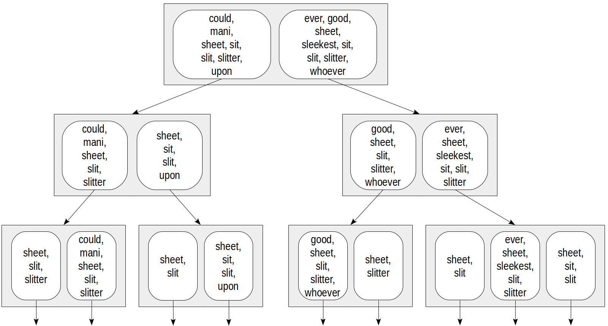
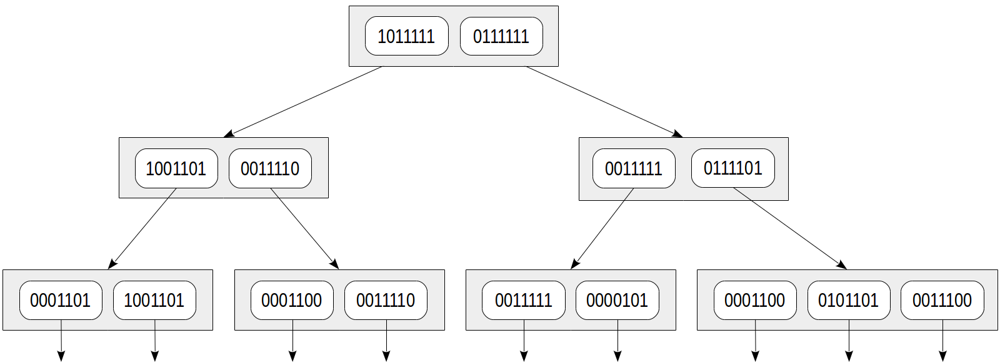

## PostgreSQL GiST 索引原理 - 3           
            
### 作者            
digoal            
            
### 日期            
2020-10-04            
            
### 标签            
PostgreSQL , GiST , 索引原理             
            
----            
            
## 背景        
RD-Tree, 在全文检索中的应用.    
    
1、由文本特征向量(词)组成的bound node, 缺点: 元素多的情况, 一个高level的index page可能无法存储大的bound, 适用范围窄.     
    
2、将特征向量使用hash函数映射到一个固定长度的bit string中, 一篇文本里面所有特征向量的bitand得到这个文档的特征向量. 缺点: bit string长度有限, 如果文本很多, hash函数映射到的同一个bit位可能需要对应多个不同的特征值. 使得结果可能不准, 需要recheck. 解决方案: 文档较小的行, 在index leaf page中存储原始向量值, 而不仅仅是bit string.     
    
## RD-tree for full-text search    
For fast full-text search, firstly, the table needs to store a column of type "tsvector" (to avoid performing a costly conversion each time when searching) and secondly, an index must be built on this column. One of possible access methods for this is GiST.    
    
```    
postgres=# create table ts(doc text, doc_tsv tsvector);    
    
postgres=# create index on ts using gist(doc_tsv);    
    
postgres=# insert into ts(doc) values    
  ('Can a sheet slitter slit sheets?'),     
  ('How many sheets could a sheet slitter slit?'),    
  ('I slit a sheet, a sheet I slit.'),    
  ('Upon a slitted sheet I sit.'),     
  ('Whoever slit the sheets is a good sheet slitter.'),     
  ('I am a sheet slitter.'),    
  ('I slit sheets.'),    
  ('I am the sleekest sheet slitter that ever slit sheets.'),    
  ('She slits the sheet she sits on.');    
    
postgres=# update ts set doc_tsv = to_tsvector(doc);    
```    
    
It is, certainly, convenient to entrust a trigger with the last step (conversion of the document to "tsvector").    
    
```    
postgres=# select * from ts;    
    
-[ RECORD 1 ]----------------------------------------------------    
doc     | Can a sheet slitter slit sheets?    
doc_tsv | 'sheet':3,6 'slit':5 'slitter':4    
-[ RECORD 2 ]----------------------------------------------------    
doc     | How many sheets could a sheet slitter slit?    
doc_tsv | 'could':4 'mani':2 'sheet':3,6 'slit':8 'slitter':7    
-[ RECORD 3 ]----------------------------------------------------    
doc     | I slit a sheet, a sheet I slit.    
doc_tsv | 'sheet':4,6 'slit':2,8    
-[ RECORD 4 ]----------------------------------------------------    
doc     | Upon a slitted sheet I sit.    
doc_tsv | 'sheet':4 'sit':6 'slit':3 'upon':1    
-[ RECORD 5 ]----------------------------------------------------    
doc     | Whoever slit the sheets is a good sheet slitter.    
doc_tsv | 'good':7 'sheet':4,8 'slit':2 'slitter':9 'whoever':1    
-[ RECORD 6 ]----------------------------------------------------    
doc     | I am a sheet slitter.    
doc_tsv | 'sheet':4 'slitter':5    
-[ RECORD 7 ]----------------------------------------------------    
doc     | I slit sheets.    
doc_tsv | 'sheet':3 'slit':2    
-[ RECORD 8 ]----------------------------------------------------    
doc     | I am the sleekest sheet slitter that ever slit sheets.    
doc_tsv | 'ever':8 'sheet':5,10 'sleekest':4 'slit':9 'slitter':6    
-[ RECORD 9 ]----------------------------------------------------    
doc     | She slits the sheet she sits on.    
doc_tsv | 'sheet':4 'sit':6 'slit':2    
```    
    
How should the index be structured? Use of R-tree directly is not an option since it is unclear how to define a "bounding rectangle" for documents. But we can apply some modification of this approach for sets, a so-called RD-tree (RD stands for "Russian Doll"). A set is understood to be a set of lexemes in this case, but in general, a set can be any.    
    
An idea of RD-trees is to replace a bounding rectangle with a bounding set, that is, a set that contains all elements of child sets.    
    
An important question arises how to represent sets in index rows. The most straightforward way is just to enumerate all elements of the set. This might look as follows:    
    
    
    
    
Then for example, for access by condition doc_tsv @@ to_tsquery('sit') we could descend only to those nodes that contain "sit" lexeme:    
    
    
    
    
This representation has evident issues. The number of lexemes in a document can be pretty large, so index rows will have large size and get into TOAST, making the index far less efficient. Even if each document has few unique lexemes, the union of sets may still be very large: the higher to the root the larger index rows.    
    
A representation like this is sometimes used, but for other data types. And full-text search uses another, more compact, solution — a so-called signature tree. Its idea is quite familiar to all who dealt with Bloom filter.    
    
Each lexeme can be represented with its signature: a bit string of a certain length where all bits but one are zero. The position of this bit is determined by the value of hash function of the lexeme (we discussed internals of hash functions earlier).    
    
The document signature is the bitwise OR of the signatures of all document lexemes.    
    
Let's assume the following signatures of lexemes:    
    
注意, bit位数有限, 少于lexemes个数, 所以hash函数映射的bit位置有重复现象, 例如mani和sheet的bit对应位置相同.      
    
gist rd-tree也能用于不包含某个lexeme的搜索.  搜索对应bit为0的page即可.      
    
```    
could    1000000    
ever     0001000    
good     0000010    
mani     0000100    
sheet    0000100    
sleekest 0100000    
sit      0010000    
slit     0001000    
slitter  0000001    
upon     0000010    
whoever  0010000    
```    
    
Then signatures of the documents are like these:    
    
每篇文档的签名由所有lexemes对应bit的bitand的结果    
    
```    
Can a sheet slitter slit sheets?                       0001101    
How many sheets could a sheet slitter slit?            1001101    
I slit a sheet, a sheet I slit.                        0001100    
Upon a slitted sheet I sit.                            0011110    
Whoever slit the sheets is a good sheet slitter.       0011111    
I am a sheet slitter.                                  0000101    
I slit sheets.                                         0001100    
I am the sleekest sheet slitter that ever slit sheets. 0101101    
She slits the sheet she sits on.                       0011100    
```    
    
The index tree can be represented as follows:    
    
    
    
    
The advantages of this approach are evident: index rows have equal small sizes, and such an index is compact. But a drawback is also clear: the accuracy is sacrificed to compactness.    
    
Let's consider the same condition ```doc_tsv @@ to_tsquery('sit')```. And let's compute the signature of the search query the same way as for the document: ```0010000``` in this case. The consistency function must return all child nodes whose signatures contain at least one bit from the query signature:    
    
    
    
    
Compare with the figure above: we can see that the tree turned yellow, which means that false positives occur and excessive nodes are went through during the search. Here we picked up "whoever" lexeme, whose signature unfortunately was the same as the signature of "sit" lexeme. It's important that no false negatives can occur in the pattern, that is, we are sure not to miss needed values.    
    
Besides, it may so happen that different documents will also get the same signatures: in our example, unlucky documents are ```"I slit a sheet, a sheet I slit"``` and ```"I slit sheets"``` (both have the signature of 0001100). And if a leaf index row does not store the value of "tsvector", the index itself will give false positives. Of course, in this case, the method will ask the indexing engine to recheck the result with the table, so the user will not see these false positives. But the search efficiency may get compromised.    
    
Actually, a signature is 124-byte large in the current implementation instead of 7-bit in the figures, so the above issues are much less likely to occur than in the example. But in reality, much more documents get indexed as well. To somehow reduce the number of false positives of the index method, the implementation gets a little tricky: the indexed "tsvector" is stored in a leaf index row, but only if its size is not large (a little less than 1/16 of a page, which is about half a kilobyte for 8-KB pages).    
    
### Example    
To see how indexing works on actual data, let's take the archive of "pgsql-hackers" email. The version used in the example contains 356125 messages with the send date, subject, author, and text:    
    
```    
fts=# select * from mail_messages order by sent limit 1;    
    
-[ RECORD 1 ]------------------------------------------------------------------------    
id         | 1572389    
parent_id  | 1562808    
sent       | 1997-06-24 11:31:09    
subject    | Re: [HACKERS] Array bug is still there....    
author     | "Thomas G. Lockhart" <Thomas.Lockhart@jpl.nasa.gov>    
body_plain | Andrew Martin wrote:                                                    +    
           | > Just run the regression tests on 6.1 and as I suspected the array bug +    
           | > is still there. The regression test passes because the expected output+    
           | > has been fixed to the *wrong* output.                                 +    
           |                                                                         +    
           | OK, I think I understand the current array behavior, which is apparently+    
           | different than the behavior for v1.0x.                                  +    
             ...    
```    
    
Adding and filling in the column of "tsvector" type and building the index. Here we will join three values in one vector (subject, author, and message text) to show that the document does not need to be one field, but can consist of totally different arbitrary parts.    
    
```    
fts=# alter table mail_messages add column tsv tsvector;    
    
fts=# update mail_messages    
set tsv = to_tsvector(subject||' '||author||' '||body_plain);    
    
NOTICE:  word is too long to be indexed    
DETAIL:  Words longer than 2047 characters are ignored.    
...    
UPDATE 356125    
    
fts=# create index on mail_messages using gist(tsv);     
```    
    
As we can see, a certain number of words were dropped because of too large size. But the index is eventually created and can support search queries:    
    
```    
fts=# explain (analyze, costs off)    
select * from mail_messages where tsv @@ to_tsquery('magic & value');    
    
                        QUERY PLAN    
----------------------------------------------------------    
 Index Scan using mail_messages_tsv_idx on mail_messages    
 (actual time=0.998..416.335 rows=898 loops=1)    
   Index Cond: (tsv @@ to_tsquery('magic & value'::text))    
   Rows Removed by Index Recheck: 7859    
 Planning time: 0.203 ms    
 Execution time: 416.492 ms    
(5 rows)    
```    
    
We can see that together with 898 rows matching the condition, the access method returned 7859 more rows that were filtered out by rechecking with the table. This demonstrates a negative impact of the loss of accuracy on the efficiency.    
    
### Internals    
To analyze the contents of the index, we will again use "gevel" extension:    
    
```    
fts=# select level, a    
from gist_print('mail_messages_tsv_idx') as t(level int, valid bool, a gtsvector)    
where a is not null;    
    
 level |               a                  
-------+-------------------------------    
     1 | 992 true bits, 0 false bits    
     2 | 988 true bits, 4 false bits    
     3 | 573 true bits, 419 false bits  -- 越高level的page, 包含的特征向量个数越多, 所以采用bit strings存储, 而不存储原始words.     
     4 | 65 unique words -- 显示unique words说明这个page包含了特征向量原始值, 可以避免recheck    
     4 | 107 unique words    
     4 | 64 unique words    
     4 | 42 unique words    
...    
```    
    
Values of the specialized type "gtsvector" that are stored in index rows are actually the signature plus, maybe, the source "tsvector". If the vector is available, the output contains the number of lexemes (unique words), otherwise, the number of true and false bits in the signature.    
    
It is clear that in the root node, the signature degenerated to "all ones", that is, one index level became absolutely useless (and one more became almost useless, with only four false bits).    
    
## 参考    
    
https://postgrespro.com/blog/pgsql/4175817    
    
    
  
#### [PostgreSQL 许愿链接](https://github.com/digoal/blog/issues/76 "269ac3d1c492e938c0191101c7238216")
您的愿望将传达给PG kernel hacker、数据库厂商等, 帮助提高数据库产品质量和功能, 说不定下一个PG版本就有您提出的功能点. 针对非常好的提议，奖励限量版PG文化衫、纪念品、贴纸、PG热门书籍等，奖品丰富，快来许愿。[开不开森](https://github.com/digoal/blog/issues/76 "269ac3d1c492e938c0191101c7238216").  
  
  
#### [9.9元购买3个月阿里云RDS PostgreSQL实例](https://www.aliyun.com/database/postgresqlactivity "57258f76c37864c6e6d23383d05714ea")
  
  
#### [PostgreSQL 解决方案集合](https://yq.aliyun.com/topic/118 "40cff096e9ed7122c512b35d8561d9c8")
  
  
#### [德哥 / digoal's github - 公益是一辈子的事.](https://github.com/digoal/blog/blob/master/README.md "22709685feb7cab07d30f30387f0a9ae")
  
  

  
  
#### [PolarDB 学习图谱: 训练营、培训认证、在线互动实验、解决方案、生态合作、写心得拿奖品](https://www.aliyun.com/database/openpolardb/activity "8642f60e04ed0c814bf9cb9677976bd4")
  
  
#### [购买PolarDB云服务折扣活动进行中, 55元起](https://www.aliyun.com/activity/new/polardb-yunparter?userCode=bsb3t4al "e0495c413bedacabb75ff1e880be465a")
  
  
#### [About 德哥](https://github.com/digoal/blog/blob/master/me/readme.md "a37735981e7704886ffd590565582dd0")
  
