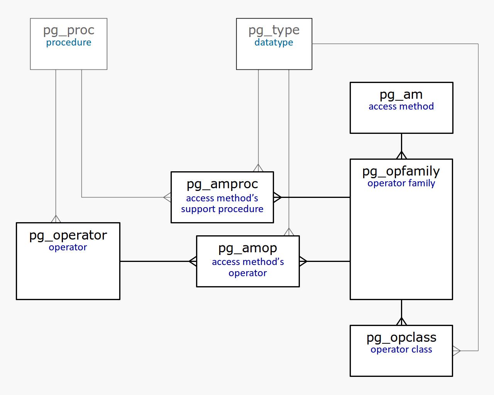

## PostgreSQL GiST 索引原理 - 4               
                
### 作者                
digoal                
                
### 日期                
2020-10-04                
                
### 标签                
PostgreSQL , GiST , 索引原理                 
                
----                
                
## 背景         
如何得知GiST索引的属性|功能?     
    
    
    
All properties of access methods are stored in the "pg_am" table ("am" stands for access method). We can also get a list of available methods from this same table:    
    
```    
postgres=# select amname from pg_am;    
    
 amname    
--------    
 btree    
 hash    
 gist    
 gin    
 spgist    
 brin    
(6 rows)    
```    
    
Let's look at the properties of GiST access method (queries were provided earlier):    
    
```    
postgres=# select a.amname, p.name, pg_indexam_has_property(a.oid,p.name)    
from pg_am a,    
     unnest(array['can_order','can_unique','can_multi_col','can_exclude']) p(name)    
where a.amname = 'gist'    
order by a.amname;    
    
 amname |     name      | pg_indexam_has_property    
--------+---------------+-------------------------    
 gist   | can_order     | f    
 gist   | can_unique    | f    
 gist   | can_multi_col | t    
 gist   | can_exclude   | t    
```    
    
- can_order.    
    - The access method enables us to specify the sort order for values when an index is created (only applicable to "btree" so far).    
- can_unique.    
    - Support of the unique constraint and primary key (only applicable to "btree").    
- can_multi_col.    
    - An index can be built on several columns.    
- can_exclude.    
    - Support of the exclusion constraint EXCLUDE.    
    
Sorting of values and unique constraint are not supported. As we've seen, the index can be built on several columns and used in exclusion constraints.    
    
查询指定索引的功能:     
    
The following index-layer properties are available:    
    
```    
postgres=# select p.name, pg_index_has_property('t_a_idx'::regclass,p.name)    
from unnest(array[    
       'clusterable','index_scan','bitmap_scan','backward_scan'    
     ]) p(name);    
    
     name      | pg_index_has_property    
---------------+-----------------------    
 clusterable   | t    
 index_scan    | t    
 bitmap_scan   | t    
 backward_scan | f    
```    
    
- clusterable.    
    - A possibility to reorder rows according to the index (clustering with the same-name command CLUSTER).    
- index_scan.    
    - Support of index scan. Although this property may seem odd, not all indexes can return TIDs one by one - some return results all at once and support only bitmap scan.    
- bitmap_scan.    
    - Support of bitmap scan.    
- backward_scan.    
    - The result can be returned in the reverse order of the one specified when building the index.    
    
    
And the most interesting properties are those of the column layer. Some of the properties are independent of operator classes:    
    
```    
postgres=# select p.name,    
     pg_index_column_has_property('t_a_idx'::regclass,1,p.name)    
from unnest(array[    
       'asc','desc','nulls_first','nulls_last','orderable','distance_orderable',    
       'returnable','search_array','search_nulls'    
     ]) p(name);    
    
        name        | pg_index_column_has_property    
--------------------+------------------------------    
 asc                | f    
 desc               | f    
 nulls_first        | f    
 nulls_last         | f    
 orderable          | f    
 search_array       | f    
 search_nulls       | t    
```    
    
- asc, desc, nulls_first, nulls_last, orderable.    
    - These properties are related to ordering the values (we'll discuss them when we reach a description of "btree" indexes).    
- distance_orderable.    
    - The result can be returned in the sort order determined by the operation (only applicable to GiST and RUM indexes so far).    
- returnable.    
    - A possibility to use the index without accessing the table, that is, support of index-only scans.    
- search_array.    
    - Support of search for several values with the expression ```«indexed-field IN (list_of_constants)»```, which is the same as ```«indexed-field = ANY(array_of_constants)»```.    
- search_nulls.    
    - A possibility to search by IS NULL and IS NOT NULL conditions.    
    
    
(Sorting is not supported; the index cannot be used to search an array; NULLs are supported.)    
    
But the two remaining properties, "distance_orderable" and "returnable", will depend on the operator class used. For example, for points we will get:    
    
```    
        name        | pg_index_column_has_property    
--------------------+------------------------------    
 distance_orderable | t    
 returnable         | t    
```    
    
The first property tells that the distance operator is available for search of nearest neighbors. And the second one tells that the index can be used for index-only scan. Although leaf index rows store rectangles rather than points, the access method can return what's needed.    
    
The following are the properties for intervals:    
    
```    
        name        | pg_index_column_has_property    
--------------------+------------------------------    
 distance_orderable | f    
 returnable         | t    
```    
    
For intervals, the distance function is not defined and therefore, search of nearest neighbors is not possible.    
    
And for full-text search, we get:    
    
```    
        name        | pg_index_column_has_property    
--------------------+------------------------------    
 distance_orderable | f    
 returnable         | f    
```    
    
Support of index-only scan has been lost since leaf rows can contain only the signature without the data itself. However, this is a minor loss since nobody is interested in the value of type "tsvector" anyway: this value is used to select rows, while it is source text that needs to be shown, but is missing from the index anyway.    
    
## Other data types    
GiST除了支持几何、全文检索、interval(范围) , 还支持哪些数据类型?    
    
Finally, we will mention a few more types that are currently supported by GiST access method in addition to already discussed geometric types (by example of points), intervals, and full-text search types.    
    
- the type ```"inet"``` for IP-addresses.     
- All the rest is added through extensions:    
    - cube provides ```"cube"``` data type for multi-dimensional cubes. For this type, just as for geometric types in a plane, GiST operator class is defined: R-tree, supporting search for nearest neighbors.    
    - seg provides ```"seg"``` data type for intervals with boundaries specified to a certain accuracy and adds support of GiST index for this data type (R-tree).    
    - ```intarray``` extends the functionality of integer arrays and adds GiST support for them. Two operator classes are implemented: "gist__int_ops" (RD-tree with a full representation of keys in index rows) and "gist__bigint_ops" (signature RD-tree). The first class can be used for small arrays, and the second one - for larger sizes.    
    - ```ltree``` adds "ltree" data type for tree-like structures and GiST support for this data type (RD-tree).    
    - ```pg_trgm``` adds a specialized operator class "gist_trgm_ops" for use of trigrams in full-text search. But this is to be discussed further, along with GIN index.    
    
## 参考            
https://postgrespro.com/blog/pgsql/4175817        
        
https://postgrespro.com/blog/pgsql/4161264    
  
  
#### [PostgreSQL 许愿链接](https://github.com/digoal/blog/issues/76 "269ac3d1c492e938c0191101c7238216")
您的愿望将传达给PG kernel hacker、数据库厂商等, 帮助提高数据库产品质量和功能, 说不定下一个PG版本就有您提出的功能点. 针对非常好的提议，奖励限量版PG文化衫、纪念品、贴纸、PG热门书籍等，奖品丰富，快来许愿。[开不开森](https://github.com/digoal/blog/issues/76 "269ac3d1c492e938c0191101c7238216").  
  
  
#### [9.9元购买3个月阿里云RDS PostgreSQL实例](https://www.aliyun.com/database/postgresqlactivity "57258f76c37864c6e6d23383d05714ea")
  
  
#### [PostgreSQL 解决方案集合](https://yq.aliyun.com/topic/118 "40cff096e9ed7122c512b35d8561d9c8")
  
  
#### [德哥 / digoal's github - 公益是一辈子的事.](https://github.com/digoal/blog/blob/master/README.md "22709685feb7cab07d30f30387f0a9ae")
  
  

  
  
#### [PolarDB 学习图谱: 训练营、培训认证、在线互动实验、解决方案、生态合作、写心得拿奖品](https://www.aliyun.com/database/openpolardb/activity "8642f60e04ed0c814bf9cb9677976bd4")
  
  
#### [购买PolarDB云服务折扣活动进行中, 55元起](https://www.aliyun.com/activity/new/polardb-yunparter?userCode=bsb3t4al "e0495c413bedacabb75ff1e880be465a")
  
  
#### [About 德哥](https://github.com/digoal/blog/blob/master/me/readme.md "a37735981e7704886ffd590565582dd0")
  
