## PostgreSQL SP-GiST 索引原理  
  
### 作者  
digoal  
  
### 日期  
2020-12-28  
  
### 标签  
PostgreSQL , SP-GiST  
  
----  
  
## 背景  
回顾  
  
[《PostgreSQL GiST 索引原理 - 4》](../202010/20201004_04.md)    
[《PostgreSQL GiST 索引原理 - 3》](../202010/20201004_03.md)    
[《PostgreSQL GiST 索引原理 - 2》](../202010/20201004_02.md)    
[《PostgreSQL GiST 索引原理 - 1》](../202010/20201004_01.md)    
  
### 1 GiST  
- GiST , 任何一条记录, 索引深度都一样, 是平衡树.   
- 数据写入时, 根据predict函数路由到对应node. 每个node包含一个集合. node与node之间可能存在取值范围交叉, 但是一条记录只会被路由到一个node.    
- node 可能存在很多层, 但是一颗索引树的所有root node 到任何leaf node的距离是相等的, 也就是平衡树.   
- root node包含最大取值集合, 所有child node的范围都落在root node的大范围中. node的取值范围逐级收敛, 直到Leaf node.   
- 搜索数据时, 使用consistent函数, 从root node开始逐级搜索匹配的node, 直到搜索到leaf node.    
- 支持rtree, rdtree等结构.   
- 支持排序和knn  
- 支持exclude约束  
  
#### GiST 扩展支持  
- cube provides "cube" data type for multi-dimensional cubes. For this type, just as for geometric types in a plane, GiST operator class is defined: R-tree, supporting search for nearest neighbors.  
- seg provides "seg" data type for intervals with boundaries specified to a certain accuracy and adds support of GiST index for this data type (R-tree).  
- intarray extends the functionality of integer arrays and adds GiST support for them. Two operator classes are implemented: "gist__int_ops" (RD-tree with a full representation of keys in index rows) and "gist__bigint_ops" (signature RD-tree). The first class can be used for small arrays, and the second one - for larger sizes.  
- ltree adds "ltree" data type for tree-like structures and GiST support for this data type (RD-tree).  
- pg_trgm adds a specialized operator class "gist_trgm_ops" for use of trigrams in full-text search. But this is to be discussed further, along with GIN index.  
  
### 2 SP-GiST  
SP-GiST 与GiST 不一样的地方:   
- 1、root node到不同的leaf node, 深度可能不一样, 是非平衡树.   
- 2、同级的node 与 node 之间不存在去值交叉.   
    - 通俗的讲, SP-Gist的node是通过递归方法切割得到. 每次切割得到的node都是上一层的分裂, 而且同级别的node 取值范围没有任何overlap.   
    - SP-GiST is suitable for structures where the space can be recursively split into non-intersecting areas. This class comprises quadtrees, k-dimensional trees (k-D trees), and radix trees.  
- 3、SP-Gist的node层级特别深, 适合内存操作, 但是node太多, 写入数据会导致较大量IO, 因此不适合磁盘IO操作, 为了提高效率, sp-gist的node会组织后存储在index page中, 一个page可能存储多个node.    
    - The trait of being non-intersecting simplifies decision-making during insertion and search. On the other hand, as a rule, the trees induced are of low branching. For example, a node of a quadtree usually has four child nodes (unlike B-trees, where the nodes amount to hundreds) and larger depth. Trees like these well suit the work in RAM, but the index is stored on a disk and therefore, to reduce the number of I/O operations, nodes have to be packed into pages, and it is not easy to do this efficiently. Besides, the time it takes to find different values in the index, may vary because of differences in branch depths.  
  
与GiST一样, 都支持排序搜索和knn   
  
#### SP-GiST扩展支持  
  
- "box_ops" operator class provides a quadtree for rectangles. Each rectangle is represented by a point in a four-dimensional space, so the number of quadrants equals 16. An index like this can beat GiST in performance when there are a lot of intersections of the rectangles: in GiST it is impossible to draw boundaries so as to separate intersecting objects from one another, while there are no such issues with points (even four-dimensional).  
- "range_ops" operator class provides a quadtree for intervals. An interval is represented by a two-dimensional point: the lower boundary becomes the abscissa, and the upper boundary becomes the ordinate.  
  
## 1 GiST的索引数据结构例子  
### R-tree for points  
1级node  
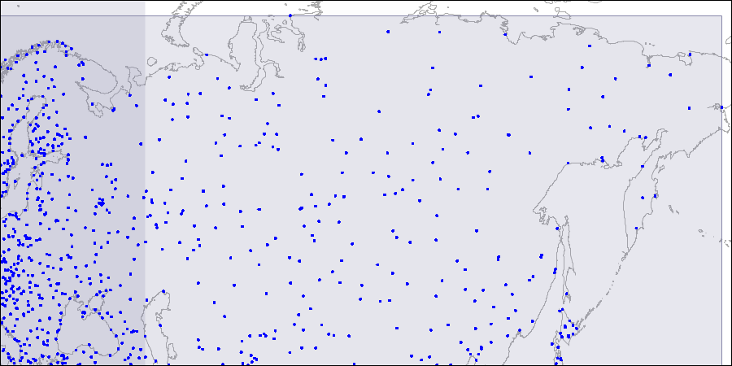      
  
2级node  
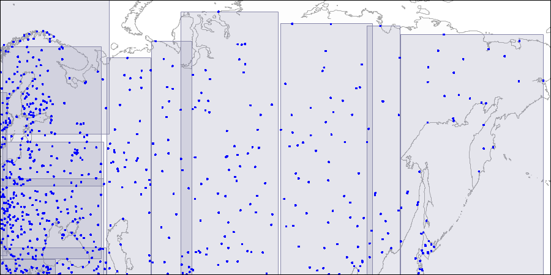      
  
3级node  
      
  
数据套用图例  
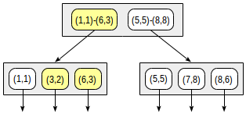      
  
  
### R-tree for intervals (ranges)  
  
1级node  
  
```  
postgres=# select level, a from gist_print('reservations_during_idx')  
as t(level int, valid bool, a tsrange);  
  
 level |                       a                        
-------+-----------------------------------------------  
     1 | ["2016-12-30 00:00:00","2017-01-09 00:00:00")  
     1 | ["2017-02-23 00:00:00","2017-02-27 00:00:00")  
     1 | ["2017-04-29 00:00:00","2017-05-02 00:00:00")  
(3 rows)  
```  
  
### RD-tree for full-text search  
  
原始值树结构  
     
  
hash值树结构 (将文本向量hash后, bitmap占位来分级)  
      
  
  
## 2 SP-GiST的索引数据结构例子  
  
### quadtree for points  
First, we split the plane into four quadrants... 横竖一刀把box分成4个象限.   
  
  
Then we split each of the quadrants...  
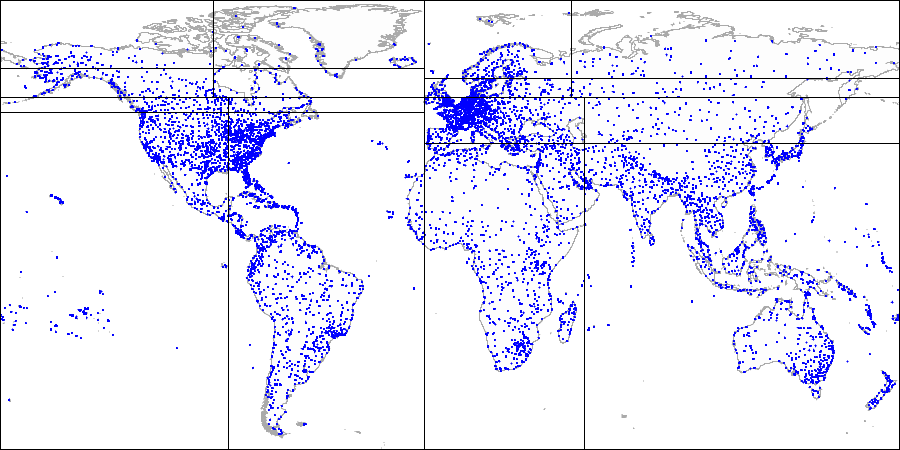  
  
And so on until we get the final partitioning.  
注意有些box可能没有继续切分(因为点很少), 也就是说从root node搜索到这些node的层级比其他node的层级更少.   
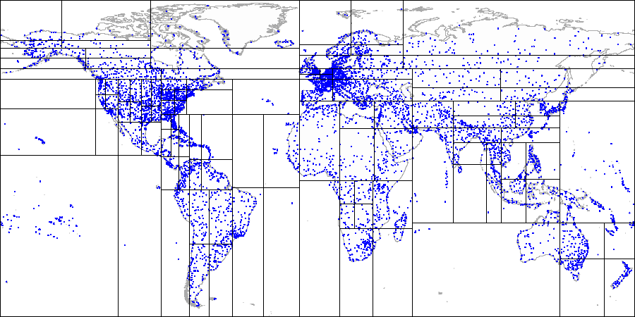  
  
套用数据(每一次切分存储切分交叉点坐标, 上下游node使用象限ID串起来, 切分成的4个象限指向下级的4个node. 同一个象限内的数据如果不再切分, 直接存储在同一个node中, 叶子结点中的箭头指向)  
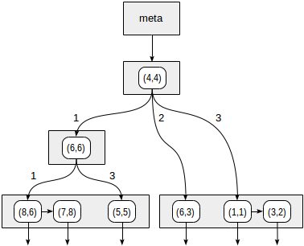  
  
### k-dimensional trees for points  
  
先横切  
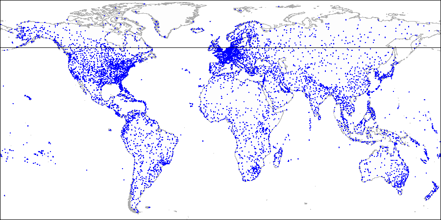  
  
再竖切  
  
  
再横切 ... 再竖切  
每次box要不要切取决于这个box内的点数, 因此最终也是被切成一颗非平衡树  
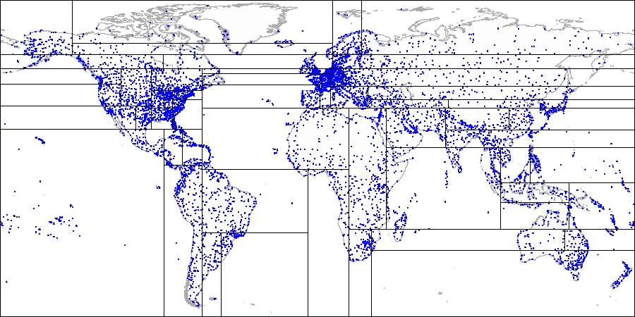  
  
  
### radix tree for text   
  
按相交字符来进行切分(使用相交字符将上下级node串起来, 同一个node中的值有相同的prefix)  
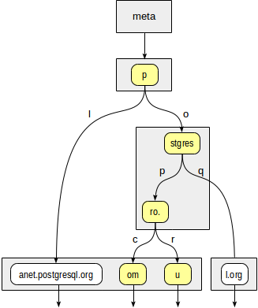  
  
  
## SP-GiST 讲解原文  
https://postgrespro.com/blog/pgsql/4220639  
  
## SP-GiST  
First, a few words about this name. The "GiST" part alludes to some similarity with the same-name access method. The similarity does exist: both are generalized search trees that provide a framework for building various access methods.  
  
"SP" stands for space partitioning. The space here is often just what we are used to call a space, for example, a two-dimensional plane. But we will see that any search space is meant, that is, actually any value domain.  
  
SP-GiST is suitable for structures where the space can be recursively split into non-intersecting areas. This class comprises quadtrees, k-dimensional trees (k-D trees), and radix trees.  
  
### Structure  
So, the idea of SP-GiST access method is to split the value domain into non-overlapping subdomains each of which, in turn, can also be split. Partitioning like this induces non-balanced trees (unlike B-trees and regular GiST).  
  
The trait of being non-intersecting simplifies decision-making during insertion and search. On the other hand, as a rule, the trees induced are of low branching. For example, a node of a quadtree usually has four child nodes (unlike B-trees, where the nodes amount to hundreds) and larger depth. Trees like these well suit the work in RAM, but the index is stored on a disk and therefore, to reduce the number of I/O operations, nodes have to be packed into pages, and it is not easy to do this efficiently. Besides, the time it takes to find different values in the index, may vary because of differences in branch depths.  
  
This access method, same way as GiST, takes care of low-level tasks (simultaneous access and locks, logging, and a pure search algorithm) and provides a specialized simplified interface to enable adding support for new data types and for new partitioning algorithms.  
  
An internal node of SP-GiST tree stores references to child nodes; a label can be defined for each reference. Besides, an internal node can store a value called a prefix. Actually this value is not obligatory a prefix; it can be regarded as an arbitrary predicate that is met for all child nodes.  
  
Leaf nodes of SP-GiST contain a value of the indexed type and a reference to a table row (TID). The indexed data itself (search key) can be used as the value, but not obligatory: a shortened value can be stored.  
  
In addition, leaf nodes can be grouped into lists. So, an internal node can reference not only one value, but a whole list.  
  
Note that prefixes, labels, and values in leaf nodes have their own data types, independent of one another.  
  
Same way as in GiST, the main function to define for search is the consistency function. This function is called for a tree node and returns a set of child nodes whose values "are consistent" with the search predicate (as usual, in the form "indexed-field operator expression"). For a leaf node, the consistency function determines whether the indexed value in this node meets the search predicate.  
  
The search starts with the root node. The consistency function permits to find out which child nodes it makes sense to visit. The algorithm repeats for each of the nodes found. The search is depth-first.  
  
At the physical level, index nodes are packed into pages to make work with the nodes efficient from the point of view of I/O operations. Note that one page can contain either internal or leaf nodes, but not both.  
  
### Example: quadtree  
A quadtree is used to index points in a plane. An idea is to recursively split areas into four parts (quadrants) with respect to the central point. The depth of branches in such a tree can vary and depends on the density of points in appropriate quadrants.  
  
This is what it looks like in figures, by example of the demo database augmented by airports from the site openflights.org. By the way, recently we released a new version of the database in which, among the rest, we replaced longitude and latitude with one field of type "point".  
  
  
  
First, we split the plane into four quadrants...  
  
  
  
Then we split each of the quadrants...  
  
  
  
And so on until we get the final partitioning.  
  
Let's provide more details of a simple example that we already considered in the GiST-related article. See what the partitioning may look like in this case:  
  
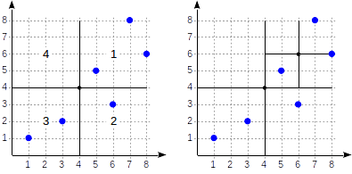  
  
The quadrants are numbered as shown in the first figure. For definiteness sake, let's place child nodes from left to right exactly in the same sequence. A possible index structure in this case is shown in the figure below. Each internal node references a maximum of four child nodes. Each reference can be labeled with the quadrant number, as in the figure. But there is no label in the implementation since it is more convenient to store a fixed array of four references some of which can be empty.  
  
  
  
Points that lie on the boundaries relate to the quadrant with the smaller number.  
  
```  
postgres=# create table points(p point);  
  
postgres=# insert into points(p) values  
  (point '(1,1)'), (point '(3,2)'), (point '(6,3)'),  
  (point '(5,5)'), (point '(7,8)'), (point '(8,6)');  
  
postgres=# create index points_quad_idx on points using spgist(p);  
```  
  
In this case, "quad_point_ops" operator class is used by default, which contains the following operators:  
  
```  
postgres=# select amop.amopopr::regoperator, amop.amopstrategy  
from pg_opclass opc, pg_opfamily opf, pg_am am, pg_amop amop  
where opc.opcname = 'quad_point_ops'  
and opf.oid = opc.opcfamily  
and am.oid = opf.opfmethod  
and amop.amopfamily = opc.opcfamily  
and am.amname = 'spgist'  
and amop.amoplefttype = opc.opcintype;  
  
     amopopr     | amopstrategy  
-----------------+--------------  
 <<(point,point) |            1  strictly left  
 >>(point,point) |            5  strictly right  
 ~=(point,point) |            6  coincides  
 <^(point,point) |           10  strictly below  
 >^(point,point) |           11  strictly above  
 <@(point,box)   |            8  contained in rectangle  
(6 rows)  
```  
  
For example, let's look how the query ```select * from points where p >^ point '(2,7)'``` will be performed (find all points that lie above the given one).  
  
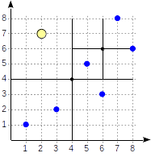  
  
We start with the root node and use the consistency function to select to which child nodes to descend. For the operator ```>^```, this function compares the point (2,7) with the central point of the node (4,4) and selects the quadrants that may contain the points sought, in this case, the first and fourth quadrants.  
  
In the node corresponding to the first quadrant, we again determine the child nodes using the consistency function. The central point is (6,6), and we again need to look through the first and fourth quadrants.  
  
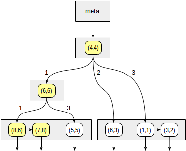  
  
The list of leaf nodes (8,6) and (7,8) corresponds to the first quadrant, of which only the point (7,8) meets the query condition. The reference to the fourth quadrant is empty.  
  
In the internal node (4,4), the reference to the fourth quadrant is empty as well, which completes the search.  
  
```  
postgres=# set enable_seqscan = off;  
  
postgres=# explain (costs off) select * from points where p >^ point '(2,7)';  
  
                   QUERY PLAN                    
------------------------------------------------  
 Index Only Scan using points_quad_idx on points  
   Index Cond: (p >^ '(2,7)'::point)  
(2 rows)  
```  
  
### Internals  
We can explore the internal structure of SP-GiST indexes using "gevel" extension, which was mentioned earlier. Bad news is that due to a bug, this extension works incorrectly with modern versions of PostgreSQL. Good news is that we plan to augment "pageinspect" with the functionality of "gevel" (discussion). And the bug has already been fixed in "pageinspect".  
  
- Again, bad news is that the patch has stuck with no progress.  
   
  
For example, let's take the extended demo database, which was used to draw pictures with the world map.  
  
```  
demo=# create index airports_coordinates_quad_idx on airports_ml using spgist(coordinates);  
```  
  
First, we can get some statistics for the index:  
  
```  
demo=# select * from spgist_stats('airports_coordinates_quad_idx');  
  
           spgist_stats             
----------------------------------  
 totalPages:        33           +  
 deletedPages:      0            +  
 innerPages:        3            +  
 leafPages:         30           +  
 emptyPages:        2            +  
 usedSpace:         201.53 kbytes+  
 usedInnerSpace:    2.17 kbytes  +  
 usedLeafSpace:     199.36 kbytes+  
 freeSpace:         61.44 kbytes +  
 fillRatio:         76.64%       +  
 leafTuples:        5993         +  
 innerTuples:       37           +  
 innerAllTheSame:   0            +  
 leafPlaceholders:  725          +  
 innerPlaceholders: 0            +  
 leafRedirects:     0            +  
 innerRedirects:    0  
(1 row)  
```  
  
And second, we can output the index tree itself:  
  
```  
demo=# select tid, n, level, tid_ptr, prefix, leaf_value  
from spgist_print('airports_coordinates_quad_idx') as t(  
  tid tid,  
  allthesame bool,  
  n int,  
  level int,  
  tid_ptr tid,  
  prefix point,    -- prefix type  
  node_label int,  -- label type (unused here)  
  leaf_value point -- list value type  
)  
order by tid, n;  
  
   tid   | n | level | tid_ptr |      prefix      |    leaf_value  
---------+---+-------+---------+------------------+------------------  
 (1,1)   | 0 |     1 | (5,3)   | (-10.220,53.588) |  
 (1,1)   | 1 |     1 | (5,2)   | (-10.220,53.588) |  
 (1,1)   | 2 |     1 | (5,1)   | (-10.220,53.588) |  
 (1,1)   | 3 |     1 | (5,14)  | (-10.220,53.588) |  
 (3,68)  |   |     3 |         |                  | (86.107,55.270)  
 (3,70)  |   |     3 |         |                  | (129.771,62.093)  
 (3,85)  |   |     4 |         |                  | (57.684,-20.430)  
 (3,122) |   |     4 |         |                  | (107.438,51.808)  
 (3,154) |   |     3 |         |                  | (-51.678,64.191)  
 (5,1)   | 0 |     2 | (24,27) | (-88.680,48.638) |  
 (5,1)   | 1 |     2 | (5,7)   | (-88.680,48.638) |  
 ...  
```  
  
But keep in mind that "spgist_print" outputs not all leaf values, but only the first one from the list, and therefore shows the structure of the index rather than its full contents.  
  
## Example: k-dimensional trees  
For the same points in the plane, we can also suggest another way to partition the space.  
  
Let's draw a horizontal line through the first point being indexed. It splits the plane into two parts: upper and lower. The second point to be indexed falls into one of these parts. Through this point, let's draw a vertical line, which splits this part into two ones: right and left. We again draw a horizontal line through the next point and a vertical line through yet the next point, and so on.  
  
All internal nodes of the tree built this way will have only two child nodes. Each of the two references can lead either to the internal node that is next in the hierarchy or to the list of leaf nodes.  
  
This method can be easily generalized for k-dimensional spaces, and therefore, the trees are also called k-dimensional (k-D trees) in the literature.  
  
Explaining the method by example of airports:  
  
First we split the plane into upper and lower parts...  
  
Then we split each part into left and right parts...  
  
And so on until we get the final partitioning.  
  
To use a partitioning just like this, we need to explicitly specify the operator class "kd_point_ops" when creating an index.  
  
```  
postgres=# create index points_kd_idx on points using spgist(p kd_point_ops);  
```  
  
This class includes exactly the same operators as the "default" class "quad_point_ops".  
  
### Internals  
When looking through the tree structure, we need to take into account that the prefix in this case is only one coordinate rather than a point:  
  
```  
demo=# select tid, n, level, tid_ptr, prefix, leaf_value  
from spgist_print('airports_coordinates_kd_idx') as t(  
  tid tid,  
  allthesame bool,  
  n int,  
  level int,  
  tid_ptr tid,  
  prefix float,    -- prefix type  
  node_label int,  -- label type (unused here)  
  leaf_value point -- list node type  
)  
order by tid, n;  
  
   tid   | n | level | tid_ptr |   prefix   |    leaf_value  
---------+---+-------+---------+------------+------------------  
 (1,1)   | 0 |     1 | (5,1)   |     53.740 |  
 (1,1)   | 1 |     1 | (5,4)   |     53.740 |  
 (3,113) |   |     6 |         |            | (-7.277,62.064)  
 (3,114) |   |     6 |         |            | (-85.033,73.006)  
 (5,1)   | 0 |     2 | (5,12)  |    -65.449 |  
 (5,1)   | 1 |     2 | (5,2)   |    -65.449 |  
 (5,2)   | 0 |     3 | (5,6)   |     35.624 |  
 (5,2)   | 1 |     3 | (5,3)   |     35.624 |  
 ...  
```  
## Example: radix tree  
We can also use SP-GiST to implement a radix tree for strings. The idea of a radix tree is that a string to be indexed is not fully stored in a leaf node, but is obtained by concatenating the values stored in the nodes above this one up to the root.  
  
Assume, we need to index site URLs: "postgrespro.ru", "postgrespro.com", "postgresql.org", and "planet.postgresql.org".  
  
```  
postgres=# create table sites(url text);  
  
postgres=# insert into sites values ('postgrespro.ru'),('postgrespro.com'),('postgresql.org'),('planet.postgresql.org');  
  
postgres=# create index on sites using spgist(url);  
```  
  
The tree will look as follows:  
  
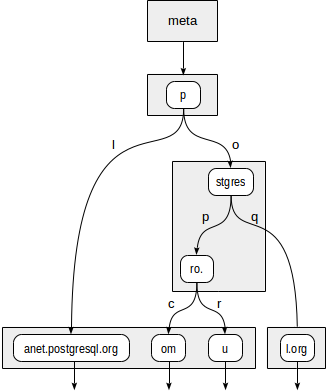  
  
The internal nodes of the tree store prefixes common to all child nodes. For example, in child nodes of "stgres", the values start with "p" + "o" + "stgres".  
  
Unlike in quadtrees, each pointer to a child node is additionally labeled with one character (more exactly, with two bytes, but this is not so important).  
  
"text_ops" operator class supports B-tree-like operators: "equal", "greater", and "less":  
  
```  
postgres=# select amop.amopopr::regoperator, amop.amopstrategy  
from pg_opclass opc, pg_opfamily opf, pg_am am, pg_amop amop  
where opc.opcname = 'text_ops'  
and opf.oid = opc.opcfamily  
and am.oid = opf.opfmethod  
and amop.amopfamily = opc.opcfamily  
and am.amname = 'spgist'  
and amop.amoplefttype = opc.opcintype;  
  
     amopopr     | amopstrategy  
-----------------+--------------  
 ~<~(text,text)  |            1  
 ~<=~(text,text) |            2  
 =(text,text)    |            3  
 ~>=~(text,text) |            4  
 ~>~(text,text)  |            5  
 <(text,text)    |           11  
 <=(text,text)   |           12  
 >=(text,text)   |           14  
 >(text,text)    |           15  
(9 rows)  
```  
  
The distinction of operators with tildes is that they manipulate bytes rather than characters.  
  
Sometimes, a representation in the form of a radix tree may turn out to be much more compact than B-tree since the values are not fully stored, but reconstructed as the need arises while descending through the tree.  
  
Consider a query: ```select * from sites where url like 'postgresp%ru'```. It can be performed using the index:  
  
```  
postgres=# explain (costs off) select * from sites where url like 'postgresp%ru';  
  
                                  QUERY PLAN                                    
------------------------------------------------------------------------------  
 Index Only Scan using sites_url_idx on sites  
   Index Cond: ((url ~>=~ 'postgresp'::text) AND (url ~<~ 'postgresq'::text))  
   Filter: (url ~~ 'postgresp%ru'::text)  
(3 rows)  
```  
  
Actually, the index is used to find values that are greater or equal to "postgresp", but less than "postgresq" (Index Cond), and then matching values are chosen from the result (Filter).  
  
First, the consistency function must decide to which child nodes of "p" root we need to descend. Two options are available: "p" + "l" (no need to descend, which is clear even without diving deeper) and "p" + "o" + "stgres" (continue the descent).  
  
For "stgres" node, a call to the consistency function is needed again to check "postgres" + "p" + "ro." (continue the descent) and "postgres" + "q" (no need to descend).  
  
For "ro." node and all its child leaf nodes, the consistency function will respond "yes", so the index method will return two values: "postgrespro.com" and "postgrespro.ru". One matching value will be selected of them at the filtering stage.  
  
  
  
### Internals  
When looking through the tree structure, we need to take data types into account:  
  
```  
postgres=# select * from spgist_print('sites_url_idx') as t(  
  tid tid,  
  allthesame bool,  
  n int,  
  level int,  
  tid_ptr tid,  
  prefix text,         -- prefix type  
  node_label smallint, -- label type  
  leaf_value text      -- leaf node type  
)  
order by tid, n;  
```  
  
## Properties  
Let's look at the properties of SP-GiST access method (queries were provided earlier):  
  
```  
 amname |     name      | pg_indexam_has_property  
--------+---------------+-------------------------  
 spgist | can_order     | f  
 spgist | can_unique    | f  
 spgist | can_multi_col | f  
 spgist | can_exclude   | t  
```  
  
SP-GiST indexes cannot be used for sorting and for support of the unique constraint. Additionally, indexes like this cannot be created on several columns (unlike GiST). But it is permitted to use such indexes to support exclusion constraints.  
  
The following index-layer properties are available:  
  
```  
     name      | pg_index_has_property  
---------------+-----------------------  
 clusterable   | f  
 index_scan    | t  
 bitmap_scan   | t  
 backward_scan | f  
```  
  
The difference from GiST here is that clustering is impossible.  
  
And eventually the following are column-layer properties:  
  
```  
        name        | pg_index_column_has_property   
--------------------+------------------------------  
 asc                | f  
 desc               | f  
 nulls_first        | f  
 nulls_last         | f  
 orderable          | f  
 distance_orderable | f  
 returnable         | t  
 search_array       | f  
 search_nulls       | t  
```  
  
Sorting is not supported, which is predictable. Distance operators for search of nearest neighbors are not available in SP-GiST so far. Most likely, this feature will be supported in future.  
  
- It is supported in upcoming PostgreSQL 12, the patch by Nikita Glukhov.  
   
  
SP-GiST can be used for index-only scan, at least for the discussed operator classes. As we have seen, in some instances, indexed values are explicitly stored in leaf nodes, while in the other ones, the values are reconstructed part by part during the tree descent.  
  
## NULLs  
Not to complicate the picture, we haven't mentioned NULLs so far. It is clear from the index properties that NULLs are supported. Really:  
  
```  
postgres=# explain (costs off)  
select * from sites where url is null;  
  
                  QUERY PLAN                    
----------------------------------------------  
 Index Only Scan using sites_url_idx on sites  
   Index Cond: (url IS NULL)  
(2 rows)  
```  
  
However, NULL is something foreign for SP-GiST. All operators from "spgist" operator class must be strict: an operator must return NULL whenever any of its parameters is NULL. The method itself ensures this: NULLs are just not passed to operators.  
  
But to use the access method for index-only scan, NULLs must be stored in the index anyway. And they are stored, but in a separate tree with its own root.  
  
NULL被存储在独立的index page中: 因为所有的spgist opc函数必须是strict的, 也就是说输入null返回也是null, null tuples(rows)没有必要和spgist tree放在一起.  (可以看看function的strict含义, 即不处理参数null, 只要输入了null参数, 即刻返回结果null).   
  
## Other data types  
In addition to points and radix trees for strings, other methods based on SP-GiST are also implemented PostgreSQL:  
  
- "box_ops" operator class provides a quadtree for rectangles. Each rectangle is represented by a point in a four-dimensional space, so the number of quadrants equals 16. An index like this can beat GiST in performance when there are a lot of intersections of the rectangles: in GiST it is impossible to draw boundaries so as to separate intersecting objects from one another, while there are no such issues with points (even four-dimensional).  
- "range_ops" operator class provides a quadtree for intervals. An interval is represented by a two-dimensional point: the lower boundary becomes the abscissa, and the upper boundary becomes the ordinate.  
  
  
#### [PostgreSQL 许愿链接](https://github.com/digoal/blog/issues/76 "269ac3d1c492e938c0191101c7238216")
您的愿望将传达给PG kernel hacker、数据库厂商等, 帮助提高数据库产品质量和功能, 说不定下一个PG版本就有您提出的功能点. 针对非常好的提议，奖励限量版PG文化衫、纪念品、贴纸、PG热门书籍等，奖品丰富，快来许愿。[开不开森](https://github.com/digoal/blog/issues/76 "269ac3d1c492e938c0191101c7238216").  
  
  
#### [9.9元购买3个月阿里云RDS PostgreSQL实例](https://www.aliyun.com/database/postgresqlactivity "57258f76c37864c6e6d23383d05714ea")
  
  
#### [PostgreSQL 解决方案集合](https://yq.aliyun.com/topic/118 "40cff096e9ed7122c512b35d8561d9c8")
  
  
#### [德哥 / digoal's github - 公益是一辈子的事.](https://github.com/digoal/blog/blob/master/README.md "22709685feb7cab07d30f30387f0a9ae")
  
  

  
  
#### [PolarDB 学习图谱: 训练营、培训认证、在线互动实验、解决方案、生态合作、写心得拿奖品](https://www.aliyun.com/database/openpolardb/activity "8642f60e04ed0c814bf9cb9677976bd4")
  
  
#### [购买PolarDB云服务折扣活动进行中, 55元起](https://www.aliyun.com/activity/new/polardb-yunparter?userCode=bsb3t4al "e0495c413bedacabb75ff1e880be465a")
  
  
#### [About 德哥](https://github.com/digoal/blog/blob/master/me/readme.md "a37735981e7704886ffd590565582dd0")
  
