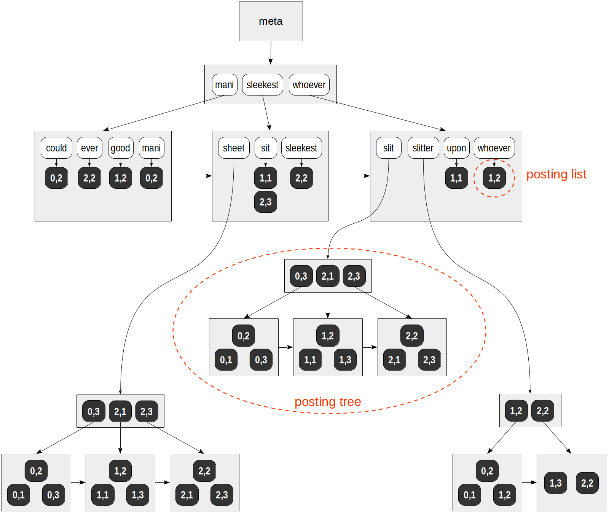
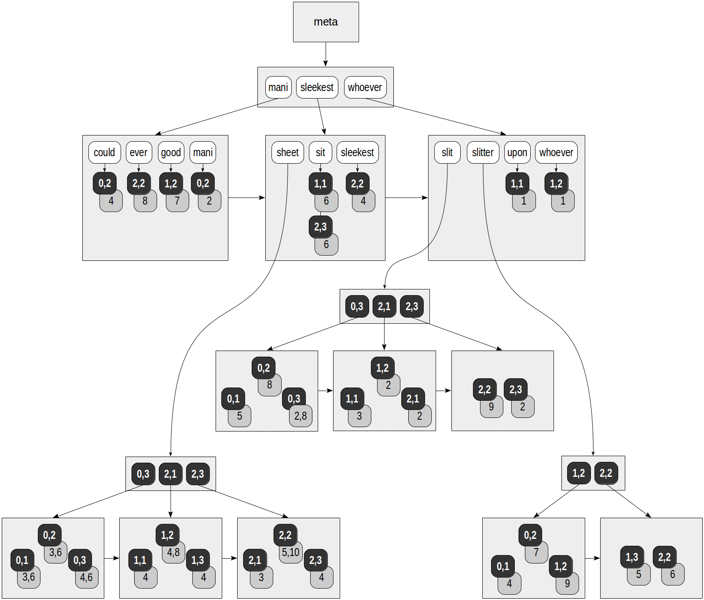

## PostgreSQL RUM 索引原理    
    
### 作者    
digoal    
    
### 日期    
2020-11-28  
    
### 标签    
PostgreSQL , rum  
    
----    
    
## 背景    
回顾    
    
[《PostgreSQL GiST 索引原理 - 4》](../202010/20201004_04.md)      
[《PostgreSQL GiST 索引原理 - 3》](../202010/20201004_03.md)      
[《PostgreSQL GiST 索引原理 - 2》](../202010/20201004_02.md)      
[《PostgreSQL GiST 索引原理 - 1》](../202010/20201004_01.md)      
[《PostgreSQL SP-GiST 索引原理》](../202011/20201128_01.md)      
    
## RUM 原文  
https://postgrespro.com/blog/pgsql/4262305  
  
### gin  
https://postgrespro.com/blog/pgsql/4261647  
  
  
    
```  
tree -> root node -...> leaf node -> token val -指向> rowid(s) (或posting tree, posting list)  
```  
  
### rum  
  
RUM 相比GIN索引, 核心提升点: 除了存储token对应的rowid(s), 还存储了这行对应的额外值.    
  
  
  
```  
tree -> root node -...> leaf node -> token val -指向> rowid(s)   
  
每个rowid 还会额外存储:   
  这个rowid对应token在文本中出现的position(s),   
  这个rowid的这行文本有多少token_counts,   
  用户指定的其他附加字段值(或表达式值)(由此rowid对应行内容得到)  
```  
  
rum比gin支持更多的索引搜索功能:    
  
```  
filter tsquery($val)    
  
order by 文本相似性(ts_rank, ts_rank_cd)  :   
    由于存储了每行的token_counts, 因此tsquery_tokens / token_counts 得到ts_rank value, 所以不需要回表查询  
  
order by 其他字段/表达式 ops $val  
  
filter 其他字段/表达式 $val  
```  
  
## RUM  
Although the authors claim that gin is a powerful genie, the theme of drinks has eventually won: next-generation GIN has been called RUM.  
  
This access method expands the concept that underlies GIN and enables us to perform full-text search even faster. In this series of articles, this is the only method that is not included in a standard PostgreSQL delivery and is an external extension. Several installation options are available for it:  
  
- Take "yum" or "apt" package from the PGDG repository. For example, if you installed PostgreSQL from "postgresql-10" package, also install "postgresql-10-rum".  
- Build from source code on github and install on your own (the instruction is there as well).  
- Use as a part of Postgres Pro Enterprise (or at least read the documentation from there).  
  
## Limitations of GIN  
What limitations of GIN does RUM enable us to transcend?  
  
First, "tsvector" data type contains not only lexemes, but also information on their positions inside the document. As we observed last time, GIN index does not store this information. For this reason, operations to search for phrases, which appeared in version 9.6, are supported by GIN index inefficiently and have to access the original data for recheck.  
  
Second, search systems usually return the results sorted by relevance (whatever that means). We can use ranking functions "ts_rank" and "ts_rank_cd" to this end, but they have to be computed for each row of the result, which is certainly slow.  
  
To a first approximation, RUM access method can be considered as GIN that additionally stores position information and can return the results in a needed order (like GiST can return nearest neighbors). Let's move step by step.  
  
## Searching for phrases  
A full-text search query can contain special operators that take into account the distance between lexemes. For example, we can find documents in which "hand" is separated from "thigh" with two more word:  
  
```  
postgres=# select to_tsvector('Clap your hands, slap your thigh') @@  
                  to_tsquery('hand <3> thigh');  
  
 ?column?  
----------  
 t  
(1 row)  
```  
  
Or we can indicate that the words must be located one after another:  
  
```  
postgres=# select to_tsvector('Clap your hands, slap your thigh') @@  
                  to_tsquery('hand <-> slap');  
  
 ?column?  
----------  
 t  
(1 row)  
```  
  
Regular GIN index can return the documents that contain both lexemes, but we can check the distance between them only by looking into tsvector:  
  
```  
postgres=# select to_tsvector('Clap your hands, slap your thigh');  
  
             to_tsvector                
--------------------------------------  
 'clap':1 'hand':3 'slap':4 'thigh':6  
(1 row)  
```  
  
In RUM index, each lexeme does not just reference the table rows: each TID is supplied with the list of positions where the lexeme occurs in the document. This is how we can envisage the index created on the "slit-sheet" table, which is already quite familiar to us ("rum_tsvector_ops" operator class is used for tsvector by default):  
  
```  
postgres=# create extension rum;  
  
postgres=# create index on ts using rum(doc_tsv);  
```  
  
  
  
Gray squares in the figure contain the position information added:  
  
```  
postgres=# select ctid, left(doc,20), doc_tsv from ts;  
  
  ctid |         left         |                         doc_tsv                           
-------+----------------------+---------------------------------------------------------  
 (0,1) | Can a sheet slitter  | 'sheet':3,6 'slit':5 'slitter':4  
 (0,2) | How many sheets coul | 'could':4 'mani':2 'sheet':3,6 'slit':8 'slitter':7  
 (0,3) | I slit a sheet, a sh | 'sheet':4,6 'slit':2,8  
 (1,1) | Upon a slitted sheet | 'sheet':4 'sit':6 'slit':3 'upon':1  
 (1,2) | Whoever slit the she | 'good':7 'sheet':4,8 'slit':2 'slitter':9 'whoever':1  
 (1,3) | I am a sheet slitter | 'sheet':4 'slitter':5  
 (2,1) | I slit sheets.       | 'sheet':3 'slit':2  
 (2,2) | I am the sleekest sh | 'ever':8 'sheet':5,10 'sleekest':4 'slit':9 'slitter':6  
 (2,3) | She slits the sheet  | 'sheet':4 'sit':6 'slit':2  
(9 rows)  
```  
  
GIN also provides a postponed insertion when "fastupdate" parameter is specified; this functionality is removed from RUM.  
  
To see how the index works on live data, let's use the familiar archive of pgsql-hackers mailing list.  
  
```  
fts=# alter table mail_messages add column tsv tsvector;  
  
fts=# set default_text_search_config = default;  
  
fts=# update mail_messages  
set tsv = to_tsvector(body_plain);  
  
...  
UPDATE 356125  
```  
  
This is how a query that uses search for phrases is performed with GIN index:  
  
```  
fts=# create index tsv_gin on mail_messages using gin(tsv);  
  
fts=# explain (costs off, analyze)  
select * from mail_messages where tsv @@ to_tsquery('hello <-> hackers');  
  
                                   QUERY PLAN                                      
---------------------------------------------------------------------------------  
 Bitmap Heap Scan on mail_messages (actual time=2.490..18.088 rows=259 loops=1)  
   Recheck Cond: (tsv @@ to_tsquery('hello <-> hackers'::text))  
   Rows Removed by Index Recheck: 1517  
   Heap Blocks: exact=1503  
   ->  Bitmap Index Scan on tsv_gin (actual time=2.204..2.204 rows=1776 loops=1)  
         Index Cond: (tsv @@ to_tsquery('hello <-> hackers'::text))  
 Planning time: 0.266 ms  
 Execution time: 18.151 ms  
(8 rows)  
```  
  
As we can see from the plan, GIN index is used, but it returns 1776 potential matches, of which 259 are left and 1517 are dropped at the recheck stage.  
  
Let's delete the GIN index and build RUM.  
  
```  
fts=# drop index tsv_gin;  
  
fts=# create index tsv_rum on mail_messages using rum(tsv);  
```  
  
The index now contains all the necessary information, and search is performed accurately:  
  
```  
fts=# explain (costs off, analyze)  
select * from mail_messages  
where tsv @@ to_tsquery('hello  hackers');  
  
                                   QUERY PLAN                                    
--------------------------------------------------------------------------------  
 Bitmap Heap Scan on mail_messages (actual time=2.798..3.015 rows=259 loops=1)  
   Recheck Cond: (tsv @@ to_tsquery('hello  hackers'::text))  
   Heap Blocks: exact=250  
   ->  Bitmap Index Scan on tsv_rum (actual time=2.768..2.768 rows=259 loops=1)  
         Index Cond: (tsv @@ to_tsquery('hello  hackers'::text))  
 Planning time: 0.245 ms  
 Execution time: 3.053 ms  
(7 rows)  
```  
  
## Sorting by relevance  
To return documents readily in the needed order, RUM index supports ordering operators, which we discussed in GiST-related article. RUM extension defines such an operator, ```<=>```, which returns some distance between the document ("tsvector") and query ("tsquery"). For example:  
  
```  
fts=# select to_tsvector('Can a sheet slitter slit sheets?') <=> to_tsquery('slit');  
  
 ?column?  
----------  
  16.4493  
(1 row)  
  
fts=# select to_tsvector('Can a sheet slitter slit sheets?') <=> to_tsquery('sheet');  
  
 ?column?  
----------  
  13.1595  
(1 row)  
```  
  
The document appeared to be more relevant to the first query than to the second one: the more often the word occurs, the less "valuable" it is.  
  
Let's again try to compare GIN and RUM on a relatively large data size: we'll select ten most relevant documents containing "hello" and "hackers".  
  
```  
fts=# explain (costs off, analyze)  
select * from mail_messages   
where tsv @@ to_tsquery('hello & hackers')   
order by ts_rank(tsv,to_tsquery('hello & hackers'))   
limit 10;  
  
                                         QUERY PLAN  
---------------------------------------------------------------------------------------------  
 Limit (actual time=27.076..27.078 rows=10 loops=1)  
   ->  Sort (actual time=27.075..27.076 rows=10 loops=1)  
         Sort Key: (ts_rank(tsv, to_tsquery('hello & hackers'::text)))  
         Sort Method: top-N heapsort  Memory: 29kB  
         ->  Bitmap Heap Scan on mail_messages (actual ... rows=1776 loops=1)  
               Recheck Cond: (tsv @@ to_tsquery('hello & hackers'::text))  
               Heap Blocks: exact=1503  
               ->  Bitmap Index Scan on tsv_gin (actual ... rows=1776 loops=1)  
                     Index Cond: (tsv @@ to_tsquery('hello & hackers'::text))  
 Planning time: 0.276 ms  
 Execution time: 27.121 ms  
(11 rows)  
```  
  
GIN index returns 1776 matches, which are then sorted as a separate step to select ten best hits.  
  
With RUM index, the query is performed using a simple index scan: no extra documents are looked through, and no separate sorting is required:  
  
```  
fts=# explain (costs off, analyze)  
select * from mail_messages  
where tsv @@ to_tsquery('hello & hackers')  
order by tsv <=> to_tsquery('hello & hackers')  
limit 10;  
  
                                         QUERY PLAN  
--------------------------------------------------------------------------------------------  
 Limit (actual time=5.083..5.171 rows=10 loops=1)  
   ->  Index Scan using tsv_rum on mail_messages (actual ... rows=10 loops=1)  
         Index Cond: (tsv @@ to_tsquery('hello & hackers'::text))  
         Order By: (tsv <=> to_tsquery('hello & hackers'::text))  
 Planning time: 0.244 ms  
 Execution time: 5.207 ms  
(6 rows)  
```  
  
## Additional information  
RUM index, as well as GIN, can be built on several fields. But while GIN stores lexemes from each column independently of those from another column, RUM enables us to "associate" the main field ("tsvector" in this case) with an additional one. To do this, we need to use a specialized operator class "rum_tsvector_addon_ops":  
  
```  
fts=# create index on mail_messages using rum(tsv RUM_TSVECTOR_ADDON_OPS, sent)  
  WITH (ATTACH='sent', TO='tsv');  
```  
  
We can use this index to return the results sorted on the additional field:  
  
```  
fts=# select id, sent, sent <=> '2017-01-01 15:00:00'  
from mail_messages  
where tsv @@ to_tsquery('hello')  
order by sent <=> '2017-01-01 15:00:00'  
limit 10;  
  
   id    |        sent         | ?column?   
---------+---------------------+----------  
 2298548 | 2017-01-01 15:03:22 |      202  
 2298547 | 2017-01-01 14:53:13 |      407  
 2298545 | 2017-01-01 13:28:12 |     5508  
 2298554 | 2017-01-01 18:30:45 |    12645  
 2298530 | 2016-12-31 20:28:48 |    66672  
 2298587 | 2017-01-02 12:39:26 |    77966  
 2298588 | 2017-01-02 12:43:22 |    78202  
 2298597 | 2017-01-02 13:48:02 |    82082  
 2298606 | 2017-01-02 15:50:50 |    89450  
 2298628 | 2017-01-02 18:55:49 |   100549  
(10 rows)  
```  
  
Here we search for matching rows being as close to the specified date as possible, no matter earlier or later. To get the results that are strictly preceding (or following) the specified date, we need to use ```<=|``` (or ```|=>```) operator.  
  
As we expect, the query is performed just by a simple index scan:  
  
```  
ts=# explain (costs off)  
select id, sent, sent <=> '2017-01-01 15:00:00'   
from mail_messages  
where tsv @@ to_tsquery('hello')  
order by sent <=> '2017-01-01 15:00:00'  
limit 10;  
  
                                   QUERY PLAN  
---------------------------------------------------------------------------------  
 Limit  
   ->  Index Scan using mail_messages_tsv_sent_idx on mail_messages  
         Index Cond: (tsv @@ to_tsquery('hello'::text))  
         Order By: (sent <=> '2017-01-01 15:00:00'::timestamp without time zone)  
(4 rows)  
```  
  
If we created the index without the additional information on the field association, for a similar query, we would have to sort all results of the index scan.  
  
In addition to the date, we can certainly add fields of other data types to RUM index. Virtually all base types are supported. For example, an online store can quickly display goods by novelty (date), price (numeric), and popularity or discount value (integer or floating-point).  
  
## Other operator classes  
To complete the picture, we should mention other operator classes available.  
  
Let's start with "rum_tsvector_hash_ops" and "rum_tsvector_hash_addon_ops". They are similar to already discussed "rum_tsvector_ops" and "rum_tsvector_addon_ops", but the index stores hash code of the lexeme rather than the lexeme itself. This can reduce the index size, but of course, search becomes less accurate and requires recheck. Besides, the index no longer supports search of a partial match.  
  
It is interesting to look at "rum_tsquery_ops" operator class. It enables us to solve an "inverse" problem: find queries that match the document. Why could this be needed? For example, to subscribe a user to new goods according to his/her filter or to automatically categorize new documents. Look at this simple example:  
  
```  
fts=# create table categories(query tsquery, category text);  
  
fts=# insert into categories values  
  (to_tsquery('vacuum | autovacuum | freeze'), 'vacuum'),  
  (to_tsquery('xmin | xmax | snapshot | isolation'), 'mvcc'),  
  (to_tsquery('wal | (write & ahead & log) | durability'), 'wal');  
  
fts=# create index on categories using rum(query);  
  
fts=# select array_agg(category)  
from categories  
where to_tsvector(  
  'Hello hackers, the attached patch greatly improves performance of tuple  
   freezing and also reduces size of generated write-ahead logs.'  
) @@ query;  
  
  array_agg    
--------------  
 {vacuum,wal}  
(1 row)  
```  
  
The remaining operator classes "rum_anyarray_ops" and "rum_anyarray_addon_ops" are designed to manipulate arrays rather than "tsvector". This was already discussed for GIN last time and does not need to be repeated.  
  
## The sizes of the index and write-ahead log (WAL)  
It is clear that since RUM stores more information than GIN, it must have larger size. We were comparing the sizes of different indexes last time; let's add RUM to this table:   
  
```  
rum | gin | gist | btree   
--------+--------+--------+--------   
457 MB | 179 MB | 125 MB | 546 MB  
```  
  
As we can see, the size grew quite significantly, which is the cost of fast search.  
  
It is worth paying attention to one more unobvious point: RUM is an extension, that is, it can be installed without any modifications to the system core. This was enabled in version 9.6 thanks to a patch by [Alexander Korotkov](https://habrahabr.ru/users/smagen/). One of the problems that had to be solved to this end was generation of log records. A technique for logging of operations must be absolutely reliable, therefore, an extension cannot be let into this kitchen. Instead of permitting the extension to create its own types of log records, the following is in place: the code of the extension communicates its intention to modify a page, makes any changes to it, and signals the completion, and it's the system core, which compares the old and new versions of the page and generates unified log records required.  
  
The current log generation algorithm compares pages byte by byte, detects updated fragments, and logs each of these fragments, along with its offset from the page start. This works fine when updating only several bytes or the entire page. But if we add a fragment inside a page, moving the rest of the content down (or vice versa, remove a fragment, moving the content up), significantly more bytes will change than were actually added or removed.  
  
Due to this, intensively changing RUM index may generate log records of a considerably larger size than GIN (which, being not an extension, but a part of the core, manages the log on its own). The extent of this annoying effect greatly depends on an actual workload, but to get an insight into the issue, let's try to remove and add a number of rows several times, interleaving these operations with “vacuum”. We can evaluate the size of log records as follows: at the beginning and at the end, remember the position in the log using "pg_current_wal_location" function ("pg_current_xlog_location" in versions earlier than ten) and then look at the difference.  
  
But of course, we should consider a lot of aspects here. We need to make sure that only one user is working with the system (otherwise, "extra" records will be taken into account). Even if this is the case, we take into account not only RUM, but also updates of the table itself and of the index that supports the primary key. Values of configuration parameters also affect the size ("replica" log level, without compression, was used here). But let's try anyway.  
  
```  
fts=# select pg_current_wal_location() as start_lsn \gset  
  
fts=# insert into mail_messages(parent_id, sent, subject, author, body_plain, tsv)  
  select parent_id, sent, subject, author, body_plain, tsv  
  from mail_messages where id % 100 = 0;  
  
INSERT 0 3576  
  
fts=# delete from mail_messages where id % 100 = 99;  
  
DELETE 3590  
  
fts=# vacuum mail_messages;  
  
fts=# insert into mail_messages(parent_id, sent, subject, author, body_plain, tsv)  
  select parent_id, sent, subject, author, body_plain, tsv  
  from mail_messages where id % 100 = 1;  
  
INSERT 0 3605  
  
fts=# delete from mail_messages where id % 100 = 98;  
  
DELETE 3637  
  
fts=# vacuum mail_messages;  
  
fts=# insert into mail_messages(parent_id, sent, subject, author, body_plain, tsv)  
  select parent_id, sent, subject, author, body_plain, tsv from mail_messages  
  where id % 100 = 2;  
  
INSERT 0 3625  
  
fts=# delete from mail_messages where id % 100 = 97;  
  
DELETE 3668  
  
fts=# vacuum mail_messages;  
  
fts=# select pg_current_wal_location() as end_lsn \gset  
fts=# select pg_size_pretty(:'end_lsn'::pg_lsn - :'start_lsn'::pg_lsn);  
  
 pg_size_pretty  
----------------  
 3114 MB  
(1 row)  
```  
  
So, we get around 3 GB. But if we repeat the same experiment with GIN index, this will make only around 700 MB.  
  
Therefore, it is desirable to have a different algorithm, which will find the minimal number of insert and delete operations that can transform one state of the page into another one. "diff" utility works in a similar way. [Oleg Ivanov](https://habr.com/ru/users/tigvarts/) has already implemented such an algorithm, and his patch is being discussed. In the above example, this [patch](https://commitfest.postgresql.org/15/1363/) enables us to reduce the size of log records by 1.5 times, to 1900 MB, at the cost of a small slowdown.  
  
- Unfortunately, the patch has stuck and there's no activity around it.  
   
  
## Properties  
As usual, let's look at the properties of RUM access method, paying attention to the differences from GIN (queries [have already been provided](https://postgrespro.com/blog/pgsql/4161264)).  
  
The following are the properties of the access method:  
  
```  
 amname |     name      | pg_indexam_has_property  
--------+---------------+-------------------------  
 rum    | can_order     | f  
 rum    | can_unique    | f  
 rum    | can_multi_col | t  
 rum    | can_exclude   | t -- f for gin  
```  
  
The following index-layer properties are available:  
  
```  
     name      | pg_index_has_property  
---------------+-----------------------  
 clusterable   | f  
 index_scan    | t -- f for gin  
 bitmap_scan   | t  
 backward_scan | f  
```  
  
Note that, unlike GIN, RUM supports index scan - otherwise, it would not have been possible to return exactly the required number of results in queries with "limit" clause. There is no need for the counterpart of "gin_fuzzy_search_limit" parameter accordingly. And as a consequence, the index can be used to support exclusion constraints.  
  
The following are column-layer properties:  
  
```  
        name        | pg_index_column_has_property   
--------------------+------------------------------  
 asc                | f  
 desc               | f  
 nulls_first        | f  
 nulls_last         | f  
 orderable          | f  
 distance_orderable | t -- f for gin  
 returnable         | f  
 search_array       | f  
 search_nulls       | f  
```  
  
The difference here is that RUM supports ordering operators. However, this is true not for all operator classes: for example, this is false for "tsquery_ops".  
  
  
  
#### [PostgreSQL 许愿链接](https://github.com/digoal/blog/issues/76 "269ac3d1c492e938c0191101c7238216")
您的愿望将传达给PG kernel hacker、数据库厂商等, 帮助提高数据库产品质量和功能, 说不定下一个PG版本就有您提出的功能点. 针对非常好的提议，奖励限量版PG文化衫、纪念品、贴纸、PG热门书籍等，奖品丰富，快来许愿。[开不开森](https://github.com/digoal/blog/issues/76 "269ac3d1c492e938c0191101c7238216").  
  
  
#### [9.9元购买3个月阿里云RDS PostgreSQL实例](https://www.aliyun.com/database/postgresqlactivity "57258f76c37864c6e6d23383d05714ea")
  
  
#### [PostgreSQL 解决方案集合](https://yq.aliyun.com/topic/118 "40cff096e9ed7122c512b35d8561d9c8")
  
  
#### [德哥 / digoal's github - 公益是一辈子的事.](https://github.com/digoal/blog/blob/master/README.md "22709685feb7cab07d30f30387f0a9ae")
  
  

  
  
#### [PolarDB 学习图谱: 训练营、培训认证、在线互动实验、解决方案、生态合作、写心得拿奖品](https://www.aliyun.com/database/openpolardb/activity "8642f60e04ed0c814bf9cb9677976bd4")
  
  
#### [购买PolarDB云服务折扣活动进行中, 55元起](https://www.aliyun.com/activity/new/polardb-yunparter?userCode=bsb3t4al "e0495c413bedacabb75ff1e880be465a")
  
  
#### [About 德哥](https://github.com/digoal/blog/blob/master/me/readme.md "a37735981e7704886ffd590565582dd0")
  
