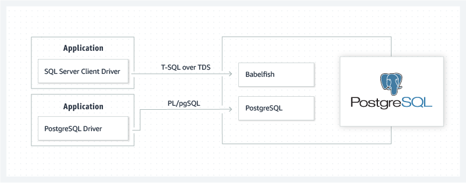

## PostgreSQL 兼容 SQL Server - Babelfish - SQL Server 业务 无感使用PostgreSQL - 一份数据, 同时兼容SQL Server和PostgreSQL      
    
### 作者    
digoal    
    
### 日期    
2020-12-04     
    
### 标签    
PostgreSQL , SQL Server , 无感 , 协议兼容     
    
----    
    
## 背景    
Babelfish 是AWS开源的一款SQL Server协议代理, apache 2.0开源协议, 后端数据库为PG, 前端应用为SQL Server.     
    
相当于数据存储在PG, 使用SQL Server开发的应用程序无缝使用. 并且基于PG的应用程序也能访问这些数据.      
    
    
    
换句话说, 同一份存储, 同时支持PG和SQL Server两套协议.  这使得一个企业里面有SQL Server数据库, 同时有PG数据库时, 应用数据需要打通的话, 不需要数据同步, 一份数据就可以搞定.    
  
未来也许会出现Oracle的协议兼容版， 意味着PG很有可能成为多模数据库的标准存储。  
    
https://babelfish-for-postgresql.github.io/babelfish-for-postgresql/      
    
Babelfish for PostgreSQL is an Apache-2.0 open source project that adds a Microsoft SQL Server-compatible end-point to PostgreSQL to enable your PostgreSQL database to understand the SQL Server wire protocol and commonly used SQL Server commands. With Babelfish, applications that were originally built for SQL Server can work directly with PostgreSQL, with little to no code changes, and without changing database drivers.  
  
Babelfish for PostgreSQL will be available on Github in 2021.  
  
Babelfish for PostgreSQL adds an endpoint to PostgreSQL that understands the SQL Server wire protocol Tabular Data Stream (TDS), and commonly used T-SQL programming language constructs used by SQL Server. Support for T-SQL includes elements such as the SQL dialect, cursors, catalog views, data types, triggers, stored procedures, and functions.  
  
BENEFITS  
Faster Migrations  
Complete migrations from SQL Server to PostgreSQL faster, saving months to years of work from changing application code  
  
Freedom to Innovate  
Build new functionality by running PostgreSQL code side-by-side with your existing T-SQL code  
  
100% Open Source  
Uses the permissive Apache 2.0 license. Contribute and help steer the direction of Babelfish to meet your application needs  
  
  
#### [PostgreSQL 许愿链接](https://github.com/digoal/blog/issues/76 "269ac3d1c492e938c0191101c7238216")
您的愿望将传达给PG kernel hacker、数据库厂商等, 帮助提高数据库产品质量和功能, 说不定下一个PG版本就有您提出的功能点. 针对非常好的提议，奖励限量版PG文化衫、纪念品、贴纸、PG热门书籍等，奖品丰富，快来许愿。[开不开森](https://github.com/digoal/blog/issues/76 "269ac3d1c492e938c0191101c7238216").  
  
  
#### [9.9元购买3个月阿里云RDS PostgreSQL实例](https://www.aliyun.com/database/postgresqlactivity "57258f76c37864c6e6d23383d05714ea")
  
  
#### [PostgreSQL 解决方案集合](https://yq.aliyun.com/topic/118 "40cff096e9ed7122c512b35d8561d9c8")
  
  
#### [德哥 / digoal's github - 公益是一辈子的事.](https://github.com/digoal/blog/blob/master/README.md "22709685feb7cab07d30f30387f0a9ae")
  
  

  
  
#### [PolarDB 学习图谱: 训练营、培训认证、在线互动实验、解决方案、生态合作、写心得拿奖品](https://www.aliyun.com/database/openpolardb/activity "8642f60e04ed0c814bf9cb9677976bd4")
  
  
#### [购买PolarDB云服务折扣活动进行中, 55元起](https://www.aliyun.com/activity/new/polardb-yunparter?userCode=bsb3t4al "e0495c413bedacabb75ff1e880be465a")
  
  
#### [About 德哥](https://github.com/digoal/blog/blob/master/me/readme.md "a37735981e7704886ffd590565582dd0")
  
