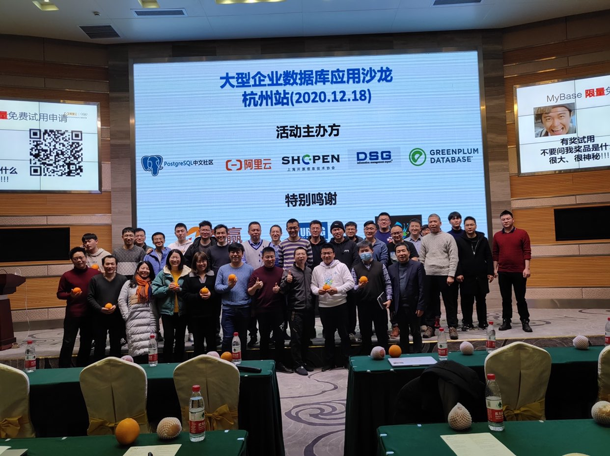

## <大型企业 数据库 & 应用实践> 沙龙 - 2020.12.18 - 直播回放
  
### 作者  
digoal  
  
### 日期  
2020-12-05  
  
### 标签  
PostgreSQL , 大型企业数据库 & 应用实践 , 沙龙    
  
----  
  
## 背景  
直播回放:   
[上午](https://yq.aliyun.com/live/245916)  
[下午](https://yq.aliyun.com/live/245917)  
  
  
  
报名连接:  https://www.huodongxing.com/event/1574082662600?td=4602476532474  
  
主题:  大型企业数据库 & 应用实践    
时间:  12月18号       
主办方: 阿里云，上海开源协会, DSG，PG中文社区 联合主办       
规模:  100~200人    
地点:  杭州市启迪路198号杭州湾信息港A座国际报告厅    
    
议题:    
上午:     
- 09:00 ~ 09:15 扫码签到    
- 09:15 ~ 09:25 杭州湾信息港领导 致辞
- 09:25 ~ 09:30 联合主办方 致辞    
- 09:30 ~ 10:15 苏宁PG数据库大规模应用，苏宁，陈华军    
- 10:15 ~ 11:00 康恩贝PG数据库应用实践，康恩贝，朱常青     
- 11:00 ~ 11:30 揭秘下一代云数据库形态-MyBase，阿里云，德哥  (介绍云数据库的发展历程, 大型企业数据库使用的痛点和云数据库的下一代产品形态. MyBase.)    
- 11:30 合影    
    
下午:     
- 13:00 ~ 13:45 安全可信计算领域的实践, Lotuseed, 创始人 james     
- 13:45 ~ 14:30 保险行业数据库应用实践，某保险公司 , 章晨曦     
- 14:30 ~ 15:15 异构数据迁移同步最佳实践 ，DSG , 方军      
- 15:15 ~ 16:00 跨境电商SaaS平台数据库实践，智赢跨境电商, 创始人  于培恒     
- 16:00 ~ 16:45 SaaS行业分析, Saas的昨天、今天、明天，上海开源信息技术协会，副理事长,  杨滨     
- 16:45 ~ 17:30 现场分组技术对抗    
- 17:30 抽奖     
  
奖品:  
- 樱桃(cherry) MX8.0 G80-3888HUAEU-2 机械键盘 (价值1650)  
- 图灵出版社图书  
- 了不起的程序员日历  
- PG 社区 限量版纪念卫衣  
- PG 社区 限量水晶挂坠  
- PG 社区 畅销图书  
- 阿里云限量版马克杯  
- 阿里云限量版卫衣  
- gpdb 变色杯
- 无线键盘
- 溯源商城 绿色环保现摘水果
    
感谢 奖品、水果赞助方:  
- 智赢 老印  
- 图灵 英子  
- 巨杉 萧老师  
- PG 社区  
- 阿里云 德哥  
- 阿里云  
- greenplum社区
- DSG 老黄  
- 成都文武 老朱
- 溯源商城 
  
## 抽奖问卷题
(多选)    
以下关于MyBase的描述哪些是正确的?     
a. MyBase 是RDS的升级版, 可以在“RDS 专属规格”中选购    
b. MyBase 支持主机级别隔离    
c. MyBase 允许用户登录操作系统和数据库超级账号    
d. MyBase 只支持MySQL, PG, SQL Server三大引擎    
e. MyBase 是面向数据库用户需求升级的产品    
正确答案:     
    
以下哪些场景适合MyBase?     
a. 用户某引擎的数据库CPU总核数 >= 8核    
b. 用户的业务经常遇到不可预期的高峰    
c. 用户希望大规模使用数据库并节省成本    
d. 用户对数据库有很高的安全和性能要求    
e. 认为License 很贵的SQL Server 正版用户    
正确答案:     
    
以下哪些是MyBase、RDS共享规格、独享规格的区别?     
a. MyBase采用独立主机资源    
b. MyBase的一个主机允许分配多个实例    
c. MyBase支持CPU, 存储超分配    
d. MyBase支持内存超分配    
e. MyBase 和RDS共享规格、独享规格都支持OS权限登录, 数据库超级权限账号    
正确答案:     
    
MyBase的什么功能可以帮助客户节省成本?     
a. 支持独立主机部署    
b. cpu和磁盘超分配能力    
c. 实例级别混合部署能力    
d. 主机腾挪功能    
e. 支持开放OS权限和数据库超级账号    
正确答案:     
    
哪些功能使得MyBase可以提高客户业务效率?     
a. 开放了主机权限, 紧急情况下, 用户可以登录主机自行排查业务问题    
b. 开放了弹性升级功能, 当业务随机高峰发生时, 自动升级数据库, 抵御业务高峰    
c. 支持CPU和磁盘超分配能力    
d. MyBase支持实例级别的混搭    
e. MyBase支持智能调度策略, 同时支持创建实例时指定主机    
正确答案:     
    
以下哪些原因可能导致用户选择ECS自建数据库, 而不使用RDS?     
a. 用户觉得rds贵    
b. 用户觉得rds是黑盒, 不能自由登录超级账号    
c. 用户无法登录rds主机, 无法部署客户自己的工具, 无法实时查询服务器和数据库的日志信息    
d. 用户觉得RDS的内核不稳定    
e. 用户认为自己可以搞定所有数据库内核问题    
正确答案:     
    
MyBase的什么功能可以帮助客户抵御未知的业务高峰?     
a. 开放了弹性升级功能, 当业务随机高峰发生时, 自动升级数据库, 抵御业务高峰    
b. 支持迁移实例功能, 可以手工将实例迁移到空闲主机    
c. 支持紧凑分布和均匀分布, 使用均匀分布可以腾出更多资源, 所有实例都有足够资源应对弹性升级    
d. 支持CPU和磁盘超分配能力    
e. 用户认为自己可以搞定所有数据库内核问题    
正确答案:     
    
具有什么特性的客户可以利用MyBase实例混合部署的能力降低成本?      
a. 业务多, 而且相同引擎的业务高峰期是错开的    
b. 业务多, 使用的是不同引擎, 不同引擎的业务高峰期是错开的    
c. 教育客户, 寒暑假没有业务, 开学期间业务量大    
d. 客户有BI业务, 一般晚上跑. 其他业务白天跑     
正确答案:     
    
为什么MyBase可以解决用户数据库安全问题?     
a. MyBase 支持资源超分配    
b. 支持迁移实例功能, 可以手工将实例迁移到空闲主机    
c. 采用独立主机模式, 主机上只有用户自己的实例, 不会有其他用户的实例    
d. MyBase支持实例级别的混搭    
e. 用户认为自己可以搞定所有数据库内核问题    
正确答案:     
    
为什么MyBase可以解决用户数据库性能抖动问题?     
a. MyBase 支持资源超分配    
b. 支持迁移实例功能, 可以手工将实例迁移到空闲主机    
c. 采用独立主机模式, 主机上只有用户自己的实例, 不会有其他用户的实例    
d. MyBase支持实例级别的混搭    
e. 用户认为自己可以搞定所有数据库内核问题    
正确答案:     
    
以下哪些是给Redis用户推荐MyBase的理由?    
a. MyBase的Redis内核比社区版本更优秀    
b. MyBase不限网络带宽, 解决Redis最常见的网络瓶颈    
c. MyBase的Redis数据库内核比阿里云Redis数据库全托管服务更优    
d. MyBase Redis拥有全托管服务的便捷性, 开箱即用    
正确答案:     
    
MyBase PG 引擎相比开源PG有哪些优势?    
a. 更安全, 支持逻辑复制槽slot failover, 发生HA不会丢失逻辑订阅数据    
b. 更快, 支持ganos GIS功能, 相比开源PostGIS功能提升, MOD处理性能提升50倍以上.     
c. 更贴近业务, 支持pase向量索引, 在图像识别场景相比普通数据库性能提升10000倍.    
d. 更稳, 拥有专业内核团队, 对内核和插件代码负责.     
e. 更贴近业务, 与达摩院、蚂蚁、天猫等内部技术团队合作, 将业务层能力下沉到数据库, move code而不是move data, 拓宽业务能力.     
正确答案:     
  
以下哪些关于PG数据库增量同步和迁移的描述是正确的?  
a. 使用DSG产品, 可以支持PG的增量数据同步.  
b. 使用DTS产品, 可以支持PG的增量数据同步.  
c. PG社区版本主从切换后, 保存在slot中的逻辑同步位点会自动同步到从库.  
e. 使用阿里云PG版本, 主从切换后, 保存在slot中的逻辑同步位点会自动同步到从库.  
f. 必须将wal level设置为logical级别才能支持逻辑订阅  
g. 通过event trigger可以支持DDL增量同步  
h. 使用pg_dump和pg_restore可以支持增量迁移
正确答案:  
  
下面哪些产品可以支持pg sharding的解决方案?  
a. plproxy  
b. sharding sphere  
c. pg-xl  
e. citus  
正确答案:  
  
你认为SaaS应用对数据库的核心诉求有哪些?  
a. 丰富的数据类型和对应的算法  
b. 复杂的SQL语法支持  
c. 丰富的索引类型  
e. 优秀的SQL优化器  
f. 多表JOIN的能力  
g. 多租户能力: 包括数据库隔离、空间quota、权限隔离、资源限流等能力  
h. 数据模板化能力  
i. 可以处理高并发请求的能力  
j. 其他  
正确答案:  
  
以下哪些是PG支持的索引  
a. bitmap  
b. btree  
c. hash  
e. gin  
f. gist  
g. sp-gist  
h. bloom  
i. brin  
j. rum  
k. zombodb  
l. pase  
正确答案:  
  
  
  
  
#### [PostgreSQL 许愿链接](https://github.com/digoal/blog/issues/76 "269ac3d1c492e938c0191101c7238216")
您的愿望将传达给PG kernel hacker、数据库厂商等, 帮助提高数据库产品质量和功能, 说不定下一个PG版本就有您提出的功能点. 针对非常好的提议，奖励限量版PG文化衫、纪念品、贴纸、PG热门书籍等，奖品丰富，快来许愿。[开不开森](https://github.com/digoal/blog/issues/76 "269ac3d1c492e938c0191101c7238216").  
  
  
#### [9.9元购买3个月阿里云RDS PostgreSQL实例](https://www.aliyun.com/database/postgresqlactivity "57258f76c37864c6e6d23383d05714ea")
  
  
#### [PostgreSQL 解决方案集合](https://yq.aliyun.com/topic/118 "40cff096e9ed7122c512b35d8561d9c8")
  
  
#### [德哥 / digoal's github - 公益是一辈子的事.](https://github.com/digoal/blog/blob/master/README.md "22709685feb7cab07d30f30387f0a9ae")
  
  

  
  
#### [PolarDB 学习图谱: 训练营、培训认证、在线互动实验、解决方案、生态合作、写心得拿奖品](https://www.aliyun.com/database/openpolardb/activity "8642f60e04ed0c814bf9cb9677976bd4")
  
  
#### [购买PolarDB云服务折扣活动进行中, 55元起](https://www.aliyun.com/activity/new/polardb-yunparter?userCode=bsb3t4al "e0495c413bedacabb75ff1e880be465a")
  
  
#### [About 德哥](https://github.com/digoal/blog/blob/master/me/readme.md "a37735981e7704886ffd590565582dd0")
  
