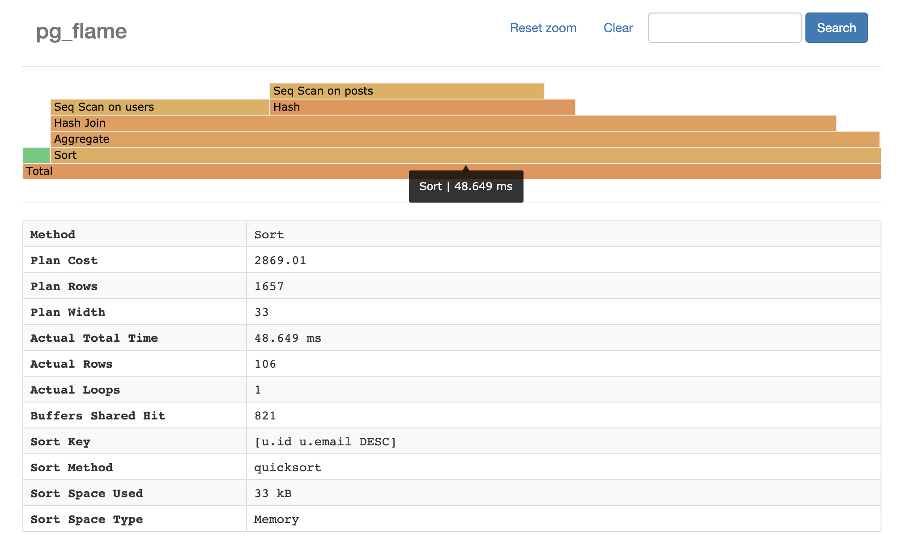

## PostgreSQL explain analyze 火山图火焰图 图形化性能分析软件 pg_flame   
    
### 作者    
digoal    
    
### 日期    
2020-12-17    
    
### 标签    
PostgreSQL , pg_flame , explain , 火山图   
    
----    
    
## 背景    
https://github.com/mgartner/pg_flame  
  
  
  
demo  
  
https://mgartner.github.io/pg_flame/flamegraph.html  
    
# pg_flame [](https://github.com/mgartner/pg_flame/releases) [](https://travis-ci.com/mgartner/pg_flame)  
  
A flamegraph generator for Postgres `EXPLAIN ANALYZE` output.  
  
<a href="https://mgartner.github.io/pg_flame/flamegraph.html">  
    
</a>  
  
## Demo  
  
Try the demo [here](https://mgartner.github.io/pg_flame/flamegraph.html).  
  
## Installation  
  
### Homebrew  
  
You can install via Homebrew with the follow command:  
  
```  
$ brew install mgartner/tap/pg_flame  
```  
  
### Download pre-compiled binary  
  
Download one of the compiled binaries [in the releases  
tab](https://github.com/mgartner/pg_flame/releases). Once downloaded, move  
`pg_flame` into your `$PATH`.  
  
### Docker  
  
Alternatively, if you'd like to use Docker to build the program, you can.  
  
```  
$ docker pull mgartner/pg_flame  
```  
  
### Build from source  
  
If you'd like to build a binary from the source code, run the following  
commands. Note that compiling requires Go version 1.13+.  
  
```  
$ git clone https://github.com/mgartner/pg_flame.git  
$ cd pg_flame  
$ go build  
```  
  
A `pg_flame` binary will be created that you can place in your `$PATH`.  
  
## Usage  
  
The `pg_flame` program reads a JSON query plan from standard input and writes  
the flamegraph HTML to standard ouput. Therefore you can pipe and direct input  
and output however you desire.  
  
### Example: One-step  
  
```bash  
$ psql dbname -qAtc 'EXPLAIN (ANALYZE, BUFFERS, FORMAT JSON) SELECT id FROM users' \  
    | pg_flame \  
    > flamegraph.html \  
    && open flamegraph.html  
```  
  
### Example: Multi-step with SQL file  
  
Create a SQL file with the `EXPLAIN ANALYZE` query.  
  
```sql  
-- query.sql  
EXPLAIN (ANALYZE, BUFFERS, FORMAT JSON)  
SELECT id  
FROM users  
```  
  
Then run the query and save the JSON to a file.  
  
```bash  
$ psql dbname -qAtf query.sql > plan.json  
```  
  
Finally, generate the flamegraph HTML.  
  
```  
$ cat plan.json | pg_flame > flamegraph.html  
```  
  
### Example: Docker  
  
If you've followed the Docker installation steps above, you can pipe query plan  
JSON to a container and save the output HTML.  
  
```  
$ psql dbname -qAtc 'EXPLAIN (ANALYZE, BUFFERS, FORMAT JSON) SELECT id FROM users' \  
    | docker run -i pg_flame \  
    > flamegraph.html  
```  
  
## Background  
  
[Flamegraphs](http://www.brendangregg.com/flamegraphs.html) were invented by  
Brendan Gregg to visualize CPU consumption per code-path of profiled software.  
They are useful visualization tools in many types of performance  
investigations. Flamegraphs have been used to visualize Oracle database  
[query  
plans](https://blog.tanelpoder.com/posts/visualizing-sql-plan-execution-time-with-flamegraphs/)  
and [query  
executions](https://externaltable.blogspot.com/2014/05/flame-graphs-for-oracle.html)  
, proving useful for debugging slow database queries.  
  
Pg_flame is in extension of that work for Postgres query plans. It generates a  
visual hierarchy of query plans. This visualization identifies the relative  
time of each part of a query plan.  
  
This tool relies on the  
[`spiermar/d3-flame-graph`](https://github.com/spiermar/d3-flame-graph) plugin to  
generate the flamegraph.  
    
  
#### [PostgreSQL 许愿链接](https://github.com/digoal/blog/issues/76 "269ac3d1c492e938c0191101c7238216")
您的愿望将传达给PG kernel hacker、数据库厂商等, 帮助提高数据库产品质量和功能, 说不定下一个PG版本就有您提出的功能点. 针对非常好的提议，奖励限量版PG文化衫、纪念品、贴纸、PG热门书籍等，奖品丰富，快来许愿。[开不开森](https://github.com/digoal/blog/issues/76 "269ac3d1c492e938c0191101c7238216").  
  
  
#### [9.9元购买3个月阿里云RDS PostgreSQL实例](https://www.aliyun.com/database/postgresqlactivity "57258f76c37864c6e6d23383d05714ea")
  
  
#### [PostgreSQL 解决方案集合](https://yq.aliyun.com/topic/118 "40cff096e9ed7122c512b35d8561d9c8")
  
  
#### [德哥 / digoal's github - 公益是一辈子的事.](https://github.com/digoal/blog/blob/master/README.md "22709685feb7cab07d30f30387f0a9ae")
  
  

  
  
#### [PolarDB 学习图谱: 训练营、培训认证、在线互动实验、解决方案、生态合作、写心得拿奖品](https://www.aliyun.com/database/openpolardb/activity "8642f60e04ed0c814bf9cb9677976bd4")
  
  
#### [购买PolarDB云服务折扣活动进行中, 55元起](https://www.aliyun.com/activity/new/polardb-yunparter?userCode=bsb3t4al "e0495c413bedacabb75ff1e880be465a")
  
  
#### [About 德哥](https://github.com/digoal/blog/blob/master/me/readme.md "a37735981e7704886ffd590565582dd0")
  
