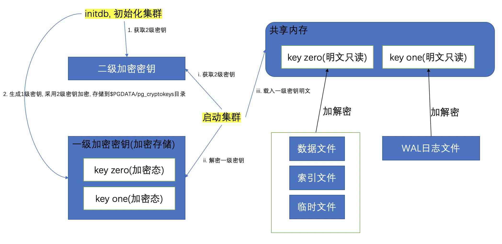

## PostgreSQL 14 preview - 支持TDE功能, 支持加密数据文件, 支持加密WAL日志文件

### 作者
digoal

### 日期
2020-12-28

### 标签
PostgreSQL , TDE  

----

## 背景
PostgreSQL 14将支持TDE功能, 支持加密数据文件, 支持加密WAL日志文件.    
  
  
  
### 加密的目的  
由于数据和wal都是加密的, 所以如果不知道密钥的话, 数据库无法启动.   
  
即使数据文件和wal泄漏, 也无法解析出数据内容. 可以提高数据库的安全级别.   
  
### 加密原理  
有两级密钥, 第一级密钥用来对数据文件和WAL文件加解密, 第二级密钥对第一级密钥进行加解密.   
  
就好比你家门口放了个保险柜, 保险柜里有大门钥匙.   
  
1、通过保险柜密码打开保险柜, 拿到大门钥匙.   
2、使用大门钥匙开门进去.   
  
先说一下第一级密钥:  
  
第一级密钥实际上是两个密钥, 一个密钥用来加密数据(包括数据文件, 索引文件, 运行过程中产生的临时文件等), 一个密钥用来加密日志.    
- Key zero : 数据加密密钥  
- Key one : WAL日志加密密钥  
  
  
第二级密钥:   
- 密钥加密密钥(KMK, Key Encryption Key), 这个密钥不能存储在文件系统中, 可以从远程的kms服务获取, 也可以从用户的输入中获取.   
  
第一级密钥, 被第二级密钥加密后, 存储在```$PGDATA/pg_cryptokeys```目录中.     
  
### 集群初始化过程  
  
初始化PG数据库集群时, 使用```initdb --cluster-key-command```选项, 目的是给initdb传入第二级密钥(必须是64个字符长度的16进制字符串).    
  
传入第二级密钥的方法很多, 源码里面有很多例子  
  
```  
src/backend/crypto/Makefile	  
src/backend/crypto/ckey_aws.sh.sample	  
src/backend/crypto/ckey_direct.sh.sample	  
src/backend/crypto/ckey_passphrase.sh.sample	  
src/backend/crypto/ckey_piv_nopin.sh.sample	  
src/backend/crypto/ckey_piv_pin.sh.sample  
src/backend/crypto/kmgr.c	  
src/backend/crypto/ssl_passphrase.sh.sample	  
```  
  
例如  
  
```  
initdb -D dbname --cluster-key-command='ckey_passphrase.sh'  
  
ckey_passphrase.sh 脚本, 返回值0, 返回结果必须是64个字符长度的16进制字符串  
```  
  
初始化过程中会生成2个数据加密密钥(key zero, key one), 使用```--cluster-key-command```获取到的二级加密密钥对一级加密密钥加密后, 存储在```$PGDATA/pg_cryptokeys```目录中.    
  
  
### 启动过程  
读取参数cluster_key_command的内容, 获取二级加密密钥.   
  
解密```$PGDATA/pg_cryptokeys```目录中的一级密钥.  
  
将解密后的一级密钥存储在共享内存中(只读).  
  
启动数据库.   
  
### 加密前提  
1、编译PostgreSQL软件时使用 ```--with-openssl``` 选项, 开启openssl支持.  
  
2、初始化PG数据库集群时, 使用```initdb --cluster-key-command```选项, 目的是给initdb传入第二级密钥(必须是64个字符长度的16进制字符串).    
  
传入方法很多, 例如  
  
```  
initdb -D dbname --cluster-key-command='ckey_passphrase.sh'  
  
ckey_passphrase.sh 脚本, 返回值0, 返回结果必须是64个字符长度的16进制字符串  
```  
  
3、在postgresql.conf配置文件中, cluster_key_command 参数, 必须和initdb时得到的"64个字符长度的16进制字符串值"相同, 用于启动数据库时解密第一级密钥.   
  
4、在pg_controldata控制文件中, file_encryption_keylen 参数, 用于配置第一级密钥的生成长度, 默认128(理论上是不能修改的， 在initdb时生成， 并写入控制文件中。).  取值范围```supported values are 0 (disabled), 128, 192, and 256```     
  
https://git.postgresql.org/gitweb/?p=postgresql.git;a=blobdiff;f=src/backend/utils/misc/pg_controldata.c;h=d50d87a6021c6e48110720cdd98e51644b799000;hp=6fcab311721e76750c87d35007ad3210ffe02f8c;hb=3187ef7c46c5b884267a88f2d6119c9a05f1bbba;hpb=facad31474ac6dace3894ebc7c45dc3cc829422e  
  
```  
   The data encryption keys are randomly generated and are 128, 192,  
   or 256-bits in length.  They are encrypted by the key encryption key  
   (KEK) using Advanced Encryption Standard (<acronym>AES256</acronym>)  
   encryption in Galois/Counter Mode (<acronym>GCM</acronym>), which also  
   provides KEK authentication.  
```  
  
### 建立standby  
和不加密的实例创建standby过程是一样的, 只是standby也是加密的, standby必须能获取到二级密钥.     
  
将一级密钥设计为key one和key zero的目的是方便将来可以比较平滑的更换一级密钥.   
  
Two different  
keys are used so that primary and standby servers can use different zero  
(heap/index/temp) keys, but the same one (WAL) key, so that these keys  
can eventually be rotated by switching the primary to the standby  
and then changing the WAL key.  
  
目前还没有内置的工具支持更换一级密钥, 相信未来会支持.   
  
### 更换KMK  
KMK(也就是用来加密一级密钥的二级密钥) 可以在线或离线修改.   
  
PG 提供了命令行工具pg_alterckey来修改kmk.  
  
这个命令的逻辑如下:  
  
https://www.postgresql.org/docs/devel/app-pg_alterckey.html  
  
```  
   7  * The theory of operation is fairly simple:  
   8  *    1. Create lock file  
   9  *    2. Retrieve current and new cluster key using the supplied  
  10  *       commands.  
  11  *    3. Revert any failed alter operation.  
  12  *    4. Create a temporary directory in PGDATA  
  13  *    5. For each data encryption key in the pg_cryptokeys directory,  
  14  *       decrypt it with the old cluster key and re-encrypt it  
  15  *       with the new cluster key.  
  16  *    6. Make the temporary directory the new pg_cryptokeys directory.  
  17  *    7. Remove lock file  
```  
  
## 参考  
  
https://www.postgresql.org/docs/devel/database-file-encryption.html  
  
```  
   1 /*-------------------------------------------------------------------------  
   2  *  
   3  * kmgr.c  
   4  *       Cluster file encryption routines  
   5  *  
   6  * Cluster file encryption is enabled if user requests it during initdb.  
   7  * During bootstrap, we generate data encryption keys, wrap them with the  
   8  * cluster-level key, and store them into each file located at KMGR_DIR.  
   9  * Once generated, these are not changed.  During startup, we decrypt all  
  10  * internal keys and load them to the shared memory space.  Internal keys  
  11  * on the shared memory are read-only.  All wrapping and unwrapping key  
  12  * routines require the OpenSSL library.  
  13  *  
  14  * Copyright (c) 2020, PostgreSQL Global Development Group  
  15  *  
  16  * IDENTIFICATION  
  17  *        src/backend/crypto/kmgr.c  
  18  *-------------------------------------------------------------------------  
  19  */  
```  
  
https://www.postgresql.org/docs/devel/app-initdb.html  
  
https://www.postgresql.org/docs/devel/runtime-config-encryption.html#GUC-CLUSTER-KEY-COMMAND  
  
获取二级密钥的相关参数  
  
cluster_key_command (string)  
  
This option specifies an external command to obtain the cluster-level key for cluster file encryption during server initialization and server start.  
  
The command must print the cluster key to the standard output as 64 hexadecimal characters, and exit with code 0. The command can prompt for the passphrase or PIN from the terminal if --authprompt is used. In the parameter value, %R represents the file descriptor number opened to the terminal that started the server. A file descriptor is only available if enabled at server start. If %R is used and no file descriptor is available, the server will not start. Value %p is replaced by a pre-defined prompt string. Value %d is replaced by the directory containing the keys; this is useful if the command must create files with the keys, e.g., to store a cluster-level key encryped by a key stored in a hardware security module. (Write %% for a literal %.) Note that the prompt string will probably contain whitespace, so be sure to quote its use adequately. Newlines are stripped from the end of the output if present.  
  
This parameter can only be set by initdb, in the postgresql.conf file, or on the server command line.  
  
获取二级密钥的相关脚本模版, 二级密钥必须通过远程密钥管理服务或通过终端直接输入.  
  
```  
src/backend/crypto/Makefile	  
src/backend/crypto/ckey_aws.sh.sample	  
src/backend/crypto/ckey_direct.sh.sample	  
src/backend/crypto/ckey_passphrase.sh.sample	  
src/backend/crypto/ckey_piv_nopin.sh.sample	  
src/backend/crypto/ckey_piv_pin.sh.sample	  
src/backend/crypto/kmgr.c	  
src/backend/crypto/ssl_passphrase.sh.sample	  
```  
  
模版例子  
  
ckey_direct.sh.sample, 表示直接从终端输入二级密钥， 使用这个方法必须告诉initdb或启动数据库的main函数， 方法, 加-R选项： ```initdb -R```  ```pg_ctl -R```     
  
https://git.postgresql.org/gitweb/?p=postgresql.git;a=blobdiff;f=doc/src/sgml/ref/initdb.sgml;h=385ac2515061ca50ff043b0f6172dae76f4c9b5b;hp=d994f407faaa1adeaf585812fd4287ff6f608350;hb=3187ef7c46c5b884267a88f2d6119c9a05f1bbba;hpb=facad31474ac6dace3894ebc7c45dc3cc829422e  
  
https://git.postgresql.org/gitweb/?p=postgresql.git;a=blobdiff;f=doc/src/sgml/ref/pg_ctl-ref.sgml;h=3946fa52eab7c5b305f79f243cd3c873a332c5df;hp=0662ae051a3f33a7170daec545a6ca1b2ed84cf6;hb=3187ef7c46c5b884267a88f2d6119c9a05f1bbba;hpb=facad31474ac6dace3894ebc7c45dc3cc829422e  
  
https://git.postgresql.org/gitweb/?p=postgresql.git;a=blobdiff;f=src/backend/main/main.c;h=b6e512883269017aa1e3e1bbf9bf3fd008454762;hp=19aa502614e7f22bb7b0ef1d613468e25c91f34a;hb=3187ef7c46c5b884267a88f2d6119c9a05f1bbba;hpb=facad31474ac6dace3894ebc7c45dc3cc829422e  
  
https://git.postgresql.org/gitweb/?p=postgresql.git;a=blobdiff;f=src/backend/postmaster/postmaster.c;h=fff4227e0b609fc04a8ade4cef933222239921a1;hp=bf883184b1137895dce797e0172c58b6fdcfa85d;hb=3187ef7c46c5b884267a88f2d6119c9a05f1bbba;hpb=facad31474ac6dace3894ebc7c45dc3cc829422e  
  
https://git.postgresql.org/gitweb/?p=postgresql.git;a=blobdiff;f=src/backend/tcop/postgres.c;h=d35c5020ea634d5bbb301f14b59a23b03d269434;hp=81e64616d43664b8230aabc59f722041fdc1a80d;hb=3187ef7c46c5b884267a88f2d6119c9a05f1bbba;hpb=facad31474ac6dace3894ebc7c45dc3cc829422e  
  
https://git.postgresql.org/gitweb/?p=postgresql.git;a=blobdiff;f=src/bin/initdb/initdb.c;h=f994c4216bcdc810e9fad68d03103ae5580edebc;hp=33a11e0d2bf788444becbbd63ea81db9adf7093a;hb=3187ef7c46c5b884267a88f2d6119c9a05f1bbba;hpb=facad31474ac6dace3894ebc7c45dc3cc829422e  
  
```  
#!/bin/sh  
  
# This uses a key supplied by the user  
# If OpenSSL is installed, you can generate a pseudo-random key by running:  
#	openssl rand -hex 32  
# To get a true random key, run:  
#	wget -q -O - 'https://www.random.org/cgi-bin/randbyte?nbytes=32&format=h' | tr -d ' \n'; echo  
  
[ "$#" -lt 1 ] && echo "cluster_key_command usage: $0 %R [%p]" 1>&2 && exit 1  
# Supports environment variable PROMPT  
  
FD="$1"  
[ ! -t "$FD" ] && echo "file descriptor $FD does not refer to a terminal" 1>&2 && exit 1  
  
[ "$2" ] && PROMPT="$2"  
  
  
# ----------------------------------------------------------------------  
  
[ ! "$PROMPT" ] && PROMPT='Enter cluster key as 64 hexadecimal characters: '  
  
stty -echo <&"$FD"  
  
echo 1>&"$FD"  
echo -n "$PROMPT" 1>&"$FD"  
read KEY <&"$FD"  
  
stty echo <&"$FD"  
  
if [ "$(expr "$KEY" : '[0-9a-fA-F]*$')" -ne 64 ]  
then	echo 'invalid;  must be 64 hexadecimal characters' 1>&2  
	exit 1  
fi  
  
echo "$KEY"  
  
exit 0  
```  
  
  
ckey_passphrase.sh.sample  
  
```  
#!/bin/sh  
  
# This uses a passphrase supplied by the user.  
  
[ "$#" -lt 1 ] && echo "cluster_key_command usage: $0 %R [\"%p\"]" 1>&2 && exit 1  
  
FD="$1"  
[ ! -t "$FD" ] && echo "file descriptor $FD does not refer to a terminal" 1>&2 && exit 1  
# Supports environment variable PROMPT  
  
[ "$2" ] && PROMPT="$2"  
  
  
# ----------------------------------------------------------------------  
  
[ ! "$PROMPT" ] && PROMPT='Enter cluster passphrase: '  
  
stty -echo <&"$FD"  
  
echo 1>&"$FD"  
echo -n "$PROMPT" 1>&"$FD"  
read PASS <&"$FD"  
  
stty echo <&"$FD"  
  
if [ ! "$PASS" ]  
then	echo 'invalid:  empty passphrase' 1>&2  
	exit 1  
fi  
  
echo "$PASS" | sha256sum | cut -d' ' -f1  
  
exit 0  
```  
  
https://www.postgresql.org/docs/devel/app-pg_alterckey.html  
  
修改kms的过程  
  
```  
   7  * The theory of operation is fairly simple:  
   8  *    1. Create lock file  
   9  *    2. Retrieve current and new cluster key using the supplied  
  10  *       commands.  
  11  *    3. Revert any failed alter operation.  
  12  *    4. Create a temporary directory in PGDATA  
  13  *    5. For each data encryption key in the pg_cryptokeys directory,  
  14  *       decrypt it with the old cluster key and re-encrypt it  
  15  *       with the new cluster key.  
  16  *    6. Make the temporary directory the new pg_cryptokeys directory.  
  17  *    7. Remove lock file  
```  
  
https://git.postgresql.org/gitweb/?p=postgresql.git;a=commit;h=978f869b992f9fca343e99d6fdb71073c76e869a  
  
https://git.postgresql.org/gitweb/?p=postgresql.git;a=commit;h=300e430c76644b483f70bc833d6251a6a7fb84a6  
  
https://git.postgresql.org/gitweb/?p=postgresql.git;a=commit;h=3187ef7c46c5b884267a88f2d6119c9a05f1bbba  
  
tgresql.git;a=blobdiff;f=src/bin/initdb/initdb.c;h=f994c4216bcdc810e9fad68d03103ae5580edebc;hp=33a11e0d2bf788444becbbd63ea81db9adf7093a;hb=3187ef7c46c5b884267a88f2d6119c9a05f1bbba;hpb=facad31474ac6dace3894ebc7c45dc3cc829422e  
    
  
#### [PostgreSQL 许愿链接](https://github.com/digoal/blog/issues/76 "269ac3d1c492e938c0191101c7238216")
您的愿望将传达给PG kernel hacker、数据库厂商等, 帮助提高数据库产品质量和功能, 说不定下一个PG版本就有您提出的功能点. 针对非常好的提议，奖励限量版PG文化衫、纪念品、贴纸、PG热门书籍等，奖品丰富，快来许愿。[开不开森](https://github.com/digoal/blog/issues/76 "269ac3d1c492e938c0191101c7238216").  
  
  
#### [9.9元购买3个月阿里云RDS PostgreSQL实例](https://www.aliyun.com/database/postgresqlactivity "57258f76c37864c6e6d23383d05714ea")
  
  
#### [PostgreSQL 解决方案集合](https://yq.aliyun.com/topic/118 "40cff096e9ed7122c512b35d8561d9c8")
  
  
#### [德哥 / digoal's github - 公益是一辈子的事.](https://github.com/digoal/blog/blob/master/README.md "22709685feb7cab07d30f30387f0a9ae")
  
  

  
  
#### [PolarDB 学习图谱: 训练营、培训认证、在线互动实验、解决方案、生态合作、写心得拿奖品](https://www.aliyun.com/database/openpolardb/activity "8642f60e04ed0c814bf9cb9677976bd4")
  
  
#### [购买PolarDB云服务折扣活动进行中, 55元起](https://www.aliyun.com/activity/new/polardb-yunparter?userCode=bsb3t4al "e0495c413bedacabb75ff1e880be465a")
  
  
#### [About 德哥](https://github.com/digoal/blog/blob/master/me/readme.md "a37735981e7704886ffd590565582dd0")
  
