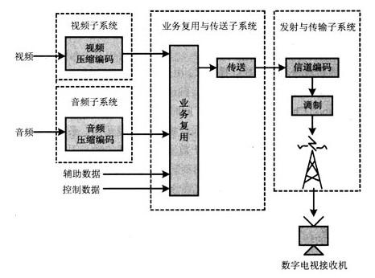

## 终于说清楚了 - 常用字符集编码详解：ASCII 、GB2312、GBK、EUC-CN、GB18030、UTF-8、unicode  
  
### 作者  
digoal  
  
### 日期  
2021-01-19   
  
### 标签  
PostgreSQL , ASCII , GB2312 , GBK , EUC-CN , GB18030 , UTF-8 , unicode  
  
----  
  
## 背景  
原文  
https://blog.csdn.net/zhoubl668/article/details/6914018  
  
https://www.postgresql.org/docs/devel/multibyte.html  
  
https://en.wikipedia.org/wiki/GB_18030#2005  
  
  
  
## ASCII  
  
ASCII码是7位编码，编码范围是0x00-0x7F。ASCII字符集包括英文字母、阿拉伯数字和标点符号等字符。其中0x00-0x20和0x7F共33个控制字符。  
  
只支持ASCII码的系统会忽略每个字节的最高位，只认为低7位是有效位。HZ字符编码就是早期为了在只支持7位ASCII系统中传输中文而设计的编码。早期很多邮件系统也只支持ASCII编码，为了传输中文邮件必须使用BASE64或者其他编码方式。  
  
## GB2312  
  
GB2312是基于区位码设计的，区位码把编码表分为94个区，每个区对应94个位，每个字符的区号和位号组合起来就是该汉字的区位码。区位码一般 用10进制数来表示，如1601就表示16区1位，对应的字符是“啊”。在区位码的区号和位号上分别加上0xA0就得到了GB2312编码。  
  
区位码中01-09区是符号、数字区，16-87区是汉字区，10-15和88-94是未定义的空白区。它将收录的汉字分成两级：第一级是常用汉字计3755个，置于16-55区，按汉语拼音字母/笔形顺序排列；第二级汉字是次常用汉字计3008个，置于56-87区，按部首/笔画顺序排列。一级汉字是按照拼音排序的，这个就可以得到某个拼音在一级汉字区位中的范围，很多根据汉字可以得到拼音的程序就是根据这个原理编写的。  
  
GB2312字符集中除常用简体汉字字符外还包括希腊字母、日文平假名及片假名字母、俄语西里尔字母等字符，未收录繁体中文汉字和一些生僻字。可以用繁体汉字测试某些系统是不是只支持GB2312编码。  
  
GB2312的编码范围是0xA1A1-0x7E7E，去掉未定义的区域之后可以理解为实际编码范围是0xA1A1-0xF7FE。  
EUC-CN可以理解为GB2312的别名，和GB2312完全相同。  
  
区位码更应该认为是字符集的定义，定义了所收录的字符和字符位置，而GB2312及EUC-CN是实际计算机环境中支持这种字符集的编码。HZ和ISO-2022-CN是对应区位码字符集的另外两种编码，都是用7位编码空间来支持汉字。区位码和GB2312编码的关系有点像 Unicode和UTF-8。  
  
## GBK  
  
GBK编码是GB2312编码的超集，向下完全兼容GB2312，同时GBK收录了Unicode基本多文种平面中的所有CJK汉字。同 GB2312一样，GBK也支持希腊字母、日文假名字母、俄语字母等字符，但不支持韩语中的表音字符（非汉字字符）。GBK还收录了GB2312不包含的汉字部首符号、竖排标点符号等字符。  
  
GBK的整体编码范围是为0x8140-0xFEFE，不包括低字节是0×7F的组合。高字节范围是0×81-0xFE，低字节范围是0x40-7E和0x80-0xFE。  
  
低字节是0x40-0x7E的GBK字符有一定特殊性，因为这些字符占用了ASCII码的位置，这样会给一些系统带来麻烦。  
有些系统中用0x40-0x7E中的字符（如“|”）做特殊符号，在定位这些符号时又没有判断这些符号是不是属于某个 GBK字符的低字节，这样就会造成错误判断。在支持GB2312的环境下就不存在这个问题。需要注意的是支持GBK的环境中小于0x80的某个字节未必就是ASCII符号；另外就是最好选用小于0×40的ASCII符号做一些特殊符号，这样就可以快速定位，且不用担心是某个汉字的另一半。Big5编码中也存在相应问题。  
  
CP936和GBK的有些许差别，绝大多数情况下可以把CP936当作GBK的别名。  
  
## GB18030  
GB18030编码向下兼容GBK和GB2312，兼容的含义是不仅字符兼容，而且相同字符的编码也相同。GB18030收录了所有Unicode3.1中的字符，包括中国少数民族字符，GBK不支持的韩文字符等等，也可以说是世界大多民族的文字符号都被收录在内。  
  
GBK和GB2312都是双字节等宽编码，如果算上和ASCII兼容所支持的单字节，也可以理解为是单字节和双字节混合的变长编码。GB18030编码是变长编码，有单字节、双字节和四字节三种方式。  
GB18030的单字节编码范围是0x00-0x7F，完全等同与ASCII；双字节编码的范围和GBK相同，高字节是0x81-0xFE，低字节的编码范围是0x40-0x7E和0x80-FE；四字节编码中第一、三字节的编码范围是0x81-0xFE，二、四字节是0x30-0x39。   
  
  
  
  
Windows中CP936代码页使用0x80来表示欧元符号，而在GB18030编码中没有使用0x80编码位，用其他位置来表示欧元符号。这可以理解为是GB18030向下兼容性上的一点小问题；也可以理解为0x80是CP936对GBK的扩展，而GB18030只是和GBK兼容良好。  
  
## GB18032版本   
  
GB18030目前的最新版本是GB18030-2005。GB18030-2005与GB18030-2000的编码体系结构是完全相同的。那么，GB18030的2000版和2005版有什么区别和联系呢？  
  
2000年发布的GB18030-2000，全名是《信息技术 汉字编码字符集 基本集的扩充》。GB18030-2000仅规定了常用非汉字符号和27533个汉字（包括部首、部件等）的编码。  
GB18030-2000是全文强制性标准，市场上销售的产品必须符合。2005年发布的GB18030-2005在GB18030-2000的基础上增加了42711个汉字和多种我国少数民族文字的编码，增加的这些内容是推荐性的。原GB18030-2000中的内容是强制性的，市场上销售的产品必须符合。故GB18030-2005为部分强制性标准，自发布之日起代替GB18030-2000。   
  
如下表所示，GB18030-2000收录了27533个汉字：  
  
类别	  | 码位范围	| 码位数	| 字符数	| 字符类型  
---|---|---|---|---  
双字节部分	| 第一字节 0xB0-0xF7   第二字节 0xA1-0xFE	| 6768	| 6763	| 汉字  
双字节部分 | 第一字节0x81-0xA0   第二字节0x40-0xFE	| 6080	| 6080	| 汉字  
双字节部分 | 第一字节0xAA-0xFE   第二字节0x40-0xA0	|8160	|8160	|汉字  
四字节部分 |	第一字节0x81-0x82   第二字节0x30-0x39   第三字节0x81-0xFE   第四字节0x30-0x39	|6530	|6530	|CJK统一汉字扩充A  
  
  
27533就是6763+6080+8160+6530。双字节部分的6763+6080+8160=21003个汉字就是GBK的21003个汉字。  
在Unicode中，CJK统一汉字扩充A有6582个汉字，为什么这里只有6530个汉字？  
这是因为在GBK时代，双字节部分已经收录过CJK统一汉字扩充A的52个汉字，所以还余6530个汉字。  
  
  
如下表所示，GB18030-2005收录了70244个汉字：  
  
　　  
类别	 | 码位范围	| 码位数	| 字符数	| 字符类型  
---|---|---|---|---  
双字节部分	| 第一字节 0xB0-0xF7   第二字节 0xA1-0xFE	| 6768	| 6763	| 汉字  
双字节部分	| 第一字节0x81-0xA0    第二字节0x40-0xFE	| 6080	| 6080	| 汉字  
双字节部分	| 第一字节0xAA-0xFE    第二字节0x40-0xA0	| 8160	| 8160	| 汉字  
四字节部分	| 第一字节0x81-0x82   第二字节0x30-0x39   第三字节0x81-0xFE   第四字节0x30-0x39	| 6530	| 6530	| CJK统一汉字扩充A  
四字节部分	| 第一字节0x95-0x98   第二字节0x30-0x39   第三字节0x81-0xFE   第四字节0x30-0x39	| 42711	| 42711	| CJK统一汉字扩充B  
  
70244就是6763+6080+8160+6530+42711。  
  
  
  
GB18030-2005相对于GB18030-2000主要有以下变化：　  
  
1、在四字节字符表中增加CJK统一汉字扩充B和已经在GB13000中编码的我国少数民族文字字符的字形。其实GB18030-2000已经映射了这些码位，但GB18030-2000没有给出这些字符的字形。  
2、调整字符?的编码。  
3、去掉了单字节编码的欧元符号（0x80）。  
（纠正：在GB18030-2000中已经去掉了单字节编码的欧元符号，证据见GB18030-2000的标准文本）  
  
## Unicode  
  
每一种语言的不同的编码页，增加了那些需要支持不同语言的软件的复杂度。因而人们制定了一个世界标准，叫做unicode。unicode为每个字符提供了唯一的特定数值，不论在什么平台上、不论在什么软件中，也不论什么语言。也就是说，它世界上使用的所有字符都列出来，并给每一个字符一个唯一特定数值。  
Unicode的最初目标，是用1个16位的编码来为超过65000字符提供映射。但这还不够，它不能覆盖全部历史上的文字，也不能解决传输的问题 (implantation head-ache's)，尤其在那些基于网络的应用中。已有的软件必须做大量的工作来程序16位的数据。  
因此，Unicode用一些基本的保留字符制定了三套编码方式。它们分别是UTF-8,UTF-16和UTF-32。正如名字所示，在UTF－8中，字符是以8位序列来编码的，用一个或几个字节来表示一个字符。这种方式的最大好处，是UTF－8保留了ASCII字符的编码做为它的一部分，例如，在UTF－8和ASCII中，“A”的编码都是0x41.  
UTF－16和UTF－32分别是Unicode的16位和32位编码方式。考虑到最初的目的，通常说的Unicode就是指UTF-16。在讨论Unicode时，搞清楚哪种编码方式非常重要。  
  
## UTF-8  
  
Unicode Transformation Format-8bit，允许含BOM，但通常不含BOM。是用以解决国际上字符的一种多字节编码，它对英文使用8位（即一个字节），中文使用24为（三个字节）来编码。UTF-8包含全世界所有国家需要用到的字符，是国际编码，通用性强。UTF-8编码的文字可以在各国支持UTF8字符集的浏览器上显示。如，如果是UTF8编码，则在外国人的英文IE上也能显示中文，他们无需下载IE的中文语言支持包。  
  
## BIG5  
  
  
  
Big5是双字节编码，高字节编码范围是0x81-0xFE，低字节编码范围是0x40-0x7E和0xA1-0xFE。和GBK相比，少了低字节是0x80-0xA0的组合。0x8140-0xA0FE是保留区域，用于用户造字区。  
Big5收录的汉字只包括繁体汉字，不包括简体汉字，一些生僻的汉字也没有收录。GBK收录的日文假名字符、俄文字符Big5也没有收录。因为Big5当中收录的字符有限，因此有很多在Big5基础上扩展的编码，如倚天中文系统。Windows系统上使用的代码页CP950也可以理解为是对Big5的扩展，在Big5的基础上增加了7个汉字和一些符号。Big5编码对应的字符集是GBK字符集的子集，也就是说Big5收录的字符是GBK收录字符的一部分，但相同字符的编码不同。  
因为Big5也占用了ASCII的编码空间（低字节所使用的0x40-0x7E），所以Big5编码在一些环境下存在和GBK编码相同的问题，即低字节范围为0x40-0x7E的字符有可能会被误处理，尤其是低字节是0x5C（"/"）和0x7C（"|"）的字符。可以参考GBK一节相应说明。  
尽管有些区别，大多数情况下可以把CP950当作Big5的别名。  
  
  
GBK的文字编码是用双字节来表示的，即不论中、英文字符均使用双字节来表示，为了区分中文，将其最高位都设定成1。GBK包含全部中文字符，是国家编码，通用性比UTF8差，不过UTF8占用的数据库比GBD大。  
  
GBK、GB2312等与UTF8之间都必须通过Unicode编码才能相互转换：  
  
GBK、GB2312  <－－Unicode－－>  UTF8  
  
UTF8  <－－Unicode－－>  GBK、GB2312  
  
对于一个网站、论坛来说，如果英文字符较多，则建议使用UTF－8节省空间。不过现在很多论坛的插件一般只支持GBK。  
Unicode是字符集，ASCII、GB2312、GBK、GB18030既是字符集也是编码方式，UTF-8只是编码方式。  
  
  
#### [PostgreSQL 许愿链接](https://github.com/digoal/blog/issues/76 "269ac3d1c492e938c0191101c7238216")
您的愿望将传达给PG kernel hacker、数据库厂商等, 帮助提高数据库产品质量和功能, 说不定下一个PG版本就有您提出的功能点. 针对非常好的提议，奖励限量版PG文化衫、纪念品、贴纸、PG热门书籍等，奖品丰富，快来许愿。[开不开森](https://github.com/digoal/blog/issues/76 "269ac3d1c492e938c0191101c7238216").  
  
  
#### [9.9元购买3个月阿里云RDS PostgreSQL实例](https://www.aliyun.com/database/postgresqlactivity "57258f76c37864c6e6d23383d05714ea")
  
  
#### [PostgreSQL 解决方案集合](https://yq.aliyun.com/topic/118 "40cff096e9ed7122c512b35d8561d9c8")
  
  
#### [德哥 / digoal's github - 公益是一辈子的事.](https://github.com/digoal/blog/blob/master/README.md "22709685feb7cab07d30f30387f0a9ae")
  
  

  
  
#### [PolarDB 学习图谱: 训练营、培训认证、在线互动实验、解决方案、生态合作、写心得拿奖品](https://www.aliyun.com/database/openpolardb/activity "8642f60e04ed0c814bf9cb9677976bd4")
  
  
#### [购买PolarDB云服务折扣活动进行中, 55元起](https://www.aliyun.com/activity/new/polardb-yunparter?userCode=bsb3t4al "e0495c413bedacabb75ff1e880be465a")
  
  
#### [About 德哥](https://github.com/digoal/blog/blob/master/me/readme.md "a37735981e7704886ffd590565582dd0")
  
