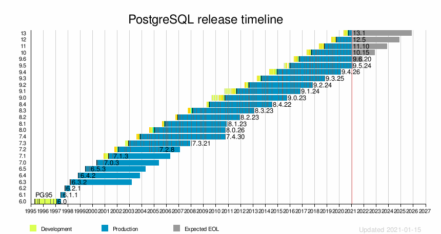

## 开源数据库全球化协作浪潮 思考 - 24问  
  
### 作者  
digoal  
  
### 日期  
2021-01-20   
  
### 标签  
PostgreSQL , 全球化 , 开源 , 协作      
  
----  
  
## 背景  
### 1、商业数据库为什么要开源?   
资本是追逐利润的, 商业数据库开源的根源首先要搞清楚, 他们不是雷锋, 开源一定是基于牟利的基础.  
  
通过开源可以培养用户群体, 当然这里有很多可能是穷鬼没有办法直接从中收割, 但是有一些用户在使用并依赖上这些产品后, 可能有付费的意愿(比如高级功能你不得不付费).  
  
不付费的群体就没有价值吗? 错了, 他们可以帮你宣传产品, 帮你培养使用、管理、开发人才, 这些企业的员工出去都是你的人肉广告体.   
  
### 2、商业数据库什么情况下会选择闭源  
当你辛辛苦苦把生态培养起来, 却发现付费用户的钱不是流向你的口袋时.   
  
当用户已经离不开你, 生态已经完整时.  
  
### 3、商业数据库什么情况下会选择改开源协议  
同上, 改开源协议针对性更明显, 例如云厂商, 或者数据库厂商(基于你的产品改吧改吧拿去卖).   
  
钱流进别人口袋, 给别人数钱是很惨的.  
  
### 4、未来的商业数据库要不要开源?  
取决于你开源的目的, 如果有其他更好的方法达到这个目的, 或者这个目的在商业上没有太大价值可能就不需要开源.  
  
开源最大的意义在于培养生态, 如果你已经有自己的客户群体, 有自己的渠道, 有自己的护城河, 其实没必要开源.   
  
### 5、未来的商业数据库选择什么开源协议?  
开源协议嘛, 可以改的, 资产是你的.   
  
所以看阶段, 初期可能选择更友好的开源协议, 让大家跟你玩, 等客户群体上来差不多了, 如果有给别人数钱的风险, 换个开源协议也无妨.   
  
孙权也不是一会跟刘备合作打曹操, 一会又和曹操合作打刘备嘛.  
  
### 6、如何看待mongo, es改开源协议?  
主要就是防止给云厂商数钱, 大家都上云了, 钱给了云厂商, 而不是es或者mongo.  云厂商可能改吧改吧就把企业版的功能做了, 甚至做得更好, 拿怎么办, 改协议先止血, 同时寻求与云厂商合作.   
  
mongo就和阿里云有很好的合作.   
  
其实用户也没有必要恐慌， 该用还是用， 无非就是某些客户可能从付费变成收费用户。   
  
### 7、mongo改完协议后一年过去了, 站在商业角度mongo公司发生了什么?   
其实发展并没有受太大影响, dbengine 数据来看mongo的发展还是很快, 今年增速排名第三. 原因是什么?  
  
其实mongo改协议无非就是影响了云厂商, 云厂商不能售卖改完协议后的版本, 而最终用户依旧能使用mongo的最新版本.   
  
云厂商如果需要售卖mongo改协议后的版本, 需要与mongo商业合作, 例如阿里云.   
  
### 8、为什么国产化数据库这么火?  
熟话说, 缺什么就补什么, 说明我们的数据库研发能力欠缺呀.   
  
重点是把研发能力提上来, 别让人卡脖子.   
  
至于国产数据库占比要达到多少, 不是目的, 目的还是那句话: 有能力, 但是不一定要表现出来.    
  
[《新冠，为什么rmb会升值 - 国家需要什么，全球需要什么，我们做什么? 为什么? - GDP , 外汇 之间有什么关系?  - 乱弹》](../202101/20210118_04.md)    
  
### 9、PG成功吗?  
PG是源自伯克利大学的一款纯社区维护的开源数据库,没有商业背景.    
  
作为一款没有商业数据库主体在背后推动的开源数据库, 纯社区化运作, 全球协作, 你觉得它今天能取得全球数据库第四名, 并且最近4年获得3届数据库发展冠军, 算不算成功?  
  
[《庆祝PostgreSQL 连续4年3次夺得DB-engine年度数据库桂冠》](../202101/20210105_01.md)    
  
如果没有大量企业在用, 没有高校在教学, 没有大量代码贡献者, 你觉得它会发展这么快吗, 不可能嘛.    
  
### 10、PG成功的核心是什么?  
1、成功的先决条件是, 市场足够大(用滚雪球的俗的话来说, 雪的赛道宽, 雪的厚度够, 雪的赛道长).    
  
很荣幸, PG是数据库产品, 随着通信的发展, 互联网、物联网发展, 数据爆炸式发展, 数据需要存储, 需要计算, 需要互联互通, 因此数据库是最大受益的产品之一.    
  
2、有良好的顶层设计, 简直是大师级别的设计.    
  
社区产品顶层设计:   被谁需求(目标客户) -> 目标客户怎么回馈PG社区(代码)    
  
商业产品顶层设计:   目标客户 -> 目标客户怎么回馈商业公司(付费)    
  
- 最终用户  
    - 公司不以贩卖PG产品为核心, 母牛业务与PG不想关, 只是使用PG  
    - 大客户, 买商业数据库比自己养几个PG代码贡献者贵, 而且被商业数据库绑定, 很危险  
    - 以小博大, 四两拨千斤, 如果全球有很多PG大客户都给PG贡献代码, 实际上PG发展会远远比商业数据库发展快  
    - 我说了算, 我给PG社区贡献代码, 当然站在我自己的角度, 需要什么特性就去贡献什么特性  
    - 放心, 自己掌握核心科技, 放心  
    - 从PG代码的架构更加可以证明这一点, PG代码架构非常开放(可能是全球数据库产品中最好的, 不信你可以去看看呀), 可读性非常好, 扩展能力极强, 原因是什么? 因为最终用户希望更多企业参与贡献, 代码可读性, 代码可扩展性, 灵活性是首当其冲的.   
    - 日本电信就是这个例子. 国内有这个能力的建议尽早实施贡献战略，例如邮储银行，移动，平安集团等。
    - 投资也算.  
- 云数据库服务商, 数据库厂商  
    - 目的是收割没有内核研发能力的数据库使用者  
    - PG的开源协议允许任何厂商包装PG代码, 拿出去售卖, 无论你是否将包装后的代码开源, 都没有法律风险  
    - 为什么选你, 你的品牌影响力足够大, 比自建省心  
    - 怎么体现你的影响力, 有能力搞定PG内核  
    - 贡献PG代码越多, 你的影响力越大  
- 技术支持服务商  
    - 技术支持的目标客户是传统客户  
    - 这种客户怎么选择服务商呢? 商业数据库有官方授权服务商, PG这种纯社区的开源数据库, 没有官方给你授权了呀?  
    - 商业数据库技术支持的影响力, 可以通过给PG贡献代码来证明(这是最简单直接的方式), 你是这个行业的专家, 你有多少这个行业的专家  
    - PG用户社区, 作为权威组织, 给技术支持服务商办法专业认证, 技术支持服务商给PG用户会做贡献(这个方式存在一些内幕, 公信力没有直接给PG社区贡献代码强)  
- 高校  
    - 目的是培养数据库人才, 当然选择经久不衰的开源数据库.  
    - 高校为什么要以某个公司的开源产品或者商业产品来教学呢? 说不过去嘛. 所以PG是最好的选择.   
    - 教学成果如何展示, 学生能力如何体现. 贡献代码呀.    
  
就这样PG形成了良好的闭环. PG全球化开源协作已历经23年, 管理组织, 规章制度完善.    
  
### 11、PG目标用户人群有哪些?  
前面已回答.    
  
### 12、PG目标用户人群从PG这得到什么?  
前面已回答.    
  
### 13、PG目标用户人群为什么要回馈PG代码?  
前面已回答.    
  
### 14、在PG发展中受益的群体有哪些? (包括未回馈代码的群体)  
前面已回答.    
  
### 15、在PG发展过程中为什么有持续扩大的目标群体?  
因为行业在发展, 数据在爆炸, 这是前提.  
  
而选择PG的用户越来越多, 说明PG这种开源理念和全球化协作模式正在被更多的用户认可.    
  
PG的全球化协作一定是趋势, 一定会越来越多国家参与.   
  
### 16、百分之多少的PG用户群体在回馈代码就能保证PG持续发展?  
这个问题是, 多少人躺赢, 还能保持PG发展.   
  
懒人绑架勤奋的人. 例如: A贡献者是行业翘楚, B紧随其后, A与B都使用PG, A与B的业务与PG紧密相关, 然而只有A在贡献代码, B不贡献.   
  
这种情况可能发生吗?  A完全可以保留某些代码不贡献出去呀, PG的开源协议很友好.  概率极小.   
  
而且我认为B如果真这样, 也不可能站在第二的位置. 概率太小.     
  
以目前PG的发展状态, 不太可能出现大家不贡献了的情况, 没有任何一家厂商能追上PG的发展速度, 那些重新拉一个分枝出去发展的, 后来又回来了.  
  
  
  
### 17、什么情况下PG的发展可能降速?  (留存流失, 新增降低, 达到零界点)  
- 不再社会被需要, 无法满足用户群体需求, 用户数下降  
- 有性价比更高的替代产品  
- 法律问题  
  
### 18、为什么国内用户给PG贡献代码偏少?  
- 全球化协作精神还需要培育  
- 能力需要提升  
  
### 19、PG处于什么发展阶段?  
一个产品的发展通常有5个阶段:   
萌芽  
发展  
成熟  
衰退  
复苏  
  
PG介于发展和成熟之间的上升通道.   
  
  
  
目前PG产品还有哪些todo呢?    
  
[《[未完待续] PostgreSQL\Greenplum Customer视角TODO》](../201710/20171017_01.md)      
  
[《未来数据库方向》](../202005/20200527_06.md)      
  
https://wiki.postgresql.org/wiki/Todo  
  
  
### 20、企业应该 选择 全球化数据库 还是 商业数据库?  
能选全球化的首当其冲, 当然还需要看它的阶段, 背后的贡献者, 社区健壮性等.    
  
如果你的行业 或者 你的场景 没有满足业务需求的像PG这样的全球化数据库, 那么只能选商业的.  
  
当然PG因为架构上是很容易扩展的, 也行你能基于PG改出一个适合你场景的专业数据库. 例如 pipelinedb, timescaledb, agensgraph, pase, gpdb, edb, polardb, recdb.   
  
https://wiki.postgresql.org/wiki/PostgreSQL_derived_databases     
  
### 21、未来还会有PG这样的纯社区的, 全球协作的开源数据库产品吗?  
PG是全球化协作的开源数据库典范.  严格来说, 是个公益性质的开源项目.    
  
未来如果还有类似的开源数据库出现, 可能来自:  
- 高校  
- 个人公益贡献  
  
商业公司的开源数据库产品几乎不可能出现这样的情况, 追逐利润是资本天性.   
  
### 22、PG发展的天花板是什么? 能超过所有商业和开源数据库吗?  
1、市场足够大    
2、水大鱼大, PG作为全球化协作研发的数据库, 我认为是有很大机会成为全球最大的开源数据库的。  
  
  
### 23、全球化和国家核心能力，矛盾吗？国家公民和全球公民角色。怎么抉择。  
[《新冠，为什么rmb会升值 - 国家需要什么，全球需要什么，我们做什么? 为什么? - GDP , 外汇 之间有什么关系?  - 乱弹》](../202101/20210118_04.md)    
  
看过三体的同学应该知道，我们现在在谈的是国家利益，再往上是人类利益，再往上是地球所有物种，在往上发展可能是星系利益。爆发世界大战一定没有哪个国家可以独善其身。   
  
所以全球化应该是趋势，但是要在全球化中有贡献的前提也是自己足够强，自己国家都不强谈什么全球化贡献？    
  
全球化和国家发展并不矛盾。   
  
### 24、为什么bsd操作系统不如pg流行。流行和开源协议强相关吗？  
留给大家思考.  
  
### 新增一个问题: PG这种全球化协作的纯社区开源产品物种, 未来会长成什么样?
如果我有一辆汽车, 汽车的某个零部件坏了, 但是呢在本土的所有工厂都不生产这个零件了, 什么情况下我能在全球其他国家找到这个零件?   
1、从其他废旧汽车中拆一个可以用的. 这一条不是我要表达的重点.  
2、这辆汽车是标准化生产的, 其他工厂也能生产它的零部件.  
所以遵循标准很重要.   
3、如果换个零件要很专业的人,必须原厂,是不是也很麻烦?比如换个零件要大卸八块,可能装不回去, 装回去之后可能出各种问题, 这都不行.   
所以积木式(模块化, 易扩展)很重要.    
  
那么PG会长成什么样? 
- 遵循SQL标准, 这个PG确实做得最好, 在所有数据库产品里面PG追SQL标准是最快, 功能覆盖度也是最高的.
- 把平台夯实, 提供特别稳定可靠的核心.
- 内置最常用的功能.
- 开放丰富多彩的API, 周边开发者不需要懂数据库核心的能力, 也能扩展PG的功能, 而且不会因为扩展功能影响核心的稳定性和可靠性.  
- PG将装上加速发展的飞轮, 以积木式的创新加速发展.   
  
看起来PG会成为一个数据库操作系统, 像是我们用的手机操作系统, 提供了基本的功能, 同时其他生态厂商可以在上面开发新的功能(app).   
  
PG开放了哪些API呢?参考:         
  
[《未来数据库方向》](../202005/20200527_06.md)      
  
#### [PostgreSQL 许愿链接](https://github.com/digoal/blog/issues/76 "269ac3d1c492e938c0191101c7238216")
您的愿望将传达给PG kernel hacker、数据库厂商等, 帮助提高数据库产品质量和功能, 说不定下一个PG版本就有您提出的功能点. 针对非常好的提议，奖励限量版PG文化衫、纪念品、贴纸、PG热门书籍等，奖品丰富，快来许愿。[开不开森](https://github.com/digoal/blog/issues/76 "269ac3d1c492e938c0191101c7238216").  
  
  
#### [9.9元购买3个月阿里云RDS PostgreSQL实例](https://www.aliyun.com/database/postgresqlactivity "57258f76c37864c6e6d23383d05714ea")
  
  
#### [PostgreSQL 解决方案集合](https://yq.aliyun.com/topic/118 "40cff096e9ed7122c512b35d8561d9c8")
  
  
#### [德哥 / digoal's github - 公益是一辈子的事.](https://github.com/digoal/blog/blob/master/README.md "22709685feb7cab07d30f30387f0a9ae")
  
  

  
  
#### [PolarDB 学习图谱: 训练营、培训认证、在线互动实验、解决方案、生态合作、写心得拿奖品](https://www.aliyun.com/database/openpolardb/activity "8642f60e04ed0c814bf9cb9677976bd4")
  
  
#### [购买PolarDB云服务折扣活动进行中, 55元起](https://www.aliyun.com/activity/new/polardb-yunparter?userCode=bsb3t4al "e0495c413bedacabb75ff1e880be465a")
  
  
#### [About 德哥](https://github.com/digoal/blog/blob/master/me/readme.md "a37735981e7704886ffd590565582dd0")
  
