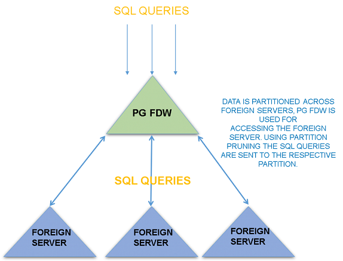

## PostgreSQL 内置sharding 进展 - 基于postgres_fdw     
    
### 作者    
digoal    
    
### 日期    
2021-01-22    
    
### 标签    
PostgreSQL , sharding , postgres_fdw  
    
----    
    
## 背景    
看一下postgresql 每个大版本release notes， 你会发现PG进展很顺利， 基于postgres_fdw的sharding快要成了。   

This page is created to outline the features required to add the capability of Sharding in PostgreSQL CORE. The purpose of the page is to maintain a todo list for adding the sharding functionality in the core.  The members collaborating on adding the capability in PG can use this page to see the current status of this feature and also see updates on the todo list.

= Overview =

Sharding in database is the ability to horizontally partition data across one more database shards. It is the mechanism to partition a table across one or more foreign servers. While the declarative partitioning feature allows users to partition tables into multiple partitioned tables living on the same database server, sharding allows tables to be partitioned in a way that the partitions live on external foreign servers and the parent table lives on the primary node where the user is creating the distributed table.
 
The built-in sharding feature in PostgreSQL will use a FDW-based approach.  FDW’s are based on the SQL/MED specification that defines how an external data source can be accessed. PostgreSQL provides a number of foreign data wrappers (FDW’s) that are used for accessing external data sources. Using the FDW-based sharding, the data is partitioned to the shards in order to optimize the query for the sharded table. Various parts of the query e.g., aggregates, joins, are pushed down to the shards. This enables the heavy query processing to be done on the shards and only results of the query are sent back to the primary node. 

Using the FDW architecture surely adds some overhead which can be avoided by other more sophisticated cross-node communication techniques. The trade-off with FDW sharding is that it is using a trusted architecture and it is simpler and relatively less time consuming to implements compared to other methods

  

The diagram above explains the current approach of built-in Sharding in PostgreSQL. The partitions are created on foreign servers and PostgreSQL FDW is used for accessing the foreign servers and using the partition pruning logic the planner decides which partition to access and which partitions to exclude from the search.

= Existing PostgreSQL forks for Sharding =

There are over a dozen forks of Postgres which implement sharding. While many of these forks have been successful, they often lag behind the community release of Postgres. By implementing sharding in community Postgres, this feature will be available to all users in current releases of Postgres. This should greatly increase the adoption of community Postgres in environments that need high write scaling or have very large databases.

One great challenge to implementing sharding in Postgres is achieving this goal with minimal code changes. Most of the sharding forks of Postgres require a volume of changes to the community code that would be unacceptable to the general Postgres community, many of whom don't need sharding. With the advent of Foreign Data Wrappers (FDW), it is now possible to consider a built-in sharding implementation which could be accomplished with an acceptable level of code changes.

The basic design of this possible FDW-based sharding solution is based on the work done by [http://postgresxc.wikia.com/wiki/Postgres-XC_Wiki Postgres-XC], which was [http://alexalexander.blogspot.jp/2013/01/postgres-xc-explained.html developed] by [http://www.nttdata.com/global/en/ NTT] for almost ten years. [http://www.postgres-xl.org/ Postgres-XL] is a more flexible implementation of this design. [https://github.com/citusdata/citus Citus] incorporates ideas from both projects and provides sharding without forking from Postgres.

= FDW Based Enhancements =

The FDW machinery needs to be enhanced in order to support the sharding architecture.  This will enable the bulk of query processing to be done on the foreign server side and only the filtered results will be sent back to the parent node. The push down capabilities will enable the shards (i.e. foreign servers) to do the heavy lifting, which greatly improves the performance of this feature. Push down in this context is the ability to push parts of the query to foreign servers in order to decrease the amount of data traveling from the foreign server to parent node. The two basic push-down techniques that have been part of postgres FDW from the start are select target-list pushdown and WHERE clause pushdown.

In the query above the planner will decide which partition to access based on the partition key i.e. logdate in this case. The WHERE clause will be pushed down to the foreign server that contains the respective partition. That’s the basic push down capabilities available in postgres_fdw.

The sharding feature requires more advanced push-down capabilities in order to push the maximum operations down to the foreign servers containing partitions and minimizing the data sent over the wire to the parent node.

[[File:fdw_timeline.png]]

The above is the set of push down capabilities that have been added to PostgreSQL in last few major releases. The good thing about these features is that it already benefits a number of use cases even when the entire sharding feature is not in place.

It is important to note that these FDW enhancements are very useful for the performance of FDW queries even in the absence of the complete sharding feature.

= Partitioning Enhancements =

Declarative [https://git.postgresql.org/gitweb/?p=postgresql.git;a=commitdiff;h=f0e44751d7175f table partitioning] was added to PostgreSQL 10 by Amit Langote, it reuses the pre existing table inheritance infrastructure. The new features in PG 10 means that there is no longer need to create the constraints manually for child partitions or manually write the infrastructure for routing the queries to the correct partition. While PG 10 added the table partitioning feature, number of significant improvements for performance, partition pruning, partition management were added to PG 11.

The declarative partitioning would also be used for sharding.    

= Missing pieces for MVP of Sharding =

The are still a number of important features remaining before we can say that we have a sharding feature in PostgreSQL. In this section we are going to discuss these features and the challenges with these features. I am sure there are other features related to database cluster management i.e., backup/failover, monitoring, that are not in this list.

* 2PC for foreign data wrapper transactions

Currently FDW transactions don’t support two phase commit.  This means that if you are using multiple foreign servers in a transaction and if one part of transaction fails in one foreign server then the entire transaction on all foreign serves are suppose to fail. This feature is required in order to guarantee data consistency across the database cluster and is required in order to support OLTP workload; hence it is very important for sharding feature.

The design proposal and patches for this feature has been sent on hackers for last several years but it is not getting enough community interest; hence the design of this feature is still outstanding.

* Parallel foreign scan

When a query is querying multiple foreign scans in a single query, all the foreign scans are being executed in a sequential manner, one after another. Parallel foreign scan functionality will allow executing multiple foreign scans in parallel. This feature is important for the OLAP use cases.  For example if you are running an AVG query on a large partition table that is divided over a large number of partitions, the AVG operation will be sent to each foreign server sequentially and results from each foreign server are sent to the parent node.  The parent node will  aggregate and sent back to the client. Once we have parallel foreign scan functionality, all the average operations will be executed on all the foreign servers in parallel and results sent to the parent node. The parent node will aggregate the data and sent the results to the client.

This is a key piece needed for completing the sharding feature. We currently have aggregate pushdown that will send the aggregates down to the foreign server but we don’t have the functionality to run the aggregate operations on all the partitions in parallel.

This feature is particularly important for the OLAP use-case.  The idea of having a large number of foreign servers containing partitions for a large partitioned table and aggregate operations running on all foreign servers in parallel is very powerful.

The infrastructure for the parallel foreign scan feature is asynchronous query execution;  this is a major change in PostgreSQL.

* Global Snapshot Manager

This is another very important and difficult feature that is mandatory for sharding. The purpose of a global snapshot manager is to provide global transactional consistency. 

Let's suppose you have two concurrent clients that are using a sharded table, client #1 is trying to access a partition that is on server 1 and client #2 is also trying to access the partition on server 1. Client 2 should get a consistent view of the partition, i.e., any changes (e.g., updates) made to the partition during client 1's transaction shouldn’t be visible to client 2. Once client 1's transaction gets committed, the charges will be visible to all new transactions. The global snapshot manager is suppose to ensure that all transactions gets a consistent view of the database cluster. All concurrent clients using the database cluster (with tables sharded across multiple foreign servers) should see consistent views of the database cluster.

This is a hard problem to solve and companies like Postgres Professional have tried to solve this problem by using an external transaction manager.

There is mention of using other approaches like Clock-SI (Snapshot isolation for Partitioned tables) approach that is followed by other successful projects like Google cloud spanner and YugaByte for solving the same problem

* Shard management

The partitions on foreign servers are currently not getting created automatically, as described in the “Sharding in PostgreSQL” section.  Partitions need to be created manually on foreign servers. This can be a very tedious task if you are creating a partition table with large number of partitions and sub-partitions.

The shard management feature is suppose to provide the ability to auto-create the partitions and sub-partitions on the foreign servers. This will make the creation of sharded tables very easy.

Though not intending to go into design details of how this feature will be implemented, the basic idea is that a sharded table syntax will be built on top of a on declarative sharding syntax. The postgres_fdw will be used to pushdown the DDL to the foreign servers, while the FDW’s are only meant to do SELECT or DML.  Doing DDL on external sources is not part of the SQL/MED specification.

This feature is not yet started in the community.

* Bulk DML operations

INSERT / UPDATE / DELETE / COPY operations for a partitioned table with foreign partitions must support multiple insert operations. This is necessary to accelerate bulk operations, as for a single or locally divided relations.

= Companies =

A number of companies have been investing time and resources into adding this capability to the Core of PostgreSQL;  some of the names are mentioned below. The PG community members belonging to these companies are working to add this capability in the Core:

* [https://www.enterprisedb.com/ EnterpriseDB]
* [https://www.ntt.com/en/index.html NTT]
* [https://postgrespro.co.il/ Postgres Professional]
* [https://www.highgo.ca/ HighGo Software Inc]
* [https://www.2ndquadrant.com/en/ 2ndQuadrant]
* [https://www.nttdata.com/global/en/ NTT Data]
* [https://www.fujitsu.com/ Fujitsu]

= ToDo List =

Below is list of active features for Sharding in the community and their updated statuses:

* Asynchronous Append on postgres_fdw nodes (parallel foreign scans)
** URL : [https://www.postgresql.org/message-id/c5b4ca1e-5550-a405-4199-191143f4e8c2%40postgrespro.ru hackers email]
** Status : This patch was initially authored by Horiguchi-san. Recently review and benchmarking was done by Movead from HighGo..
** Next steps : Fujita-san is currently set to review this patch for PG 14 

* Global transaction manager (two phase commit for FDW transactions)
** URL : [https://commitfest.postgresql.org/28/1574 commitfest entry]
** Status : This patch was initially authored by Masahiko Sawada and Ashutosh Bapat. Swada and Muhammad Usama have been recently doing allot of work in this in the community. There is good activity on this thread now after the collaboration from Swada and Usama. Amit Kaplia recently chimed in with his comments. 
** Next steps : Swada and Usama will follow up with some more updates, needs a senior committer to review this patch. 

* CSN based snapshots (required for global snapshots)
** URL : [https://www.postgresql.org/message-id/2020061217411210236822%40highgo.ca hackers email]
** Status : This patch was initially authored by Postgres Professional. Recently Movead from HighGo has rebased the patch and provided a enhanced patch with WAL support, performance improvements and misc bug fixes. We need someone senior in the community to review this patch, this is the basis of adding global snapshot manager in PostgreSQL.
** Next steps :We need someone senior in the community to review this patch, this is the basis of adding global snapshot manager in PostgreSQL.

* Bulk DML operations- INSERT/UPDATE/DELETE/COPY operations for a partitioned table with foreign partitions needs to support multi insert operations. It is needed to speedup bulk operations as for single or locally partitioned relation.

* Bulk DML operations
** URL : [https://www.postgresql.org/message-id/20200628151002.7x5laxwpgvkyiu3q%40development hackers email] and [https://www.postgresql.org/message-id/3d0909dc-3691-a576-208a-90986e55489f%40postgrespro.ru hackers email]
** Status : These patches were initially authored by Tomas Vondra and Andrey Lepikhov correspondingly. They both show significant acceleration of bulk insertions into the foreign tables and partitioned tables with foreign partitions in general. First patch is under development. Ashutosh Bapat and Etsuro Fujita are reviewing second patch.
** Next steps : We need someone senior in the community to review these patches.

* Other todo's
** Global snapshot manager with clock SI integration
*** Status : Usama and Movead from HighGo are working on the design proposal and development plan, will be shared with this group in due course.
** Shard management. (Auto creation of partitions on shards)
*** Status :No-one is actively working on this in the community
** FDW Enhancements
*** TBD (Need to define the remaining FDW enhancements important for sharding feature
*** Status : No-one is currently working on this in the community.

= Use Cases =

There are four possible use cases with increasing requirements:

# Cross-node read-only queries on read-only shards using aggregate queries, e.g. data warehouse:
This is the simplest to implement as it doesn't require a global transaction manager, global snapshot manager, and the number of rows returned from the shards is minimal because of the aggregates.

# Cross-node read-only queries on read-only shards using non-aggregate queries:
This will stress the coordinator to collect and process many returned rows, and will show how well the FDW transfer mechanism scales.

# Cross-node read-only queries on read/write shards:
This will require a global snapshot manager to make sure the shards return consistent data.

# Cross-node read-write queries:
This will require a global snapshot manager and global transaction manager.

= Previous Documentation =

[http://momjian.us/main/writings/pgsql/sharding.pdf Slides] with diagrams of an early proposal are available.  A [https://wiki.postgresql.org/wiki/PG-EU_2015_Cluster_Summit meeting] about clustering was held in 2015.
  
  
#### [PostgreSQL 许愿链接](https://github.com/digoal/blog/issues/76 "269ac3d1c492e938c0191101c7238216")
您的愿望将传达给PG kernel hacker、数据库厂商等, 帮助提高数据库产品质量和功能, 说不定下一个PG版本就有您提出的功能点. 针对非常好的提议，奖励限量版PG文化衫、纪念品、贴纸、PG热门书籍等，奖品丰富，快来许愿。[开不开森](https://github.com/digoal/blog/issues/76 "269ac3d1c492e938c0191101c7238216").  
  
  
#### [9.9元购买3个月阿里云RDS PostgreSQL实例](https://www.aliyun.com/database/postgresqlactivity "57258f76c37864c6e6d23383d05714ea")
  
  
#### [PostgreSQL 解决方案集合](https://yq.aliyun.com/topic/118 "40cff096e9ed7122c512b35d8561d9c8")
  
  
#### [德哥 / digoal's github - 公益是一辈子的事.](https://github.com/digoal/blog/blob/master/README.md "22709685feb7cab07d30f30387f0a9ae")
  
  

  
  
#### [PolarDB 学习图谱: 训练营、培训认证、在线互动实验、解决方案、生态合作、写心得拿奖品](https://www.aliyun.com/database/openpolardb/activity "8642f60e04ed0c814bf9cb9677976bd4")
  
  
#### [购买PolarDB云服务折扣活动进行中, 55元起](https://www.aliyun.com/activity/new/polardb-yunparter?userCode=bsb3t4al "e0495c413bedacabb75ff1e880be465a")
  
  
#### [About 德哥](https://github.com/digoal/blog/blob/master/me/readme.md "a37735981e7704886ffd590565582dd0")
  
