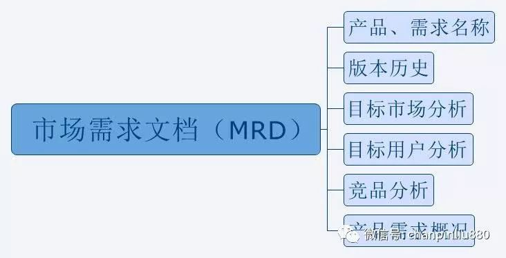
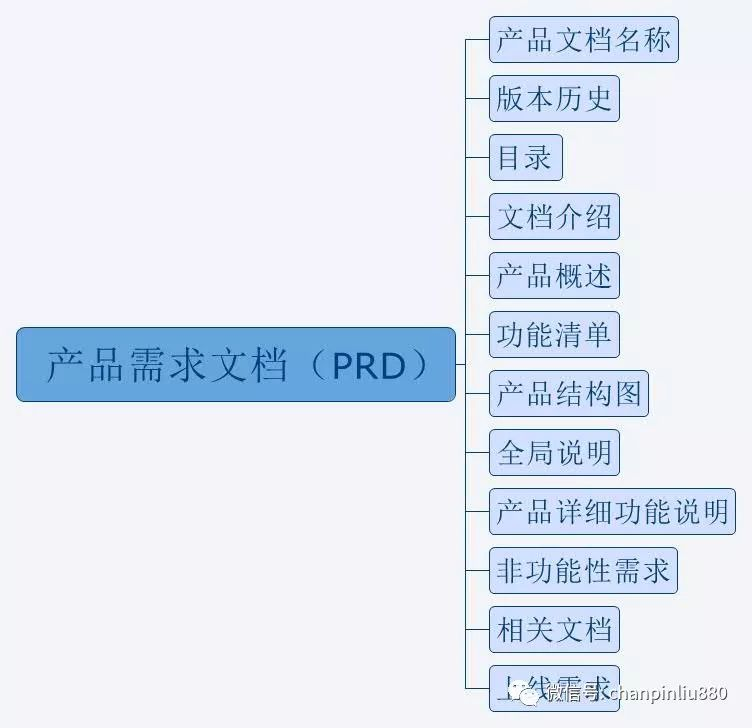
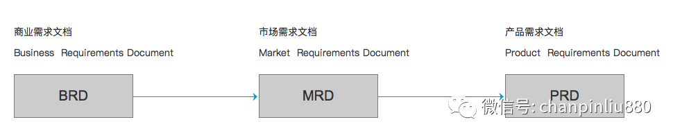

## 产品经理 - BRD、MRD 和 PRD 之间的区别与联系有哪些？  

### 作者
digoal

### 日期
2021-01-28 

### 标签
PostgreSQL , 产品经理 , BRD , MRD , PRD  

----

## 背景
原文  https://www.zhihu.com/question/19655491  
  
# 1  
BRD是在讨论现在做什么比较好，决定下来要不要做；  
MRD是现在市场上很多人都做它，我们要做出什么不同；  
PRD是既然决定做它了，应该做成什么样子；  
  
# 2  
BRD、MRD 和 PRD 之间的区别与联系有哪些？  
  
BRD 商业需求文档 Business Requirement Document  
MRD 市场需求文档 Market Requirement Document  
PRD 产品需求文档 Product Requirement Document  
  
好了，最好的记忆就一个单词 Business商业、Market市场、Product产品；那么这三个是什么关系呢？BRD是产品的head、MRD是产品的body、PRD是产品的Heart，有了Head、Body、Heart这就是一个完整的产品了！  
  
## 一、BRD是针对谁看的呢？一般都是针对老版或CEO或者项目总负责人，那么他们需要了解的是什么呢？  
  
### 1、要做什么样的产品；       
这就包含了项目定义，描述项目并且让老版感觉到产品的竞争优势；  
  
### 2、需要什么样的资源；       
要什么资源就必须知道产品的市场位置，通过多少人、多长时间、多少Money、多少关系等等能够实现这样的市场位置，并且还需要有利且有力的商业说明，需要有一定的高度！  
  
### 3、最终做成什么样；       
要怎么做或者说怎么安排，老板们很少关心，更多的是关心产品的结果展示及盈利，这个产品能带来什么样的收入情况；  
  
最终BRD就浓缩为 商业模式、盈利模式、资源投入、市场优势等；  
哦！对了！还有重要的一点就是“战略壁垒”，为什么呢？这一点主要是针对被Copy和产品包括来做的，这一点或许决定着整个产品的成败，但是如果说有些公司有特殊的资源那就另一码事！  
  
## 二、MRD是针对谁看的呢？一般都是商务、运营、市场人员，那么他们需要了解的是什么呢？整个文档对于他们的重要性？  
  
### 1、我们要找什么样的客户，进行资源合作       
一般公司资源合作的都是商务和市场人员，或者加上运营人员，那么他们是资源拓展者，对于产品保驾护航，正如船要出海，就必须有在海里或者有水的地方，海的大小决定了船的大小，所以他们就是船的载体，不可能产品开发完介入吧？要是真是这样，那就当这里我没有说！商务、市场及运营人员在产品之前必须对于产品进行资源拓展，且快速评估产品的实现情况，MRD就是给他们一个清楚的方向，我该找什么样的客户，在这里或许有的朋友就问题了?n你没有产品这些人员不可能空说吧，看到客户该怎们沟通，这一块就是项目与运营之间一种Demo沟通了，在这里暂时不说了！  
  
### 2、找到客户后，我们该怎么和他们说    
上面说了MRD指引着商务、市场和运营往前走，那么找到客户该怎么和他们说呢？除了文档描述一个清晰的蓝图，或者说从红海中挖出新的路子，这里边就是MRD中的业务模式了，通过业务模式，可以看到清晰的产品，且客户可以看到他们在中间的位置，甚至说他们怎么赢利；一般给客户看到的都是PPT+Demo的方式，这样对于客户更直观更易于理解，所以MRD的文档就是给团队和客户一个说明；  
  
### 3、产品针对什么样的用户群体      
商务是资源拓展的关键、市场是产品保障的关键、则运营就是产品的推手，那么市场和运营就需要了解产品是针对什么用户群体的，毕竟最终的是使用人群是用户，MRD基本需要明确产品的用户人群，这样市场才能更好的进行分析，通过分析这个人群，给运营提供很好的参考资料，这样运营在推广这部分人群的时候也能够制定出很好的方案，资源优化及减少资源消耗，这就是MRD对于商务、市场、运营的关键作用；  
  
最终MRD就浓缩为产品模式、业务模式、运营模式、市场模式等，明确客户及市场方向！  
  
## 三、PRD是针对谁看的呢？一般都是项目组、开发组、测试组、策划组、体验组人员；  
  
### 1、产品具体是什么样的呢？       
对于与产品相关的人员，就必须有一个清楚的产品概念，这个产品到底是干嘛的？插句话说，公司对于人员有一个硬管理文化，这就是公司的管理制度，而产品则是公司的软文化，让每一个参与产品的人都有一个“产品梦”，变成一群有产品信仰的人，无形中就会增加团队的战斗力。话扯回来了！要了解到底是什么产品，那就需要详细而简单的进行说明，但是这个只能是描述，还需要有与策划、开发、测试等另一种沟通语言，那就是UI、UE、原型图、流程图等，这样方便策划及开发人员的工作进展!  
  
### 2、我们该怎么实现呢？       
该怎么实现，那就是规划了，包括时间、人力、资源等，什么时间完成什么事了！在前进的路上设立一些里程碑！这就对于产品经理来说就是一个挑战了？为什么呢？因为产品经理与商务、市场、运营沟通的方式和开发人员方式不一样，有什么不一样呢？商务、市场、运营更多的是发散型思维，而开发则更多是紧密型思维，对于开发人员的沟通则不能用“基本”“差不多”“还好”等这样的词来进行沟通，否则开发人员会开始发散，如果发散的和你一致的话，你就烧高香吧，如果不一致，对于程序来说推导再来，就不是那么容易的了！甚至出现了大量的BUG，有时候过多的BUG会让一个产品死掉！       
  
所以就需要有详细的功能说明，细化到什么程度了，用YN原则来说明，VISIO是甚好的工具，不能出现模凌两可的语句，甚至需要通过语句进行if else描述，对了还有default，这个很关键，当程序运行正确了那固然好，如果程序出现BUG，则你不能让程序没有出口吧，那就是default了，给程序的BUG找一个合理的理由！  
  
### 3、什么样的产品才能投入到市场？       
产品开发人员更多的是站在产品角度思考问题，以实现产品而完成产品，那么产品最终开发完后，是不是能够满足运营需求呢？这时候产品经理就需要进行产品审核！怎么审核呢？简单的依据于之前的详细功能说明来进行需求审核，但是需求审核只是测试走完了第一步，第二步就是黑盒、白盒、甚至灰盒测试，走完第二部还有第三步，那就是需求优化，怎么优化呢，依据于市场人员及运营人员提供的用户数据来进行，再让产品设计人员进行UI优化，立足站在用户的角度；第三步完成了，就是最终的步骤了，体验师就起了关键性的作用，AB原则就出来了，将产品上线，体验师们就开始采集用户信息进行分析了，这个阶段对于产品的整个战略规划很关键，因为用户对于产品的第一感觉非常重要，如果是互联网产品则你可以换个网站，反正用户没法删除你的网站，但是对于移动互联网的产品APP来说，就是一个挑战了，看着不顺眼就直接给删除了，你说你的产品还有第二次机会进入用户的手机吗？除非你搞特殊！  
  
PRD最终浓缩下就是产品界面、产品流程、功能需求、测试需求、体验需求等，保证产品有效率有节奏的进行！关系到整个产品的发展方向！  
  
  
  
# 3  
## 定义  
1、BRD 是英文”Business Requirement Document“的缩写，根据英文直译过来就是”商业需求文档“的意思，指的就是基于商业目标或价值所描述的产品需求内容文档（报告），其核心的用途就是用于产品在投入研发之前，由企业高层作为决策评估的重要依据。一般来说全新的产品、未来发展有潜力的产品提供BRD！  
  
2、MRD 是英文”Market Requirements Document“的缩写，根据英文直译过来就是”市场需求文档“的意思，主要是描述什么样的功能和特点的产品（包含产品版本）可以在市场上取得成功。一般新功能的实现，上线新的产品提供MRD！  
  
3、PRD 是英文”Product Requirement Document“的缩写，根据英文直译过来就是”产品需求文档“的意思， PRD文档是产品项目由“概念化”阶段进入到“图纸化”阶段的最主要的一个文档，其作用就是“对MRD中的内容进行指标化和技术化”，这个文档的质量好坏直接影响产品能否顺利的实施完成。一般产品的功能改善、产品的细节说明提供PRD文档！  
  
## 不同点  
### 1、阅读对象的不同  
  
BRD主要给产品、运营、研发、财务、老板等管理层人看的，主要是决定是否要开始某个产品  
  
MRD主要是给产品、运营、研发等项目组人员看的，在大家一致认可需求成立的时候，来商量该怎么做，如何做，什么时间做。  
  
PRD主要是给项目经理、交互设计师、ui设计师、开发团队、测试工程师、运营等人员查看，是非常具体的产品设计方案，开发可以根据PRD获知整个产品的逻辑;测试可以根据PRD建用例;项目经理可以根据PRD拆分工作包，并分配开发人员;交互设计师可以通过PRD来设计交互细节。PRD是项目启动之前，必须要通过评审确定的最重要文档，prd决定了产品做成什么样子！  
  
BRD决定要不要做，MRD决定如何开始做，PRD是决定做成什么样。  
  
### 2、偏重的内容点不同  
#### 2\.1 BRD  
  
主要为了说服管理层给你的项目投资资源、人力、物力、所以写商业需求文档更像是写一个商业计划书，不同的是商业计划书是给资方看的，而你的商业需求文档是给你的管理层看的。  
  
具体的内容分为以下几个方面：  
  
  
  
- 产品介绍（用一句话来清晰的定义你的产品）  
- 产品的商业模式（如果你的项目值得做，那项目如何赚钱。可能是广告、可能是会员等级、可能是网上商城、可能是通过游戏...）  
- 产品市场分析（宏观的行业趋势、微观市场分析等等）  
- 竞争对手分析（竞争对手有那些，我们该如何和他们竞争）  
- 团队（我做这样一件事情需要那些开发人员，需要那些产品人员，需要那些设计人员、需要那些运营人员，这些人员的人力成本是多少，都需要列出来）  
- 产品路线图（产品路线图也叫做roadmap,版本规划是啥样的，每一个版本的大概功能模块有哪些，每个版本的时间安排是啥样的，当然不用那么细，对技术人员来说有个大概的了解就行）  
- 财务计划（收入的来源和渠道有那些，如何才能达到收支平衡，产品的收益增长率是怎样的）  
  
#### 2\.2 MRD  
  
MRD是给产品、运营、研发等项目组人员看的，主要解决如何开始做的问题，所以侧重点主要在以下几个方面：  
  
  
  
- 目标市场分析（包含目标市场、市场规模、市场特征、发展趋势等）  
- 目标用户分析（用户分析、用户画像、使用场景、用户动机总结）  
- 竞品分析（竞品分析对象、竞品商业模式、竞品目标用户、竞品运营/推广/营销策略、技术分析、竞品市场份额）  
- 产品需求概况（产品定位、产品核心目标、产品结构、产品路线图、产品功能性需求、非功能型需求）  
  
#### 2\.3 PRD  
  
PRD是非常具体的方案，涉及到交互、文案、逻辑规则等说明，主要给研发部门看的，用来体现功能和性能。  
  
侧重点主要在以下几个方面：  
  
  
  
- 文档产品名称  
- 版本历史  
- 目录  
- 文档介绍（主要介绍文档的目的、文档面向的主要用户，读者对象、参考文献、术语与缩写解释等）  
- 产品概述（从大的方向，讲讲项目的相关背景，有什么目标、有没有竞品对象？阶段性计划是什么，传递做这个需求的目的是什么？要达到什么样的目标？让项目开发人员对你的项目背景有了解，程序员知道的越多，做起项目来越有方向性。）  
- 产品需求（也就是功能清单，feature list）  
- 产品结构图（这个也称作脑图，用xmind或者mindmanger来画）  
- 全局功能说明（UI设计会出一个UI设计规范，当然我们做产品的也会对产品中经常用到的一些公共情况做一些说明，可以作为一个全局说明）  
- 产品详细功能说明（一般用用例表来进行说明，以登录注册模块为例，有流程图的话，先把任务流程图画出来，然后是用例表，用例表包含简要说明、行为者、前置条件、后置条件、功能说明、备注。功能说明一定要排版简洁、层次清晰，功能说明无遗漏）  
- 非功能性需求（非功能性需求主要包含性能需求、适配需求、环境需求、统计需求、预留接口等）  
- 相关文档（如果一个项目分解成多个团队，多个需求文档协同合作，比如数据埋点文档）  
- 上线需求（设计什么时候OK、什么时候测试，具体的上线时间，具体一些特殊的流程需求等）  
  
## 联系点  
  
  
  
BRD—MRD—PRD是一个从高到底的逐层递进的关系，  
- BRD从战略高度告诉我们做什么产品，  
- MRD从战术的角度告诉我们怎么做，  
- PRD非常细化的告诉我们做成什么样！  
- BRD决定了产品的商业价值  
- PRD决定了项目质量水平  
- MRD在中间起到一个承上启下的作用，质量好坏直接影响到产品项目的开展，并直接影响到公司产品战略意图的实现。  
- PRD、BRD和MRD，一起被认为是从市场到产品需要建立的文档规范。  
  
    
  
#### [PostgreSQL 许愿链接](https://github.com/digoal/blog/issues/76 "269ac3d1c492e938c0191101c7238216")
您的愿望将传达给PG kernel hacker、数据库厂商等, 帮助提高数据库产品质量和功能, 说不定下一个PG版本就有您提出的功能点. 针对非常好的提议，奖励限量版PG文化衫、纪念品、贴纸、PG热门书籍等，奖品丰富，快来许愿。[开不开森](https://github.com/digoal/blog/issues/76 "269ac3d1c492e938c0191101c7238216").  
  
  
#### [9.9元购买3个月阿里云RDS PostgreSQL实例](https://www.aliyun.com/database/postgresqlactivity "57258f76c37864c6e6d23383d05714ea")
  
  
#### [PostgreSQL 解决方案集合](https://yq.aliyun.com/topic/118 "40cff096e9ed7122c512b35d8561d9c8")
  
  
#### [德哥 / digoal's github - 公益是一辈子的事.](https://github.com/digoal/blog/blob/master/README.md "22709685feb7cab07d30f30387f0a9ae")
  
  

  
  
#### [PolarDB 学习图谱: 训练营、培训认证、在线互动实验、解决方案、生态合作、写心得拿奖品](https://www.aliyun.com/database/openpolardb/activity "8642f60e04ed0c814bf9cb9677976bd4")
  
  
#### [购买PolarDB云服务折扣活动进行中, 55元起](https://www.aliyun.com/activity/new/polardb-yunparter?userCode=bsb3t4al "e0495c413bedacabb75ff1e880be465a")
  
  
#### [About 德哥](https://github.com/digoal/blog/blob/master/me/readme.md "a37735981e7704886ffd590565582dd0")
  
