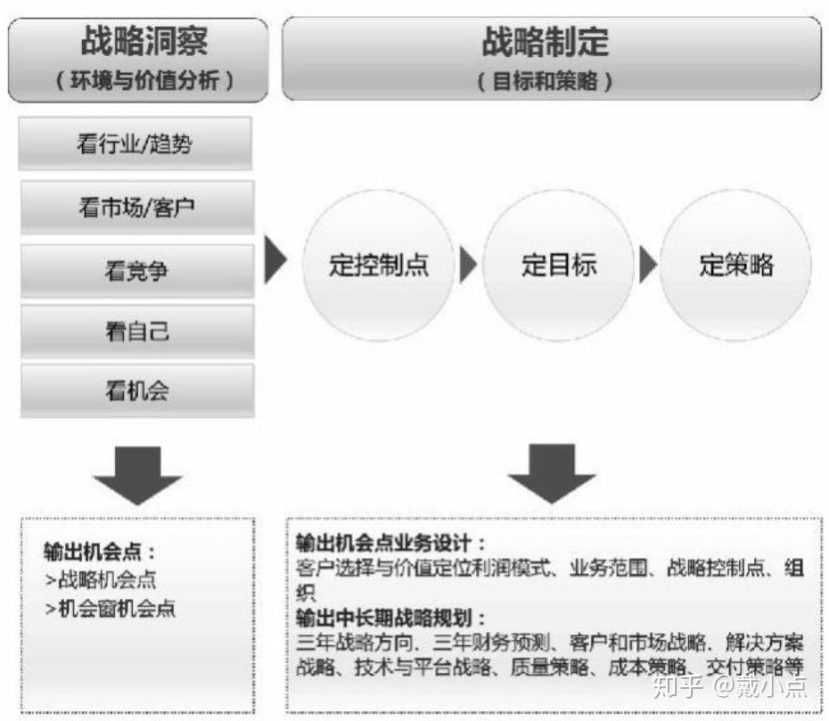
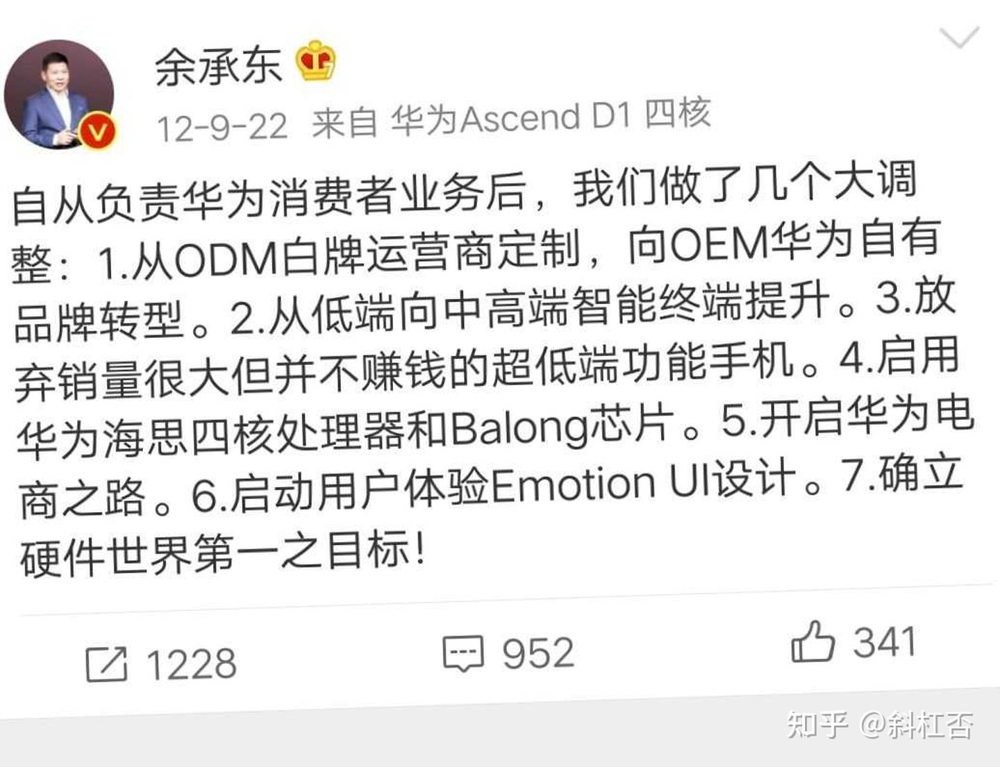
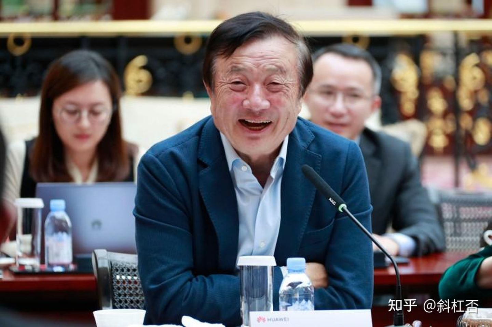
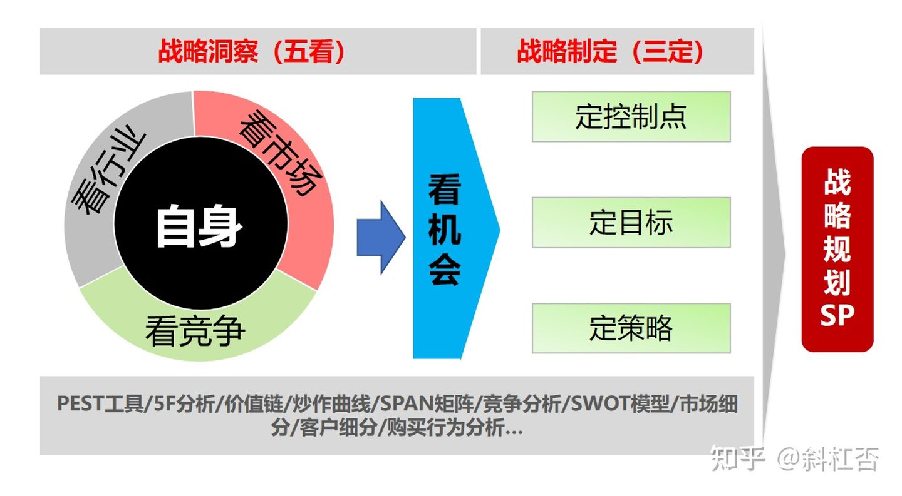
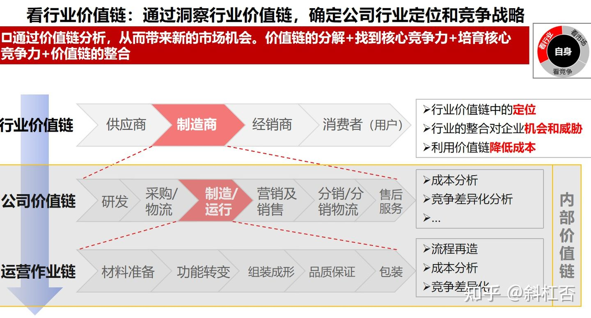
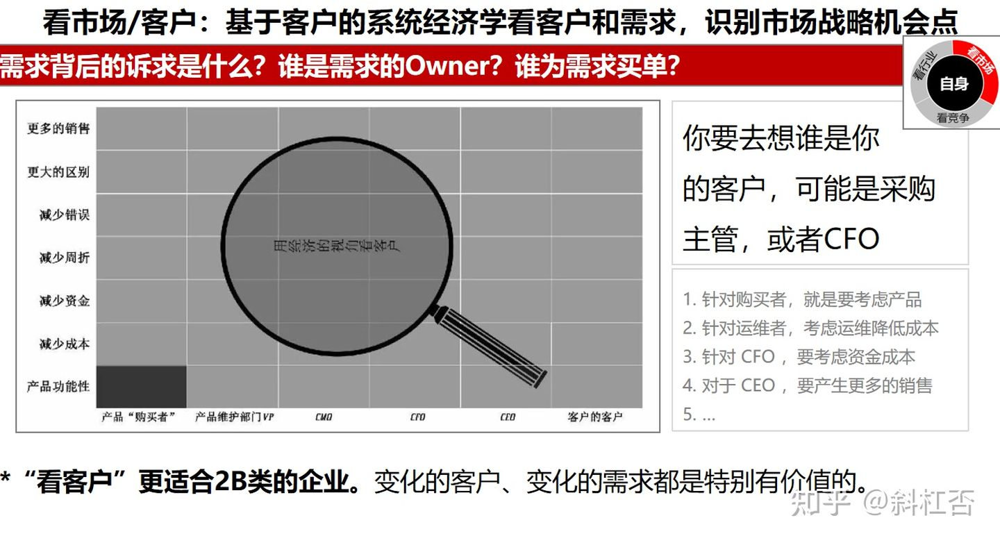
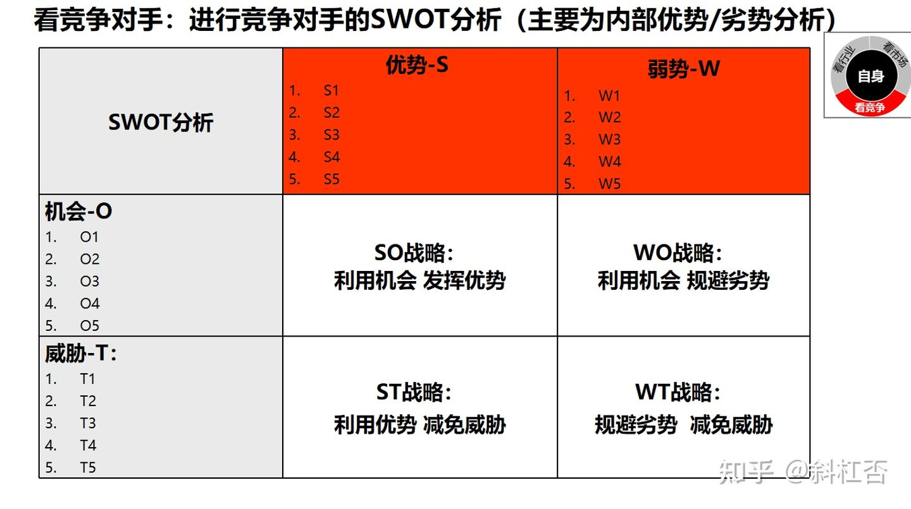
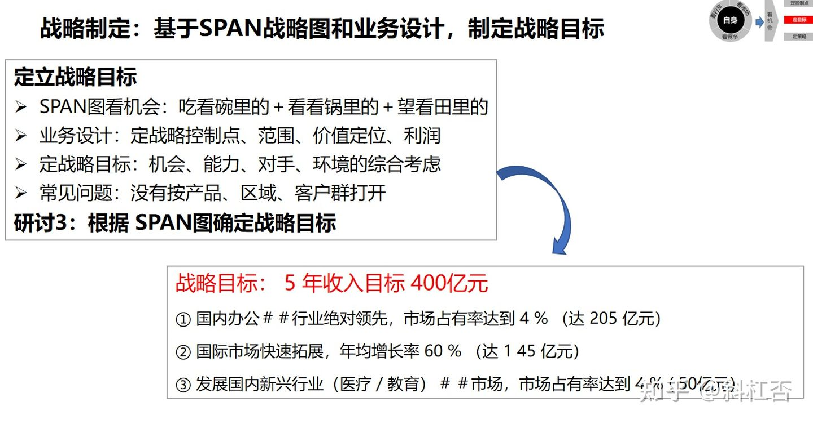

## 产品经理 - 以“五看三定”谈产品规划 - 含竞品分析方法     
  
### 作者  
digoal  
  
### 日期  
2021-01-28   
  
### 标签  
PostgreSQL , 产品经理 , 产品规划    
  
----  
  
## 背景  
## 原文  
https://zhuanlan.zhihu.com/p/104208246  
  
https://zhuanlan.zhihu.com/p/344106907  
    
# 1  
其实网上已经有非常多的战略规划框架，但大多是从市场营销角度切入，照搬到产品规划不一定适用。近期有幸学习了华为战略管理，其中“五看三定”是非常实用的战略业务规划工具，这里就照搬用来探讨产品规划了。  
  
    
  
  
## 看行业趋势  
首先是看所在行业未来1-3年的趋势，如市场规模、行业上下游分布、政策动向、社会舆情等。  
  
拿我所在的医美行业举例，近几年虽然医美市场整体增速放缓，但仍有每年20%以上的增长，直接赶超GDP。在大环境不景气的情况下，选择这样的行业就是顺势而为。  
  
在行业上下游分布中，医美市场营销仍是大头，总体占比高达30%-50%，其次是医疗器械与服务，约10%-15%。  
  
关于政策动向则是整体趋于规范化，政府管制更加严格，医疗机构终将面临优胜劣汰。  
  
社会舆情方面大家都有感受，医美整形不再是敏感话题，甚至会有明星公开谈论，另外轻医美与生美的界限越来越模糊，公众也越来越能够接受和尝试。  
  
## 看市场/客户  
市场信息通常是滞后的，各大数据平台出具的年度市场报告至少要到年中才可能看到。因此这块建议采取市场调研和用户访谈的方式收集一手信息。  
  
如果产品只面向一类用户，那么采取电话或面对面访谈即可。如果是平台型产品，则会面对不同角色的用户，建议对这些角色都进行深入沟通。  
  
比如说B2C平台型产品，你说我只负责2C的业务，B端我需要了解吗？当然需要！并且是重中之重。这是我们在B端调研中深刻体会到的，从B端能够了解到更宏观更全面的市场和用户信息。2019年5月新氧在纳斯达克上市，可能大家都觉得医美用户是不是集中到新氧那里去了，但调研一些医美机构就知道，美团的医美流量和ROI不知比新氧高多少！美团日均1200万生美活跃用户可向机构导流，而新氧的公开数据却只有月活用户192万，整体来看美团还有很多医美营销的机会待挖掘。  
  
## 看竞争  
市场竞争可以从几个方面来看，一是竞争数量（多/一般/少），二是竞争程度（混战/头部集中/无感），三是普遍技术水平（高/中/低），同时选择1到2个核心竞品进行具体分析，分析方法我之前写过，可通过用户体验要素的五层模型做竞品调研。  
  
### 嵌入文档1 /begin/  
[戴小点：以《用户体验要素》谈竞品调研](https://zhuanlan.zhihu.com/p/29215139)  
  
竞品调研是PM的必备技能之一，做好竞品调研能帮助我们发现自家产品的优劣点，了解市场情况，可以说是非常重要的日常工作了。  
  
最初我做竞品调研是从网络上挑一份模板，再按框架填充内容。对于产品新人来说，这种方式可以快速入门，有其可取之处。但时间一久，就有了一点个人经验，模板往往不能满足需要，可以考虑整理一套适合自己的方法体系了。  
  
《用户体验要素》（作者 Garrett.J.J）是一本不错的产品指导手册，曾帮助我梳理出完整的产品流程。从产品角度做竞品调研，书中理论同样适用，因此选择以此书来探讨竞品调研方法。文末会附上我个人总结的《用户体验要素》思维导图，另外本书某些概念不能只理解字面意思，如果感兴趣可以阅读原版（我没买到英文原版，阅读中文版时几次被翻译误导）。  
  
各行各业以及每个人的经验都不相同，考虑篇幅问题，这里主要从产品的角度讲方法以及延伸阅读，不便列举实例。  
  
  
  
#### 战略层  
  
一般讲用户体验，我们的第一反应是UED。而作者对用户体验的定义是“人们如何接触和使用产品”，这个定义包含了非常关键的商业本质。因此在用户体验五要素中，战略层放在了第一位。  
  
战略层关注的是产品目标和用户需求。分析竞品时，首先弄清楚他们的目标和用户，从而明确其市场定位。分析市场定位的敌我差异，将直接决定后续产品打法。  
  
产品目标通常可以从官宣信息（官网/应用商店介绍/公关稿）获取和研究，也可以从商业模式的角度来分析。  
  
分析用户需求则需要先从用户画像、用户故事着手，这需要一些数据辅助分析。官宣（数据一般有夸大）、百度指数、站长工具、艾瑞网等都是获取数据的便捷渠道，具体分析方法则可以参考《用户故事与敏捷开发》前4章。  
  
#### 范围层  
  
再强大的竞品，也有自身的局限性（资金/技术/政策等等），种种局限决定了竞品在范围层如何划定功能需求。在梳理竞品的功能需求时，应避免简单的罗列功能清单和信息，分析背后的原因更为重要。建议多关注竞品能做什么，不能做什么，找到其优势和弱点。  
  
#### 结构层  
  
结构层是指产品的概念模型或信息架构，体现了产品如何引导以及响应用户。关于产品设计的“概念模型”推荐阅读《设计心理学》（作者Donald Norman）。对偏向于交互设计的PM来说，可以多放一些精力在竞品的结构层分析上，推荐网易UEDC分享的竞品分析相关文章，大多都是从交互设计的角度来做竞品分析的。  
  
#### 框架层  
  
按我个人理解，结构层和框架层的界线其实是比较模糊的。如果一定要区分，框架层应该是结构层的子系统，是结构层的具体解决方案和细节。做竞品调研的时候，不需要在框架层面面俱到，关注主流程或核心功能即可。  
  
#### 表现层  
  
表现层很好理解，就是我们常说的视觉设计。视觉设计常常由UI设计师的意志决定，但PM必须有一定的把控意识。研究竞品的视觉设计，重点应放在背后的引导逻辑。  
  
今天只讲产品角度的竞品调研，还是稍显局限。建议PM除了关注用户和交互，更多的将眼光放在竞品的商业模式、市场和业务上。  
  
最后再多说一句，调研是指“调查”和“研究”。新手往往只会搜集和罗列，并没有分析和结论，这样的调研只能算是做到30%而已。一定要尽量搜集客观信息和数据来佐证，将合理的结论建立在事实之上。  
  
附《用户体验要素》思维导图（原创内容，如需转载请与我私信联系）  
  
  
  
### 嵌入文档1 /end/  
  
需要注意的是，某些行业一定也要关注传统模式和异业竞争。  
  
身处互联网的我们常瞧不起一些线下和传统行业的竞争，其实人家都在闷声发大财，我们想到的很多idea都是别人玩剩下的，因此也建议多多关注这些“同行”。  
  
另外就是异业竞争，泡面被外卖干死的梗不知是否有因果关系，但在医美行业，整形医院、美容院和美妆确实存在互相抢夺用户的情况。  
  
## 看自己  
对外既要看到自己的优势和能够秒杀对手的亮点，也要看到自己的不足。对内既要看产品在公司的定位和投入，也要看能够赚取什么样的回报。  
  
最早做医美分销我就问老板，医美分销是咱们开放平台的战略部署还是仅为用户增长的营销手段？虽然老板没有当场下结论，但我们还是冲着战略目标去做规划，公司也愿意投入资源，且只要求规模不要求利润，最终我们有幸做成了开放平台，而不仅仅是一个营销工具。  
  
## 看机会  
市场时刻在变化，没有什么格局是永恒的，行业老大不会一直坐在老大的位置，曹大的公众号推文《曾经的中国互联网》就很好的说明了这个问题。  
  
[曾经的中国互联网](https://mp.weixin.qq.com/s/ymorlzPLiJtRSBy1nXtEFQ)  
    
### 嵌入文档2 /begin/  
以史为镜，可以知兴替。中国互联网，沧海桑田。  
  
今天写个简单的，首发于知乎，这里增补了一些。  
  
1、最早在美国上市的中国互联网公司是中华网，域名牛逼，中国概念，一度股价爆高到100多美元，后来一路跌到地板，然后退市，现在，谁还记得呢。  
  
2、曾经联想搞了一个fm365.com，联想的互联网战略，非常非常早的事情，随着联想电脑预装铺开，一度号称是国内门户前几名，然后呢？后来一度域名都丢了，然后也没有然后了。  
  
3、我们知道现在最大的文学站是起点文学，最大的下载一个是华军软件，一个是百度收购天空下载。但曾经最大的文学站黄金书屋，最大的下载站是海阔天空，然而这些网站都被一个叫多来米的公司用很低的价格收购了，那时候个人站不值钱啊，然后呢，多来米收了一堆当时最好的个人站，结果全做死了。  
  
4、最早的电子商务网站，8848.com，曾经是中国电子商务网站头牌，在上市关键时刻的临门一脚，没有成功，然后，每况愈下。  
  
5、世界互联网巨头收购中国互联网领先者，听上去好像是一个不错的强强联手，两个案例，ebay收购了当时的领先者易趣，彼时易趣在中国电商市场份额超过80%，然后被新成立的淘宝打的丢盔卸甲。 雅虎收购了3721，当时3721的收入规模和终端覆盖率均力压百度，然后就眼看着百度神话诞生了。  
  
6、第一只A股上的互联网概念股叫做海虹控股，当时他们控股了中国最大的，完全独孤求败的棋牌游戏平台，联众游戏。 然后慢慢的联众就废掉了，一步步落后于时代。 今天我们不要说腾讯了，说波克城市这样的棋牌平台，收入我估计都比联众高不少。  
  
7、曾经最大的下载工具叫做网络蚂蚁。  
  
8、互联网泡沫破裂的时候，网易是三大门户里最脆弱的，一度股价掉到1块钱以内，丁磊炒掉了他聘用的CEO，财务出现丑闻，媒体天天给网易做退市的倒计时，大家都在幸灾乐祸，然而今天我们看，三大门户里网易转身最快，新业务拓展最成功，现在游戏市场，腾讯拿他也没办法。  
  
9、南非电讯投资腾讯的时候，所有媒体人都觉得南非人SB，被马化腾骗了，说马化腾的估值方式完全是蒙人的，oicq用户（当时不叫QQ）都是低龄低层次用户，没有消费能力。 现在作为腾讯股东的价值和回报是南非电讯集团当前市值最大的支撑，超过其本身自营业务。。  
  
10、曾经大家都认为中国互联网大局已定，新浪搜狐的霸主地位无可动摇，今天回头看，呵呵。  
  
11、百度和新浪曾经撕逼过，百度那时候还是技术服务商，新浪的搜索是百度提供技术支持的，然后，新浪拖欠了百度的技术服务费，李彦宏一怒之下停了新浪的搜索接口，媒体都认为百度疯了，互联网霸主新浪分分钟捏死百度，这也是李彦宏摔电话决心自己做用户的主要原因之一。  
  
12、曾经有一种期盼，说中国互联网啥时候能出市值超过十亿美元的巨头啊，呵呵。  
  
13、百度上市的时候市值破百亿美元，市盈率过千，当时基本上国内所有分析师都说百度被严重高估了。  
  
14、中国做游戏是不可能赚钱的，中国人没有人会为游戏付费，这是在2002年之前行业的共识，当时说的游戏主要是pc游戏，台湾和日本的游戏在大陆都很流行，直到盛大突然崛起，一切都变了。  
  
15、群聊功能最早是朗玛uc推出的，市场反馈极好，当时用户发展极快，新浪见状立刻收购。那时候腾讯想做用户变现，取消了电脑注册QQ的功能，只允许手机短信验证码注册，一个注册收一块钱，结果看到朗玛uc有取代之势，立即恢复免费注册，同时推出QQ群，然后新浪这次投资基本就失败了。  
  
16、百度推出过一个百度hi的聊天工具，还有一个百度有啊的电商平台，不过今天大部分年轻人都没听说过。 我的头像来源于是百度hi当时的气泡熊表情包，我觉得百度hi最有价值的成果就是气泡熊表情做的确实不错。  
  
17、网景浏览器曾经被认为是一种革命，市场占有率一度在80%以上，当时网景的野心很大，想用浏览器做网络终端操作系统，市场也极为认可，股价和市值扶摇直上，很多投资者都认为网景可能是互联网时代的微软，然后微软内置了浏览器，网景告微软垄断，官司一直打，微软浏览器市场份额一直上升，然后，官司没打完，网景完了。 但有意思的是，现在，国内有360浏览器，国外的火狐，google的chrome浏览器，市场占有率都不低；为什么当时网景模式没成功，而现在第三方浏览器又都冒出来了，所以，归咎于微软垄断和捆绑，不如多思考自己的问题。   
  
我给一个答案，网景的思路是互联网上的软件公司，而如今第三方浏览器完全是走互联网模式，做软件公司，被微软掐死是分分钟的事情。  
  
18、2000年左右微软推搜索引擎，当时还不是bing，是MSN搜索，国内分析师近乎一致认为google要完，大家都觉得微软的技术能力很强，有钱，有资源，又能铺终端，但当时俞军老师坚持认为微软根本不懂搜索，不会冲击google，我特意翻过旧帖，从此转为俞军脑残粉。  
  
19、吴京川老师十几年前给我讲搜索套利模式的时候，我完全没听懂，几年后我看一些新闻案例突然明白了，然后感慨市场时机过去了，直到最近我才知道，其实市场时机一直都在，只是进入门槛越来越高而已，意识到自己简直蠢的不可救药。  
  
20、地方电信的门户网站和其附属的一些资源，社区曾经一度占据互联网流量的半壁江山，比较有名的包括上海热线，贵州信息港，碧海银沙等等。  
  
21、网易最早就是个个人站，丁磊是中国最大的个人站长，当时丁磊要搞免费邮局，去广州电信谈合作，说不要电信出一分钱共同搭建一个邮局平台，只要电信出带宽资源。（当时流量带宽老贵老贵的，但对于电信来说成本极低），合作，然后未来广告收入大家分啥的巴拉巴拉。 当时的局长张静君一听，没听懂，但是禁不住她琢磨，不要出钱还能分钱，有这么好的事情？这里肯定藏着很大的利益，这好事不能让丁磊占了，这样，我直接买你们系统。 于是就有了163.net免费邮局，国内第一个免费邮局，用户量果然激增，因为没有其他家啊，然而做了很久，也没赚到钱，后来这个邮局被卖掉了还涉及国有资产流失啥的，张静君后来出去创业，一度被认为是互联网大佬，继续呵呵吧。 当然，丁磊也够坏的，卖了163.net给电信，自己掖着163.com。  
  
22、腾讯最早域名是tencent.com，百度 cdn 长期有个跳转域名叫做shifen.com  大家都是1毛， 这事哪说理去。 美国的巨头叫做微软，中国的巨头叫做1毛。    
  
23、李彦宏，周鸿祎，马化腾，雷军，丁磊，史玉柱，最早都是程序员，而且都还是水平相当不错的程序员，当然更不用说张志东这样的了。其实这个名单可以拉很长，很多名气没那么大的上市公司老板其实也做过程序员，比如携程老板梁建章等等。  
  
24、个人网站  
南杨北高曾经是个人网站最早的传奇，高春辉的个人主页曾经是国内网站综合排名前十，汽车销售员出身的第一代站长杨震霆目前已经移民加拿大，当地华人没有几个知道他曾经辉煌的历史；而高春辉依然在连续创业，中国互联网草根创业者的活化石。 可能很少人知道，卓越网的第一任老板是高春辉，而那时候卓越网，是一个下载站。  
  
躲在梅州几乎从不出远门，从不接受采访以及从不参加各种峰会（实际上，只参加过一次）的中专生李兴平  创造了草根网站最大的奇迹，他依靠本地的几个人的小团队，先后创建过三个曾经位居国内访问量前20的网站，hao123, qq163 和 4399。而其他诸如3533，ip138，oicq88等一堆网站也都各个流量不菲，最疯狂的时候，一个音乐个人站长，和李兴平私交不错，就能轻松从他那里获得每天十几万到几十万的访问来路。  
  
当然，今天，个人站长的时代过去了。  
  
25、关于拥抱变化  
  
- 百度最早是给门户做搜索技术服务商，没打算自己做流量入口；  
- 腾讯最早想给电信做网络寻呼系统，没打算自己做用户，当时想发展点用户做样本测试系统；结果电信不鸟他，幸亏电信不鸟他。  
- 阿里最开始做企业黄页；  
- 盛大最开始做社区，失败了后用最后剩下的钱代理了传奇，当时大家都觉得中国游戏没市场，所以代理金极低；  
- 京东最开始中关村摆摊的不解释；  
- 唯品会开始搞奢侈品赔的一塌糊涂，转入二线品牌开始翻身；  
- 聚美优品陈欧第一次创业是做游戏广告平台，然后转型卖了化妆品；  
- 奇虎最开始做社区搜索，恶心阿里搞了360去弄死3721，没想到无心栽柳；  
- 新浪最开始是四通利方论坛，收了海外一个华人门户后转型做门户，然后靠微博翻身；  
- 网易从虚拟社区到邮局到门户到移动SP到游戏；  
- 搜狐从门户到游戏；  
- 现在你告诉我你看准了一个大方向保证未来很有前途？？  
  
你可以当八卦看，也可以多想想，沧海桑田的背后，为什么。然后想想，未来会怎样？我们是不是还会看走眼，选错路？  
  
### 嵌入文档2 /end/  
  
所以我们不用焦虑地观察短期内的市场情况，从前面的行业趋势、市场/客户、竞争对手等分析里面可以找到一些新的机会点。  
  
比如行业技术更新，新的医疗器械使非手术项目也能达到手术效果且价格更低；比如用户迁移，机构获客渠道从百度搜索转移到新氧美团；比如竞争对手布局，尝试打通医美和生美的用户通道。这里面我们可以挖掘的机会还很多。  
  
## 定控制点/定目标/定策略  
定控制点：拆解业务的关键因素，找到自己的核心优势，建立护城河。护城河可能是原有优势的提升，也可能是业务创新，护城河越宽，抵御市场竞争和风险的能力就越强。  
  
定目标：制定可量化的目标，根据关键因素拆解核心指标，如用户量、转化率或收入等，以及目标达成的时间节点。  
  
定策略：制定具体的方案和阶段里程碑，体现业务和产品的走向，明确不同时期的侧重点和阶段性目标。  
  
其实五看三定之后还有一个四轮驱动，整个分析下来就是一份完整的商业计划书，但个人认为用在产品规划上有点复杂，因此建议在五看三定之后再考虑人员预算及风险控制就足够啦~  
  
# 2  
华为公司战略规划和落地方法之“五看三定”工具解  
  
https://zhuanlan.zhihu.com/p/344106907  
  
导读：华为公司战略到执行过程中有许多的模型和方法，无论是DSTE，还是BLM、BEM，背后都有具体的工具和方法在支撑，其中“五看三定”就是战略制定的时候经常使用的方法之一。五看三定的内涵是什么，每个步骤又有哪些具体的工具和方法在支撑呢？我们一起来看看吧！  
  
很多人谈到华为都很羡慕，太厉害了！不但人员数量多（近20万人），而且素质高（近半数是研发、技术人员，名校毕业生占多数），更厉害的是，还能够力出一孔（主要是利出一孔，高度激励导向奋斗者和冲锋文化）。所以华为能够在战略上高举高打，指哪打哪，吹过的牛都能实现。  
  
  
  
其实这些的背后都是有整套的管理体系支撑，任正非在几年前和陈春花教授“围炉日话”的时候谈到，华为公司的成功主要是人力资源管理的成功——这话说的没问题，任何公司的成功归根结底一定是人力资源管理的成功（此处敲黑板：不是人力资源管理部门的成功，人力资源管理的第一责任人是老板和各级管理干部，即业务部门经理）。因为所有的战略、公司目标、经营举措、行动计划都是靠人去执行的。  
  
  
任总：我厉害吧！总是能洞悉真相  
嗨嗨，扯得有点远了，跑题了。  
  
赶紧回到正题，这几天的分享都是关于华为的战略，从规划到执行，从DSTE、BLM到BEM，有同学在和斜杠否沟通的时候提到能否详细谈一下华为的战略管理工具——五看三定。所以今天来给大家就五看三定这个方法谈一谈。正好斜杠否所在的组织在战略规划和制定的时候一直坚持在使用五看时三定。  
  
## 一、五看三定是什么  
  
华为公司的战略管理框架（五看三定模型）是一套非常系统的思考方法，对企业战略的制定具有重大的价值。该模型属于SOPK体系，常被用来服务于组织战略、目标计划、产品规划和解决方案。  
  
SOPK体系是公司战略规划到战略执行的综合管理体系，即从 战略-目标-计划-KPI 层层分解的体系，包含：公司战略（Strategy）、目标（Objective）、策略与计划（Plot & Plan）以及KPI（Key Performance Indicator）四大部分内容。是全方位、全流程的战略管理体系，涉及从战略制定、战略解码、目标澄清、策略推演、路径选择到战略执行跟踪及反馈，可以指导公司各级员工系统的、科学的开展战略制定及战略执行工作，并有效促进各级员工达成思想上的共通以及行动上的一致，通过SOPK体系如何实现战略到执行的全面拉通。  
  
## 二、五看三定的主要内容  
  
五看三定是八个短语的缩写，五看三定具体指的是什么呢？下面一张图片全部告诉你！谁能不往下看就从下图中找出五看三定具体指什么，欢迎评论，看哪位同学找得又快又早准：-)  
  
  
五看三定的简要内容释义如下：  
  
### （一）五看指的是：  
  
1）看行业（对行业与趋势的洞察）：从宏观的角度，包括怎么看待国家层面的政治、经济、文化、社会等等方面的变化与发展趋势，这些趋势将会为行业带来什么样的影响与变化？整个产业未来的技术发展趋势是怎样的？会发生哪些变化？  
  
2）看市场（对市场和客户的洞察）：我们的客户是谁？客户买什么？需求是什么？我们的客户在未来五年的发展战略方向是什么，在它的发展战略当中存在哪些痛点等等，这需要深入了解研究，会发现很多战略机会点。  
  
3）看竞争（对竞争对手的洞察）：所谓知己知彼，百战不殆。在未来，我们的竞争对手会有什么样的发展战略？它的定位是什么？一个竞争对手真正的强大，不仅仅是产品强大，产品强大仅仅是结果，还有很多影响的因素。  
  
4）看自身（对自身的洞察）：建立在对客户与竞争对手的洞察之上，更好地发掘自身的优势与弥补内在的不足，做到有所为有所不为。通过SWOT分析模型，可以明确我们的挑战与机遇在哪里。  
  
5）看机会（对机会的洞察）：未来，我们在客户领域有什么样的投资机会？对我们来说，它的市场空间有多大？如果前面四点都很好，但就是没有市场，不赚钱，那就果断放弃，等时机成熟了再说。  
  
### （二）三定指的是：  
  
1）定战略控制点：战略控制点可以简单的理解成一种不易构建，但也不易被模仿、不易被超越的中长期的竞争力，有的叫做“卡位”，你设定一定的门槛，让别人进不来。战略控制的有不同的层级。最简单的战略控制点叫做"10-20%的成本优势"，往上是功能、性能、品质的领先、技术领先一年、品牌、客户关系、绝对的市场份额、价值链的控制等，最高级别的战略控制点是拥有标准或者拥有专利组合。  
  
2）定目标：企业经营的全方位的目标，不只是销售、订单的目标，还要包括研发、生产、供应链、内部管理的目标，通过BSC进行分解。  
  
3）定策略：当定位和路线清晰了，策略就是要解决战术的问题。各种策略形成一个系统，形成一个走向胜利的系统，就能实现用过程的规范性保证结果的确定性。  
  
## 三、五看三定的核心工具和方法示例  
  
五看是由外及内、由表及里，层层抽丝剥茧的开展，能够确保战略制定的时候考虑周全，战略执行的时候能够全力以赴。这八步的每一步都有具体的、多个实用的工具和方法。限于篇幅，摘录几个示例如下，供大家学习和思考：  
  
  
  
  
  
  
  
  
限于篇幅，全部内容未一一展开，如果你感兴趣，欢迎留言、评论或者私信我一个e-mail地址 获取完整版，也可以在后台回复 华为 了解更多！  
  
欢迎关注、查阅斜杠否的往期文章，了解更多标杆企业经营管理实践的理念、方法和工具。  
  
斜杠否——帮助组织和个人成就卓越。  
  
    
## 其他
行业分析、客户分析要数字化（定量、定性）
全流程考虑：人、货、场
MRD要明确问题，以及给出解决方向、切入思路
要明确投入、预期收益、获客成本、客户贡献、回本周期、给出ROI
  
#### [PostgreSQL 许愿链接](https://github.com/digoal/blog/issues/76 "269ac3d1c492e938c0191101c7238216")
您的愿望将传达给PG kernel hacker、数据库厂商等, 帮助提高数据库产品质量和功能, 说不定下一个PG版本就有您提出的功能点. 针对非常好的提议，奖励限量版PG文化衫、纪念品、贴纸、PG热门书籍等，奖品丰富，快来许愿。[开不开森](https://github.com/digoal/blog/issues/76 "269ac3d1c492e938c0191101c7238216").  
  
  
#### [9.9元购买3个月阿里云RDS PostgreSQL实例](https://www.aliyun.com/database/postgresqlactivity "57258f76c37864c6e6d23383d05714ea")
  
  
#### [PostgreSQL 解决方案集合](https://yq.aliyun.com/topic/118 "40cff096e9ed7122c512b35d8561d9c8")
  
  
#### [德哥 / digoal's github - 公益是一辈子的事.](https://github.com/digoal/blog/blob/master/README.md "22709685feb7cab07d30f30387f0a9ae")
  
  

  
  
#### [PolarDB 学习图谱: 训练营、培训认证、在线互动实验、解决方案、生态合作、写心得拿奖品](https://www.aliyun.com/database/openpolardb/activity "8642f60e04ed0c814bf9cb9677976bd4")
  
  
#### [购买PolarDB云服务折扣活动进行中, 55元起](https://www.aliyun.com/activity/new/polardb-yunparter?userCode=bsb3t4al "e0495c413bedacabb75ff1e880be465a")
  
  
#### [About 德哥](https://github.com/digoal/blog/blob/master/me/readme.md "a37735981e7704886ffd590565582dd0")
  
