## 10分钟看懂Docker和K8S   
    
### 作者    
digoal    
    
### 日期    
2021-01-28     
    
### 标签    
PostgreSQL , k8s , docker   
    
----    
    
## 背景    
## 原文    
https://zhuanlan.zhihu.com/p/53260098  
    
- Docker , 容器|沙箱.  
- K8S , 管理容器的资源编排平台.  
    
2010年，几个搞IT的年轻人，在美国旧金山成立了一家名叫“dotCloud”的公司。  
  
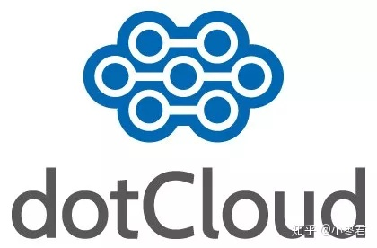  
  
这家公司主要提供基于PaaS的云计算技术服务。具体来说，是和LXC有关的容器技术。  
  
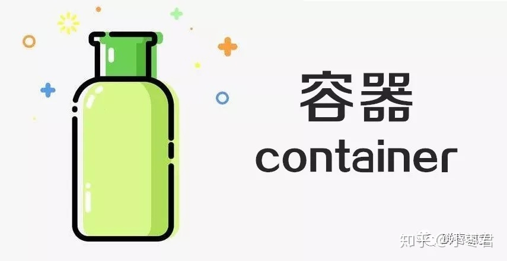  
  
LXC，就是Linux容器虚拟技术（Linux container）  
  
  
后来，dotCloud公司将自己的容器技术进行了简化和标准化，并命名为——Docker。  
  
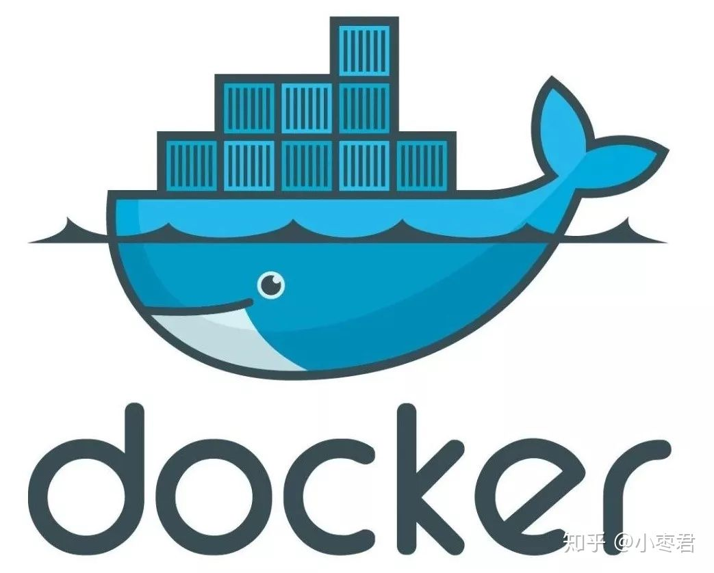  
  
  
Docker技术诞生之后，并没有引起行业的关注。而dotCloud公司，作为一家小型创业企业，在激烈的竞争之下，也步履维艰。  
  
  
正当他们快要坚持不下去的时候，脑子里蹦出了“开源”的想法。  
  
  
什么是“开源”？开源，就是开放源代码。也就是将原来内部保密的程序源代码开放给所有人，然后让大家一起参与进来，贡献代码和意见。  
  
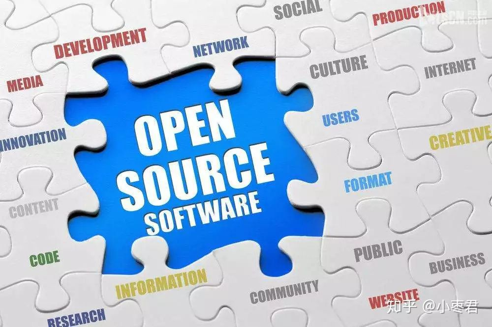  
  
Open Source，开源  
  
  
有的软件是一开始就开源的。也有的软件，是混不下去，创造者又不想放弃，所以选择开源。自己养不活，就吃“百家饭”嘛。  
  
  
2013年3月，dotCloud公司的创始人之一，Docker之父，28岁的Solomon Hykes正式决定，将Docker项目开源。  
  
  
  
  
  
Solomon Hykes（今年刚从Docker离职）  
  
不开则已，一开惊人。  
  
越来越多的IT工程师发现了Docker的优点，然后蜂拥而至，加入Docker开源社区。  
  
Docker的人气迅速攀升，速度之快，令人瞠目结舌。  
  
开源当月，Docker 0.1 版本发布。此后的每一个月，Docker都会发布一个版本。到2014年6月9日，Docker 1.0 版本正式发布。  
  
此时的Docker，已经成为行业里人气最火爆的开源技术，没有之一。甚至像Google、微软、Amazon、VMware这样的巨头，都对它青睐有加，表示将全力支持。  
  
Docker火了之后，dotCloud公司干脆把公司名字也改成了Docker Inc. 。  
  
Docker和容器技术为什么会这么火爆？说白了，就是因为它“轻”。  
  
在容器技术之前，业界的网红是虚拟机。虚拟机技术的代表，是VMWare和OpenStack。  
  
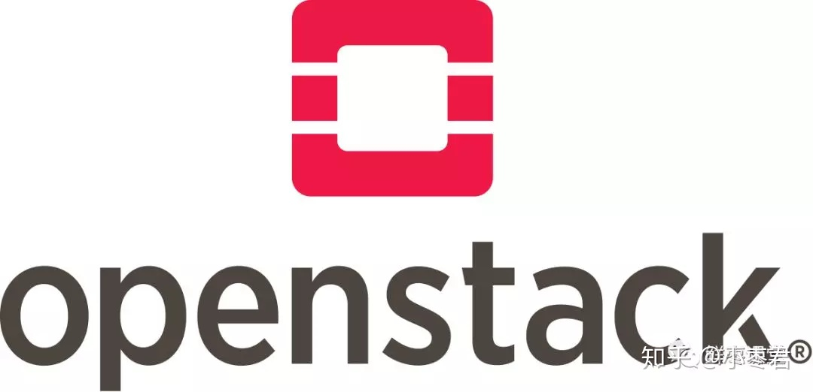  
  
相信很多人都用过虚拟机。虚拟机，就是在你的操作系统里面，装一个软件，然后通过这个软件，再模拟一台甚至多台“子电脑”出来。  
  
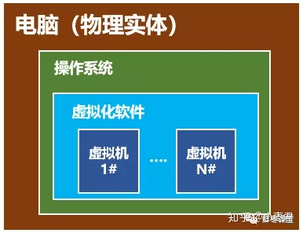  
  
虚拟机，类似于“子电脑”  
  
在“子电脑”里，你可以和正常电脑一样运行程序，例如开QQ。如果你愿意，你可以变出好几个“子电脑”，里面都开上QQ。“子电脑”和“子电脑”之间，是相互隔离的，互不影响。  
  
虚拟机属于虚拟化技术。而Docker这样的容器技术，也是虚拟化技术，属于轻量级的虚拟化。  
  
虚拟机虽然可以隔离出很多“子电脑”，但占用空间更大，启动更慢，虚拟机软件可能还要花钱（例如VMWare）。  
  
而容器技术恰好没有这些缺点。它不需要虚拟出整个操作系统，只需要虚拟一个小规模的环境（类似“沙箱”）。  
  
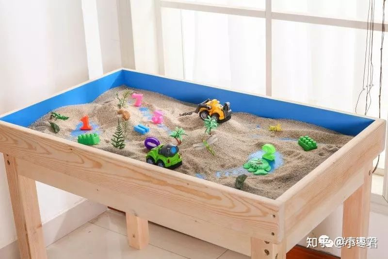  
  
沙箱  
  
它启动时间很快，几秒钟就能完成。而且，它对资源的利用率很高（一台主机可以同时运行几千个Docker容器）。此外，它占的空间很小，虚拟机一般要几GB到几十GB的空间，而容器只需要MB级甚至KB级。  
  
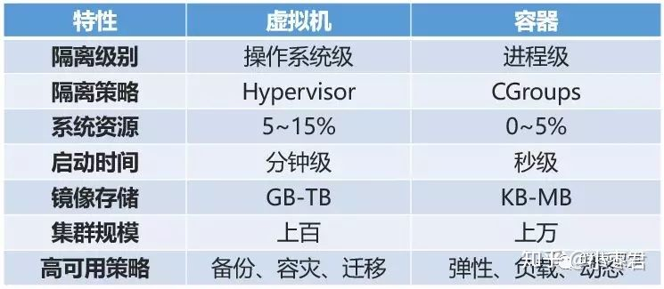  
  
容器和虚拟机的对比  
  
正因为如此，容器技术受到了热烈的欢迎和追捧，发展迅速。  
  
我们具体来看看Docker。  
  
大家需要注意，Docker本身并不是容器，它是创建容器的工具，是应用容器引擎。  
  
想要搞懂Docker，其实看它的两句口号就行。  
  
第一句，是“Build, Ship and Run”。  
  
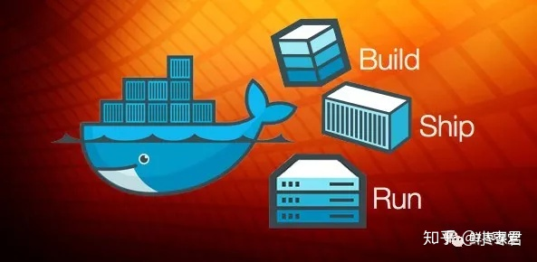  
  
也就是，“搭建、发送、运行”，三板斧。  
  
举个例子：  
  
我来到一片空地，想建个房子，于是我搬石头、砍木头、画图纸，一顿操作，终于把这个房子盖好了。  
  
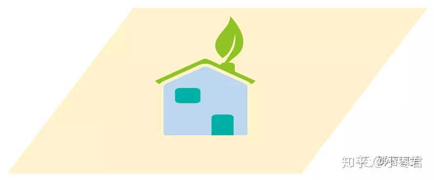  
  
结果，我住了一段时间，想搬到另一片空地去。这时候，按以往的办法，我只能再次搬石头、砍木头、画图纸、盖房子。  
  
但是，跑来一个老巫婆，教会我一种魔法。  
  
这种魔法，可以把我盖好的房子复制一份，做成“镜像”，放在我的背包里。  
  
  
  
等我到了另一片空地，就用这个“镜像”，复制一套房子，摆在那边，拎包入住。  
  
  
  
怎么样？是不是很神奇？  
  
所以，Docker的第二句口号就是：“Build once，Run anywhere（搭建一次，到处能用）”。  
  
Docker技术的三大核心概念，分别是：  
  
- 镜像（Image）  
- 容器（Container）  
- 仓库（Repository）  
  
我刚才例子里面，那个放在包里的“镜像”，就是Docker镜像。而我的背包，就是Docker仓库。我在空地上，用魔法造好的房子，就是一个Docker容器。  
  
说白了，这个Docker镜像，是一个特殊的文件系统。它除了提供容器运行时所需的程序、库、资源、配置等文件外，还包含了一些为运行时准备的一些配置参数（例如环境变量）。镜像不包含任何动态数据，其内容在构建之后也不会被改变。  
  
也就是说，每次变出房子，房子是一样的，但生活用品之类的，都是不管的。谁住谁负责添置。  
  
每一个镜像可以变出一种房子。那么，我可以有多个镜像呀！  
  
也就是说，我盖了一个欧式别墅，生成了镜像。另一个哥们可能盖了一个中国四合院，也生成了镜像。还有哥们，盖了一个非洲茅草屋，也生成了镜像。。。  
  
这么一来，我们可以交换镜像，你用我的，我用你的，岂不是很爽？  
  
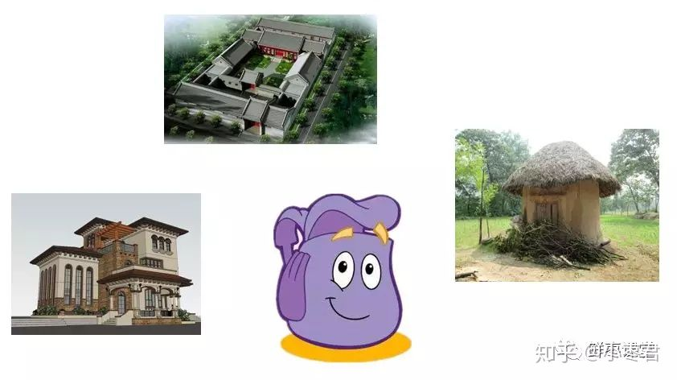  
  
于是乎，就变成了一个大的公共仓库。  
  
负责对Docker镜像进行管理的，是Docker Registry服务（类似仓库管理员）。  
  
不是任何人建的任何镜像都是合法的。万一有人盖了一个有问题的房子呢？  
  
所以，Docker Registry服务对镜像的管理是非常严格的。  
  
最常使用的Registry公开服务，是官方的Docker Hub，这也是默认的 Registry，并拥有大量的高质量的官方镜像。  
  
好了，说完了Docker，我们再把目光转向K8S。  
  
就在Docker容器技术被炒得热火朝天之时，大家发现，如果想要将Docker应用于具体的业务实现，是存在困难的——编排、管理和调度等各个方面，都不容易。于是，人们迫切需要一套管理系统，对Docker及容器进行更高级更灵活的管理。  
  
就在这个时候，K8S出现了。  
  
K8S，就是基于容器的集群管理平台，它的全称，是kubernetes。  
  
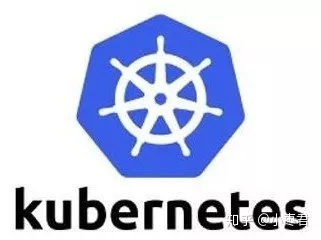  
  
Kubernetes 这个单词来自于希腊语，含义是舵手或领航员。K8S是它的缩写，用“8”字替代了“ubernete”这8个字符。  
  
和Docker不同，K8S的创造者，是众人皆知的行业巨头——Google。  
  
然而，K8S并不是一件全新的发明。它的前身，是Google自己捣鼓了十多年的Borg系统。  
  
K8S是2014年6月由Google公司正式公布出来并宣布开源的。  
  
同年7月，微软、Red Hat、IBM、Docker、CoreOS、 Mesosphere和Saltstack 等公司，相继加入K8S。  
  
之后的一年内，VMware、HP、Intel等公司，也陆续加入。  
  
2015年7月，Google正式加入OpenStack基金会。与此同时，Kuberentes v1.0正式发布。  
  
目前，kubernetes的版本已经发展到V1.13。  
  
K8S的架构，略微有一点复杂，我们简单来看一下。  
  
一个K8S系统，通常称为一个K8S集群（Cluster）。  
  
这个集群主要包括两个部分：  
  
- 一个Master节点（主节点）  
- 一群Node节点（计算节点）  
  
  
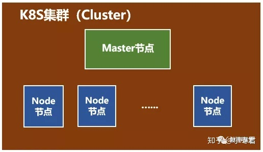  
  
一看就明白：Master节点主要还是负责管理和控制。Node节点是工作负载节点，里面是具体的容器。  
  
深入来看这两种节点。  
  
首先是Master节点。  
  
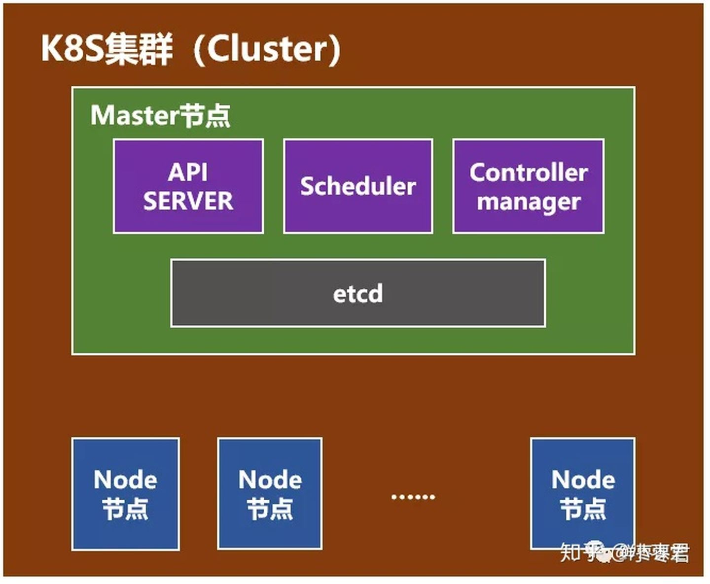  
  
Master节点包括API Server、Scheduler、Controller manager、etcd。  
  
API Server是整个系统的对外接口，供客户端和其它组件调用，相当于“营业厅”。  
  
Scheduler负责对集群内部的资源进行调度，相当于“调度室”。  
  
Controller manager负责管理控制器，相当于“大总管”。  
  
然后是Node节点。  
  
  
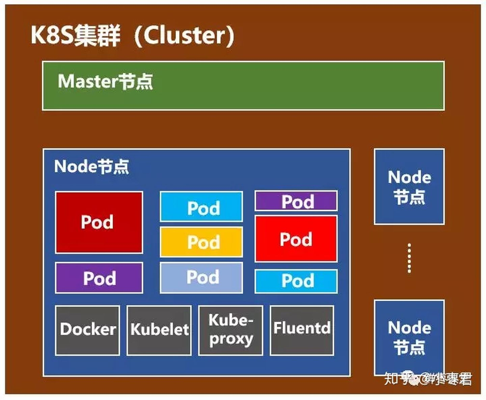  
  
Node节点包括Docker、kubelet、kube-proxy、Fluentd、kube-dns（可选），还有就是Pod。  
  
  
Pod是Kubernetes最基本的操作单元。一个Pod代表着集群中运行的一个进程，它内部封装了一个或多个紧密相关的容器。除了Pod之外，K8S还有一个Service的概念，一个Service可以看作一组提供相同服务的Pod的对外访问接口。这段不太好理解，跳过吧。  
  
Docker，不用说了，创建容器的。  
  
Kubelet，主要负责监视指派到它所在Node上的Pod，包括创建、修改、监控、删除等。  
  
Kube-proxy，主要负责为Pod对象提供代理。  
  
Fluentd，主要负责日志收集、存储与查询。  
  
是不是有点懵？唉，三言两语真的很难讲清楚，继续跳过吧。  
  
Docker和K8S都介绍完了，然而文章并没有结束。  
  
接下来的部分，是写给核心网工程师甚至所有通信工程师看的。  
  
从几十年前的1G，到现在的4G，再到将来的5G，移动通信发生了翻天覆地的变化，核心网亦是如此。  
  
但是，如果你仔细洞察这些变化，会发现，所谓的核心网，其实本质上并没有发生改变，无非就是很多的服务器而已。不同的核心网网元，就是不同的服务器，不同的计算节点。  
  
变化的，是这些“服务器”的形态和接口：形态，从机柜单板，变成机柜刀片，从机柜刀片，变成X86通用刀片服务器；接口，从中继线缆，变成网线，从网线，变成光纤。  
  
就算变来变去，还是服务器，是计算节点，是CPU。  
  
既然是服务器，那么就势必会和IT云计算一样，走上虚拟化的道路。毕竟，虚拟化有太多的优势，例如前文所说的低成本、高利用率、充分灵活、动态调度，等等。  
  
前几年，大家以为虚拟机是核心网的终极形态。目前看来，更有可能是容器化。这几年经常说的NFV（网元功能虚拟化），也有可能改口为NFC（网元功能容器化）。  
  
以VoLTE为例，如果按以前2G/3G的方式，那需要大量的专用设备，分别充当EPC和IMS的不同网元。  
  
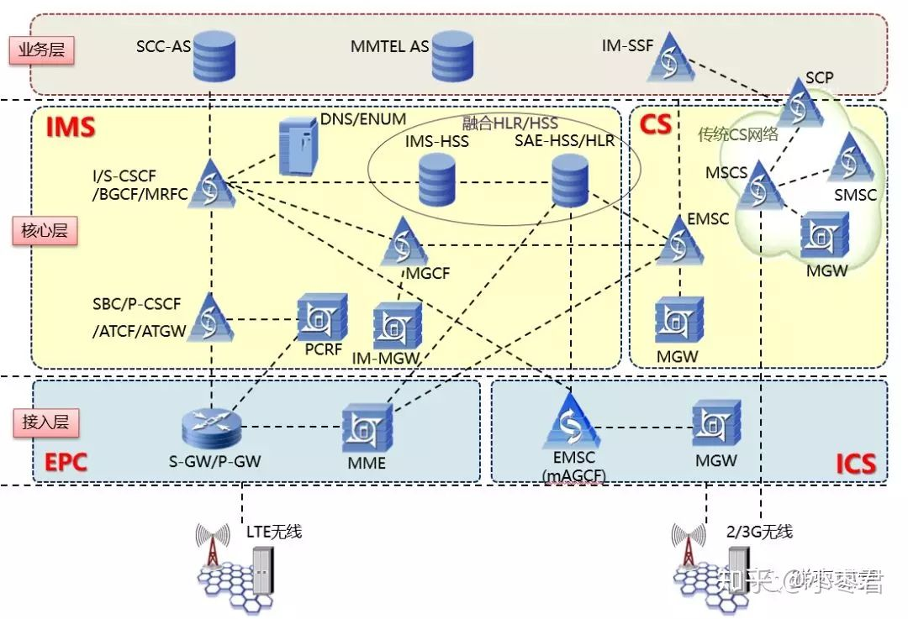  
  
VoLTE相关的网元  
  
而采用容器之后，很可能只需要一台服务器，创建十几个容器，用不同的容器，来分别运行不同网元的服务程序。  
  
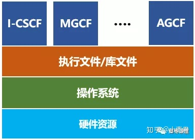  
  
这些容器，随时可以创建，也可以随时销毁。还能够在不停机的情况下，随意变大，随意变小，随意变强，随意变弱，在性能和功耗之间动态平衡。  
  
简直完美！  
  
5G时代，核心网采用微服务架构，也是和容器完美搭配——单体式架构（Monolithic）变成微服务架构（Microservices），相当于一个全能型变成N个专能型。每个专能型，分配给一个隔离的容器，赋予了最大程度的灵活。  
  
  
  
精细化分工  
  
按照这样的发展趋势，在移动通信系统中，除了天线，剩下的部分都有可能虚拟化。核心网是第一个，但不是最后一个。虚拟化之后的核心网，与其说属于通信，实际上更应该归为IT。核心网的功能，只是容器中普通一个软件功能而已。  
  
至于说在座的各位核心网工程师，恭喜你们，马上就要成功转型啦！  
  
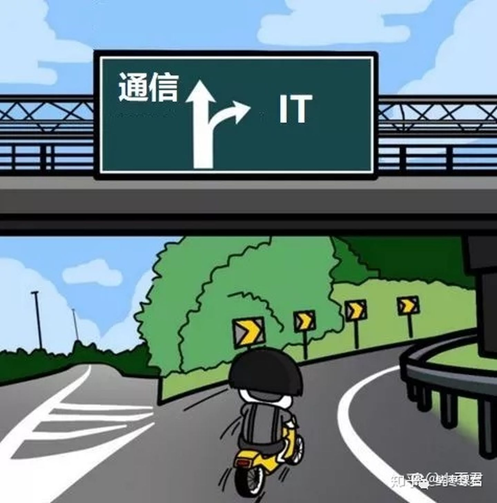  
  
  
喜欢的朋友欢迎继续关注枣君微信公众号：鲜枣课堂  
  
  
#### [PostgreSQL 许愿链接](https://github.com/digoal/blog/issues/76 "269ac3d1c492e938c0191101c7238216")
您的愿望将传达给PG kernel hacker、数据库厂商等, 帮助提高数据库产品质量和功能, 说不定下一个PG版本就有您提出的功能点. 针对非常好的提议，奖励限量版PG文化衫、纪念品、贴纸、PG热门书籍等，奖品丰富，快来许愿。[开不开森](https://github.com/digoal/blog/issues/76 "269ac3d1c492e938c0191101c7238216").  
  
  
#### [9.9元购买3个月阿里云RDS PostgreSQL实例](https://www.aliyun.com/database/postgresqlactivity "57258f76c37864c6e6d23383d05714ea")
  
  
#### [PostgreSQL 解决方案集合](https://yq.aliyun.com/topic/118 "40cff096e9ed7122c512b35d8561d9c8")
  
  
#### [德哥 / digoal's github - 公益是一辈子的事.](https://github.com/digoal/blog/blob/master/README.md "22709685feb7cab07d30f30387f0a9ae")
  
  

  
  
#### [PolarDB 学习图谱: 训练营、培训认证、在线互动实验、解决方案、生态合作、写心得拿奖品](https://www.aliyun.com/database/openpolardb/activity "8642f60e04ed0c814bf9cb9677976bd4")
  
  
#### [购买PolarDB云服务折扣活动进行中, 55元起](https://www.aliyun.com/activity/new/polardb-yunparter?userCode=bsb3t4al "e0495c413bedacabb75ff1e880be465a")
  
  
#### [About 德哥](https://github.com/digoal/blog/blob/master/me/readme.md "a37735981e7704886ffd590565582dd0")
  
