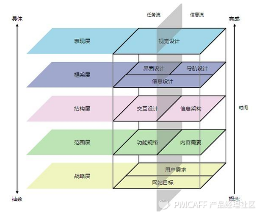
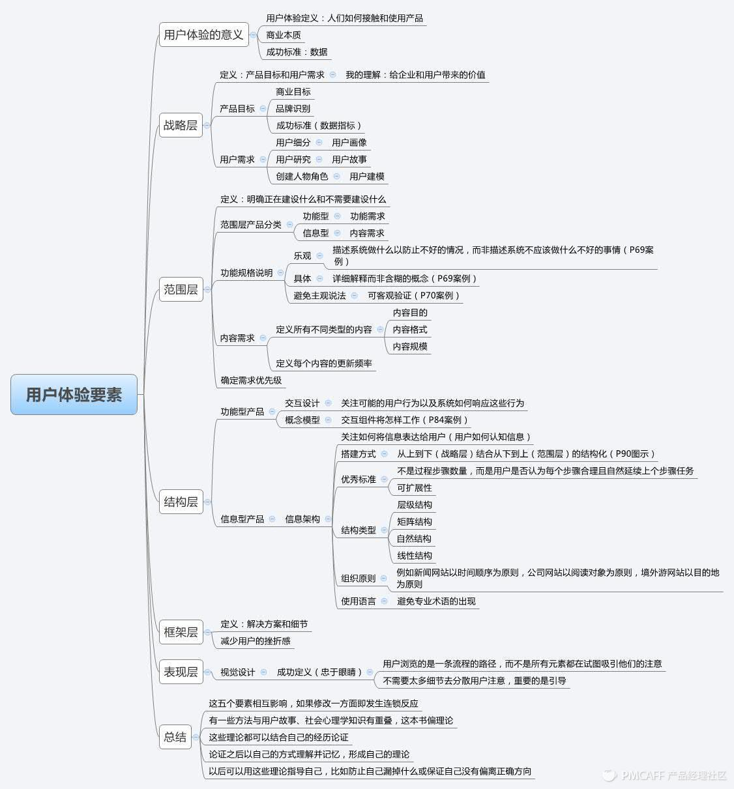

## 转  以《用户体验要素》谈竞品调研  
        
### 作者        
digoal        
        
### 日期        
2021-01-29         
        
### 标签        
PostgreSQL , 竞品分析         
        
----        
        
## 背景        
  
[戴小点：以《用户体验要素》谈竞品调研](https://zhuanlan.zhihu.com/p/29215139)    
    
竞品调研是PM的必备技能之一，做好竞品调研能帮助我们发现自家产品的优劣点，了解市场情况，可以说是非常重要的日常工作了。    
    
最初我做竞品调研是从网络上挑一份模板，再按框架填充内容。对于产品新人来说，这种方式可以快速入门，有其可取之处。但时间一久，就有了一点个人经验，模板往往不能满足需要，可以考虑整理一套适合自己的方法体系了。    
    
《用户体验要素》（作者 Garrett.J.J）是一本不错的产品指导手册，曾帮助我梳理出完整的产品流程。从产品角度做竞品调研，书中理论同样适用，因此选择以此书来探讨竞品调研方法。文末会附上我个人总结的《用户体验要素》思维导图，另外本书某些概念不能只理解字面意思，如果感兴趣可以阅读原版（我没买到英文原版，阅读中文版时几次被翻译误导）。    
    
各行各业以及每个人的经验都不相同，考虑篇幅问题，这里主要从产品的角度讲方法以及延伸阅读，不便列举实例。    
    
    
    
#### 战略层    
    
一般讲用户体验，我们的第一反应是UED。而作者对用户体验的定义是“人们如何接触和使用产品”，这个定义包含了非常关键的商业本质。因此在用户体验五要素中，战略层放在了第一位。    
    
战略层关注的是产品目标和用户需求。分析竞品时，首先弄清楚他们的目标和用户，从而明确其市场定位。分析市场定位的敌我差异，将直接决定后续产品打法。    
    
产品目标通常可以从官宣信息（官网/应用商店介绍/公关稿）获取和研究，也可以从商业模式的角度来分析。    
    
分析用户需求则需要先从用户画像、用户故事着手，这需要一些数据辅助分析。官宣（数据一般有夸大）、百度指数、站长工具、艾瑞网等都是获取数据的便捷渠道，具体分析方法则可以参考《用户故事与敏捷开发》前4章。    
    
#### 范围层    
    
再强大的竞品，也有自身的局限性（资金/技术/政策等等），种种局限决定了竞品在范围层如何划定功能需求。在梳理竞品的功能需求时，应避免简单的罗列功能清单和信息，分析背后的原因更为重要。建议多关注竞品能做什么，不能做什么，找到其优势和弱点。    
    
#### 结构层    
    
结构层是指产品的概念模型或信息架构，体现了产品如何引导以及响应用户。关于产品设计的“概念模型”推荐阅读《设计心理学》（作者Donald Norman）。对偏向于交互设计的PM来说，可以多放一些精力在竞品的结构层分析上，推荐网易UEDC分享的竞品分析相关文章，大多都是从交互设计的角度来做竞品分析的。    
    
#### 框架层    
    
按我个人理解，结构层和框架层的界线其实是比较模糊的。如果一定要区分，框架层应该是结构层的子系统，是结构层的具体解决方案和细节。做竞品调研的时候，不需要在框架层面面俱到，关注主流程或核心功能即可。    
    
#### 表现层    
    
表现层很好理解，就是我们常说的视觉设计。视觉设计常常由UI设计师的意志决定，但PM必须有一定的把控意识。研究竞品的视觉设计，重点应放在背后的引导逻辑。    
    
今天只讲产品角度的竞品调研，还是稍显局限。建议PM除了关注用户和交互，更多的将眼光放在竞品的商业模式、市场和业务上。    
    
最后再多说一句，调研是指“调查”和“研究”。新手往往只会搜集和罗列，并没有分析和结论，这样的调研只能算是做到30%而已。一定要尽量搜集客观信息和数据来佐证，将合理的结论建立在事实之上。    
    
附《用户体验要素》思维导图（原创内容，如需转载请与我私信联系）    
    
    
    
  
      
  
#### [PostgreSQL 许愿链接](https://github.com/digoal/blog/issues/76 "269ac3d1c492e938c0191101c7238216")
您的愿望将传达给PG kernel hacker、数据库厂商等, 帮助提高数据库产品质量和功能, 说不定下一个PG版本就有您提出的功能点. 针对非常好的提议，奖励限量版PG文化衫、纪念品、贴纸、PG热门书籍等，奖品丰富，快来许愿。[开不开森](https://github.com/digoal/blog/issues/76 "269ac3d1c492e938c0191101c7238216").  
  
  
#### [9.9元购买3个月阿里云RDS PostgreSQL实例](https://www.aliyun.com/database/postgresqlactivity "57258f76c37864c6e6d23383d05714ea")
  
  
#### [PostgreSQL 解决方案集合](https://yq.aliyun.com/topic/118 "40cff096e9ed7122c512b35d8561d9c8")
  
  
#### [德哥 / digoal's github - 公益是一辈子的事.](https://github.com/digoal/blog/blob/master/README.md "22709685feb7cab07d30f30387f0a9ae")
  
  

  
  
#### [PolarDB 学习图谱: 训练营、培训认证、在线互动实验、解决方案、生态合作、写心得拿奖品](https://www.aliyun.com/database/openpolardb/activity "8642f60e04ed0c814bf9cb9677976bd4")
  
  
#### [购买PolarDB云服务折扣活动进行中, 55元起](https://www.aliyun.com/activity/new/polardb-yunparter?userCode=bsb3t4al "e0495c413bedacabb75ff1e880be465a")
  
  
#### [About 德哥](https://github.com/digoal/blog/blob/master/me/readme.md "a37735981e7704886ffd590565582dd0")
  
