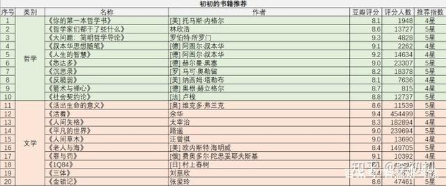
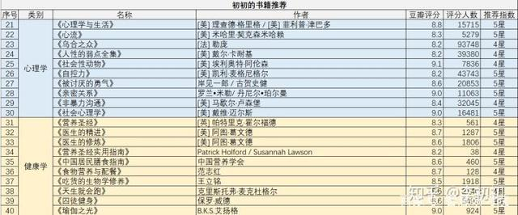
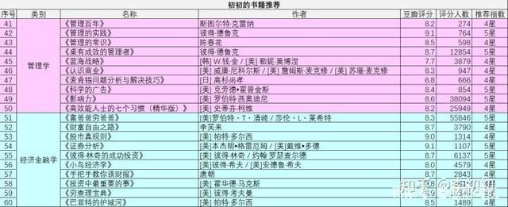
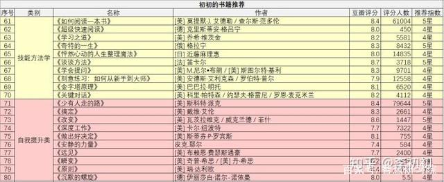
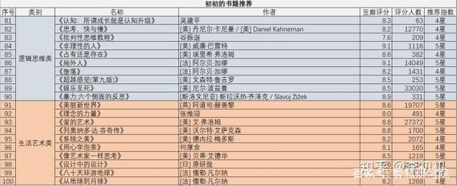

## 人生中最值得看的100本书，你读过几本? - 10大分类 豆瓣高分好书  
  
### 作者  
digoal  
  
### 日期  
2021-02-02   
  
### 标签  
PostgreSQL , 豆瓣 , 高分   
  
----  
  
## 背景  
## 原文  
https://baijiahao.baidu.com/s?id=1669364357840643761&wfr=spider&for=pc  
  
不看后悔系列！！之全网最全书单分享！！！  
  
初初作为一名「资深书虫兼快乐分享又驻扎知乎的小仙女」，经常看到知乎邀请的话题，“有哪些让你读完有跪感的书？”“有哪些你后悔没有早点阅读的书？”“有哪些年轻人需要看的书？”……这些问题真的太类似了吧，这篇文章的目的就是终结此类问题，以后别人问你们，就把这篇文章甩给他们。  
  
我今天必须给你们认真推荐我的书单，一部分是自己认真读过的觉得意义非凡、真的令人无法自拔的；一部分是知乎的关于好书的高赞分享，也是我今年将要阅读的。我总结了以下10个分类，为了不使类别之间差异太大，每个类别筛选了高质量的10本，合计100本。  
  
绝对不夸张的说，这些书足够让你为之惊艳~  
  
为了大家方便阅读，我准备了表格，全文内容长达万字，建议点赞收藏，以免丢失哦~  
  
  
  
  
  
  
  
  
因为全文内容确实很长，大家可以跳到自己感兴趣的部分看相关书籍哦~  
  
## 一、哲学  
  
有没有人跟初初一样，以前听到哲学两次就害怕。小时候学思想政治课背着“哲学是什么？生活处处有哲学……”头都很疼！接下来我推荐的这10本哲学书，绝对让你打破以往对哲学的那些想法，进入哲学的美好世界当中！我们一起来看看~  
  
1\.《你的第一本哲学书》(豆瓣评分：8.1)  
  
  
如果一定要选择一本哲学书来阅读，这本书就是最先推荐的了。  
  
像我们这样普通的人，看一些艰涩难懂的哲学书，简直是煎熬，但又想稍微了解一点哲学（怎么说，想在人前显得有知识一点），就可以读这样没有什么难度的哲学书。  
  
这本书只关心两个问题：人生的意义是什么？ 我如何才能获得最大的幸福？ 这两个问题也是大家在生活中常去思考的命题。墙墙墙裂推荐哦！！！  
  
2\.《哲学家们都干了些什么》(豆瓣评分：8.6)  
  
  
这本书可太有意思了，看到书名之后，我就忍不住去找来读了。现在还没读完，真的是一本拿起来就舍不得放下的好书。  
  
“哲学史写得这么浅白风趣八卦，你让我们哲学系的人还怎么混？”，这本书用非常有趣的吐槽和喜闻乐见的八卦，彻底瓦解我们读者对哲学史的成见，翻开其中的任何一页，都是令人欲罢不能的哲学小故事。  
  
在故事里，跟你述说这个世界上超级有趣的一些话题，你说，这个作者，优秀成这样，让别人还怎么活？？  
  
哲学家们！自己说说看，你们究竟都干了些什么？宇宙的外面是什么？世界会不会是假的？我是不是活在虚拟世界/别人梦中？上帝到底存在还是不存在？这个世界有没有终极真理？……  
  
翻开本书，从神烦的苏格拉底开始，彻底了解人类史上的哲学家们，以及他们穷尽毕生的经历和苦思后提交的最终答卷。  
  
3\. 《大问题：简明哲学导论》(豆瓣评分：9.3)  
  
  
看这本评分这么高，就知道是本被大多数人认可的哲学好书了。  
  
它不像上面两种幽默风趣的风格，它的目的就是引导读者进入真正思考的大门。作者不会像一般哲学导论著作那样按照事件发生的顺序罗列哲学史上的一些观点，而是完全把读者当成一点都不了解哲学，从而按照一些大问题来组织材料，字里行间都透露出为普通读者的考虑。读它！  
  
思想能够把最危险的处境变得意味深长。  
  
4\. 《叔本华思想随笔》(豆瓣评分：9.1)  
  
著名的哲学大师，尼采形容阅读叔本华的著作：  
  
犹如抵达了一处森林高地——在这里，我们深深地呼吸着清新的空气，整个人感觉耳目一新，重又充满了生机。  
  
大师推荐，岂能不读？  
  
这本书虽然讨论的话题比较多，但里面贯穿着的基本思想主线清晰可辨。而且作者把真理裹以最朴素的语言外衣，从而让真理直接发挥其必然具备的震撼力。因为深刻，所以朴素；因为朴素，更见深刻。真的是好书！  
  
5\. 《人生的智慧》(豆瓣评分：9.2)  
  
同样是叔本华的作品，评分依然很高。  
  
这本书讨论的事情跟我们的生活更为接近，诸如健康、财富、名声、荣誉、养生和待人接物所应遵守的原则等，读起来真的毫无难度。  
  
正如叔本华所说的，在这本书里他尽量以世俗、实用的角度考虑问题。因此，这本书尤其适合大众阅读。  
  
把部分的孤独带进社会人群中去，学会在人群中保持一定程度上的孤独。  
  
6\. 《悉达多》(豆瓣评分：9.0)  
  
这本书是初初读完的第一本哲学书，当时是看到书名，觉得好像挺熟悉的又不记得在哪见过，就拿起来读了。  
  
一口气读完，真的很好看！  
  
这本书讲的是什么呢？  
  
是佛祖释迦摩尼的一生！  
  
看完惊呆了，释迦牟尼佛原来真的是人（这话有点奇怪），“悉达多”的意思是“目的达到的人”。  
  
7\.《沉思录》(豆瓣评分：8.2)  
  
《沉思录》这本书是一个皇帝写的，这样还不看吗？哈哈哈，哲学类的书真的好神奇！  
  
这本书是古罗马皇帝奥勒留写给自己的书，内容大部分是他在鞍马劳顿中写成的。  
  
作品来自奥勒留对身羁宫廷的自己和自己所处混乱世界的感受，追求一种冷静而达观的生活。这部著作是斯多葛学派的一个里程碑。  
  
为了未来，不要消耗你的思想在别人身上，除非是共同的利益引你这么做。  
  
8\.《反脆弱》(豆瓣评分：8.1)  
  
这本书里作者大谈试错法、人生的大小决定、政治、自治市、战争、个人理财、经济体系和医疗系统……风格独树一帜。  
  
《反脆弱》一书中，塔勒布告诉我们在不确定的世界中的生存法则，他找到并定义了“反脆弱”类事物：  
  
每一个事物都会从波动中得到利益或蒙受损失，脆弱性是指因为波动和不确定而承受损失，反脆弱性则是指让自己避免这些损失，甚至从混乱和不确定中获利。  
  
9\.《箭术与禅心》(豆瓣评分：8.7)  
  
  
这本书是作者的真实生活记录，为了追求在哲学中无法得到的生命意义。  
  
作者远渡重洋来到东方的日本学禅，处处碰壁之后，透过箭术，他体验了禅的真义。  
  
他将这段曲折的学习经验，生动地记录下来，篇幅虽短，却难能可贵地以文字传递了不可描述的禅悟经验。  
  
开始时进步得很快的人，以后会遭遇较多的困难。  
  
10\.《社会契约论》(豆瓣评分：8.8)  
  
  
卢梭的大名想必大家都听说过，这本书我高中的时候还记得。  
  
《社会契约论》是一部政治哲学著作，它探讨的是政治权利的原理，它的主旨是为人民民主主权的建立奠定理论基础。  
  
在18世纪的法国政治思想领域里，存在着三种改革国家政治制度的学说：孟德斯鸠主张立宪君主制，伏尔泰主张开明的君主制，而卢梭主张民主共和制。所以这本书值得一看，了解当时的人们对于政治哲学的思想。  
  
唯有道德的自由才使人类真正成为自己的主人；因为仅只有嗜欲的冲动便是奴隶状态。  
  
## 二、文学  
  
第二类，文学书。文学类的书不夸张的说，都是我的心头好。每年我都会读十几本特别好的文学书，有些是被普遍认可的经典，有些是自己发现的小众精致好书。接下来的这些也是如此，希望你们也会喜欢哦~  
  
11\.《活出生命的意义》(豆瓣评分：8.6)  
  
  
大名鼎鼎的书！而且还是著名心理学家写的！  
  
作者弗兰克尔是20世纪的一个奇迹。纳粹时期，作为犹太人，他的全家都被关进了奥斯威辛集中营，他的父母、妻子、哥哥，全都死于毒气室中，只有他和妹妹幸存。弗兰克尔不但超越了这炼狱般的痛苦，更将自己的经验与学术结合，开创了意义疗法，替人们找到绝处再生的意义，也留下了人性史上最富光彩的见证。  
  
由于生命中每一种情况对人来说是一种挑战，都会提出需要你去解决的问题，所以生命之意义的问题实际上被颠倒了。人不应该问他的生命之意义是什么，而必须承认是生命向他提出了问题。  
  
12\.《活着》(豆瓣评分：9.4)  
  
同样非常有名气的一本书，我也很早之前读过，觉得应该作为2020年的书单再次读一遍！  
  
《活着》讲述了农村人福贵悲惨的人生遭遇。福贵本是个阔少爷，可他嗜赌如命，终于赌光了家业，一贫如洗。他的父亲被他活活气死，母亲则在穷困中患了重病，福贵前去求药，却在途中被国民党抓去当壮丁。经过几番波折回到家里，才知道母亲早已去世，妻子家珍含辛茹苦地养大两个儿女。此后更加悲惨的命运一次又一次降临到福贵身上，他的妻子、儿女和孙子相继死去，最后只剩福贵和一头老牛相依为命，但老人依旧活着，仿佛比往日更加洒脱与坚强。  
  
做人还是平常点好，争这个争那个，争来争去赔了自己的命。像我这样， 说起来是越混越没出息，可寿命长， 我认识的人一个挨着一个死去， 我还活着。  
  
13\.《人间失格》(豆瓣评分：8.3)  
  
有名！读完也很有收获！  
  
太宰治生活的日本，是一个旧道德秩序和集体主义依旧盘根错节的社会，我们并不生活在那样的社会中。但是，今天我们阅读太宰治的作品，却并没有什么隔阂感，反而能够生出一种超越时代的共鸣。  
  
这恐怕是因为，如今的后工业时代，也同样是一个无时无刻不在压抑乃至抹杀个体自我以使其“适应社会”的病态时代，身处其中者若是想要保留心中那个自我，便也一样面临如太宰那般被边缘化和“人间失格”的危险处境。  
  
14\.《平凡的世界》(豆瓣评分：9.0)  
  
我今年读完的一本小说，之前也有读过，算是二刷了！依然墙裂推荐！  
  
《平凡的世界》是一部现实主义小说，也是一部小说形式的家族史。  
  
作者浓缩了中国西北农村的历史变迁过程，在小说中全景式地表现了中国当代城乡的社会生活。在近十年的广阔背景下，通过复杂的矛盾纠葛，刻画了社会各阶层众多普通人的形象。劳动与爱情，挫折与追求，痛苦与欢乐，日常生活与巨大社会冲突，纷繁地交织在一起，深刻地展示了普通人在大时代历史进程中所走过的艰难曲折的道路。  
  
不幸的是，你知道得太多了，思考得太多了，因此才有了这种不能为周围人所理解的苦恼……  
  
15\.《人间草木》(豆瓣评分：9.0)  
  
我要看的书，真的一本非常优秀的散文集！  
  
当代文坛上,能同时在小说和散文两块田地里经营,且自成一家的并不多,汪曾祺先生算是其中的一个。汪曾祺是公认的文体家,不仅能写一手优秀的小说,还能写一手漂亮的散文。语言很优美，给你们品品：  
  
蜻蜓一个个选定地方息下，天就快晚了。有一种通身铁色的蜻蜓，翅膀较窄，称“鬼蜻蜓”。看它款款地飞在花阴墙角，心里有一种说不出来的难过。  
  
16\.《老人与海》(豆瓣评分：8.4)  
  
这本书讲述了一个渔夫的故事。  
  
古巴老渔夫圣地亚哥在连续八十四天没捕到鱼的情况下，终于独自钓上了一条大马林鱼，但这鱼实在大，把他的小船在海上拖了三天才筋疲力尽，被他杀死了绑在小船的一边。在归程中，他再遭到一条鲨鱼的袭击，最后回港时只剩鱼头鱼尾和一条脊骨。而在老圣地亚哥出海的日子里，他的忘年好友一直在海边忠诚地等待，满怀信心地迎接着他的归来。  
  
那时他曾经想过，也许这就是一场梦。后来他看到那鱼跃出水面，在落下之前，静止不动地悬在半空里，才确认有一件奇妙的事情发生了，而他却不敢相信。  
  
17\.《罪与罚》(豆瓣评分：9.1)  
  
听没听说过？应该很多人听过且读过了，属于名著系列。《罪与罚》是19世纪俄国大文豪陀思妥耶夫斯基的代表作之一。  
  
小说描写一心想成为拿破仑式的人物、认定自己是个超人的穷大学生拉斯柯尔尼科夫，受无政府主义思想毒害，为生活所迫，杀死放高利贷的房东老太婆和她的无辜的妹妹，制造了一起震惊全俄的凶杀案。  
  
经历了一场内心痛苦的忏悔后，他最终在基督教徒索尼雅姑娘的规劝下，投案自首，被判流放西伯利亚。  
  
作品着重表现主人公行凶后良心受到谴责，内心深感孤独、恐惧的精神状态，刻画他犯罪前后的心理变化。小说一方面描绘了俄国下层人民的悲惨生活，揭露贵族社会的罪恶；一方面也宣扬逆来顺受，从宗教中求解脱的思想。  
  
18\.《1Q84》(豆瓣评分：8.1)  
  
去年我读完的一本书，放进来推荐给大家！真的看完很感动，受到了很大的冲击！  
  
《1Q84》写一对十岁时相遇后便各奔东西的三十岁男女，相互寻觅对方的故事，并将这个简单故事变成复杂的长篇。  
  
不管喜欢还是不喜欢，目前我已经置身于这‘1Q84年’。我熟悉的那个1984年已经无影无踪，今年是1Q84年。空气变了，风景变了。我必须尽快适应这个带着问号的世界。像被放进陌生森林中的动物一样，为了生存下去，得尽快了解并顺应这里的规则。  
  
19\.《三体》(豆瓣评分：9.4)  
  
同样是去年读完的，推荐！三体是中国著名科幻作家刘慈欣的首个长篇系列。  
  
小说讲述了文革期间一次偶然的星际通讯引发的三体世界对地球的入侵以及之后人类文明与三体文明三百多年的恩怨情仇。三体三部曲出版后十分畅销，并深受读者和主流媒体好评，被普遍认为是中国科幻文学的里程碑之作，为中国科幻确立了一个新高度。  
  
人类的末日悄然来临。这个人确实危险，他信念坚定，眼光远大又冷酷无情，行事冷静决断，平时严谨认真，但在需要时，又可以随时越出常轨，采取异乎寻常的行动。”  
  
20\.《金锁记》(豆瓣评分：8.6)  
  
看到的高赞分享，决定2020年必须要读的一本书！以前我也读过张爱玲其他的小说，一直喜欢她的文笔，描写得非常细腻。  
  
《金锁记》写于1943年，小说描写了一个小商人家庭出身的女子曹七巧的心灵变迁历程。30年来她戴着黄金的枷。她用那沉重的枷角劈杀了几个人，没死的也送了半条命。"  
  
张爱玲在本书中在空前深刻的程度上表现了现代社会两性心理的基本意蕴。  
  
大家来品品文字：  
  
三十年前的上海，一个有月亮的晚上.....我们也许没赶上看见三十年前的月亮。年轻的人想着三十年前的月亮该是铜钱大的一个红黄的湿晕，像朵云轩信笺上落了一滴泪珠，陈旧而迷糊。老年人回忆中的三十年前的月亮是欢愉的，比眼前的月亮大，圆，白；然而隔着三十年的辛苦路往回看，再好的月色也不免带点凄凉。  
  
如果大家觉得阅读100本书很困难，可以自己按照表格中的推荐指数进行阅读，大部分的书也是我2020年将阅读的书，有想一起交流读书心得的可以点赞关注我噢~  
  
## 三、心理学  
  
作为心理学专业的学生，读过太多心理学的书了，书架上一半以上的都是心理学读物。下面的这10本心理学书，是很多非专业的朋友在找我推荐的时候，我经常分享的，非常值得阅读！墙墙墙裂推荐噢！！  
  
21\.《心理学与生活》(豆瓣评分：8.8)  
  
首个推荐！！真心好读！  
  
《心理学与生活》是美国斯坦福大学多年来使用的教材，也是在美国许多大学里推广使用的经典教材，被ETS推荐为GRE心理学专项考试的主要参考用书，还是被许多国家大学的“普通心理学”课程选用的教材。  
  
这本教科书写作流畅，通俗易懂，深入生活，把心理学理论与知识联系人们的日常生活与工作，使它同样也成为一般大众了解心理学与自己的极好读物。  
  
22\.《心流》(豆瓣评分：8.3)  
  
也是超级推荐！  
  
“心流”是指我们在做某些事情时，那种全神贯注、投入忘我的状态——这种状态下，你甚至感觉不到时间的存在，在这件事情完成之后我们会有一种充满能量并且非常满足的感受。  
  
不知道你有没有这种体验？  
  
其实很多时候我们在做自己非常喜欢、有挑战并且擅长的事情的时候，就很容易体验到心流，比如爬山、游泳、打球、玩游戏、阅读、演奏乐器还有工作的时候。  
  
对心理学爱好者和研究者来说，《心流》是理解积极心理学等领域不可或缺的理论素材；对大众读者来说，这更是一本提升幸福感和效率的行动指南。  
  
23\.《乌合之众》(豆瓣评分：8.2)  
  
很多人都是先看这本书入了心理学的门，哈哈哈，真的很好的一本书！  
  
在社会心理学领域已有的著作中，最有影响的是这本并不很厚的《乌合之众》。作者在书中极为精致地描述了集体心态，对人们理解集体行为的作用以及对社会心理学的思考发挥了巨大影响。  
  
24\.《人性的弱点全集》(豆瓣评分：8.2)  
  
《人性的弱点全集》汇集了卡耐基的思想精华和最激动人心的内容，是作者最成功的励志经典，出版后立即获得了广大读者的欢迎，成为西方世界最持久的人文畅销书。  
  
你所认为的并非真正的你；反倒是你怎么想，你就是什么样的人。  
  
25\.《社会性动物》(豆瓣评分：9.1)  
  
  
《社会性动物》是“美国社会心理学的《圣经》”，“仍然是最好的……是一部杰作”（Contemporary Psychology的评价）。  
  
这本书从1972年出版第一版以来，在世界范围内畅销数千万册，同样是社会心理学领域内最具影响的著作。  
  
26\.《自控力》(豆瓣评分：8.2)  
  
  
这本书真的太有名气，但我还没读，同样是我2020年必读书目。推荐！  
  
《自控力》这本书特别适合压力较大的，有一点拖延症的，或者有目标想实现的。  
  
这本书为读者提供了清晰的框架，讲述了什么是自控力，自控力如何发生作用，以及为何自控力如此重要。  
  
27\.《被讨厌的勇气》(豆瓣评分：8.6)  
  
  
你是否常常对繁琐的生活感到乏味？你是否时时为复杂的人际关系感到疲惫？你是否认为人生的意义越来越模糊难见？我们如何能够在繁杂的日常琐碎和复杂的人际关系中用自己的双手去获得真正的幸福？  
  
这一切的答案尽在这本《被讨厌的勇气》中！  
  
《被讨厌的勇气》并不是要去吸引被讨厌的负向能量，而是，如果这是我生命想绽放出最美的光彩，那么，即使有被讨厌的可能，我都要用自己的双手双脚往那里走去。  
  
因为拥有了被讨厌的勇气，于是有了真正幸福的可能。  
  
28\.《亲密关系》(豆瓣评分：9.0)  
  
这本书可太多人来问我了，推荐！想了解爱情的看它！  
  
作者综合了心理学多个分支的研究理论和成果，用饶有趣味的论述，总结出人们在交往与沟通、爱情与承诺、婚姻与性爱、嫉妒与背叛等方面的行为特点和规律。  
  
亲密关系满足的秘诀：1、欣赏你的伴侣，2、表达你的感激，3、重复上述两步。  
  
29\.《非暴力沟通》(豆瓣评分：8.4)  
  
也是我去年读过的书，推荐！  
  
作为一个遵纪守法的好人，也许我们从来没有想过和“暴力”扯上关系。不过如果稍微留意一下现实生活中的谈话方式，并且用心体会各种谈话方式给我们的不同感受，我们一定会发现，有些话的确伤人！  
  
言语上的职责、嘲讽、否定、说教以及任意打断、拒不回应、随意出口的评价和结论给我们带来的情感和精神上的创伤，甚至比肉体的伤害更加令人痛苦。这些无心或有意的语言暴力让人与人变得冷漠、隔阂、敌视。  
  
非暴力生活的一个关键就是：感激生活的赐予，而不贪心。  
  
30\.《社会心理学》(豆瓣评分：9.0)  
  
真的读过太多遍了，墙裂推荐！！！  
  
《社会心理学》这本书被美国700多所大学或学院的心理系所采用，是这一领域的主导教材，已经成为评价其他教材的标准。  
  
这本书将基础研究与实践应用完美地结合在一起，以富有逻辑性的组织结构引领学生了解人们是如何思索、影响他人并与他人建立联系的。是人们了解自身、了解社会、了解自己与社会之间关系的最佳的指导性书籍。  
  
## 四、健康学  
  
没有想到吧！很多人几乎没看过健康类的书籍，但这个部分真的很重要啊！  
  
举个我自己身上发生的栗子~  
  
我在大学的时候经常身体不好，总是去医院，当时性格也比较内向，不好意思麻烦别人陪我，都是自己一个人去。从学校到医院一般是两个多小时车程，很远，因为学校在大学城里，很郊区的地方。我经常是一个人坐公交过去，路上就很辛酸也能难过，身体也特别不舒服。  
  
后来我学会去图书馆借这些健康类的书，想知道自己为什么身体那么差，为什么总是病恹恹的，为什么从小抱着药罐子长大。当时真的很郁闷！  
  
后来，书看得多了，居然慢慢忘了自己的那些问题。书籍好像没有解答我的问题，但是这些书真的让我走出了那么抑郁难过的状态。  
  
还是要说，健康问题不能轻视，健康学书籍一起看起来！  
  
31\.《营养圣经》(豆瓣评分：8.3)  
  
《营养圣经(最新修订版)》作者根据国际营养学最新研究状况进行了更新，并且由国内著名营养学家范志红主持翻译、审订。  
  
我国第四次全国营养与健康调查的结果显示，大中城市成年人中的糖尿病发病率已达6％，北京高达8％；城市居民中，超重及肥胖者高达30％，血脂异常发病率达18％。如果不改善自己的饮食模式，积极调整营养状况，不出10年，随着慢性病的发展，会有大批30～60岁的中年人因心血管疾病发作等原因提前结束生命，或造成严重后遗症，给自己和家庭带来极大的痛苦和负担。因此，掌握科学的营养知识，知道“吃什么”和“怎么吃”尤为重要。  
  
你的身体正在告诉你哪些东西不适合你，你越听它的话，就会变得越健康。 在有压力的情况下，人体自然的反射就是停止消化。  
  
32\.《医生的精进》(豆瓣评分：8.7)  
  
医学中最大的问题，就是不确定性。病人因无法确诊而惶恐不安，医生因不能确诊而左右为难，医疗费用因不确定性的探索而节节攀升，社会舆论因不确定性而质疑医学的科学性。  
  
日益攀升的医患纠纷、说不清的诊疗性骚扰、棘手的医疗事故、高额的医疗费、不平等的收入……当新手医生阿图成为独当一面的葛文德医生，当医术已经远远无法解决问题，他与他的医者同伴如何面对？接下来还有哪些挑战等待着他？  
  
最真实的“医者仁心”故事正在上演，我们一起来看！  
  
33\.《医生的修炼》 (豆瓣评分：8.6)  
  
新手医生阿图满怀抱负进入梦想中的白色巨塔，他将遇到哪些意想不到的试炼？硬着头皮第一次拿起手术刀的他，将如何处理突如其来的变故？在错误切开病人气管的时候，他如何面对从手边一丝丝逝去的生命？在“成功是常态，失败就是一条人命”的职业生涯中，在每一个或者温暖或惊悚的病例故事背后，都是生与死的殊死较量。  
  
这本书精选了14个主题，从不同侧面展现了医生所面对的世界的不确定性，和做抉择时需要考虑的复杂因素。一个个医学现象背后，是外科医生群体的自我审视与修炼。值得一读！  
  
34\.《营养圣经实用指南》(豆瓣评分：8.2)  
  
属于《营养圣经》的简化版，但重在实用啊~非常精炼的一本书，可以当做一本手头书，翻一翻，绝对能给你足够的启发！  
  
35\.《中国居民膳食指南》(豆瓣评分：8.6)  
  
这本书送给你3件健康“法宝”：一般人群的10条膳食纪律，提要阐述中国营养学会百名专家为普通中国居民量身打造的每一条膳食指南的中心内容，进而科学解释详细说明，并附有参考资料补充说明。  
  
老幼妇孺青的专属饮食准则，特殊人群不同的生理特点要求膳食因需而定，本部分为老幼妇孺青特定膳食指南，在一般人群10条膳食指南的基础上增补而成。  
  
最易学易记最实用的中国居民平衡膳食宝塔，以直观的形式告诉人们每日应摄入的食物种类、合理数量以及适宜的身体活动量。  
  
36\.《食物营养与配餐》(豆瓣评分：8.7)  
  
本书具有非常鲜明的特色，即信息量大、可读性强、讲解细致、便于应用。  
  
书中涵盖了传统营养学教材中的内容，包括各类营养素的基本知识、各类食物的营养价值、膳食营养素的供给标准、膳食结构、各类人群的营养需求等。  
  
在知识的深度和范围方面，无论是谁，都会发现这本书符合自己的需求。  
  
37\.《吃货的生物学修养》(豆瓣评分：8.5)  
  
食物空前丰富的社会，反而成了引发疾病的导火索。  
  
这本书是以脂肪、糖和胆固醇代谢研究中重大发现为脉络，展示了这个领域的科学探索和发现、我们日常饮食健康与疾病的关系，以及我们常见的一些药物如减肥药、他汀、胰岛素等药物的前世今生。  
  
作者以讲述历史故事的形式，把常人陌生的科学史娓娓道出，引人入胜，同时，对于公众了解与能量代谢有关的疾病也很有帮助。  
  
38\.《天生就会跑》(豆瓣评分：8.6)  
  
每天清晨，羚羊都知道，它必须跑得比最快的狮子快；狮子知道，它必须跑得比最慢的羚羊快。不管是狮子还是羚羊，太阳升起时，都要开始奔跑。地球上的其他哺乳动物都在自由奔跑，难道只有人类是例外？墨西哥的铜峡谷，隐居着史上最强的长跑族群塔拉乌马拉人。他们能活下来，是因为父辈跑得比鹿快，而父辈能活下来，是因为祖父跑得比阿帕奇人的战马快。他们永远不知道追赶猎物时要跑多快多久。只有随时调整姿势、方向和速度，敏捷地在石块和沟壑间蹦跳，才能跑过错综的山路，爬上陡峭的岩壁，回家。塔拉乌马拉人跑，与其说是为了更快，不如说是为了彼此更接近，与自然无限地接近。原来，人天生就会跑！  
  
39\.《囚徒健身》(豆瓣评分：8.6)  
  
这不是一本教你练出“可爱肌肉”的书，而是一本教你练出能用的力量、极限的力量、生存的力量的书。  
  
作者在美国最严酷的监狱中度过了19年，在其中逐渐挖掘出了一套最古老的健身法，在商业社会中早已失传的力量哲学，并凭此成为了地球上最强壮的人之一。出狱之后，他把这套失传的技艺整理并公之于世。  
  
这里！还要墙裂推荐大家《量化健身》这本书哦，作者  
  
@陈柏龄  
  
。这不是一套简简单单的健身书籍，而是一份标准化的，能帮助你建立健身知识体系的“健身学习产品”，非常适合健身者使用！  
  
初初已经作为今年必读书目收藏了！  
  
40\.《瑜伽之光》(豆瓣评分：9.0)  
  
这本书的名字叫做“瑜伽之光”。  
  
在书中的每个体式和呼吸控制法的说明都极为详尽，它们全部来源于作者27年来在全世界很多地方的教学经验。  
  
全书包括200个体式的完整技巧并配有592幅照片，以帮助练习者掌握相关体式，作者通过这本书引导读者正确与安全地掌握这些体式和呼吸控制法的方法。  
  
## 五、管理学  
  
这个我也很有发言权哦，因为初初本科的时候是经济与管理学院的，当时学的是工商管理，后来才考研到心理学的，神不神奇？哈哈哈~  
  
管理类的书籍很有全局观，看的时候就会忘记个体的感觉，这一点与心理学差异很大。  
  
尤其是企业运行，商业万象，会给人磅礴气势的感觉，看的时候自然而然带入到管理的情境当中，能学到很多非常有用的个人和企业管理的知识。  
  
41\.《管理百年》(豆瓣评分：8.2)  
  
过去的100年，管理的艺术一次次地得到了彻底改造。在《管理百年》中，读者可以看到每一轮的创新，认识到管理艺术是如何与过去、未来相契合的。  
  
这本书不仅是一部现代管理学史，更是一部现代商业进化史。  
  
书中充满了对每一位学习管理学理论和实践的人来说都具有价值的远见，赶紧读起来！  
  
42\.《管理的实践》(豆瓣评分：9.1)  
  
这本书的根本目的在于通过对管理原则、责任和实践的研究，探索如何建立有效的管理机制和制度，非常适合管理者来阅读！  
  
衡量一种管理制度是否有效的标准就在于该制度能否将管理者个人特征的影响降到最低。在每个企业中，管理者都是赋予企业生命、注入活力的要素。  
  
43\.《管理的常识》(豆瓣评分：8.5)  
  
很多时候不是员工的素质不行，更不是企业文化不行，在大部分效率低下、内部无法协同的组织中，由于对管理常识的误解所导致的因素占了绝大多数。  
  
管理中绝大部分犯错误的地方就是做出决策选择的是一组人，执行决策的是另外一组人，因此决策就无法获得实施。  
  
44\.《桌有成效的管理者》(豆瓣评分：8.7)  
  
《卓有成效的管理者》的基本观念：  
  
对组织负有责任，能影响组织经营成果的人，就是管理者。管理者，就必须卓有成效。卓有成效是可以学会的！如此，一群平凡的人，就做出不平凡的事。  
  
45\.《蓝海战略》(豆瓣评分：7.7)  
  
红海与蓝海不知大家是否清晰？不懂的，可以阅读这本书！  
  
企业为了寻求持久的、获利性的增长，往往与其对手针锋相对地竞争。它们为竞争优势而战，为市场份额而战，为实现差异化而战。  
  
然而在目前过度拥挤的产业市场中，硬碰硬的竞争只能令企业陷入血腥的“红海”，即竞争激烈的已知市场空间中，并与对手争抢日益缩减的利润额。  
  
在这本书中，作者对你所熟知的一切战略成功的定律提出挑战。他们认为，流连于红海的竞争之中，将越来越难以创造未来的获利性增长。  
  
作者提出：要赢得明天，企业不能靠与对手竞争，而是要开创“蓝海”，即蕴含庞大需求的新市场空间，以走上增长之路。  
  
46\.《认识商业》(豆瓣评分：8.3)  
  
《认识商业》是美国高等院校采用量最大的商业入门教材，出版三十多年来，在西方国家长销不衰，并被全球几百所大专院校列为企业管理课程、MBA教程的必选教材。  
  
这本书包罗商业万象，从商业管理、人力资源管理、营销学，到决策制定、财务管理等，娓娓道来，清晰透彻，引领读者全面掌握商业管理和运作知识。  
  
书中所设各种专栏贴近现实，采用众多著名企业及企业家的真实案例，特别是“中国视角”引入中国的经验与故事。  
  
47\.《麦肯锡问题分析与解决技巧》(豆瓣评分：6.8)  
  
这本书是一本专为商务人士设计，以提升分析与解决问题能力的指南。本书在逻辑思考的基础之上，建构出一套体系，从理论和实务两方面来说明解决问题的技巧，以及在背后支撑它的分析技术。《麦肯锡问题分析与解决技巧》的举例范围广泛，从日常生活中的大小事到企业策略都包含在内，阅读本书能够掌握解决问题的本质，提升解决问题的能力。  
  
48\.《科学的广告》(豆瓣评分：8.4)  
  
《科学的广告》写于作者就职于当时营业额高居美国首位的洛德暨托马斯广告公司期间，对广告的基本原则和具体运作细节都做了完整而深刻的总结。  
  
从中我们可以看到一个终生勤奋努力的广告先驱是如何在一次又一次成功中积累经验的，而这每一条经验都开启了现今广告的原则。  
  
49\.《影响力》(豆瓣评分：8.6)  
  
同样是心理学家写的书，鼓掌鼓掌！  
  
在这本书中，心理学家罗伯特·B·西奥迪尼博士为我们解释了为什么有些人极具说服力，而我们总是容易上当受骗。隐藏在冲动地顺从他人行为背后的6大心理秘笈，正是这一切的根源。那些劝说高手们，总是熟练地运用它们，让我们就范。  
  
50\.《高效能人士的七个习惯（精华版）》(豆瓣评分：8.2)  
  
富兰克林柯维公司擅长于通过使用先进的培训方法和系统、完善的内容帮助个人和组织提高效能，其最著名的课程《高效能人士的七个习惯》就源于史蒂芬柯维（Stephen R.Covey）的同名著作。  
  
它所传授的内容不是某种流行时尚或管理技巧，而是经过时间的考验并且能够指导行为的基本原则。  
  
通过彻底思维的改变达到行为的改变从而加强了组织内部的管理机制、培养组织内部的共同语言和价值观。  
  
很开心你看到这里，这证明你也是一个热爱读书、喜欢学习的同学哦，不然就是被我的才华给吸引了(不允许反驳)，哈哈哈~如果文章对你有帮助，请点赞收藏鼓励一下哦~  
  
## 六、经济金融学  
  
下面的这些书，是我今年重点会去读的书。因为初初也临近毕业，马上要步入职场了，之前在学校里兼职和实习存下了一点点钱，所以要开始学理财投资，才能真的在未来保障好自己的生活。  
  
这些书同样推荐给你们，我个人是真心觉得，想要实现财富自由，一定是要学习一些经济和财务的知识的。不过也别急，投资理财最忌心浮气躁，我们先从阅读开始，慢慢入门，走对方向，比什么都重要哦~  
  
51\.《富爸爸穷爸爸》(豆瓣评分：8.3)  
  
  
这本书是我今年看的第一本投资理财相关的书，开启了我的学习投资之旅，墙裂推荐！  
  
《富爸爸，穷爸爸》是一个真实的故事，作者罗伯特清崎的亲生父亲和朋友的父亲对金钱的看法截然不同，这使他对认识金钱产生了兴趣，最终他接受了朋友的父亲的建议，也就是书中所说的。“富爸爸”的观念，即不要做金钱的奴隶，要让金钱为我们工作，并由此成为一名极富传奇色彩的成功的投资家。  
  
52\.《财富自由之路》(豆瓣评分：8.7)  
  
  
作者李笑来，大家应该不陌生吧。  
  
原新东方名师，自称“中国比特币首富”，著名天使投资人，著有多本畅销书，现为情非得已(北京)科技有限公司创始人，致力于让一部分知识分子先富起来。  
  
不要抱怨这个世界。马克吐温说得好： 让你陷入困境的，并不是这个世界;真正让你陷入困境的，是这个世界最终并非你所想象。  
  
53\.《股市真规则:世界顶级评级机构的投资真经》(豆瓣评分：9.0)  
  
  
如何深度挖掘财务报表以发现隐藏的黄金和陷阱？如何发现有竞争优势的好公司？如何确认一家公司的管理团队是否是称职的？如何发现可能对投资组合造成重大损失的警示信号？  
  
这本书统统告诉你！这本书主要讲述了公司价值研究、股票估值和投资策略等内容，它将帮助投资者挑选正确的股票、发现好的公司、理解不同行业后面的驱动力。  
  
54\.《证券分析》(豆瓣评分：9.1)  
  
《证券分析》的作者本杰明格雷厄姆是价值投资理论的奠基人，被誉为“华尔街教父”。  
  
他既在美国哥伦比亚大学商学院任过教授，又在华尔街创造过辉煌的投资业绩；既经历过让投资者得意忘形的大牛市，又经历过让投资者沮丧绝望的大萧条。市场锤炼了格雷厄姆，也证明了价值投资的意义所在。  
  
55\.《彼得·林奇的成功投资》(豆瓣评分：8.7)  
  
这本书作者用浅显生动的语言娓娓道出了股票投资的诸多技巧，向广大的中小投资者提供了简单易学的投资分析方法。  
  
这些方法是作者多年的经验总结，具有很强的实践性，对于业余投资者来说尤为有益。  
  
56\.《小鸟经济学》(豆瓣评分：8.0)  
  
我们渴望消除经济紧缩的痛苦，但是我们忘记了自由本身就是有风险的，如果政府有责任消除一切苦痛，那么就没有人是自由的。无法自由地失败，也就是无法自由地成功。  
  
57\. 《手把手教你读财报》(豆瓣评分：8.7)  
  
这本书是一位久经沙场的老股民，在经历了无数次惨烈的投资战役之后，总结过往得失，呕心沥血而作。  
  
因为不是会计专业出身，所以没有晦涩的术语、难懂的公式。因为有多年的投资经历，所以更明白财报的意义所在，更知道投资者读财报的目的所在。财报是用来排除企业的。  
  
这本书以一份贵州茅台财报为例，让毫无会计学基础的投资者也能轻松读懂财报，看透财报背后的企业秘密。  
  
58\. 《投资中最重要的事》(豆瓣评分：8.8)  
  
投资大师揭示了价值投资的真谛：  
  
投资不仅是股票买卖，更要关注基于生产经营层面的公司价值；控制投资风险，要格外注意避免出价过高；充分解读市场信息是非常必要的；投资于你所熟知的领域，避免跟风投机；切忌为被投资方的成长性出价过高；股票价格终将回归由其基本面决定的公司价值。  
  
本书旨在给出这些投资理念的实用化的操作指南。  
  
59\. 《穷查理宝典》(豆瓣评分：8.9)  
  
《穷查理宝典》收录了查理过去20年来主要的公开演讲。  
  
贯穿全书的是芒格展示出来的聪慧、机智，其令人敬服的价值观和深不可测的修辞天赋。  
  
60\. 《巴菲特的护城河》(豆瓣评分：8.5)  
  
巴菲特说，他认定可口可乐、美国捷运、吉列有宽阔的经济护城河，所以他长期持有并收益超群。但巴菲特一直没说，到底怎样发现护城河。  
  
谁能找到拥有宽阔护城河的企业，谁就能获得股市长久高收益。  
  
## 七、技能方法类：  
  
下面的这10本书，我基本都看过了，是挑选出来真心推荐给大家看的，非常值得在学习和工作中去运用。这些书一些教你什么是正确的方法，一些讲的是技能类，很实用！同样墙墙墙裂推荐噢！  
  
61\.《如何阅读一本书》(豆瓣评分：8.4)  
  
每本书的封面之下都有一套自己的骨架，作为一个分析阅读的读者，责任就是要找出这个骨架。  
  
一本书出现在面前时，肌肉包着骨头，衣服包裹着肌肉，可说是盛装而来。读者用不着揭开它的外衣或是撕去它的肌肉来得到在柔软表皮下的那套骨架，但是一定要用一双X光般的透视眼来看这本书，因为那是了解一本书、掌握其骨架的基础。  
  
不懂阅读的人，初探阅读的人，读这本书可以少走冤枉路。对阅读有所体会的人，读这本书可以有更深的印证和领悟。  
  
62\. 《超级快速阅读（新版）》(豆瓣评分：8.0)  
  
你也许会问，是否非得天资过人，才能学得快、学得好？我这个年纪才开始改用新的学习方法，还来得及吗？  
  
这本书是作者克里斯蒂安·格吕宁的成名之作。他在临近大学毕业时准备德国司法考试期间，因为不能像其他同学一样有充足的时间复习备考，便在参考众多学习方法类书籍的基础上独辟蹊径，创造出一套风靡全球的阅读方法。  
  
作者给大家吃了一颗“定心丸”：学习或工作的成效绝不仅仅取决于与生俱来的禀赋或智商，年龄长幼和起点高低也完全不是问题，更不需要超人的意志力。  
  
63\. 《学习之道》(豆瓣评分：8.2)  
  
我们很多人都在学习，可是没有多少人会学习！  
  
我们知道如何解题，如何考高分，可是没有多少人能明白真正的学习是什么，而学习又如何成为一种艺术的。  
  
想知道的，可以阅读这本书，同样墙裂推荐！  
  
64\.《奇特的一生》(豆瓣评分：8.3)  
  
人最宝贵的是生命。  
  
但是仔细分析一下这个生命，可以说，最宝贵的是时间。  
  
因为生命是由时间构成的，是一小时一小时、一分钟一分钟累积起来的。没人能预计他在下一分钟里能发生什么，但至少我们可以记得前一分钟我们做过什么。  
  
如果每个人都能知道自己能干些什么，那生活会变得多么美好！因为每个人的能力都比他自己感觉到的大得多，也就不会有那么多的人感叹自己因能力有限而导致一事无成。这本书将给你带来新的启发！  
  
65\. 《怦然心动的人生整理魔法》(豆瓣评分：8.0)  
  
这本书是一本整理书，同时是一本心灵疗愈书。  
  
从精神层面到整理方法俱全。本书介绍“一旦整理，就不会变乱”的整理方法，教授按照心动的标准选择物品，按照先丢东西，后收纳的顺序，按照物品类别，进行一次性、短期、完善的整理等，使人通过整理找回人生决断力，找到最初的梦想，找到怦然心动的幸福人生。  
  
66\. 《谈谈方法》(豆瓣评分：8.7)  
  
这本书是笛卡尔的一部代表作，也是他的处女作。  
  
这本书被公认为近代哲学的宣言书，树起了理性主义认识论的大旗。  
  
67\. 《学会提问》(豆瓣评分：8.3)  
  
如果在你的家乡投资建一座核电厂，你会支持还是反对？如果学校出于安全考虑要对每一个学生进行安全检查，你会高兴还是愤怒？如果你的兄弟姐妹做了父母明令禁止的事，你会告诉父母还是隐瞒不说？  
  
过于感情投入，最大危险就是你可能没法识别谬误和操纵。  
  
遇到一个难回答的问题，将它直接枪毙掉比仔细思考然后做出回答要容易得多，而且，这样做一定让你显得一言九鼎霸气外露，但也在无形中关闭了通往批判性思维大门。  
  
我们需要靠自己去问为什么！擦亮双眼看清世界！  
  
68\. 《刻意练习：如何从新手到大师》(豆瓣评分：7.9)  
  
4岁就会弹奏小提琴童年时代写出多部名曲只用一根弦也能弹完一首曲子瞬间记住几百个随机数字开平方比计算器还快  
  
所有人都以为“杰出”源于“天赋”，“天才”却说：我的成就源于“正确的练习”！  
  
著名心理学家艾利克森发现，不论在什么行业或领域，提高技能与能力的最有效方法全都遵循一系列普遍原则，他将这种通用方法命名为“刻意练习”。  
  
对于在任何行业或领域中希望提升自己的每个人，刻意练习是黄金标准，是迄今为止发现的最强大的学习方法。  
  
69\. 《金字塔原理》(豆瓣评分：8.1)  
  
  
这是一本讲解写作逻辑与思维逻辑的读物，全书分为四个部分。如果不会写作的人，可以阅读这本书，绝对有很大的收获！  
  
70\.《关键对话》(豆瓣评分：8.2)  
  
  
这本书详细剖析了人们在沟通上常见的盲点，并提供了许多立竿见影的谈话、倾听、行动技巧，辅以丰富的对话情境和轻松幽默的小故事，帮助读者以最迅速的方式掌握这些技巧。  
  
说的切中要点，让对方清楚知道你的看法，是一种能力；说的圆满得体，让对方自动反省，是一种智慧。  
  
运用本书提供的技巧，不论是多么难以应对的局面，你都能够以事半功倍的效率轻松面对。  
  
## 八、自我提升类：  
  
其实所有的书籍本质上都是为了提升我们的一些素养的，接下来的这10本同样如此，是我精心挑选出来，觉得可以帮助自己和他人进行自我提升的好书。  
  
我们一起来看一下：  
  
71\. 《少有人走的路》(豆瓣评分：8.4)  
  
  
这本书告诉我们怎样找到真正的自我。  
  
正如开篇所言：  
  
人生苦难重重。  
  
作者让我们更加清楚：人生是一场艰辛之旅，心智成熟的旅程相当漫长。但是，他没有让我们感到恐惧，相反，他带领我们去经历一系列艰难乃至痛苦的转变，最终达到自我认知的更高境界。  
  
72\. 《搞定》(豆瓣评分：8.3)  
  
这本书讲述在今天这个信息量和工作量倍增的世界，一些老的工作方法已经失去了效用。  
  
每一个职场中人或多或少都有这样的体验：压力重重；太多事情都理不清头绪；似乎永远被各种任务和目标追赶着……  
  
时间管理大师戴维艾伦将指导你走出规划和执行工作中的泥沼，通向高效、轻松的彼岸。要想让事情井井有条，关键便是——从容、放松。  
  
73\. 《改变》(豆瓣评分：8.6)  
  
在我们的日常生活中，合平常理及遵从逻辑的思维方式．确实是一种解决之道，但有时中规中矩的做法反而导致失败，而那些看似不合逻辑和非理性的行动，却出乎意料地使问题得以改善。  
  
这种矛盾悖论的现象．正是本书所要探讨的主题。  
  
74\. 《深度工作》(豆瓣评分：7.7)  
  
随时随地收发电子邮件、一个接一个地参加大小会议、在即时通讯软件的尖叫中手忙脚乱、在繁杂的多线程工作中不断地切换注意力……  
  
你看起来非常忙碌，甚至在不自觉地享受这种忙碌，但你的忙碌真的能转化为生产能力吗？  
  
本书作者、尖锐地道破了信息经济时代的惊人真相——知识工作者60%以上的工作时间都花费在处理此类浮浅事务上，而这些工作不仅产出的价值有限，还会永久性地损害人们深度工作的能力！  
  
75\. 《做出好决定》(豆瓣评分：8.1)  
  
决定塑造未来：重大的决策能够影响我们的人生轨道，而小决定也会改变我们的生活。  
  
因此，如何改善决策质量、做出好决定，是我们最重要的生存技能。  
  
作者总结千余篇行为决策领域的相关研究，用轻松易读的语言帮助我们认识自己的决策风格，了解大多数人会有的、影响决策的心理惯性，从而有针对性地避免失误，自如决策。  
  
76\. 《安静的力量》(豆瓣评分：7.4)  
  
在《安静的力量》一书中，皮克耶尔分享了许多与我们常识相悖的观点。  
  
他认为每个人在骨子里，其实都需要一个留白的空间，一个停顿，就像一段音乐正是有了休止符才能让人产生共鸣。  
  
但是，这本书不是冥想指导书，也不是宗教宣传小册子，而是倡导了一种生活方式，也就是关掉电脑、抛开手机、逃离都市喧嚣，通过长时间静坐，进入内心世界。而这种生活方式是包括谷歌在内很多互联网公司都在推崇的生活和工作方式。  
  
77\. 《远见》(豆瓣评分：7.7）  
  
什么是成功的职业生涯？成功的职业生涯不在于找到热爱的工作，而在于建立起你热爱的生活。  
  
我们期盼梦想，但惧怕现实。我们认识的那个世界已经变了，而且变得很快。我们需要新的方法寻找工作，用新的方法建立可持续的职业生涯。  
  
《远见》提供了实用的练习、工具和案例，带你重新思考和评估你的技能、时间和职场投资方向。  
  
78\. 《瞬变》(豆瓣评分：8.2)  
  
改变，是我们生活中始终要面对的问题。  
  
有时，我们主动想要改变——不再拖延，不再懒散，不再逃避；有时，环境的变化要求我们改变——市场竞争，婚姻危机，工作掉队……但不管多么必要，我们却发现改变如此痛苦，又如此艰难。为什么？怎么办？  
  
改变是个智慧的考验，如何去用理智指导情感，而不要去用意志力去试图战胜情感。理智只是一个骑手，而情感是一头大象。运用意志力，骑手也许能驾驭大象一时；但是当大象按照自己的性子来的时候，骑手之力是无法控制这头庞然大物的。  
  
79\. 《原则》(豆瓣评分：8.4)  
  
这本书从为人处世、理解现实到日常工作、企业管理，覆盖管理者、普通白领、一般大众所提炼的原则，也包括投资方面的感悟、公司治理、人类进化等，合适多层次、多领域的读者阅读。  
  
80\. 《沉默的螺旋》(豆瓣评分：8.0)  
  
这本书是传播学领域的经典著作，论述了舆论的形成过程和机制。  
  
这不仅是一本讲述了重要传播概念的理论书；也是一本一步一步地引导人们开展社会科学研究的书，并且在研究总体思路上给予了指导，因此，这也是一本关于方法论和方法学的书。  
  
## 九、逻辑思维类  
  
真正有价值的改变是思维上的改变。当你的思维改变了，很多以往会去纠结和痛苦的问题，或是一些疑惑，会在改变的过程中迎刃而解。  
  
所以，逻辑思维类的书必不可少，我们一定要读起来！  
  
81\. 《认知：所谓成长就是认知升级》(豆瓣评分：8.3)  
  
这本书并不是提供一条捷径，而是需要你应用该方法论，独立思考，并在实践中重构思维模式，突破认知“天花板”，实现螺旋式上升。  
  
假如你能在读完每篇文章后，在工作中有意识地去应用，那么你很快就可以看到自己思维能力的提升，拉开你和他人的差距。  
  
认知能力的提升，意味着世界观、格局、思考问题方式的改变，乃至改变人生。  
  
82\. 《思考，快与慢》(豆瓣评分：8.2)  
  
人类究竟有多理性？  
  
在这本书中，卡尼曼会带领我们体验一次思维的终极之旅。  
  
他认为，我们的大脑有快与慢两种作决定的方式。这本书将会彻底改变你对思考的看法。  
  
83\. 《批判性思维教程》(豆瓣评分：7.6)  
  
这本书是在北京大学和中国青年政治学院开设“逻辑与批判性思维”课程的基础上写成的。能跟北大的同学学习到同样的知识，还不看起来吗？  
  
84\. 《非理性的人》(豆瓣评分：9.1)  
  
这本书是美国哲学家巴雷特的代表作，被公认为英语国家中研究、解释和介绍存在主义的最优秀的著作，在西方学界享有很高的声誉。  
  
这本书文字通俗易懂，论证清晰有力。  
  
85\. 《占有还是存在》(豆瓣评分：8.6)  
  
这本书是著名精神分析学家、人本主义哲学家弗洛姆的最后一部著作。  
  
书中，作者对自己多年来关于资本主义社会所崇拜的人类生存方式的非人道化影响的研究进行了全面总结。  
  
弗洛姆区分了两种不同形式的生存方式，即占有和存在。重“占有”的生存方式的基础是以利润为取向的社会，重“存在”的生存方式则会创造性地运用人的力量。  
  
86\. 《局外人》(豆瓣评分：9.1)  
  
这本书我很久之前读过，印象非常深刻。  
  
作者是阿尔贝加缪，“存在主义”文学的大师。1957年因“热情而冷静地阐明了当代向人类良知提出的种种问题”而获得诺贝尔文学奖。  
  
作者在他的小说、戏剧、随笔和论著中深刻地揭示出人在异己的世界中的孤独、个人与自身的日益异化，以及罪恶和死亡的不可避免。  
  
他在揭示出世界的荒诞的同时却并不绝望和颓丧，他主张要在荒诞中奋起反抗，在绝望中坚持真理和正义，他为世人指出了一条基督教和马克思主义以外的自由人道主义道路。  
  
87\.《堕落》(豆瓣评分：8.2)  
  
同样是加缪的另一本小说。墙裂推荐！！！  
  
死者会被遗忘、被讥讽或被利用，三者必居其一。至于被理解，则不可能。  
  
88\.《超越感觉》(豆瓣评分：8.5)  
  
作者是国际公认的强调思维教学在教育中核心地位的运动之先驱。  
  
他在大学毕业以后曾经担任过四年工程师，主要从事时间和运动研究，致力于改进方法、设备和外观设计，并且进行标准的成本计划分析。  
  
这些经验赋予他对于创造性和批判的思考的独特视角，这个视角的基础不仅是认知理论，也在于实际的应用。  
  
89\. 《娱乐至死》(豆瓣评分：8.5)  
  
这本书是对20世纪后半叶美国文化中最重大变化的探究和哀悼：印刷术时代步入没落，而电视时代蒸蒸日上；电视改变了公众话语的内容和意义；政治、宗教、教育和任何其他公共事务领域的内容，都不可避免的被电视的表达方式重新定义。  
  
电视的一般表达方式是娱乐。一切公众话语都日渐以娱乐的方式出现，并成为一种文化精神。  
  
一切文化内容都心甘情愿地成为娱乐的附庸，而且毫无怨言，甚至无声无息，“其结果是我们成了一个娱乐至死的物种”。  
  
90\. 《暴力:六个侧面的反思》(豆瓣评分：8.9)  
  
  
我们所能眼见的物理暴力往往是某种系统暴力的产物。  
  
这种系统暴力维持着我们身处其中的政治和经济体制。  
  
为此，人们看待暴力的方式本身就是被系统所塑造的。  
  
有时，什么都不做就是最暴力的行动。  
  
## 十、生活艺术类  
  
真的，读到这里的人，我服你！  
  
为你点赞，墙裂建议保存上面的表格，回去打开电子书或是找纸质书来读，读书使人明理，你一定会有很大的收获！  
  
接下来的最后一类，是生活艺术类的。  
  
我曾经说过这样一句话：  
  
有时候我们总会忘记，人生的第一要义是生活，往后才是其他。  
  
别在日日夜夜辛勤工作或是在浑浑噩噩游戏娱乐中，忘记了自己的生活。接下来的这10本书真的会帮助到你，学习生活的艺术。  
  
91\. 《美丽新世界》(豆瓣评分：8.6)  
  
  
这本书是二十世纪最经典的反乌托邦文学之一。这部作品与乔治·奥威尔的《1984》、扎米亚京的《我们》并称为“反乌托邦”三书，在国内外思想界影响深远。  
  
书中引用了广博的生物学、心理学知识，为我们描绘了虚构的福特纪元632年即公元2532年的社会。这是一个人从出生到死亡都受着控制的社会。  
  
正是在这个“美丽新世界”里，人们失去了个人情感，失去了爱情——性代替了爱，失去了痛苦、激情和经历危险的感觉。最可怕的是，人们失去了思考的权利，失去了创造力。  
  
92\.《理念的力量》(豆瓣评分：8.0)  
  
  
这本书涵盖了著名经济学家张维迎近年来所主张、研究主要观念，书中论点涉及市场、法治、改革、未来发展等重要领域，列出了作者长期思考的影响社会的二十四个重大理念。  
  
理念是重要的，人的行为不仅受利益的支配，也受理念的支配。  
  
社会的变革和人类的进步基本上都是在新的理念推动下出现的，没有理念的变化就没有制度和政策的改变。  
  
93\. 《爱的艺术》(豆瓣评分：8.8)  
  
这本书是德裔美籍心理学家和哲学家弗洛姆最著名的作品，自1956年出版至今已被翻译成32种文字，在全世界畅销不衰，被誉为当代爱的艺术理论专著最著名的作品。  
  
在这本书中，弗洛姆认为，爱情不是一种与人的成熟程度无关，只需要投入身心的感情。  
  
爱是一门艺术，要求想要掌握这门艺术的人有这方面的知识并付出努力。在这里，爱不仅仅是狭隘的男女爱情，也并非通过磨练增进技巧即可获得。爱是人格整体的展现，要发展爱的能力，就需要努力发展自己的人格，并朝着有益的目标迈进。  
  
94\. 《列奥纳多·达·芬奇传》(豆瓣评分：8.8)  
  
达·芬奇是文艺复兴时期伟大的艺术家与科学家，是影响了世界500多年的“网红”。  
  
带着顽皮而执着的热情，达·芬奇孜孜不倦地投入对众多领域的创新研究，包括解剖学、化石、鸟类、心脏、飞行器、光学、植物学、地质学、水流以及武器。  
  
达·芬奇的天才之处正是基于那些我们也可以通过自我训练提升的能力：热切的好奇心，认真的观察以及异想天开的想象力，同时他能对自己稍显异类而泰然处之。  
  
他的人生提醒我们：  
  
无论我们自己还是我们的孩子，都应不止于吸收知识，更要去质疑，要充满想象力，敢于不同凡“想”，就像任何时代的异类天才和创新者一样。  
  
95\. 《系统之美》(豆瓣评分：8.2)  
  
这本书是一本简明扼要的系统思考入门指南，也是认识复杂动态系统的有力工具，帮助大家提高理解和分析身边系统的能力。  
  
小到个人问题，大到全球性复杂挑战，本书都可以为你提供睿智的解答和洞察。  
  
作者认为，系统思考将有助于我们发现问题的根本原因，看到多种可能性，从而让我们更好地管理、适应复杂性挑战，把握新的机会，去打造一个完全不同的自我和一个崭新的世界。  
  
一本书，引领个人、组织与社会变革的先河，促使人们觉醒，改变看待这个世界和系统的方式，以此改变当今社会的发展进程，让大家在这个充满各种复杂系统的世界里更好地生活。  
  
96\. 《用心学泡茶》(豆瓣评分：8.1)  
  
这本书使读者从茶爱好者到茶友入门，清楚明白，斜的很基础很实用。  
  
作者的用词很简朴，却像一个知音般在耳畔喃喃细语，句句说在点上。这本书没有讲很多技巧，讲得乃是境界，这是一个最难的话题却被作者用简单的语言表述出来，期间的道理每个人都会明白：  
  
做任何事情其实都是这样，一旦境界到了就入了道了，再怎么走也不会偏差，抵达终点只是时间早晚的问题。  
  
97\.《像艺术家一样思考》(豆瓣评分：8.5)  
  
这本书用深入浅出的方式教授了绘画的5种基本技能，打破了初学者对于绘画的畏惧。作者通过建立在科学理论基础上的教学方式，证明绘画完全是一项可以学习的技能。  
  
而掌握这项技能的关键就在于大脑转换到一种视觉的特殊模式，学会像画家那样看待事物。  
  
98\. 《设计中的设计》(豆瓣评分：8.6)  
  
设计到底是什么？  
  
作为一名从业二十余年并且具有世界影响的设计师，原研哉对自己提出了这样一个问题。为了给出自己的答案，他走了那么长的路，做了那么多的探索。  
  
“RE-DESIGN——二十一世纪的日常用品再设计”展是一个有趣的展览，但又不仅仅是有趣，它分明是为我们揭示了“日常生活”所具有的无限可能性。若我们能以满怀新鲜的眼神去观照日常，“设计”的意义定会超越技术的层面，为我们的生活观和人生观注入力量。  
  
99\. 《八十天环游地球》(豆瓣评分：8.3)  
  
  
幸运只向勇敢的人微笑。  
  
1872年斐利亚福克先生在伦敦改良俱乐部和会友们打赌，要在八十天内环游地球一周。  
  
在当时的情况下，这确实是一件很难办到的事，因为旅客一定要把时间掌握得非常准确，也就是说一下火车就要上轮船，一下轮船就要上火车， 如果有半点延误，就会使整个旅行计划脱节而前功尽弃。但是福克先生从伦敦出发，经过欧、非、亚、美四个洲，以坚定的意志克服了无数自然和人为的障碍，终于在八十天内环游地球一周回到伦敦，甚至还提前一天完成任务。  
  
在这本书里，作者通过动人的故事情节介绍了各地的奇风异俗和丰富的地理知识。  
  
100\. 《从地球到月球》(豆瓣评分：8.2)  
  
  
这是一场浪漫而又狂妄的盛宴！  
  
作者儒勒·凡尔纳是世界上伟大的科幻小说家，他的科幻小说一直是世界青少年热烈追捧的经科幻之作。  
  
当一道白光升上不可思议的高空的时候，整个佛罗里达都被火光照亮了，在那无法估计的刹那间，在很大一部分土地上白昼代替了黑夜。这道象簪缨似的通天彻地的火光，在墨西哥湾和大西洋上，一百英里外都能看到；不止一位船长在航行日记里记载了这颗巨大的陨星的出现。  
  
————————————  
  
以上，就是100本好书啦！  
  
  
智慧研习院--读书-看书-好书-书籍-推荐-阅读  
  
关注智慧研习院，用智慧点亮人生，与智慧的人一同前行！  
  
古希腊哲学家苏格拉底说：未经反思的人生与生活，是不值得过的！  
  
同时也希望您能随手将文章分享给挚友、分享到您的朋友圈，让更多的朋友可以获得更多有价值的资讯，感恩有你的陪伴与同行！  
   
  
#### [PostgreSQL 许愿链接](https://github.com/digoal/blog/issues/76 "269ac3d1c492e938c0191101c7238216")
您的愿望将传达给PG kernel hacker、数据库厂商等, 帮助提高数据库产品质量和功能, 说不定下一个PG版本就有您提出的功能点. 针对非常好的提议，奖励限量版PG文化衫、纪念品、贴纸、PG热门书籍等，奖品丰富，快来许愿。[开不开森](https://github.com/digoal/blog/issues/76 "269ac3d1c492e938c0191101c7238216").  
  
  
#### [9.9元购买3个月阿里云RDS PostgreSQL实例](https://www.aliyun.com/database/postgresqlactivity "57258f76c37864c6e6d23383d05714ea")
  
  
#### [PostgreSQL 解决方案集合](https://yq.aliyun.com/topic/118 "40cff096e9ed7122c512b35d8561d9c8")
  
  
#### [德哥 / digoal's github - 公益是一辈子的事.](https://github.com/digoal/blog/blob/master/README.md "22709685feb7cab07d30f30387f0a9ae")
  
  

  
  
#### [PolarDB 学习图谱: 训练营、培训认证、在线互动实验、解决方案、生态合作、写心得拿奖品](https://www.aliyun.com/database/openpolardb/activity "8642f60e04ed0c814bf9cb9677976bd4")
  
  
#### [购买PolarDB云服务折扣活动进行中, 55元起](https://www.aliyun.com/activity/new/polardb-yunparter?userCode=bsb3t4al "e0495c413bedacabb75ff1e880be465a")
  
  
#### [About 德哥](https://github.com/digoal/blog/blob/master/me/readme.md "a37735981e7704886ffd590565582dd0")
  
