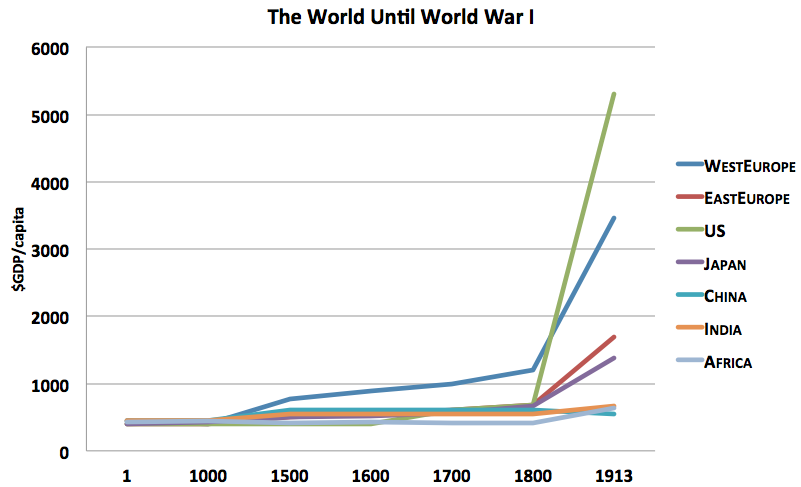

## 哲科思维 与 思维模型    
    
### 作者    
转载    
    
### 日期    
2021-02-14     
    
### 标签    
PostgreSQL , 哲学 , 科学 , 归纳 , 思维模型 , 哲科思维   
    
----    
    
## 背景    
黏贴复制  
  
## 原文  
  
https://www.jianshu.com/p/0f8688ebe8b1  
  
人类简史里面有这样一个问题，一个非常扎心问题，科学革命为什么会出现在欧洲，尤其是出现在西欧，站在历史维度说一下，科学革命之后有工业革命，工业革命之后带来了工商业文明，科学革命之前是文艺复兴，所有这一串思想科学工业和商业上变化，为什么会出现在欧洲，斯坦福历史学家曾说过，近代世界最有决定性的一件事情，是1800年左右的工业革命，我们来看一张图  
  
  
  
这张图在1800年被称为马尔萨斯陷阱，  
  
### 什么是马尔萨斯陷阱，  
  
就在农业社会的时候，每当人口暴增的时候，粮食就不够用，这时候就会产生灾难或者战争，然后人口在急剧下降，慢慢人口下降之后，粮食生产恢复，收入又起来，人口又起来，但是到了一定峰值之后又继续遭遇这样的陷阱，这里边有个大尺度，就是整个资源和人口公式你突破不了，叫马尔萨斯陷阱，人均GDP，人均产出就是那样一个点，但是到了1800年，这个曲线突然上升起来，这是一个极端性指数上升起来，1800年，工业革命诞生，  
  
为什么在这个时间段发生一场这么大革命呢，工商业文明萌芽，资本主义时代来临，人均GDP大幅上升，为什么发生在欧洲，指数级增长背后动力因是什么，  
  
科学革命起始于西欧大不列颠群岛，在此前历史上从未听说他们的重要性，无论在古罗马甚至在任何时期都被认为是蛮荒之地或者欧洲的后花园，在15世纪时中国的工业水平远远领先于西方，1775年，中国占了全世界经济总量33%，那个时候中国几乎比美国现在占的经济总量还高，而1950年以后美国加上西欧已经占了全世界50%，中国降为5%，我们看最近200多年时间发生一个巨大反差点，唐宋以前中国占技术总量60%以上，近代全世界6000条定理和定律当中，纯属中国的发明量不到1%，犹太人从来没有占世界人口1%过，但是犹太人在这里面贡献超过15%，中国人口接近占全世界人口20%，却不到1%，这就是著名的李约瑟之问，  
  
### 李约瑟之问  
  
欧洲在1770年面对中国并没有什么科技优势，为什么接下来一个世纪，拉开这么大的差距，背后原因是什么，人类简史给了一个答案，这个答案可能是最接近答案，  
  
他说中国其实并不缺乏制作蒸汽机的科技，更不缺购买技术的资金，缺的是西方最具革命性的哲学和科学的思维方式，这个是把我们和西方在近代拉开的根本性原因，  
  
  
  
### 实践是检验真理的唯一标准, 归纳法  
  
中国属于农业时代的农业大国，中国人的思维方式叫技艺思维，就是技术和艺术思维技艺思维是一种操作上试错法，我们实践操作在先，理论总结在后，这是一种典型归纳法的思维，去做，去做，行动在先，知在后，我们所有人一定会相信一句话，这句话记录在我们骨子里和灵魂里，实践出真知，没有人会意识到我们思维也被这句话给禁锢住了，就是你的视野被禁锢在实践里，只有你经验所及的地方眼见为实地方才是你的生存视野所在，但是眼见为实这个视野太狭隘了，四大发明几乎全都是偶发性的经验归纳法模式，指南针，造纸术，印刷术，火药，这个偶发性有一个特别好处就是经验中，归纳知识速度特别快，他的坏处是具有领域依赖性，不可迁移，具象思维好处是容易学，容易归纳，但是具象思维你在某A领域里面具象思维，如果你不把他抽象化，你到了B领域，你换了一个名称，你就无法识别他了，这种跨领域思维不能迁移的现象，就是因为你思维上的具象遮蔽，比如说，火药，火药能够用在鞭炮上，但是就是没有办法用在枪炮上，同样原理换了领域之后就过不去了，  
  
### 西方最具革命性的哲学和科学的思维方式  
  
再看看哲科思维是什么，近代西方人，从古希腊继承来的思维方式叫哲科思维，他跟我们方式恰恰相反，他是在逻辑上的试错法，理论假设在先，实践检验在后，演绎法思维，这种我们会感觉很别扭，他相信逻辑，相信理论，要在逻辑和理论上推演，有一句话你听到一定感觉是错的，逻辑比事实更真实，凡是在逻辑上成立的现实当中一定存在，我们的想法恰恰相反，我们认为在现实当中存在的事物一定可以找一个理论把他推通，而他特别相信逻辑，如果这件事情在逻辑上推不通在现实当中就有问题，逻辑比事实更真实，抽象思维坏处是学起来，特别慢，很慢，你每攻克一个难题，需要一代人甚至几代人努力才能攻克一个理论难题，但是他有一个巨大好处，叫做可迁移性，一旦在逻辑上导通一个共同的抽象概念，与此相关的所有具象问题，立即全部化解，逻辑是穿越具象领域的，逻辑上推通一个问题后与此相关所有具象问题立即全部化解，  
  
### 工业革命的前提是科学革命, 科学革命的前提是文艺复兴(哲学复兴)     
  
有一个著名例子可以解释，牛顿的f=ma是纯抽象，你看起来毫无用处，牛顿在推出他的三大定律时没有想他有什么用，他只是纯逻辑的推他的三大定律，而这三大定律并不是实验里边得到然后在反推成经验，反推成理论，没有，他是用欧式几何方式纯理论在基本假设之上推出来的，但是一旦f=ma推出来以后，跟力相关所有问题全部解决掉了，这也是为什么教授对牛顿那么推崇，工业革命一大前提是牛顿建立了经典力学，然后跟力相关所有问题全部解决掉，比如说，瓦特蒸汽机，瓦特是工程师，他把牛顿力用到蒸汽机上，学改良了蒸汽机引发了工业革命，所以当我们来看工业革命时候，切切不能忘掉工业革命前身是科学革命，如果没有科学革命，就没有工业革命，而有了工业革命之后，就有了昂扬向上的曲线，这就是牛顿给这个世界带来的价值，如果没有牛顿，我们今天还会生活在黑暗里，牛顿没有帮我们解决一个具体问题，他只帮我们推出了一个抽象的公式，这个公式看起来毫无用处，但是它起到巨大用处，工业革命1776年瓦特改良蒸汽机，他的前身是科学革命，1687年牛顿发表了他最著名的一本自然哲学及其科学原理，而科学革命前身大概在15世纪发生在弗洛伦撒的文艺复兴，文艺复兴，复兴的是什么，我们一直认为他复兴的是文艺，大错特错，表面上的结果是文艺，而实际上复兴的是哲学，把古希腊哲学复兴到15世纪的欧洲，然后就开启了后面的科学革命和工业革命，我们能看到哲科思维是工商业时代指数级增长的动力因这个推论非常重要，他是一个整个时代背后变化的动力因，是哲科思维  
  
### 哲科思维有什么用  
  
他对我们人类生存空间有什么用，懒蚂蚁效应，蚂蚁是高度社会化的生物，他们以集团军队方式去采集事物和生存资源，可是他们面临一个问题，如果一旦整群蚂蚁，数万，数十万，数百万到一个地方把一个地方资源采尽，整个蚂蚁群体立即面临生存绝境，因此生物学家发现，在蚂蚁群体里总有几只懒惰的蚂蚁，不随蚂蚁集团行动，他们独自飘荡在外，被生物学家称为懒蚂蚁，他们在干什么，他们是蚂蚁群里的哲学家，他们在寻求生存资源眼界以外的资源空间，他们在拓展这个空间，为蚂蚁群体下一步生存做出预备性铺垫，他们最为危险，他们甚至没有食物也没有任何安全感，他们代表者这个蚂蚁未来的生存放向，哲科思维就是这样一种调动人类生存空间的行为，它因此彰显为近代以来科学时代人类生存体系的巨大扩张和膨胀，这就是它的效用，懒蚂蚁效用  
  
### 99%的人生存在经验边界里，眼见为实，  
  
你相信你眼睛看到的东西才相信，而有这时候一种方式能打破你眼见为实禁闭，叫思维模型，但是思维模型思考的人又会产生一种边界，这是一种理性的边界，思想的边界，一种认知的边界，这句话的意思是说即使你是理性思考的人也会形成你理性本身的禁闭，这种禁闭用什么去打破，用理性本身已经无法去打破了，有且仅有一种办法叫做哲科思维，哲科思维才能打破这种禁闭一旦打破这种禁闭之后，你的身生存空间是原来十倍到100倍，哲科思维起源于2500年前古希腊，只有古希腊的哲学才被称为狭义哲学，我们平常口语话的哲学是广义哲学，你吃饭喝酒都叫哲学，古希腊人有种很奇怪想法，我们迄今为止都相信眼见为实，但2500万年前古希腊人有一种奇怪想法，你眼睛所看到的一切都是流变的假象，你眼睛所看到的流变假象背后有一种支配力量，是一种不变的恒定的不可分的东西，他把那个东西称为本体，认为这世界真正存在的是那个东西，这叫眼见为虚，认为眼睛尺度太小，而思想的尺度才是大的，古希腊哲学家对现象总是寻求合乎理性，而不是将其简单归纳于上帝或其他超自然物，致力于探索一种终极原因或要素，然后其他所有要素是从这种要素推出来的，他并不是说这件事情是神决定的或者怎么样的然后放在黑盒子里就不说了，他是一定要有解释，这个思维方式叫做追究终极，就是一定要追到头，对眼前事情没兴趣，而是什么东西引发了眼前事情，眼前东西是由什么东西演化出来的，对那个头感兴趣，这也是一种特别奇怪思维方式，我们中国人到今天也没有这种思维方式，当2500万年那些智者提出的物种起源不是有神创造的，而是由物质所构成的，即便那时候说的物质很粗糙，但也宣告古希腊文明脱离了神话时期，进入理性时代，对他进行理性的解释，当你把这个解释归结于神或者任何一个超自然因素时候，其实表明你放弃了对他的追究，神就不追求了，你就不追究了，而古希腊人说这不对，他打破神这个逻辑基点，神是什么意思，古希腊人最伟大的哲学贡献叫本体论  
  
眼睛所看到的知识，只是浅层知识，你真正知识是思想看到的，今天物理学最先进的夸克只存在我们思想里，而不存在我们的眼睛里，现在还相信眼见为实吗，我们不是生活在眼睛所关照的世界，而是生活在思想所关照的世界，今天这个时代如果我们不会用思想，就像猴子时代不会用眼睛一样，在动物的时代我们靠捕捉食物为生，你眼睛看不见你活不下来，在今天这个时代如果你思想想不到，你就不一定能很好生存，仅此希望打破对知识层次的理解，那可惜我们只相信眼睛为实，尤其身边案例对我们的影响远超于抽象理论，我们不相信道理，听过很多道理也依然过不好这一生，这句话充满了对理论道理的嘲讽，我们讲究具体问题具体分析，一旦原则遇到具体情况之后的时候，原则立刻分崩离析，这完全不是以原则为导向  
  
### 老子是中国唯一一位例外，  
  
他在追究终极学问，他给起了个名字叫道，有物混成，先天地生，寂兮廖兮，独立而不其改，周行而不殆，可以为天地母。吾不知其名。强字曰：道。人法地，地法天，天法道，道法自然，最后自然其实就是自己的意思，那个抽象道是指导所有具象世界东西，道生一，一生二，二生三，三生万物，老子是中国唯一哲学家，但是老子缺乏证明系统，道更像是比喻或类比，无法进行逻辑推演，缺少终深追问和精密逻辑求证，最后终成玄学，为什么中国人擅长具象思维，有一种解释是跟语言有关中国思想长于具象思维，而不是在逻辑推导，这与象形文字长期思维训练密不可分，甲骨文中，旦、朝、早、日、暮，一看就知其意，这种方式非常快捷迅速敏捷，但是我们看一首诗，枯藤老树昏鸦，小桥流水人家，古道西风瘦马，夕阳西下，断肠人在天涯，充满意境，文化三大要素，第一要素是生存结构，就是你所生存环境，第二为了适应你的生存结构，你会生成一种独特思维方式，你的思维方式早期的时候促进了你的生存结构的发展，但是你的生存结构发生了变化，而且越变越糟，这时候你的思维本身却不能发生变化，到了第三阶段时候你过去生存方式，反而变成了对你构成了戕害作用，把他叫做思维遮蔽效应，这个循环是非常重要的，有且只有一种办法可以改变.......  
  
未完待续  
  
## 思维模型研习手册  
## 原文  
  
https://www.jianshu.com/p/247323aee309  
  
### 1. 常用思维方式  
  
#### 1) 系统思维  
  
以系统论为思维基本模式的思维形态，它不同于创造思维或形象思维等本能思维形态。系统思维能极大地简化人们对事物的认知，给我们带来整体观。  
  
#### 2) 综合思维  
  
使用各种帮助思维的工具得出结果，用各种不同的方式对事物进行思考，诸如身体、直觉、感官、精神和智力等。  
  
#### 3) 宏观思维  
  
思维宏大深远，考虑问题统筹兼顾，具有极强的大局观和整体观，善于运用宏观手段解决微观问题。  
  
#### 4) 逻辑思维  
  
符合某种人为制定的思维规则和思维形式的思维方式，是人脑的一种理性活动，思维主体把感性认识阶段获得的对于事物认识的信息材料抽象成概念，运用概念进行判断，并按一定逻辑关系进行推理，从而产生新的认识。  
  
#### 5) 辩证思维  
  
以变化发展视角认识事物的思维方式，通常被认为是与逻辑思维相对立的一种思维方式。在逻辑思维中，事物一般是“非此即彼”、“非真即假”，而在辩证思维中，事物可以在同一时间里“亦此亦彼”、“亦真亦假”而无碍思维活动的正常进行。  
  
#### 6) 批判性思维  
  
一种基于充分的理性和客观（批判性思维基于充分的理性和事实、而非感性和传闻来进行理论评估与客观评价的能力与意愿。）事实而进行理论评估与客观评价的能力与意愿，它不为感性和无事实根据的传闻所左右。  
  
#### 7) 逆向思维  
  
与常人的思维取向相反，训练一种小概率思维模式，即在思维活动中关注小概率可能性的思维。  
  
#### 8) 发散思维  
  
大脑在思维时呈现的一种扩散状态的思维模式，比较常见，它表现为思维视野广阔，思维呈现出多维发散状。  
  
#### 9) 灵感思维  
  
本质上就是一种潜意识与显意识之间相互作用、相互贯通的理性思维认识的整体性创造过程，是一种高级复杂的创造性思维理性活动形式，是逻辑性与非逻辑性相统一的理性思维整体过程。  
  
#### 10) 形象思维  
  
以具体的形象或图像为思维内容的思维形态，是人的一种本能思维，其内在的逻辑机制是形象观念间的类属关系，通过独具个性的特殊形象来表现事物的本质。  
  
#### 11) 抽象思维  
  
观看或思考某种复杂事物，去粗取精，化繁为简，把唯一本质的东西找出来。思维抽象概括，逻辑严谨周密，注重定量分析，考虑问题客观中立，不带任何主观情绪，可以避免因主观臆想的影响而干扰正确的思路。  
  
#### 12) 类比思维  
  
虽然两件事物迥然不同，但可以从功能上找到相同点。  
  
抽象化  
  
抽象化是类比思维的第一步，是指透过具体现象的表象，深入提炼现象本质。  
  
相似性识别  
  
对源领域和目标领域在解决方案的表面相似性和结构相似性方面进行识别。  
  
调整和适应  
  
每个行业或每个企业都有其产品和市场方面的独特性，识别源领域与目标领域的差异是调整策略的重要依据。  
  
#### 13) 想象思维  
  
使用某些或全部感官在心里创造各种形象，思维无拘无束，灵动跳跃，敢于大胆突破常规自由构想，不受逻辑法则的约束，不受现实法则的约束，能够虚拟想象现实中不存在的事物，能够超前想象未来的情境。  
  
#### 14) 躯体思维  
  
使用肌肉、肠胃的感觉以及各种感情状态。  
  
#### 15) 动态思维  
  
思维以动态逻辑为界面，凡事喜欢追本溯源，善于通过把握事物的本质和核心来解决问题。  
  
#### 16) 层次思维  
  
能把情绪变成不同的层次，就像把素描改成雕塑一样。  
  
#### 17) 结构化思维  
  
以事物的结构为思考对象，来引导思维和表达过程的一种思考方法。所以这里面的关键词是“结构”。在无结构问题上加一个框架。有了思维结构不仅能够帮助分析师从宏观层面了解这个问题，还能帮助他们发现需要进一步了解的细节之处。结构化思维让我们把想法组织成结构化模式，然后我们就可以找到哪些地方需要我们重点投入精力。  
  
主题鲜明  
  
主题鲜明指的是，我们在表达想法的时候，需要有清晰的观点。  
  
归类分组  
  
原则1：每层次的思想属于同一范畴  
  
原则2：每层次的思想之间相互独立，不要重叠  
  
逻辑递进  
  
#### 18) 归元思维  
  
思维天真活跃，对常规、常识充满了好奇心和求知欲，思考问题时常常幼稚且无逻辑性。让思维返朴归真，让头脑自我否定，重新归零，以“无知”的心态去认识熟悉的事物。  
  
#### 19) 横向思维  
  
为老问题寻找新解决方案  
  
确定问题  
  
运用幽默、随机排列和对流行观念的挑战来制定横向思维解决方案  
  
对找到的各种想法加以适当的提炼和取舍  
  
#### 20) 水平垂直思维  
  
宏观和微观相结合、整体全局和重点相结合的思维方法的一个综合运用。水平思考法是从整体到局部由大及小的思维方法，是一个整体的概貌的了解；垂直思考，是对部分进行深度的分析。  
  
水平思考就是自己全面的、全方位的、综合性的、长远的思考；垂直思考考虑当下，我自身的具体的、个别的特点，我最希望做什么，我最能做什么，我最能做好什么，比较具体的来考虑。  
  
#### 21) “发散思维（Divergent Thinking）  
  
又称辐射思维、放射思维、扩散思维或求异思维，是指大脑在思维时呈现的一种寻找众多可能解决方案的扩散状态的思维模式，它表现为思维视野广阔，思维呈现出多维发散状。  
  
#### 22) 收敛思维（ConvergentThinking）  
  
又称聚合思维、求同思维、辐集思维或集中思维。特点是使思维始终集中于同一方向，使思维条理化、简明化、逻辑化、规律化。收敛思维与发散思维，如同‘一个钱币的两面’，是对立的统一，具有互补性，不可偏废。  
  
### 2. 常用的分析方法  
  
#### 23) 场景分析  
  
通过考虑各种可能发生的结果，分析未来的可能发生事件的过程。通过考虑分析各种结果及其影响，情景分析可以帮助决策者做出更明智的选择。  
  
#### 24) 换位思维  
  
从别人角度想问题：如果我是他，我会怎么想？  
  
我毕竟不是他，以他的性格和价值观，他会怎么想？  
  
（直接问他）你怎么想？  
  
#### 25) 内省思维  
  
反思自己：我是不是太作了？太自我膨胀了？  
  
我是不是得过且过了？  
  
我是不是太软弱了？  
  
我是不是轻重缓急不分了？  
  
为什么成功（或失败）？  
  
哪些外在因素？哪些自身因素？  
  
可否归因为自己知识？技能？经验？能力？努力？策略？  
  
从中学到了什么经验教训？  
  
以后怎样做得更好？  
  
我要什么？  
  
我最在意什么？  
  
我是谁？  
  
什么是我做人做事的底线？  
  
#### 26) 前瞻思维  
  
什么会改变？  
  
现在该做什么准备？  
  
#### 27) ）保留可能性（Preserving Optionality ）  
  
保留灵活选择权的一种策略，在所有不确定性得到解决之前克制太快做决定的冲动。  
  
#### 28) 目标-手段思维  
  
为什么？  
  
怎么做？  
  
  
## 推荐  
  
https://www.jianshu.com/u/b3fc1c166baf  
  
王东岳   
  
  
  
  
#### [PostgreSQL 许愿链接](https://github.com/digoal/blog/issues/76 "269ac3d1c492e938c0191101c7238216")
您的愿望将传达给PG kernel hacker、数据库厂商等, 帮助提高数据库产品质量和功能, 说不定下一个PG版本就有您提出的功能点. 针对非常好的提议，奖励限量版PG文化衫、纪念品、贴纸、PG热门书籍等，奖品丰富，快来许愿。[开不开森](https://github.com/digoal/blog/issues/76 "269ac3d1c492e938c0191101c7238216").  
  
  
#### [9.9元购买3个月阿里云RDS PostgreSQL实例](https://www.aliyun.com/database/postgresqlactivity "57258f76c37864c6e6d23383d05714ea")
  
  
#### [PostgreSQL 解决方案集合](https://yq.aliyun.com/topic/118 "40cff096e9ed7122c512b35d8561d9c8")
  
  
#### [德哥 / digoal's github - 公益是一辈子的事.](https://github.com/digoal/blog/blob/master/README.md "22709685feb7cab07d30f30387f0a9ae")
  
  

  
  
#### [PolarDB 学习图谱: 训练营、培训认证、在线互动实验、解决方案、生态合作、写心得拿奖品](https://www.aliyun.com/database/openpolardb/activity "8642f60e04ed0c814bf9cb9677976bd4")
  
  
#### [购买PolarDB云服务折扣活动进行中, 55元起](https://www.aliyun.com/activity/new/polardb-yunparter?userCode=bsb3t4al "e0495c413bedacabb75ff1e880be465a")
  
  
#### [About 德哥](https://github.com/digoal/blog/blob/master/me/readme.md "a37735981e7704886ffd590565582dd0")
  
