## [转载] 科技是唯一可叠加式进步的动力 - 吴军: 全球科技通史  
  
### 作者  
转载  
  
### 日期  
2021-02-17  
  
### 标签  
PostgreSQL , 全球科技通史 , 吴军   
  
----  
  
## 背景  
原文:  https://blog.csdn.net/DP29syM41zyGndVF/article/details/89838782  
  
上周， 在北京举办的《全球科技通史》新书发布会上，吴军博士为读者们带来了《科技的力量和叠加效应》的主题演讲。他从工业革命给人类带来的收入、寿命和思维方式的转变开始，讲述了科技的叠加进步，给人类文明的贡献；并通过讲述科技史上关键人物的故事，告诉我们成功的必然性规律；提出使用科学的方法去叠加自身的技能，站在前人的贡献上获得叠加式进步的动力。  
  
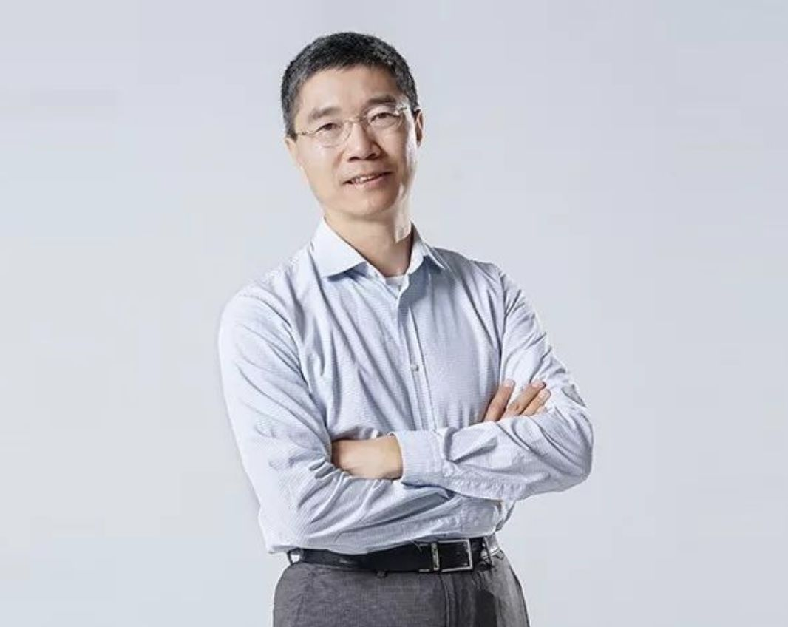  
  
吴军博士，知名的自然语言处理和搜索专家，硅谷风险投资人。曾担任谷歌资深研究员，并设计了中日韩文搜索算法以及谷歌自然语言分析器。他的著作《数学之美》荣获国家图书馆第八届文津图书奖、第五届中华优秀出版物奖，《文明之光》被评为2014年“中国好书”，《浪潮之巅》荣获“蓝狮子2011年十大极佳商业图书”奖，《智能时代》开启了2016智能时代元年。  
  
### 科技是唯一可叠加进步的文明动力  
  
  
如果有人问我人类历史上最伟大的事件是什么？  
  
我会毫不犹豫的回答，工业革命，没有之一。  
  
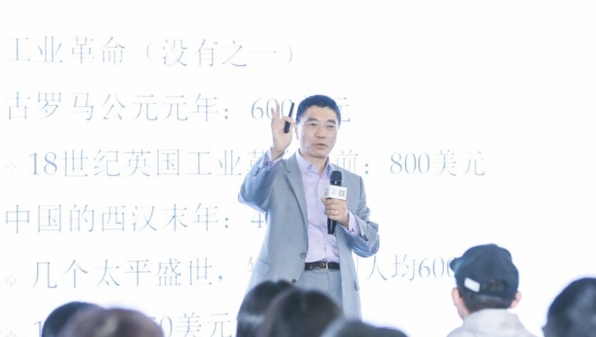     
  
有人可能会问为什么不是秦始皇统一中国？为什么不是第二次世界大战反法西斯的胜利，为什么不是奥古斯都大帝建立罗马帝国？  
  
原因很简单，如果不是工业革命，无论是哪一种文明、政治制度、宗教，在工业革命前的2000年，人类的生活是没有什么进步的。我们可以从收入、人均寿命和人们的思维方式的转变三个方面来说明为什么是工业革命。  
  
### 收入的巨大增长  
  
根据英国著名历史学家麦迪逊的研究，在公元元年，罗马帝国的人均GDP大约是600美元，这是根据每天劳动获得的粮食来衡量折算成货币所得出的。在工业革命之前，即瓦特改良蒸汽机的1776年以前，英国人民人均GDP才800美元。30%的增长用了约1800年。但今天的英国人均GDP已经达到4万多美元。  
  
  
  
中国的历史上不乏伟大的君主、忠臣，也不缺有效的政治改革经济改革，但事实是从公元元年的450美元一直到建国初期，我国人均GDP始终保持在这个水平。改革开放前，我们的人均GDP也不过800美元。经历了40年的改革开放，今天我们的人均GDP上涨了近10倍。  
  
  
  
### 人均寿命的延长  
  
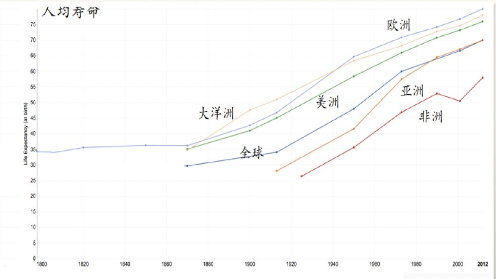  
  
  
  
人类历史上总共经历了两次人均寿命翻一番的现象，一次是农耕时代的开始，花了一万年时间；另一次就是工业革命，人类的平均寿命从30～35岁，逐渐增加到65～70岁，大致翻了一番。  
  
### 思维方式的转变  
  
  
  
我们学会了透过现象看本质。举个例子，如果告诉轨道和车的每个细节，轨道半径、每一个弯曲的高度，你能算出车速么？  
  
  
  
  
  
有可能你会一步步算，有时会加速、减速，中间如果有一个环节错那结果就是错的。但还记得中学物理只要知道这个公式就可以了。  
  
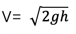  
  
不论中间多么复杂，知道一头一尾就能算出。那么多贤明君主、宰相、伟大将领的故事，他们之间相互作用就全取消掉了，如同过山车，一会儿向上走，一会往下走，就那么一点势能，因为缺科技。历史总在重演，科技却在叠加式的进步。  
  
  
  
就像写诗，我们很难超过李白、杜甫、莎士比亚；也很难有作曲家说自己的水平达到了贝多芬莫扎特的水平；但牛顿花了几十年的研究成果你可能半年就学会了，欧几里得写的几何原本你可能上过小学就能知道基础了，这就是科技史与文学、战争和艺术的不用，它可以给我们带来叠加式的进步。  
  
  
  
举个贴近生活的例子，在北上广生存，你必须要有可叠加的进步。假设一套房子1000万，一年涨3%即30万，一个刚毕业的学生假设最多能拿20万，但如果一直是这个水平，那么你永远支付不起一套房子。  
  
<b>但为什么房价一直涨还会有人买，那是因为有人的工资随着你的技能叠加也在正在指数的增长，进步是可叠加的，这个思维很重要。</b>  
  
  
  
<b>如果你今天做了一件事，对你来讲，没有可叠加的进步，你就不要去做它，因为你这是浪费生命。你越做多一件这个事儿，你就越离北京买房子就远一步，比如说你没事花太多的时间刷朋友圈。</b>  
  
  
  
如果说阿基米德发明了杠杆定理以后，促进了机械的发明；那真正的对后世产生重大影响的就是瓦特，通过科学来指导技术的。  
  
  
  
大家都知道工业革命代表性的发明就是蒸汽机，而在瓦特蒸汽机出现之前，纽卡门蒸汽机已经存在50年了，虽然笨重效率又低，但并没有人想过改进它。和中国古代瓷器、上釉技术的发明一样，也许工匠灵光一现就创造出来了，这些技艺并不具备成功的可复制性。  
  
  
  
而瓦特当时旁听了大学所有的高等数学课，物理课，且经常和教授讨论问题，偶然一次大学的蒸汽机坏了，没有做过蒸汽机的瓦特凭借着积累的科学基础改进了蒸汽机。这是人类历史上用科学技术主动来指导发明开端。  
  
  
  
如果说牛顿找到了开启工业革命的大门的钥匙，那么瓦特就是拿这个钥匙开启了工业革命的大门。  
  
  
  
### 从工业革命之后，人类开始变得自信。  
  
  
  
工业革命本身就是一个思维的革命，什么是思维的革命？简单来说就是你不在求助于上帝、神灵、菩萨等，而是用自己的学识了解世界。比如通过学习物理学你就可以发现宇宙运动的规律，当你的技能可以得到每年20万、40万的工资上涨时，你就对自己在北京买房更加有自信。工业革命之后，人类开始变得自信。  
  
### 瓦特的朋友圈和创业之路  
  
<b>瓦特之所以能够改良蒸汽机还有一个原因，他有一个小圈子，叫月光社。这个组织既神秘也不神秘，神秘是因为有一群人，他们总在月圆之夜跑到伯明翰去聚会，说它不神秘，其实也不是什么宗教活动，而是大家一起讨论科学问题。</b>  
  
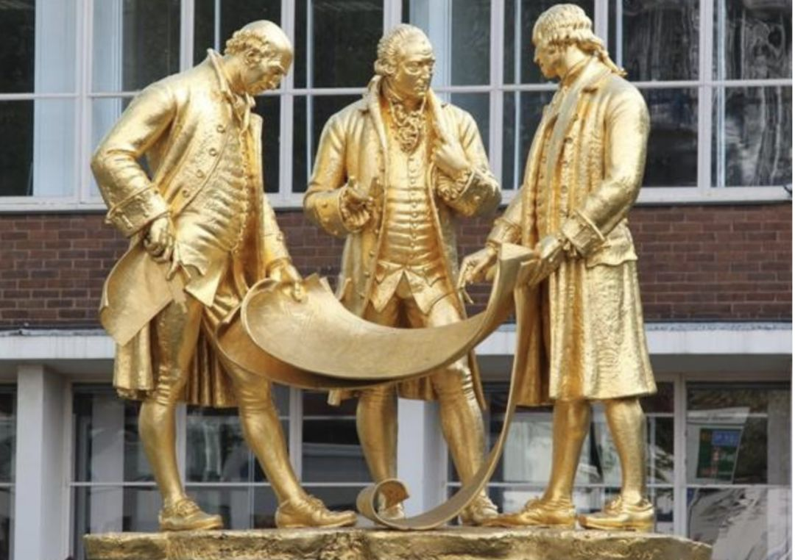  
  
  
  
其中有一个企业家叫韦奇伍德，达尔文的爷爷，也是英国著名的瓷器制造商，他家的瓷器也是献给乾隆皇帝的礼物之一。化学之父拉瓦锡，美国有两个国父，富兰克林和杰克逊他们俩也是月光社的，所以月光社绝对是当时全世界最精英的群体，瓦特有幸成为其中的一员。  
  
  
  
瓦特创业初期，祸不单行，投资他的企业家破产，妻子去世，一度陷入绝望。当时俄国女沙皇叶卡夫琳娜伸出援手，想招他去俄国。  
  
  
  
但英国推行一套鼓励发明创造的机制，把瓦特留在了英国，这一套机制就是专利制度。所以对知识产权的重视，是英国能够真正腾飞的一个重要原因。  
  
  
  
<b>因为重视保护知识产权，企业家愿意投资有专利技术的人来一起做事情，如果不保护这个知识产权专利，就很难吸引投资了。抄的时候一时痛快，但从长远角度来说，像瓦特这样的人才可能就留不住了。</b>  
  
  
  
最早支持瓦特的博尔顿破产以后，他把工厂卖了来支持瓦特研发蒸汽机。他和瓦特说，你不用担心钱的问题，蒸汽机就是将来工业革命的动力，它就像一个未出生的婴儿，而我来给你当助产士。博尔顿倾其所有精力和财力使瓦特的蒸汽机梦想成为现实，同时也占用了瓦特三分之二的专利权。  
  
### 可复制性的成功  
  
  
历次工业革命谁最受益？从蒸汽机的改良到电的出现，再到计算机的普及，我们或许可以从这些人的的故事中得到启发。  
  
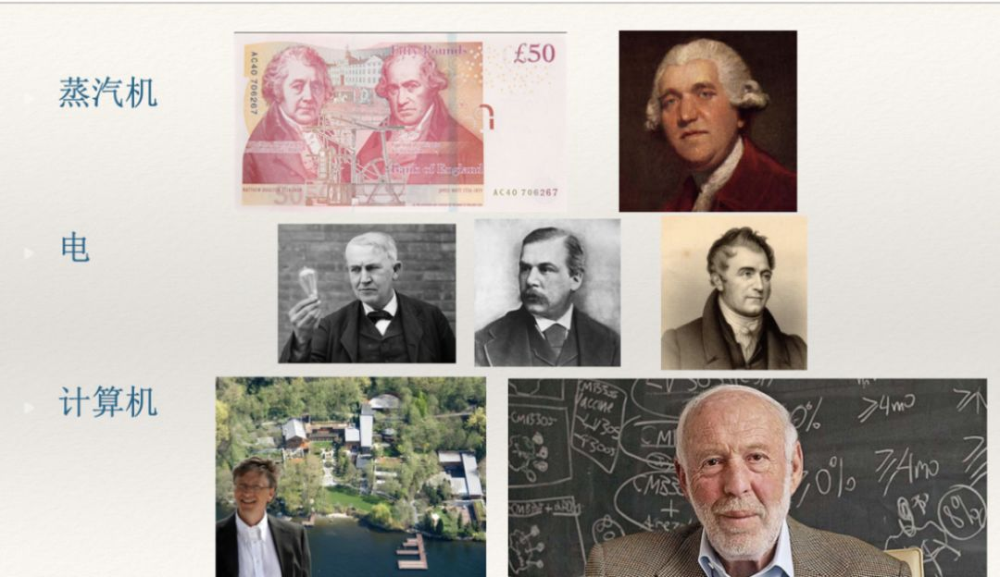  
  
瓷器大王  
  
  
  
还记得月光社成员之一的韦奇伍德，也就是后来的瓷器大王。他第一次把蒸汽机用在了瓷器制造上，从此瓷器这个在过去被认为白色黄金的物品，在欧洲由供不应求变成供大于求。东西多了要销售出去呀，这也就促成了新的商业模式的出现——精品展示店。我们今天所看到的LV， Gucci的展示店也是这么发展而来的。  
  
现在在高端的购物中心，一个盘子一千多块的很可能就是韦奇伍德瓷器。  
  
  
  
  
  
工业革命谁受益？博尔顿和瓦特是掌握核心技术的受益者，而旁边的韦奇伍德却是使用这项核心技术的赢家。当时在欧洲没有多少人制造蒸汽机，但是有很多人使用蒸汽机。  
  
  
  
### 天使投资人  
  
  
  
第二次工业革命的时候，核心技术是什么？是电，这个我们知道，谁掌握电？美国有爱迪生，有特斯拉，德国有西门子，那么他们无疑都是电的发明受益者。爱迪生尤其是最大受益者之一，现在的GE通用电气，爱迪生也相当于创始人。特斯拉也从专利上挣了天文数字。还有我们所熟知的JP Morgen，用今天的话说，他应该是最成功的天使投资人。  
  
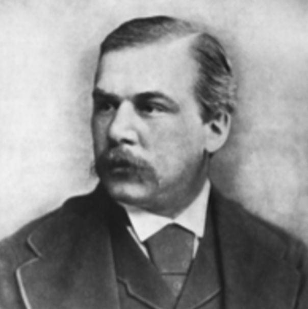  
  
他投了爱迪生，投了特斯拉。最后因为意见分歧，他希望特斯拉用无线电传输，而特斯拉非要用无线电输电(PS: 是不是有错误?)，结果JPMorgen撤资，投了意大利马可尼。他发明了无线电传输的收音机，也因此获得了诺贝尔奖。  
  
  
  
### 化工大王  
  
  
  
在电出现之前，我们今天的80%的产业都已经有了，比如交通、城市建设等。但电的出现促生了新的产业——化工。很多人都说现在餐馆的菜是用化肥农药养出来的，可是在历史上，在没有化肥时期农民却是吃不饱肚子的。19世纪的人口都不到现在的三分之一，在电出现之前就有，当时是用蒸汽机来制造氨，但合成氨效果很差。电出现以后，整个化学工业，特别是化肥工业和农药工业，就得到了很大的发展。这个化肥和农药的出现，才使我们人类吃饱了肚子。  
  
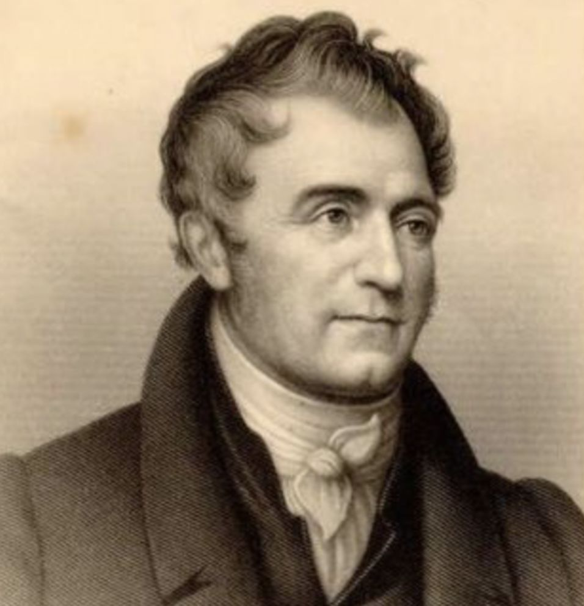  
  
  
  
杜邦，美国的化工大王，他既没有发明电，也不懂电，但他只知道一条，要用电。这就是成就了他一世英明。  
  
### 股神数学家  
  
到第三次技术革命，也就是信息技术的发展。核心是计算机、半导体甚至可以算上摩尔定律。  
  
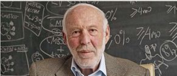  
  
  
  
这个时期的受益者,大家比较熟悉的应该就是微软的比尔盖茨，而这位可能不太有人知道，他叫詹姆斯·西蒙斯，是一位纯数学家，杨振宁给清华拉赞助就找到这个富翁，为清华捐了一栋楼。他用IT技术办了一家对冲基金的公司，叫文艺复兴技术公司。虽然成立时间短，但每一年37%的回报率却高于巴菲特。  
  
  
  
詹姆斯·西蒙斯是纯数学家，不懂得计算机的技术，但是他知道用这个技术，所以它雇了数学家和物理学家做模型来做股票交易。用人工智能的方法做股票交易，发了大财，也让一个数学家成为了全世界最富有的人之一。  
  
  
  
### 颠覆式创新微软  
  
  
  
60年代的计算机产业，是由IBM领头的。当时这个产业有个说法叫“白雪公主和七个小矮人”，白雪公主是指IBM，七个小矮人是指GE、CBC等没办法跟IBM竞争的公司。加上DEC和惠普，这九家公司谁都不知道怎么打败IBM。  
  
  
  
到了70年代，摩尔定律使得计算机处理器芯片的处理能力有了比较大的提高，就出现了一种很原始的PC机或者微机。这样的计算机当时有一些发烧友买，用来控制酷炫的灯光，没有大的实际用处，性能也很差，和IBM的大型机没法比。  
  
  
  
后来有一个小伙子说你们大家用这个小PC机实在太困难了，我给你们写一个Basic的程序，这个人就是比尔·盖茨。  
  
  
  
因为摩尔定律能够帮助微软打败IBM。根据摩尔定律，芯片处理器、存储机这些硬件，性能每18个月翻一番。这个规律对于PC小型机的进步帮助非常大的。  
  
  
  
我们很难成为瓦特、爱迪生和比尔盖茨，但换一个角度，成为韦奇伍德，成为杜邦和西蒙斯还有可能的。你今天要了解硬核的人工智能技术比较难，但是你说把它用好，还是有可能的。  
  
  
  
掌握核心科技的人只有2%，受益者其实很少，但是剩下98%的人有一个分类，一类人固守现状，而另一类则赶快使用新技术。你要利用好某个技术，你的成功才是可以叠加和复制的，你在原创性发明人的基础上才会更进一步，后者就有可能赶上历史的快车，这是我们从历代工业革命和科技发展中找到一个规律。  
  
### 真正的发明是从0到N的过程  
  
  
也许看到这你会感叹自己能力的不足，对于瓦特、比尔盖茨这类大神真的是望尘莫及。那么你更应该读历史，了解科学，因为这些成功都不是偶然事件，而是必然事件。  
  
  
  
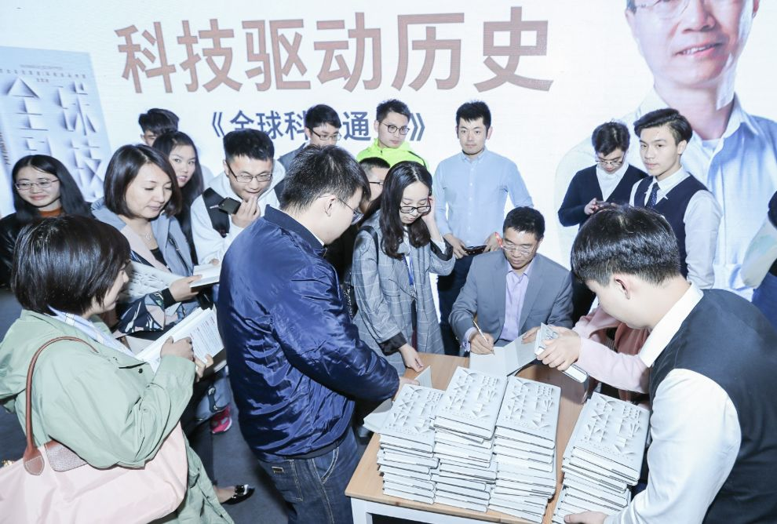  
  
  
  
### 科学如何让你进步  
  
  
  
1930年就开始研究中国科技史的李约瑟给大家留一下一个谜题，中国古代科技发达，为什么没有诞生工业革命，为什么没有诞生近代科学？本身李约瑟本身这个问题有问题，他偷换一个概念，他把科学这个词给换掉了，中国古代有技术很先进没得说，但有科学吗？  
  
  
  
<b>科学有广义上和狭义上的含义。广义上的科学就是说，任何一个能自洽的一个体系，可验证的自洽体系。狭义上的科学是源于古希腊那种，通过思辨逻辑、假设前提，得到结论，并且通过实验验证自己结论的体系。按照狭义的解释来说，中国是没有科学的，中国有《本草纲目》，广义上的博物学这可以算科学。但是科学重要的不是一个结论，而是一个方法。</b>  
  
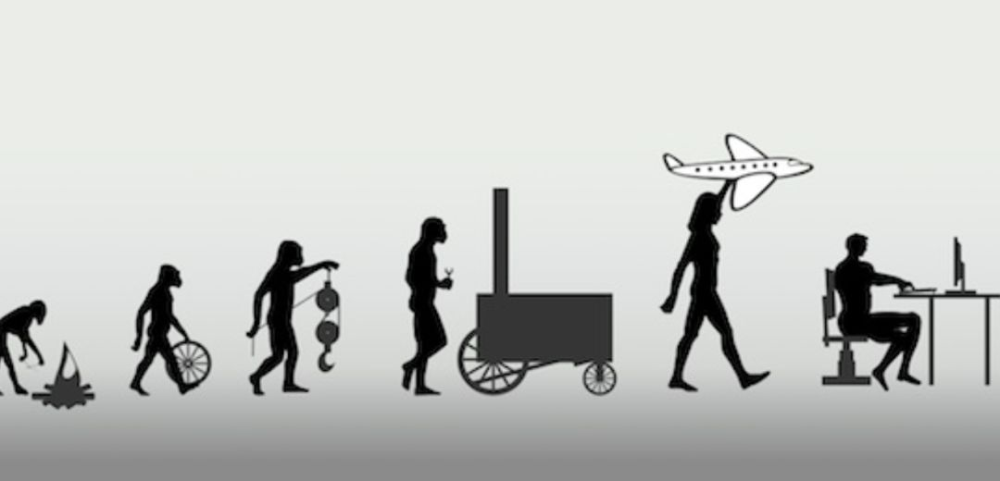  
  
今天我们对科学很多误解，把科学等同于正确。  
  
举个例子，第一个结论，明天太阳从西边出来；第二个结论，明天要不然下雨或者不下雨，哪个是科学结论？第一个可以证伪，第二个无法验证。  
  
如果你说假如没有吴老师，就不会有《全球科技通史》这本书，这是科学结论吗？  
  
不是。因为一个错误的前提，可以得到任何合理的结论，合乎逻辑的结论。  
  
所以科学和正确不能划等号。  
  
  
### 那么科学是什么？科学重要性在于什么？  
  
<b>科学重要的是一套方法，用这套方法，我们可以过滤出那些不正确的东西，保留出这些有价值的东西。保留出这些有价值的东西以后，是否都正确，不知道。</b>  
  
联想一下PG 的 bloom, 错,一定错, 对,不一定对.   
  
<b>可能我们还要有更好的科学方法进一步的研究，把里头有一部分正确东西挑出来，错误的东西抛出去，经过一次次迭代，随着我们知识增加，见识上涨，我们越来越接近于真理，这是科学本身的作用。</b>  
  
  
### 所以说科学家，其实是一个很悲催的职业。因为当你提出一个结论，你就向全世界科学家说，请你来证伪我的结论。  
  
### 笛卡尔的方法论  
  
  
  
笛卡尔总结科学的发展，他说了这么几条，也就是说你遵循这几条规律，就能找到一个很好的办法。  
  
  
  
#### 提出问题  
  
  
  
提出问题比解决问题更重要，你只有提对了问题才能解决问题，减少不必要的时间精力的浪费。最早在人工智能领域提出问题，就是今年得了图灵奖的几个深度学习科学家，今天说中国人工智能的论文超过美国，可加起来都没那三个科学家的贡献大。  
  
  
  
#### 实验研究  
  
  
  
提出问题很重要，但也需要解决问题。在笛卡尔之前，有一种叫经验哲学，你可以根据经验得到结论。阿奎那其实是一个很了不起的思想家，他第一次把科学和神学结合起来，写了一本书叫《神学大全》。他的所有研究考据，就是看看《圣经》里有没有答案，看看亚里士多德有没有说这些话。笛卡尔说这样不行，你必须进行实验，进行各种各样的尝试。  
  
  
  
#### 得出理论  
  
  
  
光有结论没有解释是无法得到理论，而这个理论是可以用在很多地方的。你得到地球围绕太阳转，但你需要知道万有引力、椭圆运动等等。例如哈雷利用牛顿的理论测算哈雷彗星73年会回来，虽然他没有看到，但却是实现了。理论可以举一反三，这就是科学的作用。  
  
  
  
#### 再次提出问题  
  
  
  
当你预知理论后，你需要不断的提出问题，解决问题。我们无法完全了解新的技术发展，但根据科技发展的历史，我们可以不断的提出问题并解决，这样人类的知识就获得了可叠加的进步。笛卡尔说按照这套方法来做事情，成功就是个大概率事件，而不是随机偶然的。  
  
  
  
科学的进步实际上真正起源于近代，具体讲就是笛卡尔以后，笛卡尔有了牛顿莱布尼茨，还有柯西、拉格朗日，黎曼，到本世纪初有希尔伯特，我们高等数学、物理建立起来了，到近代有计算机科学的技术，科学不断的发展。为什么近代突然科学大爆发，因为方法对了。  
  
  
  
### 荣誉属于最后一位发明者  
  
  
  
青霉素的发明创造就是一个从0到N的过程，不是简单从0到1的过程。弗莱明与弗洛里和钱恩也因此获得了诺贝尔奖。可他们并不是第一人，早在唐朝，裁缝们就知道酱抹在手上可以杀菌，却缺乏科学的理论。根据笛卡尔的方法论，你需要先上升到理论，青霉素为什么能杀死细菌？因为它含有一种叫青酶烷的物质，这是青霉素发现的原理，知道这个原理以后，你可以稍微改变青霉素来发现新的抗生素。  
  
  
  
当然你必须知道青霉素的分子结构，科学家霍奇金用X光衍射发现了青霉素分子结构，她也获得诺贝尔奖，发现青霉素以后，人工能合成青霉素，不用养霉菌了，这是科学进步的过程。以前诺基亚也做智能手机，到乔布斯发明智能手机后，你在做出同样的东西就不叫发明了，所以荣誉给最后一个发明人。  
  
  
  
这些发明的过程，一步一步都是非常坚实的过程，每个人在其中为后人奠定可叠加式进步的阶梯。  
  
### 总结  
  
首先，我们生活在这个时代是很幸运的，我们在三次工业革命的基础上进行科技叠加，如果不好好做出点成就真的辜负了前人170代人的努力。  
  
其次，成功不是偶然事件，必然性的失败要比偶然性的成功要好。从每次工业革命的受益人可以总结得出规律。  
  
  
最后，发明不是0到1的过程，而是一个非常非常漫长的过程，我们要学会运用科学的思维和方法去提出问题、解决问题。不要为现在的自己而感到沮丧，从0到N的路上，你仍然有机会，荣誉属于最后一个发明人。  
  
  
人生相当于一条河，一辈子可以留下两个东西，也是我的幸福来源。一个是你传递后代，你会由衷感到高兴；另一个就是留下遗产，这个遗产其实不是物质遗产，留下的那点钱，换算到今天，都值不了什么钱，实际上是一种精神遗产。你总要对社会有正向的贡献，哪怕贡献很小，后代才能在你的基础上再往前走一步，才可以获得叠加式进步。  
  
## 划重点  
  
1、做可叠加的事情很重要  
2、圈子很重要  
3、科学有广义上和狭义上的含义。广义上的科学就是说，任何一个能自洽的一个体系，可验证的自洽体系。狭义上的科学是源于古希腊那种，通过思辨逻辑、假设前提，得到结论，并且通过实验验证自己结论的体系。按照狭义的解释来说，中国是没有科学的，中国有《本草纲目》，广义上的博物学这可以算科学。但是科学重要的不是一个结论，而是一个方法。  
4、可能我们还要有更好的科学方法进一步的研究，把里头有一部分正确东西挑出来，错误的东西抛出去，经过一次次迭代，随着我们知识增加，见识上涨，我们越来越接近于真理，这是科学本身的作用。  
5、科学的方法很重要  
6、文艺复兴是哲科思维的复兴, 哲科思维是工业革命之母  
7、科学和技术结合就是实用的科技  
  
  
#### [PostgreSQL 许愿链接](https://github.com/digoal/blog/issues/76 "269ac3d1c492e938c0191101c7238216")
您的愿望将传达给PG kernel hacker、数据库厂商等, 帮助提高数据库产品质量和功能, 说不定下一个PG版本就有您提出的功能点. 针对非常好的提议，奖励限量版PG文化衫、纪念品、贴纸、PG热门书籍等，奖品丰富，快来许愿。[开不开森](https://github.com/digoal/blog/issues/76 "269ac3d1c492e938c0191101c7238216").  
  
  
#### [9.9元购买3个月阿里云RDS PostgreSQL实例](https://www.aliyun.com/database/postgresqlactivity "57258f76c37864c6e6d23383d05714ea")
  
  
#### [PostgreSQL 解决方案集合](https://yq.aliyun.com/topic/118 "40cff096e9ed7122c512b35d8561d9c8")
  
  
#### [德哥 / digoal's github - 公益是一辈子的事.](https://github.com/digoal/blog/blob/master/README.md "22709685feb7cab07d30f30387f0a9ae")
  
  

  
  
#### [PolarDB 学习图谱: 训练营、培训认证、在线互动实验、解决方案、生态合作、写心得拿奖品](https://www.aliyun.com/database/openpolardb/activity "8642f60e04ed0c814bf9cb9677976bd4")
  
  
#### [购买PolarDB云服务折扣活动进行中, 55元起](https://www.aliyun.com/activity/new/polardb-yunparter?userCode=bsb3t4al "e0495c413bedacabb75ff1e880be465a")
  
  
#### [About 德哥](https://github.com/digoal/blog/blob/master/me/readme.md "a37735981e7704886ffd590565582dd0")
  
