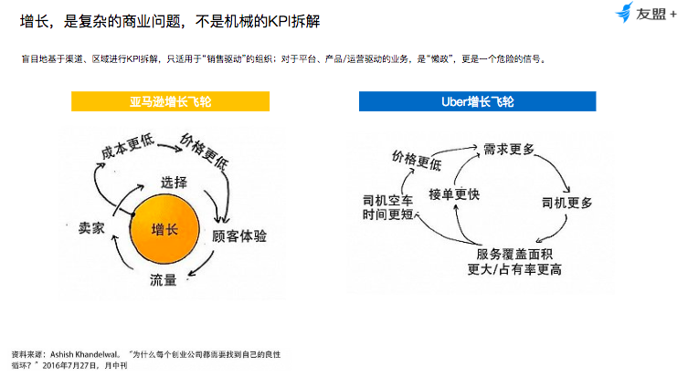
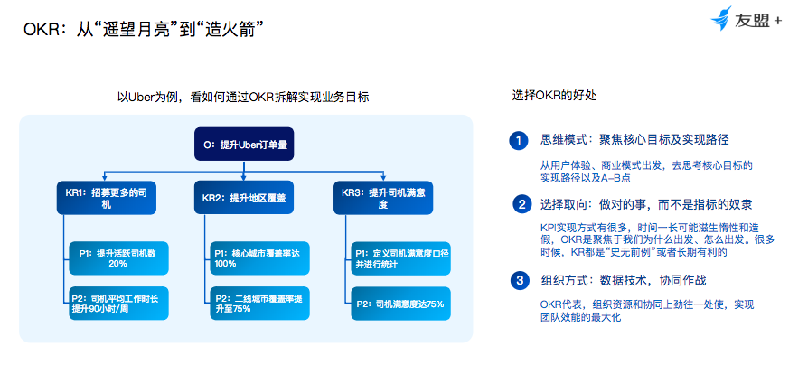
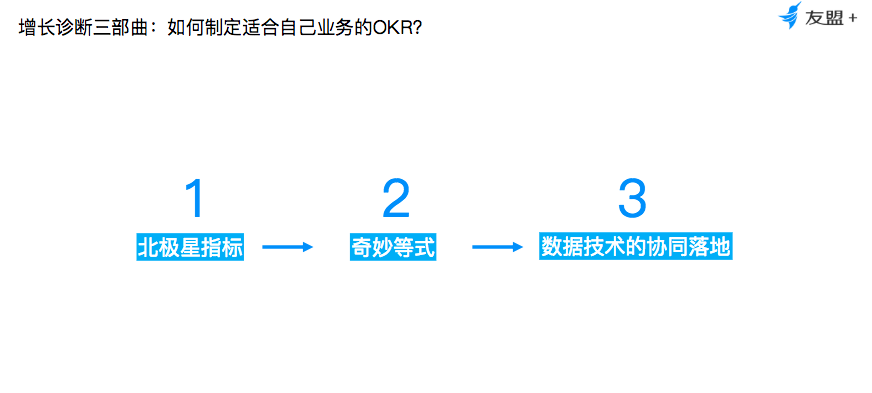
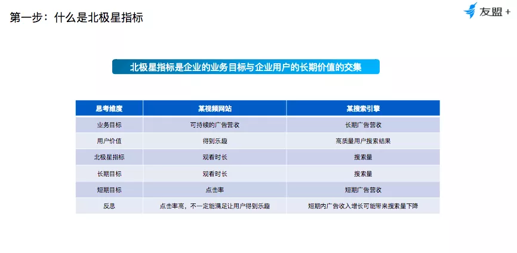
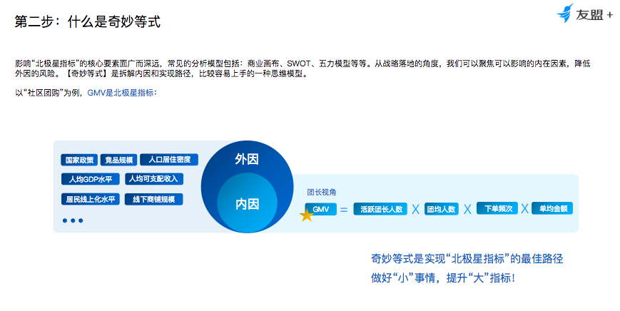
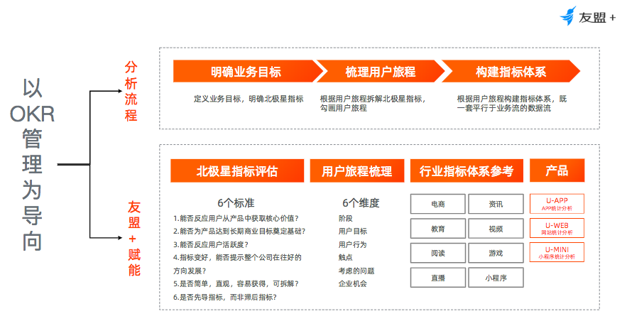
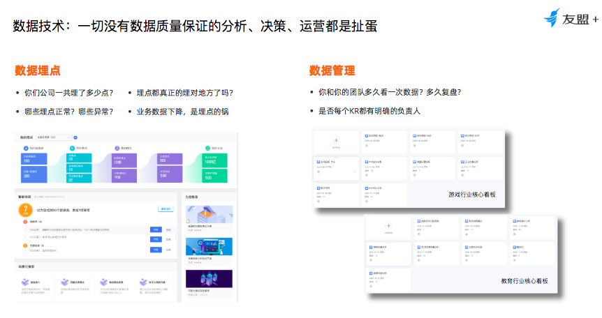
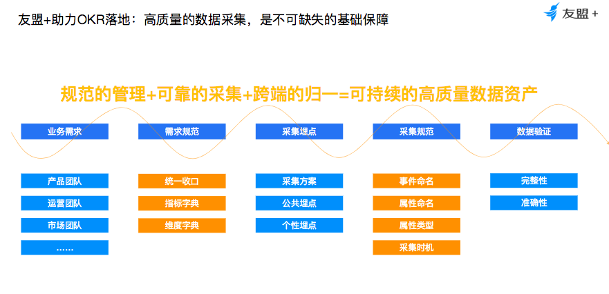
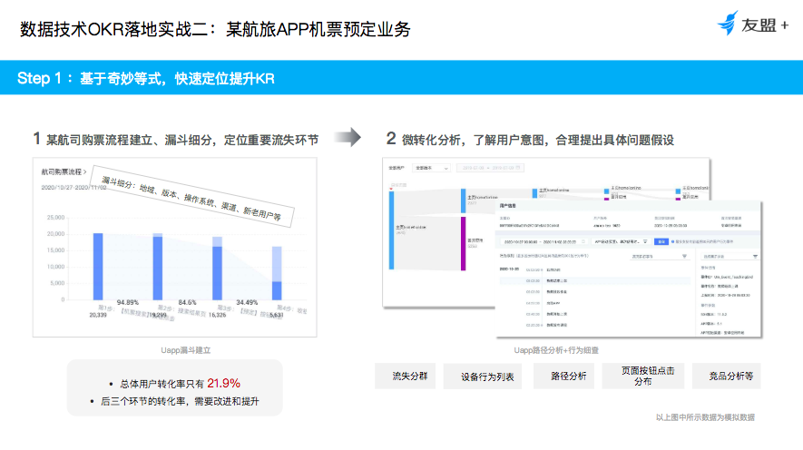
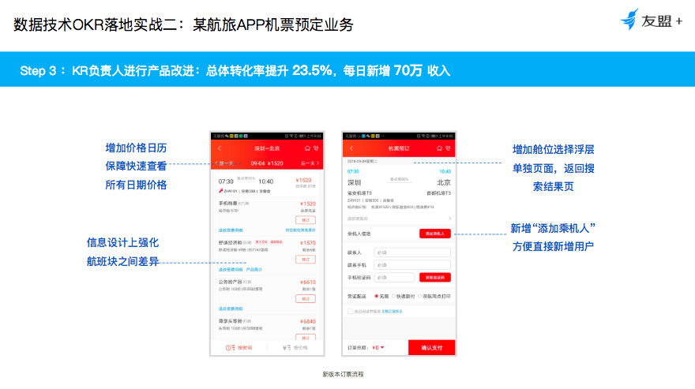

## 从 KPI 到 OKR，高阶产品人如何推动业务高速增长 - 北极星指标、奇妙等式、数据驱动    
  
### 作者  
转载  
  
### 日期  
2021-03-02   
  
### 标签  
PostgreSQL , 数据驱动 , 产品经理 , 北极星指标 , OKR , KPI    
  
----  
  
## 背景  
核心:  
  
- OKR不仅需要关注目标, 同时需要关注实现路径  
- 北极星指标  
- 分解奇妙等式(用户旅程), 用户行为设计  
- 数据驱动, 需要跟踪的数据以及数据的质量  
  
  
原文   
https://mp.weixin.qq.com/s/UrbKfZUkcasICjyXvCNkQQ  
  
  
作为产品经理人，相信很多人都遇到过以下的灵魂拷问：  
  
  
  
- 订单希望做到5倍增长，你有什么建议？  
- 目前App只有1万个新客，如果想做到5万新客还有什么办法？  
- 市场份额需要从目前的50%提高到70%，作为产品经理人有没有什么方法？  
  
  
  
甚至老板会从整个商业化角度问我们：  
  
  
  
- 如果希望在3年内将整体收入由10亿提升到100亿，应该怎么做？  
  
  
  
## KPI vs OKR  
  
  
这些都是比较常见的增长问题。一旦涉及到这类问题，可能一部分负责产品业务的同学会去做KPI的拆解，比如说给每个负责订单业务的同学增加一倍的KPI，或者基于一些渠道拉更多的流量，找到更多渠道方进行推广等等。但是增长真的是基于KPI或者基于渠道、流量就可以完成的吗？  
  
  
  
  
  
  
  
互联网历史上有两个著名的增长飞轮，一个是亚马逊增长飞轮，一个是Uber增长飞轮。他们base的是一个典型的平台型、基于产品的互联网业务。  
  
  
  
以亚马逊增长飞轮为例，亚马逊平台上有两个角色，一个主体角色是卖家，还有一个主体角色是顾客体验。在亚马逊的整个增长策略中，实际上就是以怎么做到成本更低这件事为出发点的，因为成本更低，能够提供给消费者的价格也会变得更低，当消费者价格下降的时候，随之顾客体验就会上升，同时带动整个亚马逊平台上面的流量也会持续上升。当平台流量持续上升的时候，就会有更多的卖家加入到亚马逊平台上来。  
  
  
  
亚马逊增长飞轮是持续性的、系统性的。体验优化了，就可以顺利运转起来，并且在这个过程中，如果将成本、价格进行更进一步地压缩，那么整体飞轮也能以更高的效率进行转动。但是目前，我们更常见的是基于拉新渠道、业务渠道，或是在销售渠道组织或业务上进行KPI拆解，这样盲目地进行KPI拆解实际上是非常危险的。  
  
  
  
KPI曾经也风靡过很长时间。早期的阿里、腾讯以及其他比较大型的互联网公司，最开始都是用KPI的，但现在很多公司都逐渐完成了从KPI到OKR的过渡。  
  
  
  
什么是OKR？用比较文艺的说法就是从“遥望月亮”到“造火箭”整体拆解的过程。简单来说，就是一套明确和跟踪目标及其完成情况的管理工具和方法，OKR的主要目标是明确公司和团队的“目标”以及明确每个目标达成的可衡量的“关键结果”。其中，目标是设定一个定性的时间内目标（通常是一个季度）。关键的结果是由量化指标形式呈现的，用来衡量在这段时间结束时是否达到了目标。  
  
  
  
  
  
  
  
## 如何制定合理的OKR  
  
  
  
第一、选择OKR会有思维模式上面的转变。在做KPI的时候，更多只会考虑目标，但是做OKR的时候，在聚焦核心目标的同时，其实也要进一步关注实现路径，比如说怎么从用户体验出发，或者从商业模式出发，来进一步思考可以去实现的路径，以及A-B之间怎么达到的状态。  
  
  
  
第二、选择OKR更多是一个选择取向。它鼓励我们去做对的事，而不是只是做指标的奴隶。  
  
  
  
第三、OKR更大程度上是一种组织方式，它代表组织资源和协同往一处使，这样团队效能才可以实现最大化，整体来说就是以数据驱动、协同作战的目标文化。  
  
  
  
  
  
  
  
那么，该如何制定业务的OKR呢？这里要提到诊断三部曲方法论：  
  
  
  
第一、北极星指标。  
  
  
  
第二、基于北极星指标、业务模式、用户体验、用户旅程等等，拆分一个奇妙等式。  
  
  
  
第三、基于数据技术做整体团队协同落地。  
  
  
  
  
  
  
  
首先来看第一步：北极星指标。  
  
  
  
北极星指标是企业业务目标和企业用户价值的交集。举个例子，很多视频网站他们的核心就是靠广告变现的，对于他们而言，从短期目标角度来讲，肯定是要提升广告营收。更多时候短期目标可能定位于提升用户广告点击率等等。但是通过进一步思索视频网站可以给用户提供的场景价值就会发现，对用户来讲，他们的诉求就是得到乐趣。从这个角度来说，视频网站真正的北极星指标应该是这个网站的使用时长。  
  
  
  
### 下一步来看看要怎么找到北极星指标：  
  
  
  
- 法则A：这个指标是否能够反映用户从产品中获得的核心价值。比如说用户看视频网站是为了获得乐趣，用户使用搜索引擎是为了获得有效的搜索结果，用户使用社交产品是能够去获得有效的社交反馈，建立有效的社交连接等等。而我们所做的这些指标，能否反映用户的核心价值？  
- 法则B：能否为产品达到长期商业目标奠定基础。比如说进行商业变现，不管是广告还是订单交易，这个目标是不是和这些方面相关，当这个指标出现正向增长的时候，商业基础是否也能够越扎实。  
- 法则C：这个指标能否反馈用户活跃度。对于大部分互联网产品来讲，用户活跃提升了，才有可能更进一步去帮助用户发掘产品核心价值。  
- 法则D：当这个指标变好，整个公司是否在往好的方向发展。  
- 法则E：指标是否简单、直观，并且容易获得，同时也可以拆解。  
- 法则F：指标是否是先导指标，而不是滞后性的指标。  
  
  
  
  
  
### 第二步，奇妙等式。  
  
  
  
能够影响北极星指标的核心要素是非常多的。以现在比较火的社区团购为例，用户在平台下的订单越多，意味着用户从社区团购获得的价值越多，并且社区团购也是一个企业长期商业价值的基础，所以GMV是一个衡量标准。对于有些业务来讲，可能并不具备像GMV这样非常有导向性的目标，但是也可以“以用户旅程为主线提升奇妙等式”。  
  
  
  
  
  
  
  
比较常见的用户旅程就是AARRR的海盗法则。从市场或者各个渠道获取用户，用运营手段或者功能设计去激活这些用户，在这过程中有一部分用户会是你的核心用户，或者需求被满足后他就会变成留存用户。然后针对这部分用户通过变现服务、商业服务来获取一些利益。最终当这部分用户的需求被满足时，他就会向别人推荐你的服务。整个过程可以促成产品或者服务的正向发展，用户的健康成长。  
  
  
  
当用户旅程阶段拆解出来之后，我们就可以进一步发现每个阶段用户的核心目标是什么，当他们想完成这些目标时，他们可能会有怎样的行为。这时候，产品企业就可以根据这些去做用户画像分析，从而提升获客效率，优化落地页、购买流程，建立评估体系，通过商品推荐、会员机制等等提升用户复购机制。  
  
  
  
通过拆解一个奇妙等式，能够比较清楚地知道用户的目标，用户的行为，以及这个过程中我们需要做的事情。  
  
  
  
当我们找到了北极星指标、奇妙等式之后，下一步就是基于数据技术协同落地。只有落地策略才是好策略，不然只是一个PPT。因此，需要各个团队进行组织协同，基于共同目标，通过数据推动每个组织进行相应的配合。  
  
  
  
  
  
### 数据  
  
数据基础就是数据质量，一切没有数据质量保障进行的分析、决策、运营都可能不会达到好效果。常见数据就来源于做的数据埋点和数据管理，大家可以问问自己公司数据有多少埋点，是否埋对了，哪些在用，哪些不在用，哪些异常？团队多长时间做一次数据复盘，每个OKR是否有对KR明确负责的人？当讨论清楚这些问题的时候，就可以更好地回答上面以OKR管理为导向的整体流程问题。  
  
  
  
  
  
  
  
OKR的达成，核心所做的事情就是通过分析产品构建一套规范管理，通过数据的采集、跨端归一的能力，以及可持续的高质量数据资产，从而帮助大家监控自己的北极星指标和每个奇妙等式发展情况，并且回答到每个用户旅程中应该关心的问题，这个时候基于KR并触达O，基于奇妙等式提升北极星指标才会有更好的数据保障。  
  
  
  
  
  
OKR的达成，需要思考埋点的作用，因为这个对业务长期发展有很大的影响，所以就需要从需求梳理到具体事件设计、埋点实施到数据验证，形成规范的管理+可靠的采集+跨端的归一=可持续的高质量数据资产，建立一套可持续的高质量数据资产。  
  
  
  
可以将我们关注把多个指标管理在一张图里面，通过一张大图快速了解北极星指标以及所有的KR，奇妙等式每个部分相应的进展。  
  
  
  
## Case study：航旅App机票预定业务核心转化  
  
  
  
  
  
  
  
对于航旅APP机票预定业务而言，业务核心转化流程是查询机票——查看查询结果——点击预定——到收银台完成支付，这是非常常见的机票购买漏斗。在这个过程中需要关注几个问题：有哪些用户流失了？同时要先定义好流失概念，以及这些用户是在什么时候流失，什么地方流失，他们为什么流失，可能发生了什么事情造成他们的流失，以及这个流失有多严重，是否应该以高优先级的方式去解决这些流失问题。  
  
  
  
以友盟+服务客户时，帮助其将搜索结果、点击、点击预定，到收银台以及最终付款几个步骤构建成了一个转化漏斗，通过漏斗可以清晰地了解流失客群。并对相应客群进行精细化的运营。  
  
  
  
  
  
  
  
通过实际预定、信息填写到实际体验，进行客群分析。相应产品负责人根据分析结果进行产品界面提示和产品流程的优化。比如说新增加一些价格日历，并且在产品设计上对每个航班之间进行比较明显的区隔，增加选择的浮层，用户流程里面可以直接添加乘机人，进行整体的流程优化，当流程优化结束之后，经过一段时间监控，航旅App的整体转化率提升达到23.5%，结合每日新增用户数量，增加了70万左右的收入。  
  
  
  
作为产品经理来说，尤其作为高阶产品人来说，必须具有洞察分析的能力，才能快速发现数据表象背后的症结。  
  
  
  
以数据驱动OKR策略落地，非常重要的一点就是做小步快跑，快速迭代。目前大部分公司的需求是通过BI+数据团队组合实现的。但一部分同学也会有同样的感触，通过数据同学进行采集，有的时候错过了排期，甚至可能错过目前市场的变化。所以借助友盟+就可以很快的挖掘影响指标变化的因素，通过路径分析功能去进一步下钻用户核心表现。  
  
  
  
综上所述，不管是核心大目标，还是O（Objectives），或者北极星指标，奇妙等式等等，最后都需要核心组织协同方式来推动整个目标聚焦以及过程的落地。  
  
  
#### [PostgreSQL 许愿链接](https://github.com/digoal/blog/issues/76 "269ac3d1c492e938c0191101c7238216")
您的愿望将传达给PG kernel hacker、数据库厂商等, 帮助提高数据库产品质量和功能, 说不定下一个PG版本就有您提出的功能点. 针对非常好的提议，奖励限量版PG文化衫、纪念品、贴纸、PG热门书籍等，奖品丰富，快来许愿。[开不开森](https://github.com/digoal/blog/issues/76 "269ac3d1c492e938c0191101c7238216").  
  
  
#### [9.9元购买3个月阿里云RDS PostgreSQL实例](https://www.aliyun.com/database/postgresqlactivity "57258f76c37864c6e6d23383d05714ea")
  
  
#### [PostgreSQL 解决方案集合](https://yq.aliyun.com/topic/118 "40cff096e9ed7122c512b35d8561d9c8")
  
  
#### [德哥 / digoal's github - 公益是一辈子的事.](https://github.com/digoal/blog/blob/master/README.md "22709685feb7cab07d30f30387f0a9ae")
  
  

  
  
#### [PolarDB 学习图谱: 训练营、培训认证、在线互动实验、解决方案、生态合作、写心得拿奖品](https://www.aliyun.com/database/openpolardb/activity "8642f60e04ed0c814bf9cb9677976bd4")
  
  
#### [购买PolarDB云服务折扣活动进行中, 55元起](https://www.aliyun.com/activity/new/polardb-yunparter?userCode=bsb3t4al "e0495c413bedacabb75ff1e880be465a")
  
  
#### [About 德哥](https://github.com/digoal/blog/blob/master/me/readme.md "a37735981e7704886ffd590565582dd0")
  
