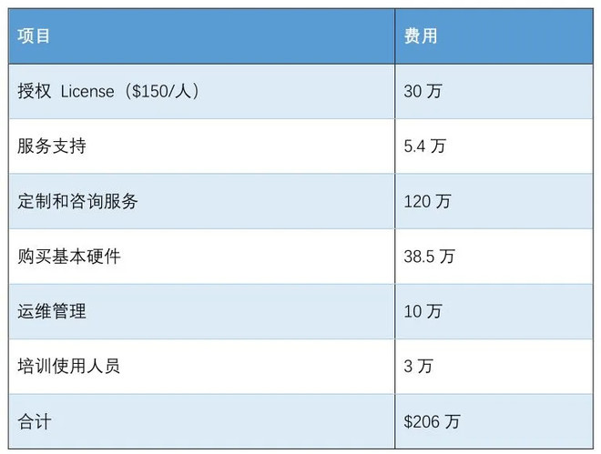
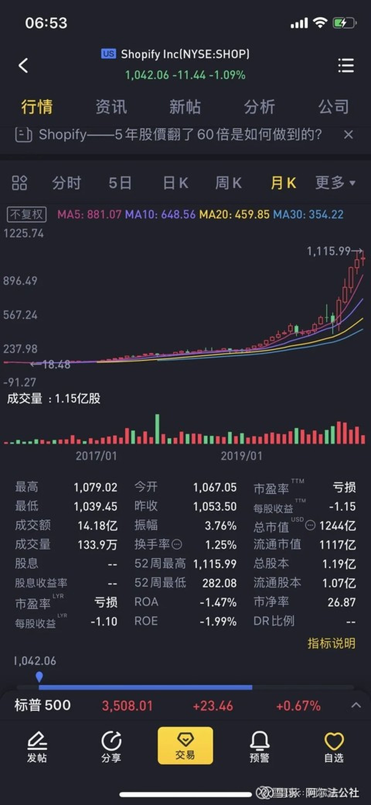
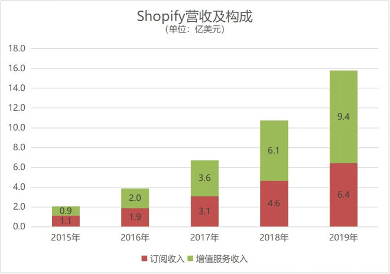
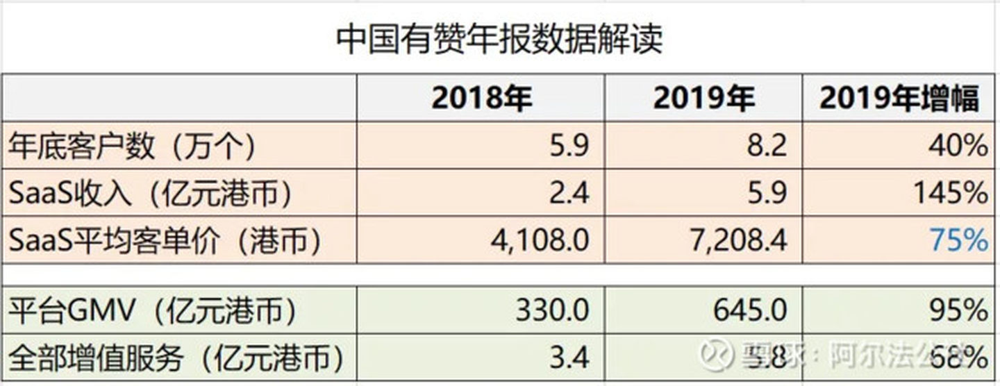
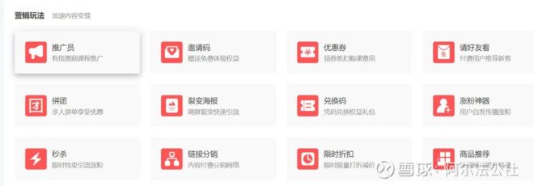
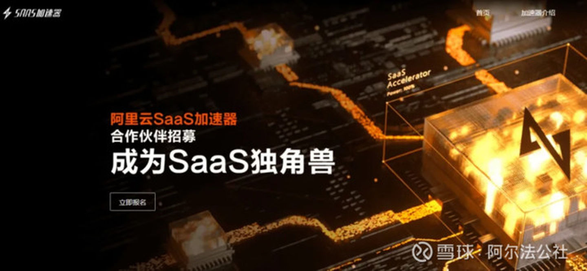
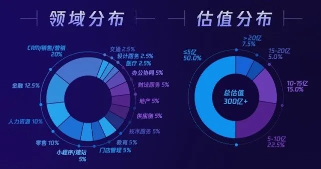
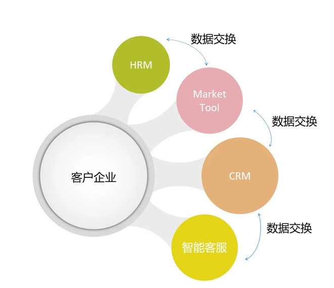

## 深度|中国SaaS蜕变：从管理工具到商业化工具  
  
### 作者  
转载   
  
### 日期  
2021-03-04  
  
### 标签  
PostgreSQL , SaaS   
  
----  
  
## 背景  
  
## 原文  
https://zhuanlan.zhihu.com/p/245811564  
  
  
阿尔法公社━━━━━━重度帮助创业者的天使投资基金  
  
  
  
阿尔法公社说：为什么很多中国SaaS公司商业落地得不好，有哪些落地较为成功的SaaS 2.0公司，中国SaaS有哪些新的趋势和机会？腾讯 SaaS 加速器导师，纷享销客前执行总裁吴昊用一篇深度文章一次讲清楚，欢迎参考。  
  
  
  
## 一、舶来品：SaaS 1.0  
  
  
### 1、业内一致的困惑  
  
  
  
和众多中国的 SaaS 创业者一样，我也在困惑，为什么美国的 SaaS 发展那么快？而中国 SaaS 企业从2014年开始就不断获得巨额投资，能说得上商业成功的却凤毛麟角？  
  
具体说到 CRM，Salesforce 以此为中心，画出几个大圈儿，在7月12日市值（1792亿美元）超过 ORACLE 成为全球第二大软件公司。  
  
说到企业总量、对销售的重视，中国市场应该不输美国市场。如果头部 CRM 公司一年营收做不到100亿美元，起码能做到100亿人民币？  
  
但事实是，中国 CRM 市场中的3家头部公司，加起来也做不到10亿人民币。这直接是数量级的差异了。  
  
对此我一直都很迷惑，中国号称有4000万企业，活跃经营的起码有1000万家？大部分企业都有销售代表？为什么一年买 SaaS CRM 的企业连千分之一都不到呢？  
  
直到今年我才想明白，这是怎么回事。  
  
  
  
### 2、国内市场商业不成熟，缺刚需  
  
  
  
表面看，CRM 是提高销售管理效率的工具。但实际上，它隐藏了一个外部合规的需求。在欧美的销售公司里，记录下销售过程，是一个合规需求。如果未来有人质疑这笔交易中有行贿等违规行为，有每个环节的历史记录，对采购者、销售代表及其公司都是重要的保护。  
  
这一点在 Salesforce 的官网上不会讲；我问在 Salesforce 工作的朋友，他们内部也没有直接这么说。但当我说出这个“隐藏”的刚需时，他们也觉得有道理。  
  
就像我在法资企业工作时，上级对下级的礼貌和尊重、男同事对女同事的礼让、开会要用英文讲话（照顾不会法文的与会者）......这些隐藏的规则是不会写在公司制度里的。  
  
这类商业成熟的市场上的合规需求，已经潜移默化地隐藏在每个商业行为的底层逻辑里，表面上没说、我们从外部也看不出来，却对 CRM 的销售起到决定性作用。  
  
而在中国，大部分行业里显然还没有这个 CRM 外部合规需求。如何证明这一点？  
  
这里可以举一个反例：近3年医药行业 CRM 的发展情况。  
  
由于3年前开始的两票制、以及医药代表与医生间的关系逐渐放到桌面上，医药行业对流通环节销售系统的需求逐渐上升。对应可以看到这个领域里的 SaaS 公司业绩高速增长，其代表是「上海软素科技」。  
  
表面上可以看到公司业绩增速非常快，而从内部看，客户需求增速更加快！甚至仍然是在医药销售流通领域，还产生了很多新的“在线化”需求，软素这两年也为此打造了新的产品满足新需求。  
  
同时由于软素作为中国高科技企业已经拿到世界医药500强中的70多个 Logo，在这类倒三角市场从上向下发展的优势也非常巨大，在产品技术积累上、品牌上都有护城河效应和聚集效应。  
  
可以预见，未来有合规需求的医药领域 SaaS 会有大的发展。  
  
与此同时，2018、2019这两年中，不分行业的通用 SaaS CRM 公司的营收增速则远不及医药 SaaS CRM 的发展速度。  
  
“外部的合规要求”体现了商业的成熟。  
  
从 IT 采购决策流程、续费付款流程等方面分析，国内外 SaaS 企业面对的情况确实差别很大；但我认为：根本还是在产品上，客户侧缺乏对一个品类的刚需，这个品类的 SaaS 企业发展当然会遇到障碍。  
  
  
  
### 3、中大客户需求不一致  
  
  
  
国内营收过亿的 SaaS 企业大部分是服务中大客户的。可以说，我们在产品边界的问题上非常痛苦。  
  
本来打磨了5年的产品在一定数量的业务场景已经完成闭环。但今天 Sales 带来大客户 A 有几个新需求、明天大客户 B 又有几个没想到的新需求......我看好多公司 CEO、CTO、产品负责人的重点工作就是不断地调整待开发功能的顺序。  
  
有时候作为非目标客户听完产品介绍，真心觉得很完备了。但他们到市场上，还是会面临新需求的挑战。  
  
有的时候大量需求是超越了产品边界的，例如你是一个卖 CRM 的，客户就是要一套进销存......  
  
那些做 PaaS 超过3年的 SaaS 企业，产品里自定义的对象、自定义流程的 BPM、自定义报表的 BI、自定义的页面......什么都有了，但客户的多个部门业务及流程完全不同，统计报表却需要一致反映，你还得增加“同时支持多业务类型”的复杂能力。  
  
这些需求是假需求吗？也不是。其中很多确实是大客户需要的。没这个功能，客户的业务运作就会有堵点、或者是操作很费力。  
  
原因当然还是国内的企业发展很快、组织和流程快速变化后还没有成熟，同时各个行业也缺乏业务及管理指导标准。  
  
今天要探讨的更多是战略层面的话题，这个问题带到下文探讨应对方法。  
  
  
  
### 4、SaaS 与 OP 部署软件相比价格优势并不明显  
  
  
  
为了写这个有纪念意义的第100篇，我重新读了一遍 Salesforce 创始人 Marc Benioff 于2010年发表的著作《云攻略(Behind the Cloud)》。  
  
在1990年代，Salesforce 面临的市场机会 ——200人的团队购买一套 Siebel CRM 需要的成本（“低端版本”）：  
  
  
  
  
  
  
而购买 Salesforce CRM，每人月50美元，200人只需要：$1万/月，一年$12万。  
  
首年费用有17倍的价格差异！即便不算 Siebel 的定制费用120万，也有7倍的差别！  
  
回过头来看看中国市场上，企业的 SaaS 产品面对传统部署（On Premise，简写为“OP”）软件的价格有多大优势？常见的是 SaaS 产品一年的服务费是 OP 软件买断价格的1/3。这个价格也真不能少了，否则 LTV（客户生命周期价值总价值）远远小于3倍的 CAC（获客成本），SaaS 商业模式难以跑通。  
  
如果面对“小软件作坊”这样的竞争对手，对方不仅可以做定制开发，其报价可能比 SaaS 公司还要更低！  
  
这就是中美软件市场的巨大差异。OP 软件时代里，市场上的头部客户被 Oracle、SAP、微软等国际厂商拿走，余下的市场里用友、金蝶等本土企业并不能拿到利润丰厚的部分，价格也没有卖起来。  
  
都说后浪强，谁知道没有前浪的基础，后浪也翻不起来？  
  
  
  
### 5、SaaS 1.0 —— 舶来品的特点  
  
  
  
Salesforce 2020年 Q2 季报公布的业绩大涨、入选道琼斯指数，使得其股价一夜之间涨了26%。从西方看 SaaS 的趋势不可阻挡，而 SaaS 1.0 作为“舶来品”在中国尚未有明确的爆发时间点。  
  
看看西方 SaaS 的特点：  
  
  
  
很大部分是通用工具 SaaS：无论是领头羊 Salesforce，还是后面的这些百亿市值公司（ServiceNow、Zendesk......）产品以帮助企业提高管理效率为主，交付轻快（相对 OP 软件）、市场复制能力强。  
  
相对传统 OP 部署软件，价格优势明显（如上文所述）。  
  
SaaS 产品品类繁多，各自有自己的优势领域，不常见恶性的同质化竞争和无底线价格战。  
  
SaaS 公司自己的内部管理很成熟，从市场到线索、线索到现金、客户成功的管理都已经有完整套路。  
  
续费率奇高：Logo 续约率普遍在80~90%以上，金额续费率平均超过105%~110%  
  
营收保持高增速增长。  
  
而国内的同类“通用工具型”SaaS 企业，从上面第二项到第四项，一个都不符合：  
  
  
  
价格优势不明显，传统软件本身价格就不高，软件作坊的报价更是跳楼价；  
  
同质化竞争：在美国 SaaS 公司帮企业省了10万美元，客户愿意付出5万美元的费用。在中国 SaaS 公司帮企业省了10万人民币，于是报价5万；这时候会有竞品跳出来说报价2万，最后咱们只能用1万成交。竞争格局不同，新产品的市场机会大不相同。  
  
大部分 SaaS 公司在产研、市场产生线索、线索到现金、客户成功等各个业务流程上都还很不成熟，组织能力短板也很明显。  
  
最体现结果的是上面第5项（续费率）、第6项（营收增速）则完全不能相比。  
  
并不是讲在中国做通用 CRM、HRM、客服系统就没戏。他们作为原生的 SaaS 1.0 方式，在可复制性上有巨大爆发力；一旦过了临界点，比后面要讲的本地化 SaaS 模式增速还要快。  
  
因为东、西方 SaaS 有一个最大的共性：它在 SaaS 热潮降临中国的前3年还不被重视，但近2年来 CEO 都100%地接受、其中大部分也在真正践行这一点：SaaS 的本质是续费。  
  
  
  
由于重视客户用好产品、重视续费，甚至有相应的服务部门 —— “客户成功部”，“按需付费”的云软件从商业模式上就优于买断式传统软件。收取年度/月度软件服务费，这比部署方式是 OP、还是在云上更关键。  
  
但临界点的到来，尚需时日。也许是2~3年，也许更久。  
  
中国 SaaS 公司的兴起只是时间问题。这有待市场和产品的成熟，产品与市场两者始终互相影响、呈双螺旋状发展。  
  
但他们需要从 SaaS 1.0走向 SaaS 2.0！  
  
  
  
## 二、中国落地：SaaS 2.0  
  
  
### 1、Copy to China 永远只是新浪潮的开始，从来都不是结尾  
  
  
  
雅虎来了，留下了新浪、网易；  
  
Google 来了，长大的是百度；  
  
eBay 来了，输给了淘宝...  
  
Groupon 带来了团购模式，占领中国市场的却是美团；  
  
美团后来还证明团购压根不靠谱，转型做外卖，意图成为中国最大的服务提供商；  
  
后来又跑出来个拼多多，搞得又是完全不同的拼购......  
  
各种商业模式 v1.0、产品 v1.0，到了中国都需要做“本地化”升级。产品需要符合中国人的沟通习惯、内部组织运作方式要适应中国员工的习惯、市场宣传需要按中国套路、销售方式也要按中国销售经理们的习惯做调优。  
  
舶来品不是不好，是还不够好。  
  
  
  
### 2、中国企业需要什么？愿意为什么付费？  
  
  
  
研究 SaaS 的出路，还是要着眼于客户。  
  
放下产品、放下 SaaS 的商业模式，我们回到原点，看看中国企业有什么需求？换句话说，中国企业愿意为什么付费？  
  
中国企业最愿意掏钱的，还是增加营收，而不是提高管理效率。  
  
  
  
这里讲个大家耳熟能详，但也许理解还不够透彻的例子 —— 知识付费 SaaS 品牌「小鹅通」。作为小鹅通产品的重度客户，同时也是小鹅通团队的管理咨询顾问。今天就从内、外视角合并分析这个在今年爆发的 SaaS 产品。  
  
2019年底的时候，小鹅通的创始人老鲍推荐我用小鹅通开在线视频课。我自己公众号有2万多读者而且每月都持续增长，经常读我文章的 SaaS 圈内专业人士有几千人；有时候我也会受邀在一些线下活动做分享，因为没有营销目的只讲干货，每次都反响热烈。既然有流量、又有非常匹配的内容，为什么不考虑为读者增值、为自己变现呢？  
  
现在来分析一下作为一个客户如何看待这样一个“新收入通道”产品？  
  
对我这个咨询公司来说，以往根本没有这块收入，现在有机会增加营收，一年至少10~40万吧。在这样的情况下，客户对4000~8000元/年的价格不敏感，更关注效果。  
  
曾经也有销售同类产品的同学找到我，说是价格低很多，但由于我是第一次做线上课程，不敢拿自己的粉丝冒任何风险，也不愿意在 IT 系统上走哪怕一点点弯路，就没有考虑。因为相对价格来说，我更关心的是课程营销的效果。  
  
然后发生了什么？  
  
首先产品很容易上手，我的流量也迅速按自然比例导入了线上知识店铺。  
  
到这时候，我根本不可能替换在线课程工具了！我和助理的操作习惯还在其次，关键是 —— 所有学员都收藏了我的知识店铺链接，我的所有用户都习惯了小鹅通的操作方式，我自己团队换 SaaS 产品是小事，但让客户换平台，就意味着流失......  
  
所以大部分人看小鹅通、有赞，包括加拿大的 Shopify，觉得他们的业绩爆发是源于疫情，其实那只是表象；关键还是产品服务客户的核心逻辑：增加营收的刚需和产品粘性。  
  
  
  
我和「兑吧」的创始人陈晓亮也聊过一次这个大商业逻辑的问题。  
  
可能 SaaS 圈关注兑吧的人不多，他们在香港上市，主要产品是积分商城，也有较小比例的 SaaS 收入。兑吧的客户包括：中国4大银行、海底捞、屈臣氏、微博、爱奇艺......2017、2018、2019三年的营收分别是：6.5亿、11.4亿、16.5亿（来自上市公司公开信息）。  
  
他们最核心的价值是，帮这些大企业长期运营客户，并做好短期创意营销活动，直接给客户带来收入。  
  
这样的业务设计，客户能不买单吗？  
  
我理解兑吧在不断寻找那些能帮客户挣钱的方法和并创建这样的工具。  
  
离钱更近的产品，在中国更受客户欢迎。  
  
### 3、连接，而不是机械地搬到云上  
  
  
  
在 SaaS 圈内，现在大家开始逐步理解：只是把以前 OP 部署软件做的功能搬到云上，这对客户没有价值。  
  
这里最好的证明就是「神策数据」。  
  
神策数据是私有化部署的产品（用户行为分析平台），却满足了 SaaS 模式最核心的本质——按年收取服务费。  
  
业内都知道他们增长很快，和公司高层交流后我判断他们的核心能力在于：虽是私有部署但产品化程度高、实施服务流程标准化能力强、对客户该领域的业务理解深刻。  
  
OP 又如何？能解决客户问题、按年收取服务费用，就是好 SaaS！  
  
相反的，遗憾地看到大量新老 SaaS 公司，只是机械地把以前传统 OP 软件做过的功能，跑到云端用 SaaS 多租户架构再实现一遍。对客户来说，这有什么意义？客户该用 IT 系统管理客户的，还是管理客户；该管理员工的，还是管理员工，并未得到额外增加的价值。  
  
企业 SaaS 产品用户体验更好、有移动端？这对决策人来说都是次要因素。假设我是 CIO，也不会仅仅因为操作体验好而冒险更换用了多年的老系统。  
  
  
  
### 4、发挥互联网特性 —— C 端案例：音乐产业的变迁  
  
举两个例子，C 端和 B 端的。  
  
先说说 C 端的音乐行业。  
  
在中国的音乐行业，盗版曾经是很大问题。不知大家是否还记得崔健拒绝在歌迷递过来的盗版 CD 上签名的故事。最后歌星们没办法，只能以开演唱会为主要收入来源。所以大家经常看到某某明星搞全国巡回演唱会......  
  
美国的法律体系相对更健全，盗版 CD 的事情比较少；但互联网时代来临后，出现了更大的“盗版”问题。1999年两位少年写了一个叫「Napster」的应用，用户可以做把 CD 转成 MP3 后分享给其他用户。我还记得当年此事颇有争议。  
  
后来5大唱片公司在3年内把 Napster 告到破产，却没法阻止互联网对音乐业的冲击。据说1999年是全球唱片公司收入最高的一年，之后一路下滑......  
  
之后是 MP3 的时代，大家也都在2000年代用 MP3 机听过音乐。相比磁带和 CD，这给听音乐的人带来巨大便利。人们去各种途径寻找中意歌曲的 MP3 文件，然后下载到 MP3 机里。  
  
  
  
  
  
  
  
  
数字化首先改变了音乐产业。  
  
当时所有人都觉得已经非常爽了，但用 MP3 替代 CD 机，这就像我说的“仅仅把线下的应用搬到线上”，这还远远不够。  
  
然后出现了颠覆性的“流媒体音乐”App。  
  
这两年我是“网易云音乐”的付费用户。MP3 机只是听歌的机器，而一个流媒体 App 给你的是整个音乐世界：打开 App 随时有海量选择、歌单推荐解决了没时间的“冒牌”发烧友找新歌的问题。最近网易云音乐还推出了“私人定制歌单”，根据历史收藏给出精准推荐，这样推荐的歌曲中，10个我要收藏4个......  
  
以往花费几个小时整理歌曲然后下载到 MP3 机的无聊工作就早已画上句号，互联网方式带来的是更棒、更智能的体验。  
  
*本节部分信息来自“得到”App-邵恒头条-技术和音乐的互搏史。  
  
5、发挥互联网特性 ——B 端案例：PRM  
  
咱们 SaaS 产品不也该如此利用好“互联网”这个特性吗？  
  
只把原有的 OP 部署软件搬到云端，就如同用 MP3 机替代 CD 和磁带。如果价格优势明显，也许在中国还有些机会。否则给客户带来的新价值太少，销售起来多半是举步维艰。  
  
还是以 CRM 为例。如果只提供企业内部销售管理效率的提升，大部分企业管理水平并没有达到深度使用的水平，他们只会买市场上最便宜的产品。对这些客户来说，只需要把客户报备好、把销售过程简单记录一下就够了。至于销售预测、交付过程的管控并不被看重。  
  
  
  
那么他会去买一个5千块钱的产品还是买5万的产品呢？答案已经写在咱们各个 SaaS 公司的损益表上。  
  
「纷享销客」 CRM 的子产品 PRM，这是咱们软件和 SaaS 行业里都能用得上的厂商-代理商协同工具。  
  
相对 CRM 而言，PRM（Partner Relationship Management，合作伙伴/代理商关系管理）则是更依赖互联网连接特性的功能。  
  
出于成本及信息安全的考虑，代理商不可能直接用厂商的 CRM，所以一般是各用各的 CRM。但两者之间是有大量连接任务的，往浅里讲：代理商的客户如何在厂商全局客户库里做报备？（否则双方或多方会经常因为撞单发生矛盾）代理商的价格折扣审批进度如何查到？开票信息还要靠微信非结构化传递？  
  
更复杂的业务事项还有：厂商的线索如何快速分配给代理商？不同代理商/经销商的不同折扣权限如何管理？分成返点如何计算？  
  
这种“连接型”功能才是以前传统 OP 软件时代的弱项，是新 SaaS 产品的甜区。  
  
  
  
以往靠渠道经理在中间用微信传递以上信息，不但浪费三方大量的沟通时间，还不及时、错漏百出。  
  
当然，这里不是推荐大家一拥而上去做 PRM，国内已经有 CRM 厂商可以把这些问题解决得很好。我的意思是要考虑 SaaS 天生在云端、天生善于连接的特性，把新特点发挥出来，做出产品创新。  
  
  
  
### 6、连接产生网络价值 —— 案例：SRM  
  
  
  
连接之后呢？除了提高效率，连接还会带来更多价值。  
  
梅特卡夫定律提出：网络的价值与网络中节点数的平方成正比。上面说的 PRM 如此，SRM（供应商关系管理系统）也是如此。  
  
在很多垂直的生产制造行业中（包括家电、电子、快消、汽车等），SRM 都是一个常用连接器。上游厂商需要通过 SRM 寻找供应商（寻源）、签署采购合同、了解生产进度、掌握货物物流状态、收获验货。  
  
厂商要与一级供应商连接、一级供应商要与二级供应商连接、二级供应商又与三级供应商连接，各级之间可能还有交叉关系......可以想见，这就是一张巨大的网络。是 B2B 的网络。  
  
SRM 在初期只是作为工具的价值。OP 版的 SRM 也确实止步于此。  
  
而 SaaS SRM 终将串起一个平台。  
  
我曾在华为业务与软件产品线担任软件 CEG（采购专家团）成员。我接到一个陌生产品采购需求后，寻源（Sourcing）是一个非常痛苦的事情。  
  
想象一下，如果 SRM 平台可以直接显示，这类产品在市场上有哪些供应商？他们的型号特点如何？价格和品质如何？供货速度、物流效率如何？合作性如何？—— 那将不仅提高采购效率，更重要的是提高集成后产品的市场竞争力！  
  
这个平台的价值还远不止于此，厂商、供应商之间拉起的网络作为整体得到赋能，平台方则可以提供金融、物流以及生产资料的拆借和集中供给。  
  
市场机制永远不能被替代，但基于数字和供应链网络却可以让市场更高效。  
  
至于如何形成网络效应？我更看好聚焦垂直行业的公司。  
  
这个逻辑很简单，假设在一个网络中占据30%的节点方能达到阀值、形成网络效应；那么在有1万个节点的网络里，需要占领3000个节点；而在一个100万节点的网络里，则需要占领30万的节点。  
  
在企业服务市场，只有 Dropbox、Slack 等少数产品能跑 出 SaaS2C2B 的快速网络营销模式，取得高速增长。绝大部分产品都还需要一个个签客户，速度不可能太快。因此只有聚焦一个垂直行业或细分领域，才能早日达到网络效应的阀值。  
  
### 7、提供增值服务 ——Shopify 与有赞  
  
关于提供增值服务，这里有个海外的例子：Shopify。这家公司成立于2004年，为各类零售商搭建独立电商网站。Shopify 于2015年上市，之后5年股价增加60倍，目前市值1200亿美元。  
  
  
  
  
  
  
  
  
Shopify 股价月K线图  
  
  
  
Shopify 的收入主要分两块：SaaS 年费与增值服务。  
  
增值服务包括：针对商户的业务，提供支付、物流、仓储等服务。  
  
  
  
  
  
  
从上图可见，随着 GMV 迅速提升（2019年达611亿美元），增值服务部分不断增加，从2015年的45%扩大到2019年的59%。  
  
在 SaaS 产品方面，Shopify 于2014年推出了面向大客户的“Shopify Plus”（提供更多人工服务、用脚本自定义价格模型、工作流等），已吸引雀巢、联合利华等大品牌购买。关于提高 NDR（Net Dollar Retention，含增购的金额续费率）的必要性，这个在《SaaS 创业路线图(95）东方 SaaS 之路：小微向左，中大向右》中有更详尽描述。  
  
香港上市公司「中国有赞」的产品及市场格局与 Shopify 接近。根据有赞财报，我发现有赞也在设法扩大“增值业务”；同时，为了提高客单价，除了主打产品“有赞微商城”，也针对零售、连锁等业态以及美业、教育行业提供解决方案式 SaaS 产品。  
  
  
  
  
  
  
  
  
从公开的年报数据也能看出，其2019年 SaaS 订阅收入增幅（145%）远大于客户数增幅（40%），平均客单价大幅增加。同时，随着 GMV 的高速增长，增值业务（包括交易费、延伸服务及其它）也在增加，但占总营收的比例还未超过50%，说明有赞与 Shopify 所处阶段不同。  
  
### 8、深耕行业提供增值服务 —— 领健口腔  
  
2019年底与一位老牌海外基金的投资专家交流，了解到，由于“通用 SaaS 赛道”基本投完，他们也在看很多行业 SaaS 企业，近年在海内外投资的也主要是这个方向。  
  
再举一个行业 SaaS 企业的例子。  
  
这半年我与领健的管理层交流得比较多，经他们同意，下面聊一个行业 SaaS 公司在中国的成功模式。  
  
「领健」总部位于上海，在口腔诊所 SaaS 市场处于绝对领先的地位。据介绍，中国约有10万家口腔诊所（属于我说的橄榄型市场），领健已经完成30%的市场占有率。其中头部的100个品牌，已经有80家使用了领健的 SaaS 服务。  
  
领健 SaaS 业务遇到的挑战主要是客单价太低：口腔诊所利润不错但为信息化的支付意愿不强，一个诊所一年只支付几千元。这么低的价格，需要销售上门推动签约、还需要上门实施，因此 SaaS 毛利不高。  
  
这些真的就是中国 SaaS 企业用 SaaS 1.0 的模式玩不下去的原因。  
  
好在领健找到了发展路径 —— 领健商城，为口腔诊所提供的上万种医疗耗材和设备。这正满足大量诊所的采购需求：帮助诊所在采购时拉平各级供应商的信息不透明和层级差价，并根据物品成交量提供采购补货周期策略和库存预警策略。  
  
我在新书《SaaS 创业路线图》中讲到：“有数据增值价值的才是商业 SaaS，只靠工具 SaaS 的客情多卖实物产品的不是。”  
  
可以看到，领健提供给诊所的商城服务与 SaaS 工具本身是紧密相关的：从库存预警、全网价格对比，到订单物流、安装到客户的嘴里、未来提醒到期检查及更换，都能数字化跟踪和管理。  
  
据了解，领健的 SaaS 业务和商城业务近两年都在高速发展。  
  
除了诊所 SaaS，我也与一位家政 SaaS 创始人交流过。两年前聊的时候，我还觉得这个行业客户支付能力弱、信息化需求低，SaaS 企业无法生存。没想到今年再聊起来，发现他们做了很多给家政公司的增值服务，公司已经能盈亏持平了。  
  
### 9、无论机器、还是人，服务端到端才有价值：慧算账  
  
上个月我和一位「慧算账」的投资人长谈过两次。慧算账通过 SaaS+财税服务模式，为中小微企业提供代记账等服务，看起来更像一个巨型代记账公司。  
  
这位投资人的一句话让我对“Service（服务）”的理解突然拔高了一个层次。她说，“Software as a Service”，SaaS 是提供服务，这与人工提供的服务不都是“服务”吗？关键是，能否给客户一个端到端的服务？  
  
也就是说，软件或者人工服务，这都只是形式。形式不重要，关键是目的 —— 给客户的服务完整、闭环、有价值！  
  
回到慧算账的例子。是的，他们养了大批记账会计，但随着 OCR、RPA、电子发票这些技术和规范的成熟，机器会逐渐替代人，这就是慧算账相对传统代记账公司的优势。  
  
### 10、SaaS 2.0 与 SaaS 1.0 的核心区别  
  
SaaS 1.0 的企业，例如 ServiceNow、Docusign、Workday，他们历年收入中的订阅比例都保持、或不断提高到90%左右。  
  
这里的逻辑是，机器提供的服务边际成本极低。花费1亿美元研发的产品，服务10万个客户分摊的成本，远低于服务1万个客户。相对于几百、几千美元/年的 SaaS“人·年”服务费，客户企业每增加一个人头，SaaS 企业需要增加的服务器、带宽成本可能只有十几美元。  
  
而人工费用则不同。如果一个 SaaS 产品的咨询（或实施、定制开发）费用占比1/2，意味着这一半的成本并不会随着客户数量的增加有多少下降空间。相反，由于咨询顾问、分析师、实施顾问、CSM（客户成功经理）、项目经理的培养需要1~3年的周期，这会成为 SaaS 公司增速的铁瓶颈。  
  
所以 SaaS 1.0 的逻辑，用机器提供服务，不断降低机器服务的成本，这是非常合理的。  
  
但这是低竞争格局下的商业模式，而30年来，中国的 IT 服务市场一直是高度同质化竞争市场。  
  
具体到一个领域的 IT 产品提供商，向上面临国际厂商 Oracle、SAP、微软巨大品牌势能的压力，向下又有小软件作坊的低价及无限承诺定制开发的竞争，纯机器服务的 SaaS 1.0 模式本身护城河太低，从2015年以来举步维艰。  
  
于是我们勇于拼搏的 SaaS 创业者闯出了中国的 SaaS 2.0，这包括本文提到的所有中国 SaaS 企业：软素、有赞、兑吧、小鹅通、领健、慧算账、纷享销客、谷器数据、某 SRM 公司、某家政 SaaS 企业......  
  
中国 SaaS 2.0 是对美国舶来品 SaaS 1.0 的版本升级。其实这也是西方成功商业模式 Copy to China 常见的情景，并没多特别。  
  
改革开放40多年来，从来都是如此：先学习，再调适。  
  
  
  
## 三、新 SaaS 机会的特点和趋势  
  
  
既然能叫做“升级版”，SaaS 2.0 的机会有哪些新特点？她有哪些发展趋势？  
  
### 趋势1 - 切更刚的需求  
  
#### 其一，“外部合规要求”  
  
上文提到的医药行业的改革，带来的合规需求，就是医药 CRM 的刚需。  
  
有一次与「谷器数据」的 CEO 交流，他们主打汽车行业的 SaaS MES 产品（面向制造企业车间执行层的生产信息化管理系统）。听起来是一个纯内部管理工具对吧？  
  
不对，其实 MES 的关键也是外部合规需求。  
  
这个需求来自给其订单的买方，叫做“追溯”。简而言之，整车厂给一级供应商下订单；一级供应商的部件中也有需要外购的，再给二级供应商下订单；二级再给三级下订单......环环相扣。  
  
一旦下游（例如整车厂）发现有的零件出现质量问题，就需要上游供应商确定出问题的批次，并可能发生召回。如果没有 MES、精确追溯和批次追溯无法进行，那谁也不敢把订单给这个供应商。  
  
这和 CRM 的情况类似，如果没有甲方强制的合规要求，好多工厂也就用 Excel、甚至纸卡代替 MES 了；就像大部分To B 销售公司还在用电子表格管理客户和商机。  
  
#### 其二，帮客户多挣钱的商业 SaaS  
  
我的新书《SaaS 创业路线图》中提到，2018年初，我和崔牛会的创始人大崔交流，就不谋而合地聊到“商业 SaaS”的概念。  
  
小门店需要获得新客户、连锁门店希望把老客户的圈子转起来；当前阶段，中国的大、小公司的急迫需求莫不如此。  
  
客户就是要更快的马车，你做了个汽车，人家不要啊！道路不允许、交通规则还是为马车设计的......  
  
国内在全球主板 IPO 的 SaaS 公司仅有三家：有赞、微盟、兑吧（少量 SaaS 业务），都是帮客户挣钱的。  
  
这都是更刚的需求。  
  
### 趋势2 - 拥抱生态  
  
前面讲到小鹅通的产品，我作为在线课程输出者，用小鹅通远远不不止是把它当做视频课、直播课、专栏课、会员课的载体，更重要的是一个微信生态的营销工具：新课程宣传在微信公众号发、在微信视频号下面带链接、在微信群和朋友圈转发；小鹅通也擅长支持拼团、优惠、裂变海报等十多种营销玩法......  
  
  
  
  
  
  
  
  
这是从客户角度看。  
  
而从小鹅通自己的角度，100万个知识店铺、1100万课程......估计每天都有在微信生态里亿级以上的传播。这些传播是宣传老师们自己的课程，也顺便宣传了小鹅通的产品、教育了微信里的十几亿用户。  
  
这就是生态的力量。  
  
除了腾讯生态（腾讯云、微信及企业微信），SaaS 的另外几个重要生态是阿里云+钉钉+钉钉 ISV、头条系飞书+飞书 ISV，加上华为 Welink 的生态。  
  
很巧这一个月内我和这4家平台都有直接交流。  
  
阿里的 To B 商业操作系统最成熟，包括钉钉作为产品也最早出现；  
  
腾讯的微信是所有 SaaS-to-B-to-C 公司（用 SaaS 产品的客户直接服务消费者，例如教育机构）的潜在大杀器，有赞与小鹅通就是例子；  
  
头条系掌握了移动互联网时代的最强推荐引擎，这是搜索引擎、微信生态之后的必然王者。我与飞书的高层交流，发现他们的产品解决的问题更场景化，果然很有互联网思维；  
  
华为 Welink 背靠的是中国最有底蕴的科技公司，其 To B 的组织能力也最为成熟。我15年前在华为“业务与软件”产品线工作时，就领略到大公司建立生态的成熟操作框架。  
  
To B 是个碎片化市场，这4家平台如果坚持投入，都会在自己擅长的领域里占有一片天地。  
  
而 SaaS 公司也同样需要结合自己优势和目标市场的特点，与适合自己的平台合作。  
  
2019年，阿里和腾讯先后推出了“SaaS 加速器”。  
  
其中阿里 SaaS 加速器是阿里云 SaaS 生态的商业和技术平台，为阿里云的“被集成”提供工具与售卖通路，是阿里云 SaaS 生态战略的具体落地体现。（来自百度百科）  
  
  
  
  
  
  
  
  
上图来自其官网。看来阿里的加速器更偏常年和线上的，在技术和市场上给 ISV 支持。我也侧面了解到有少量 SaaS 公司受到邀请参与和 AI 公司混合的训练营。  
  
作为腾讯 SaaS 加速器导师，我对腾讯加速器的情况了解多一些。  
  
2019年7月首期加速器做了海选，复试后有40家 SaaS 企业入围，包括 EC、纷享销客、小满科技、加推、Udesk、肯耐珂萨、外勤365、易企秀、法大大、趣学车、超级导购、理财网、明道云、道一云、分贝通、观麦科技、魔学院、三体云动等知名 SaaS 公司。  
  
  
  
  
  
  
腾讯首期加速器入选 SaaS 企业领域及估值分布  
  
腾讯 SaaS 加速器在疫情前每月底都有线下培训活动，90%以上都是 CEO 亲自参加。难得有这么多 SaaS 公司的 CEO定期聚在一起，除了听课和交换商业认知，也在产品、市场方面找到了很多合作点。  
  
目前腾讯 SaaS 加速器二期的报名已经结束，预计很快会开始复试。  
  
### 趋势3 - 保持开放  
  
互联网本身就是开放的地方。如果 SaaS 公司做的产品没有 Open API，就丧失了互联网产品连接的特性。  
  
这方面有两个案例可以分享。  
  
云计算分为 IaaS、PaaS、SaaS 三层。三层中，美国的 SaaS 部分营收最大，而在中国 IaaS（阿里云、腾讯云、华为云等）部分的营收比 SaaS 大得多。  
  
腾讯云在2019年9月建立了“SaaS 技术联盟”，邀请 SaaS 公司一起制定 iPaaS 标准。他们把 iPaaS 比喻为各个本不相连的“SaaS 池塘”间的统一直径和颜色的水管，以实现多方统一。  
  
可以想象，各家 SaaS 公司之间的对接工作量将会大大减轻。  
  
其实，我自己对 iPaaS 还有更高的期望：iPaaS 作为“排式电插座”，各家 SaaS 产品都直接用标准 API 通过“电插头”插到 iPaaS 上即可；这样 SaaS 产品之间的对接都可以省去了。  
  
另一个案例是钉钉上的氚云。  
  
以前我对多家 SaaS 产品服务同一个企业的架构是这样考虑的：  
  
  
  
  
  
  
各个 SaaS 产品之间只需要打开 API 互相交换数据，就可以避免以往传统 OP 软件的“信息孤岛”问题，实现各个业务系统之间的协同。  
  
但和氚云交流后，我的认知改变为：  
  
其一，各个 SaaS 系统可以对接氚云这样的业务及数据“总线”，后者可以进行统一的数据分析、处理和展示；该总线可以从业务流程的角度驱动各个 SaaS 系统中的业务运转，而不仅仅是数据流转；  
  
其二，由于氚云具备 aPaaS 能力，客户或客户的系统集成商（SI）可以在氚云上无代码或低代码定制自身需要的 IT 系统。  
  
SaaS 中国落地的过程，真是很需要这样的创新。  
  
艰难的市场，需要 SaaS 产品更加开放，SaaS 企业之间更多合作。  
  
  
  
### 趋势4 - 错位竞争  
  
所谓定位，就是结合自身具备的优势，找到差异化产品及竞争策略。  
  
这个优势，可能是技术上的、资源上的，也可能是组织能力上的。  
  
SaaS 圈有很多对“冤家”，从诞生开始就一路对抗，结果往往是两败俱伤。  
  
过热竞争背后有几个原因：  
  
愿景太大，都期望成为自己领域的绝对霸主；  
  
SaaS 的商业模式决定了前5年并不急于有利润，所以在营销上也不计成本地抢市场占有率；  
  
国内的知识产权保护不足，产品同质化严重；  
  
在2018年之前，国内 SaaS 团队大多没有意识“SaaS 的本质是续费”，对获客后续费的难度预计不足，以为卖个多年单就算占住客户了。  
  
其中有一对某领域内的竞争对手在对抗4年后终于开始选择错位竞争。虽然是好事儿我也不提名字了，我发现他们逐渐各自深耕自己有深刻理解的行业，各做各事，把客户服务得爽爽的，不断到来的增购给公司带来毛利和信心。  
  
我期待，也认为，错位竞争才是 SaaS 企业未来最合理的竞争策略。  
  
多关注客户，少看竞争对手。  
  
  
  
## 四、展望：产业互联网中的 SaaS 2.0  
  
  
产业互联网的帷幕正在缓缓拉开。  
  
我在商学院里听过不少产业互联网实践的案例，全都还在萌芽阶段艰难摸索。首要难题是传统行业的数据化程度不足，没有数据何谈智能化和网络化？  
  
产业互联网升级不能逆水行舟，只能顺水推舟、依趋势而动。  
  
作为管理工具的 SaaS 1.0 在这个过程中能产生的价值有限，产业互联网改造需要 SaaS 2.0 这样的商业化工具。  
  
再聊一个 SaaS 企业 —— 「趣学车」。  
  
趣学车成立于2015年7月，深耕驾驶培训行业，3年融资5轮，经纬中国、梅花天使基金等顶级 VC 投资数亿人民币。除了开发驾校 SaaS 产品，趣学车也躬身入局，开办多个驾驶培训学校，参与驾培行业标准制定。  
  
驾驶培训是非常传统和技术落后的行业，趣学车正是该产业互联网改造的主导者之一。他们 SaaS 产品“驾多多”的目标是：一边连接2万家驾校、100万驾校教练（存在大量独立挂靠教练）和每年2000~3000万新学员；一边连接新能源车、教练机器人 AI 系统。  
  
趣学车未来还将通过“驾校联盟”提高服务质量、提供差异化服务来提高联盟驾校的营收水平，通过其创新的“安全驾驶”理念及实操培训提升全国现有4亿汽车驾驶员的驾驶水平，以期贡献更大的社会价值。  
  
作为 SaaS 企业能够从这个案例看到：产业互联网中 SaaS 是数据中心、是连接器、是创新引擎。  
  
在上面这本蓝皮书的序中，我写到“在可以预见的未来，或许是3~10年，各个行业都可能出现这样的趋势。我们拭目以待，如能共襄此举，幸甚至哉。”  
  
  
  
## 五、总结  
  
  
“SaaS 创业路线图”前99篇都没有长文，这篇颇有纪念意义，遂写了一篇长的。不是为长而长，从 SaaS 元年（2015年）至今已经5年，一路磕磕绊绊，确实需要一个总结。  
  
作为提升效率管理工具的 SaaS 1.0 是舶来品。国内市场由于商业不成熟、缺乏合规及管理的一致刚需、同质化竞争严重，再加上与传统软件对比没有价格优势，SaaS 1.0 在中国发展的速度并不乐观（也许3~5年后会有突变）。  
  
2012~2016年，舶来品 SaaS 1.0 的到来只是新浪潮的开始，从2017年开始，中国的 SaaS 创业进入深水区，一批我说的 SaaS 2.0 公司涌现——  
  
  
  
有的为客户提供赚钱工具、帮客户增加营收，例如：兑吧、小鹅通；  
  
有的提供云端新特性——连接，C 端的历史参考网易云音乐，SaaS 的例子是 PRM 及 SRM；  
  
最终如能形成在垂直行业或特定领域内的网络效应，SaaS 企业的护城河就稳固了；  
  
有的提供增值服务，Shopify、中国有赞属于此类；  
  
更有很多行业 SaaS 企业，通过深耕行业提供增值服务，例如领健口腔和家政 SaaS 公司；  
  
无论用机器提供服务，还是人提供，服务要端到端才有价值，这里的例子是慧算账。  
  
SaaS 1.0 是低竞争格局下的商业模式，而30年来，中国的 IT 服务市场一贯是高度同质化竞争市场。中国 SaaS 2.0 是对美国舶来品 SaaS 1.0的版本升级。  
  
这一轮新 SaaS 机会的特点和趋势：  
  
1. 切更刚的需求（包括外部合规要求和挣钱需求）  
  
2. 拥抱生态  
  
3. 保持开放  
  
4. 错位竞争  
  
此外，如果展望产业互联网中的 SaaS 2.0，将会看到：作为管理工具的 SaaS 1.0 在这个过程中能产生的价值有限，产业互联网改造需要 SaaS 2.0 这样的商业化工具。  
  
在这个方向上，「趣学车」这类除了 SaaS 能力，还有行业资源积累及更多商业能力（包括：兼具 To B 与 To C 的能力、打通软件与硬件的能力、连接供应链上下游的能力）的企业将有更多机会。  
  
SaaS 1.0 是舶来品，有点水土不服；中国 SaaS 2.0 是对舶来品的“本地化”升级。  
  
SaaS 2.0 不是技术升级，而是商业模式的升级和中国本地化落地。  
  
未来3~5年，中国 SaaS 的更佳机会在 SaaS 2.0；也许在此之后，SaaS 1.0的机会才会到来。  
  
  
  
本文授权转载自SaaS白夜行、牛透社，作者是腾讯 SaaS 加速器导师，纷享销客前执行总裁吴昊。  
  
  
  
关于阿尔法公社  
阿尔法公社 （Alpha Startup Fund ）是中国领先的早期投资基金，由曾带领公司在纳斯达克上市的许四清和前创新工场联合管理合伙人蒋亚萌在2015年共同创立。  
  
  
  
阿尔法公社基金的三大特点是系统化投资、社交化创业者社区运营和重度产业资源加速成长。专注在半导体、企业服务软件、人工智能应用、物联网技术、金融科技等科技创新领域进行早期投资。目前已经投资超过30个项目，包括白山云科技、薪人薪事、美洽、ADVNACE.AI、帷幄科技等。  
  
阿尔法公社获得36氪“2017年度最受创业者欢迎天使投资机构Top20”、“2019年中国企业服务领域最受LP欢迎早期投资机构”、“2019年中国企业服务领域最具发现力投资机构TOP10”和“2020中国最受创业者欢迎早期投资机构TOP50”奖项，母基金研究中心“2018年中国早期基金最佳回报TOP30”、“2019中国早期基金最佳回报TOP30”，以及母基金周刊“2020中国投资机构软实力GP100科技力Top10”等奖项。  
  
创始合伙人许四清获得36氪“2018年中国企业服务领域投资人TOP10”、“2019企业服务领域投资人TOP20”奖项。创始合伙人蒋亚萌获得2019年“福布斯中国最佳创投人”、36氪“2019年中国中生代投资人TOP50”大奖。  
   
  
#### [PostgreSQL 许愿链接](https://github.com/digoal/blog/issues/76 "269ac3d1c492e938c0191101c7238216")
您的愿望将传达给PG kernel hacker、数据库厂商等, 帮助提高数据库产品质量和功能, 说不定下一个PG版本就有您提出的功能点. 针对非常好的提议，奖励限量版PG文化衫、纪念品、贴纸、PG热门书籍等，奖品丰富，快来许愿。[开不开森](https://github.com/digoal/blog/issues/76 "269ac3d1c492e938c0191101c7238216").  
  
  
#### [9.9元购买3个月阿里云RDS PostgreSQL实例](https://www.aliyun.com/database/postgresqlactivity "57258f76c37864c6e6d23383d05714ea")
  
  
#### [PostgreSQL 解决方案集合](https://yq.aliyun.com/topic/118 "40cff096e9ed7122c512b35d8561d9c8")
  
  
#### [德哥 / digoal's github - 公益是一辈子的事.](https://github.com/digoal/blog/blob/master/README.md "22709685feb7cab07d30f30387f0a9ae")
  
  

  
  
#### [PolarDB 学习图谱: 训练营、培训认证、在线互动实验、解决方案、生态合作、写心得拿奖品](https://www.aliyun.com/database/openpolardb/activity "8642f60e04ed0c814bf9cb9677976bd4")
  
  
#### [购买PolarDB云服务折扣活动进行中, 55元起](https://www.aliyun.com/activity/new/polardb-yunparter?userCode=bsb3t4al "e0495c413bedacabb75ff1e880be465a")
  
  
#### [About 德哥](https://github.com/digoal/blog/blob/master/me/readme.md "a37735981e7704886ffd590565582dd0")
  
