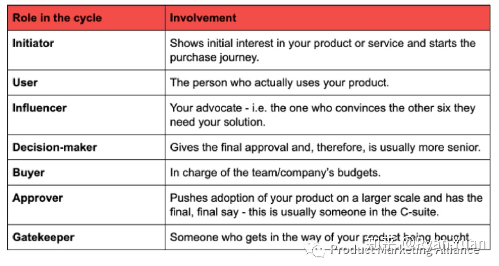
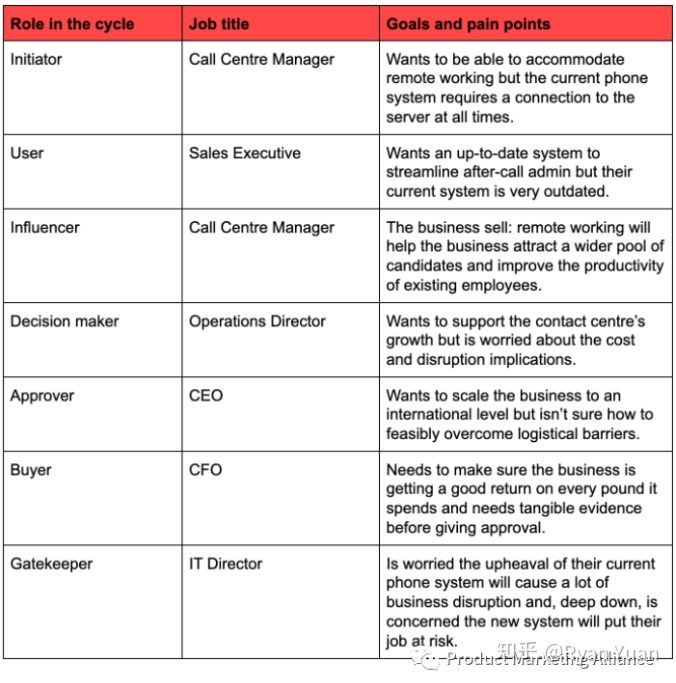
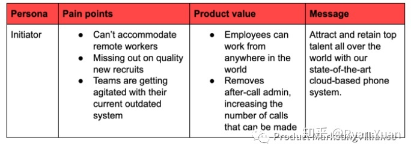
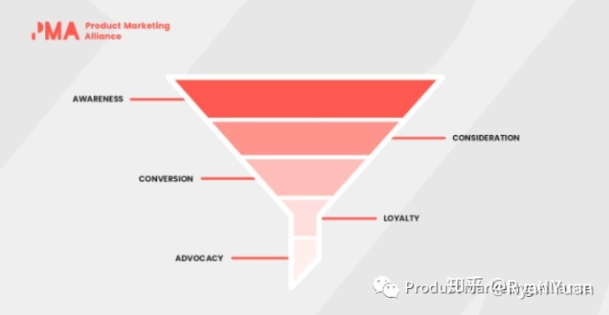
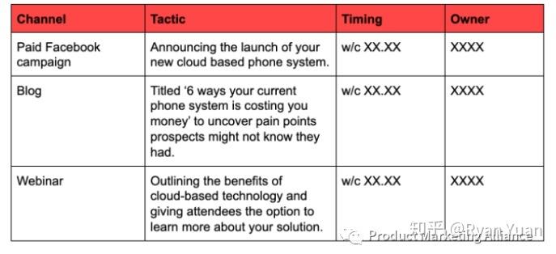

## 关于进入市场策略（Go-to-Market Strategy）的一切 - 市场营销, 把握用户痛点、产品规划、产品变现闭环  
  
### 作者  
digoal  
  
### 日期  
2021-03-12   
  
### 标签  
PostgreSQL , gtm , go to market , 市场营销 , 产品   
  
----  
  
## 背景  
用户痛点、产品规划、产品变现怎么打好配合, 就是市场营销的关键.     
  
原文:  https://zhuanlan.zhihu.com/p/150440793  
  
想象一下：您拥有一个绝佳的商业主意，相信所有公司内部的利益相关者都会喜欢这个主意。  
  
进入会议室后，您向公司介绍了您的商业计划。没错！他们接受了这个想法，并希望将其推向市场。  
  
但现在您缺少这个拼图里重要的一块 - 出色的进入市场（GTM）策略。有了它您才可以引起目标受众的兴趣。  
  
因此，不多说废话了，让我们详细来介绍GTM策略的细节，并帮您的产品或服务走上成功的道路。  
  
  
  
## 什么是进入市场Go-to-Market策略?  
  
简而言之，进入市场策略是用于将产品或服务推向市场的营销阶段。就这么简单。您可以将其视为一个典型的平台，可以让引起目标受众的注意并对您的产品/服务进行付费。  
  
但是，学会走路之前先不要跑步。 首先，您需要：  
  
- 找出您的市场问题  
- 解释您的产品或服务提供的解决方案  
  
我知道这听起来很笼统，不过每个产品和市场都是不一样的。因此，每种GTM策略都是独特的，并没有“标准模板”之类的东西。  
  
我们可以以任天堂的Switch为例。这是一款混合游戏机，主要面向对移动游戏感兴趣的游戏玩家，他们也希望在舒适的居家环境中进行游戏。因此，其设计师将这些特性组合在一起。用户可以乘坐公交车，或在家链接到他们的电视里玩。  
  
另一方面，Xbox One在面向在线游戏社区的市场上占有很大的市场份额，并且该公司提供了像Xbox Live等功能来满足他们的需求。当然该产品不是便携式的，但是Microsoft评估了他们的客户需求并相应地制定了GTM战略。  
  
我们举这两个例子的意思是，这些产品都提供游戏娱乐功能，但它们满足不同的需求，并为各自的受众提供不同的解决方案。  
  
GTM策略并非仅用于时下时髦的新产品或服务。 远远不是这样的; 它们还用于：  
  
1\. 收购其他业务  
  
2\. 改变业务重点  
  
3\. [宣布一项新功能](https://mp.weixin.qq.com/s?__biz=MzIyMTYwODMxNg==&mid=2247483724&idx=1&sn=4a8c8b9b00d8c5155b82865c838ca437&chksm=e83b615fdf4ce84926e720baae6c920220c284787df29df53bccc0fe628b5454ed9eadae7b94&scene=21#wechat_redirect)  
  
  
  
## 为什么需要进入市场策略？  
  
制定一个好的进入市场策略并非一朝一夕就能完成，而且您会先想知道为什么需要这样做的原因。  
  
简单说来这跟两样东西有关，时间还有资源。  
  
在商业社会，时间和资源都是宝贵的商品；如果您不花时间在完成GTM上，就会浪费大量现金，浪费自己的时间以及其他很多人的时间。  
  
GTM策略可让您打开视野，提高市场知名度，并阻止您发布不必要的产品。如果您没有计划，您将不知道：  
  
1. 您的市场是?  
  
2. 您是否太早还是太晚进入市场？  
  
3. 市场上是否已经充满了与您类似的产品？  
  
还是那句老话，假如在准备阶段失败了，那就准备好失败吧。Fail to prepare, prepare to fail.  
  
  
  
## 进入市场策略要素  
  
建立GTM战略就像制造F1赛车一样。您需要所有的零件拼接一起，才能使其从坑中飞出。如果您想走捷径并急于完成工作，将大概率不会有好的结果。因此，请花费相当时间和精力来制定有效的GTM战略，并考虑以下五个基本要素：  
  
1. 市场定义：销售产品或服务时您将瞄准哪些市场？  
  
2. 客户：这些市场的目标受众是谁？  
  
3. 分销模式：您打算如何向客户交付产品或服务？  
  
4. 产品消息传递和定位：与市场上其他产品或服务相比，所售产品及其独特价值或主要区别是什么？  
  
5. 价格：每个客户群的产品或服务的价格应如何制定？  
  
这里已经概述了基本功能，让我们来将它们付诸实践。  
  
  
  
## 如何制定上市策略  
  
### 步骤1：了解您的客户  
  
可以说，在做任何事情之前，您都需要了解目标客户，即决策者和用户角色。如果您不知道他们要解决的问题，那您就不可能相对应提供解决方案；所做的一切也变成了闭门造车。  
  
据哈佛商业评论的报道/调查显示，在每一笔B2B采购中，共有6.8人参与了采购过程。毋庸置疑，每笔交易的经手的人数实在是不少。但如果您计划适当，就会立即吸引他们购买产品。  
  
让我们来看看参与该周期的每个人及其各自的作用：  
  
- 发起人 Initiator: 最开始对您的产品/服务感兴趣的人，开始了整个的购买旅程  
- 用户 User: 实际上会用到您产品/服务的人  
- 影响者 Influencer: 那个支持您主张的人，即说服其余六个需要该产品的人  
- 决策者 Decision-maker: 那个能做最后决定的人，通常是更资深的  
- 购买者 Buyer: 负责团队/公司预算的人  
- 批准人 Approver: 将这个产品/服务推广到公司更广的应用，拥有最后最后的决策权，通常是C-Level的人员  
- 守门员 Gatekeeper: 一些对您产品销售的途中产生阻碍的人  
  
  
  
同时我们也需要知道的是：  
  
在某些情况下，一个职务可能具有多个角色。例如，您的批准人也可以是用户，发起人也可以是买家等，这些角色不是一成不变的，并且可能因产品和行业而异。  
  
在B2C的世界中，该原理将不被适用。但是，当您考虑它时，客户最终担当了所有七个角色 - 他们听说了您的产品，将成为使用它的人，他们说服自己需要它，他们决定是否购买它，他们自己负责支出，他们可以按下购买键，也可以说服自己不再想要购买这个。  
  
积极主动  
  
有时，您必须尽力而为，然后积极采取行动。召开团队会议，讨论哪些职位适用于您的产品和市场。  
  
当您确定了具有特定相关性的人时，请进一步深入了解他们的工作，他们的目标是什么；也许最重要的是，他们的痛点是什么。最终，您的产品或服务将解决他们所认知的市场缺陷。  
  
因此，请确保完成深入的研究。如果您的工作半途而废，则可能会错过关键信息，并创建出无法完全满足市场要求的GTM策略。  
  
根据上文的不同角色的例子，一个深入研究后的模型可能是这样的：  
  
  
  
使用确定的目标和痛点，您将能够很好地创建消息传递和策略。我们将为您继续提供下一步操作的解释。同时，如果您不确定该如何建立买家角色，不要担心。  
我们为您整理了一篇文章，其中将介绍您需要了解的所有内容。https://productmarketingalliance.com/how-to-create-buyer-personas/ （翻译将随后在本公众号更新)  
  
  
  
### 步骤2：消息传递  
  
接下来，就是把你收集到的信息整合起来，做好一个产品消息传递，就像这个例子一样：  
  
- 角色：发起人  
- 痛点：不能和远程同事沟通；错过一些好的招聘对象；团队对现有的比较旧的系统有些不满  
- 产品价值：雇员可以在任何地方工作；没有了电话后的管理限制，提高可以打的电话的数量  
- 产品消息：借助我们先进的云端电话系统，可以吸引和保留世界各地的顶尖人才  
  
  
  
完成这个操作后，您将必须为每个角色重新做一次。  
  
当然，这似乎有些重复，但是您必须牢记要把消息传递做到100%准确，所以不要着急。 做错一条产品消息，您将需要无穷大的努力来挽回损失。  
  
  
  
### 步骤3：消息测试  
  
对产品消息感到满意了是吧？很好！现在该进行测试并推出一些示例广告。您可能决定在Twitter上发布视频，或者做一些PPC(Pay Per Click)点击付费广告。 尽量使用您以前有过成功经验的渠道，来更好地验证产品消息传递的有效性。  
  
有时候，对传递消息的方式进行一些小的更改，可能也会对结果产生压倒性的影响。考虑以下一些因素  
  
- 平台： 像一些社交平台，领英，微博，视频网站或者是App内消息  
- 目标客户  
- 内容的形式：视频，文字还是图片  
  
这里的可能性是无穷无尽的。  
  
无论您决定采用哪种方法，跟踪进度都是至关重要的。如果出现什么问题了，马上停止。如果发现有可以改善的地方，请立即处理。  
  
当您跟踪指标时，耐心确实是一种美德。如果某件事无法在24小时内正常工作，请不要轻易产生下意识的反应。坚持一段。但是，如果您获得特别平庸的效果，请不要等待太久，因为这样可以将时间花费在其他地方。  
  
一切都归结为常识。通过将材料面向特定的受众，着重于对应的职务，性别，工作角色等，您可以获得更多的吸引力。  
  
  
  
### 步骤4：了解您的旅程  
  
如果您要开车去从未去过的地方，您是否会使用导航系统，还是说看缘分看心情看看能走到哪？如果选择后者，则有可能无法到达目的地， 在这种情况下，客户购买旅程也完全适用这个比喻。  
  
您需要了解客户的旅程和您自己的行程，以确保最终到达目的地。在这里出于礼貌，我们将先专注于了解买家的旅程。 后头再帮您了解您自己的。  
  
买方的旅程是直截了当的，大部分时间看起来像这样：买方发现问题，买方研究解决方案，买方找到一些供应商名单，买方与相关团队讨论供应商选项，买方做出决定。  
  
但是，当我们从非消费者的角度看待这一过程时，可能会出现复杂性，许多组织都使用此营销渠道作为指导：  
  
  
让我们从上至下来看看这个营销渠道/漏斗：  
  
1、最上面：Awareness 意识  
  
抓住目标市场的注意力，可以通过像博客，视频，白皮书等事情完成。  
  
2、中间：Consideration 考虑  
  
一个潜在的客户对您的产品产生了某种兴趣（可能是下载了一个线上用户说明，可能是参加过你们的一个活动），这就是您使用专业性和行业权威的时候，可以试试邀请潜在客户参加一个案例学习之类的活动继续下一步。  
  
3、底部：Conversion 转化  
  
到了这个阶段，潜在的客户已经有了所需要的所有信息，拿到了你们报价或者是得到了一个免费试用期，距离最终的决定已经很近了。  
  
  
  
行动要点  
  
针对您的业务，潜在客户生成的流程，创建量身定制的营销渠道/漏斗。考虑如何在意识和考虑阶段增加机会。和您的销售团队商量，看能如何改变沟通方式，来确保优化转换阶段。  
  
  
  
### 步骤5：制定策略  
  
我们已经拥有所有必要的组件，是时候将它们放在一起并创建我们自己的GTM了。  
  
在此阶段，将有一些决定您策略的因素：  
  
- 预算  
- 成本  
- 市场规模  
- 您的销售周期是如何运作  
  
  
查看一下您有的预算，回顾迄今为止取得的成就，将您的产品定位为参考，并回答以下关键问题：  
  
- 测试期间哪个渠道最有效？  
- 有些消息是否比其他消息更具影响力？  
- 哪些频道无效？  
- 某些目标受众是否比其他目标受众更具吸引力？  
- 如何与潜在客户进行交流？  
- 我们如何帮助销售团队获得更多转化？  
- 我们该怎么做才能消除“守门员“的不确定性？  
- 我们需要创建什么资料来针对渠道的某些阶段？  
  
  
  
假设您做的一切都没有问题，这将为您提供以下明确指示：  
  
- 理想的营销渠道  
- 您将在各个渠道使用的消息  
- 您应该针对哪些人  
- 他们是否喜欢面对面，还是通过电话/电子邮件等方式进行交谈  
- 您需要为销售团队准备的资源和备用方案  
- 您需要生成的内容  
  
  
没有什么比让不同的人朝不同的方向前进更糟糕的了。因此，创建一个时间表以保持对事物的统治并防止任何事物被错失掉了。不用担心，它不必是艺术品。如果您需要一些启发，这是我们之前计划的一些内容：  
  
  
  
（四个栏目分别为 渠道/战略/时间点/负责人）  
  
  
  
### 步骤6：编写内容  
  
无论是产品营销部门本身还是市场部门，您都需要创建内容库来帮助您交付GTM总体规划。  
  
这里有一篇独立文章专门讨论内容的创建及应用：https://productmarketingalliance.com/how-to-acquire-users-through-content-marketing/  
  
  
  
### 步骤7：始终要衡量成功  
  
好了，你终于做到了！您已经制定了GTM策略，但还差一步。您还需要的是，指出成功的模样。毕竟，进行所有这些艰苦的工作并不知道是否值得这样做有什么意义？（之前的文章有讲过这点，我们该如何衡量产品营销的成功）  
  
制定一套高但可实现的目标，以确保您可以持续跟踪绩效。如果一切都不正常，请不要担心，回到绘图板上重新评估。  
  
Look after the numbers, the numbers will look after you.  
  
假如您不理睬这些数字，文章一开始再好的商业主意也不会取得成功。  
  
作者：Ryan Yuan；公众号：Product Marketing Alliance (ID: PMAAPAC) 欢迎关注  
  
  
#### [PostgreSQL 许愿链接](https://github.com/digoal/blog/issues/76 "269ac3d1c492e938c0191101c7238216")
您的愿望将传达给PG kernel hacker、数据库厂商等, 帮助提高数据库产品质量和功能, 说不定下一个PG版本就有您提出的功能点. 针对非常好的提议，奖励限量版PG文化衫、纪念品、贴纸、PG热门书籍等，奖品丰富，快来许愿。[开不开森](https://github.com/digoal/blog/issues/76 "269ac3d1c492e938c0191101c7238216").  
  
  
#### [9.9元购买3个月阿里云RDS PostgreSQL实例](https://www.aliyun.com/database/postgresqlactivity "57258f76c37864c6e6d23383d05714ea")
  
  
#### [PostgreSQL 解决方案集合](https://yq.aliyun.com/topic/118 "40cff096e9ed7122c512b35d8561d9c8")
  
  
#### [德哥 / digoal's github - 公益是一辈子的事.](https://github.com/digoal/blog/blob/master/README.md "22709685feb7cab07d30f30387f0a9ae")
  
  

  
  
#### [PolarDB 学习图谱: 训练营、培训认证、在线互动实验、解决方案、生态合作、写心得拿奖品](https://www.aliyun.com/database/openpolardb/activity "8642f60e04ed0c814bf9cb9677976bd4")
  
  
#### [购买PolarDB云服务折扣活动进行中, 55元起](https://www.aliyun.com/activity/new/polardb-yunparter?userCode=bsb3t4al "e0495c413bedacabb75ff1e880be465a")
  
  
#### [About 德哥](https://github.com/digoal/blog/blob/master/me/readme.md "a37735981e7704886ffd590565582dd0")
  
