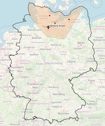
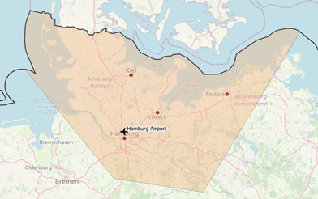
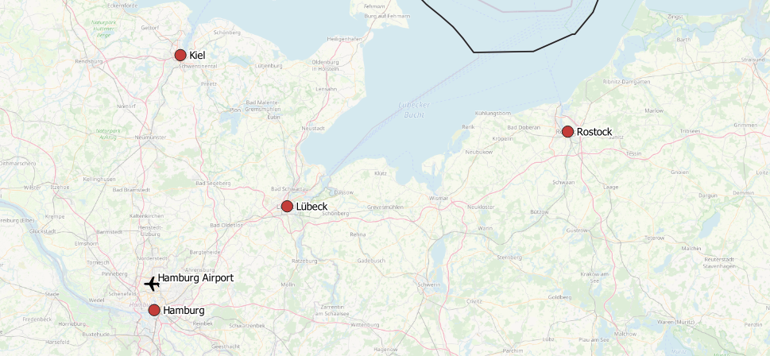
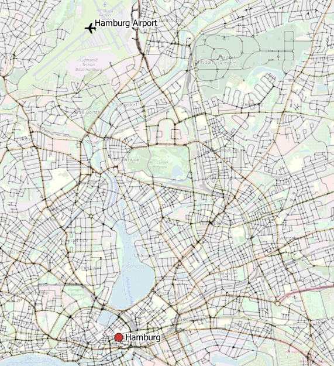
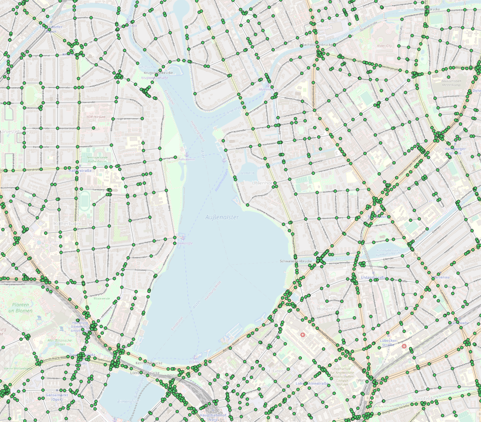
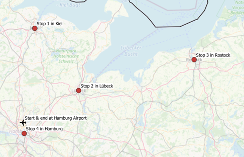

## 行程规划 , 商旅问题 , 旅游问题 , postgis , pgrouting , postgresql , Traveling Salesman Problem (or TSP)    
        
### 作者        
digoal        
        
### 日期        
2021-03-17        
        
### 标签        
PostgreSQL , 商旅 , 旅行 , 行程    
        
----        
        
## 背景        
    
[《多点最优路径规划 - (商旅问题,拼车,餐饮配送,包裹配送,包裹取件,回程单)》](../201704/20170409_01.md)   
  
[《聊一聊双十一背后的技术 - 物流、动态路径规划》](../201611/20161114_01.md)    
  
[《聊一聊双十一背后的技术 - 物流, 动态路径规划》](../201607/20160710_01.md)    
  
https://www.cybertec-postgresql.com/en/traveling-salesman-problem-with-postgis-and-pgrouting/  
  
Last time, we experimented with lesser known PostGIS functions to extract areas of interest for sales. Now, let’s extend our example regarding catchment areas by optimizing trips within the area of interest we generated in our previous example, which is around Hamburg. Let’s ask the following question:  
which order should we visit our major cities in so that we can optimize our trip’s costs?  
  
This optimization problem is commonly known as the Traveling Salesman Problem (or TSP).  
  
Apart from PostGIS, pgRouting will be used to tackle this challenge within PostgreSQL only. pgRouting is served as a PostgreSQL extension, which adds a lot of geospatial routing functionality on top of PostGIS.  
I recommend you check out its online documentation, located at https://pgrouting.org/, to get an overview.  
  
  
Figure 1 Area of interest around Hamburg  
  
  
  
  
Figure 2 Area of interest around Hamburg, Zoom  
  
  
  
This article is organized as follows:  
  
- Dataset import  
- Layer setup  
- Extract shortest round trip  
- Final thoughts and outlook  
  
## Dataset import  
We will re-use osm files and datasets processed in my last blogpost, so first, please play through the blogpost sections involved. Subsequently, an intermediate table “tspPoints” must be created, which contains major cities and airports covered by our preferred area around Hamburg only (see the annex for ddl).  
To solve TSP by utilizing our pgRouting functionality, we must generate a graph out of osm data. Different tools like osm2pgrouting or osm2po exist, which generate a routable graph from plain osm data. Due to limited memory resources on my development machine, I decided to give osm2po a try.  
  
So then – let’s start. After downloading the latest osm2po release from https://osm2po.de/releases/,  
we need to adapt its configuration, in order to generate the desired graph  as an sql file.  
Please uncomment the following line in osm2po.config to accomplish this task.  
  
```  
postp.0.class = de.cm.osm2po.plugins.postp.PgRoutingWriter  
```  
  
Now we’re ready to generate our graph by executing  
  
```  
java -Xmx8g -jar osm2po-core-x.x.x-signed.jar workDir=/data/de-graph prefix=de tileSize=x /data/germany-latest.osm.pbf  
```  
  
The outputted sql file can easily be imported to PostGIS by calling  
  
```  
psql -U username -d dbname -q -f /data/de-graph/de_2po_4pgr.sql  
```  
  
the resulting graph table contains geometries for edges only (see annex for ddl). To generate source and target nodes too, let’s utilize pgr_createverticestable as follows:  
  
```  
select pgr_createverticestable('de_2po_4pgr', 'geom_way', 'source', 'target');  
```  
  
## Layer setup  
Slowly, we’re getting closer . Figure 3 to 5 represent our stacked layer setup on top of OpenStreetMap, which is based upon the following tables:  
  
- tspPoints contains intermediate stops  
- de_2po_4pgr stores graphs’ edge geometries  
- de_2po_4pgr_vertices persists graphs’ node geometries  
  
Figure 3 Intermediate trip stops  
  
  
  
Figure 4 Edges around Hamburg  
  
  
  
Figure 5 Edges + nodes around Hamburg  
  
  
  
## Solving TSP  
Now let’s ask pgRouting to solve our traveling salesmen problem by querying  
  
```  
SELECT  
     seq, node, cost, agg_cost  
FROM  
     pgr_TSP(  
       $$  
       SELECT *   
       FROM  
         pgr_dijkstraCostMatrix(  
           'SELECT id, source, target, cost, reverse_cost FROM de_2po_4pgr',  
           (  
            with nearestVertices as(  
              SELECT a.id   
              from  
                tsppoints,  
                lateral (  
                  select id, the_geom   
                  from  
                    osmtile_germany.de_2po_4pgr_vertices_pgr  
                  order by  
                    osmtile_germany.de_2po_4pgr_vertices_pgr.the_geom <-> osmtile_germany.tsppoints.geom   
                  limit 1  
               ) a  
            )  
            select array_agg(id)   
            from  
               nearestVertices  
          ),   
          directed := false  
        )$$,   
        start_id := 591341  
);  
```  
  
This command results in the optimal order of intermediate stops (edges next to our cities) forming our trip. It’s worth pointing out that the optimal route (order) depends on the cost-matrix’s respective cost-function, which was defined to calculate the edge’s weights. In our case, the cost function is prescribed by osm2po and expressed as length/kmh.  
  
To export the sequence of city names to pass through, the nodes returned by pgr_TSP must be joined back to tspPoints. Please consult the annex for this particular query extension. From figure 6 we now realize that the optimal route goes from Hamburg Airport to Kiel, Lübeck, Rostock and Hamburg before bringing us back to our airport.  
  
  
Figure 6 Optimal order of stops  
  
  
  
## Final thought and outlook  
This time, we took a quick look at pgRouting to solve a basic traveling salesman problem within PostGIS. Feel free to experiment with further cost functions and to move on to calculating detailed routes between cities by utilizing further pgRouting functions.  
  
## Annex  
  
```  
create table if not exists osmtile_germany.de_2po_4pgr  
(  
      id integer not null  
         constraint pkey_de_2po_4pgr  
           primary key,  
      osm_id bigint,  
      osm_name varchar,  
      osm_meta varchar,  
      osm_source_id bigint,  
      osm_target_id bigint,  
      clazz integer,  
      flags integer,  
      source integer,  
      target integer,  
      km double precision,  
      kmh integer,  
      cost double precision,  
      reverse_cost double precision,  
      x1 double precision,  
      y1 double precision,  
      x2 double precision,  
      y2 double precision,  
      geom_way geometry(LineString,4326)  
);  
   
create index if not exists idx_de_2po_4pgr_source  
      on osmtile_germany.de_2po_4pgr (source);  
   
create index if not exists idx_de_2po_4pgr_target  
      on osmtile_germany.de_2po_4pgr (target);  
   
create index if not exists idx_de_2po_geom  
     on osmtile_germany.de_2po_4pgr using gist (geom_way);  
  
  
create table osmtile_germany.tspPoints  
(  
id   serial primary key,  
name text,  
geom geometry(Point, 4326)  
);  
   
create index idx_tspPoints on osmtile_germany.tspPoints using gist (geom);  
```  
  
```  
SELECT seq, node, a.name, a.geom  
FROM  
     pgr_TSP(  
       $$  
       SELECT *   
       FROM  
         pgr_dijkstraCostMatrix(  
           'SELECT id, source, target, cost, reverse_cost FROM de_2po_4pgr',  
           (  
             with nearestVertices as(  
             SELECT a.id   
             from  
               tsppoints,  
               lateral (  
                 select id, the_geom   
                 from  
                   osmtile_germany.de_2po_4pgr_vertices_pgr  
                 order by  
                   osmtile_germany.de_2po_4pgr_vertices_pgr.the_geom <-> osmtile_germany.tsppoints.geom   
                 limit 1  
               ) a  
             )  
             select array_agg(id)   
             from  
               nearestVertices  
           ),   
           directed := false  
          )$$,   
          start_id := 591341  
      ),   
     de_2po_4pgr_vertices_pgr,  
     lateral (  
        select name, geom  
        from  
          osmtile_germany.tsppoints  
        order by  
          osmtile_germany.tsppoints.geom <-> the_geom  
        limit 1  
      ) a  
where node = id  
```  
    
  
#### [PostgreSQL 许愿链接](https://github.com/digoal/blog/issues/76 "269ac3d1c492e938c0191101c7238216")
您的愿望将传达给PG kernel hacker、数据库厂商等, 帮助提高数据库产品质量和功能, 说不定下一个PG版本就有您提出的功能点. 针对非常好的提议，奖励限量版PG文化衫、纪念品、贴纸、PG热门书籍等，奖品丰富，快来许愿。[开不开森](https://github.com/digoal/blog/issues/76 "269ac3d1c492e938c0191101c7238216").  
  
  
#### [9.9元购买3个月阿里云RDS PostgreSQL实例](https://www.aliyun.com/database/postgresqlactivity "57258f76c37864c6e6d23383d05714ea")
  
  
#### [PostgreSQL 解决方案集合](https://yq.aliyun.com/topic/118 "40cff096e9ed7122c512b35d8561d9c8")
  
  
#### [德哥 / digoal's github - 公益是一辈子的事.](https://github.com/digoal/blog/blob/master/README.md "22709685feb7cab07d30f30387f0a9ae")
  
  

  
  
#### [PolarDB 学习图谱: 训练营、培训认证、在线互动实验、解决方案、生态合作、写心得拿奖品](https://www.aliyun.com/database/openpolardb/activity "8642f60e04ed0c814bf9cb9677976bd4")
  
  
#### [购买PolarDB云服务折扣活动进行中, 55元起](https://www.aliyun.com/activity/new/polardb-yunparter?userCode=bsb3t4al "e0495c413bedacabb75ff1e880be465a")
  
  
#### [About 德哥](https://github.com/digoal/blog/blob/master/me/readme.md "a37735981e7704886ffd590565582dd0")
  
