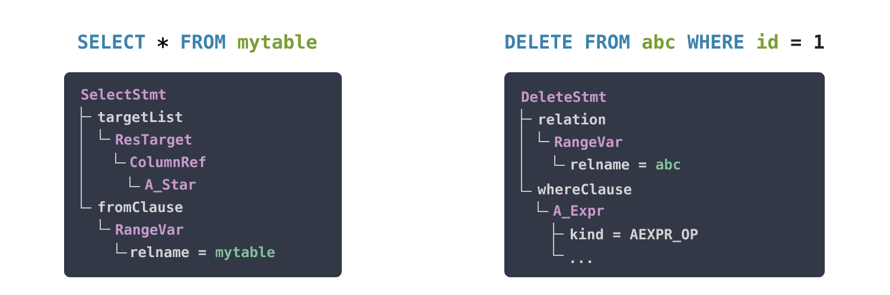
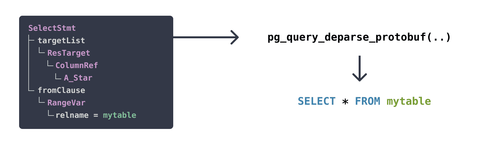
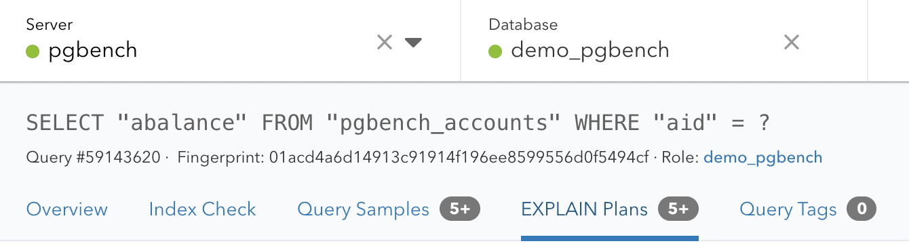

## SQL 审查基础插件 pg_query , 识别风险SQL等, Introducing pg_query 2.0: The easiest way to parse Postgres queries  
  
### 作者  
digoal  
  
### 日期  
2021-03-20   
  
### 标签  
PostgreSQL , parser , SQL 审查    
  
----  
  
## 背景   
SQL 审查, 例如开发人员提交变更SQL, DBA负责检查SQL有无风险, 人肉.  
  
我们可以通过定义一些规则自动化识别风险, SQL 审查! parser是基本功.    
  
除此以外, 还可以被用于SQL语法兼容, SQL监控, 高亮语法, SQL debug等场景.    
  
https://pganalyze.com/blog/pg-query-2-0-postgres-query-parser  
  
https://github.com/pganalyze/libpg_query  
  
https://github.com/pganalyze  
  
  
  
  
The query parser is a core component of Postgres: the database needs to understand what data you're asking for in order to return the right results. But this functionality is also useful for all sorts of other tools that work with Postgres queries. A few years ago, we released pg_query to support this functionality in a standalone C library.  
  
pganalyze uses pg_query to parse and analyze every SQL query that runs on your Postgres database. Our initial motivation was to create pg_query for checking which tables a query references, or what kind of statement it is. Since then we've expanded its use in pganalyze itself. pganalyze now truncates query text in a smart manner in the query overview. The pganalyze-collector supports collecting EXPLAIN plans, and uses pg_query to support log-based EXPLAIN. And we link together pg_stat_statements and auto_explain data in pganalyze using query fingerprints (another pg_query feature we'll discuss in detail in a later section).  
  
## Postgres community tools build on pg_query  
But, what we didn't expect at the time, was the tremendous interest we've seen from the community. The Ruby library alone has received over 3.5 million downloads in its lifetime.  
  
Thanks to many contributors, pg_query now has bindings for other languages beyond Ruby and Go, such as Python (pglast, maintained by Lele Gaifax), Node.js (pgsql-parser, maintained by Dan Lynch) and even OCaml. There are also many notable third-party projects that use pg_query to parse Postgres queries. Here are some of our favorites:  
  
- sqlc provides type safe SQL-based databases access in Go  
- pgdebug lets you debug complex CTEs and execute parts as a standalone query  
- Google's HarbourBridge uses pg_query for helping customers trial Spanner from Postgres sources  
- DuckDB uses a forked version of pg_query for their parsing layer  
- GitLab uses pg_query for normalizing queries in their internal error reporting  
- Splitgraph uses pg_query via the pglast Python binding to parse the SQL statements in Splitfiles  
- sqlint lints your SQL files for correctness  
  
Today, it's time to bring pg_query to the next level.  
  
  
## Announcing pg_query 2.0: Better & faster parsing, with Postgres 13 support  
We're excited to announce the next major version of pg_query, pg_query 2.0.  
  
In this version, you'll find support for:  
  
- Parsing the PostgreSQL 13 query syntax  
- Deparser as part of the core C library, to turn modified parse trees back into SQL  
- New parse tree format based on Protocol Buffers (Protobuf)  
- Improved, faster query fingerprinting mechanism  
- And much more!  
  
To start, let's revisit how pg_query actually works.  
  
## How pg_query turns a Postgres statement into a parse tree  
There are many ways to parse SQL, but the scope for pg_query is very specific. That is, to be able to parse the full Postgres query syntax, the same way as Postgres does. The only reliable way to do this, is to use the Postgres parser itself.  
  
pg_query isn't the first project to do this, for example pgpool has a copy of the Postgres parser as well. But we needed an easily maintainable, self-contained version of the parser in a standalone C library. This would let us, and the Postgres community, use the parser from almost any language by writing a simple wrapper.  
  
How did we do this? We started by looking at the Postgres source. Looking at the source, you will find the function called raw_parser:  
  
```  
/*  
 * raw_parser  
 *		Given a query in string form, do lexical and grammatical analysis.  
 *  
 * Returns a list of raw (un-analyzed) parse trees.  The immediate elements  
 * of the list are always RawStmt nodes.  
 */  
List *  
raw_parser(const char *str)  
{  
    ...  
```  
  
After raw parsing, Postgres goes into parse analysis. In that phase Postgres identifies the types of columns, maps table names to the schema and more. After that, Postgres does planning (see our introduction to Postgres query planning), and then executes the query based on the query plan.  
  
For pg_query, all we need is the raw parser. Looking at the code, we discovered a problem. The parser code still depends on a lot of Postgres code, such as for memory management or error handling. We needed a repeatable way to extract just enough source code to compile and run the parser.  
  
Thus the idea was born to automatically extract the Postgres parser code and its dependencies.  
  
## Using LibClang to extract C source code from Postgres  
Our goal: A set of self-contained C files that represent a copy of Postgres' raw_parser function. But we don't want to copy the code manually. Luckily we can use LibClang to parse C code, and understand its dependencies.  
  
The details of this could fill many pages, but here is a simplified version of how this works:  
  
### 1. Each translation unit (.c file) in the source is analyzed via LibClang's Ruby binding:  
```  
require 'ffi/clang'  
  
index = FFI::Clang::Index.new(true, true)  
translation_unit = index.parse_translation_unit(file, ['... CFLAGS ...'])  
```  
  
### 2. The analysis walks through the file and marks each C method, as well as the symbols it references:  
```  
translation_unit.cursor.visit_children do |cursor, parent|  
  @file_to_symbol_positions[cursor.location.file] ||= {}  
  @file_to_symbol_positions[cursor.location.file][cursor.spelling] = [cursor.extent.start.offset, cursor.extent.end.offset]  
  cursor.visit_children do |child_cursor, parent|  
    if child_cursor.kind == :cursor_decl_ref_expr || child_cursor.kind == :cursor_call_expr  
      @references[cursor.spelling] ||= []  
      (@references[cursor.spelling] << child_cursor.spelling).uniq!  
    end  
    :recurse  
  end  
end  
```  
  
### 3. We resolve required C methods and their code, based on the top-level method we are looking for:  
```  
def deep_resolve(method_name, depth: 0, trail: [], global_resolved_by_parent: [], static_resolved_by_parent: [], static_base_filename: nil)  
  ...  
  global_dependents = (@references[method_name] || []  
  global_dependents.each do |symbol|  
    deep_resolve(symbol, depth: depth + 1, trail: trail + [method_name], global_resolved_by_parent: global_resolved_by_parent + global_dependents)  
  end  
  ...  
end  
  
deep_resolve('raw_parser')  
```  
  
### 4. We write out just the portions of the C code that are required (see details here)  
  
With this, we have a working Postgres parser!  
  
You can find the full details in the pg_query source.  
  
Once we can call the Postgres parser in our standalone library, we can get the result as a parse tree, represented as Postgres parser C structs. But now we needed to make this useful in other languages, such as Ruby or Go.  
  
## Turning Postgres parser C structs into JSON and Protobufs  
It's a little known fact, but Postgres actually has a text representation of a query parse tree. Its rarely used directly, being reserved for internal communication and debugging. The easiest way to see an example is by looking at the adbin field in pg_attref, which shows the internal representation for an expression of an column default value (to contrast, pg_get_expr shows the expression in SQL):  
  
```  
SELECT adbin, pg_get_expr(adbin, adrelid) FROM pg_attrdef WHERE adrelid = 'mytable'::regclass AND adnum = 1;  
-[ RECORD 1 ]-------------------------------------------------------------------------------------------------------------------------------------------------------------------------------------------------------------------------------------------------------------------------------------------------------------------------------------------------------------------------------------------------------------------------------------------------------------  
adbin       | {FUNCEXPR :funcid 480 :funcresulttype 23 :funcretset false :funcvariadic false :funcformat 2 :funccollid 0 :inputcollid 0 :args ({FUNCEXPR :funcid 1574 :funcresulttype 20 :funcretset false :funcvariadic false :funcformat 0 :funccollid 0 :inputcollid 0 :args ({CONST :consttype 2205 :consttypmod -1 :constcollid 0 :constlen 4 :constbyval true :constisnull false :location 68 :constvalue 4 [ -27 10 -122 1 0 0 0 0 ]}) :location 60}) :location -1}  
pg_get_expr | nextval('mytable_id_seq'::regclass)  
```  
  
This text format is not useful for working with a parse tree in other languages. Thus, we needed a more portable format to export the parse tree from C, and import it in another language such as Ruby.  
  
The initial version of pg_query used JSON for this. JSON is great, since you can parse it in pretty much any programming language. Thus, in this new pg_query release, we still support JSON.  
  
We're also introducing support for a new schema-based format, using Protocol Buffers (Protobuf).  
  
## Why pg_query 2.0 adds support for Protocol Buffers  
Whilst JSON is convenient for passing around the parse tree, it has a few problems:  
  
- JSON is slower to parse than a binary format  
- Memory usage can become an issue with complex parse trees  
- Building logic around a tree of JSON data is error-prone, as one needs to add a lot of checks to identify each node and its supported fields  
- It's hard to instantiate new parse tree nodes, for example to use for deparsing back into a SQL statement  
  
In pg_query 1.0, accessing the value of a "SELECT 1" would have looked like this with the Ruby binding:  
  
```  
result = PgQuery.parse("SELECT 1")  
result.tree[0]['RawStmt']['stmt']['SelectStmt']['targetList'][0]['ResTarget']['val']  
# => {"A_Const"=>{"val"=>{"Integer"=>{"ival"=>1}}, "location"=>7}}  
```  
  
Here is how Protobuf improves the parse tree handling in Ruby:  
  
```  
result = PgQuery.parse("SELECT 1")  
result.tree.stmts[0].stmt.select_stmt.target_list[0].res_target.val.a_const  
# => <PgQuery::A_Const: val: <PgQuery::Node: integer: <PgQuery::Integer: ival: 1>>, location: 7>  
```  
  
Note how we have a full class definition for each parse tree node type, making interaction with the tree nodes significantly easier.  
  
Now, let's say I want to change a parse tree and turn it back into a SQL statement. For this, I need a deparser.  
  
## Turning parse trees back into SQL using a deparser  
  
  
Illustration of deparsing Postgres parse tree back into SELECT statement  
  
Postgres itself has deparser logic in many places. For example postgres_fdw has a deparser to generate the query to send to the remote server. But, the deparser code in Postgres requires a post-parse analysis parse tree (that directly references relation OIDs, etc). That means we can't make use of it in pg_query, which works with raw parse trees.  
  
For many years now, the Ruby pg_query library has had a deparser. Over the years we've had many community contributions to make it complete. The third-party libraries for Python and Node.js also have their own deparser. These efforts were all done in parallel, without sharing code. And the Go library is missing a deparser altogether.  
  
How can we reduce the duplicated effort in the community? By creating a new portable deparser for raw parse trees. This avoids having duplicate efforts for every pg_query-based library.  
  
### The pg_query deparser with coverage for all Postgres regression tests  
pg_query 2.0 features a new deparser, written in C. This was by far the biggest undertaking of this new release. The new deparser is able to generate all SQL queries used in the Postgres regression tests (which the pg_query parser can of course parse), and more.  
  
It works like this, here by example of the Go library, which before did not have a deparser:  
  
```  
package main  
  
import (  
  "fmt"  
  pg_query "github.com/pganalyze/pg_query_go/v2"  
)  
  
func main() {  
  // Parse a query  
  result, err := pg_query.Parse("SELECT 42")  
  if err != nil {  
    panic(err)  
  }  
  
  // Modify the parse tree  
  result.Stmts[0].Stmt.GetSelectStmt().GetTargetList()[0].GetResTarget().Val =  
    pg_query.MakeAConstStrNode("Hello World", -1)  
  
  // Deparse back into a query  
  stmt, err := pg_query.Deparse(result)  
  if err != nil {  
    panic(err)  
  }  
  fmt.Printf("%s\n", stmt)  
}  
```  
  
This will output the following:  
  
```  
SELECT 'Hello World'  
```  
  
First, the deparsing step encodes the Go structs into the new Protobuf format. Then, the C library decodes this into Postgres parse tree C structs. Last but not least, the C library's new deparser turns the C structs into the SQL query text.  
  
Stepping away from deparsing, let's take a look at the new fingerprinting mechanism:  
  
## Fingerprints in pg_query: A better way to check if two queries are identical  
Let's start with the motivation for query fingerprints. pganalyze needs to link together Postgres statistics across different data sources. For example queries from pg_stat_statements with the Postgres auto_explain logs. You can see the fingerprint in pganalyze on the query details page:  
  
  
pganalyze Query Details page showing a query and its associated fingerprint value  
  
This query can be represented differently depending on which part of Postgres you look at:  
  
- pg_stat_statements: ```SELECT "abalance" FROM "pgbench_accounts" WHERE "aid" = ?```  
- auto_explain: ```SELECT abalance FROM pgbench_accounts WHERE aid = 4674588```  
  
A simple text comparison would not be sufficient to determine that these queries are identical.  
  
### Why did we create our own query fingerprint concept?  
Postgres already has the concept of a "queryid", calculated based on the post-parse analysis tree. It's used in places such as pg_stat_statements to distinguish the different query entries.  
  
But, this queryid is not available everywhere today, e.g. you can't get it with auto_explain plans. It's also not portable between databases, as it's dependent on specific relation OIDs. Even if you have the exact same queries on your staging and production system, they will have different queryid values. And the queryid can't be generated outside the context of a Postgres server. Thus, pganalyze has its own mechanism, called a query fingerprint.   
  
Fingerprints identify a Postgres query based on its raw parse tree alone. We've open-sourced this mechanism in pg_query:  
  
```  
PgQuery.fingerprint('SELECT a, b FROM c')  
# => "fb1f305bea85c2f6"  
  
PgQuery.fingerprint('SELECT b, a FROM c')  
# => "fb1f305bea85c2f6"  
```  
  
This mechanism does not need a running server, so all you need as input is a valid Postgres query.  
  
With pg_query 2.0, we've done a few enhancements to the fingerprint functionality:  
  
- Use the faster XXH3 hash function, instead of SHA-1. pg_query 1.0 used the outdated cryptographic hash function SHA-1. Cryptographic guarantees are not needed for this use case, and XXH3 is much faster.  
- Contain the fingerprint in a 64-bit value, instead of 136 bits. We've determined that 64-bit precision is good enough for query fingerprints. Postgres itself thinks so too, since it uses 64-bit for the Postgres queryid. We often use data from pg_stat_statements, so there is little benefit to more bits. Using a smaller data type also means better performance for pganalyze.  
- Fix edge cases where two almost identical queries had different fingerprints. Fingerprints should ignore query differences, when they result in the same query intent. We've addressed a few cases where this was not working as expected. You can look at the corresponding wiki page to understand these changes in more detail.  
  
## Additional changes for pg_query 2.0  
A few other things about the new release:  
  
- The pg_query library now resides in the pganalyze organization on GitHub. This makes it clear who maintains and funds the core development. We will continue to make pg_query available under the BSD 3-clause license.  
- pg_query has a new method for splitting queries. This can be useful when you want to split a multi-statement string into its component statements, for example SELECT ';'; SELECT 'foo' into SELECT ';' and SELECT 'foo'  
- There is a new function available to access the Postgres scanner. This includes the location of comments in a query text. One could envision building a syntax highlighter based on this. Or extract comments from queries whilst ignoring comment-like tokens in a constant value.  
  
## Conclusion  
The new pg_query 2.0 is available today, with bindings for Go and Ruby available to start. We are also working on a new pganalyze-maintained Rust binding that we'll have news about soon.  
  
Help us get the word out by sharing this post on Twitter.  
   
  
#### [PostgreSQL 许愿链接](https://github.com/digoal/blog/issues/76 "269ac3d1c492e938c0191101c7238216")
您的愿望将传达给PG kernel hacker、数据库厂商等, 帮助提高数据库产品质量和功能, 说不定下一个PG版本就有您提出的功能点. 针对非常好的提议，奖励限量版PG文化衫、纪念品、贴纸、PG热门书籍等，奖品丰富，快来许愿。[开不开森](https://github.com/digoal/blog/issues/76 "269ac3d1c492e938c0191101c7238216").  
  
  
#### [9.9元购买3个月阿里云RDS PostgreSQL实例](https://www.aliyun.com/database/postgresqlactivity "57258f76c37864c6e6d23383d05714ea")
  
  
#### [PostgreSQL 解决方案集合](https://yq.aliyun.com/topic/118 "40cff096e9ed7122c512b35d8561d9c8")
  
  
#### [德哥 / digoal's github - 公益是一辈子的事.](https://github.com/digoal/blog/blob/master/README.md "22709685feb7cab07d30f30387f0a9ae")
  
  

  
  
#### [PolarDB 学习图谱: 训练营、培训认证、在线互动实验、解决方案、生态合作、写心得拿奖品](https://www.aliyun.com/database/openpolardb/activity "8642f60e04ed0c814bf9cb9677976bd4")
  
  
#### [购买PolarDB云服务折扣活动进行中, 55元起](https://www.aliyun.com/activity/new/polardb-yunparter?userCode=bsb3t4al "e0495c413bedacabb75ff1e880be465a")
  
  
#### [About 德哥](https://github.com/digoal/blog/blob/master/me/readme.md "a37735981e7704886ffd590565582dd0")
  
