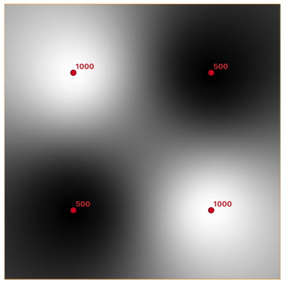

## PostgreSQL PostGIS raster 栅格数据存储与导出为GDAL tif图片 - encode bytea转换    
      
### 作者      
digoal      
      
### 日期      
2021-04-02       
      
### 标签      
PostgreSQL , encode , bytea , 大对象 , 栅格 , gdal , tif , xdd     
      
----      
      
## 背景      
    
[《PostgreSQL 大对象使用》](../202012/20201205_01.md)     
    
[《PostgreSQL psql的元素周期表 - 包括大对象操作》](../201906/20190607_04.md)      
    
[《PostgreSQL 大对象或bytea存取pdf,jpg等文件 - PostgreSQL export regular file like pdf, word, text, doc stored in bytea type》](../201306/20130626_01.md)      
    
[《大对象 - Use PostgreSQL server program import binary data into database bytea type》](../201303/20130306_01.md)      
    
除了使用大对象, 还可以使用bytea存储二进制数据. 导出也很方便.     
    
http://blog.cleverelephant.ca/2021/04/psql-binary.html    
    
Dumping a ByteA with psql    
    
Sometimes you just have to work with binary in your PostgreSQL database, and when you do the bytea type is what you’ll be using. There’s all kinds of reason to work with bytea:    
    
- You’re literally storing binary things in columns, like image thumbnails.    
- You’re creating a binary output, like an image, a song, a protobuf, or a LIDAR file.    
- You’re using a binary transit format between two types, so they can interoperate without having to link to each others internal format functions. (This is my favourite trick for creating a library with optional PostGIS integration, like ogr_fdw.)    
    
Today I was doing some debugging on the PostGIS raster code, testing out a new function for interpolating a grid surface from a non-uniform set of points, and I needed to be able to easily see what the raster looked like.    
    
    
    
There’s a function to turn a PostGIS raster into a GDAL image format, so I could create image data right in the database, but in order to actually see the image, I needed to save it out as a file. How to do that without writing a custom program? Easy! (haha)    
    
http://postgis.net/docs/RT_ST_AsGDALRaster.html    
    
Basic steps:    
    
- Pipe the query of interest into the database    
- Access the image/music/whatever as a bytea    
- Convert that bytea to a hex string using encode()    
- Ensure psql is not wrapping the return in any extra cruft    
- Pipe the hex return value into xxd    
- Redirect into final output file    
    
Here’s what it would look like if I was storing PNG thumbnails in my database and wanted to see one:    
    
```    
echo "SELECT encode(thumbnail, 'hex') FROM persons WHERE id = 12345" \
  | psql --quiet --tuples-only -d dbname \
  | xxd -r -p \
  > thumbnail.png    
```    
    
Any bytea output can be pushed through this chain, here’s what I was using to debug my ST_GDALGrid() function.    
    
```    
echo "SELECT encode(ST_AsGDALRaster(ST_GDALGrid('MULTIPOINT(10.5 9.5 1000, 11.5 8.5 1000, 10.5 8.5 500, 11.5 9.5 500)'::geometry, ST_AddBand(ST_MakeEmptyRaster(200, 400, 10, 10, 0.01, -0.005, 0, 0), '16BSI'), 'invdist' ), 'GTiff'), 'hex')" \
  | psql --quiet --tuples-only grid \
  | xxd -r -p \
  > testgrid.tif     
```    
    
使用工具:    
    
xdd, 函数 encode, ST_AsGDALRaster      
    
https://www.postgresql.org/docs/devel/functions-binarystring.html  
    
    
  
#### [PostgreSQL 许愿链接](https://github.com/digoal/blog/issues/76 "269ac3d1c492e938c0191101c7238216")
您的愿望将传达给PG kernel hacker、数据库厂商等, 帮助提高数据库产品质量和功能, 说不定下一个PG版本就有您提出的功能点. 针对非常好的提议，奖励限量版PG文化衫、纪念品、贴纸、PG热门书籍等，奖品丰富，快来许愿。[开不开森](https://github.com/digoal/blog/issues/76 "269ac3d1c492e938c0191101c7238216").  
  
  
#### [9.9元购买3个月阿里云RDS PostgreSQL实例](https://www.aliyun.com/database/postgresqlactivity "57258f76c37864c6e6d23383d05714ea")
  
  
#### [PostgreSQL 解决方案集合](https://yq.aliyun.com/topic/118 "40cff096e9ed7122c512b35d8561d9c8")
  
  
#### [德哥 / digoal's github - 公益是一辈子的事.](https://github.com/digoal/blog/blob/master/README.md "22709685feb7cab07d30f30387f0a9ae")
  
  

  
  
#### [PolarDB 学习图谱: 训练营、培训认证、在线互动实验、解决方案、生态合作、写心得拿奖品](https://www.aliyun.com/database/openpolardb/activity "8642f60e04ed0c814bf9cb9677976bd4")
  
  
#### [购买PolarDB云服务折扣活动进行中, 55元起](https://www.aliyun.com/activity/new/polardb-yunparter?userCode=bsb3t4al "e0495c413bedacabb75ff1e880be465a")
  
  
#### [About 德哥](https://github.com/digoal/blog/blob/master/me/readme.md "a37735981e7704886ffd590565582dd0")
  
