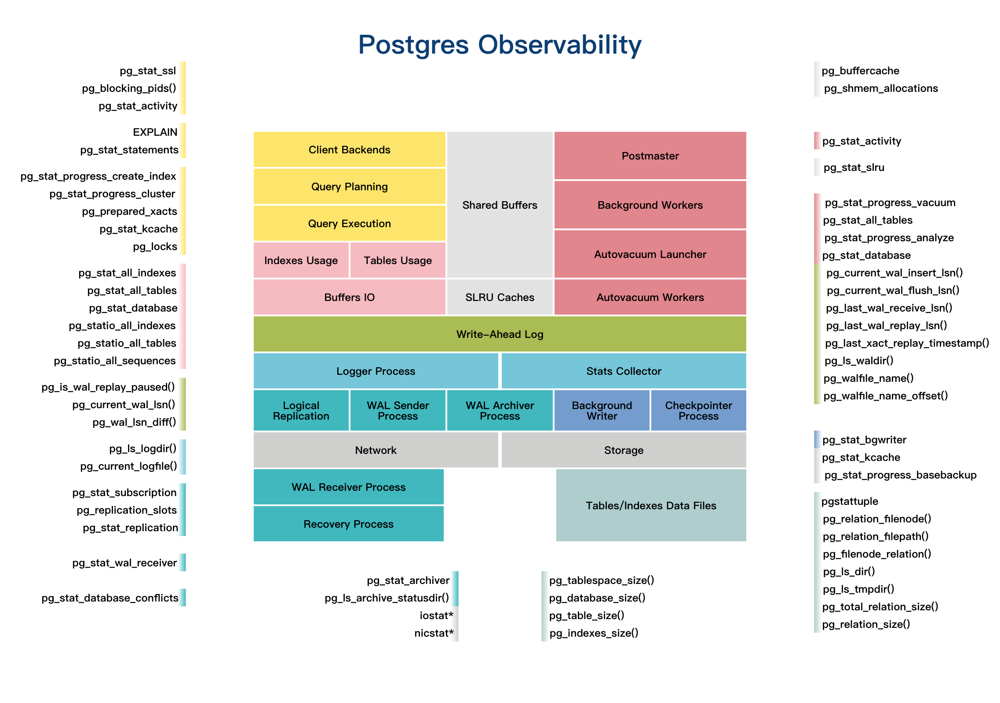

## PostgreSQL 内部 动态视图、统计信息、管理函数、系统视图、dashboard等鸟瞰图 - pgstats.dev - 含外部插件和外部OS工具   
      
### 作者      
digoal      
      
### 日期      
2021-04-28       
      
### 标签      
PostgreSQL , pgstats.dev , 鸟瞰图 , pg_stat , 管理函数 , 动态视图 , 统计信息      
      
----      
      
## 背景      
来自 https://pgstats.dev  
  
整理得很完整的鸟瞰图.    
  
   
  
包括:  
- client backends  
    - pg_stat_ssl, pg_blocking_pids(), pg_stat_activity  
- query planning  
    - EXPLAIN, pg_stat_statements  
- query execution  
    - pg_stat_activity, pg_stat_statements, pg_stat_progress_create_index, pg_stat_progress_cluster, pg_prepared_xacts, pg_stat_kcache, pg_locks  
- indexes usage  
    - pg_stat_all_indexes  
- tables usage  
    - pg_stat_all_tables  
- buffers io  
    - pg_stat_statements, pg_stat_database, pg_statio_all_indexes, pg_statio_all_tables, pg_statio_all_sequences  
- shared buffers  
    - pg_buffercache, pg_shmem_allocations  
- slru caches  
    - pg_stat_slru  
- postmaster  
    - pg_stat_database  
- background workers  
    - pg_stat_activity  
- autovacuum launcher  
    - pg_stat_activity  
- autovacuum workers  
    - pg_stat_activity, pg_stat_progress_vacuum, pg_stat_all_tables, pg_stat_progress_analyze  
- wal  
    - EXPLAIN, pg_stat_statements, pg_is_wal_replay_paused(), pg_is_xlog_replay_paused(), pg_current_wal_lsn(), pg_current_xlog_location(), pg_wal_lsn_diff(), pg_xlog_location_diff(), pg_current_wal_insert_lsn(), pg_current_xlog_insert_location(), pg_current_wal_flush_lsn(), pg_current_xlog_flush_location(), pg_last_wal_receive_lsn(), pg_last_xlog_receive_location(), pg_last_wal_replay_lsn(), pg_last_xlog_replay_location(), pg_last_xact_replay_timestamp(), pg_ls_waldir(), pg_walfile_name(), pg_xlogfile_name(), pg_walfile_name_offset(), pg_xlogfile_name_offset()  
- logger process  
    - pg_ls_logdir(), pg_current_logfile()  
- stats collector  
- logical replication  
    - pg_stat_subscription, pg_replication_slots  
- wal sender process  
    - pg_replication_slots, pg_stat_replication  
- wal archiver process  
    - pg_stat_archiver, pg_ls_archive_statusdir()  
- background writer  
    - pg_stat_bgwriter  
- checkpointer process  
    - pg_stat_database, pg_stat_bgwriter  
- network  
    - nicstat  
- storage  
    - iostat, pg_stat_kcache, pg_stat_progress_basebackup  
- wal receiver process  
    - pg_stat_wal_receiver, pg_last_wal_receive_lsn()  
- recovery process  
    - pg_stat_database_conflicts, pg_last_wal_replay_lsn(), pg_last_xact_replay_timestamp()  
- tables/indexes data files  
    - pgstattuple, pg_relation_filenode(), pg_relation_filepath(), pg_filenode_relation(), pg_ls_dir(), pg_ls_tmpdir(), pg_total_relation_size(), pg_relation_size(), pg_indexes_size(), pg_table_size(), pg_database_size(), pg_tablespace_size()  
  
  
  
#### [PostgreSQL 许愿链接](https://github.com/digoal/blog/issues/76 "269ac3d1c492e938c0191101c7238216")
您的愿望将传达给PG kernel hacker、数据库厂商等, 帮助提高数据库产品质量和功能, 说不定下一个PG版本就有您提出的功能点. 针对非常好的提议，奖励限量版PG文化衫、纪念品、贴纸、PG热门书籍等，奖品丰富，快来许愿。[开不开森](https://github.com/digoal/blog/issues/76 "269ac3d1c492e938c0191101c7238216").  
  
  
#### [9.9元购买3个月阿里云RDS PostgreSQL实例](https://www.aliyun.com/database/postgresqlactivity "57258f76c37864c6e6d23383d05714ea")
  
  
#### [PostgreSQL 解决方案集合](https://yq.aliyun.com/topic/118 "40cff096e9ed7122c512b35d8561d9c8")
  
  
#### [德哥 / digoal's github - 公益是一辈子的事.](https://github.com/digoal/blog/blob/master/README.md "22709685feb7cab07d30f30387f0a9ae")
  
  

  
  
#### [PolarDB 学习图谱: 训练营、培训认证、在线互动实验、解决方案、生态合作、写心得拿奖品](https://www.aliyun.com/database/openpolardb/activity "8642f60e04ed0c814bf9cb9677976bd4")
  
  
#### [购买PolarDB云服务折扣活动进行中, 55元起](https://www.aliyun.com/activity/new/polardb-yunparter?userCode=bsb3t4al "e0495c413bedacabb75ff1e880be465a")
  
  
#### [About 德哥](https://github.com/digoal/blog/blob/master/me/readme.md "a37735981e7704886ffd590565582dd0")
  
