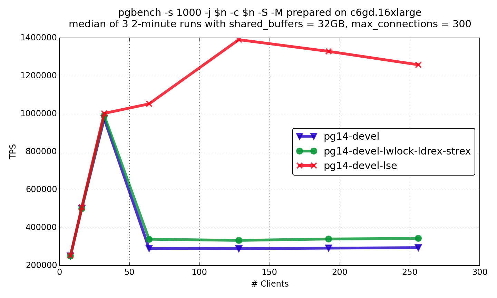
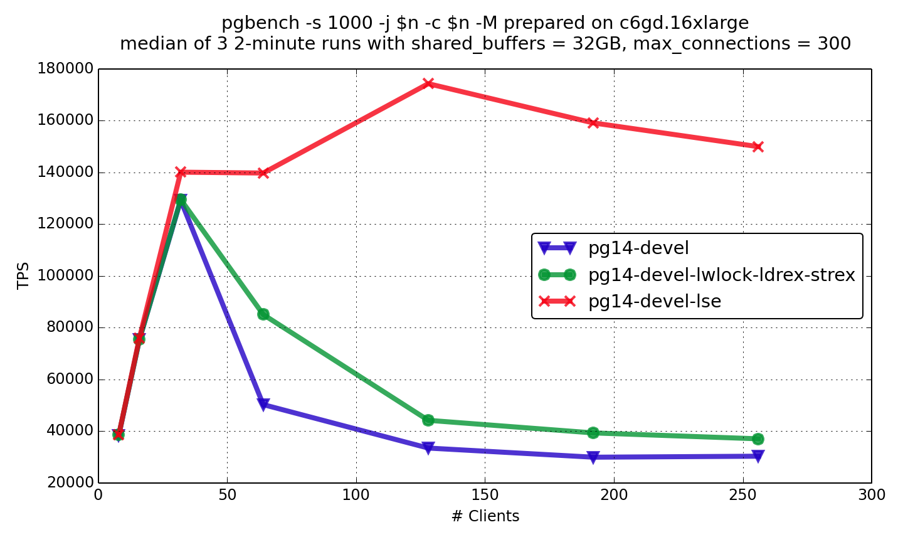

## 老外惊呼: 世界变化快! PostgreSQL 14 on ARM 8.1 加上LSE patch性能飙升到140万tps    
  
### 作者  
digoal  
  
### 日期  
2021-04-30   
  
### 标签  
PostgreSQL , arm , lse , 14    
  
----  
  
## 背景  
  
老外惊呼: 世界变化快!  
  
ARM 8.1 defines a set of LSE instructions, which, in particular, provide the way to implement atomic operation in a single instruction (just like x86).  
  
从性能测试来看, PG 14打了使用lse指令的patch后, 1亿数据量pgbench, 140万只读TPS, 18万读写TPS. arm 8.1 已经和x86相当了. x86 64核 估计也就140万左右tps了.   
  
[转载全文如下]  
  
包含一些测试数据.    
  
https://akorotkov.github.io/blog/2021/04/30/arm/  
  
https://www.postgresql.org/message-id/CAPpHfdsGqVd6EJ4mr_RZVE5xSiCNBy4MuSvdTrKmTpM0eyWGpg%40mail.gmail.com  
  
https://www.postgresql.org/message-id/CAPpHfdsKrh7c7P8-5eG-qW3VQobybbwqH%3DgL5Ck%2BdOES-gBbFg%40mail.gmail.com  
  
The world changes. ARM architecture breaks into new areas of computing. An only decade ago, only your mobile, router, or another specialized device could be ARM-based, while your desktop and server were typically x86-based. Nowadays, your new MacBook is ARM-based, and your EC2 instance could be ARM as well.  
  
In the mid-2020, Amazon made graviton2 instances publically available. The maximum number of CPU core there is 64. This number is where it becomes interesting to check PostgreSQL scalability. It’s exciting to check because ARM implements atomic operations using pair of load/store. So, in a sense, ARM is just like Power, where I’ve previously seen a significant effect of platform-specific atomics optimizations.  
  
But on the other hand, ARM 8.1 defines a set of LSE instructions, which, in particular, provide the way to implement atomic operation in a single instruction (just like x86). What would be better: special optimization, which puts custom logic between load and store instructions, or just a simple loop of LSE CAS instructions? I’ve tried them both.  
  
You can see the results of read-only and read-write pgbench on the graphs below (details on experiments are here). pg14-devel-lwlock-ldrex-strex is the patched PostgreSQL with special load/store optimization for lwlock, pg14-devel-lse is PostgreSQL compiled with LSE support enabled.  
  
  
  
  
  
You can see that load/store optimization gives substantial positive effect, but LSE rocks here!  
  
So, if you’re running PostgreSQL on graviton2 instance, make sure you’ve binaries compiled with LSE support (see the instruction) because the effect is dramatic.  
  
BTW, it appears that none of these optimizations have a noticeable effect on the performance of Apple M1. Probably, M1 has a smart enough inner optimizer to recognize these different implementations to be equivalent. And it was surprising that LSE usage might give a small negative effect on Kunpeng 920. It was discouraging for me to know an ARM processor, where single instruction operation is slower than multiple instruction equivalent. Hopefully, processor architects would fix this in new Kunpeng processors.  
  
In general, we see that now different ARM embodiments have different performance characteristics and different effects of optimizations. Hopefully, this is a problem of growth, and it will be overcome soon.  
  
# LSE
# C/C++ on Graviton

### Enabling Arm Architecture Specific Features
To build code with the optimal processor features use the following. If you want to support both Graviton
and Graviton2 you'll have to limit yourself to the Graviton features.

CPU      | GCC                  | LLVM
---------|----------------------|-------------
Graviton | `-march=armv8-a+crc+crypto` | `-march=armv8-a+crc+crypto`
Graviton2 | `-march=armv8.2-a+fp16+rcpc+dotprod+crypto` |`-march=armv8.2-a+fp16+rcpc+dotprod+crypto`

Note: GCC-7 does not support `+rcpc+dotprod`.

### Core Specific Tuning

CPU      | GCC < 9              | GCC >=9
---------|----------------------|-------------
Graviton | `-mtune=cortex-a72`  | `-mtune=cortex-a72`
Graviton2 | `-mtune=cortex-a72`  | `-mtune=neoverse-n1`

### Large-System Extensions (LSE)

The Graviton2 processor in C6g, M6g, and R6g instances has support for the
Armv8.2 instruction set.  Armv8.2 specification includes the large-system
extensions (LSE) introduced in Armv8.1. LSE provides low-cost atomic operations.
LSE improves system throughput for CPU-to-CPU communication, locks, and mutexes.
The improvement can be up to an order of magnitude when using LSE instead of
load/store exclusives.

POSIX threads library needs LSE atomic instructions.  LSE is important for
locking and thread synchronization routines.  The following systems distribute
a libc compiled with LSE instructions:
- Amazon Linux 2,
- Ubuntu 18.04 (needs `apt install libc6-lse`),
- Ubuntu 20.04.

The compiler needs to generate LSE instructions for applications that use atomic
operations.  For example, the code of databases like PostgreSQL contain atomic
constructs; c++11 code with std::atomic statements translate into atomic
operations.  GCC's `-march=armv8.2-a` flag enables all instructions supported by
Graviton2, including LSE.  To confirm that LSE instructions are created,
the output of `objdump` command line utility should contain LSE instructions:
```
$ objdump -d app | grep -i 'cas\|casp\|swp\|ldadd\|stadd\|ldclr\|stclr\|ldeor\|steor\|ldset\|stset\|ldsmax\|stsmax\|ldsmin\|stsmin\|ldumax\|stumax\|ldumin\|stumin' | wc -l
```
To check whether the application binary contains load and store exclusives:
```
$ objdump -d app | grep -i 'ldxr\|ldaxr\|stxr\|stlxr' | wc -l
```

GCC's `-moutline-atomics` flag produces a binary that runs on both Graviton and
Graviton2.  Supporting both platforms with the same binary comes at a small
extra cost: one load and one branch.  To check that an application
has been compiled with `-moutline-atomics`, `nm` command line utility displays
the name of functions and global variables in an application binary.  The boolean
variable that GCC uses to check for LSE hardware capability is
`__aarch64_have_lse_atomics` and it should appear in the list of symbols:
```
$ nm app | grep __aarch64_have_lse_atomics | wc -l
# the output should be 1 if app has been compiled with -moutline-atomics
```

### Porting codes with SSE/AVX intrinsics to NEON

When programs contain code with x64 intrinsics, the following procedure can help
to quickly obtain a working program on Arm, assess the performance of the
program running on Graviton processors, profile hot paths, and improve the
quality of code on the hot paths.

To quickly get a prototype running on Arm, one can use
https://github.com/DLTcollab/sse2neon a translator of x64 intrinsics to NEON.
sse2neon provides a quick starting point in porting performance critical codes
to Arm.  It shortens the time needed to get an Arm working program that then
can be used to extract profiles and to identify hot paths in the code.  A header
file `sse2neon.h` contains several of the functions provided by standard x64
include files like `xmmintrin.h`, only implemented with NEON instructions to
produce the exact semantics of the x64 intrinsic.  Once a profile is
established, the hot paths can be rewritten directly with NEON intrinsics to
avoid the overhead of the generic sse2neon translation.

### Signed vs. Unsigned char
The C standard doesn't specify the signedness of char. On x86 char is signed by
default while on Arm it is unsigned by default. This can be addressed by using
standard int types that explicitly specify the signedness (e.g. `uint8_t` and `int8_t`)
or compile with `-fsigned-char`.

### Using Graviton2 Arm instructions to speed-up Machine Learning

Graviton2 processors been optimized for performance and power efficient machine learning by enabling [Arm dot-product instructions](https://community.arm.com/developer/tools-software/tools/b/tools-software-ides-blog/posts/exploring-the-arm-dot-product-instructions) commonly used for Machine Learning (quantized) inference workloads, and enabling [Half precision floating point - \_float16](https://developer.arm.com/documentation/100067/0612/Other-Compiler-specific-Features/Half-precision-floating-point-intrinsics) to double the number of operations per second, reducing the memory footprint compared to single precision floating point (\_float32), while still enjoying large dynamic range.

### Using Graviton2 Arm instructions to speed-up common code sequences
The Arm instruction set includes instructions that can be used to speedup common
code sequences. The table below lists common operations and links to code sequences:

Operation | Description
----------|------------
[crc](sample-code/crc.c) | Graviton processors support instructions to accelerate both CRC32 which is used by Ethernet, media and compression and CRC32C (Castagnoli) which is used by filesystems.
  
  
  
#### [PostgreSQL 许愿链接](https://github.com/digoal/blog/issues/76 "269ac3d1c492e938c0191101c7238216")
您的愿望将传达给PG kernel hacker、数据库厂商等, 帮助提高数据库产品质量和功能, 说不定下一个PG版本就有您提出的功能点. 针对非常好的提议，奖励限量版PG文化衫、纪念品、贴纸、PG热门书籍等，奖品丰富，快来许愿。[开不开森](https://github.com/digoal/blog/issues/76 "269ac3d1c492e938c0191101c7238216").  
  
  
#### [9.9元购买3个月阿里云RDS PostgreSQL实例](https://www.aliyun.com/database/postgresqlactivity "57258f76c37864c6e6d23383d05714ea")
  
  
#### [PostgreSQL 解决方案集合](https://yq.aliyun.com/topic/118 "40cff096e9ed7122c512b35d8561d9c8")
  
  
#### [德哥 / digoal's github - 公益是一辈子的事.](https://github.com/digoal/blog/blob/master/README.md "22709685feb7cab07d30f30387f0a9ae")
  
  

  
  
#### [PolarDB 学习图谱: 训练营、培训认证、在线互动实验、解决方案、生态合作、写心得拿奖品](https://www.aliyun.com/database/openpolardb/activity "8642f60e04ed0c814bf9cb9677976bd4")
  
  
#### [购买PolarDB云服务折扣活动进行中, 55元起](https://www.aliyun.com/activity/new/polardb-yunparter?userCode=bsb3t4al "e0495c413bedacabb75ff1e880be465a")
  
  
#### [About 德哥](https://github.com/digoal/blog/blob/master/me/readme.md "a37735981e7704886ffd590565582dd0")
  
