## 三分钟搞懂比较优势原理、绝对优势原理、全球贸易     
    
### 作者    
digoal    
    
### 日期    
2021-05-07     
    
### 标签    
PostgreSQL , 全球贸易 , 比较优势 , 绝对优势 , 贸易摩擦    
    
----    
    
## 背景    
https://baike.baidu.com/item/%E6%AF%94%E8%BE%83%E4%BC%98%E5%8A%BF%E5%8E%9F%E7%90%86  
  
比较优势原理可以表述为：在两国之间，劳动生产率的差距并不是在任何产品上都是相等的。每个国家都应集中生产并出口具有比较优势的产品，进口具有比较劣势的产品（即“两优相权取其重，两劣相衡取其轻”），双方均可节省劳动力，获得专业化分工提高劳动生产率的好处。  
  
原文  
  
https://baike.baidu.com/tashuo/browse/content?id=82c735fad69b692a5af7192a  
  
不久前，川普突然发话，  
  
考虑要把美国经济和中国全面脱钩。  
  
  
  
怎么有种感觉，  
  
“懂王”不咋懂“比较优势”原理啊。  
  
  
  
比较优势原理解释了不同经济体之间相互依存和贸易的好处。  
  
我们知道，  
  
不同的人，做同一件事，能力总是有强有弱，  
  
  
  
我们如何判断两个人的能力孰优孰劣呢？  
  
在完成一件事上，谁的投入更少，谁在这件事上就具有绝对优势。  
  
  
  
  
  
在生产上也是如此，相同的产出，谁投入的成本少，谁就具有绝对优势。这里的成本包括时间、人力、资金等。  
  
  
  
  
  
这样做并不是最好的选择，  
  
我们在判断生产优势的时候，除了用投入量来衡量，还可以用机会成本来衡量。  
  
所谓机会成本，  
  
就是你得到某种东西所放弃的东西。  
  
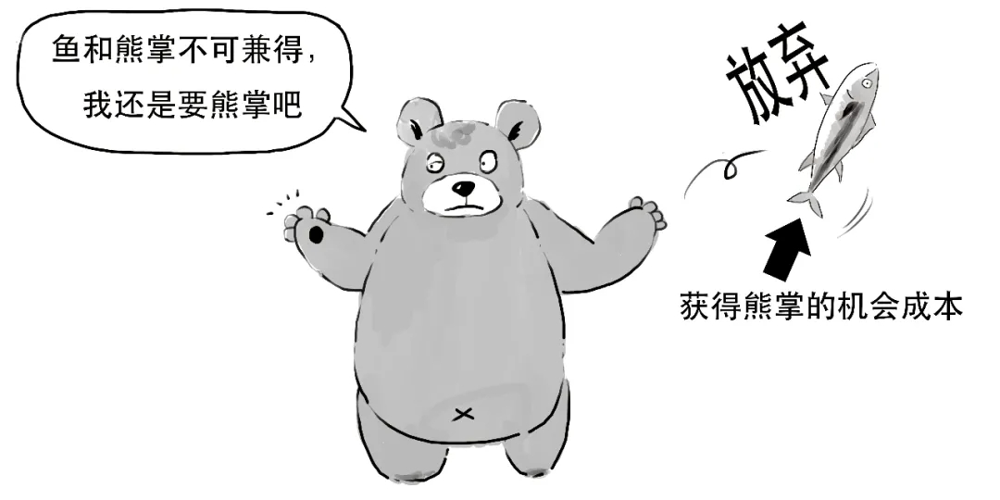  
  
你为了获得某样东西，放弃的其他东西越少或者价值越低，则获得某样东西的机会成本越小。  
  
  
  
  
  
而一个人能力再强，或者一个人能力再弱，在做不同的两件事上，总会有更擅长的。  
  
  
  
你把精力投入在擅长的东西上，机会成本总是低的；反过来，做一件事机会成本低，往往就是自己更擅长的。  
  
机会成本衡量了当生产者面临生产两种产品时的取舍和选择。  
  
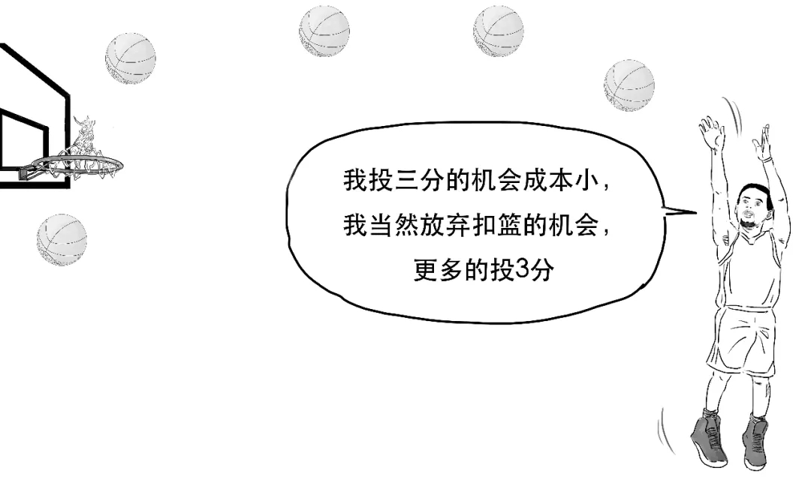  
  
当你生产某种产品的机会成本较小，我们就称在这件事上你具有比较优势。  
  
  
  
假设A国和B国的工厂规模相当，可以生产奶粉，也可以生产面包。  
  
1天时间内，如果A国工厂的全部工人都去生产奶粉，可以生产300罐；  
  
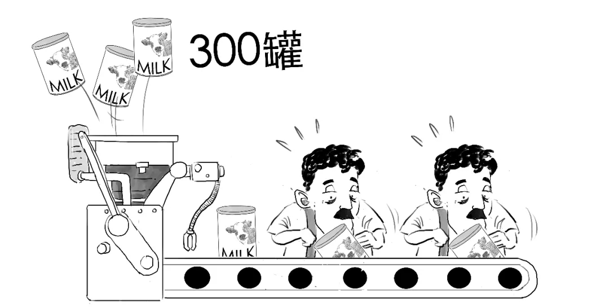  
  
如果全部工人都去生产面包，可以生产600个，  
  
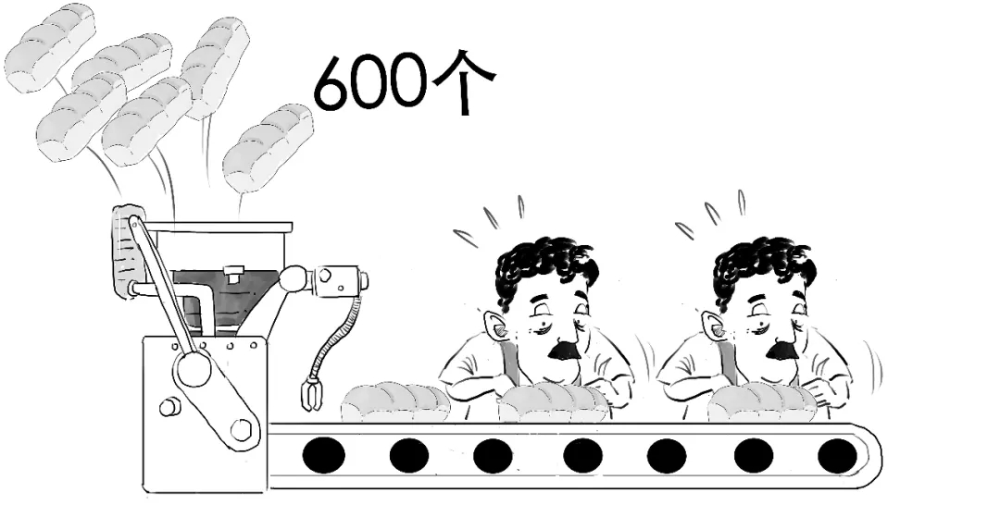  
  
而在海对岸的B国，  
  
工厂全部工人在1天时间可以生产100罐奶粉，  
  
  
  
或者可以生产400个面包。  
  
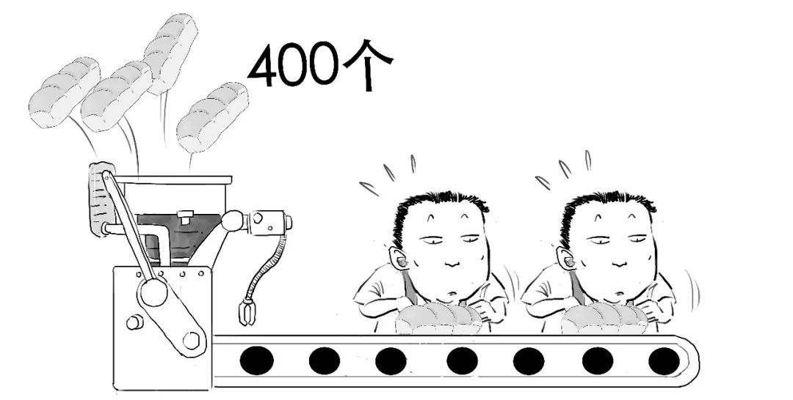  
  
可见，不管是生产奶粉还是面包，A国都具有绝对优势。  
  
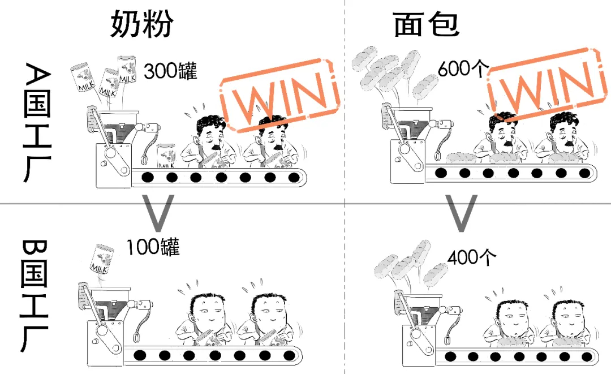  
  
但A国通常不会选择自己生产所有产品，  
  
否则——  
  
  
  
就像你们家，不能因为你妈擅长做各类家务，就让你妈把家务都包圆了，  
  
这样做不是效率最高的。  
  
  
  
所以，我们不仅要看绝对优势，还要看两个国家在生产两种产品上的比较优势。  
  
在上面的例子中，  
  
为了生产1罐奶粉，A国就要放弃生产2个面包的机会，而B国要放弃生产4个面包，  
  
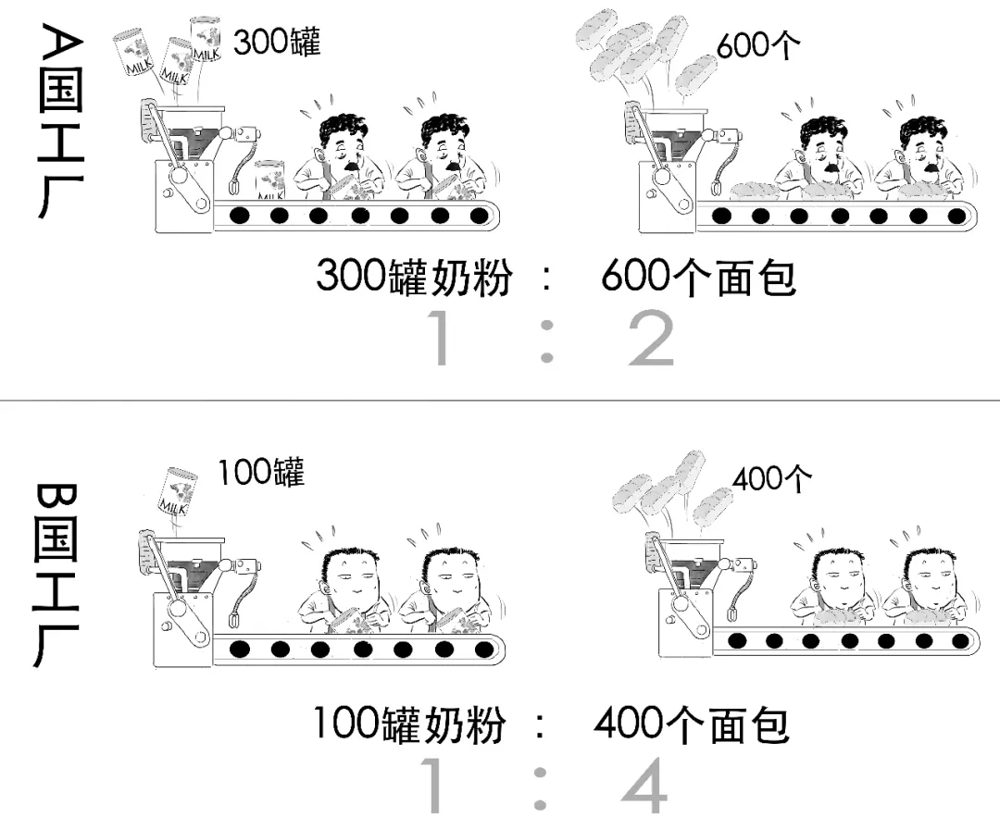  
  
放弃的2个面包就是A国生产1罐奶粉的机会成本；  
  
放弃的4个面包就是B国生产1罐奶粉的机会成本，  
  
可见，A国为生产奶粉放弃的代价较小，因此在生产奶粉上具有比较优势。  
  
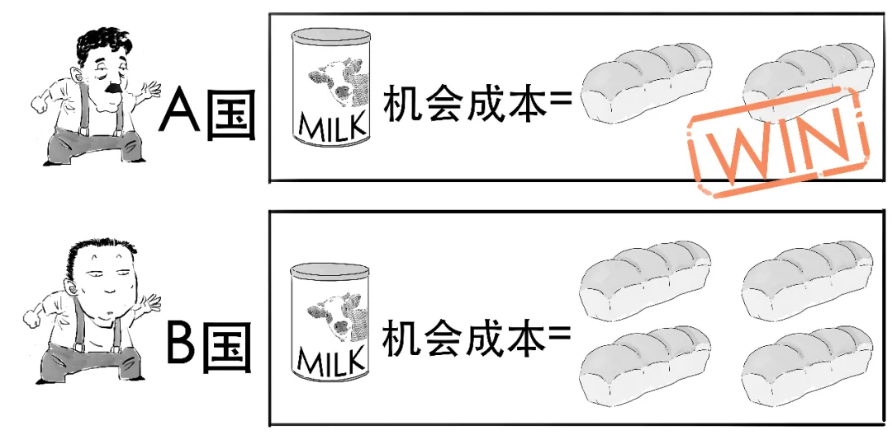  
  
但反过来，为了生产1个面包，  
  
A国就要放弃生产1/2罐奶粉，B国就要放弃生产1/4罐奶粉，  
  
可见，B国放弃的代价较小，在生产面包上具有比较优势。  
  
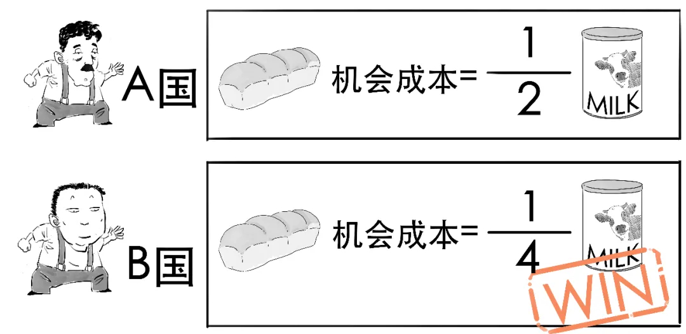  
  
所以这时候，  
  
A国和B国就可以拿出各自具有比较优势的产品进行贸易，  
  
比如，讨价还价后，A国用1罐奶粉换B国3个面包。  
  
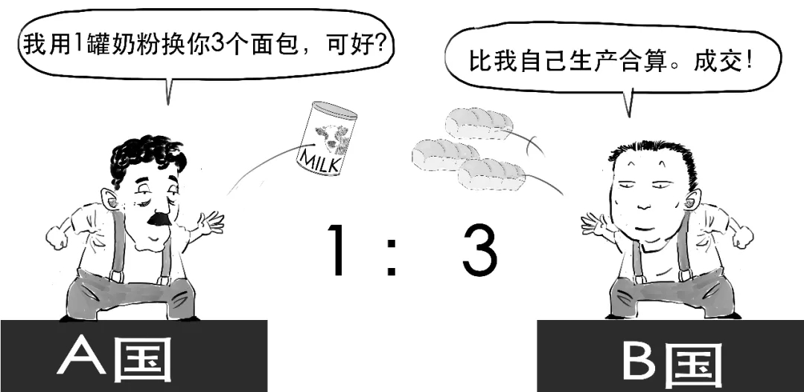  
  
此时，A国换来3个面包，B国换来1罐奶粉，比两种产品都全靠自己生产合算，代价小。  
  
  
  
在这种情况下，他们就可以专门生产他们具有比较优势的产品，A国专注生产奶粉，B国专注生产面包，实现效率最高。  
  
  
  
最终，通过贸易使A国和B国都获益。  
  
  
  
对于贸易双方来说，要想都获利，价格必然在两种机会成本之间。  
  
比如1罐奶粉的价格会在2个面包和4个面包之间。  
  
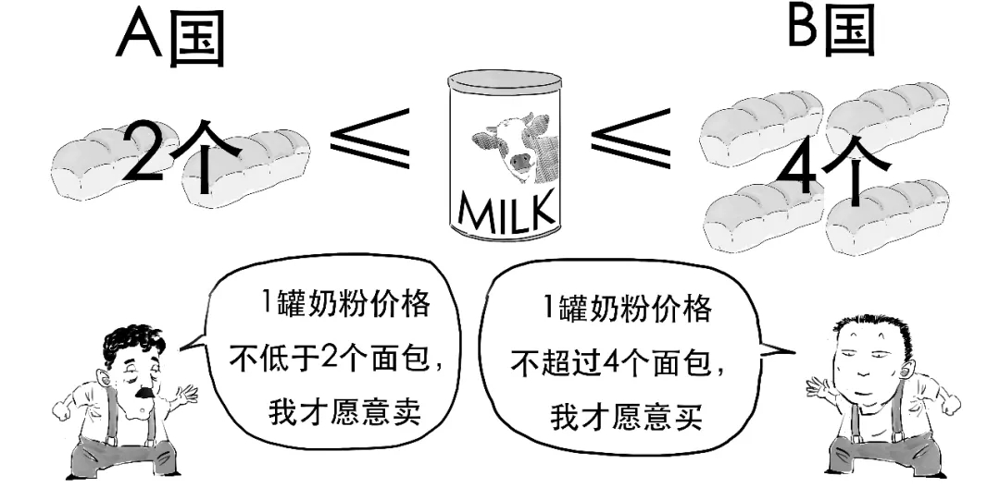  
  
如果价格低于2个面包，那么双方都想买；  
  
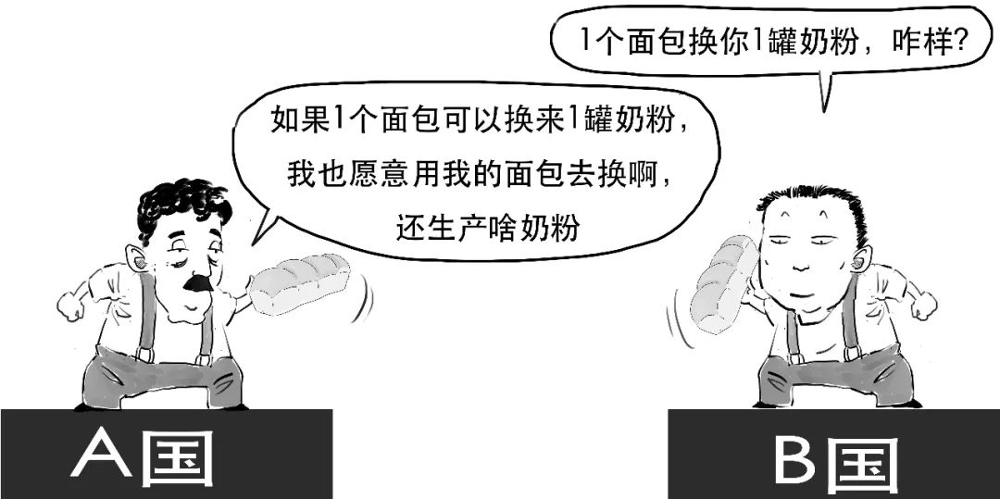  
  
如果价格高于4个面包，那么双方都想卖，  
  
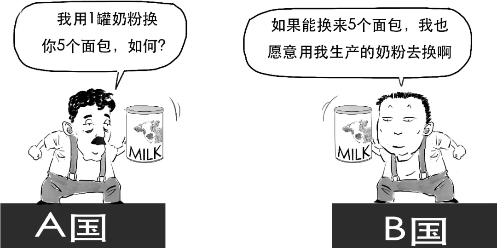  
  
这样，买卖无法促成，贸易就不可能达成。  
  
  
  
不可能，  
  
从上面例子我们可以看到，对生产的两种产品进行比较，一种产品的机会成本是另一种产品机会成本的倒数。  
  
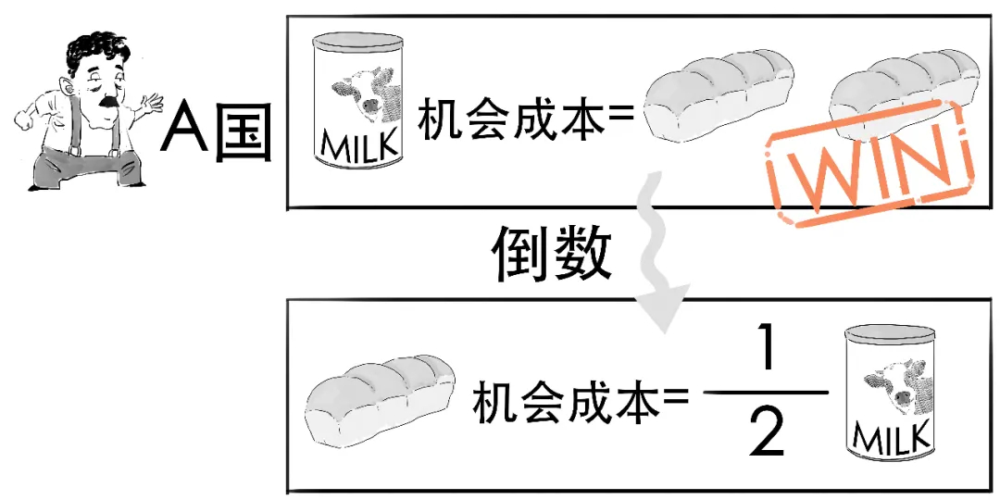  
  
如果一个人生产一种产品的机会成本较高，那么他生产对应的另一种产品的机会成本必然较低。  
  
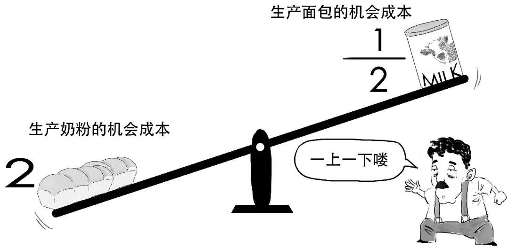  
  
所以我们可以知道，一国即使没有绝对优势，也可以有比较优势，不同的国家都可以从专业化和相互贸易中获利。  
  
经济学家亚当·斯密就曾提出一个观点：如果购买一件东西所付出的代价，比在家里生产所付出的代价小，那就永远不要在家里生产。  
  
  
  
比较优势原理说明，国际贸易可以使每个国家的状况变得更好，这就是生活在一个相互依存的经济中的好处。  
  
好了，  
  
今天就说到这吧。  
  
当然，我们所说通过国际贸易可以使国家作为一个整体的状况变好，但并不是说会使所有人的状况都变好。  
  
比如根据比较优势，一个国家进口粮食，出口汽车，  
  
那么对国内粮食生产者来说——  
  
  
  
  
  
但不可否认，  
  
国际贸易可以促进国家的繁荣。  
  
  
  
  
#### [PostgreSQL 许愿链接](https://github.com/digoal/blog/issues/76 "269ac3d1c492e938c0191101c7238216")
您的愿望将传达给PG kernel hacker、数据库厂商等, 帮助提高数据库产品质量和功能, 说不定下一个PG版本就有您提出的功能点. 针对非常好的提议，奖励限量版PG文化衫、纪念品、贴纸、PG热门书籍等，奖品丰富，快来许愿。[开不开森](https://github.com/digoal/blog/issues/76 "269ac3d1c492e938c0191101c7238216").  
  
  
#### [9.9元购买3个月阿里云RDS PostgreSQL实例](https://www.aliyun.com/database/postgresqlactivity "57258f76c37864c6e6d23383d05714ea")
  
  
#### [PostgreSQL 解决方案集合](https://yq.aliyun.com/topic/118 "40cff096e9ed7122c512b35d8561d9c8")
  
  
#### [德哥 / digoal's github - 公益是一辈子的事.](https://github.com/digoal/blog/blob/master/README.md "22709685feb7cab07d30f30387f0a9ae")
  
  

  
  
#### [PolarDB 学习图谱: 训练营、培训认证、在线互动实验、解决方案、生态合作、写心得拿奖品](https://www.aliyun.com/database/openpolardb/activity "8642f60e04ed0c814bf9cb9677976bd4")
  
  
#### [购买PolarDB云服务折扣活动进行中, 55元起](https://www.aliyun.com/activity/new/polardb-yunparter?userCode=bsb3t4al "e0495c413bedacabb75ff1e880be465a")
  
  
#### [About 德哥](https://github.com/digoal/blog/blob/master/me/readme.md "a37735981e7704886ffd590565582dd0")
  
