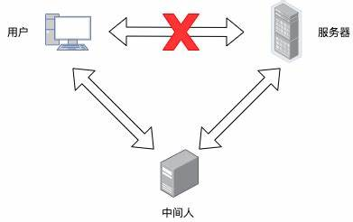
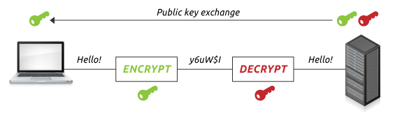
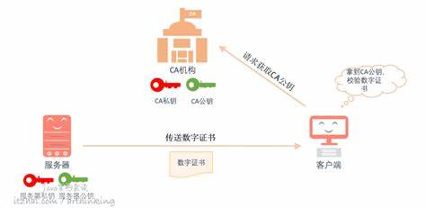
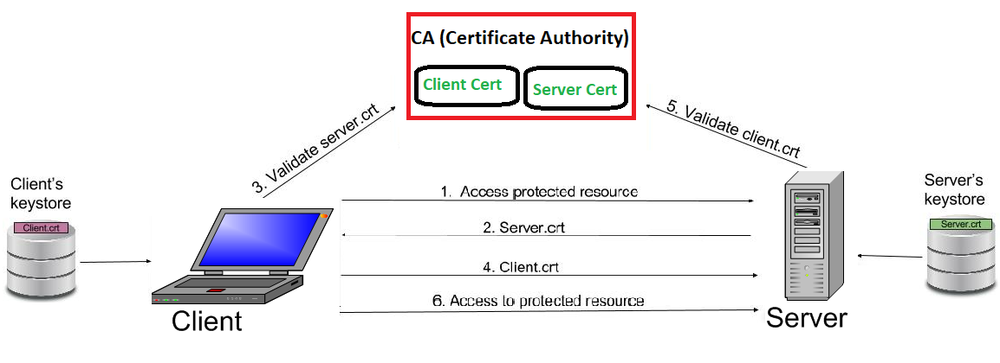
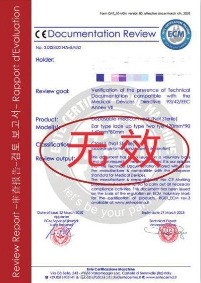

## 为什么校园贷、注销校园贷、刷单、杀猪盘等电信诈骗这么猖獗? - 数据库安全解决方案(SSL)        
      
### 作者      
digoal      
      
### 日期      
2021-05-11       
      
### 标签      
PostgreSQL , 安全       
      
----      
      
## 背景      
[直播回放](https://www.bilibili.com/video/BV1gK411F7vX/)  
  
      
      
搜索引擎输入电信诈骗, 预估有 1,870,000 条结果. 现在大街小巷都在进行防诈骗宣传, 连支付宝都推出了防诈骗考试, 考试通过才可以拿到绿码.         
        
为什么校园贷、注销校园贷、刷单、杀猪盘等电信诈骗这么猖獗?         
        
一句话: 你在向"最熟悉你的陌生人"泄露信息!!!          
        
专坑学生群体！“注销网贷账号”骗局，一个电话诈骗15万. 一位受害者曾感叹道：“没想到躲过了校园贷，却没能躲过注销校园贷。”其实注销校园贷也好，刷单也好，杀猪盘也好，这些诈骗都是新瓶装旧酒。变的是套路，是话术；不变的是骗钱，是利用人性的弱点。我们要再次提醒大家，相关部门并没有推出所谓“注销校园贷”的政策，个人征信信息也无法人为修改。虽然各种骗局令人防不胜防，但请记住关键的一句话：不要轻易向陌生账户转账！        
      
是现在人的智商倒退了吗? 还是骗子穿越了?       
本文将从电信诈骗的本源出发, 揭示骗子如何利用互联网黑客思维进行诈骗.      
常言道: 坏人不可怕，就怕坏人有文化!        
        
## 为什么你会给陌生人转钱呢?         
        
这不就是成人版的《小兔子乖乖, 把门开开》吗? 只是《大灰狼》的伪装手法更高明一点, 实际上在各个领域都充斥着《大灰狼》.          
    
骗子的目的是骗财?骗色? 对你的财产进行转移.    
1、攻破你的系统(例如木马病毒, 监听你的键盘输入, 通过网络(邮件或其他手段)将你的登陆信息发送给骗子), 获取到密码后代替(伪装成)你, 操作转账.    
2、伪装成你要访问的网站(例如银行网站), 登陆时窃取你的输入, 获取到密码后代替(伪装成)你, 操作转账.   
3、诱骗(伪装成)权威可信的目标, 诱导你主动操作转账.   
  
        
        
## 谈谈数据库里的《大灰狼》        
如果说现实中的大灰狼攻击的是人性的弱点, 那么在数据库领域的大灰狼攻击的就是系统的弱点!       
  
黑客的目的是? 窃取数据或搞破坏? 因此《大灰狼》有3种手段来进行诈骗.          
        
1、窃听          
如果《大灰狼》可以检查客户端与服务器之间的网络流量，则它可以读取连接信息（包括用户名和密码）以及所传递的数据。        
        
        
        
2、中间人（MITM）      (伪装成被访问目标)     
如果《大灰狼》可以在客户端和服务器之间传递数据时修改数据，则它可以伪装成服务器，因此即使加密了数据也可以查看和修改数据。然后，《大灰狼》可以将连接信息和数据转发到原始服务器，从而无法检测到此攻击。        
作案手段包括DNS地址劫持，从而将客户端定向到与预期不同的服务器。《大灰狼》悄悄修改你的导航, 把你的交互引入伪装的数据库, 变成它砧板上的肉.         
类似ATM机被不法分子安装银行卡复制器, 吞卡并诱导你打某个指定电话并说出密码. (更高级的连密码键盘都是假的)        
        
        
        
        
3、假冒      (伪装成你自己)      
如果《大灰狼》可以假装成为授权客户，则可以简单地访问它不应该访问的数据。        
例如钥匙(数据库密码)被《大灰狼》盗取, 《大灰狼》就可以拿着你的密码去连接目标数据库.          
        
        
        
        
## 阿里云RDS PostgreSQL 数据库SSL安全功能重磅升级, 彻底规避《大灰狼》.        
        
1、遇到窃听怎么办?         
RDS PG解决方案:      
开启SSL加密来防止这种情况。        
窃取你和数据库交互过程中传输的信息被加密, 加密后即使被窃取也没有价值.         
        
        
        
2、遇到DNS篡改, 网络半路拦截伪装成数据库和你的客户端交互(类似ATM机被不法分子安装银行卡复制器)怎么办?         
RDS PG解决方案:      
采用防伪装数据库设置: 客户端连接数据库时, 数据库必须出示证书, 证明自己是合法的.         
这个证书由权威机构颁发, 通过权威机构给的校验证书来判断证书的真伪、有效期等合法性. 合法后才允许交互.         
      
下面用大白话解释一下权威机构是怎么颁发证书以及检查证书合法性的.       
例如:     
2\.1、市场上流通的货币, 由人民银行印发的, 那怎么知道是真钞还是假钞呢? 银行有验钞机对吧. 除了强有力的法律保障以外, 为了防伪, 货币发行方一定会有一些独特的不可被模仿的技术加入钞票中, 或者在钞票中加入了一些不可告人的秘密, 只能用验钞机才能辨别出来.      
所以:     
- 银行<->权威机构,     
- 验钞机/荧光笔<->权威机构CA证书,     
- 钞票<->被权威机构签名(颁发)的证书.    
    
2\.2、日常使用的证件, 例如身份证、房产证、户口本、结婚证, 都是由对应的权威部门登记颁发, 这些证件怎么判断合法性? 你拿个假的身份证去公安局看看, 他们一定立马把假证打回原形.  为了让身份证可以得到更广泛的应用, 一种方法是公安机关制造检验身份证真伪的设备并分发到相应部门, 例如身份证和医保打通, 那医疗部门就有检验身份证真伪的设备, (或者校验真伪时, 联网到公安部门进行校验).     
所以:     
- 公安部门<->权威机构 ,     
- 身份证校验设备<->权威机构CA证书,     
- 身份证<->被权威机构签名(颁发)的证书.     
    
签名(颁发)和检验证书的过程模拟:     
- 权威机构的root key + root crt + 请求签名的证书 -加密->     签名证书           
- 签名证书真伪判断: 权威机构root crt + 签名证书   -检查->       证书真伪(是不是自己发出的)          
        
        
        
3、密码被盗怎么办? 不法分子可以拿着你的密码伪装成客户端和数据库交互, 窃取或破坏数据库里的内容.        
RDS PG解决方案:      
数据库在收到客户端连接请求时, 客户端必须出示证书, 证明自己是合法.         
这个证书由权威机构颁发, 通过权威机构给的校验证书来判断证书的真伪、有效期等合法性. 合法后才允许交互.          
        
        
        
4、证书也泄露了怎么办?         
RDS PG解决方案:      
吊销证书(客户端和数据库证书都可以被吊销).        
证书吊销后, 使用泄露的证书是非法的, 不允许连接和交互.         
        
        
  
5、伪造证书怎么办?  
攻击者获取到密码后, 也去权威机构申请证书签名, 那不是就能连接了吗?   
解决办法:  
client和db协商好, 不要让不法分子知道你们用的是什么权威机构, 那骗子去拿申请签名呢?  
例如可以使用私有的权威机构(自签名), 每个DB都可以搞一个私有权威机构去签名, 不法分子肯定要疯了, 因为他没有办法去你的私有权威机构去签名一本假证书. (阿里云RDS PG就支持私有权威机构的签名, 非常实用)  
        
使用以上方法, RDS PostgreSQL 有效的规避了: 数据传输信息泄露、伪装数据库、伪装客户端、密码泄露、证书泄露等问题.         
        
## 详细用法        
https://help.aliyun.com/document_detail/214783.html         
        
个人被骗严重的可能毁掉一个家庭, 公司被骗则有可能导致公司陷入危机甚至破产. 一起武装起来, 抵御诈骗.         
      
## 更多参考    
[《PostgreSQL 数据库安全指南 - 以及安全合规》](../201506/20150601_01.md)        
[《[珍藏级] PostgreSQL ssl 证书配置 - 防止中间攻击者 - 以及如何使用证书无密码登录配置cert》](../202006/20200619_01.md)      
        
      
#### [PostgreSQL 许愿链接](https://github.com/digoal/blog/issues/76 "269ac3d1c492e938c0191101c7238216")    
您的愿望将传达给PG kernel hacker、数据库厂商等, 帮助提高数据库产品质量和功能, 说不定下一个PG版本就有您提出的功能点. 针对非常好的提议，奖励限量版PG文化衫、纪念品、贴纸、PG热门书籍等，奖品丰富，快来许愿。[开不开森](https://github.com/digoal/blog/issues/76 "269ac3d1c492e938c0191101c7238216").      
      
      
#### [9.9元购买3个月阿里云RDS PostgreSQL实例](https://www.aliyun.com/database/postgresqlactivity "57258f76c37864c6e6d23383d05714ea")    
      
      
#### [PostgreSQL 解决方案集合](https://yq.aliyun.com/topic/118 "40cff096e9ed7122c512b35d8561d9c8")    
      
      
#### [德哥 / digoal's github - 公益是一辈子的事.](https://github.com/digoal/blog/blob/master/README.md "22709685feb7cab07d30f30387f0a9ae")    
      
      
    
      
    
  
#### [PolarDB 学习图谱: 训练营、培训认证、在线互动实验、解决方案、生态合作、写心得拿奖品](https://www.aliyun.com/database/openpolardb/activity "8642f60e04ed0c814bf9cb9677976bd4")
  
  
#### [购买PolarDB云服务折扣活动进行中, 55元起](https://www.aliyun.com/activity/new/polardb-yunparter?userCode=bsb3t4al "e0495c413bedacabb75ff1e880be465a")
  
  
#### [About 德哥](https://github.com/digoal/blog/blob/master/me/readme.md "a37735981e7704886ffd590565582dd0")
  
