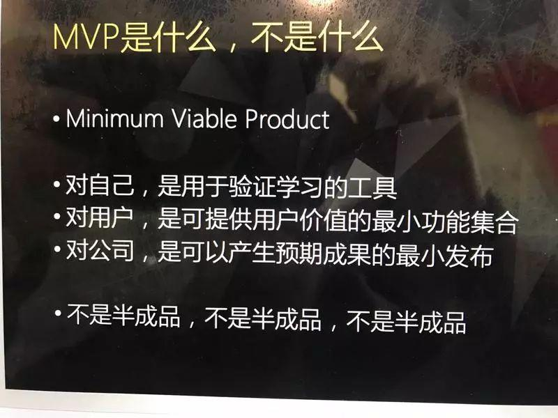
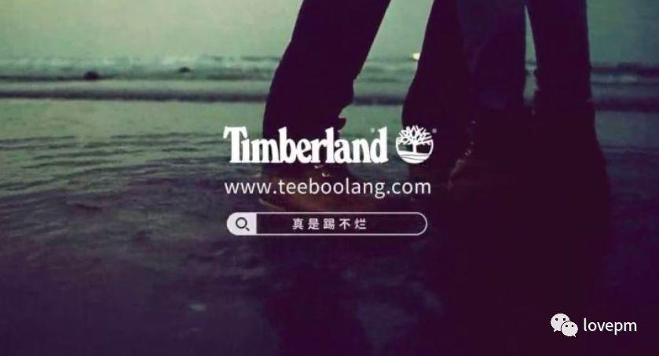
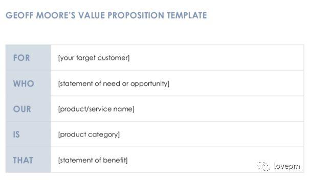
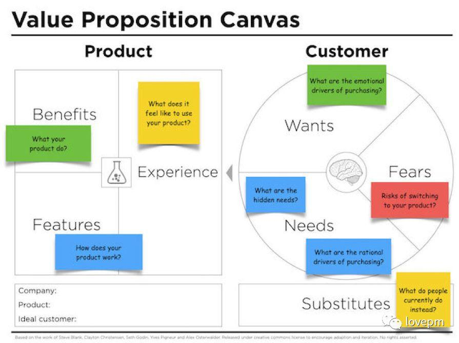
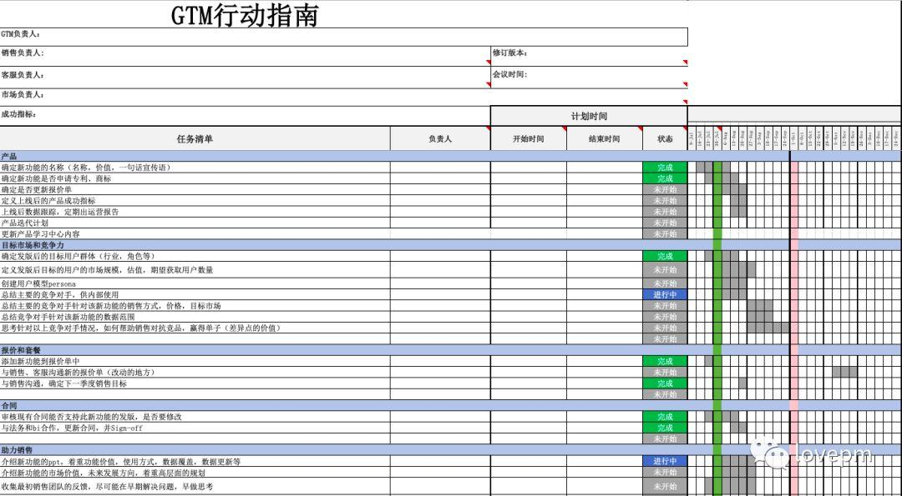

## 产品的GTM(go to marketing)，其实没有那么难  
  
### 作者  
digoal  
  
### 日期  
2021-05-11   
  
### 标签  
PostgreSQL , go to marketing   
  
----  
  
## 背景  
原文  
  
http://www.woshipm.com/pmd/2260793.html  
  
## 产品GTM其实就是指产品如何推向市场，做一份GTM可能需要产品，销售，客服，市场等多个部门配合，如何做好产品的GTM呢？  
  
GTM顾名思义就是go to market，产品如何走向市场。产品的上线不是产品的终结，产品经理需要确保上线后产品的价值能够传递给用户，才能获得市场的回报。  
  
对于很多大型公司来说，会在各个地方设置product marketing的角色，来让产品更好的本土化，让本地的各部门了解新发布功能的价值，进行产品宣传。  
  
GTM对B端的产品来说更为重要，因为B端是依赖销售和客服来向用户传递价值的。如果没有GTM环节，用户可能一年后都不知道我们上线了什么新功能和价值点。  
  
做一份GTM看起来非常复杂，需要产品，销售，客服，市场等多个部门配合。如果公司恰巧没有product marketing的角色，那么每个产品经理需要负责起这个模块，更好的和其他部门合作，让产品的价值能传递给客户。  
  
如何做产品的GTM呢？其实套路也是有的，下面帮大家梳理清楚GTM要做的事情，咱们做到想清楚、有计划、有团队、有目标。  
  
## 产品经理想清楚  
在做GTM之前，产品经理需要想清楚一些问题：  
  
### Why  
- 1、我们为什么要做这个产品/功能？  
- 2、产品/功能能够回应市场的需求吗？  
- 3、为什么现在做这个产品/功能，而不是以后？  
  
其实这个问题应该在产品规划的时候就要想好。做GTM的时候把这几个问题再整成宣传材料。这个时候不能出现：我做了一款在线支付产品准备上线了，可是目前支付宝、微信、各大银行都提供在线支付的功能，那么我们与支付宝、微信的差异点是什么？市场还有这样的席位留给我们吗？这种情况下产品很容易败北。  
  
我们在这个部分应该考虑把“为什么做这个产品的诉求“写清楚。  
  
比如我们新发版了一个：  
  
提供跨境旅游咨询的客服机器人功能。（回答1和2）目前市场上跨境旅游需求旺盛，而面对一个新的国家，用户需要了解当地的文化/出行/住宿信息，传统的国内旅行网站提供的信息单一（此处为假设，举例用），国外英文网站又造成了用户阅读困难。我们依据目前的人工智能技术对各个国家旅行资源进行解析，能够提供用户实时询问实时回答的需求。（回答3）客服机器人的技术已经在很多应用场景中使用，如果未来再使用的话，会让我们在这个领域丧失竞争力。  
  
### What  
- 1、产品/功能是由什么组成的？  
- 2、它能够解决什么样的问题？  
- 3、未来这个功能有什么计划？  
- 4、产品/功能的价值是什么？  
- 5、用户如今有没有其他产品可以替代使用？  
- 6、该产品/功能应该定价多少?  
  
比如跨境在线支付产品：  
  
（1）它是由扫码，二维码图片，支付功能组织。  
  
（2）它能够解决用户跨境消费的时候，需要准备Visa卡，或者换币的麻烦，并且能够降低手续费。  
  
（3）未来我们希望能够覆盖更多国家，实现在线支付，方便大家的出行。  
  
（4）产品的价值就是给用户在国外旅行/出差中带来便利。  
  
（5）目前支付宝、微信、银联等已经覆盖了部分国家，并且免费。我们的差异点是xxx，价格是xxx。  
  
### How  
- 1、如今这款产品如何为用户服务，用户要如何使用？  
- 2、产品如何与用户进行交互，是通过app，软件，硬件，还是数据？  
- 3、用户使用的频率如何？  
- 4、用户需要使用历史数据吗？  
- 5、需要内部团队合作，如何合作？  
- 6、我们需要帮助用户学习如何使用产品吗？  
  
咱们举例安居客，一个在线找房源的产品。目前安居客的产品为客户提供房源的搜索，包括新房、二手房、租房等很多业务。（1，2）用户通过app软件，在安居客中进行房源的检索，需要安居客产品及时更新房源数据，并提供精准检索功能，可以定位某个行政区、价格等标签。  
  
（3）用户的使用频率在有买房需求的时候较高，一周内会登录5-6次，但是一旦没有买房需求后，产品的使用率会大大降低。  
  
（4）用户的历史数据会与用户近期想购买什么样的房子相关，如果能够从其他平台导入用户的基本信息，比如地理位置，收入，想购买新房/二手房，价格范围，期望地段等进行互通，能够明显的提高用户体验。  
  
（5）安居客需要信息分享功能，因为买房子往往不是一个人的事情，是一家子的事情。用户在看中来某个房源后，能够通过微信分享给家人/同事，所以要能够支持微信中的网页打开，或者小程序打开。  
  
（6）安居客属于C端产品，用户使用门槛不高。所以用户onboarding这块难度不大，可以简单的进行新手入门的指引。产品在设计中，需要更多的考虑易用性的问题。  
  
### Where  
- 1、产品发版的地区在哪里？本地，国内，还是国际？  
- 2、发版的地方是否有一些限制？  
- 3、产品的beta版本发布在哪里？  
- 4、合作方在哪里提供解决方案给用户，目前存在的限制是什么？  
  
我们举例去年5月新生效的欧盟GDPR《一般数据保护法案》，它会影响在欧盟使用的中国产品，比如给用户的账号和公司名称加密，与法务部门合作更新产品的隐私权政策等。  
  
## 定义目标人群  
另一个方面，产品经理在发版前，需要搞清楚本次发版针对的目标人群是谁。因为产品在初期可能还处于一个较为简单的MVP版本，无法覆盖全部用户群体，那么你要找到第一版面向的人。  
  
  
  
如果我的产品是一款解放家庭主妇劳动力的产品，但是产品第一个版本只能帮助家庭主妇找到阿姨打扫卫生。那么发版后针对的群体应该是家庭主妇里，有找阿姨打扫卫生需求的人。他们的用户画像可能是这样的：  
  
忙碌的上班族，女性，年收入在20万以上，年龄在25-40岁之间，家里没有老人帮忙。  
  
如果你的产品有多种混合人群，那么如何确定第一批接纳用户？可以通过头脑风暴的方式列出可能使用新功能的用户有哪些，然后对每个用户群体进行评估，确定第一步先聚焦的用户群体。【具体可以参考如何评估产品的市场价值（深度剖析）】  
  
http://www.woshipm.com/pmd/1757875.html  
  
## 定义产品的价值  
写一个简单、朗朗上口，能够突出产品价值的话，越简单越好。让你的产品在竞品中脱引而出。比如Timberland的广告语：真是踢不烂。和Timberland本身的发音很像，又表达了Timberland鞋子质量好的特点，让人看了一眼就铭记在心。  
  
  
  
### 如何定义产品价值  
  
  
for  
who  
our  
is  
that  
  
这里提供一个定义产品价值点模板，您可以填写。比如：  
  
For R&D users,   
who need to find the innovation in their industries,   
our Innovata   
is supplying innovative ideas   
that help R&D users shorten the research time from 3 months to 3 days.  
  
对于研发用户来说，他们需要找到自己领域的创新点，我们的创新产品能够提供跨行业的创新想法给研发，帮助他们提高研发效率。  
  
中文的模板为：对于【xxx】用户来说，他们需要【xxx】，我们的【xxx】能够提供【xxx】，帮助/实现【xxx】。  
  
基于以上的准备，我们能够把上面的思考内容都组织成一个价值画布，来说清楚新产品/新功能的价值，用户的需求，现有的替代方案等。  
  
  
  
  
## GTM计划  
### GTM合作部门  
GTM不是产品经理一个人的事情，是一大家子的事情。所以我们需要明确每个参与部门的职责。大家可以根据自己公司的实际情况，进行职责的明确。举例：  
  
产品部：  
- 1、明确产品发版内容，价值，宣传语  
- 2、撰写产品GTM材料  
- 3、组织讨论是否在发版前申请专利和商标  
- 4、更新报价单  
- 5、提供竞品分析。竞品分析包括竞品的同种功能/产品概览，价格，销售模式，市场覆盖度等  
- 6、更新用户手册和文档等  
  
市场部：  
- 1、针对产品的GTM材料进行包装，转化为销售术语  
- 2、优化产品宣传语  
- 3、制作产品小视频  
- 4、撰写公众号文章  
- 5、计划市场推广计划和目标  
- 6、渠道推广  
- 7、组织客户见面会活动等  
  
销售部：  
- 1、参加产品发版培训  
- 2、确定销售目标  
- 3、客户拜访  
- 4、拜访后的问题反馈等  
  
客服部：  
- 1、参加产品发版培训  
- 2、制作产品新手入门学习计划  
- 3、发放NPS调研问卷  
- 4、收集用户反馈并与产品经理沟通等  
  
具体的GTM行动我们可以做成一个excel表格，填写出每个部门需要做的事情，负责人是谁，时间计划，和完成情况。方便各个部门查看GTM进度。  
  
  
lovepm版权图片  
  
  
## 合作建议  
### 1. 信息透明，价值共享  
建立共享文档中心，比如腾讯文档，sharepoint，石墨文档等，与客服，销售，市场共享发版材料。分享的在线平台要考虑到销售人员在外拜访时候的方便，没有内网环境的要求，能够在移动端、PC端查看。  
  
同时注意发版文档对外和对内的差别。如果共享的材料是面向客户的，需要更加注意措辞和表达。  
  
### 2. 未雨绸缪，提前准备  
产品的GTM对产品来说有不少工作量。在产品规划初期，产品经理们就要开始着手做这件事情，因为产品roadmap就是产品的方向。提前思考，提前准备，能够让发版的准备工作更加完善与丰盈。  
  
### 3. 换位思考，用户第一  
在与各个部门合作的时候，思考如何将GTM的工作与各个部门绩效联系在一起，让大家齐心协力共同完成目标。当遇到分歧的时候，多换位思考，多从用户角度来考虑。让用户开心也是SaaS领域的一项竞争力。  
  
GTM就像一场武林大会，各派英雄好汉都可以在产品推广的过程中施展拳脚，发挥作用。如果你的公司没有一位GTM的执行者，那么产品经理们，上吧，推动起各个部门，让产品的价值更好的传达给用户们！  
  
   
  
作者：张圈圈，微信公众号：lovepm  
  
本文由 @张圈圈 原创发布于人人都是产品经理。未经许可，禁止转载  
  
题图来自Unsplash，基于CC0协议  
  
  
#### [PostgreSQL 许愿链接](https://github.com/digoal/blog/issues/76 "269ac3d1c492e938c0191101c7238216")
您的愿望将传达给PG kernel hacker、数据库厂商等, 帮助提高数据库产品质量和功能, 说不定下一个PG版本就有您提出的功能点. 针对非常好的提议，奖励限量版PG文化衫、纪念品、贴纸、PG热门书籍等，奖品丰富，快来许愿。[开不开森](https://github.com/digoal/blog/issues/76 "269ac3d1c492e938c0191101c7238216").  
  
  
#### [9.9元购买3个月阿里云RDS PostgreSQL实例](https://www.aliyun.com/database/postgresqlactivity "57258f76c37864c6e6d23383d05714ea")
  
  
#### [PostgreSQL 解决方案集合](https://yq.aliyun.com/topic/118 "40cff096e9ed7122c512b35d8561d9c8")
  
  
#### [德哥 / digoal's github - 公益是一辈子的事.](https://github.com/digoal/blog/blob/master/README.md "22709685feb7cab07d30f30387f0a9ae")
  
  

  
  
#### [PolarDB 学习图谱: 训练营、培训认证、在线互动实验、解决方案、生态合作、写心得拿奖品](https://www.aliyun.com/database/openpolardb/activity "8642f60e04ed0c814bf9cb9677976bd4")
  
  
#### [购买PolarDB云服务折扣活动进行中, 55元起](https://www.aliyun.com/activity/new/polardb-yunparter?userCode=bsb3t4al "e0495c413bedacabb75ff1e880be465a")
  
  
#### [About 德哥](https://github.com/digoal/blog/blob/master/me/readme.md "a37735981e7704886ffd590565582dd0")
  
