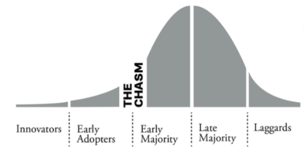
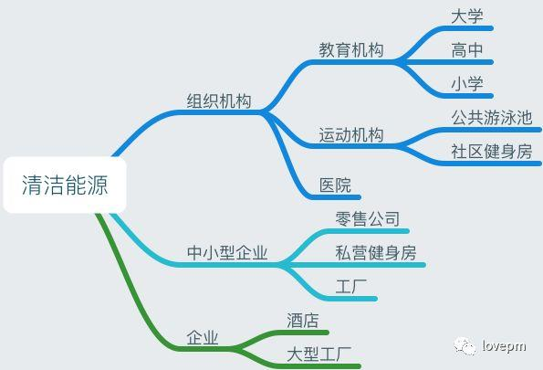
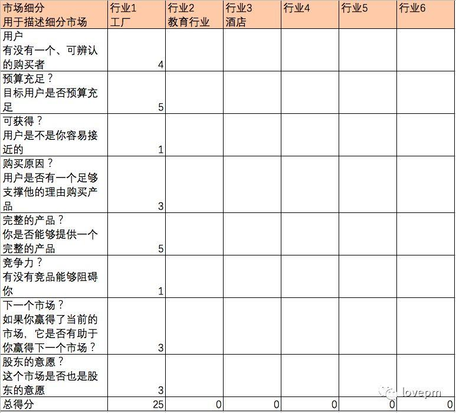
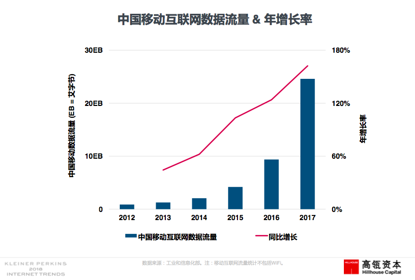

## 如何评估产品的市场价值?   
    
### 作者    
digoal    
    
### 日期    
2021-05-11     
    
### 标签    
PostgreSQL , 产品 , 市场    
    
----    
    
## 背景    
原文    
    
http://www.woshipm.com/pmd/1757875.html  
    
## 在做一款新产品之前，产品经理需要对产品进行详细地评估：这个产品有市场吗，市场会有多大，一年能有多少营收？如何评估一个产品的潜在市场价值呢？  
    
产品经理或者创业者在做一款新产品或新模块的时候，我们需要对产品／模块进行评估。这个产品有市场吗，市场会有多大，一年能有多少营收？  
  
那么如何评估一个产品／模块的潜在市场呢？  
  
## 一、一切从用户中来，到用户中去  
本着用户为本的原则，我们首先需要了解什么样的用户会使用产品，构建产品使用者的用户模型（Persona）是第一步。  
  
### 1. 挖掘老用户  
首先可以挖掘一些老客户去使用我们的新产品。我们不仅对这样的用户熟悉，而且获得用户访谈的机会也高。在访谈的过程中需要了解产品所提供的解决方案对这些老客户而言，优势劣势分别是什么。  
  
### 2. 寻找新用户  
如果你还没有老用户也不用担心，我们可以去寻找新的用户，为这些用户创建模型，来更好的理解用户和市场的关系。列如我们需要了解：  
  
- 1、 谁会来买这款产品？  
- 2、 他们工作的职位一般会是什么？  
- 3、 他们会在什么样的圈子里分享这款产品？  
- 4、 他们一般属于什么团体或组织？  
- 5、 他们的专业目标是什么？  
- 6、 他们从事的商业业务有多大？  
- 7、 他们服务于哪个行业？  
- 8、 他们行业关注什么博客、出版物、或网站？  
- 9、 他们住在哪里？  
- 10、 他们为什么要购买你的解决方案？是什么使你的产品具有吸引力？  
- 11、 他们目前是如何解决痛点的？  
  
通过以上的问题，你需要获得如下答案：  
  
- 1、 你的解决方案是为哪些人准备的；  
- 2、 他们的典型职业是什么；  
- 3、 他们为什么喜欢你的解决方案；  
- 4、 到哪里能够找到他们。  
  
针对不同的行业领域，我们只需要采访5个用户即可。通过领英／微信／微博/网站／其他平台，给这些用户发信息，询问是否可以进行用户访谈。一般情况下，你联系50个人，会有10%-20%的成功率，也就是说，5-10个人最终会和你进行沟通[1] 。  
  
如果对方没有回应，也不要认为这就是拒绝。人们往往很忙，也许他在度假。继续跟踪你的邮件，发送与他沟通的邀请。  
  
访谈后对用户进行分析、归纳，总结为用户模型。  
  
## 二、跨越鸿沟，确定抢滩市场  
  
  
当新产品还处于MVP版本时，我们能够获取前卫用户和早期接纳者。但是对于SaaS企业来说，重要的是如何获得早期主要用户的青睐。因为早期接纳者最多只能占到市场的16%。而早期主要用户能够占到市场的34%。从早期接纳者到早期主要用户之间的转换，我们称之为跨越鸿沟[2]。  
  
如果不跨越这个鸿沟，产品只停留在早期接纳者的用户群体中，产品的增长速度将会减慢，最终也会导致产品停滞不前。  
  
早期的主要用户群体没有接纳产品的原因很多，可能产品还不够成熟，也可能因为他们没有意识到痛点，或者还没有开始寻找解决方案。这类型的用户往往希望能够找到一个低风险、成熟的产品来满足他们的需求。  
  
为了跨越这个鸿沟，你需要找到一个明确的市场，率先打入。我们称之为抢滩市场。在这个市场里面，你的产品能够成熟、稳定、差异化明显，能够打败市场上强有力的竞争对手。  
  
如何找到这个抢滩市场，跨越用户量的鸿沟呢？  
  
首先我们基于上面做的用户访谈，列出产品可进入的市场有哪些，画出脑图。如下图：  
  
  
  
使用Geoffrey Moore提出的评价方法[3] ，确定你优先探索的市场。“抢滩市场法”对每个细分市场进行多维度打分，最高得分的市场为最有价值市场。通过计算得分，可以对你优先进入哪个市场做出一个统一的参考（如下图）。  
  
> “抢滩市场法”（beachhead market）中“beachhead”这个词翻译为“抢滩行动”，原为军事术语，即“登陆军舰向海滩前进，使舰首搁置沙滩上，以便人员及物资直接下卸”。后又被引用在商场上，为抢得先机如提高（市场占有率）的行动[4]。  
  
  
  
确定一个抢滩市场后，可以继续进行用户调研，深入访谈这个领域的用户，用来确定你的产品是否符合他们的需求。  
  
选择最初的抢滩市场非常关键，它有可能是你成功的关键，也可能是你失败的关键。  
  
## 三、抢滩市场价值估算  
确定抢滩市场后，这个市场一年能给我们带来多少营收？我们使用TAM、SAM、和SOM来估算市场价值[5]。  
  
- 总潜在市场（TAM）：是指一款产品或服务在现有市场上可以达到的市场规模，或者说你希望产品未来覆盖的消费人群规模。  
- 可服务市场（SAM）：你可以的覆盖人群。  
- 可获得的服务市场（SOM）：你的产品实际可以服务到的市场范围，这要考虑到竞争、地区、分发、销售渠道等其他市场因素。  
  
```  
举例1：我要做一款针对研发创新的产品，目前公司已有业务是研发流程管理（如Confluence和Jira）  
  
TAM：（假设）全球的软件研发行业大约有2千万家公司。  
  
SAM：（假设）中国的软件研发公司大约有10万家。  
  
SOM：公司已有8000家用户，那么这8000家公司就是目前我可获得的服务市场。如果每家付费1万美金一年，我们的可获得服务市场的收益就是8千万美金一年。  
```  
  
```  
举例2：我要做一款清洁能源新设备  
  
TAM：预估2千万收入；  
  
SAM：50%*2千万=1千万；  
  
SOM：50%*1千万=5百万。  
```  
  
### 1. 深入探讨 TAM  
如果你能够100%获得抢滩市场，那么总潜在市场（TAM）就是你一年的营收。但是除非你有垄断权或者无限的资源，100%获得TAM是几乎不可能的。所以更好的衡量指标是可获得的服务市场（SOM），因为SOM综合考量了其他因素，它包括：  
  
- 竞争力；  
- 地域；  
- 文化；  
- 规章制度；  
- 财政限制；  
- 用户付费的意愿程度；  
- 相互争夺的市场；  
- 资源。  
  
这些因素都是我们在估算市场的时候需要考虑的。  
  
举例来说，WhatsApp和Facebook在国内是禁止使用的。那么这两款产品的TAM就比SOM大的多。所以SOM是一个更加实际且具有参考价值的指标。  
  
几款国内的专利产品差异化不明显，那么国内的竞争程度就非常激烈。而在国外，专利产品差异化明显，价格差异也大，用户可以根据需求和预算选择不同价位的产品。所以在计算国内市场份额和国外市场份额的时候，两者是要区分处理的。  
  
再如，多年前用户还没有流行音乐下载付费的意识，盗版盛行。在这样的大环境下，用户对付费音乐专辑／单曲的意愿程度低。而如今大众越来越有知识版权意识，音乐也在各个平台进行收费，大家对音乐付费的意愿也逐步提高起来。那么在计算SOM的时候，可以乘以一个付费意愿百分比，如80%（假设），来更加准确的计算SOM。  
  
### 2. 如何计算SOM  
那么如何计算SOM呢？我们有三个方法：  
  
- 参考外部研究资料；  
- 从上至下的分析法；  
- 从下至上的分析法；  
  
我们来看看每个方法是如何使用的。：  
  
#### （1）参考外部研究资料：  
  
  
  
参考外部研究资料是最简单的评估方法。  
  
国内的参考网站有：  
  
- 1991 IT 大数据导航（http://hao.199it.com/）  
- 中国行业报告研究中心（http://www.reportrc.com/yjbg/）  
- 中国互联网信息中心CNNIC（http://www.cnnic.net.cn/）  
- 各大咨询公司提供的报告研究等  
  
国外的参考网站有：  
  
- Gartner（https://www.gartner.com/en）  
- Forbes （https://www.forbes.com/#1e326ef72254）  
- Forrester Research（https://go.forrester.com/）  
- Marketing Sherpa（https://www.marketingsherpa.com/）  
  
这里不一一列举了，外部参考资料的来源非常多。除了经常关注领域内的相关平台，还可以通过搜索引擎进行检索获取。  
  
不过值得注意的是：如果外部机构已经把某一个市场研究的非常透彻，很有可能表明你进入这个市场的时间已经太晚了。这种情况下你可能需要用从上至下的市场分析方法进一步调研，定位于该市场下的某个细分市场。  
  
#### （2）从上至下的分析方法  
  
从上至下的分析方法是基于已有的市场研究，再从中细化出一个市场分支。结合用户模型研究，我们把这个分支市场单独拎出来。  
  
通常来说，我们计算TAM是从一个较大的市场开始，然后逐步缩小这个市场范围，从TAM到SAM到，再到SOM。这也是从上至下的分析方法。  
  
举例来说，如果你要做一款白领商务旅行的app，那么你可以首先查询城市的人口数量，再估算20-50年龄段的人口数量，乘以白领占比。再估算这些白领一年一次，一个月一次，或者一周一次的旅行次数。  
  
这些数据你可以参考相关网站，如：  
  
- 统计年鉴（http://hao.199it.com/stats.html）  
- 地方政府数据  
- 行业报告等  
  
#### （3）从下至上的分析方法  
  
最好的估算方法是从下至上的分析方法。这个方法从你的市场调研数据开始，包括访谈，调研问卷来查看用户与市场的匹配程度。  
  
从下至上的分析方法，是你首先估算本地市场的规模，有多少用户与该市场是匹配的，然后再向外扩展，估算整体的市场大小。  
  
从下至上的分析方法被认为是更加准确的计算方式，因为从被证实的数据上去扩展更加站得住脚。  
  
#### 估算的结果：  
  
如果你的市场估值在每年五百万美金以下，那么这有可能市场太小，不具有投入的价值，也很难说服投资者投资。  
  
如果市场估值大于十亿美金，你也需要考虑再细分一下这个大蛋糕，直到市场估值更加合理为止[5]。  
  
## 总结  
对一个新产品的潜在市场评估方法总结为：用户调研–>确定抢滩市场–>市场估值。  
  
### 参考资料：  
- https://leanb2bbook.com/blog/evaluate-customer-segments-b2b-startup/  
- https://leanb2bbook.com/blog/crossing-chasm-saas-startups/  
- https://en.wikipedia.org/wiki/Geoffrey_Moore  
- https://zh.wikipedia.org/wiki/%E6%90%B6%E7%81%98  
- https://leanb2bbook.com/blog/total-addressable-market-b2b-startup/  
   
  
作者：张圈圈，微信公众号：lovepm  
  
本文由 @张圈圈 原创发布于人人都是产品经理。未经许可，禁止转载  
  
题图来自Unsplash，基于CC0协议  
    
  
#### [PostgreSQL 许愿链接](https://github.com/digoal/blog/issues/76 "269ac3d1c492e938c0191101c7238216")
您的愿望将传达给PG kernel hacker、数据库厂商等, 帮助提高数据库产品质量和功能, 说不定下一个PG版本就有您提出的功能点. 针对非常好的提议，奖励限量版PG文化衫、纪念品、贴纸、PG热门书籍等，奖品丰富，快来许愿。[开不开森](https://github.com/digoal/blog/issues/76 "269ac3d1c492e938c0191101c7238216").  
  
  
#### [9.9元购买3个月阿里云RDS PostgreSQL实例](https://www.aliyun.com/database/postgresqlactivity "57258f76c37864c6e6d23383d05714ea")
  
  
#### [PostgreSQL 解决方案集合](https://yq.aliyun.com/topic/118 "40cff096e9ed7122c512b35d8561d9c8")
  
  
#### [德哥 / digoal's github - 公益是一辈子的事.](https://github.com/digoal/blog/blob/master/README.md "22709685feb7cab07d30f30387f0a9ae")
  
  

  
  
#### [PolarDB 学习图谱: 训练营、培训认证、在线互动实验、解决方案、生态合作、写心得拿奖品](https://www.aliyun.com/database/openpolardb/activity "8642f60e04ed0c814bf9cb9677976bd4")
  
  
#### [购买PolarDB云服务折扣活动进行中, 55元起](https://www.aliyun.com/activity/new/polardb-yunparter?userCode=bsb3t4al "e0495c413bedacabb75ff1e880be465a")
  
  
#### [About 德哥](https://github.com/digoal/blog/blob/master/me/readme.md "a37735981e7704886ffd590565582dd0")
  
