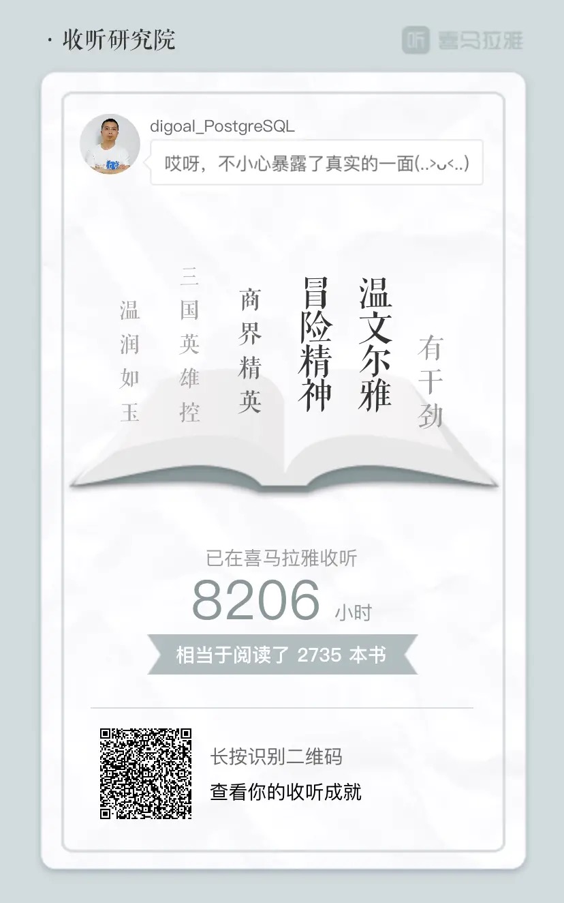

## 如何成为“大神"    
      
### 作者      
digoal      
      
### 日期      
2021-05-15      
      
### 标签      
PostgreSQL , 粉丝      
      
----      
      
## 背景      
[直播回放](https://www.bilibili.com/video/BV1tA411g7ya/)  
  
## 什么是”大神“?    
### 1、主观感受:     
某个行业的领袖人物. 拥有领先的个人能力和行业影响力, 对行业有巨大的贡献. 有担当和社会责任感.      
    
### 2、客观衡量:     
2\.1、职业价值    
- 公司、职位    
- 工作阅历    
- 个人对公司的贡献, 公司影响力    
    - 广度(人数)、    
    - 深度(被影响人员层级覆盖率(员工、管理层、高管), 决定了哪些层级的人认可你)、    
    - 时长(影响持续时长) 三个维度    
        - 什么能影响时长? 产品? 企业? 思想? 还是?  
    
2\.2、行业价值    
- 所处行业虚拟组织(联盟、社团等高端圈子)、职务    
- 社团阅历    
- 个人对行业的贡献, 行业影响力    
    - 广度(人数、企业数)、    
    - 深度(被影响人员层级覆盖率(同行、管理层、高管、创始人、投资人等), 决定了哪些层级的人认可你)、    
    - 时长(影响持续时长) 三个维度    
    
2\.3、社会价值    
- 对哪些行业产生了正面影响和价值    
    - 先秦诸子百家
    
## 为什么要成为“大神”?    
1、创造社会价值    
    
2、拓展个人发展空间    
    
## 如何成为“大神”?    
1、个人能力储备    
- 持续阅读(人文社科、历史、法律、心理、传记、经济、哲学、专业技术等)    
    - 推荐看一些哲学类的书, 训练思维方式:     
        - 悉达多、中西哲学启蒙    
    - 训练 评价、提炼、发现背后的逻辑 的能力
- 持续输出(输出倒逼输入)    
- 找比较好的出版社例如中信出版社、中华书局, 找行业领袖出版的书籍或豆瓣评分高的书籍.      
- 多媒体资源    
    - 喜马拉雅、B站    
- 把时间花在有价值的事情上, 同时注意ROI.    
- 一专多能, 逐个击破(你很聪明能做到多专是你牛逼, 如果做不到千万不要蜻蜓点水雨露均沾). 要避免浅尝辄止, 也要避免吊死在一棵树上(这里有经济学常识边际效应递减).  
- 虚实结合(什么是虚,什么是实) 
    - 故事是想出来的还是干出来的?  
    
2、进入圈子(某个领域的人群集散地)    
    
3、持续贡献(发现问题 和 单人或协调多方资源共同解决问题), 发挥你在圈子里的价值     
- 从 观众 到 群演 到 演员 到 导演  
- 从 用户 到 产品 到 创业者 到 企业家  
- 从 社区摄取者 到 分享者 到 社区建设者 到 社区设计者  
    
4、提升你在圈子里三个维度的影响力 (关键人物法则, 引爆流行)    
- 圈子除了价值依赖, 还需要关注人文, 社交属性. 所以影响力不仅仅是依赖关系, 还有社交粘性.    
    
5、拓展更多不同领域圈子 或 拓展你所在圈子的人数    
    
## 如何成为PG大神?    
这个比较简单, 因为技术比圈比较直白, 而且也已经有台子在了, 前人搭的中文社区就是一个很大的舞台.      
    
### 1、个人专业能力储备    
1、tutorial    
http://www.postgresqltutorial.com/    
    
2、原理    
https://www.interdb.jp/pg/    
    
3、阅读源代码    
https://git.postgresql.org/gitweb/?p=postgresql.git;a=summary      
https://commitfest.postgresql.org/      
    
4、当前已经是行业领袖的人的公众号、网站等.  例如 [德哥的github](https://github.com/digoal/blog/blob/master/README.md)       
    
5、PG的插件或商业、开源项目       
https://pgxn.org/      
https://github.com/search?l=C&q=postgresql&type=Repositories      
https://www.postgresql.org/download/product-categories/      
      
6、PG维基百科      
http://wiki.postgresql.org/      
      
7、PG衍生的数据库产品      
https://wiki.postgresql.org/wiki/PostgreSQL_derived_databases      
      
8、PG的TODO、客户期望、当前存在的软肋      
[《[未完] PostgreSQL\Greenplum Customer视角TODO》](../201710/20171017_01.md)          
[《未来数据库方向 - PostgreSQL 有价值的插件、可改进功能、开放接口 (202005)》](../202005/20200527_06.md)        
https://wiki.postgresql.org/wiki/Todo      
  
### 2、非专业能力储备  
大量阅读, 利用碎片时间, 听喜马拉雅是个不错的决定.   
  
    
### 3、进入圈子(某个领域的人群集散地)    
    
1、PG 中文社区,     
http://www.postgres.cn/index.php/v2/home    
参与微信群、钉钉群、QQ群、地方沙龙、全国峰会    
    
2、PG 全球开发组年度会议      
https://www.pgcon.org      
    
3、全球的PG用户组      
https://www.postgresql.org/community/user-groups/      
    
4、最新的会议、培训等事件或新闻      
https://www.postgresql.org/      
      
5、最新推文      
https://dbweekly.com/      
http://postgresqlweekly.com/      
https://planet.postgresql.org/      
http://planet.postgis.net/      
      
6、开发者和DBA问答      
https://stackoverflow.com/questions/tagged/postgresql      
      
7、PG hacker实时动态, 他们在讨论什么      
https://www.postgresql.org/list/pgsql-hackers/      
还有irc和slack或其他邮件组可以挑选性关注.      
    
### 4、持续贡献, 发挥你在圈子里的价值    
- 在公司建立PG交流群, 搞FAQ, 搞DBA或研发使用的PG相关SaaS产品, 搞分享, 建机制. 
- 到社区分享内容    
- 进群回答问题    
- 参与沙龙和分会活动    
- 参与公益活动(志愿者、翻译PG官方文档等)    
    
### 5、提升你在圈子里三个维度的影响力 (关键人物法则, 引爆流行)    
广度:     
深度:     
时长:     
       
### 6、拓展更多不同领域圈子 或 拓展你所在圈子的人数    
你的能力也许是别的圈子也需要的, 跨圈子可以碰撞出不可思议的火花  
选择什么样的行业? 分析行业趋势, 分析问题(需求)和机会点, 找到这个行业的关键人物们, 建立联系, 能力互补互现提供价值, 快速切入.  
  
## 为什么圈子这么重要?
1、[《稷下学宫》](../202104/20210423_02.md)      
    
公元前6～3世纪，为希腊、古罗马文化鼎盛时期，也正值中国春秋战国时期。      
东西方都处在学术上百家争鸣（西方有苏格拉底、柏拉图、亚里斯多德、中国有孔子、墨子、老子、庄子等）。      
军事上天才辈出（西方有波斯居鲁士王、马其顿亚历山大帝，中国有孙武、吴起、孙膑等）的辉煌时代。      
    
稷下学宫是世界上最早的官办高等学府和我国最早的社会科学院、政府智库。  始建于齐桓公田午时期。中国学术思想史上这场不可多见、蔚为壮观的“百家争鸣”，是以齐国稷下学宫为中心的。它作为当时百家学术争鸣的中心园地，有力地促成了天下学术争鸣局面的形成。      
在此期间，学术著作相继问世。有《宋子》、《田子》、《蜗子》、《捷子》等，今已亡佚。另《管子》、《晏子春秋》、《司马法》、《周官》等书之编撰，亦有稷下之士的参与。    
    
由于不少人是善于把学术和政治结合起来游说当权者的能手，故在宣王时受上大夫称号之稷下士多达七十六人。      
稷下学宫的存在，曾为当时段“百家争鸣”开创了良好的社会环境，促进了先秦时期学术文化的繁荣。      
      
稷下学宫在其兴盛时期，曾容纳了当时“诸子百家”中的几乎各个学派，其中主要的如道、儒、法、名、兵、农、阴阳、轻重诸家。稷下学宫在其兴盛时期，汇集了天下贤士多达千人左右，其中著名的学者如孟子(孟轲)、淳于髡、邹子(邹衍)、田骈、慎子(慎到)、申子(申不害)、接子、季真、涓子(环渊)、彭蒙、尹文子(尹文)、田巴、儿说、鲁连子(鲁仲连)、驺子(驺奭)、荀子(荀况)等。      
尤其是荀子，曾经三次担任过学宫的“祭酒”(学宫之长)    
    
    
2、[《月光社 - 推动英美两国发展的社团 - 圈子的力量 - 产、研、融 结合》](../202103/20210316_04.md)      
    
      
    
富兰克林在自传中提到他自己在费城办了个社团，成员都是来自有社会影响力的，非富则贵的家庭。    
      
原来月光社开始与1765年，一名英国医学博士斯莫尔在伯明翰集结富兰克林，老达尔文（达尔文祖父），博尔顿，韦奇伍德和埃奇沃斯组成的月光派学术社团。月光社成员还有包括有现代化学之父 拉瓦锡，工程师 瓦特，还有美国总统杰斐逊等。这个民间科学研究团体，主要讨论科学与技术，他们选择月圆之夜聚会，主要是因为当时没有路灯，靠月光照明，所以取名为月光社。      
      
英国的月光社和蒸汽时代的发展密切相关。从18世纪末到19世纪末，人类经历了两次工业革命世界，完成了从近代到现代的过渡。第一次工业革命的核心技术是瓦特的万用蒸汽机。蒸汽机的改良得益于月光社成员博尔顿的财力支持，而蒸汽机的普及得益于月光社成员地质学家韦奇伍德将灯蒸汽机引入陶器制作。瓦特没有发明蒸汽机，是改良蒸汽机，并称之为万用蒸汽机。      
        
生物学科方面，达尔文长达五年的环球旅行没有被父亲支持，反而是被舅舅韦奇伍德二世（月光社成员瓷器大王韦奇伍德的儿子）支持。后者成为其岳父，又是一个月光社的连接。达尔文进化论理论的提倡者，为期五年的环球探索与月光社成员的财力等支持息息相关。      
      
美国国父之一富兰克林是月光社成员。富兰克林因著名的风筝被熟知，其实验揭示了天上的雷电与人工摩擦产生的电性质完全相同。在费城富兰克林仿效月光社成立精英社团，团体成员可以发展下线团体，扩大影响力，而且规划和规矩清晰。社团为富兰克林从政扩大影响做足铺垫。      
      
月光社影响了英美两国发展。  
  
#### [PostgreSQL 许愿链接](https://github.com/digoal/blog/issues/76 "269ac3d1c492e938c0191101c7238216")    
您的愿望将传达给PG kernel hacker、数据库厂商等, 帮助提高数据库产品质量和功能, 说不定下一个PG版本就有您提出的功能点. 针对非常好的提议，奖励限量版PG文化衫、纪念品、贴纸、PG热门书籍等，奖品丰富，快来许愿。[开不开森](https://github.com/digoal/blog/issues/76 "269ac3d1c492e938c0191101c7238216").      
      
      
#### [9.9元购买3个月阿里云RDS PostgreSQL实例](https://www.aliyun.com/database/postgresqlactivity "57258f76c37864c6e6d23383d05714ea")    
      
      
#### [PostgreSQL 解决方案集合](https://yq.aliyun.com/topic/118 "40cff096e9ed7122c512b35d8561d9c8")    
      
      
#### [德哥 / digoal's github - 公益是一辈子的事.](https://github.com/digoal/blog/blob/master/README.md "22709685feb7cab07d30f30387f0a9ae")    
      
      
    
      
    
  
#### [PolarDB 学习图谱: 训练营、培训认证、在线互动实验、解决方案、生态合作、写心得拿奖品](https://www.aliyun.com/database/openpolardb/activity "8642f60e04ed0c814bf9cb9677976bd4")
  
  
#### [购买PolarDB云服务折扣活动进行中, 55元起](https://www.aliyun.com/activity/new/polardb-yunparter?userCode=bsb3t4al "e0495c413bedacabb75ff1e880be465a")
  
  
#### [About 德哥](https://github.com/digoal/blog/blob/master/me/readme.md "a37735981e7704886ffd590565582dd0")
  
