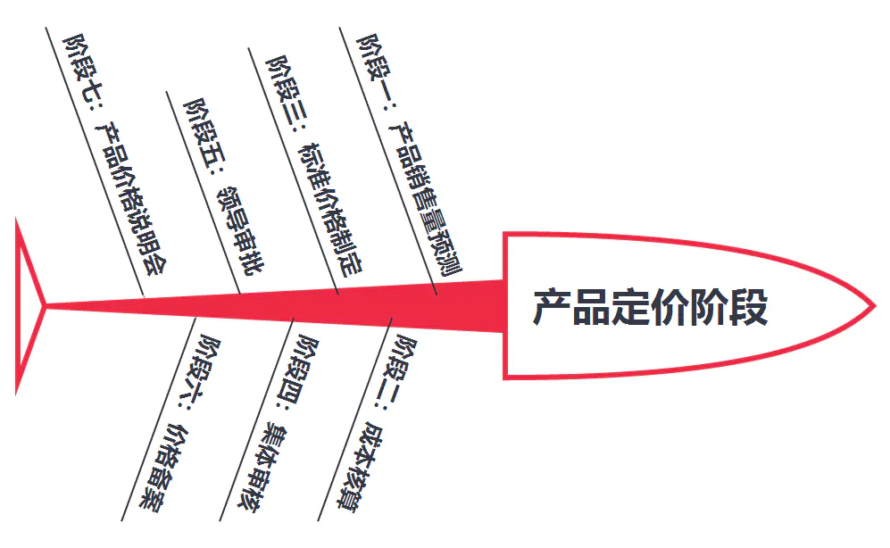
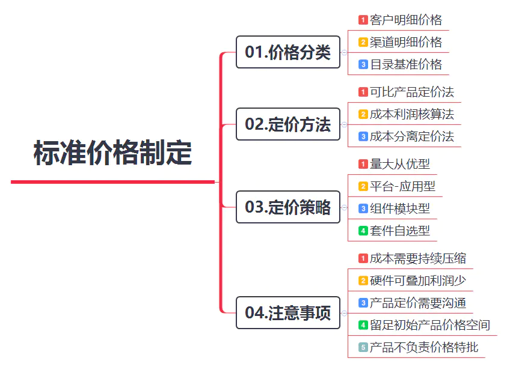
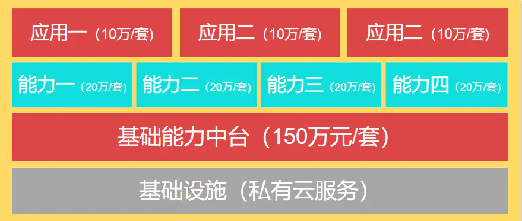
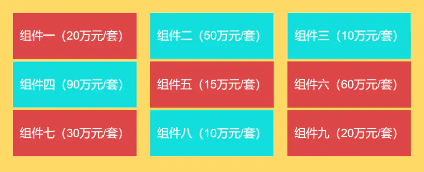

## [转发] ToG产品如何进行成本核算和产品定价？   
                  
### 作者                  
digoal                  
                  
### 日期                  
2021-06-05                  
                  
### 标签                  
PostgreSQL , 定价     
                  
----                  
                  
## 背景       
原文  
https://www.jianshu.com/p/f3eb0fba150d  
  
与ToC产品盈利模式不同，ToG产品需要产品经理在市场需求调研阶段就考虑产品报价的问题，报价模式的选择很大程度上将影响产品的售卖方式和销售成果，因此也是ToG产品经理能力清单里的必备技能。  
  
本文将对非定制、标准化产品的成本核算和定价方案进行深入探讨，希望可以对ToG产品经理的工作有一定的帮助。  
  
## 一、产品定价流程  
  
在产品市场需求确认，产品的方向、范围、里程碑、售卖方式相对确认的情况下就可以同步开始正式开展标准产品成本和定价的策划工作了。  
  
一般情况下，产品的定价流程将涉及以下几个阶段：  
  
  
  
产品销售量预测（产品、销售）→成本核算（产品、研发、交付、采购）→标准价格制定（产品）→集体审核（产品、销售）→领导审批（公司领导）→价格备案（运营/经营）→产品价格说明会（产品、售前、销售）。  
  
注：括号里为各阶段相关参与人  
  
## 二、产品定价的不同阶段  
  
### 阶段一：产品销售量预测  
  
在产品确定可以进行标准化售卖的时候，就需要产品主管方发起可批量售卖的通知，由产品经理对标准化产品进行说明并且公布市场调研结果。各区域销售需要评估本区域的预测销售目标(预期销售量），同时给出产品定价建议。  
  
### 阶段二：成本核算  
  
第二阶段，产品经理需要核定产品的单位成本。ToG产品的成本核算大致分为软件成本、硬件成本、运维成本、外采成本等项目的核算，在分项成本确认后，利用成本核算表去确定当年此产品的基本总成本。  
  
  
  
#### 01.软件成本核算  
  
软件成本的核算一般分为2种情况：  
  
第一种情况，即产品研发人员归属固定，公司将根据产品销售额的预测、产品规划、和前期资源争取，给定研发人员数量。产品经理可以根据公司给定的单个研发人员成本进行核算。  
  
如：```4万元/人月（更是给定人员成本单价）*6个月（研发工期）*10人（研发投入）=240万元（粗略的研发总成本）。```  
  
第二种情况，即产品研发人员共享、非固定，公司只划定研发人员支持范围，产品经理需要和研发负责人确认产品各里程碑的研发工作量，具体人员分配由从研发负责人给定。  
  
如：```2千元/人日*300日=60万元。```  
  
#### 02.硬件成本核算  
  
硬件成本核算，需要考虑硬件的物料成本、代工成本、定制化开模费用、硬件接口研发费用等。  
  
在这里需要注意，由于硬件开发的成本高、利润低，需求变更难度大，一般硬件代工厂会要求首付一定的合作费用，用于定制化样品研发（包含接口开发费）；或者要求签订批量采购的框架协议，协议里确定支付定金和最低采购数量等强制性约束条件。  
  
产品经理在和采购部门确认产品成本时需要考虑最低硬件支出成本可能会高于前期项目需要。  
  
#### 03.运维部署成本核算  
  
ToG产品由于客户普遍的信息化能力有限，需要乙方提供全周期的产品安装、部署、运维支持。这时候产品经理需要考虑产品运维周期、次数和人员成本。如果客户要求驻场运维，还需要考虑驻场运维工程师成本。  
  
对于集成化项目，可以将该项成本转化成渠道价格，不考虑该成本，但需要设计渠道商运营部署的赋能方案。  
  
#### 04.外采产品成本核算  
  
ToG类的产品一般需要提供成套的产品解决方案，难免会遇到外采产品的成本核算。比如云计算厂商底层需要采购中间件、云存储等服务，视频服务供应厂需要外采摄像头、强弱电控制设备等。  
  
外采产品需要产品经理给定外采厂家备选范围、采购优先级和必须满足的参数要求，和采购部门深入沟通后，由采购部门通过谈判，并最终确定厂家选型和价格。  
  
供应商提供的成本金额将作为外采成本核算的基准价格。  
  
#### 05.成本摊销核算表  
  
在以上成本均已确定的情况下，产品经理需要汇总所有成本，根据产品预测销量，分摊单位成本。一般情况下，产品经理可以核算到含税后的成本以及毛利率，不需要对销售成本、经营成本等进行核算。  
  
成本摊销成本公式可以简单归纳成：  
  
```单位产品成本=（软件成本+硬件成本+运维成本+外采成本+基本税费）/预计产品销售套数```  
  
```单位产品毛利润=（产品单格-单位产品成本）/产品单价*100%```  
  
### 阶段三：标准价格制定  
  
在第三阶段，标准价格制定租用需要了解ToG产品的价格分类、定价方法、定价策略、产品成本和定价的注意事项四个方面的内容。  
  
  
  
#### 01.价格分类  
  
在标准化产品的销售模式下，公司一般要求产品部门提供三种类型的价格，包括：客户明细价格、渠道明细价格、目录基准价格。  
  
客户明细价格指的是该型产品到最终客户的最终明细价格，包含解决方案内的全部产品单价。  
  
渠道明细价格指的是该型产品到各个渠道客户的中间明细价格，包含解决方案内的全部产品的渠道单价。产品经理根据毛利润，确定渠道分级价格。该价格需要引入渠道管理部门共同制定，满足产品毛利率需求。  
  
目录基准价格指的是给到特定客户的一般配置标准化大致价格，包含标准交付项目的标准总价，方便销售和售前，快速完成标准化销售和方案的编写。  
  
#### 02.定价方法  
  
ToG产品的定价方法一般分为以下三种：  
  
##### a. 可比产品定价法  
  
该定价方法适用于竞争激烈、且功能优势不突出的产品。在同领域选定行业龙头和二线厂家产品进行横向价格比较，确定价格优势，方便销售通过价格手段切入特定市场。  
  
##### b. 成本利润核算法  
  
该定价方法适用于产品优势突出，竞争不激烈的产品领域。通过对毛利润的目标的制定，以及成本的核算，反向推算出产品价格。推算出的价格需要和产品对客户的吸引力和公司的毛利润目标相匹配，方便销售和渠道进行市场切入。  
  
##### c. 成本分离定价法  
  
该方法适合部分能力有明显优势的产品。通过对产品不同模块的分项价格的调节，在优势部分提高毛利润，相同或明显弱于市场平均程度的能力设置低价，以平衡客户对产品弱项的疑虑。该方法摆脱了成本束缚，部分弱项定价甚至可以低于成本价，以这种方式吸引客户购买产品。  
  
以上三种办法需要引入各区域销售，并对各区域G类市场的竞争对手进行深入研究，的情况下开展。同时，以上三种方法并不局限于单独使用，可以在解决方案中混合使用，达到优势效果即可。  
  
#### 03.定价策略  
  
由于不同的产品定价策略可以带来不同的客户反馈，因此，产品经理可根据产品市场特性，联合售前、销售选定不同的定价策略进行产品标准化推广。  
  
##### a.量大从优型  
  
第一种的产品定价策略适用于纯软件、轻量级产品。这样的产品几乎没有大头成本，可以以进行快速标准化交付，单价也不高的产品。产品的定价模式根据产品的销售数量进行阶梯报价，销售可以在自己负责的区域，“小步快跑,快速售卖”，也有利于区域性G类客户联合各下级单位联合统一购买。  
  
  
  
##### b.平台-应用型  
  
目前，ToG型市场流行“平台-应用型”产品。产品能力平台作为基础能力中台，可以帮助G类客户进行统一的能力管理和应用赋能，在源头上避免客户对于相同能力的重复采购。也可以将不同的应用能力整合成基础服务能力和平台能力，将前端应用服务整合成客户端应用能力，并进行分项定价。  
  
  
  
这种产品定价策略适用于偏软件（智能应用型）的产品解决方案。可以提供深度的平台化的应用的厂商，弱化客户端的报价。在后期的产品推广中，可以推出其他需要应用平台能力的产品服务。  
  
##### c.组件模块型  
  
第三种应用较多的是模块化的定价策略，依托产品的模块化的产品设计，对于不同的模块分别定价。这种报价方式适合软硬件规模相对平衡的G类厂家，组件化的设计思路可以方便集成商或渠道商进行产品融合，也让客户有更多的选择机会。  
  
  
  
##### d.套件自选型  
  
第四种适用于产品对硬件有较强的依赖型，需要有固定的合作厂商进行搭配的产品。价格策略是从标准化产品到专业级，最终到高配置级别的阶梯型报价的模式。这样的价格策略，可以将固定的合作厂家的产品引入到项目中，也可以避免多重适配的麻烦，客户也可以根据自身的预算情况进行选择。  
  
  
  
以上几种定价策略也不是固定不变单一使用的，而是可以灵活组合，根据市场的情况组合使用的。  
  
#### 04.产品成本和定价的注意事项  
  
##### a.成本需要持续压缩  
  
产品经理需要对产品成本的持续性的压缩负责。软件成本方面需要时刻关注研发效率，对于研发负责人的工时评估进行监督。外采服务和硬件，需要定期进行选型更新，提供更多的备选外采厂家和方案，持续协同采购部门核定外采成本压缩的空间，提高产品利润率。  
  
##### b.硬件可叠加利润少  
  
在定价过程中需要注意，一般情况下，硬件的价格相对平均，不适宜将全部的利润都压在硬件上。部分ToG厂商甚至将硬件作为赠送或租用产品，作为产品售卖的策略之一，可以见得硬件在ToG行业的位置盈利点并不高。  
  
##### c.产品定价需要沟通  
  
产品的定价并不是从产品经理一个人的责任，这项工作关系到整个产品线的收入。但产品经理作为自己产品价格策略的发起人，需要时刻和各个相关方保持密切沟通。在产品定价的各个阶段，听取研发、采购、销售、售前等部门的需求和建议，共同制定合乎行业特性、地区特点、销售模式的价格，促进产品销售。  
  
##### d.留足初始产品价格空间  
  
ToG产品的价格具有很强的敏感性。在整个产品的全周期，都有可能因为需求变动和产品迭代，导致成本的大范围的变动。因此，ToG产品的初步定价需要给自己一定的价格空间，在逐步的销售过程中，调整和固定产品标准价。  
  
同时，对于客户和渠道而言，产品标准价格最好“只降不升”，避免产生两次产品报价不同的情况发生。尤其有一些项目变现具有滞后性，需要给自己留一些弹性空间。  
  
##### e.产品不负责价格特批  
  
产品部门只负责标准产品制定，并不负责产品价格特批，但需要对产品成本和利润负责。因此，在销售和通审批的流程里，需要产品对价格进行审核，合同条款明显无法覆盖成本的情况下，需要站出来进行声明。  
  
### 阶段四：集体审核  
  
产品的价格制定在ToG公司内部将进行多轮沟通，各部门负责人将对于产品各类价格进行复核和调整。此时，产品经理需要参与到价格讨论中，最终各部门的调整意见，并给出调整方案。在反复修改中，最后达成一致性的价格标准。  
  
### 阶段五：领导审批  
  
在领导审批阶段，需要产品经理对产品定价策略和可接受的价格折扣进行讲解，综合各部门的意见，统一对价格审批领导进行讲解说明，确定最终产品标准化报价单。  
  
### 阶段六：价格备案  
  
价格被统一和审批后，全部成本评估、价格审批和讨论资料需要汇总到公司经营/运营部门进行备案，方便后面新销售入职发放标准报价单和注意事项。也方便该部门审核渠道价格和最重的合同条款，形成标准化报价流程。  
  
### 阶段七：产品价格说明会  
  
最后一个阶段是产品经理需要对产品的进行定期的说明会，对各区域TOG销售、售前统计进行产品价格说明，规范报价行为，避免由于商务失误引发的产品部门的损失。提高产品标准化程度，提高产品批量售卖的能力。  
  
## 三、总结  
  
经过以上全部的阶段后，产品标准化中的价格标准化就完成了。价格的标准化是ToG产品经理能力清单里优先级比较高的能力选项。  
  
好的产品经理既要懂得产品设计，也要了解区域市场和营销知识，将营销思路融合到产品解决方案和产品设计中去，既保证产品的吸引力，也要确保产品具有批量变现能力。  
  
作者：稀奇星球  
链接：https://www.jianshu.com/p/f3eb0fba150d  
来源：简书  
著作权归作者所有。商业转载请联系作者获得授权，非商业转载请注明出处。  
  
  
#### [PostgreSQL 许愿链接](https://github.com/digoal/blog/issues/76 "269ac3d1c492e938c0191101c7238216")
您的愿望将传达给PG kernel hacker、数据库厂商等, 帮助提高数据库产品质量和功能, 说不定下一个PG版本就有您提出的功能点. 针对非常好的提议，奖励限量版PG文化衫、纪念品、贴纸、PG热门书籍等，奖品丰富，快来许愿。[开不开森](https://github.com/digoal/blog/issues/76 "269ac3d1c492e938c0191101c7238216").  
  
  
#### [9.9元购买3个月阿里云RDS PostgreSQL实例](https://www.aliyun.com/database/postgresqlactivity "57258f76c37864c6e6d23383d05714ea")
  
  
#### [PostgreSQL 解决方案集合](https://yq.aliyun.com/topic/118 "40cff096e9ed7122c512b35d8561d9c8")
  
  
#### [德哥 / digoal's github - 公益是一辈子的事.](https://github.com/digoal/blog/blob/master/README.md "22709685feb7cab07d30f30387f0a9ae")
  
  

  
  
#### [PolarDB 学习图谱: 训练营、培训认证、在线互动实验、解决方案、生态合作、写心得拿奖品](https://www.aliyun.com/database/openpolardb/activity "8642f60e04ed0c814bf9cb9677976bd4")
  
  
#### [购买PolarDB云服务折扣活动进行中, 55元起](https://www.aliyun.com/activity/new/polardb-yunparter?userCode=bsb3t4al "e0495c413bedacabb75ff1e880be465a")
  
  
#### [About 德哥](https://github.com/digoal/blog/blob/master/me/readme.md "a37735981e7704886ffd590565582dd0")
  
