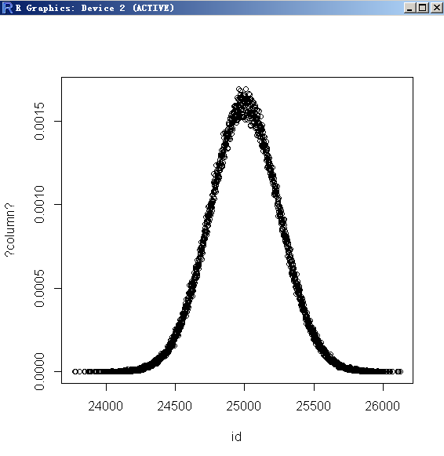
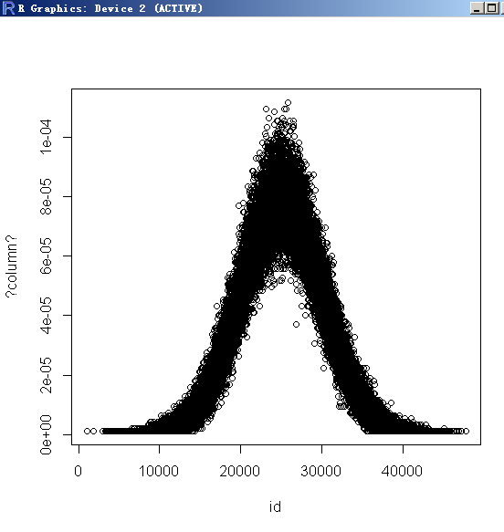
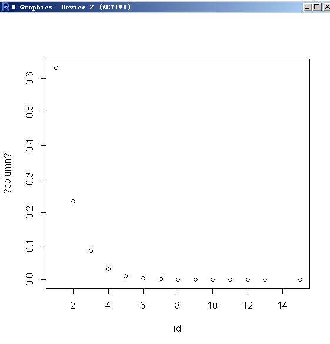
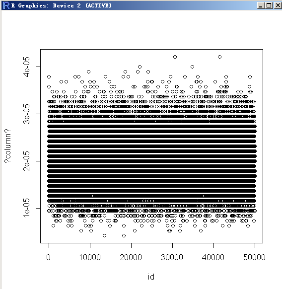

## 重新发现PostgreSQL之美 - 15 沙盘推演, 权力的游戏  
  
### 作者  
digoal  
  
### 日期  
2021-06-06  
  
### 标签  
PostgreSQL , 沙盘 , 推演 , 真相 , 数据 , 案例 , 逻辑 , 理想    
  
----  
  
## 背景  
视频回放: https://www.bilibili.com/video/BV1Zq4y1j7xs/  
  
有数据说数据, 没数据说案例, 没案例说逻辑, 没逻辑谈理想. 已经成为数字时代的职场生存法则.    
- 要陈述一个观点或结论, 没有数据支撑说话没分量, 说明你没经过仔细分析, 没过脑子.    
- 实在拿不到数据, 你总得拿点案例出来, 否则就是在空谈, 没有支点.    
- 没案例, 总得有底层逻辑吧, 逻辑能自洽, 也是说得通的.    
- 如果连逻辑都没有想过, 那你只能用故事、理想或者理念来感染人, 如果你能忽悠(感染)成功, 并且最后确实也成功了, 也许能表达为因为相信所以看见.    
  
场景:  
- 项目上线前, 申请资源, 如何评估需要多少资源?  
- 做IT部门的全年预算?  
- 如何做到精准, 有理有据有节?   
  
挑战:  
- 项目往往只有业务指标(应该叫目标, 和IT预算精算还差了十万八千里), 靠经验或拍脑袋来确定IT预算, 上线后发现资源不足或严重超过预期, 造成铺张浪费.  
- 难以模拟和快速产生真实的业务数据.  
- 难以模拟真实的业务交互行为.  
- 难以捕捉和分析性能问题的原因.  
  
PG解决方案:  
- pgbench, 支持沙盘推演, 避免纸上谈兵、假大空.  
    - 一个可以近乎真实的模拟业务上线后的压力的内置benchmark program.  
    - 内置多种数据生成算法, 多种模拟业务和数据库交互的command,  
    - 同时支持根据业务定制化压测程序, 模拟真实的业务交互行为.  
- awr, pg_stat_statements, 捕获和分析业务瓶颈  
    - ##### 202104/20210415_01.md   [《PostgreSQL pg_stat_statements AWR 插件 pg_stat_monitor , 过去任何时间段性能分析 [推荐、收藏]》](../202104/20210415_01.md)  
    - ##### 202003/20200324_25.md   [《PostgreSQL 活跃会话历史记录插件 - pgsentinel 类似performance insight \ Oracle ASH Active Session History》](../202003/20200324_25.md)  
    - ##### 201901/20190125_02.md   [《PostgreSQL Oracle 兼容性之 - performance insight - AWS performance insight 理念与实现解读 - 珍藏级》](../201901/20190125_02.md)  
    - https://www.postgresql.org/docs/devel/pgstatstatements.html  
- 快速构建海量测试数据  
    - ##### 202001/20200103_01.md   [《PostgreSQL+MySQL 联合解决方案 - 第3课视频 - 如何压测PG数据库、如何瞬间构造海量测试数据》](../202001/20200103_01.md)  
    - ##### 201711/20171121_01.md   [《PostgreSQL 如何快速构建 海量 逼真 测试数据》](../201711/20171121_01.md)  
  
  
## 例子  
重点讲一下pgbench里面的一个小点:   
- 产生各种分布形态的模拟数据(高斯分布、随机分布、指数分布、长尾分布)  
  
为了让大家更容易理解概率分布情况, 建议先了解一下以下3种绘图方式.    
  
1、柱状图  
##### 202104/20210429_01.md   [《PostgreSQL - 时序、IoT类场景 - 自定义histogram函数, 绘制数据分布柱状图 - cte window range width_bucket format plpgsql》](../202104/20210429_01.md)  
  
```  
CREATE OR REPLACE FUNCTION histogram(table_name_or_subquery text, column_name text, buckets int, leng int)    
RETURNS TABLE(bucket int, "range" numrange, freq bigint, ratio text, bar text)    
AS $func$    
DECLARE     
  sql text;    
BEGIN    
  sql := format('    
  WITH    
  source AS (    
    SELECT * FROM (%s) t    
  ),    
  min_max AS (    
    SELECT min(%s) AS min, max(%s) AS max FROM source    
  ),    
  histogram AS (    
    SELECT    
      width_bucket(%s, min_max.min, min_max.max+min_max.max*0.00000001, %s) AS bucket,    
      numrange(min(%s)::numeric, max(%s)::numeric, ''[]'') AS "range",    
      count(%s) AS freq    
    FROM source, min_max    
    WHERE %s IS NOT NULL    
    GROUP BY bucket    
    ORDER BY bucket    
  )    
  SELECT    
    bucket,    
    "range",    
    freq::bigint,    
    round(100 * freq::numeric/(sum(freq::numeric) over() + 1), 2)||'' %%'' as ratio,     
    repeat(''*'', (freq::float / (max(freq) over() + 1) * %s)::int) AS bar    
  FROM histogram group by bucket,"range",freq::bigint    
  order by bucket',    
  table_name_or_subquery,    
  column_name,    
  column_name,    
  column_name,    
  buckets,    
  column_name,    
  column_name,    
  column_name,    
  column_name,    
  leng    
  );    
  RETURN QUERY EXECUTE sql;    
  raise notice '%', sql;    
END    
$func$ LANGUAGE plpgsql;   
```  
  
```  
select * from histogram(    
'select id as x from tbl',  -- 求这条SQL的结果集的柱状图    
'x',  -- 按这个字段的数值分布绘制柱状图, x是以上SQL的某个字段名    
25,   -- 均匀分布成25个bucket, 最好结果中的唯一值个数能刚好整除这个bucket     
20);  -- 展示进度条形式表示占比. 20是进度条的最长字符数   
```  
  
  
2、高频词  
pg_catalog.pg_stats.    
  
这个是analyze之后产生的, 存储了字段的高频词, 也有bucket的概率分布等信息.   
  
  
3、饼图  
##### 201808/20180804_01.md   [《PostgreSQL psql 绘制饼图》](../201808/20180804_01.md)   
  
少量唯一值的group统计可以用来绘制饼图, 值很多的情况不适合   
  
```  
create or replace function gen_charts(    
  sql text,  -- SQL，返回两列，第一列为描述，第二列为这个描述的数值    
  width int default 80,     
  height int default 25,     
  radius numeric default 1.0,   -- 换成float8类型，打印实心饼图  
  colours text default '#;o:X"@+-=123456789abcdef'      
) returns setof text as $$    
declare    
begin    
return query execute format(    
$_$    
WITH slices AS (    
 SELECT  CAST(ROW_NUMBER() OVER () AS INTEGER) AS slice,    
         name,     
	 VALUE,    
	 100.0 * VALUE / SUM(VALUE) OVER () AS percentage,    
	 2*PI() * SUM(VALUE) OVER (ROWS unbounded preceding)     
                / SUM(VALUE) OVER () AS radians    
   FROM (%s    
        ) AS DATA(name,VALUE))    
(    
  SELECT array_to_string(array_agg(c),'') AS pie_chart    
    FROM (    
    SELECT x, y,    
           CASE WHEN NOT (SQRT(pow(x, 2) + pow(y, 2))     
                            BETWEEN %s*1/10 AND %s)    
                THEN ' '    
                ELSE SUBSTRING(%L,    
                               (SELECT MIN(slice)     
                                  FROM slices     
                                 WHERE radians >= PI() + atan2(y,-x)),    
                               1)    
                END AS c    
      FROM (SELECT 2.0*generate_series(0,%s)/%s-1.0) AS x(x),    
           (SELECT 2.0*generate_series(0,%s)/%s-1.0) AS y(y)    
     ORDER BY y,x    
  ) AS xy    
 GROUP BY y    
 ORDER BY y    
)    
UNION ALL     
SELECT repeat(SUBSTRING(%L,slice,1), 2) || '  ' ||     
       name || ': ' ||     
       VALUE || '  (' || round(percentage,0) || '%%)'     
  FROM slices;    
$_$, sql, radius, radius, colours, width, width, height, height, colours);    
    
return;    
end;    
$$ language plpgsql strict;    
```  
  
```  
postgres=# select * from gen_charts('select mod(id,5),count(*) from tbl group by 1 order by 2 desc');  
                                    gen_charts                                       
-----------------------------------------------------------------------------------  
                                         ;                                          
                          ;;;;;;;;;;;;;;;;;;;;;;;;;;;####                           
                    ;;;;;;;;;;;;;;;;;;;;;;;;;;;;;;;;###########                     
                ;;;;;;;;;;;;;;;;;;;;;;;;;;;;;;;;;;;################                 
            ;;;;;;;;;;;;;;;;;;;;;;;;;;;;;;;;;;;;;;#####################             
         ;;;;;;;;;;;;;;;;;;;;;;;;;;;;;;;;;;;;;;;;#########################          
       oooooo;;;;;;;;;;;;;;;;;;;;;;;;;;;;;;;;;;;############################        
      ooooooooooo;;;;;;;;;;;;;;;;;;;;;;;;;;;;;;##############################       
    oooooooooooooooooo;;;;;;;;;;;;;;;;;;;;;;;;#################################     
   ooooooooooooooooooooooo;;;;;;;;;;;;;;;;;;;###################################    
  oooooooooooooooooooooooooooo;;;;;;;;;;;;;;#####################################   
  ooooooooooooooooooooooooooooooooo;;;;;;;;######################################   
  oooooooooooooooooooooooooooooooooooo       ####################################   
  oooooooooooooooooooooooooooooooooooo       XXXXXXXXXXXXXXXXXXXXXXXXXXXXXXXXXXXX   
  ooooooooooooooooooooooooooooooooo::::::::XXXXXXXXXXXXXXXXXXXXXXXXXXXXXXXXXXXXXX   
  ooooooooooooooooooooooooooooo:::::::::::::XXXXXXXXXXXXXXXXXXXXXXXXXXXXXXXXXXXXX   
   ooooooooooooooooooooooo:::::::::::::::::::XXXXXXXXXXXXXXXXXXXXXXXXXXXXXXXXXXX    
    oooooooooooooooooo::::::::::::::::::::::::XXXXXXXXXXXXXXXXXXXXXXXXXXXXXXXXX     
      ooooooooooo::::::::::::::::::::::::::::::XXXXXXXXXXXXXXXXXXXXXXXXXXXXXX       
       oooooo:::::::::::::::::::::::::::::::::::XXXXXXXXXXXXXXXXXXXXXXXXXXXX        
         ::::::::::::::::::::::::::::::::::::::::XXXXXXXXXXXXXXXXXXXXXXXXX          
            ::::::::::::::::::::::::::::::::::::::XXXXXXXXXXXXXXXXXXXXX             
                :::::::::::::::::::::::::::::::::::XXXXXXXXXXXXXXXX                 
                    ::::::::::::::::::::::::::::::::XXXXXXXXXXX                     
                          ::::::::::::::::::::::::::::XXX                           
                                         :                                          
 ##  2: 563867  (20%)  
 ;;  3: 563581  (20%)  
 oo  4: 563241  (20%)  
 ::  1: 562509  (20%)  
 XX  0: 562363  (20%)  
(31 rows)  
```  
  
4、R绘图  
##### 201506/20150618_01.md   [《生成泊松、高斯、指数、随机分布数据 - PostgreSQL 9.5 new feature - pgbench improve, gaussian (standard normal) & exponential distribution》](../201506/20150618_01.md)  
  
纵轴: 概率  
横轴: value  
  
    
    
    
    
    
    
    
    
    
  
### 1 随机分布   
  
```  
create unlogged table tbl (id int, info text);  
```  
  
为了便于观察概率分布情况, 取100个值.   
  
```  
vi test.sql  
  
\set id random(1,100)  
insert into tbl values (:id, 'test');  
  
pgbench -M prepared -n -r -P 1 -f ./test.sql -c 12 -j 12 -T 20  
```  
  
概率分布情况:   
  
```  
 bucket |  range   |  freq  | ratio  |         bar            
--------+----------+--------+--------+----------------------  
      1 | [1,4]    | 112623 | 4.00 % | ********************  
      2 | [5,8]    | 113083 | 4.02 % | ********************  
      3 | [9,12]   | 112719 | 4.00 % | ********************  
      4 | [13,16]  | 112613 | 4.00 % | ********************  
      5 | [17,20]  | 112798 | 4.01 % | ********************  
      6 | [21,24]  | 113045 | 4.02 % | ********************  
      7 | [25,28]  | 112343 | 3.99 % | ********************  
      8 | [29,32]  | 113011 | 4.01 % | ********************  
      9 | [33,36]  | 112894 | 4.01 % | ********************  
     10 | [37,40]  | 112040 | 3.98 % | ********************  
     11 | [41,44]  | 112700 | 4.00 % | ********************  
     12 | [45,48]  | 112247 | 3.99 % | ********************  
     13 | [49,52]  | 112771 | 4.01 % | ********************  
     14 | [53,56]  | 112284 | 3.99 % | ********************  
     15 | [57,60]  | 112399 | 3.99 % | ********************  
     16 | [61,64]  | 112181 | 3.98 % | ********************  
     17 | [65,68]  | 112560 | 4.00 % | ********************  
     18 | [69,72]  | 112514 | 4.00 % | ********************  
     19 | [73,76]  | 112681 | 4.00 % | ********************  
     20 | [77,80]  | 112666 | 4.00 % | ********************  
     21 | [81,84]  | 112508 | 4.00 % | ********************  
     22 | [85,88]  | 112864 | 4.01 % | ********************  
     23 | [89,92]  | 113081 | 4.02 % | ********************  
     24 | [93,96]  | 112283 | 3.99 % | ********************  
     25 | [97,100] | 112653 | 4.00 % | ********************  
(25 rows)  
```  
  
  
### 2 高斯分布  
```  
truncate tbl;  
  
\set id random_gaussian(1,100,2.5)  
insert into tbl values (:id, 'test');  
  
pgbench -M prepared -n -r -P 1 -f ./test.sql -c 12 -j 12 -T 20  
```  
  
概率分布情况:   
  
```  
 bucket |  range   |  freq  | ratio  |         bar            
--------+----------+--------+--------+----------------------  
      1 | [1,4]    |  13432 | 0.46 % | *  
      2 | [5,8]    |  21253 | 0.72 % | **  
      3 | [9,12]   |  32501 | 1.10 % | ***  
      4 | [13,16]  |  47288 | 1.60 % | ****  
      5 | [17,20]  |  66095 | 2.24 % | ******  
      6 | [21,24]  |  89577 | 3.04 % | ********  
      7 | [25,28]  | 115935 | 3.93 % | **********  
      8 | [29,32]  | 144387 | 4.89 % | ************  
      9 | [33,36]  | 173053 | 5.87 % | ***************  
     10 | [37,40]  | 198419 | 6.73 % | *****************  
     11 | [41,44]  | 219778 | 7.45 % | ******************  
     12 | [45,48]  | 233489 | 7.91 % | ********************  
     13 | [49,52]  | 238105 | 8.07 % | ********************  
     14 | [53,56]  | 234864 | 7.96 % | ********************  
     15 | [57,60]  | 219427 | 7.44 % | ******************  
     16 | [61,64]  | 198440 | 6.73 % | *****************  
     17 | [65,68]  | 172913 | 5.86 % | ***************  
     18 | [69,72]  | 144989 | 4.91 % | ************  
     19 | [73,76]  | 116383 | 3.95 % | **********  
     20 | [77,80]  |  89234 | 3.02 % | *******  
     21 | [81,84]  |  66099 | 2.24 % | ******  
     22 | [85,88]  |  47493 | 1.61 % | ****  
     23 | [89,92]  |  32253 | 1.09 % | ***  
     24 | [93,96]  |  21227 | 0.72 % | **  
     25 | [97,100] |  13485 | 0.46 % | *  
(25 rows)  
```  
  
```  
 bucket |   range   | freq  | ratio  |         bar            
--------+-----------+-------+--------+----------------------  
      1 | [1,1]     |  2772 | 0.10 % | *  
      2 | [2,2]     |  3115 | 0.11 % | *  
      3 | [3,3]     |  3509 | 0.12 % | *  
      4 | [4,4]     |  3943 | 0.14 % | *  
      5 | [5,5]     |  4453 | 0.15 % | **  
      6 | [6,6]     |  4918 | 0.17 % | **  
      7 | [7,7]     |  5281 | 0.18 % | **  
      8 | [8,8]     |  6079 | 0.21 % | **  
      9 | [9,9]     |  6729 | 0.23 % | **  
     10 | [10,10]   |  7571 | 0.26 % | ***  
     11 | [11,11]   |  8314 | 0.29 % | ***  
     12 | [12,12]   |  9317 | 0.32 % | ***  
     13 | [13,13]   | 10043 | 0.35 % | ***  
     14 | [14,14]   | 11067 | 0.38 % | ****  
     15 | [15,15]   | 12295 | 0.42 % | ****  
     16 | [16,16]   | 13300 | 0.46 % | *****  
     17 | [17,17]   | 14253 | 0.49 % | *****  
     18 | [18,18]   | 15499 | 0.54 % | *****  
     19 | [19,19]   | 16740 | 0.58 % | ******  
     20 | [20,20]   | 18166 | 0.63 % | ******  
     21 | [21,21]   | 19789 | 0.68 % | *******  
     22 | [22,22]   | 20970 | 0.72 % | *******  
     23 | [23,23]   | 22950 | 0.79 % | ********  
     24 | [24,24]   | 24604 | 0.85 % | ********  
     25 | [25,25]   | 25854 | 0.89 % | *********  
     26 | [26,26]   | 27707 | 0.96 % | *********  
     27 | [27,27]   | 29553 | 1.02 % | **********  
     28 | [28,28]   | 31101 | 1.07 % | ***********  
     29 | [29,29]   | 32583 | 1.13 % | ***********  
     30 | [30,30]   | 34714 | 1.20 % | ************  
     31 | [31,31]   | 36389 | 1.26 % | ************  
     32 | [32,32]   | 37939 | 1.31 % | *************  
     33 | [33,33]   | 39881 | 1.38 % | **************  
     34 | [34,34]   | 41757 | 1.44 % | **************  
     35 | [35,35]   | 43436 | 1.50 % | ***************  
     36 | [36,36]   | 45062 | 1.56 % | ***************  
     37 | [37,37]   | 46501 | 1.61 % | ****************  
     38 | [38,38]   | 47971 | 1.66 % | ****************  
     39 | [39,39]   | 49850 | 1.72 % | *****************  
     40 | [40,40]   | 51173 | 1.77 % | *****************  
     41 | [41,41]   | 52545 | 1.81 % | ******************  
     42 | [42,42]   | 53146 | 1.84 % | ******************  
     43 | [43,43]   | 54303 | 1.88 % | *******************  
     44 | [44,44]   | 54906 | 1.90 % | *******************  
     45 | [45,45]   | 56245 | 1.94 % | *******************  
     46 | [46,46]   | 57177 | 1.97 % | ********************  
     47 | [47,47]   | 57219 | 1.98 % | ********************  
     48 | [48,48]   | 58151 | 2.01 % | ********************  
     49 | [49,49]   | 58306 | 2.01 % | ********************  
     50 | [50,50]   | 57975 | 2.00 % | ********************  
     51 | [51,51]   | 58419 | 2.02 % | ********************  
     52 | [52,52]   | 58561 | 2.02 % | ********************  
     53 | [53,53]   | 58121 | 2.01 % | ********************  
     54 | [54,54]   | 57767 | 1.99 % | ********************  
     55 | [55,55]   | 56827 | 1.96 % | *******************  
     56 | [56,56]   | 56762 | 1.96 % | *******************  
     57 | [57,57]   | 55026 | 1.90 % | *******************  
     58 | [58,58]   | 54578 | 1.88 % | *******************  
     59 | [59,59]   | 52974 | 1.83 % | ******************  
     60 | [60,60]   | 52356 | 1.81 % | ******************  
     61 | [61,61]   | 51089 | 1.76 % | *****************  
     62 | [62,62]   | 49518 | 1.71 % | *****************  
     63 | [63,63]   | 48436 | 1.67 % | *****************  
     64 | [64,64]   | 46651 | 1.61 % | ****************  
     65 | [65,65]   | 44896 | 1.55 % | ***************  
     66 | [66,66]   | 43576 | 1.50 % | ***************  
     67 | [67,67]   | 41402 | 1.43 % | **************  
     68 | [68,68]   | 39948 | 1.38 % | **************  
     69 | [69,69]   | 38070 | 1.31 % | *************  
     70 | [70,70]   | 36540 | 1.26 % | ************  
     71 | [71,71]   | 34686 | 1.20 % | ************  
     72 | [72,72]   | 32937 | 1.14 % | ***********  
     73 | [73,73]   | 31284 | 1.08 % | ***********  
     74 | [74,74]   | 29431 | 1.02 % | **********  
     75 | [75,75]   | 27559 | 0.95 % | *********  
     76 | [76,76]   | 25754 | 0.89 % | *********  
     77 | [77,77]   | 24428 | 0.84 % | ********  
     78 | [78,78]   | 22623 | 0.78 % | ********  
     79 | [79,79]   | 20849 | 0.72 % | *******  
     80 | [80,80]   | 19831 | 0.68 % | *******  
     81 | [81,81]   | 18070 | 0.62 % | ******  
     82 | [82,82]   | 16890 | 0.58 % | ******  
     83 | [83,83]   | 15677 | 0.54 % | *****  
     84 | [84,84]   | 14462 | 0.50 % | *****  
     85 | [85,85]   | 13420 | 0.46 % | *****  
     86 | [86,86]   | 12338 | 0.43 % | ****  
     87 | [87,87]   | 10995 | 0.38 % | ****  
     88 | [88,88]   | 10231 | 0.35 % | ***  
     89 | [89,89]   |  9213 | 0.32 % | ***  
     90 | [90,90]   |  8337 | 0.29 % | ***  
     91 | [91,91]   |  7535 | 0.26 % | ***  
     92 | [92,92]   |  6751 | 0.23 % | **  
     93 | [93,93]   |  6222 | 0.21 % | **  
     94 | [94,94]   |  5479 | 0.19 % | **  
     95 | [95,95]   |  4958 | 0.17 % | **  
     96 | [96,96]   |  4339 | 0.15 % | *  
     97 | [97,97]   |  3870 | 0.13 % | *  
     98 | [98,98]   |  3453 | 0.12 % | *  
     99 | [99,99]   |  3063 | 0.11 % | *  
    100 | [100,100] |  2777 | 0.10 % | *  
(100 rows)  
```  
  
参数说明:   
  
threshold >= 2.0  
  
高斯分布（正态分布）的概率峰值出现在min,max的数学期望值即(max + min) / 2.0。  
  
约67%的值分布在以min,max数学期望为中心的 1.0 / threshold 这个区间。  
  
约95%的值分布在以min,max数学期望为中心的 2.0 / threshold 这个区间。  
  
所以threshold越大，数据数据越集中在min,max的数学期望附近。  
  
  
### 3 指数分布  
```  
truncate tbl;  
  
\set id random_exponential(1,100,3.0)  
insert into tbl values (:id, 'test');  
```  
  
概率分布情况:   
  
```  
 bucket |  range   |  freq  |  ratio  |       bar         
--------+----------+--------+---------+-----------------  
      1 | [1,4]    | 353424 | 11.91 % | ***************  
      2 | [5,8]    | 312966 | 10.55 % | *************  
      3 | [9,12]   | 277325 | 9.34 %  | ************  
      4 | [13,16]  | 246483 | 8.31 %  | **********  
      5 | [17,20]  | 218639 | 7.37 %  | *********  
      6 | [21,24]  | 193728 | 6.53 %  | ********  
      7 | [25,28]  | 172174 | 5.80 %  | *******  
      8 | [29,32]  | 152792 | 5.15 %  | ******  
      9 | [33,36]  | 135425 | 4.56 %  | ******  
     10 | [37,40]  | 119895 | 4.04 %  | *****  
     11 | [41,44]  | 106444 | 3.59 %  | *****  
     12 | [45,48]  |  94220 | 3.17 %  | ****  
     13 | [49,52]  |  83763 | 2.82 %  | ****  
     14 | [53,56]  |  74046 | 2.50 %  | ***  
     15 | [57,60]  |  66040 | 2.23 %  | ***  
     16 | [61,64]  |  58151 | 1.96 %  | **  
     17 | [65,68]  |  51363 | 1.73 %  | **  
     18 | [69,72]  |  45887 | 1.55 %  | **  
     19 | [73,76]  |  40873 | 1.38 %  | **  
     20 | [77,80]  |  35882 | 1.21 %  | **  
     21 | [81,84]  |  32248 | 1.09 %  | *  
     22 | [85,88]  |  28587 | 0.96 %  | *  
     23 | [89,92]  |  25010 | 0.84 %  | *  
     24 | [93,96]  |  22546 | 0.76 %  | *  
     25 | [97,100] |  19815 | 0.67 %  | *  
(25 rows)  
```  
  
参数说明:   
  
threshold > 0  
  
(threshold越大，随机值接近min的概率越大，反之，threshold越小，随机值接近max的概率越大)  
threshold 越接近0，则越趋于随机分布，而不是指数分布。  
  
  
### 长尾分布  
```  
truncate tbl;  
  
\set id random_zipfian(1, 100, 1.001)  
insert into tbl values (:id, 'test');  
```  
  
概率分布情况:   
  
```  
 bucket |  range   |  freq  |  ratio  |         bar            
--------+----------+--------+---------+----------------------  
      1 | [1,4]    | 911700 | 40.21 % | ********************  
      2 | [5,8]    | 276736 | 12.21 % | ******  
      3 | [9,12]   | 168646 | 7.44 %  | ****  
      4 | [13,16]  | 121354 | 5.35 %  | ***  
      5 | [17,20]  |  94427 | 4.16 %  | **  
      6 | [21,24]  |  78154 | 3.45 %  | **  
      7 | [25,28]  |  66173 | 2.92 %  | *  
      8 | [29,32]  |  57071 | 2.52 %  | *  
      9 | [33,36]  |  50582 | 2.23 %  | *  
     10 | [37,40]  |  45865 | 2.02 %  | *  
     11 | [41,44]  |  40835 | 1.80 %  | *  
     12 | [45,48]  |  37525 | 1.66 %  | *  
     13 | [49,52]  |  34916 | 1.54 %  | *  
     14 | [53,56]  |  32284 | 1.42 %  | *  
     15 | [57,60]  |  29811 | 1.31 %  | *  
     16 | [61,64]  |  28028 | 1.24 %  | *  
     17 | [65,68]  |  26214 | 1.16 %  | *  
     18 | [69,72]  |  24556 | 1.08 %  | *  
     19 | [73,76]  |  23285 | 1.03 %  | *  
     20 | [77,80]  |  22211 | 0.98 %  |   
     21 | [81,84]  |  21089 | 0.93 %  |   
     22 | [85,88]  |  20134 | 0.89 %  |   
     23 | [89,92]  |  19093 | 0.84 %  |   
     24 | [93,96]  |  18686 | 0.82 %  |   
     25 | [97,100] |  17964 | 0.79 %  |   
(25 rows)  
```  
  
参数说明:   
  
threshold 取值范围: [1.001, 1000]  
  
k 的概率为 k+1 的 ((k+1)/k)^threshold 次方      
threshold越大, 概率曲线越陡峭, 头部值(begin值)出现概率越高. 递弱代偿线越陡峭.    
   
For example, random_zipfian(1, ..., 2.5) produces the value  
1 about (2/1)^2.5 = 5.66 times more frequently than 2,  
2 about (3/2)^2.5 = 2.76 times more frequently than 3,  
and so on.  
  
  
  
  
今天只讲了关于随机数据生成的其中一种方法, PG里面生成随机数据还有大把的方法, 包括自己写函数或inline code, 结合内置的srf函数等(如generate_series).   
海量数据的生成方法、各处场景的压测, 请参考末尾文章.   
  
  
  
## 参考  
pgbench  
https://www.postgresql.org/docs/devel/pgbench.html  
  
##### 201711/20171107_48.md   [《HTAP数据库 PostgreSQL 场景与性能测试之 47 - (OLTP多模优化) 空间应用 - 高并发空间位置更新、多属性KNN搜索并测（含空间索引）末端配送、新零售类项目》](../201711/20171107_48.md)  
##### 201711/20171107_47.md   [《HTAP数据库 PostgreSQL 场景与性能测试之 46 - (OLTP) 大json字段的高并发更新》](../201711/20171107_47.md)  
##### 201711/20171107_46.md   [《HTAP数据库 PostgreSQL 场景与性能测试之 45 - (OLTP) 数据量与性能的线性关系(10亿+无衰减), 暨单表多大需要分区》](../201711/20171107_46.md)  
##### 201711/20171107_45.md   [《[未完待续] HTAP数据库 PostgreSQL 场景与性能测试之 44 - (OLTP) 空间应用 - 空间包含查询(输入多边形 包含 表内空间对象)》](../201711/20171107_45.md)  
##### 201711/20171107_44.md   [《HTAP数据库 PostgreSQL 场景与性能测试之 43 - (OLTP+OLAP) unlogged table 含索引多表批量写入》](../201711/20171107_44.md)  
##### 201711/20171107_43.md   [《HTAP数据库 PostgreSQL 场景与性能测试之 42 - (OLTP+OLAP) unlogged table 不含索引多表批量写入》](../201711/20171107_43.md)  
##### 201711/20171107_42.md   [《HTAP数据库 PostgreSQL 场景与性能测试之 41 - (OLTP+OLAP) 含索引多表批量写入》](../201711/20171107_42.md)  
##### 201711/20171107_41.md   [《HTAP数据库 PostgreSQL 场景与性能测试之 40 - (OLTP+OLAP) 不含索引多表批量写入》](../201711/20171107_41.md)  
##### 201711/20171107_40.md   [《HTAP数据库 PostgreSQL 场景与性能测试之 39 - (OLTP+OLAP) logged & unlogged table 含索引多表单点写入》](../201711/20171107_40.md)  
##### 201711/20171107_39.md   [《HTAP数据库 PostgreSQL 场景与性能测试之 38 - (OLTP+OLAP) logged & unlogged table 不含索引多表单点写入》](../201711/20171107_39.md)  
##### 201711/20171107_38.md   [《HTAP数据库 PostgreSQL 场景与性能测试之 37 - (OLTP+OLAP) 含索引单表批量写入》](../201711/20171107_38.md)  
##### 201711/20171107_37.md   [《HTAP数据库 PostgreSQL 场景与性能测试之 36 - (OLTP+OLAP) 不含索引单表批量写入》](../201711/20171107_37.md)  
##### 201711/20171107_36.md   [《HTAP数据库 PostgreSQL 场景与性能测试之 35 - (OLTP+OLAP) 含索引单表单点写入》](../201711/20171107_36.md)  
##### 201711/20171107_35.md   [《HTAP数据库 PostgreSQL 场景与性能测试之 34 - (OLTP+OLAP) 不含索引单表单点写入》](../201711/20171107_35.md)  
##### 201711/20171107_34.md   [《HTAP数据库 PostgreSQL 场景与性能测试之 33 - (OLAP) 物联网 - 线性字段区间实时统计》](../201711/20171107_34.md)  
##### 201711/20171107_33.md   [《HTAP数据库 PostgreSQL 场景与性能测试之 32 - (OLTP) 高吞吐数据进出(堆存、行扫、无需索引) - 阅后即焚(JSON + 函数流式计算)》](../201711/20171107_33.md)  
##### 201711/20171107_32.md   [《HTAP数据库 PostgreSQL 场景与性能测试之 31 - (OLTP) 高吞吐数据进出(堆存、行扫、无需索引) - 阅后即焚(读写大吞吐并测)》](../201711/20171107_32.md)  
##### 201711/20171107_31.md   [《HTAP数据库 PostgreSQL 场景与性能测试之 30 - (OLTP) 秒杀 - 高并发单点更新》](../201711/20171107_31.md)  
##### 201711/20171107_30.md   [《HTAP数据库 PostgreSQL 场景与性能测试之 29 - (OLTP) 空间应用 - 高并发空间位置更新（含空间索引）》](../201711/20171107_30.md)  
##### 201711/20171107_29.md   [《HTAP数据库 PostgreSQL 场景与性能测试之 28 - (OLTP) 高并发点更新》](../201711/20171107_29.md)  
##### 201711/20171107_28.md   [《HTAP数据库 PostgreSQL 场景与性能测试之 27 - (OLTP) 物联网 - FEED日志, 流式处理 与 阅后即焚 (CTE)》](../201711/20171107_28.md)  
##### 201711/20171107_27.md   [《HTAP数据库 PostgreSQL 场景与性能测试之 26 - (OLTP) NOT IN、NOT EXISTS 查询》](../201711/20171107_27.md)  
##### 201711/20171107_26.md   [《HTAP数据库 PostgreSQL 场景与性能测试之 25 - (OLTP) IN , EXISTS 查询》](../201711/20171107_26.md)  
##### 201711/20171107_25.md   [《HTAP数据库 PostgreSQL 场景与性能测试之 24 - (OLTP) 物联网 - 时序数据并发写入(含时序索引BRIN)》](../201711/20171107_25.md)  
##### 201711/20171107_24.md   [《HTAP数据库 PostgreSQL 场景与性能测试之 23 - (OLAP) 并行计算》](../201711/20171107_24.md)  
##### 201711/20171107_23.md   [《HTAP数据库 PostgreSQL 场景与性能测试之 22 - (OLTP) merge insert|upsert|insert on conflict|合并写入》](../201711/20171107_23.md)  
##### 201711/20171107_22.md   [《HTAP数据库 PostgreSQL 场景与性能测试之 21 - (OLTP+OLAP) 排序、建索引》](../201711/20171107_22.md)  
##### 201711/20171107_21.md   [《HTAP数据库 PostgreSQL 场景与性能测试之 20 - (OLAP) 用户画像圈人场景 - 多个字段任意组合条件筛选与透视》](../201711/20171107_21.md)  
##### 201711/20171107_20.md   [《HTAP数据库 PostgreSQL 场景与性能测试之 19 - (OLAP) 用户画像圈人场景 - 数组相交查询与聚合》](../201711/20171107_20.md)  
##### 201711/20171107_19.md   [《HTAP数据库 PostgreSQL 场景与性能测试之 18 - (OLAP) 用户画像圈人场景 - 数组包含查询与聚合》](../201711/20171107_19.md)  
##### 201711/20171107_18.md   [《HTAP数据库 PostgreSQL 场景与性能测试之 17 - (OLTP) 数组相似查询》](../201711/20171107_18.md)  
##### 201711/20171107_17.md   [《HTAP数据库 PostgreSQL 场景与性能测试之 16 - (OLTP) 文本特征向量 - 相似特征(海明...)查询》](../201711/20171107_17.md)  
##### 201711/20171107_16.md   [《HTAP数据库 PostgreSQL 场景与性能测试之 15 - (OLTP) 物联网 - 查询一个时序区间的数据》](../201711/20171107_16.md)  
##### 201711/20171107_15.md   [《HTAP数据库 PostgreSQL 场景与性能测试之 14 - (OLTP) 字符串搜索 - 全文检索》](../201711/20171107_15.md)  
##### 201711/20171107_14.md   [《HTAP数据库 PostgreSQL 场景与性能测试之 13 - (OLTP) 字符串搜索 - 相似查询》](../201711/20171107_14.md)  
##### 201711/20171107_13.md   [《HTAP数据库 PostgreSQL 场景与性能测试之 12 - (OLTP) 字符串搜索 - 前后模糊查询》](../201711/20171107_13.md)  
##### 201711/20171107_12.md   [《HTAP数据库 PostgreSQL 场景与性能测试之 11 - (OLTP) 字符串搜索 - 后缀查询》](../201711/20171107_12.md)  
##### 201711/20171107_11.md   [《HTAP数据库 PostgreSQL 场景与性能测试之 10 - (OLTP) 字符串搜索 - 前缀查询》](../201711/20171107_11.md)  
##### 201711/20171107_10.md   [《HTAP数据库 PostgreSQL 场景与性能测试之 9 - (OLTP) 字符串模糊查询 - 含索引实时写入》](../201711/20171107_10.md)  
##### 201711/20171107_09.md   [《HTAP数据库 PostgreSQL 场景与性能测试之 8 - (OLTP) 多值类型(数组)含索引实时写入》](../201711/20171107_09.md)  
##### 201711/20171107_08.md   [《HTAP数据库 PostgreSQL 场景与性能测试之 7 - (OLTP) 全文检索 - 含索引实时写入》](../201711/20171107_08.md)  
##### 201711/20171107_07.md   [《HTAP数据库 PostgreSQL 场景与性能测试之 6 - (OLTP) 空间应用 - KNN查询（搜索附近对象，由近到远排序输出）》](../201711/20171107_07.md)  
##### 201711/20171107_06.md   [《HTAP数据库 PostgreSQL 场景与性能测试之 5 - (OLTP) 空间应用 - 空间包含查询(表内多边形 包含 输入空间对象)》](../201711/20171107_06.md)  
##### 201711/20171107_05.md   [《HTAP数据库 PostgreSQL 场景与性能测试之 4 - (OLAP) 大表OUTER JOIN统计查询》](../201711/20171107_05.md)  
##### 201711/20171107_49.md   [《HTAP数据库 PostgreSQL 场景与性能测试之 3.1 - (OLAP) 大表JOIN统计查询-10亿 join 1亿 agg》](../201711/20171107_49.md)  
##### 201711/20171107_04.md   [《HTAP数据库 PostgreSQL 场景与性能测试之 3 - (OLAP) 大表JOIN统计查询》](../201711/20171107_04.md)  
##### 201711/20171107_03.md   [《HTAP数据库 PostgreSQL 场景与性能测试之 2 - (OLTP) 多表JOIN》](../201711/20171107_03.md)  
##### 201711/20171107_02.md   [《HTAP数据库 PostgreSQL 场景与性能测试之 1 - (OLTP) 点查》](../201711/20171107_02.md)  
##### 202001/20200103_01.md   [《PostgreSQL+MySQL 联合解决方案 - 第3课视频 - 如何压测PG数据库、如何瞬间构造海量测试数据》](../202001/20200103_01.md)  
##### 201711/20171121_01.md   [《PostgreSQL 如何快速构建 海量 逼真 测试数据》](../201711/20171121_01.md)  
  
  
  
  
  
#### [PostgreSQL 许愿链接](https://github.com/digoal/blog/issues/76 "269ac3d1c492e938c0191101c7238216")
您的愿望将传达给PG kernel hacker、数据库厂商等, 帮助提高数据库产品质量和功能, 说不定下一个PG版本就有您提出的功能点. 针对非常好的提议，奖励限量版PG文化衫、纪念品、贴纸、PG热门书籍等，奖品丰富，快来许愿。[开不开森](https://github.com/digoal/blog/issues/76 "269ac3d1c492e938c0191101c7238216").  
  
  
#### [9.9元购买3个月阿里云RDS PostgreSQL实例](https://www.aliyun.com/database/postgresqlactivity "57258f76c37864c6e6d23383d05714ea")
  
  
#### [PostgreSQL 解决方案集合](https://yq.aliyun.com/topic/118 "40cff096e9ed7122c512b35d8561d9c8")
  
  
#### [德哥 / digoal's github - 公益是一辈子的事.](https://github.com/digoal/blog/blob/master/README.md "22709685feb7cab07d30f30387f0a9ae")
  
  

  
  
#### [PolarDB 学习图谱: 训练营、培训认证、在线互动实验、解决方案、生态合作、写心得拿奖品](https://www.aliyun.com/database/openpolardb/activity "8642f60e04ed0c814bf9cb9677976bd4")
  
  
#### [购买PolarDB云服务折扣活动进行中, 55元起](https://www.aliyun.com/activity/new/polardb-yunparter?userCode=bsb3t4al "e0495c413bedacabb75ff1e880be465a")
  
  
#### [About 德哥](https://github.com/digoal/blog/blob/master/me/readme.md "a37735981e7704886ffd590565582dd0")
  
