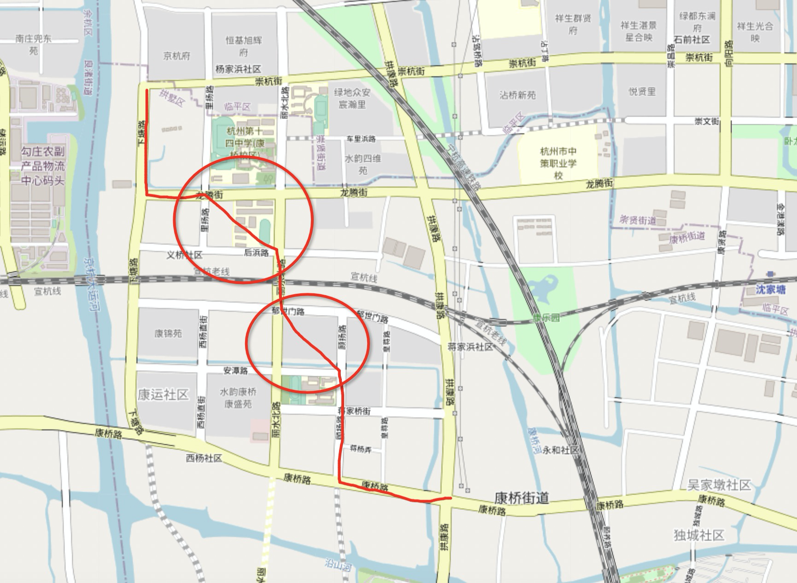

## 重新发现PostgreSQL之美 - 27 无中生有    
    
### 作者    
digoal    
    
### 日期    
2021-06-16     
    
### 标签    
PostgreSQL , 路径规划 , 轨迹相遇 , 缺失点补齐       
    
----    
    
## 背景    
视频回放: https://www.bilibili.com/video/BV17K4y197J8/    
  
  
场景:  
- 路径规划: 大型商业综合体, 自动驾驶, 虚拟现实.  
- 共享出行(拼车), 配送调度(餐饮、包裹).  
- 刑侦: 轨迹相遇分析  
    - [《重新发现PostgreSQL之美 - 11 时空轨迹系统 新冠&刑侦&预测》](../202106/20210602_01.md)    
  
挑战:  
- 传统数据库不支持路网数据, 需要move data到应用端进行计算.  
- 现实中轨迹存在缺失点, 当需要分析轨迹相遇事件时, 准确度下降.  
- 在共享出行拼单, 包裹和餐饮配送中存在一到多, 多到多的路径规划, 非常复杂传统数据库不支持.  
  
PG 解决方案:  
- 支持路网数据存储: 点, 线. 支持道路正、反权重来表示路段通畅度.   
- 内置多重路径规划算法, 支持one to one,one to many,many to one,many to many等算法.  
  
## pgrouting  
https://docs.pgrouting.org/latest/en/index.html  
  
https://workshop.pgrouting.org/  
  
数据库路由优点：  
- 兼容更多客户端, 都可以修改数据和属性，例如QGIS通过 JDBC、ODBC 或直接使用 Pl/pgSQL。客户端可以是 PC 或移动设备。  
- 数据更新后, 全网可见. 无需预先计算。  
- 路径规划中的变量: “成本”、“路段” 参数可以通过 SQL 动态计算，其值可以来自多个字段或表。  
    - 例如路段施工、路段拥堵都可以实时反馈.  
  
核心功能, pgRouting 库包含以下功能(算法)：  
- All Pairs Shortest Path, Johnson’s Algorithm  
- All Pairs Shortest Path, Floyd-Warshall Algorithm  
- Shortest Path A\*  
- Bi-directional Dijkstra Shortest Path  
- Bi-directional A\* Shortest Path  
- Shortest Path Dijkstra  
- Driving Distance  
- K-Shortest Path, Multiple Alternative Paths  
- K-Dijkstra, One to Many Shortest Path  
- Traveling Sales Person  
- Turn Restriction Shortest Path (TRSP)  
  
## 例子  
某个轨迹信息:   
  
```  
point1, ts  
point2, ts  
...  
pointn, ts  
```  
  
绘图后发现缺失某些点, 出现飞行轨迹, 怎么办?   
  
  
  
以下是路网情况, cost可以表示为当时的道路通过耗时  
  
```  
pointx1, pointy1, cost, reverse_cost  
pointy1, pointz1, cost, reverse_cost  
...   
point??, point??, cost, reverse_cost  
```  
  
无中生有:  
采用one to one的算法的到缺失路径  
  
https://docs.pgrouting.org/latest/en/pgr_dijkstra.html  
  
```  
pgr_dijkstra(Edges SQL, start_vid,  end_vid  [, directed])  
pgr_dijkstra(Edges SQL, start_vid,  end_vids [, directed])  
pgr_dijkstra(Edges SQL, start_vids, end_vid  [, directed])  
pgr_dijkstra(Edges SQL, start_vids, end_vids [, directed])  
pgr_dijkstra(Edges SQL, Combinations SQL [, directed]) -- Proposed on v3.1  
RETURNS SET OF (seq, path_seq [, start_vid] [, end_vid], node, edge, cost, agg_cost)  
OR EMPTY SET  
```  
  
Example  
- From vertex  to vertex  on a directed graph  
  
```  
SELECT * FROM pgr_dijkstra(  
    'SELECT id, source, target, cost, reverse_cost FROM edge_table',  
    2, 3  
);  
 seq | path_seq | node | edge | cost | agg_cost  
-----+----------+------+------+------+----------  
   1 |        1 |    2 |    4 |    1 |        0  
   2 |        2 |    5 |    8 |    1 |        1  
   3 |        3 |    6 |    9 |    1 |        2  
   4 |        4 |    9 |   16 |    1 |        3  
   5 |        5 |    4 |    3 |    1 |        4  
   6 |        6 |    3 |   -1 |    0 |        5  
(6 rows)  
```  
  
## 参考  
https://locatepress.com/pgrouting  
  
https://pgrouting.org/  
  
https://www.openstreetmap.org/#map=4/36.96/104.17  
     
  
#### [PostgreSQL 许愿链接](https://github.com/digoal/blog/issues/76 "269ac3d1c492e938c0191101c7238216")
您的愿望将传达给PG kernel hacker、数据库厂商等, 帮助提高数据库产品质量和功能, 说不定下一个PG版本就有您提出的功能点. 针对非常好的提议，奖励限量版PG文化衫、纪念品、贴纸、PG热门书籍等，奖品丰富，快来许愿。[开不开森](https://github.com/digoal/blog/issues/76 "269ac3d1c492e938c0191101c7238216").  
  
  
#### [9.9元购买3个月阿里云RDS PostgreSQL实例](https://www.aliyun.com/database/postgresqlactivity "57258f76c37864c6e6d23383d05714ea")
  
  
#### [PostgreSQL 解决方案集合](https://yq.aliyun.com/topic/118 "40cff096e9ed7122c512b35d8561d9c8")
  
  
#### [德哥 / digoal's github - 公益是一辈子的事.](https://github.com/digoal/blog/blob/master/README.md "22709685feb7cab07d30f30387f0a9ae")
  
  

  
  
#### [PolarDB 学习图谱: 训练营、培训认证、在线互动实验、解决方案、生态合作、写心得拿奖品](https://www.aliyun.com/database/openpolardb/activity "8642f60e04ed0c814bf9cb9677976bd4")
  
  
#### [购买PolarDB云服务折扣活动进行中, 55元起](https://www.aliyun.com/activity/new/polardb-yunparter?userCode=bsb3t4al "e0495c413bedacabb75ff1e880be465a")
  
  
#### [About 德哥](https://github.com/digoal/blog/blob/master/me/readme.md "a37735981e7704886ffd590565582dd0")
  
