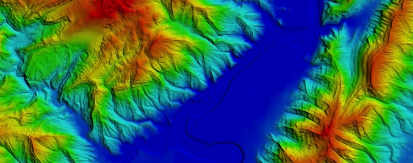
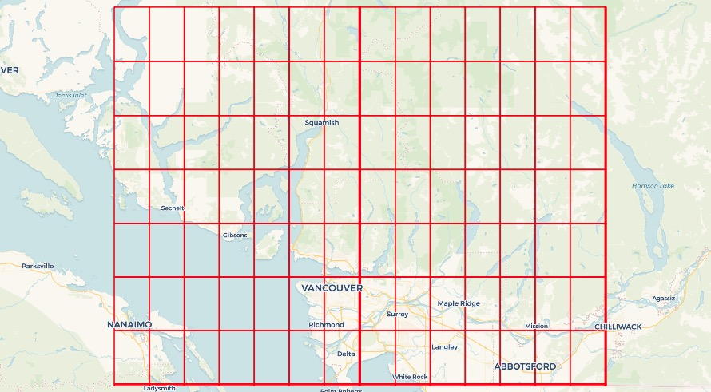

## 云存储在GIS领域的raster存储应用 - Waiting for PostGIS 3.2: Secure Cloud Raster Access     
        
### 作者        
digoal        
        
### 日期        
2021-08-23         
        
### 标签        
PostgreSQL , 云存储 , postgis , raster      
        
----        
        
## 背景        
云对象存储越来越流行(关键是便宜), 越来越多的数据存储在云对象存在中.   
  
raster 可以存储在云对象存储内, postgresql内只存储其元数据(包括bound, heigh, srid等), 使用时gdal库对接对象存储. 解决数据库存储高昂, 备份恢复等多次存储等费用问题.    
  
  
```  
SELECT (ST_Metadata(rast)).*   
FROM dem   
WHERE rid = 1;  
  
-[ RECORD 1 ]----------------------  
upperleftx | -123.00013888888888  
upperlefty | 50.00013888888889  
width      | 512  
height     | 512  
scalex     | 0.0002777777777777778  
scaley     | -0.0002777777777777778  
skewx      | 0  
skewy      | 0  
srid       | 4326  
numbands   | 1  
```   
  
原文:  
  
https://blog.crunchydata.com/blog/waiting-for-postgis-3.2-secure-cloud-raster-access  
  
Raster data access from the spatial database is an important feature, and the coming release of PostGIS will make remote access more practical by allowing access to private cloud storage.  
  
Previous versions could access rasters in public buckets, which is fine for writing blog posts, but in the real world people frequently store their data in private buckets, so we clearly needed the ability to add security tokens to our raster access.  
  
## Raster in the database? Or raster via the database?  
Putting rasters in a database is not necessarily a good idea:  
- they take up a lot of space;  
- they don't fit the relational model very well;  
- they are generally static and non-transactional;  
- when they are updated they are updated in bulk.  
  
However, accessing rasters from a database is a powerful tool:  
- rasters provide lots of contextual information (weather, modelling outputs, gradient surfaces);  
- rasters can model continuous data in a way points, lines and polygons cannot;  
- raster access via SQL abstracts away format and language differences in the same way that vector access does.  
  
  
  
PostGIS has long supported both models, raster in the database, and raster from the database. Raster in the database is called "in-db" and raster from the database is called "out-db".  
  
## Filesystem vs cloud  
The "out-db" model was built before the advent of cloud storage, and the expectation was that external rasters would reside on a file system to which the postgres system would have read/write access. In order to abstract away issues of file format, the "out-db" model did not access files directly, but instead used the GDAL raster format access library.  
  
With the rise of cloud storage options, the GDAL library began adding support for reading and writing from cloud objects via HTTP. This sounds amazingly inefficient, and while it is surely slower than direct file-system access, the combination of HTTP support for direct byte-range access and very fast network speed inside cloud data centers makes it practical -- if your processing system is running on a cloud compute node in the same data center as your object is stored, performance can be perfectly reasonable.  
  
  
  
The improved capability of GDAL to access cloud rasters has meant that the original PostGIS "out-db" model has transparently been upgraded from a "local filesystem" model to a "cloud access" model, with almost no effort on our part. Instead of accessing "out-db" files with a file-system path, we access cloud files with a URL, and GDAL does the rest.  
  
## Tile sizes and out-db  
The raster model in PostGIS initially was built for in-db work, and has a key assumption that raster data will be broken up into relatively small chunks. This makes sense on a number of levels, since small chunks will join more efficiently to (similarly small) vector objects, and small chunks will stay within the PostgreSQL page size, which is also more efficient.  
  
For out-db work, the core model of chopping up inputs into smaller chunks still applies, but the most efficient chunking size is no longer dictated by the internal PostgreSQL page size, instead it is driven by the internal tiling of the external raster.  
  
  
  
In our blog post on contouring using raster, we deliberately loaded our raster tables of elevation using a tile size that matched the internal tiling of the remote raster.  
  
## Out-db rasters  
A given raster file will be chunked into a collection of smaller raster objects in the database, what is in those rasters, given that the actual data lives remotely?  
  
You can see the contents by using some of the raster metadata functions.  
  
```  
SELECT (ST_Metadata(rast)).*   
FROM dem   
WHERE rid = 1;  
-[ RECORD 1 ]----------------------  
upperleftx | -123.00013888888888  
upperlefty | 50.00013888888889  
width      | 512  
height     | 512  
scalex     | 0.0002777777777777778  
scaley     | -0.0002777777777777778  
skewx      | 0  
skewy      | 0  
srid       | 4326  
numbands   | 1  
```  
  
The basic raster metadata provides the geometry of the tile: where it is in space (upper left), what its pixel size is (scale), how large it is (width/height) and the spatial reference system. This tile is an elevation tile with just one band.  
  
```  
SELECT (st_bandmetadata(rast)).*   
FROM dem   
WHERE rid = 1;  
-[ RECORD 1 ]-+------------------------  
pixeltype     | 16BSI  
nodatavalue   | -32768  
isoutdb       | t  
path          | /vsicurl/https://opentopography.s3.sdsc.edu/raster/SRTM_GL1/SRTM_GL1_srtm/N49W123.tif  
outdbbandnum  | 1  
filesize      | 18519816  
filetimestamp | 1610506326  
```  
  
The band metadata is very interesting! It includes the external reference location of the file, the band number in that file to read from, the pixel type, and even a time stamp.  
  
The path is the most interesting. This is the "file name" that GDAL will read to access the data. If the file were just a sitting on a local file system, the path would be as simple as /RTM_GL1_srtm/N49W123.tif.  
  
Since the file is remote, we flag the fact that we want GDAL to access it with a "virtual file system", particularly the HTTP via the HTTP access method, /vsicurl/.  
  
In addition to plain HTTP access, GDAL provides custom virtual network file systems for a wide variety of cloud providers:  
  
- AWS S3  
- Google Cloud Storage  
- Azure  
- Alibaba OSS  
- OpenStack Swift  
- Hadoop HDFS  
  
Using these file systems is as simple as changing the vsicurl in an access URL to vsis3, except for one quirk: where to put the authentication information needed to access private objects?  
  
## Security and GDAL network virtual file systems  
With PostGIS 3.2, it is possible to pass virtual file system parameters to GDAL using the postgis.gdal_vsi_options local variable.  
  
The option can be set in a configuration file, but for security reasons, it is best to set the value at run-time in your session, or even better within a single transactional context.  
  
When loading data into a secured bucket, you will need to supply credentials. The GDAL configuration options AWS_ACCESS_KEY_ID and AWS_SECRET_ACCESS_KEY can be supplied as environment variables in the raster loading script (assuming your raw file is already uploaded to /vsis3/your.bucket.com/your_file.tif:  
  
```  
AWS_ACCESS_KEY_ID=xxxxxxxxxxxxxxxxxxxx \
AWS_SECRET_ACCESS_KEY=xxxxxxxxxxxxxxxxxxxxxxxxxxxxxxxxxxxxxxxx \
raster2pgsql \
  -s 4326 \
  -t 512x512 \
  -I \
  -R \
  /vsis3/your.bucket.com/your_file.tif \
  your_table \
  | psql your_db  
```  
  
Once loaded into the database, you can only access the rasters if your session has the same GDAL configuration options set, in the postgis.gdal_vsi_options variable.  
  
```  
SET postgis.gdal_vsi_options = 'AWS_ACCESS_KEY_ID=xxxxxxxxxxxxxxxxxxxx AWS_SECRET_ACCESS_KEY=xxxxxxxxxxxxxxxxxxxxxxxxxxxxxxxxxxxxxxxx'  
  
SELECT rast FROM mytable LIMIT 1;  
```  
  
Note that the multiple options are set by providing space-separated "key=value" pairs.  
  
Each different GDAL cloud filesystem has different configuration options for security, so check out the documentation for the service you are using.  
  
Using SET to put the authentication tokens into your connection means they will be around until you disconnect. For situations where you are connecting via a pool, like pgbouncer, you may want to minimize the amount of time the tokens are available by using SET LOCAL within a transaction:  
  
```  
BEGIN;  
SET LOCAL postgis.gdal_vsi_options = 'AWS_ACCESS_KEY_ID=xxxxxxxxxxxxxxxxxxxx AWS_SECRET_ACCESS_KEY=xxxxxxxxxxxxxxxxxxxxxxxxxxxxxxxxxxxxxxxx'  
SHOW postgis.gdal_vsi_options;  
SELECT rast FROM mytable LIMIT 1;  
COMMIT;  
SHOW postgis.gdal_vsi_options;  
```  
  
Using SET LOCAL the postgis.gdal_vsi_options value only persists for the life of the transaction and then reverts to its pre-transaction state.  
  
## Conclusions  
- The PostGIS "out-db" raster capability can support remote rasters in the cloud, as well as local rasters on the file-system.  
- The GDAL "virtual file system" feature has support for numerous cloud storage providers.  
- PostGIS 3.2 raster now has support for extra cloud provider functionality, including authentication, via the postgis.gdal_vsi_options value.  
  
  
#### [PostgreSQL 许愿链接](https://github.com/digoal/blog/issues/76 "269ac3d1c492e938c0191101c7238216")
您的愿望将传达给PG kernel hacker、数据库厂商等, 帮助提高数据库产品质量和功能, 说不定下一个PG版本就有您提出的功能点. 针对非常好的提议，奖励限量版PG文化衫、纪念品、贴纸、PG热门书籍等，奖品丰富，快来许愿。[开不开森](https://github.com/digoal/blog/issues/76 "269ac3d1c492e938c0191101c7238216").  
  
  
#### [9.9元购买3个月阿里云RDS PostgreSQL实例](https://www.aliyun.com/database/postgresqlactivity "57258f76c37864c6e6d23383d05714ea")
  
  
#### [PostgreSQL 解决方案集合](https://yq.aliyun.com/topic/118 "40cff096e9ed7122c512b35d8561d9c8")
  
  
#### [德哥 / digoal's github - 公益是一辈子的事.](https://github.com/digoal/blog/blob/master/README.md "22709685feb7cab07d30f30387f0a9ae")
  
  

  
  
#### [PolarDB 学习图谱: 训练营、培训认证、在线互动实验、解决方案、生态合作、写心得拿奖品](https://www.aliyun.com/database/openpolardb/activity "8642f60e04ed0c814bf9cb9677976bd4")
  
  
#### [购买PolarDB云服务折扣活动进行中, 55元起](https://www.aliyun.com/activity/new/polardb-yunparter?userCode=bsb3t4al "e0495c413bedacabb75ff1e880be465a")
  
  
#### [About 德哥](https://github.com/digoal/blog/blob/master/me/readme.md "a37735981e7704886ffd590565582dd0")
  
