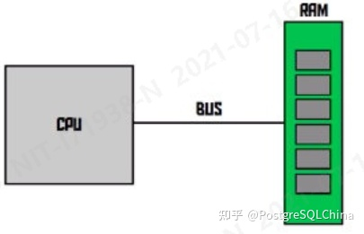
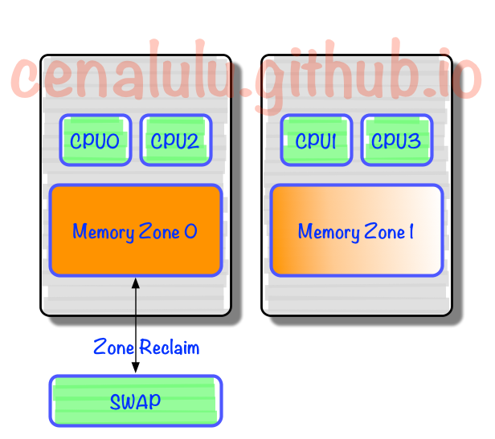

## 大内存, 大并发应用的NUMA内存管理配置策略 - PostgreSQL numa配置  
  
### 作者  
digoal  
  
### 日期  
2021-10-19   
  
### 标签  
PostgreSQL , Oracle , numa    
  
----  
  
## 背景  
## 缘起  
1、以前的CPU和内存通信都是通过北桥芯片进行访问.   
  
  
2、进入多核时代后(特别是ARM芯片), CPU与内存的访问不再过北桥芯片, 因为北桥芯片已经扛不住压力, 而是采用直接内存+间接内存访问的方式. 每个物理CPU都映射了一部分内存(zone, 也叫local memory), 这个cpu有直接访问这些内存(对应zone)的通道, 也叫local access. 如果要访问其他zone的内存, 则需要通过另一个物理CPU来进行访问, 走cpu之间的inter-connect通道, 叫做remote access.   
  
  
3、当运行在某个cpu下的程序需要分配内存时, 优先分配对应zone的local memory, 如果local memory内存不够, 则挤出local memory的page cache, 然后继续在local memory中申请内存(产生swap动作).   
  
  
4、当需要分配内存时, 优先分配local memory.   
  
基于以上的几个原理, 我们来看看大内存应用(例如数据库)会出现什么问题?  
- 1、shared buffer很大, 一次需要申请一大片内存, 由于申请内存时优先使用cpu的local memory, 所以结果就是会集中在某个(或者某一小部分)物理cpu的local memory中.    
- 2、当发生并发访问时, 由于每个会话可能使用不同的CPU在进行处理, 所以访问shared buffer时会发生大量的跨CPU访问, 而且是集中跟第1点所说的那个物理CPU进行inter-connect通信, 所以那个物理CPU就会成为瓶颈.     
- 3、当某个cpu下有memallock请求需要分配内存, 并且这个cpu下的local memory的内存不足时, 会优先挤出这个cpu 的local memory. 所以可能会出现频繁的把shared buffer的内存交换到swap分区的动作, 性能抖动严重.    
  
  
## 如何解决这个问题?   
- 使用huge page, 锁定memory, 直接规避swap.  
    - 如果不用huge page, 那么可以配置`vm.zone_reclaim_mode = 0`使得内存不足时去remote memory(其他CPU的local memory)分配优先于swap out local page.   
        - `vm.zone_reclaim_mode`：当一个内存区域(zone)内部的内存耗尽时，是从其内部进行内存回收还是可以从其他zone进行回收的选项，0表示可以从下一个zone找可用内存；  
- 采用 `numactl --interleave=all `  
    - `numactl —interleave=all`：无视 NUMA 关于 CPU 内存分配的策略，可以使得各个 CPU 区域的内存均匀分配。  
    - 解决大块内存会被集中分配到单个或少量物理CPU的问题.   
- 采用 `kernel.numa_balancing=0`   
    - `kernel.numa_balancing`：是否启用NUMA平衡功能，将任务移动到最近的内存或移动内存到任务执行最近的地方，0表上关闭；  
  
```  
huge page 或 vm.zone_reclaim_mode = 0  
kernel.numa_balancing = 0  
numactl --interleave=all pg_ctl start -D $PGDATA  
```  
  
如果是小业务, 可以使用 cgroup 绑定物理核, 不同的实例绑定不同的物理核, 同时开启numa, 相当于只用local memory.   
- https://github.com/cybertec-postgresql/pg_cgroups  
  
  
## 数据库内核层如何解决这个问题?   
- 支持动态分配内存(前提可能要OS提供这样的内存分配的lib库).   
- 支持huge page.   
  
  
## 参考  
https://github.com/cybertec-postgresql/pg_cgroups  
  
https://www.postgresql.org/message-id/1402267501.41111.YahooMailNeo@web122304.mail.ne1.yahoo.com  
  
https://zhuanlan.zhihu.com/p/394559956  
  
http://cenalulu.github.io/linux/numa/  
  
  
#### [期望 PostgreSQL 增加什么功能?](https://github.com/digoal/blog/issues/76 "269ac3d1c492e938c0191101c7238216")
  
  
#### [类似Oracle RAC架构的PostgreSQL已开源: 阿里云PolarDB for PostgreSQL云原生分布式开源数据库!](https://github.com/ApsaraDB/PolarDB-for-PostgreSQL "57258f76c37864c6e6d23383d05714ea")
  
  
#### [PostgreSQL 解决方案集合](https://yq.aliyun.com/topic/118 "40cff096e9ed7122c512b35d8561d9c8")
  
  
#### [德哥 / digoal's github - 公益是一辈子的事.](https://github.com/digoal/blog/blob/master/README.md "22709685feb7cab07d30f30387f0a9ae")
  
  

  
  
#### [PolarDB 学习图谱: 训练营、培训认证、在线互动实验、解决方案、生态合作、写心得拿奖品](https://www.aliyun.com/database/openpolardb/activity "8642f60e04ed0c814bf9cb9677976bd4")
  
  
#### [购买PolarDB云服务折扣活动进行中, 55元起](https://www.aliyun.com/activity/new/polardb-yunparter?userCode=bsb3t4al "e0495c413bedacabb75ff1e880be465a")
  
  
#### [About 德哥](https://github.com/digoal/blog/blob/master/me/readme.md "a37735981e7704886ffd590565582dd0")
  
