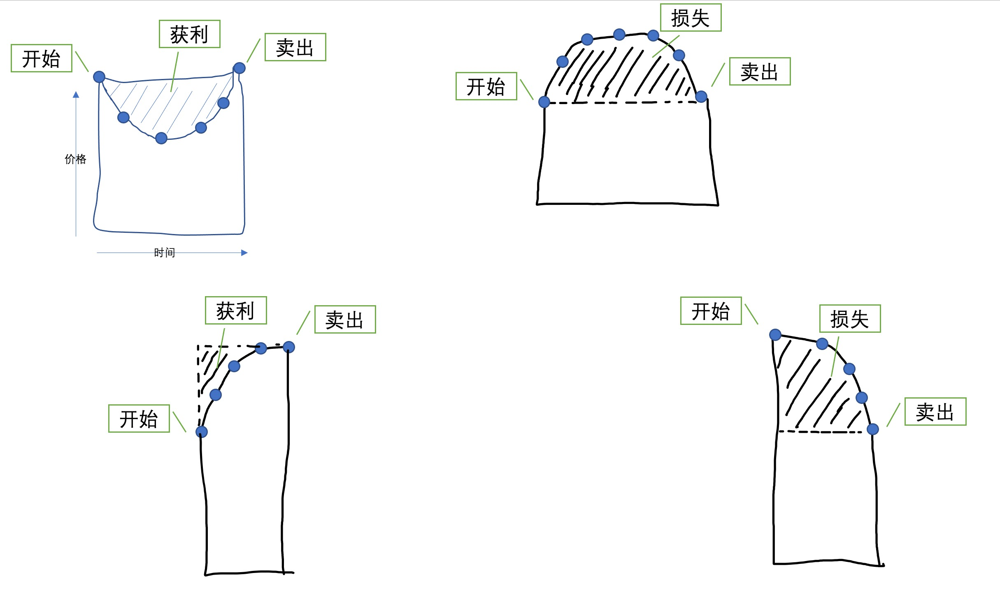

## 德说-第56期, 微笑曲线 - 基金定投    
                                                  
### 作者                                                  
digoal                                                  
                                                  
### 日期                                                  
2021-10-29                                                  
                                                  
### 标签                                                  
PostgreSQL , 定额定投 , 基金                             
                                                  
----                                                  
                                                  
## 背景          
    
视频回放: https://www.bilibili.com/video/BV1x34y1o7mC/        
  
参考: 喜马拉雅, 威尼斯摆渡人.  b站 这是Morty     
        
微笑曲线是什么?         
    
定额定投收益算法:      
- M表示每一期定投的金额.    
- x1表示第1期基金净值, xn表示第n期基金净值.    
- X表示赎回时的基金净值.     
    
算法:     
- 份额: ` M/x1 + M/x2 + ... + M/xn `      
- 成本面积: ` M * n `     
- 卖出面积: ` (M/x1 + M/x2 + ... M/xn) * X `      
- 收益 = 卖出面积 - 成本面积 - 交易手续费 - 基金托管费         
      
    
1、微笑曲线, 收益最高(当然时间也比半边微笑花进去了更多一点, 算起年化实际上一样).     
2、哭脸, 亏损最大.    
3、半边哭脸, 亏损.    
4、半边微笑, 收益.     
    
    
   
为什么股票不能定投?   
- 因为股票一天的波动就可能大于10%, 你没法找到止盈点.   
- 基金一天的波动还是比较稳定的, 所以在止盈时卖出和预期的差异微乎其微.   
    
      
基金定投的核心思想:      
- 坚持定额定投      
- 所有资金集中定投1只或2只(取决于你的资金能不能覆盖所有定投基金的微笑周期), 而不是选择很多只基金.  
- 设置止盈点(例如年化 10%. 因此, 如果你定投了2年才卖, 收益应该在20%以上作为止盈点), 并且严格执行      
    - 有专门的工具可以计算       
    - 按大多数的情况10%年化的概率很高很高       
    - 还有就是不能有丢在哪几年再去看的错误思想. 一定要设置止盈提醒, 不管什么时候, 到达止盈点就全卖, 然后接着往里定投.   
- 需要足够多的本金(保证能跨过一个微笑曲线周期, 有时可能3-5年)      
- 如果不足1年就到了年化收益止盈点卖还是不卖呢? 例如目标年化是10%, 但是定投3个月已经到了3%(换算成年化就是12%), 卖还是不卖?   
    - 也就是说可能持有的基金份额都还不多, 卖掉实际上也赚不了多少, 建议不到一年的话看实际收益率是不是达到年化目标. 到了再卖. 超过一年的话实际收益率要按年化换算来处理, 收益率超过换算后的年化止盈点再赎回.  
    - 实际上这里还要考虑另一个点, 如果3个月的盈利达到3%, 除非你在一年的总周期内还能遇到3次这样的盈利, 否则目标10%的年化就达不到.  这里有个理论就是一份钱一年内能定投进出多少轮, 平均每一轮的盈利是多少的问题.  例如10万一年内进出了4轮(4个微笑周期或者4次达到盈利点后赎回), 每一轮都超过3%的盈利, 那么实际年化还是超过12%. 那么后面就要根据你购买的这只基金的波动节奏来配置你的单次定投的金额多少, 例如1个进出周期是3个月, 那么最好你的资金刚好分布在这3个月内全部定投完. 当然还要考虑周期有时候并非固定的3个月, 也许它又变成6个月呢? 所以核心还是要有足够多的资金可以完成微笑周期.      
      
选择什么基金?      
- 宽基指数基金, 波动比较稳定.         
- 微笑周期的频率够高(周期短, 例如一年可以出现几次超过止盈点的微笑), 微笑的坑够大(够深, 就像蓄水池一样, 深的话能获取到的水才多. 当然还和水坑的口径(也就是微笑周期的长度)也有关系), 基金对标的指数跟踪率(跟踪率高才有参考价值).        
    - 如果1年内出现多个微笑曲线, 每次收益率10%, 实际年化必然超过10%        
- 交易费率、托管费率低的。    
    - 建议选择提前收手续费(即申购基金时收取手续费, 赎回时不收取手续费)的基金类型. 因为后收费(赎回基金时收费)的往往是阶梯收费, 例如3年以上赎回免手续费, 但是不足3年的持有基金时间越短的手续费越贵. 我们定投按止盈点赎回的话, 可能不到3年, 而不到3年赎回手续费可能就很高(比申购时收取手续费的场景高).    
- 很多人推荐 中证500       
- 不要选择主动管理的基金(这个能不能赚钱完全取决于基金经理), 一定要选择指数基金(老百姓就靠它用以上的方法赚钱了).  
    
适合什么人群?      
- 非常适合上班族, 每个月有新增的闲钱.       
- 也适合有闲钱的.       
    - 假设微笑曲线周期为12个月, 你的本金为12万, 每个月定投1万刚好走完一次曲线, 赎回后落袋为安.        
      
一直上涨的收益大? 还是下跌+上涨的收益大?      
- 看获益面积就知道了.  (当然时间也比半边微笑花进去了更多一点, 算起年化实际上一样).     
    
定投点太多, 呈现锯齿状? 看不懂收益?      
- 采用数据库抽稀方法:      
    - 把每连续的N次定投合并为1次.       
    - 经过时间的推移, 最终总会找到那个微笑曲线.      
    
哪里买?    
- 银行app就可以买, 例如招行app      
    
遇到哭脸怎么办?      
- 继续定额定投, 经过更多轮的投入, 以及抽稀重绘后都会遇到微笑曲线的.       
  
再次重申要点:   
- 集中1个宽基指数基金
- 坚持定期定额, 千万不要追涨杀跌.
- 严格止盈
   
## 注意, 定投的止盈点计算方法  
  
- [《分析股票涨跌幅概率分布特征, 用PolarDB模拟股票数据》](../202209/20220909_01.md)  
- [《如何用 PolarDB 证明巴菲特的投资理念 - 包括PolarDB on Docker简单部署》](../202209/20220908_02.md)  
- [《德说-第133期, 用PostgreSQL举证巴菲特向普通投资者传授的投资理念: 长线定投》](../202209/20220906_03.md)  
  
例子里计算年化收益的方法实际上是不准确的, 因为不是每一笔钱都和第一笔一样投入了 `(c1-start_c1+1)/365.0` 年.   
  
实际年化收益大约是2倍于以上算法:    
```  
-- 年化收益率     
round(100 * ((price-cost_avg)/cost_avg) / ((c1-start_c1+1)/365.0), 2) as revenue_year_ratio,   
```  
  
为什么呢?   
  
假设每天投入100元, 按日计息, 一笔钱存1年的年化收益为5%.    
  
1年后实际得到的利息为:     
  
```  
postgres=# select sum(500), -- 总投入   
sum(500)*0.05,   -- 第一天就全部存入的年化收益   
sum(500*0.05*(during/365.0))  -- 每天定投的年化收益   
from generate_series(1,365) as during;  
  
  sum   | ?column? |             sum               
--------+----------+-----------------------------  
 182500 |  9125.00 | 4575.0000000000000000000000  
(1 row)  
```  
  
得到结果:  
  
- 1年共投入 182500  
- 如果第一天一次性投入 182500, 那么利息是 9125  
- 如果是每天投入 500, 那么利息是 4575  
  
```  
postgres=# select 9125.00/4575.0;   
      ?column?        
--------------------  
 1.9945355191256831  
(1 row)  
```  
  
所以, 定投的实际年化利息目标大概应该设置为一把梭哈的一半左右.    
  
<b>定投的止盈点正确计算方法</b>   
   
例如你期望的年化收益是10%, 那么按本文提供的算法, 定投的止盈点应该设置为5%就卖出.    
  
如果再考虑复利, 那么止盈点是动态变化的, 例如未考虑复利的止盈点是5%, 那么考虑复利则和持有年限有关.   
  
```
postgres=# select (1.05^5 - 1)/5;
        ?column?        
------------------------
 0.05525631250000000000  -- 持有5年, 考虑复利止盈点 ~= 5.5% 
(1 row)

postgres=# select (1.05^10 - 1)/10;
        ?column?        
------------------------
 0.06288946267774414000  -- 持有10年, 考虑复利止盈点 ~= 6.3% 
(1 row)
```
  
  
    
    
    
    
    
    
  
#### [期望 PostgreSQL 增加什么功能?](https://github.com/digoal/blog/issues/76 "269ac3d1c492e938c0191101c7238216")
  
  
#### [类似Oracle RAC架构的PostgreSQL已开源: 阿里云PolarDB for PostgreSQL云原生分布式开源数据库!](https://github.com/ApsaraDB/PolarDB-for-PostgreSQL "57258f76c37864c6e6d23383d05714ea")
  
  
#### [PostgreSQL 解决方案集合](https://yq.aliyun.com/topic/118 "40cff096e9ed7122c512b35d8561d9c8")
  
  
#### [德哥 / digoal's github - 公益是一辈子的事.](https://github.com/digoal/blog/blob/master/README.md "22709685feb7cab07d30f30387f0a9ae")
  
  

  
  
#### [PolarDB 学习图谱: 训练营、培训认证、在线互动实验、解决方案、生态合作、写心得拿奖品](https://www.aliyun.com/database/openpolardb/activity "8642f60e04ed0c814bf9cb9677976bd4")
  
  
#### [购买PolarDB云服务折扣活动进行中, 55元起](https://www.aliyun.com/activity/new/polardb-yunparter?userCode=bsb3t4al "e0495c413bedacabb75ff1e880be465a")
  
  
#### [About 德哥](https://github.com/digoal/blog/blob/master/me/readme.md "a37735981e7704886ffd590565582dd0")
  
