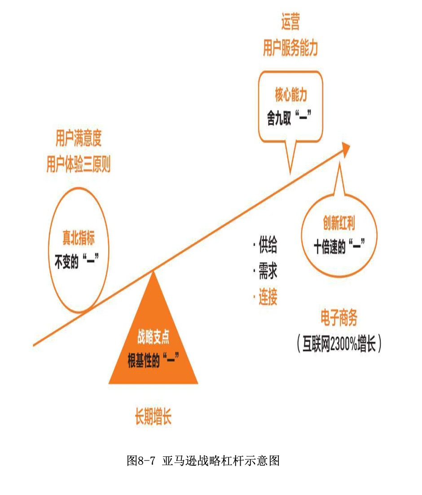
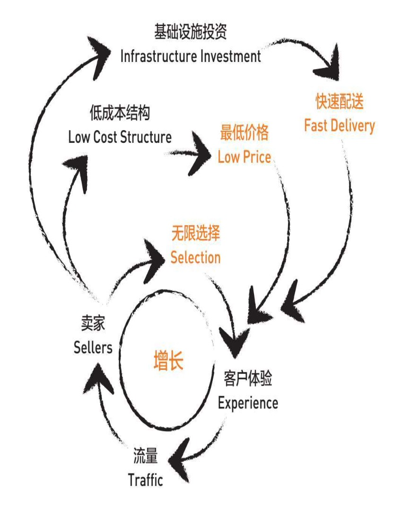
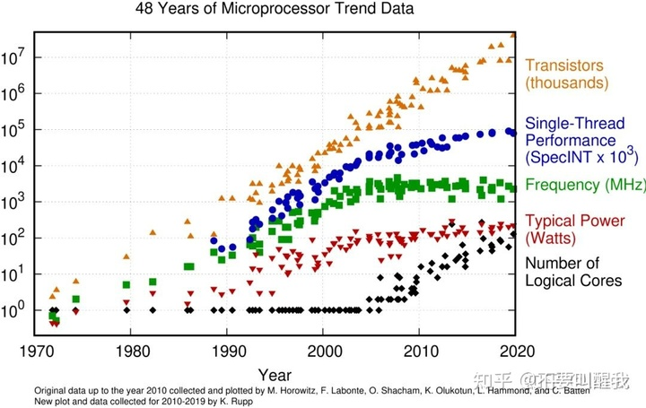

## 德说-第61期, 第二曲线创新笔记: 如何设计战略与增长飞轮(亚马逊例子, 开源例子)     
    
### 作者    
digoal    
    
### 日期    
2021-11-09    
    
### 标签    
PostgreSQL , 开源     
    
----    
    
## 背景    
视频回放: https://www.bilibili.com/video/BV1SQ4y1S7J4/   
    
参考李善友, 第二曲线创新     
    
## 亚马逊的案例    
      
图1  战略杠杆     
    
    
    
图2  增长飞轮    
      
    
      
### 1 战略杠杆设计    
    
- 创新红利 (供需连去找)     
    - 十倍1       
    - 连接端: 电子商务. 互联网2300%增长.        
    - DB: mysql, pg 开源超越商业化数据库, mysql, pg逐渐成为标准化SQL方言.        
    - 2025 52%以上数据库部署在云基础设施之上.       
  
   
这张图看到了tps的需求增长速度最快, 说明需求增长最快.    
单机性能从主频提升疲软, 到单线程性能提升疲软, 目前靠核心数量在支撑, 单机性能终究会遇到极限点.    
在极限点来临之前, 为了满足不停增长的需求, 分布式必须是未来. 必须提前布局.    
    
- 核心能力     
    - 舍9取1     
    - 运营. 用户服务能力.    
    - DB: 兼容pg+mysql的云原生开源产品与生态运营    
    
    
- 真北指标  (真问题、长期目标, 企业增长)     
    - 永恒1     
    - 用户满意度, 用户体验三原则    
    - DB: 数据库用户体验三原则: 性价比、易用、企业级品质     
    
- 战略支点 (长期增长) (使命、第一性原理、十年不变的东西)        
    - 根基1      
    - 长期增长    
    - DB: 用户长期价值    
    - 当用户把你当成水和空气时, 生态就自然形成了    
    - 长期价值体现在: IaaS, DBaaS, 品牌影响力, 服务, 培训, 滚雪球(一起建设生态, 以小博大), 更大基数的用户群体意味着跟多的合作和转化机会.     
    - 注意: 到底能撬动多少, 需要数据支撑.  
    
    
### 2 增长飞轮设计       
    
亚马逊增长飞轮 (短期增长)    :     
- 卖家 -> 低成本结构 -> 最低价格(客户体验) -> 买家 -> 流量 -> 卖家    
- 卖家 -> 无限选择(客户体验) -> 买家 -> 流量 -> 卖家    
- 卖家 -> 基础设施投资 -> 快速配送(客户体验) -> 买家 -> 流量 -> 卖家    
     
苹果:     
- 手机用户 - 产品 - 打动人心         
  
Netflix:     
- 付费用户 - 原创内容 - 又好又多         
    
开源产品:     
- 开源产品 -> 稳定性、安全性等, DBaaS 云服务 -> 企业级品质(用户体验) -> 用户    
- 开源产品 -> 分布式、HTAP等, 开源 -> 性价比(用户体验) -> 用户    
- 开源产品 -> K8S开源管控, DBaaS 云服务, 兼容mysql|pg SQL方言 -> 易用(用户体验) -> 用户    
- 用户 -> 流量|商机|职业红利 -> 生态企业, 开发者, 学生     
- 生态企业, 开发者, 学生 -> 开源贡献, 生态产品|服务, 人才补给 -> 开源产品    
  
开源数据库产品作为基础产品, 要存活下来就必须把自己变成生态中的水和空气.  和生态中的其他元素结成命运共同体.          
    
创新的一扇窗: 生物学的侧枝盲端, 企业创新团队的边缘分化.  创新与其更好不如不同, 更好永远干不过在位企业.  
  
思考:  
- 比尔盖茨车库创业, 成功的关键是吸收了军工科技开放给民用的技术. 直接砍掉了前期研发成本.
- 马斯克space-x成本能降低几千倍的原因, 吸收了开源、民用(软件+开放硬件解决方案)的技术稳定性红利, 砍掉了必须依赖军工技术的成本.   
- 数据库一定要用C语言开发吗? 
    - 用rust行不行? 从人才数量、学习成本、开发出的产品稳定性还有语言的协作效率、周边生态综合来看什么语言你觉得比较有潜力的语言有哪些?  
- 数据库一定要安装才能使用吗?  
    - 搞成lib库行不行, 触达更广泛的端的场景.  
    
    
  
#### [期望 PostgreSQL 增加什么功能?](https://github.com/digoal/blog/issues/76 "269ac3d1c492e938c0191101c7238216")
  
  
#### [类似Oracle RAC架构的PostgreSQL已开源: 阿里云PolarDB for PostgreSQL云原生分布式开源数据库!](https://github.com/ApsaraDB/PolarDB-for-PostgreSQL "57258f76c37864c6e6d23383d05714ea")
  
  
#### [PostgreSQL 解决方案集合](https://yq.aliyun.com/topic/118 "40cff096e9ed7122c512b35d8561d9c8")
  
  
#### [德哥 / digoal's github - 公益是一辈子的事.](https://github.com/digoal/blog/blob/master/README.md "22709685feb7cab07d30f30387f0a9ae")
  
  

  
  
#### [PolarDB 学习图谱: 训练营、培训认证、在线互动实验、解决方案、生态合作、写心得拿奖品](https://www.aliyun.com/database/openpolardb/activity "8642f60e04ed0c814bf9cb9677976bd4")
  
  
#### [购买PolarDB云服务折扣活动进行中, 55元起](https://www.aliyun.com/activity/new/polardb-yunparter?userCode=bsb3t4al "e0495c413bedacabb75ff1e880be465a")
  
  
#### [About 德哥](https://github.com/digoal/blog/blob/master/me/readme.md "a37735981e7704886ffd590565582dd0")
  
