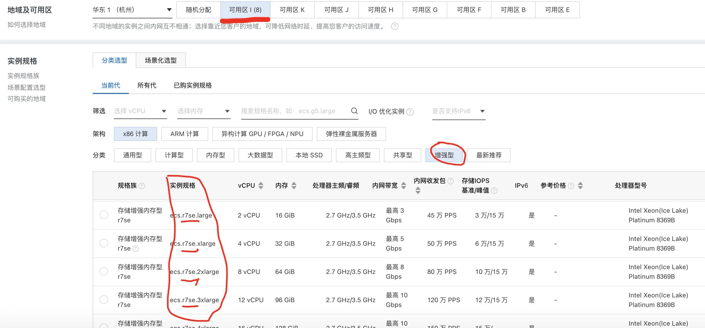
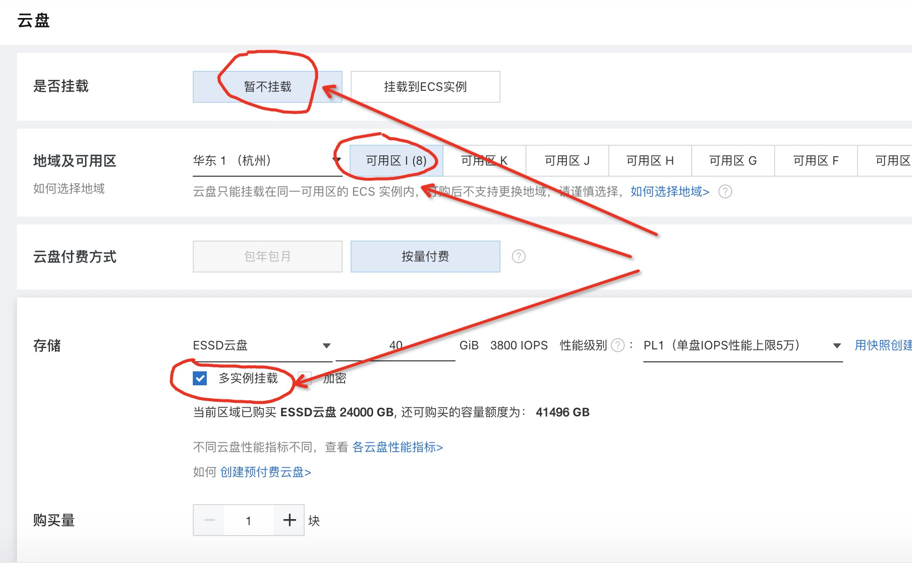
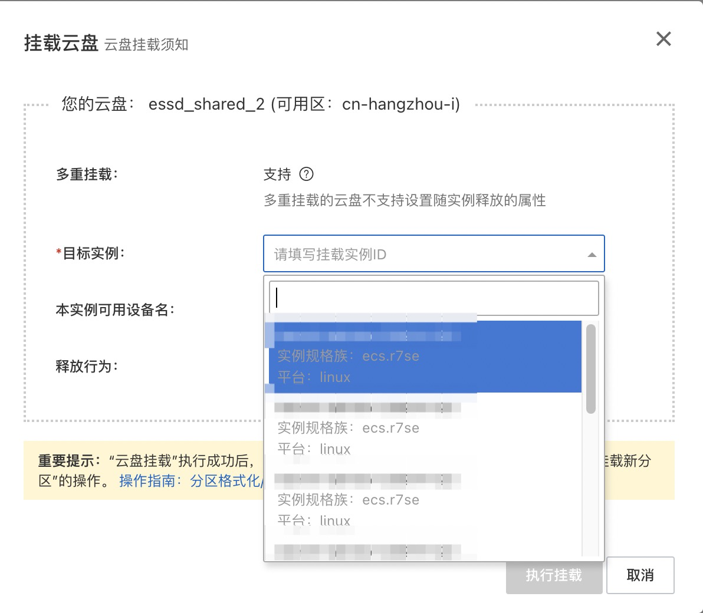

## PolarDB for PostgreSQL 开源版本 + 阿里云多机挂载共享ESSD云盘  
            
### 作者            
digoal            
            
### 日期            
2021-11-22           
            
### 标签         
PostgreSQL , 云盘 , PolarDB , 多机器挂载    
          
----          
          
## 背景          
阿里云多机挂载共享ESSD云盘即将发布, 共享云盘支持多机挂载, 支撑例如Oracle RAC, PolarDB PG存储计算分离等数据库架构.  
  
## 测试环境  
杭州, 可用区I, 增强型.   
- ecs.r7se.4xlarge   
  
  
  
购买4台 相同可用区ECS  
- 8c64g, IOPS(基础/突发): 10万/15万, 存储带宽(基础/突发): 6Gb/10Gb    
- 172.25.9.74 rw节点  
- 172.25.9.71 ro节点  
- 172.25.9.72 ro节点   
- 172.25.9.73 ro节点   
  
  
购买与ECS相同可用区ESSD云盘, 配置多机器挂载  
https://help.aliyun.com/document_detail/262105.htm  
  
- 12TB ESSD PL3   
- 601800 IOPS   
   
  
  
  
  
```  
[root@iZbp11iqkys8rn74nvrec8Z ~]# lsblk  
NAME        MAJ:MIN RM  SIZE RO TYPE MOUNTPOINT  
nvme0n1     259:0    0  100G  0 disk   
└─nvme0n1p1 259:1    0  100G  0 part /  
nvme1n1     259:2    0 11.7T  0 disk   
[root@iZbp11iqkys8rn74nvrec9Z ~]# lsblk  
NAME        MAJ:MIN RM  SIZE RO TYPE MOUNTPOINT  
nvme0n1     259:0    0  100G  0 disk   
└─nvme0n1p1 259:1    0  100G  0 part /  
nvme1n1     259:2    0 11.7T  0 disk   
[root@iZbp11iqkys8rn74nvrecbZ ~]# lsblk  
NAME        MAJ:MIN RM  SIZE RO TYPE MOUNTPOINT  
nvme0n1     259:0    0  100G  0 disk   
└─nvme0n1p1 259:1    0  100G  0 part /  
nvme1n1     259:2    0 11.7T  0 disk   
[root@iZbp11iqkys8rn74nvrecaZ ~]# lsblk  
NAME        MAJ:MIN RM  SIZE RO TYPE MOUNTPOINT  
nvme0n1     259:0    0  100G  0 disk   
└─nvme0n1p1 259:1    0  100G  0 part /  
nvme1n1     259:2    0 11.7T  0 disk   
```  
  
共享云盘的性能指标和计算公式. 同时受到ECS规格和存储规格限制.   
- min(sum(ECS), ESSD)    
- min(ECS, ESSD)  
- ESSD IOPS 计算公式: https://help.aliyun.com/document_detail/122389.html  
- r7se IOPS 计算公式: https://help.aliyun.com/document_detail/25378.html#r7se  
  
例如  
- ESSD的IOPS指标是10万, 3台ECS同时挂载这块盘  
- ECS1的IOPS是2万  
- ECS2的IOPS是6万  
- ECS3的IOPS是12万  
  
那么  
- 所有ECS加起来的IOPS最大是10万  
- ECS1 这块盘能跑到的最大IOPS是2万, 而且还要看ecs2,ecs3的争抢.   
- ECS2 这块盘能跑到的最大IOPS是6万, 而且还要看ecs1,ecs3的争抢.   
- ECS3 这块盘能跑到的最大IOPS是10万, 而且还要看ecs1,ecs2的争抢.   
  
  
  
## PolarDB 部署过程  
参考  
[《PolarDB for PostgreSQL 开源版本 on 共享存储块设备 多机部署实践》](../202111/20211108_01.md)    
  
  
1、部署os (所有ECS)  
  
跳过234.  
  
5、安装pfs软件 (rw, ro ECS)  
  
照样执行  
  
6、配置pfs (rw, ro ECS)  
  
略有修改  
  
块设备从nvme0n1 改成 nvme1n1  
  
块设备初始化  
注意: 只在RW节点执行PFS操作来格式化共享块设备即可：  
  
```  
pfs -C disk mkfs nvme1n1    
  
  
Inited filesystem(12884901888000 bytes), 1200 chunks, 2560 blktags, 2048 direntries, 2048 inodes per chunk  
making paxos file  
init paxos lease  
making journal file  
pfs mkfs succeeds!  
```  
  
块设备挂载  
在RW, RO节点上，分别启动PFS，挂载共享盘：  
  
```  
/usr/local/polarstore/pfsd/bin/start_pfsd.sh -p nvme1n1    
  
vi /etc/rc.local    
    
/usr/local/polarstore/pfsd/bin/start_pfsd.sh -p nvme1n1    
# /usr/local/polarstore/pfsd/bin/stop_pfsd.sh nvme1n1    
```  
  
7、剩余的步骤照样执行, 注意:  
- 增加了1个RO节点, 需要增加replica3.  
- pg_hba.conf 里面注意修改IP  
- recovery.conf 里面注意修改IP  
- 同时注意: 涉及块存储 nvme0n1 修改为 nvme1n1     
  
  
8、pgbench性能压测  
- 初始化数据  
- 读负载均衡  
- 读写混合  
  
待补充  
  
  
  
  
  
      
  
#### [期望 PostgreSQL 增加什么功能?](https://github.com/digoal/blog/issues/76 "269ac3d1c492e938c0191101c7238216")
  
  
#### [类似Oracle RAC架构的PostgreSQL已开源: 阿里云PolarDB for PostgreSQL云原生分布式开源数据库!](https://github.com/ApsaraDB/PolarDB-for-PostgreSQL "57258f76c37864c6e6d23383d05714ea")
  
  
#### [PostgreSQL 解决方案集合](https://yq.aliyun.com/topic/118 "40cff096e9ed7122c512b35d8561d9c8")
  
  
#### [德哥 / digoal's github - 公益是一辈子的事.](https://github.com/digoal/blog/blob/master/README.md "22709685feb7cab07d30f30387f0a9ae")
  
  

  
  
#### [PolarDB 学习图谱: 训练营、培训认证、在线互动实验、解决方案、生态合作、写心得拿奖品](https://www.aliyun.com/database/openpolardb/activity "8642f60e04ed0c814bf9cb9677976bd4")
  
  
#### [购买PolarDB云服务折扣活动进行中, 55元起](https://www.aliyun.com/activity/new/polardb-yunparter?userCode=bsb3t4al "e0495c413bedacabb75ff1e880be465a")
  
  
#### [About 德哥](https://github.com/digoal/blog/blob/master/me/readme.md "a37735981e7704886ffd590565582dd0")
  
