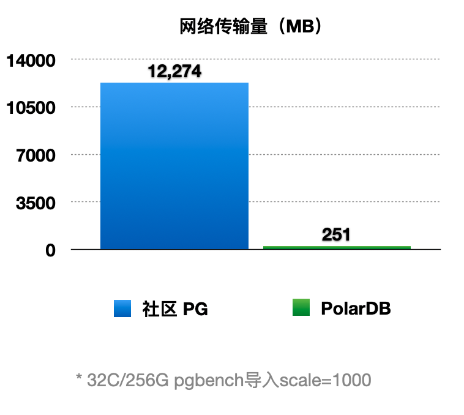

## 一起学PolarDB - 第3期 - 为什么不能无限增加只读实例?     
                
### 作者         
digoal                
                
### 日期                
2021-12-29               
                
### 标签                
PostgreSQL , PolarDB                 
                
----                
                
## 背景         
懂PostgreSQL, 学PolarDB不难, 就好像有九阳神功护体, 可以快速融会贯通.       
对于DBA只要学会PolarDB精髓即可.       
对于开发者来说不需要学习, 使用PolarDB和PostgreSQL一样.                  
      
#### 为什么不能无限增加只读实例?   
https://www.bilibili.com/video/BV1mS4y1M7jc/  
  
社区版本:   
  
增加只读节点会产生什么消耗?  
1、读取上游(通常是主节点)的WAL, 产生WAL的读取开销, 如果不是DIO, 还会写page cache(消耗内存)  
2、产生网络开销  
3、产生CPU开销  
  
资源的有限性:   
- 存储的IOPS有限  
- 内存有限  
- 网络带宽有限  
- CPU资源有限  
  
这就结束了吗? 所以PG有了级联复制:   
- 级联复制解决上游节点的单点压力问题.   
  
但是这就完了吗? 如果你要无限制创建只读节点, 钱会是个大问题:   
- 每个只读实例需要至少与主节点相当的硬件资源配置  
    - 如果只读实例的性能太弱, 会导致只读实例延迟很高, 甚至永远追不上主实例.    
    - 存储空间必须大于等于主实例, 如果存储空间不够会导致打爆.    
  
  
PolarDB:      
PolarDB 计算存储分离架构版本.   
- 主实例与只读实例共享存储. 所以解决了大量创建只读实例引入的存储成本问题.    
- 主实例与只读实例之间只传输wal meta信息(header, pageid), 不含wal日志的payload内容(即数据部分), 网络传输量减少了98%. 
    -     
- RO  RW的计算资源可以灵活配置, 不强制要求RO 必须大于等于RW配置, 不会导致RO延迟.     
  
由于RO的资源消耗更低, PolarDB可以创建更多RO节点.   
同时RO RW共享一份存储, PolarDB相比社区版本成本更低.   
    
本期问题1:       
请问为什么PolarDB PG的RW节点不需要传输完整的WAL给RO节点?    
- a. PolarDB RW节点通过WAL归档文件共享给RO节点  
- b. PolarDB RO和RW节点共享一份存储, WAL可以被RO节点直接读取.   
- c. PolarDB RO节点recovery操作不需要用到完整的wal内容    
- d. PolarDB 不需要WAL日志  
      
答案:      
- b     
  
解释:  
- RO和RW节点共享一份存储, WAL的内容RO已经可读, 不需要再传输完整WAL, 只需要传输WAL的meta信息给RO节点.   
  
本期问题2:       
请问PolarDB PG的RW节点传输给RO节点的WAL包括什么信息?   
- a. datablock content  
- b. header   
- c. payload      
- d. pageid     
      
答案:      
- bd    
  
解释:  
- wal 的完整信息包括 header, pageid, payload. 由于PolarDB PG采用共享存储架构, RO可以直接从共享存储读到WAL的内容, 所以RW传输给RO的是wal meta信息, 包括header, pageid.   
  
  
#### [期望 PostgreSQL 增加什么功能?](https://github.com/digoal/blog/issues/76 "269ac3d1c492e938c0191101c7238216")
  
  
#### [PolarDB for PostgreSQL云原生分布式开源数据库](https://github.com/ApsaraDB/PolarDB-for-PostgreSQL "57258f76c37864c6e6d23383d05714ea")
  
  
#### [PostgreSQL 解决方案集合](https://yq.aliyun.com/topic/118 "40cff096e9ed7122c512b35d8561d9c8")
  
  
#### [德哥 / digoal's github - 公益是一辈子的事.](https://github.com/digoal/blog/blob/master/README.md "22709685feb7cab07d30f30387f0a9ae")
  
  

  
  
#### [PolarDB 学习图谱: 训练营、培训认证、在线互动实验、解决方案、生态合作、写心得拿奖品](https://www.aliyun.com/database/openpolardb/activity "8642f60e04ed0c814bf9cb9677976bd4")
  
  
#### [购买PolarDB云服务折扣活动进行中, 55元起](https://www.aliyun.com/activity/new/polardb-yunparter?userCode=bsb3t4al "e0495c413bedacabb75ff1e880be465a")
  
  
#### [About 德哥](https://github.com/digoal/blog/blob/master/me/readme.md "a37735981e7704886ffd590565582dd0")
  
