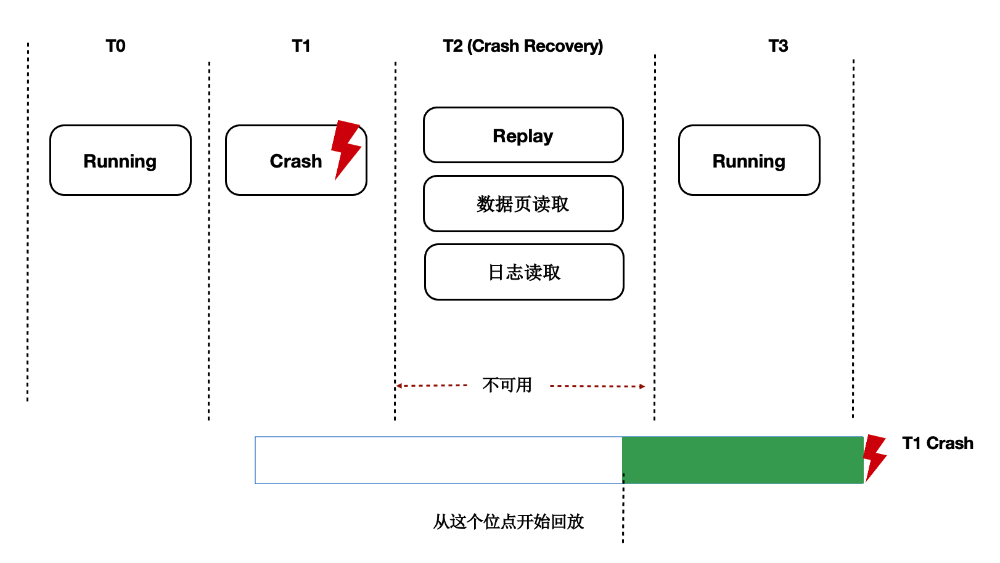
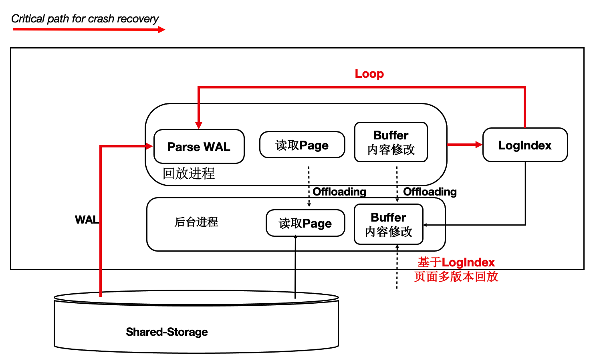
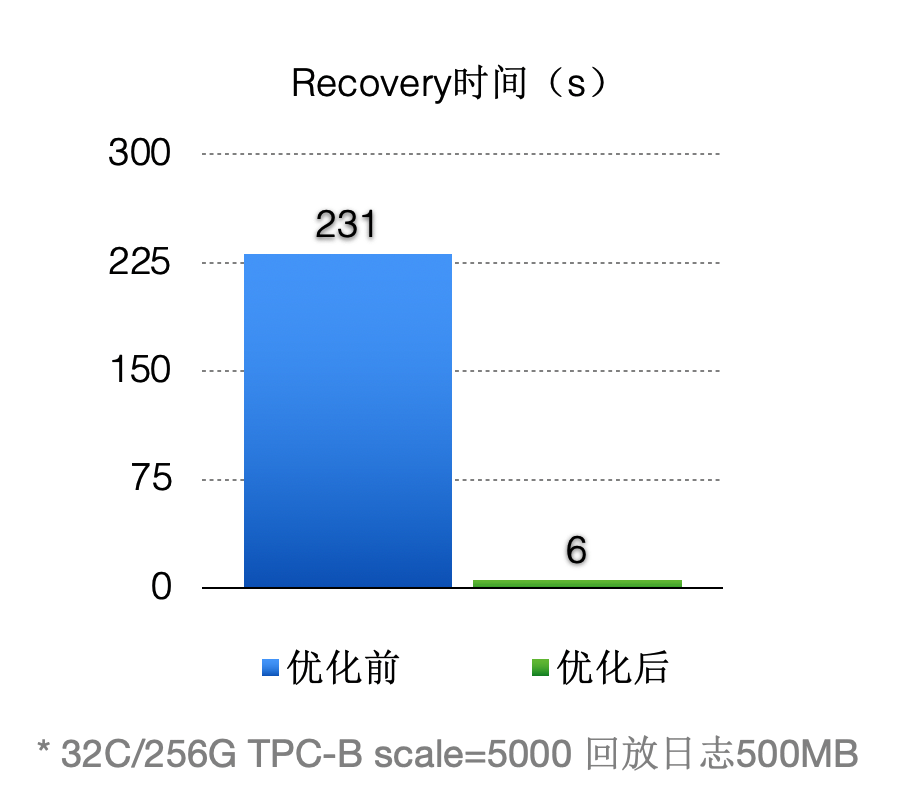

## 一起学PolarDB - 第7期 - 为什么数据库越大崩溃恢复越慢?    
                          
### 作者                   
digoal                          
                          
### 日期                          
2021-12-30                         
                          
### 标签                          
PostgreSQL , PolarDB                           
                          
----                          
                          
## 背景          
懂PostgreSQL, 学PolarDB不难, 就好像有九阳神功护体, 可以快速融会贯通.                 
对于DBA只要学会PolarDB精髓即可.                 
对于开发者来说不需要学习, 使用PolarDB和PostgreSQL一样.                            
      
#### 为什么数据库越大崩溃恢复越慢?   
https://www.bilibili.com/video/BV1EL4y1474Z/   
   
社区版本:     
  
  
  
崩溃后, 需要从上一次完整检查点开始将所有这个时刻以来所有wal日志读取并进行恢复. 为什么慢?  
- 1、startup 为单一进程. 再加上wal apply属于同步IO, 所以容易变慢.   
- 2、大实例, 通常来讲会使用较大内存, 较好IO的机器, 为了充分利用内存以提高SQL稳定性、特别是写性能(尽量的利用内存), 通常来说检查点跨度都较大(跨度越大,刷脏越不频繁, 所以可以更好的利用shared buffer), 可能跨越数十GB, 需要recovery的WAL日志非常多. 增加恢复耗时.    
    - 另一方面, 检查点跨度大还可以降低full page write带来的WAL的空间占用. 减少wal的输出.  
- 3、恢复过程中, 被恢复多block有可能会被挤出shared buffer, 然后再次恢复到这个block对应的wal时, 又不得不从datafile读取出来+wal record进行恢复, 导致IO增加, 也是增加耗时的原因之一.   
       
PolarDB:      
  
  
采用log index  支持lazy recovery.  
- startup 进程仅仅将wal的meta信息解析出来, 并按key: pageid, value: lsn(wal address) 重新组合后存储在logindex中(在shared buffer中存在的page, 标记为outdata(过期), 不存在的页则直接写logindex文件). 所以startup进程不需要读数据文件, 不需要apply. 非常快.  
     - wal解析完成后, 数据库就算恢复完成, 可以读写了.  
- 那么什么时候去执行真正的apply呢?   
    - 当session读取到某个datablock(page)时, 从logindex 找到对应的wal meta信息, 再从wal文件中获取对应的wal record进行apply.  
    - 由于session是并行的, 所以recovery更快.   
  
PolarDB的思路是: 异步化(offload 给 session, 按需恢复)、并行化(session 可并行)  
  
效果很显著  
  
  
    
本期问题1:      
为什么数据库越大崩溃恢复越慢?    
- a. wal日志量大          
- b. starup采用单一进程并且wal apply是同步IO     
- c. 恢复过程中有些block会被挤出shared buffer, 再次恢复同样的数据块增加了IO, 导致变慢      
- d. 需要恢复完所有的wal  
                
答案:                
- abcd        
            
解释:            
- 参考本文内容       
    
本期问题2:      
为什么PolarDB崩溃恢复比社区版本快很多?      
- a. PolarDB支持logindex特性, 存储了wal日志的meta信息和page的映射关系   
- b. PolarDB把崩溃恢复offload到session了, 即实现了异步, 又实现了后台并行.         
- c. PolarDB在崩溃恢复时不需要恢复data page的内容         
- d. PolarDB不需要崩溃恢复     
                
答案:                
- abc          
            
解释:            
- 参考本文内容      
         
  
#### [期望 PostgreSQL 增加什么功能?](https://github.com/digoal/blog/issues/76 "269ac3d1c492e938c0191101c7238216")
  
  
#### [PolarDB for PostgreSQL云原生分布式开源数据库](https://github.com/ApsaraDB/PolarDB-for-PostgreSQL "57258f76c37864c6e6d23383d05714ea")
  
  
#### [PostgreSQL 解决方案集合](https://yq.aliyun.com/topic/118 "40cff096e9ed7122c512b35d8561d9c8")
  
  
#### [德哥 / digoal's github - 公益是一辈子的事.](https://github.com/digoal/blog/blob/master/README.md "22709685feb7cab07d30f30387f0a9ae")
  
  

  
  
#### [PolarDB 学习图谱: 训练营、培训认证、在线互动实验、解决方案、生态合作、写心得拿奖品](https://www.aliyun.com/database/openpolardb/activity "8642f60e04ed0c814bf9cb9677976bd4")
  
  
#### [购买PolarDB云服务折扣活动进行中, 55元起](https://www.aliyun.com/activity/new/polardb-yunparter?userCode=bsb3t4al "e0495c413bedacabb75ff1e880be465a")
  
  
#### [About 德哥](https://github.com/digoal/blog/blob/master/me/readme.md "a37735981e7704886ffd590565582dd0")
  
